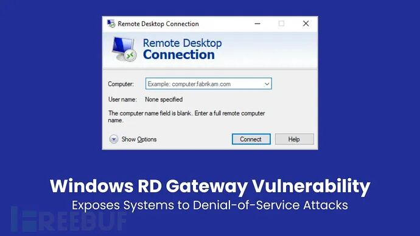

# Windows远程桌面网关出现重大漏洞

<!-- vulwiki-editorial-rebuild:system-misc -->
## 条目范围与校订

- 本文对象：Windows Remote Desktop Gateway
- 文献类型：RD Gateway DoS通告
- 版本、权限及部署边界：需启用网关角色及网络可达；竞争时序，认证条件未明确；文列Server2016–2025
- 核验状态：仅重建文本校订；未执行文中代码、PoC 或扫描，未把截图或转载声明记为本站复现

### 具体结论与待核项

以下为原归档的逐项勘误与证据缺口；可由文本确定的问题已在下文订正，仍缺来源的事实保持待核。

1. 不是任意开启RDP的Windows；类型混淆与竞争关系缺代码说明，不能把根因写成已验证
2. 现有连接保持/新连接阻断具有具体影响信息，应与普通系统DoS区别保留但需微软原文
3. KB和build明细未给MSRC链接，未公开PoC和未见在野限2025-01-15；MFA不必修复预认证DoS
4. 补CVE元数据并清营销；与misc251不同CVE不同机制不可因标题相似合并

### 操作风险

原文技术操作的实际副作用未复现核验；按其请求/代码评估状态变更、凭据暴露和业务影响

技术请求、代码与实验方法按原文保留；其中的破坏性动作仅限授权、可恢复的隔离环境。缺失代码、参数或版本事实不猜补。

### 来源追溯

- 原文参考链接（未重新核验）：<https://mp.weixin.qq.com/s?__biz=MjM5NjA0NjgyMA==&mid=2651253272&idx=1&sn=82468d927062b7427e3ca8a912cb2dc7&scene=21#wechat_redirect>
- 原始披露 URL 未确认；既有归档来源标签保留，不能替代原始公告

### 归档技术正文

跳舞的花栗鼠  FreeBuf   2025-01-15 10:57  
  
  
  
  
微软披露了其Windows远程桌面网关（RD Gateway）中的一个重大漏洞，该漏洞可能允许攻击者利用竞争条件，导致拒绝服务（DoS）攻击。该漏洞被标识为CVE-2025-21225，已在2025年1月的补丁星期二更新中得到修复。  
  
  
  
  
  
竞争条件漏洞是指系统行为依赖于并发操作的时序或事件序列，攻击者利用这种同步缺失。在CVE-2025-21225背景下，当RD Gateway服务处理网络请求时，会出现竞争条件，导致漏洞产生。  
  
  
**Windows远程桌面网关漏洞现状**  
  
  
  
该漏洞源于类型混淆问题，归类于CWE-843：  
使用不兼容类型访问资源。  
攻击者可利用与网络堆栈绑定的RD Gateway组件，通过互联网远程发起攻击。  
一旦成功触发竞争条件，攻击者就能破坏RD Gateway服务的可用性。  
虽然现有连接不受影响，但新连接可能会被阻断，反复利用该漏洞可能导致服务无法使用。  
  
  
这种拒绝服务攻击对依赖RD Gateway进行安全远程访问的组织构成严重威胁。尽管漏洞不会导致数据窃取或远程代码执行，但对系统可用性的影响不容小觑。  
  
  
该漏洞影响多个版本的Windows Server，包括：  
  
Windows Server 2016（核心和标准安装）  
  
Windows Server 2019（核心和标准安装）  
  
Windows Server 2022（核心和标准安装）  
  
Windows Server 2025（核心和标准安装）  
  
  
每个受影响版本都已收到具有唯一标识符的安全更新。例如：  
  
Windows Server 2019：更新 KB5050008（版本 10.0.17763.6775）  
  
Windows Server 2022：更新 KB5049983（版本 10.0.20348.3091）  
  
Windows Server 2025：更新 KB5050009（版本 10.0.26100.2894）  
  
  
利用该漏洞需要攻击者赢得竞争条件，这对技术高超的威胁者来说具有挑战性，但并非不可能。因其可能扰乱关键服务，该漏洞被评为“重要”级别，但目前尚无公开的利用代码。  
  
  
截至2025年1月15日，没有迹象表明CVE-2025-21225在野外被积极利用，也未披露针对该漏洞的概念验证（PoC）或公共利用工具。  
  
  
**缓解措施和建议**  
  
  
  
微软已发布补丁修复此漏洞。  
强烈建议组织立即应用这些更新以降低利用风险。  
  
  
此外，还需确保强大的网络监控以检测针对RD Gateway服务的异常活动，通过防火墙规则限制RD Gateway仅对可信网络开放，并考虑增加VPN或多重身份验证等额外安全措施来保障远程访问安全。  
  
  
2025年1月的“补丁星期二”更新共修复了微软生态系统中的159个漏洞，包括8个零日漏洞和多个关键的远程代码执行漏洞。尽管CVE-2025-21225未被列为关键漏洞，但其对服务可用性的潜在影响凸显了主动补丁管理和系统加固的重要性。  
  
  
随着网络威胁不断演变，组织必须保持警惕，及时应用安全更新并监控系统是否有被入侵迹象。  
  
  
【  
FreeBuf粉丝交流群招新啦！  
  
在这里，拓宽网安边界  
  
甲方安全建设干货；  
  
乙方最新技术理念；  
  
全球最新的网络安全资讯；  
  
群内不定期开启各种抽奖活动；  
  
FreeBuf盲盒、大象公仔......  
  
扫码添加小蜜蜂微信回复「加群」，申请加入群聊】  
  
  
  
  
  
  
  
  
  
  
  
  
  
  
  
  
  

---

> 来源：gelusus/wxvl（微信公众号漏洞文章自动归档，原始披露 URL 尚未确认，现有链接按来源追溯区分别标注）
