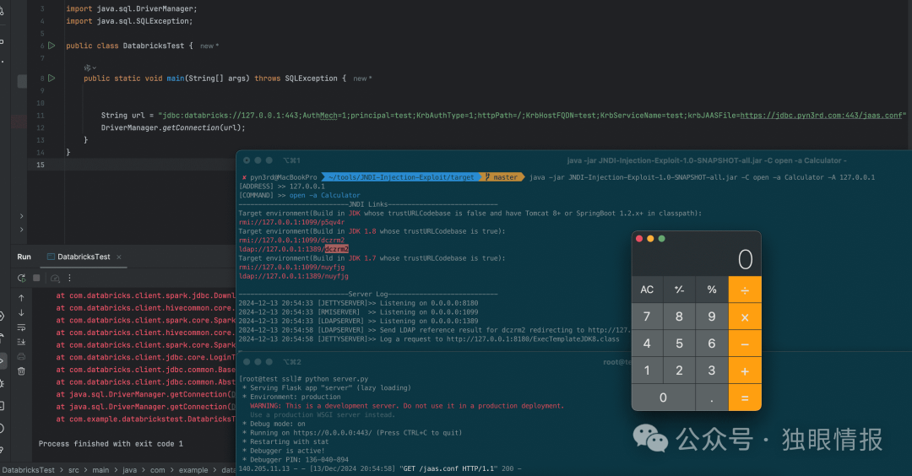

# [PoC] Databricks 远程代码执行漏洞 CVE-2024-49194

<!-- vulwiki-editorial-rebuild:system-misc -->
## 条目范围与校订

- 本文对象：Databricks JDBC driver
- 文献类型：JDBC漏洞研究快报
- 版本、权限及部署边界：文称<=2.6.38，>=2.6.40修；需要能控制JDBC连接URL/krbJAASFile及对应JVM/网络/JNDI条件
- 核验状态：仅重建文本校订；未执行文中代码、PoC 或扫描，未把截图或转载声明记为本站复现

### 具体结论与待核项

以下为原归档的逐项勘误与证据缺口；可由文本确定的问题已在下文订正，仍缺来源的事实保持待核。

1. 标题Databricks平台RCE过宽，实际为客户端JDBC驱动参数入口，不能自动推出Databricks云服务被攻陷
2. 2.6.39状态缺口需公告确认；当前Runtime已受保护的当时声明须时间化与实际驱动依赖对照
3. 仅pyn3rd原研究链接，未附Databricks公告；trustURLCodebase/trustSerialData缓解受JDK版本/本地gadget/其他JNDI路径影响不能作通用完整修复
4. 本文无PoC正文，标链接型通告而非已复现

### 操作风险

原文技术操作的实际副作用未复现核验；按其请求/代码评估状态变更、凭据暴露和业务影响

技术请求、代码与实验方法按原文保留；其中的破坏性动作仅限授权、可恢复的隔离环境。缺失代码、参数或版本事实不猜补。

### 来源追溯

- 原文参考链接（未重新核验）：<https://blog.pyn3rd.com/2024/12/13/Databricks-JDBC-Attack-via-JAAS/>
- 原始披露 URL 未确认；既有归档来源标签保留，不能替代原始公告

### 归档技术正文

 独眼情报   2024-12-20 12:33  
  
  
  
  
Databricks JDBC 驱动程序中新发现的一个漏洞 (CVE-2024-49194) 可允许攻击者在易受攻击的系统上远程执行代码。该漏洞由阿里云智能安全团队的安全研究人员发现，严重性评级较高 (CVSSv3.1 评分为 7.3)，影响驱动程序版本 2.6.38 及以下。  
  
该漏洞源于驱动程序中对 krbJAASFile 参数的不当处理。通过在特制的连接 URL 中操纵此参数，攻击者可以触发 JNDI 注入，最终导致在驱动程序上下文中远程执行代码。  
  
安全研究员 pyn3rd 也通过创建概念验证（PoC）漏洞做出了贡献，进一步强调了 CVE-2024-49194 漏洞的潜在影响。  
> https://blog.pyn3rd.com/2024/12/13/Databricks-JDBC-Attack-via-JAAS/  
  
  
  
Databricks 已迅速采取行动解决该问题，修补了驱动程序版本 2.6.40 及更高版本中的漏洞。Databricks 计算和无服务器计算上所有当前版本的 Databricks Runtime 都已受到保护。但是，建议在本地计算机上运行旧版本 JDBC 驱动程序的用户立即更新。  
  
对于无法立即更新其 JDBC 驱动程序的用户，Databricks 建议更新 JVM 配置以防止通过 JNDI 进行任意反序列化。这可以通过将以下配置值设置为false来实现：  
- com.sun.jndi.ldap.object.trustURLCodebase  
  
- com.sun.jndi.ldap.object.trustSerialData  
  
此解决方法可提供暂时的缓解，直到驱动程序可以更新。  
  
  
  

---

> 来源：gelusus/wxvl（微信公众号漏洞文章自动归档，原始披露 URL 尚未确认，现有链接按来源追溯区分别标注）
