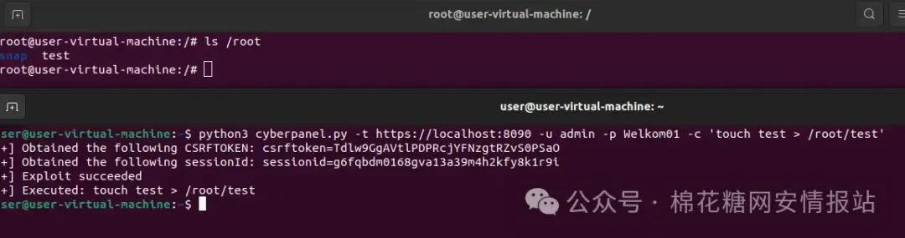

# cve-2024-53376：CyberPanel RCE 已发布PoC

<!-- vulwiki-editorial-rebuild:system-misc -->
## 条目范围与校订

- 本文对象：CyberPanel
- 文献类型：漏洞PoC发布快报
- 版本、权限及部署边界：文称<2.3.8、测试2.3.7；认证用户+OPTIONS submitWebsiteCreation
- 核验状态：仅重建文本校订；未执行文中代码、PoC 或扫描，未把截图或转载声明记为本站复现

### 具体结论与待核项

以下为原归档的逐项勘误与证据缺口；可由文本确定的问题已在下文订正，仍缺来源的事实保持待核。

1. 开头认证用户与后面未经授权语义易误读，应明确是否低权限权限绕过还是完全匿名，需官方/研究者源
2. 宣称GitHub已公开却不提供链接，仅公众号1218索取，本站没有PoC正文
3. 缺参数、原语、补丁commit与影响角色，root权限需具体服务执行证据；版本边界需核验
4. 列表被代码围栏包裹Markdown粗体，广告删减

### 操作风险

原文技术操作的实际副作用未复现核验；按其请求/代码评估状态变更、凭据暴露和业务影响

技术请求、代码与实验方法按原文保留；其中的破坏性动作仅限授权、可恢复的隔离环境。缺失代码、参数或版本事实不猜补。

### 来源追溯

- 原始披露 URL 未确认；既有归档来源标签保留，不能替代原始公告

### 归档技术正文

 棉花糖fans   2024-12-18 04:55  
  
## ‍  
  
###   
  
安全研究员 Thanatos 发现流行的虚拟主机控制面板 CyberPanel 存在一个严重漏洞 (CVE-2024-53376)，攻击者可利用该漏洞完全控制服务器。2.3.8 之前的 CyberPanel 版本易受此安全漏洞影响，通过验证的用户可注入并执行操作系统 (OS) 命令。  
  
该漏洞位于*/websites/submitWebsiteCreation*，可通过简单的 HTTP OPTIONS 请求加以利用。攻击者可借此绕过安全措施，在未经授权的情况下访问服务器的底层操作系统。  
  
安全研究人员 Thanatos 在 CyberPanel 2.3.7 版本上测试了该漏洞，证明它能够在系统的任何地方执行命令，以 root 权限写入文件。如果可以访问 CyberPanel 的安装文件夹，攻击者就可以进一步提取敏感数据，从而加剧漏洞的严重性。  
  
GitHub 上发布了CVE-2024-53376 的PoC。  
  
CVE-2024-53376 的影响非常严重。成功利用该漏洞可能导致  
```
**root权限**：能够以root权限执行命令，让攻击者完全控制受影响的设备。

```  
  
  
```
**数据外泄**：如果可以访问 CyberPanel 安装文件夹，敏感数据可直接通过web面板提取。

```  
  
  
```
**基础设施受损**：运行易受攻击的 CyberPanel 版本的虚拟主机服务器可能成为进一步攻击的通道，危及托管网站和客户数据。

```  
  
  
CyberPanel 已在 2.3.8 版本中解决了这一漏洞。强烈建议所有用户立即将其安装升级到该版本或更高版本。  
  
  
  
### poc：  
  
公众号后台回复：  
**1218**  
  
  
广告：  
  
  
  
  
☟上下滑动查看更多  
  
  


---

> 来源：gelusus/wxvl（微信公众号漏洞文章自动归档，原始披露 URL 尚未确认，现有链接按来源追溯区分别标注）
