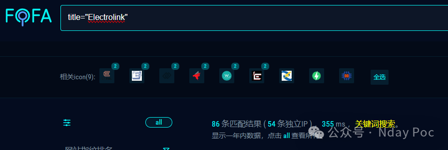
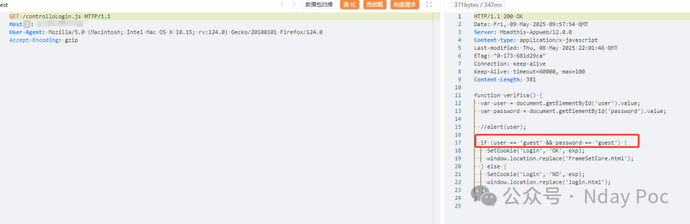
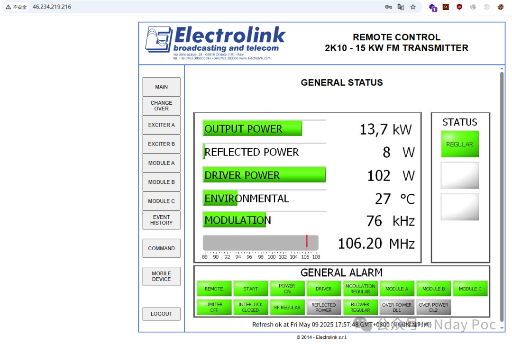
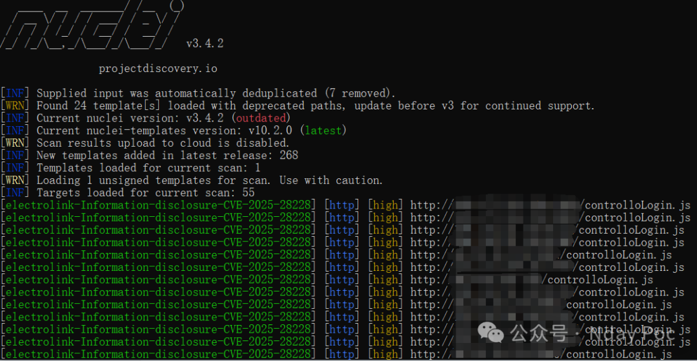
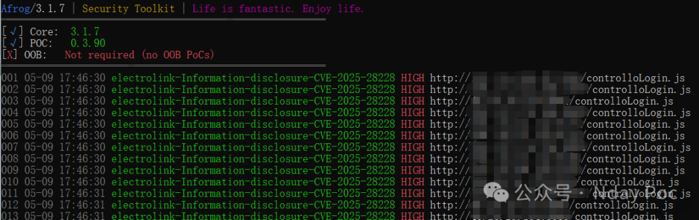
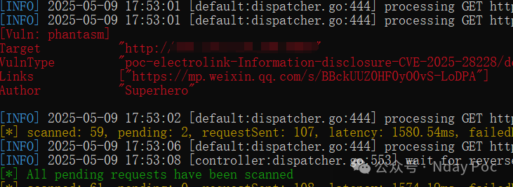

# electrolink 信息泄露漏洞 (CVE-2025-28228)

<!-- vulwiki-editorial-rebuild:system-misc -->
## 条目范围与校订

- 本文对象：Electrolink中功率DAB发射器Web
- 文献类型：凭据泄露图文简报
- 版本、权限及部署边界：列500W/1kW/2kW但仅特定版本未具名；未认证凭据读取宣称
- 核验状态：仅重建文本校订；未执行文中代码、PoC 或扫描，未把截图或转载声明记为本站复现

### 具体结论与待核项

以下为原归档的逐项勘误与证据缺口；可由文本确定的问题已在下文订正，仍缺来源的事实保持待核。

1. 缺泄露路径/HTTP/返回内容，正文仅guest/guest登录，无法区分默认凭据与动态凭据明文泄露
2. 三个扫描器只给结果截图无规则/版本，不能当三种独立验证；图片未视检
3. 缺厂商/CVE公告和安全版本，FOFA标题只能候选资产；品牌产品需归设备/广播系统
4. 营销占比大，保留主文少量事实待原始资料核验

### 操作风险

原文技术操作的实际副作用未复现核验；按其请求/代码评估状态变更、凭据暴露和业务影响

技术请求、代码与实验方法按原文保留；其中的破坏性动作仅限授权、可恢复的隔离环境。缺失代码、参数或版本事实不猜补。

### 来源追溯

- 原始披露 URL 未确认；既有归档来源标签保留，不能替代原始公告

### 归档技术正文

Superhero  Nday Poc   2025-05-09 10:09  
  
  
  
  
  
  
  
内容仅用于学习交流自查使用，由于传播、利用本公众号所提供的  
POC  
信息及  
POC对应脚本  
而造成的任何直接或者间接的后果及损失，均由使用者本人负责，公众号Nday Poc及作者不为此承担任何责任，一旦造成后果请自行承担！  
  
  
**01**  
  
**漏洞概述**  
  
  
Electrolink 500W、1kW、2kW 中型 DAB 发射器 Web特定版本中存在一个凭据泄露漏洞，允许未经授权的攻击者以明文形式访问凭据。  
**02******  
  
**搜索引擎**  
  
  
FOFA:  
```
title="Electrolink"
```  
  
  
  
  
**03******  
  
**漏洞复现**  
  
  
  
利用泄露的guest/guest登录  
  
  
  
  
**04**  
  
**自查工具**  
  
  
nuclei  
  
  
  
afrog  
  
  
  
xray  
  
  
  
  
**05******  
  
**修复建议**  
  
  
1、关闭互联网暴露面或接口设置访问权限  
  
2、  
升级至安全版本  
  
  
**06******  
  
**内部圈子介绍**  
  
  
【Nday漏洞实战圈】🛠️   
  
专注公开1day/Nday漏洞复现  
 · 工具链适配支持  
  
 ✧━━━━━━━━━━━━━━━━✧   
  
🔍 资源内容  
  
 ▫️ 整合全网公开  
1day/Nday  
漏洞POC详情  
  
 ▫️ 适配Xray/Afrog/Nuclei检测脚本  
  
 ▫️ 支持内置与自定义POC目录混合扫描   
  
🔄 更新计划   
  
▫️ 每周新增7-10个实用POC（来源公开平台）   
  
▫️ 所有脚本经过基础测试，降低调试成本   
  
🎯 适用场景   
  
▫️ 企业漏洞自查 ▫️ 渗透测试 ▫️ 红蓝对抗   
▫️ 安全运维  
  
✧━━━━━━━━━━━━━━━━✧   
  
⚠️ 声明：仅限合法授权测试，严禁违规使用！  
  
  
  
  


---

> 来源：gelusus/wxvl（微信公众号漏洞文章自动归档，原始披露 URL 尚未确认，现有链接按来源追溯区分别标注）
