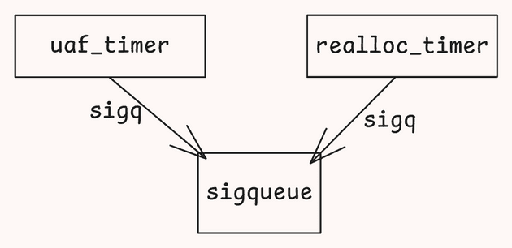
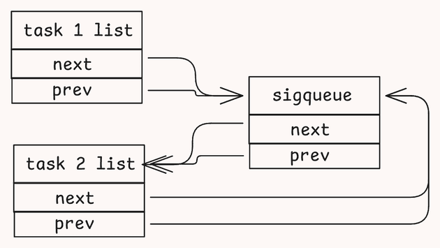
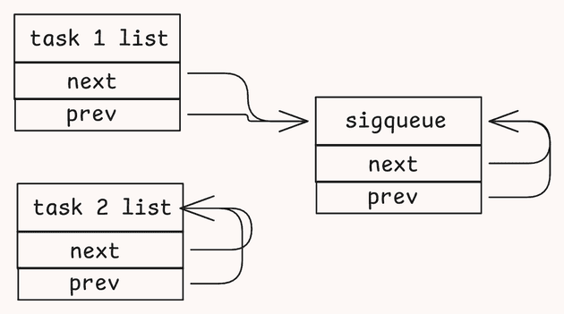

# 【3】CVE-2025-38352 - Chronomaly 漏洞利用挖掘揭秘

<!-- vulwiki-editorial-rebuild:system-misc -->
## 条目范围与校订

- 本文对象：Linux POSIX CPU timer/sigqueue
- 文献类型：长篇Chronomaly利用研究翻译第三篇
- 版本、权限及部署边界：最终实验从6.12.33转5.10.157；需本地ptrace子线程、POSIX CPUtimer/signalfd/epoll和大量进程/FD；配置与AndroidSELinux/seccomp不同
- 核验状态：仅重建文本校订；未执行文中代码、PoC 或扫描，未把截图或转载声明记为本站复现

### 具体结论与待核项

以下为原归档的逐项勘误与证据缺口；可由文本确定的问题已在下文订正，仍缺来源的事实保持待核。

1. 全文1553行已读；保留失败k_itimerRCU回收、msg_msg布局不合、短竞态BUG_ON、最终sigqueue双插链表和递减cred链的独立研究价值，不与前两篇简单去重
2. 首篇500ms内核补丁只是调试，最终用户态方案须明确；core_pattern试验关闭KASLR不等于最终链要求关闭，文最终无需文本地址可保留
3. 摘要每定时器向所有线程发SIGUSR1不准确，实际为选择可收信线程而扫描全部；把uaf_timer重新分配为realloc_timer的句子误导，重用的是sigq非RCU计时器本体
4. 24–26ms窗口即不可能过晚、同CPU必重用、1000cred基本肯定命中是实验假设非保证，受调度负载/slab配置/资源限制影响
5. 管道页自动清零、kmalloc512必order1、Android必SLAB_FREELIST_RANDOM是配置/版本相关，不应泛化所有内核
6. 第14参考竟指localhost:8000开发地址；其余英文章节锚点与中文标题不匹配，分节编号步骤5引用错误；代码//注释同一行吞后续需回源恢复
7. original标识/译作者与真正farazsth98研究者需明确，前两篇引用faith2dxy译站而非原作者，完整最终PoC是repo外链而非本文节选
8. 缺上游修复commit/发行版/Android影响及补丁矩阵；重负载fork/内核UAF可能崩溃，不当稳定通用Androidroot工具，图片/GIF未视检

### 操作风险

缺上游修复commit/发行版/Android影响及补丁矩阵；重负载fork/内核UAF可能崩溃，不当稳定通用Androidroot工具，图片/GIF未视检

技术请求、代码与实验方法按原文保留；其中的破坏性动作仅限授权、可恢复的隔离环境。缺失代码、参数或版本事实不猜补。

### 来源追溯

- 原文参考链接（未重新核验）：<https://gugesay.com/archives/5187>
- 原文参考链接（未重新核验）：<https://github.com/farazsth98/chronomaly[3]>
- 原文参考链接（未重新核验）：<https://faith2dxy.xyz/2025-12-22/cve_2025_38352_analysis>
- 原文参考链接（未重新核验）：<https://faith2dxy.xyz/2025-12-24/cve_2025_38352_analysis_part_2>
- 原文参考链接（未重新核验）：<https://github.com/farazsth98/chronomaly:>
- 原文参考链接（未重新核验）：<https://github.com/farazsth98/chronomaly>
- 原始披露 URL 未确认；既有归档来源标签保留，不能替代原始公告

### 归档技术正文

原创 骨哥说事
                    骨哥说事  骨哥说事   2026-01-20 02:04  
  
<table><tbody><tr><td data-colwidth="557" width="557" valign="top" style="word-break: break-all;"><h1 data-selectable-paragraph="" style="white-space: normal;outline: 0px;max-width: 100%;font-family: -apple-system, system-ui, &#34;Helvetica Neue&#34;, &#34;PingFang SC&#34;, &#34;Hiragino Sans GB&#34;, &#34;Microsoft YaHei UI&#34;, &#34;Microsoft YaHei&#34;, Arial, sans-serif;letter-spacing: 0.544px;background-color: rgb(255, 255, 255);box-sizing: border-box !important;overflow-wrap: break-word !important;"><strong style="outline: 0px;max-width: 100%;box-sizing: border-box !important;overflow-wrap: break-word !important;"><span style="outline: 0px;max-width: 100%;font-size: 18px;box-sizing: border-box !important;overflow-wrap: break-word !important;"><span style="color: rgb(255, 0, 0);"><strong><span style="font-size: 15px;"><span leaf="">声明：</span></span></strong></span><span style="font-size: 15px;"></span></span></strong><span style="outline: 0px;max-width: 100%;font-size: 18px;box-sizing: border-box !important;overflow-wrap: break-word !important;"><span style="font-size: 15px;"><span leaf="">文章中涉及的程序(方法)可能带有攻击性，仅供安全研究与教学之用，读者将其信息做其他用途，由用户承担全部法律及连带责任，文章作者不承担任何法律及连带责任。</span></span></span></h1></td></tr></tbody></table>

#   
  
#   
  
****# 防走失：https://gugesay.com/archives/5187  
  
******不想错过任何消息？设置星标****↓ ↓ ↓**  
****  
#   
  
  
  
  
在  
第一篇博客[1]  
中，作者带领读者一步步构建了CVE-2025-38352的概念验证触发程序。这个最初的概念验证通过内核补丁将竞态窗口延长了500毫秒。  
  
在  
第二篇博客[2]  
中，作者展示了如何摆脱内核补丁，转而从用户态扩展竞态窗口。  
  
在这最后一篇博客中，作者将完整地介绍 "Chronomaly" 漏洞利用程序的开发全过程——从失败的想法到成功的方案，以及其间的一切。  
  
让我们来揭开 **Chronomaly**  
 的面纱吧～  
## 漏洞利用及演示  
  
如果读者只想查看 Chronomaly 漏洞利用程序，可以在下方链接的GitHub仓库中找到。代码注释非常详尽。虽然作者尽力简化，但它依然极其复杂，因此如果读者有任何问题，随时可以在 X 上私信作者。  
  
https://github.com/farazsth98/chronomaly[3]  
  
以及演示：  
  
  
  
demo  
  
有关漏洞利用程序设置的所有详情都可以在上方仓库中找到。  
## 引言  
  
在阅读本文之前，作者强烈建议先阅读  
第一部分[4]  
和  
第二部分[5]  
，以及  
@streypaws[6]  
的  
博客文章[7]  
。阅读这些内容将为读者提供完整的背景知识，因为本博客将从第二部分结束处开始。  
  
作者还尽力使本博客的结构尽可能贴近实际的漏洞利用开发过程。这意味着某些部分将涵盖失败的想法和策略。如果读者想跳读，作者会在这些部分提供链接，直接跳转到描述最终可行策略的部分。  
  
此外，作者需要指出，之前的博客文章主要针对内核版本 **v6.12.33**  
。作者后来切换到了 **v5.10.157**  
，因为该版本更接近存在漏洞的Android设备可能运行的内核版本。  
## 回顾上次进度  
  
在第二部分结束时，作者展示了一个能够在 handle_posix_cpu_timers()  
 中延长竞态窗口的有效PoC。  
## PoC的工作原理  
  
简而言之，实现此目标的步骤如下：  
1. 设置18个阻塞定时器，和1个UAF定时器（一个中断中 handle_posix_cpu_timers()  
 处理的触发定时器数量限制为19个）。  
  
1. 确保所有定时器在同一时间触发。  
  
1. 确保在 handle_posix_cpu_timers()  
 内部处理时，阻塞定时器在UAF定时器之**前**  
被"收集"。  
  
1. 每个定时器向进程中的所有线程发送 SIGUSR1  
 信号。  
  
1. 设置尽可能多的线程。确保它们都阻塞 SIGUSR1  
，并通过从管道读取使它们都阻塞执行（实质上：不使用CPU的休眠）。  
  
1. 在负责触发漏洞的子进程中设置racer线程（在之前的文章中也称为"reapee"线程）  
  
1. 触发漏洞需要在 do_notify()  
 唤醒ptracing父进程之后，进入 handle_posix_cpu_timer()  
 来处理触发的定时器）。  
  
1. **确保racer线程被父进程ptrace跟踪。**  
  
1. 在父进程中使用 waitpid()  
 来回收racer线程。如果操作正确，该线程将在执行 handle_posix_cpu_timers()  
 时立即被回收。  
  
1. 在子进程中使用 usleep()  
 休眠任意时长，然后对UAF定时器触发 timer_delete()  
。usleep()  
 有助于使 timer_delete()  
 落在竞态窗口内。  
  
1. 当定时器触发时，send_sigqueue()  
 会调用 complete_signal()  
，该函数循环遍历进程中的每个线程，并检查哪个线程能够接收此信号。  
  
实质上，PoC创建了略多于11,000个阻塞线程，这意味着对于 handle_posix_cpu_timers()  
 处理的19个定时器中的每一个，complete_signal()  
 都会循环约11,000次。这最终将竞态窗口扩展到了4-5  
毫秒，这足以释放UAF定时器并触发UAF。  
## 并不完美  
  
尽管PoC有效，但仍存在许多问题需要解决...  
1. 4-5  
毫秒似乎并不算长。能否进一步延长竞态窗口？  
  
1. 用于"计时" timer_delete()  
 的逻辑很脆弱——理想情况下，应该有办法知道racer线程究竟**何时**  
进入 handle_posix_cpu_timers()  
 内的竞态窗口。  
  
1. 删除定时器会清除 timer->sigq  
 上的 SIGQUEUE_PREALLOC  
 标志，这会在 send_sigqueue()  
 内部触发 BUG_ON()  
。需要找到解决这个问题的方法才能继续后续的利用。  
  
1. 如何检测竞态是否获胜，以及是否正在 handle_posix_cpu_timers()  
 内部处理已释放的定时器？  
  
现在，让我们一起来了解最终的漏洞利用开发过程。  
## 进一步延长竞态窗口  
  
首要目标是最大化竞态窗口的长度。  
## 枚举可用选项  
  
作者研究了所有可用于延长竞态窗口的选项。我们已经知道，handle_posix_cpu_timers()  
 会为它处理的19个定时器中的每一个调用 cpu_timer_fire()  
。问题是——**我们有什么方法可以增加 cpu_timer_fire() 的执行时间呢？**  
  
cpu_timer_fire()  
 调用 posix_timer_event()  
，而后者仅调用 send_sigqueue()  
（  
代码[8]  
）。在这里，我们有哪些选项可以延长竞态窗口呢？  
1. 调用了 prepare_signal()  
。该函数对于停止信号和 SIGCONT  
 有特殊处理。在这两种情况下，它都会遍历进程中的每个线程，类似于 complete_signal()  
。  
  
1. 调用 signalfd_notify()  
 来通知任何在此信号上等待的 signalfd  
 接收器。  
  
1. complete_signal()  
 已经在前文介绍过。  
  
complete_signal()  
 已经介绍过，那么让我们看看 prepare_signal()  
 和 signalfd_notify()  
。  
## 选项 1 - prepare_signal()  
  
查看 prepare_signal()  
（  
代码[9]  
），其逻辑大致如下：  
1. 如果此进程正在通过group exit方式终止，则返回 sig == SIGKILL  
。这不适用于我们。  
  
1. 如果发送的信号是 SIGSTOP  
、SIGTTIN  
、SIGTSTP  
 或 SIGTTOU  
，则将其视为停止信号。遍历每个线程，并从pending列表中移除 SIGCONT  
。  
  
1. 如果发送的信号是 SIGCONT  
，则遍历所有线程以移除上述四种停止信号，然后唤醒它们。  
  
1. 如果信号当前未被忽略，则返回true，否则返回false。  
  
由于步骤2或步骤3会遍历所有线程（两者互斥，不能同时发生），因此我们可以在这里遍历所有线程一次，并在 complete_signal()  
 中再遍历一次。这将有效使竞态窗口的长度加倍。  
  
但是……能不能做得更好呢？  
## 选项 2 - signalfd_notify()  
  
signalfd_notify()  
（  
代码[10]  
）非常简单，它调用 wake_up(&tsk->sighand->signalfd_wqh)  
 来唤醒任何在目标任务 signalfd  
 等待队列上休眠的等待者。  
  
起初，作者忽略了此函数，因为没看到任何循环。然而，深入研究后，作者发现它最终会调用 __wake_up_common()  
（  
代码[11]  
），该函数像这样遍历等待队列上的所有等待者：  
```
list_for_each_entry_safe_from(curr, next, &wq_head->head, entry) {    // 处理等待者}
```  
  
作者注意到，signalfd  
 只是一个文件描述符，因此必须由 struct file  
 支持。于是作者查找了交叉引用 tsk->sighand->signalfd_wqh  
 的地方，发现 signalfd_poll()  
 会调用 poll_wait()  
，其中 wait_queue_head_t *  
 参数设置为 current->sighand->signalfd_wqh  
。  
```
static __poll_t signalfd_poll(struct file *file, poll_table *wait){struct signalfd_ctx *ctx = file->private_data;__poll_t events = 0; poll_wait(file, &current->sighand->signalfd_wqh, wait);// [ ... ]return events;}static inline void poll_wait(struct file * filp, wait_queue_head_t * wait_address, poll_table *p){if (p && p->_qproc && wait_address)  p->_qproc(filp, wait_address, p);}
```  
  
这立即让作者想起了Jann Horn的博客文章"  
与时钟赛跑——命中一个微小的内核竞态窗口[12]  
"。在那篇文章中，他解释说，可以创建500个epoll实例，将一个文件描述符复制100次，然后在每个复制的文件描述符上安装所有500个epoll实例作为观察者。最终的结果是，文件描述符的等待队列最终将拥有500 * 100 = 50,000个等待队列条目，如果 timerfd  
 到期并在竞态窗口内被处理，所有这些条目都需要被通知。  
  
现在，我们并没有使用 timerfd  
（POSIX CPU定时器是 struct k_itimer  
 类型），但既然这里有一个 signalfd  
 被通知，它能行得通吗？  
  
作者首先追踪了 epoll_ctl(..., EPOLL_CTL_ADD, ...)  
 的代码路径，以查看其工作原理。作者注意到它最终会调用 struct file *  
 的 vfs_poll()  
，而后者最终会调用 signalfd_poll() -> poll_wait()  
。在 poll_wait()  
 中，p->_qproc  
 被设置为 ep_ptable_queue_proc()  
，该函数会创建一个等待队列条目并将其插入传递进去的 wait_queue_head_t *  
！  
  
太棒了！如果能添加50,000个等待队列条目，将使之前的竞态窗口延长超过5倍（wake_up()  
 代码路径比 complete_signal()  
 中仅仅遍历线程要复杂得多）。  
  
在最终的漏洞利用中，是这样实现的：  
```
// 为 `SIGUSR1` 和 `SIGUSR2` 设置 signalfdsigset_t block_mask;sigemptyset(&block_mask);sigaddset(&block_mask, SIGUSR1);sigusr1_sfds[0] = SYSCHK(signalfd(-1, &block_mask, SFD_CLOEXEC | SFD_NONBLOCK));sigemptyset(&block_mask);sigaddset(&block_mask, SIGUSR2);sigusr2_sfds[0] = SYSCHK(signalfd(-1, &block_mask, SFD_CLOEXEC | SFD_NONBLOCK));// 阻塞信号sigemptyset(&block_mask);sigaddset(&block_mask, SIGUSR1);sigaddset(&block_mask, SIGUSR2);sigprocmask(SIG_BLOCK, &block_mask, NULL);// 创建 epoll 实例for (int i = 0; i < EPOLL_COUNT; i++) {    epoll_fds[i] = SYSCHK(epoll_create1(EPOLL_CLOEXEC));}// 复制 sfds，索引 0 是原始文件描述符for (int i = 1; i < SFD_DUP_COUNT; i++) {    sigusr1_sfds[i] = SYSCHK(dup(sigusr1_sfds[0]));    sigusr2_sfds[i] = SYSCHK(dup(sigusr2_sfds[0]));}// 现在设置 epoll 观察者struct epoll_event ev = {0};ev.events = EPOLLIN;for (int i = 0; i < EPOLL_COUNT; i++) {    for (int j = 0; j < SFD_DUP_COUNT; j++) {        ev.data.fd = sigusr1_sfds[j];        SYSCHK(epoll_ctl(epoll_fds[i], EPOLL_CTL_ADD, sigusr1_sfds[j], &ev));        ev.data.fd = sigusr2_sfds[j];        SYSCHK(epoll_ctl(epoll_fds[i], EPOLL_CTL_ADD, sigusr2_sfds[j], &ev));    }}
```  
> **Note**  
> 信号必须被阻塞，或者安装信号处理程序，这一点非常重要。否则，信号基本上会像 SIGKILL  
 一样。作者发现阻塞信号（然后稍后使用 read()  
 从 signalfd  
 中清空每个信号）是最简单的方法。  
  
  
使用作者的内核性能分析补丁测试此方案，发现竞态窗口现在达到了 31-34  
 毫秒！这是一个巨大的改进！  
  
为了简化PoC，作者删除了为通过 complete_signal()  
 扩展竞态窗口而创建的约11,000个线程。最终的竞态窗口平均为 24-26  
 毫秒，作者对此感到满意。  
  
进入下一步！  
## 在竞态窗口内删除定时器  
  
第二个目标是确保**每次**  
进入竞态窗口时，都能在UAF定时器上调用 timer_delete()  
。目前，即使进入竞态窗口，子进程中脆弱的 usleep()  
 延迟实现也可能使 timer_delete()  
 调用得过早（由于 24-26  
 毫秒的竞态窗口，过晚调用不可能）。  
  
在实现了 signalfd  
 竞态窗口扩展逻辑后，作者突然有了一个顿悟......  
  
当 handle_posix_cpu_timers()  
 中处理第一个阻塞定时器时，它最终会调用 signalfd_notify()  
（如上所述）。这将唤醒当前正在轮询 signalfd  
 的任何等待者……  
  
那么，为什么设置一个线程来轮询为 SIGUSR1  
 创建的 signalfd  
（即阻塞定时器发送的信号）呢？它在第一次被唤醒后，如果该线程立即对UAF定时器调用 timer_delete()  
，则删除操作保证会在竞态窗口内发生！  
  
作者在 free_timer_thread  
 中实现了此逻辑，该线程调用处理函数 free_func()  
：  
```
void free_func(void) {    // [ ... ]    struct pollfd pfd = {        .fd = sigusr1_sfds[0],        .events = POLLIN    };    // 轮询 SIGUSR1。    for (;;) {        int ret = poll(&pfd, 1, 0);        // 从第一个阻塞定时器获得了 SIGUSR1，现在处于竞态窗口内。        if (pfd.revents & POLLIN) {            SYSCHK(timer_delete(uaf_timer));            break;        }        // [ ... ]    }}
```  
  
这个函数（当时）的全部目的是被第一个阻塞定时器的 SIGUSR1  
 信号唤醒，立即删除UAF定时器，然后退出。  
  
有趣的是，使用这导致了 timer_wait_running()  
（  
代码[13]  
）中的警告多次触发：  
```
static struct k_itimer *timer_wait_running(struct k_itimer *timer,        unsigned long *flags){ // [ ... ] if (!WARN_ON_ONCE(!kc->timer_wait_running))  kc->timer_wait_running(timer); // [ ... ]}
```  
  
如果 posix_cpu_timer_del()  
 返回 TIMER_RETRY  
，则 timer_delete()  
 会调用此函数，在满足以下条件时会发生这种情况：  
1. 定时器当前正由 handle_posix_cpu_timer()  
 处理。  
  
1. 作者没有在 exit_notify()  
 之后进入 handle_posix_cpu_timers()  
，因此ptracing父进程无法回收该任务。  
  
1. posix_cpu_timer_del()  
 注意到定时器当前正在触发，因此返回 TIMER_RETRY  
。  
  
1. timer_delete()  
 调用 timer_wait_running()  
。  
  
在这种情况下，对于使用 CLOCK_THREAD_CPUTIME_ID  
（本漏洞利用所必需的）创建的POSIX CPU定时器，kc->timer_wait_running  
 函数指针为 NULL  
。  
  
作者觉得这非常有趣。这虽然是一个无害的小错误，但它实际上意味着内核开发者在这里做了一个无效的假设——当定时器相关的系统调用在POSIX CPU定时器上调用时，它们不可能返回 TIMER_RETRY  
。显然，这个假设是错误的，不过作者跑题了。  
  
好了，作者已经扩展了竞态窗口，并实现了竞态窗口检测逻辑，保证UAF定时器总是在竞态窗口内被删除。  
  
接下来是什么？  
## 小插曲 - 一个失败的想法  
  
点击此处[14]  
 可以直接跳转到下一节。  
  
起初，作者注意到 struct k_itimer  
 并非立即释放，而是通过RCU释放（  
代码[15]  
）：  
```
static void release_posix_timer(struct k_itimer *tmr, int it_id_set){ // [ ... ] call_rcu(&tmr->rcu, k_itimer_rcu_free);}static void k_itimer_rcu_free(struct rcu_head *head){ struct k_itimer *tmr = container_of(head, struct k_itimer, rcu); kmem_cache_free(posix_timers_cache, tmr);}
```  
  
注意到这点时，作者的第一个想法是尝试将竞态窗口延长到足以让这个定时器通过RCU完全释放。然而，无论作者做什么，RCU释放都拒绝在竞态窗口内发生。  
作者在意识到定时器没有被释放之前，甚至为 `struct k_itimer` 实现了完整的跨缓存利用[16]  
。  
  
作者最终放弃了这个想法。事后看来，这也没有意义，因为即使成功走这条路，也需要找到一个满足以下条件的对象：  
1. 在 timer->sigq  
 偏移处有一个有效的指针。  
  
1. 在 timer->it_lock  
 偏移处有一个有效的 spin_lock  
。  
  
1. timer->sigq  
 指向的内存必须在 timer->sigq->flags  
 偏移处设置 SIGQUEUE_PREALLOC  
 标志。  
  
1. 可能还有其他一些作者遗漏的条件……  
  
基本上，这似乎极不可能是利用的正确路径。因此，在这上面浪费了许多小时后，作者最终放弃了，并决定转而针对 timer->sigq  
 对象，该对象是通过 release_posix_timer()  
 立即释放的，而不是通过RCU。  
## 绕过 BUG_ON()  
  
下面的小节将描述一些失败的想法。如果读者想跳读到可行的策略，请选择以下选项之一：  
1. 可行策略，但有时仍会触发 BUG_ON()  
——  
点击这里[17]  
。  
  
1. 完全可行的策略，完全绕过 BUG_ON()  
——  
点击这里[18]  
。  
  
## BUG_ON()  
  
在 send_sigqueue()  
（  
代码[19]  
）中，作者遇到的是这个 BUG_ON()  
，其中 q  
 是 timer->sigq  
 对象。  
```
BUG_ON(!(q->flags & SIGQUEUE_PREALLOC));
```  
  
查找 SIGQUEUE_PREALLOC  
 的交叉引用，可以看到它在 do_timer_create()  
 通过调用 sigqueue_alloc()  
 为 timer->sigq  
 分配 sigqueue  
 对象时设置（  
代码[20]  
）：  
```
struct sigqueue *sigqueue_alloc(void){ struct sigqueue *q = __sigqueue_alloc(-1, current, GFP_KERNEL, 0); if (q)  q->flags |= SIGQUEUE_PREALLOC; return q;}
```  
  
随后，当通过 timer_delete()  
 删除定时器时，release_posix_timer()  
 会调用 sigqueue_free()  
，该函数执行两件事（  
代码[21]  
）：  
1. 无条件地从 timer->sigq  
 中移除 SIGQUEUE_PREALLOC  
 标志。  
  
1. 仅当它不在某个任务的pending列表中时，才释放 timer->sigq  
（它将在 send_sigqueue()  
 中被添加到pending列表）。  
  
```
void sigqueue_free(struct sigqueue *q){ // [ ... ] q->flags &= ~SIGQUEUE_PREALLOC;    // [ ... ]}
```  
  
所以，问题很明显——当在竞态窗口通过 timer_delete()  
 释放定时器时，这个 SIGQUEUE_PREALLOC  
 标志被移除，现在当同一个定时器的 sigq  
 被传递给 send_sigqueue()  
 时，就会触发 BUG_ON()  
。  
  
那么，如何才能绕过 BUG_ON()  
 呢？  
## 第一个想法 - 重新分配另一个定时器  
  
第一个想法是在竞态窗口中重新分配另一个定时器。由于这个定时器也会分配它自己的 timer->sigq  
，如果能让这个定时器重用 uaf_timer->sigq  
 的内存，就可以重置 SIGQUEUE_PREALLOC  
 标志，从而完全绕过 BUG_ON()  
。  
  
由于SLUB分配器的工作方式，这是可行的。不深入太多细节（这篇博客已经够长了……），可以采取以下步骤来确保另一个定时器能够轻松地重新分配 uaf_timer->sigq  
：  
1. 在分配 uaf_timer  
 时固定到特定的CPU（作者使用CPU 3）。  
  
1. 确保此后没有其他 sigqueue  
 分配发生在此CPU上。这使得 uaf_timer->sigq  
 停留在一个"活跃"的slab页上。  
  
1. 当 uaf_timer  
 在竞态窗口中被释放时，timer->sigq  
 被添加到活跃slab页空闲列表的头部。  
  
1. 当现在分配 realloc_timer  
 时，sigqueue_alloc()  
 将使用活跃slab页空闲列表头部的条目来满足分配。这恰好是上一步之后的 uaf_timer->sigq  
。  
  
> **Note**  
> uaf_timer  
 是UAF定时器，而 realloc_timer  
 是重新分配的定时器，其 ->sigq  
 重用了与 uaf_timer->sigq  
 相同的内存。  
  
  
只要释放和重新分配发生在同一个CPU上，并且遵循步骤2，就能保证 realloc_timer->sigq  
 会重用与 uaf_timer->sigq  
 相同的内存。  
  
但这究竟能达到什么目的呢？realloc_timer->sigq  
 最终只是作为信号放在目标任务的 pending  
（或 shared_pending  
）列表中。无论如何，这都是一个已分配的信号，这里不会发生内存破坏……  
  
从现在开始记住这个想法，因为可行的策略实际上就是基于此发展而来的！ 😉  
## 第一个想法 - 潜在的竞态获胜检测机制？  
  
但在实现此PoC时，作者意识到 realloc_timer->sigq  
 实际上可以被设置为使用不同的信号！因此，可以通过以下步骤来检测是否命中了竞态窗口并成功重新分配了 uaf_timer->sigq  
：  
1. 设置所有19个定时器（18个阻塞定时器加上UAF定时器）向线程组发射 SIGUSR1  
 信号。  
  
1. 在竞态窗口中，释放并重新分配UAF定时器，但将重新分配的定时器的信号设置为 SIGUSR2  
。  
  
1. 轮询 SIGUSR2  
 的 signalfd  
。如果接收到该信号，则定时器已成功重新分配（send_sigqueue()  
 看到了发送 SIGUSR2  
 的重新分配的 timer->sigq  
），竞态获胜。  
  
1. 如果未观察到 SIGUSR2  
，则竞态失败。  
  
这实际上是作者最终在漏洞利用中实现的竞态获胜检测机制。稍后会详细介绍！  
## 第二个想法 - 重新分配为 struct msg_msg  
  
当作者注意到 struct sigqueue  
 的 list_head  
 指针位于偏移0时，萌生了这个想法。作者寻找了其他在偏移0处也有 list_head  
 指针的结构，最终落在了 struct msg_msg  
 上。目标是将 struct msg_msg  
 类型混淆为 struct sigqueue  
，并让其插入到目标任务的pending列表中。  
  
作者比较了 struct sigqueue  
（  
代码[22]  
）和 struct msg_msg  
（  
代码[23]  
），发现了以下几点：  
1. list_head  
 指针位于偏移0。  
  
1. sigqueue->flags  
 的偏移与 msg_msg->m_type  
 匹配，而 m_type  
 可以从用户态控制！因此可以设置 SIGQUEUE_PREALLOC  
。  
  
这看起来太完美了，可以使用跨缓存利用技术将UAF sigqueue  
 的slab页面释放回页面分配器，然后重新分配为一页 struct msg_msg  
 对象，从而获得类型混淆原语！  
  
……对吗？  
  
嗯，不对。这种方法存在很多问题。而且，像往常一样，作者花了很多小时才弄清楚这一切 😅  
  
第一个问题是，当分配 struct msg_msg  
 时，list_head->next  
 指针被设置为 NULL  
（  
代码[24]  
）。此外，这个 list_head  
 仅被插入到链表中，或通过 list_del()  
 删除（而不是 list_del_init()  
，后者删除并将链表标记为空）。  
  
这是一个重大问题，因为 send_sigqueue()  
 函数有一个 !list_empty()  
 检查，除非 list_head->next == &list_head  
，否则会失败（  
代码[25]  
）：  
```
int send_sigqueue(struct sigqueue *q, struct pid *pid, enum pid_type type){// [ ... ]if (unlikely(!list_empty(&q->list))) {// [ ... ]goto out; }    // [ ... ]out:// [ ... ] 解锁并退出}static inline int list_empty(const struct list_head *head){return READ_ONCE(head->next) == head;}
```  
  
在这种情况下，对于 struct msg_msg  
，这个条件**从不**  
为真（即链表**从不**  
为空）。  
  
不幸的是，恰如此事，这是作者最后才发现的事情 😅  
  
另一个问题很微妙——在 kernel **v5.10.157**  
 中，struct msg_msg  
 是从普通的 kmalloc-X  
 缓存中分配的。这些缓存的大小可以在 kmalloc-64  
 到 kmalloc-1k  
 或 kmalloc-2k  
 之间（不确定 struct msg_msg  
 的最大大小）。  
  
每次从 kmalloc-X  
 缓存进行的分配将始终在页面中使用 X  
 字节，即使实际对象不使用 X  
 字节。例如，一个 48  
 字节的对象将从 kmalloc-64  
 分配，并且每个分配使用 64  
 字节。slab 的大小本身可以这样获取：  
```
/ # cat /sys/kernel/slab/kmalloc-64/slab_size64/ # cat /sys/kernel/slab/kmalloc-96/slab_size96
```  
  
这里的问题是，struct sigqueue  
 是从一个名为 sigqueue_cachep  
 的特定 kmem_cache  
 中分配的。struct sigqueue  
 的大小是 80  
 字节。你会期待这个slab的大小是 96  
 字节，对吗？  
```
/ # cat /sys/kernel/slab/sigqueue/object_size80/ # cat /sys/kernel/slab/sigqueue/slab_size80
```  
  
嗯，这下糟糕了。这意味着，即使我们将UAF sigqueue  
 重新分配为一页 struct msg_msg  
 对象，也不能保证 struct msg_msg  
 对象会正好落作者们的UAF sigqueue  
 分配的位置。Android 内核还设置了 CONFIG_SLAB_FREELIST_RANDOM=y  
，这阻止了作者们控制 uaf_timer->sigq  
 在页面中的分配位置。  
  
在解决了一些由LLM辅助的数学问题来确定此选项是否可行（尝试在slab页中对齐 80  
 字节分配与 16  
、32  
、64  
、96  
、128  
 和 256  
 字节的对象分配）之后，作者得出结论：这个想法在漏洞利用中完全不够可靠。  
  
所以……再换个想法！  
## 第三个想法 - 第二个更小的竞态窗口？  
  
就在这时，作者突然从  
第一个想法[26]  
中意识到了一些关键点。由于 struct k_itimer  
 是**稍后**  
通过RCU释放的，在定时器被重新分配后，实际上作者们处于这样一种情况：  
  
  
  
UAF 和重新分配的定时器关系  
  
这里重要的一点是 uaf_timer->sigq == realloc_timer->sigq  
，但 uaf_timer != realloc_timer  
。  
  
为什么这很重要？**因为它们的 ->it_lock 是不同的！**  
  
如果成功将 uaf_timer  
 重新分配为 realloc_timer  
，那么当 handle_posix_cpu_timers()  
 获取 timer->it_lock  
（  
代码[27]  
）时，它实际上将获取 uaf_timer->it_lock  
，因为这是在本地 firing  
 列表中收集的内容！  
  
这使得 realloc_timer->it_lock  
 未被获取，这关键地在 send_sigqueue()  
 内部（  
代码[28]  
）**打开了第二个竞态窗口**  
：  
```
int send_sigqueue(struct sigqueue *q, struct pid *pid, enum pid_type type){// [ ... ] BUG_ON(!(q->flags & SIGQUEUE_PREALLOC));    // [ ... 竞态窗口开始 ... ] ret = -1; rcu_read_lock(); t = pid_task(pid, type);    // [ ... 竞态窗口结束 ... ]if (!t || !likely(lock_task_sighand(t, &flags)))goto ret;// [ ... ]}
```  
  
竞态窗口在 BUG_ON()  
 之后立即开始。在这个竞态窗口中，uaf_timer->it_lock  
 被持有，但作者仍然可以在 realloc_timer  
 上调用 timer_delete()  
，而其 it_lock  
 未被持有。这将以相同的方式释放 realloc_timer->sigq  
（在这种情况下，realloc_timer  
 没有标记为 firing  
，因为它使用 kmem_cache_zalloc()  
 分配）。  
  
但是……这个竞态窗口非常短暂，没有办法延长它。作者已经在一个调度器中断中，所以无法在窗口中触发另一个中断，而且 rcu_read_lock()  
 和 pid_task()  
 都不会执行任何可以消耗可控CPU时间的操作。  
  
尽管如此，作者在竞态窗口中打了一个 500  
 毫秒延迟的补丁，并修改了 free_timer_thread  
 来执行以下操作：  
```
void free_func(void) {    // [ ... ]    struct pollfd pfd = {        .fd = sigusr1_sfds[0],        .events = POLLIN    };    // 轮询 SIGUSR1。    for (;;) {        int ret = poll(&pfd, 1, 0);        // 从第一个阻塞定时器获得了 SIGUSR1，现在处于竞态窗口内。        if (pfd.revents & POLLIN) {            SYSCHK(timer_delete(uaf_timer));            // 重新分配 `uaf_timer->sigq`            SYSCHK(timer_create(/* ... */, &realloc_timer));            // 休眠 250ms 以确保处于作者们打补丁后的竞态窗口内            usleep(250 * 1000);            SYSCHK(timer_delete(realloc_timer));            break;        }        // [ ... ]    }}
```  
  
在这种状态下运行PoC，作者可以确认释放的 uaf_timer->sigq  
 被插入到了目标任务的pending列表中（使用GDB检查 sigqueue_cachep->offset  
 处 uaf_timer->sigq  
 的slab空闲链表指针。如果对象被释放，空闲链表指针会被插入到这个偏移处）。  
> **Tip**  
> 创建定时器时，可以将 struct sigevent  
 的 .sigev_value.sival_ptr  
 设置为一个唯一值（例如 0x4141414141414141  
）。然后，可以添加一个内核补丁，在 do_timer_create()  
 内部检查这个值，并随后 printk()  
 输出分配的 timer->sigq  
 地址用于调试。作者在最终的漏洞利用中注释掉了一些行，它们正是做这个的。😉  
  
  
此时的问题不是微小的竞态窗口，而是 BUG_ON()  
。如果那个 BUG_ON()  
 不存在，作者可以重复此步骤多次，并调整延迟来在某个时间点上命中微小的窗口。  
> **Note**  
> 实际上，作者在没有内核补丁提供的额外延迟的情况下进行测试时，多次命中了这个竞态窗口。它不可靠，并且触发 BUG_ON()  
 的次数与赢得竞态的次数一样多，但嘿，它确实有效！  
  
  
然而，由于CPU消耗从来都不是100%稳定的，过早调用 timer_delete(realloc_timer)  
几乎是不可避免的，所以这种方法对于最终的漏洞利用来说并不真正有效。  
  
于是……作者花了很多小时来测试延长竞态窗口的方法。  
  
其中一个尝试是使用相同的 signalfd_notify()  
 技巧，在 send_sigqueue()  
 运行时唤醒另一个线程，并让那个线程调用 timer_delete(realloc_timer)  
。由于 signalfd_notify()  
 在 realloc->sigq  
 被添加到任务的pending列表**之前**  
调用，因此希望有足够的时间来唤醒另一个线程，并在 signalfd_notify()  
 能够返回之前让它释放 realloc_timer->sigq  
。  
  
但这行不通……出于某种原因，sigqueue_free()  
 无法获取 task->sighand->siglock  
，直到 handle_posix_cpu_timer()  
 释放它。  
> **Tip**  
> 作者通过在 sigqueue_free()  
 和 send_sigqueue()  
 中插入 printk()  
 语句来找出这个锁定的问题。  
  
  
但是目标任务不是不同的吗？为什么锁会无法获取？  
  
就在这时，作者了解到 task->sighand  
 结构实际上是在进程的所有线程之间共享的！在这种情况下，由于 send_sigqueue()  
 中的 lock_task_sighand()  
 获取的是目标任务的 sighand  
 锁，因此该进程中的任何其他线程都无法被唤醒并同时删除定时器。  
> **Note**  
> POSIX CPU定时器与创建它们的进程绑定。这意味着同一进程中的其他线程可以调用 timer_settime()  
 / timer_delete()  
 / 等函数来操作它们，但不同的进程则不能。  
  
  
如果作者没记错的话，当意识到这一点时，已经是凌晨5点了。作者决定先去睡觉，第二天再继续。  
  
像往常一样，作者在入睡时开始在脑海中连接无数个点……其中一个想法恰好引导作者找到了最终漏洞利用中使用的策略！  
## 第四个想法 - 双重插入  
  
Linux内核的链表实现是一种"  
侵入式链表[29]  
"。如果读者以前没接触过，强烈建议阅读链接文章。  
  
关于侵入式链表，最重要的一点是：  
> **Important**  
> 切勿在任何时候让同一个对象引用同时出现在多个链表中，包括它自身！  
  
  
事实上，send_sigqueue()  
 中的 !list_empty()  
 检查正是出于这个原因：  
```
int send_sigqueue(struct sigqueue *q, struct pid *pid, enum pid_type type){// [ ... ]if (unlikely(!list_empty(&q->list))) {// [ ... ]goto out; }    // [ ... ]out:// [ ... ] 解锁并返回}
```  
  
下图展示了双重插入的 struct sigqueue  
 在内存中的样子（假设它首先插入到任务1，然后插入到任务2，并且pending列表中没有其他信号）：  
  
  
  
双重插入的 sigqueue  
  
本质上，作者们遇到了一种情况：struct sigqueue  
 认为它在任务2的pending列表中，而任务1和任务2都认为 struct sigqueue  
 在它们的pending列表中。  
  
当这个 struct sigqueue  
 稍后从pending列表中移除时（例如，通过调用 signalfd  
 上的 read()  
），问题就出现了。collect_signal()  
 函数用于将 struct sigqueue  
 出队（  
代码[30]  
），它使用 list_del_init()  
 从实际的pending列表中删除 struct sigqueue  
，然后在释放前调用 __sigqueue_free()  
 将其释放。  
```
static void collect_signal(int sig, struct sigpending *list, kernel_siginfo_t *info,      bool *resched_timer){ // [ ... ]still_pending:  list_del_init(&first->list);  // [ ... ]    if (first) {  __sigqueue_free(first); } else {  // [ ... ] }}
```  
  
list_del_init()  
 的逻辑如下：  
1. 设置 sigqueue->next->prev = sigqueue->prev  
。  
  
1. 设置 sigqueue->prev->next = sigqueue->next  
。  
  
1. 设置 sigqueue->next = &sigqueue  
 且 sigqueue->prev = &sigqueue  
。  
  
回顾上图，问题显而易见——无论哪个列表将这个 struct sigqueue  
 出队，任务1的pending列表中的指针都不会被更新。此外，由于 struct sigqueue  
 的 .next  
 和 .prev  
 指针被更新为指向自身，这个 struct sigqueue  
 将永远卡在任务1的pending列表中（如果 __sigqueue_free()  
 释放了它，可能作为已释放的对象）！  
  
下图展示了这种情况：  
  
  
  
双重插入后释放  
  
于是，在睡了一觉并让大脑将所有点连接起来之后，作者最终制定了以下计划：  
1. 进入竞态窗口并释放 uaf_timer  
——和之前一样。  
  
1. 不是在同一进程中重新分配 realloc_timer->sigq  
，而是与一个不同的进程（在作者的漏洞利用中是"父"进程）通信，让它来重新分配 realloc_timer->sigq  
（必须在同一个CPU上，因为slab空闲列表是基于每个CPU的）。  
  
1. 确保 realloc_timer->sigq  
 发射 SIGUSR2  
 信号，以便检测作者是否赢得了竞态。  
  
1. 在父进程中，使用 usleep()  
 休眠一段可配置的时间，以允许子进程进入带有 uaf_timer->sigq  
 的 send_sigqueue()  
。如果竞态失败，每次重试时会通过 PARENT_SETTIME_DELAY_US_DELTA  
 调整此可配置的睡眠时间。  
  
1. 父进程在睡眠后立即调用带有 TIMER_ABSTIME  
 标志的 timer_settime(realloc_timer)  
，并设置一个 struct itimerspec  
，使其在过去的时间触发。  
  
1. 由于时间设置为过去，这将导致 posix_cpu_timer_set()  
 内部立即调用 cpu_timer_fire()  
（  
代码[31]  
）。  
  
1. 如果父进程的休眠时间恰到好处，子进程应该正好在带有 uaf_timer->sigq  
 的 send_sigqueue()  
 内部。  
  
此时，两个进程都将进入 send_sigqueue()  
，同时持有以下锁：  
- **子进程**  
  
- uaf_timer->it_lock  
  
- 自身进程的 sighand->siglock  
。  
  
- **父进程**  
  
- realloc_timer->it_lock  
  
- 自身进程的 sighand->siglock  
。  
  
正如读者所见，所有这些锁都是不同的，因此父进程和子进程在 send_sigqueue()  
 中并发运行没有任何问题。  
  
子进程中需要准备的另一件事是，还要为 SIGUSR2  
 的 signalfd  
 附加50,000个epoll等待者。这确保了第二个竞态窗口得到延长，因为子进程在将 sigqueue  
 入队到自身任务的pending列表之前会调用 signalfd_notify()  
（  
代码[32]  
），而 signalfd_notify()  
 需要相当长的时间来唤醒所有50,000个epoll等待者。  
> **Important**  
> 使用 timer_settime()  
 进行双重插入而不是仅仅在（现在稍长一些的）竞态窗口中删除定时器的另一个原因是，它可以防止 BUG_ON()  
 被意外触发。  
  
  
当前的漏洞利用中可以看到这个实现（为简洁省略了大量代码）。free_func()  
 线程一看到 SIGUSR1  
 信号就删除 uaf_timer  
，然后通过管道与父进程通信。父进程随后重新分配 realloc_timer  
，休眠 parent_settime_delay  
 时间，然后调用 timer_settime()  
 并设置一个过去的时间：  
```
// 在子进程的 `free_func()` 线程中for (;;) {    int ret = poll(&pfd, 1, 0);    // 从第一个阻塞定时器获得了 SIGUSR1，现在处于竞态窗口内。    if (pfd.revents & POLLIN) {        SYSCHK(timer_delete(uaf_timer));        // 切换到其他CPU，以便父进程可以继续使用作者的CPU来重新分配同一个 `uaf_timer->sigq`。        pin_on_cpu(0);        SYSCHK(write(exploit_child_to_parent[1], SUCCESS_STR, 1)); // 同步步骤4.SUCCESS        // 用于不相关同步的屏障        pthread_barrier_wait(&barrier); // 屏障4        break;    }}// 在父进程中，固定到 `uaf_timer` 被释放的那个CPU上，// 然后等待子进程告诉作者们可以重新分配。pin_on_cpu(3);SYSCHK(read(exploit_child_to_parent[0], &m, 1)); // 同步4if (m == SUCCESS_CHAR) {    // 重新分配    SYSCHK(timer_create(CLOCK_THREAD_CPUTIME_ID, &realloc_evt, &realloc_timer));    // 可配置的休眠时间    usleep(parent_settime_delay);    // 调用 `cpu_timer_fire()`    SYSCHK(timer_settime(realloc_timer, TIMER_ABSTIME, &fire_ts, NULL));
```  
## 快速声明 - 漏洞利用复杂性  
  
此时，漏洞利用正接近一个非常高的复杂度水平，主要是因为这个漏洞是一个竞态条件，并且父进程和子进程之间需要进行大量通信才能使漏洞利用生效。  
  
遗憾的是，作者无法像前几篇文章中对PoC那样逐行解释漏洞利用。坦白说，即使在做了如此详尽的注释之后，作者自己仍然很难向自己解释作者的漏洞利用…… 😅  
  
理解该漏洞利用的最佳方式是：先通读这篇博客文章，然后仔细阅读作者的漏洞利用代码，并以读者自己的方式重写它，将进程同步得适合读者自己理解。  
  
不过，如果读者对作者的漏洞利用任何具体部分有疑问，欢迎在 X 上私信作者，作者会尽力帮助读者！  
## 我位于哪个链表？  
  
此时，请记住 realloc_timer  
 是由父进程设置为触发的。假设 realloc_timer->sigq == uaf_timer->sigq  
，有四种可能的结果：  
1. 作者们赢得了第一次竞态——realloc_timer->sigq**首先**  
插入到父进程，然后是子进程。  
  
1. 作者们赢得了第一次竞态——realloc_timer->sigq**首先**  
插入到子进程，然后是父进程。  
  
1. 作者们输掉了竞态——父进程调用 timer_settime()**过早**  
，因此父进程成功，但子进程未能将其插入到自己的列表中。  
  
1. 作者们输掉了竞态——父进程调用 timer_settime()**过晚**  
，因此父进程失败，但子进程成功将其插入到自己的列表中。  
  
问题：**如何判断作者处于这四种情况中的哪一种？**  
## 竞态失败 - 太早还是太晚？  
  
首先，看看场景3和场景4，因为它们更容易解释。请记住——**作者们已经通过轮询子进程中是否有 SIGUSR2 来检测到释放 -> 重新分配是否成功触发。**  
  
在 send_sigqueue()  
 中，如果 !list_empty()  
 检查失败，看看发生了什么（  
代码[33]  
）：  
```
int send_sigqueue(struct sigqueue *q, struct pid *pid, enum pid_type type){// [ ... ]if (unlikely(!list_empty(&q->list))) {  BUG_ON(q->info.si_code != SI_TIMER);  q->info.si_overrun++;  result = TRACE_SIGNAL_ALREADY_PENDING;goto out; }// [ ... ]out:// [ ... ] 解锁并退出}
```  
  
q->info.si_overrun++  
 这一行是关键！这是一个作者们可以用来检测是调用 timer_settime()  
 太早还是太晚而导致竞态失败的原语。  
  
为了解释其工作原理，请考虑父进程正在调用 timer_settime()  
 并导致定时器立即触发这一事实。在这种情况下，**只有**  
一种情况 realloc_timer->sigq  
（使用 SIGUSR2  
）不会被排队到父进程的pending列表中：**它被太早地排队到了子进程的pending列表中，这意味着 timer_settime() 调用得太晚。**  
  
因此，作者们可以通过以下方式检测场景3：  
1. 在父进程调用 timer_settime()  
 且定时器触发后，让子进程轮询 SIGUSR2  
。  
  
1. 如果子进程收到 SIGUSR2  
，意味着 realloc->sigq  
 被排队到了子进程的pending列表中。向父进程发送"成功"信号。  
  
1. 此时，第二次竞态**可能**  
赢了。  
  
1. 如果子进程没有收到 SIGUSR2  
，那么竞态肯定失败了。向父进程发送"失败"信号。  
  
1. 此时，要么作者们最初的释放 -> 重新分配失败，要么子进程未能插入 uaf_timer->sigq  
，因为父进程过早调用 timer_settime()  
 已经插入了它。  
  
1. 无论如何，父进程的pending列表中都会有 SIGUSR2  
，因为是它触发的。  
  
1. 如果父进程收到"成功"信号，检查 SIGUSR2  
。  
  
1. 如果父进程也收到了 SIGUSR2  
，则竞态成功赢得。realloc_timer->sigq  
 现在既在子进程的pending列表中，也在父进程的pending列表中。  
  
1. 如果父进程没有收到 SIGUSR2  
，那么 timer_settime()  
 调用得太晚。在父进程能够通过 send_sigqueue()  
 中的 !list_empty()  
 检查之前，子进程已经插入了它。  
  
至关重要的是，对于上面的步骤3，为了区分父进程过早调用 timer_settime()  
 与最初的释放 -> 重新分配失败（由于 handle_posix_cpu_timers()  
 未在正确时间调用），作者们使用上面提到的 q->info.si_overrun++  
 原语。  
  
基本思路是：  
- 如果释放 -> 重新分配失败，那么作者们未能触发任何UAF，因此无论如何，realloc_timer->sigq  
 只会被排队到父进程的列表中，子进程永远不会看到它。  
  
- 这将导致其 si_overrun  
 字段为0，因为没有其他进程试图同时排队该信号。  
  
- 如果释放 -> 重新分配成功，但子进程**仍然**  
没有看到 SIGUSR2  
，那么它**必须**  
意味着子进程试图将其排队到自己的pending列表中，但在 send_sigqueue()  
 中的 !list_empty()  
 检查失败了。  
  
- 这将导致子进程将 si_overrun  
 字段递增到1，父进程可以检测到这一点。  
  
如果父进程发现子进程没有收到 SIGUSR2  
，它现在可以检查 si_overrun  
。如果它发现该值大于 0  
，那么肯定意味着 timer_settime()  
 调用得太早了。它现在可以为下一次重试增加 parent_settime_delay  
（调用 timer_settime()  
 前休眠的微秒数）。  
  
至于上面的步骤4，如果在子进程看到 SIGUSR2  
 之后父进程未能看到它，则意味着 timer_settime()  
 调用得太晚，因此必须为下一次重试减少 parent_settime_delay  
。  
  
这就涵盖了上面"竞态失败"的场景3和场景4。现在，如何检测作者以哪种方式赢得了竞态？  
## 竞态获胜 - 链表检测  
  
一旦父进程和子进程都看到了 SIGUSR2  
 信号，作者们就知道肯定赢得了竞态。现在是时候弄清楚 realloc_timer->sigq->list  
 指针指向哪里了——**它是父进程的pending列表还是子进程的pending列表？**  
  
为了检测这一点，作者想出了以下策略：  
1. 在父进程中，首先调用 timer_delete(realloc_timer)  
。  
  
1. 这将释放定时器，但不会释放 realloc_timer->sigq  
，因为它是某个任务pending列表的一部分。  
  
1. 从现在开始，realloc_timer->sigq  
 将被称为 uaf_sigqueue  
。  
  
1. 现在，在父进程上使用 signalfd_read()  
 来将 uaf_sigqueue  
 出队。  
  
1. 如果 uaf_sigqueue->list  
 指针指向父进程，父进程将在其pending列表中失去对 uaf_sigqueue  
 的引用。  
  
1. 对于子进程则反之亦然。  
  
回到那个双重插入的例子，下面两张图展示了将会发生的情况。首先是双重插入后：  
  
  
  
双重插入  
  
然后是出队后：  
  
  
  
双重插入后释放  
> **Tip**  
> 哪个任务将这个 struct sigqueue  
 出队并不重要，重要的是 struct sigqueue  
 的 list  
 指针设置为什么。最终结果总是一样的。  
  
  
此时，父进程可以最后一次 poll()SIGUSR2  
。如果它**仍然**  
检测到信号，那么意味着 uaf_sigqueue->list  
 指针过去指向子进程的pending列表。现在父进程可以无限次地释放这个 uaf_sigqueue  
。  
> **Note**  
> 在这种情况下，参考上图，父进程是任务1。  
  
  
如果父进程没有检测到 SIGUSR2  
，则意味着 uaf_sigqueue->list  
 指针过去指向父进程的pending列表。现在子进程可以无限次地释放 uaf_sigqueue  
。  
> **Important**  
> 弄清楚这一点非常重要，因为作者们对已释放 uaf_sigqueue  
 的唯一引用是通过任务的pending列表。如果无法确定 uaf_sigqueue  
 位于哪个进程的pending列表中，作者们就无法继续。  
  
  
另外一点需要注意——在父进程通过 signalfd_read()  
 将 uaf_sigqueue  
 出队（上面的步骤2）之后，uaf_sigqueue  
 被释放。这是因为作者们事先删除了 realloc_timer  
。  
## 跨缓存回退到页面分配器  
  
这是作者漏洞利用中调用 second_stage_exploit()  
 的地方。  
  
对于跨缓存利用技术，作者不会过于深入，因为它已在许多其他文章和博客中有所介绍。有关更多详情，请参考漏洞利用中的以下函数及其调用位置：  
1. sigqueue_crosscache_preallocs()  
——在分配 uaf_timer  
 之前进行预分配。  
  
1. sigqueue_crosscache_postallocs()  
——在 uaf_sigqueue  
 出队并释放后进行后分配。  
  
1. free_crosscache_sigqueues()  
——以特定顺序释放预分配和后分配，以将 uaf_sigqueue  
 的slab页发送回页面分配器。  
  
> **Tip**  
> 可以使用 GDB GEF 的 `xslab -r <addr>`  
 命令来查找特定slab分配的 struct page *  
 地址。  
  
> **Tip**  
> 可以在 discard_slab()  
 上设置断点，并将 page  
 参数与试图释放回页面分配器的slab分配的 struct page *  
 地址进行比较。这有助于调试跨缓存实现。  
  
## 获取堆地址泄漏  
  
由于 sigqueue_cachep  
 分配的是order-0的页面，作者决定将 uaf_sigqueue  
 页面重新分配为管道缓冲数据页（当对管道文件描述符调用 write()  
 时，数据写入的页面）。  
> **Tip**  
> 可以在 prep_new_page()  
 上设置条件断点 (`b prep_new_page if page == <target_alloc_page_addr>`  
），用于准确确定目标页面如何被分配。这有助于在触发此断点后通过检查回溯来调试跨缓存实现。  
  
  
当管道缓冲数据页被分配时，它会被清零（页面分配器会自动执行此操作）。作者的目标是让一些堆指针插入此页面，以便从管道中读取出来。  
  
由于作者知道作者的 uaf_sigqueue  
 位于管道缓冲数据页中，实际上有一种方法可以泄漏以下所有地址：  
1. **另一个**  
真实的 struct sigqueue  
 的地址。这将被称为 other_sigqueue  
。  
  
1. 对 uaf_sigqueue  
 有引用的任务pending列表的地址。  
  
1. 作者自己 uaf_sigqueue  
 的地址——如果作者需要在内核堆中伪造对象，这很有用，因为作者控制着整个页面的内容。  
  
> **Note**  
> 虽然作者的漏洞利用泄漏了所有这三个地址，但完成漏洞利用只需要 other_sigqueue  
 的地址。因此作者的漏洞利用在这方面可以简化！  
  
  
对于（1），作者只需向任务发送一个实时信号（在作者的漏洞利用中是 SIGRTMIN+1  
，也是 other_sigqueue  
）。它将排在列表的末尾。由于 pending->list.prev == uaf_sigqueue  
，uaf_sigqueue->list.next  
 将被设置为实时信号的 struct sigqueue  
 对象的地址。作者可以通过UAF管道使用 read()  
 从页面中读取这个地址（扫描页面，查找第一个不是 NULL  
 的字节）。  
  
对于（2），作者实际上必须回到漏洞利用的最开始，在作者们启动之前就将一个实时信号排队到作者进程的pending列表中（在作者的漏洞利用中是 SIGRTMIN+2  
）。然后，uaf_sigqueue  
 稍后会被排队到该列表（双重插入）。  
  
最后，一旦作者泄漏了 other_sigqueue  
 的地址（如上所述），作者可以设置 uaf_sigqueue->list.next = &other_sigqueue  
（通过对UAF管道使用 write()  
）来建立如下列表：  
```
pending_list -> SIGRTMIN+2 -> uaf_sigqueue -> other_sigqueue -> pending_list
```  
  
此时，作者可以使用 signalfd_read()  
 将 SIGRTMIN+2  
 信号出队。这将导致 uaf_sigqueue->list.prev  
 被设置为 &pending_list  
，并且作者可以通过UAF管道从页面中读取此值。  
  
之后，作者们当前的列表设置如下：  
```
pending_list -> uaf_sigqueue -> other_sigqueue -> pending_list
```  
  
此时，如果作者们设置 uaf_sigqueue->list.prev  
 和 uaf_sigqueue->list.next  
 都等于 other_sigqueue  
，就可以通过 signalfd_read()  
 将 uaf_sigqueue  
 出队，同时仍在任务的pending列表中保留对它的引用。  
  
此次出队最终将调用 list_del_init()  
 来处理 uaf_sigqueue  
（  
代码[34]  
），这会将 uaf_sigqueue->list.prev = uaf_sigqueue->list.next = &uaf_sigqueue  
。  
  
此时，作者可以使用UAF管道从 uaf_sigqueue  
 自身读取其地址。  
  
在作者的漏洞利用中，泄漏信息显示如下输出：  
```
[+] Stage 2 - Cross-cache the UAF sigqueue's slab        [+] Reallocated UAF sigqueue slab as a pipe buffer data page        [+] Cleaning up all cross-cache allocations to prepare for next cross-cache        [+] Preparing task pending list for heap leaks        [+] Heap leaks:                - UAF sigqueue page offset 0x500                - Other sigqueue 0xffff9da44507a550                - Task pending list addr 0xffff9da4412b1710                - UAF sigqueue address 0xffff9da443420500
```  
> **Caution**  
> 在上面泄漏 uaf_sigqueue  
 地址时，实际上破坏了 other_sigqueue  
 的 list  
 指针（它们都指向 &other_sigqueue  
，即使任务pending列表的 .prev  
 指针也被设置为 &other_sigqueue  
）。  
  
## 漏洞利用原语  
  
作者决定稍作休息，真正考虑一下作者们利用 uaf_sigqueue  
 拥有哪些原语。作者们已经知道可以无限次将其出队，但这实际上能让作者们实现什么呢？  
  
查看内核中 struct sigqueue  
 的所有用途，老实说……并不多。本质上只有四个潜在有用的操作：  
1. 被排队到任务的pending列表中。  
  
1. 从任务的pending列表中被出队。  
  
1. 被释放。  
  
1. 某些字段被递增/递减/写入（例如，send_sigqueue()  
 中的 q->info.si_overrun++  
）。  
  
## 通过出队实现类型混淆  
  
在接下来的几个小时里，作者的目标如下——再次使用跨缓存，将 other_sigqueue  
 的slab页释放回页面分配器，并将其重新分配为**其他对象类型**  
。然后，设置作者的 uaf_sigqueue->list  
 指针指向它，并通过出队操作让**其他对象类型**  
作为 struct sigqueue  
 对象插入到任务的pending列表中。  
  
然而，正如上面刚刚解释的，struct sigqueue  
 的用途并不多。充其量，作者似乎可能可以释放其他对象，但这要求该对象满足以下条件：  
1. 必须能在偏移0处（sigqueue->list.next  
）控制8个字节，并将其设置为同一任务pending列表的地址。  
  
1. 必须在偏移72处（sigqueue->user  
）有一个有效的可写内核指针。  
  
1. 释放它时，偏移72处的指针不能产生影响。  
  
1. 偏移 sigqueue->info.signo  
 处的值必须可设置为任务pending列表上当前pending的信号编号（否则将永远不会调用 collect_signal()  
 来释放它）。  
  
理论上，这将给予作者一个任意释放原语——通过将一个不同的对象作为 struct sigqueue  
 链接到任务pending列表，然后将其出队，作者基本上可以针对另一个对象实施UAF攻击！  
  
然而，这听起来不仅非常复杂，而且在查看了许多结构之后，作者未能找到满足所有这些条件的结构。  
  
现在，作者并没有使用任何特定的方法来寻找这些结构——作者只是手动扫描作者知道的可能有助于获得UAF的潜在内核结构，但在第一遍浏览了许多潜在结构之后，作者意识到：  
1. 条件太严格了。  
  
1. 即使能够找到满足所有四个条件的结构，也无法保证利用该对象的UAF会变得容易。  
  
此时，作者放弃了，因为作者不打算经历**所有这些麻烦**  
，结果却不得不攻击另一个困难目标上的UAF。  
  
但是，这带来了一些好处——当作者扫描结构时，作者也更仔细地查看了 __sigqueue_free()  
，并意识到作者们实际上在其中有一个非常有用的原语！  
## 任意递减原语  
  
__sigqueue_free()  
 函数实际上给予作者一个任意递减原语（  
代码[35]  
）：  
```
static void __sigqueue_free(struct sigqueue *q){ if (q->flags & SIGQUEUE_PREALLOC)  return; if (atomic_dec_and_test(&q->user->sigpending))  free_uid(q->user); kmem_cache_free(sigqueue_cachep, q);}
```  
  
它递减 q->user->sigpending  
。利用作者的UAF管道缓冲页，作者已经可以完全控制 q->user  
，而 sigpending  
 字段位于 q->user  
 结构中的偏移 8  
 处。  
  
因此，通过设置 q->user  
 为 target_addr - 8  
，作者可以递减那里存放的任何值（它是一个 atomic_t  
，即一个 4  
 字节的 int  
）！  
  
由于作者此时已关闭了KASLR，作者立即尝试递减 &core_pattern  
 的第一个字节，通过设置 uaf_sigqueue->user = &core_pattern - 8  
，果然，它从"core"变成了"bore"，证实了这个想法是可行的。  
## 尝试获取内核文本泄漏  
  
稍微剧透一下——内核文本泄漏对于完成漏洞利用并不是必需的。如果愿意，可以  
点击这里[36]  
直接跳到下一节。  
  
此时，作者决心找到一些堆对象，可以重新分配来代替 other_sigqueue  
 的slab页，并设法使用任意递减原语来泄漏内核文本地址。作者在这个步骤上花费了好几个小时。  
  
在扫描了许多对象之后，尽管看到了许多潜在的候选者，但作者想不出如何利用任意递减来泄漏地址。如果作者使用  
通过出队实现类型混淆[37]  
原语，确实可以通过 copy_siginfo()  
 进行 copy_to_user()  
，但似乎很难完美设置，而且内核文本指针必须位于一个非常特定的偏移处……  
  
于是作者将重点转向了引用计数。如果作者能够将 other_sigqueue  
 的slab页重新分配为某个具有引用计数的对象，就可以轻松地对其他对象触发UAF。与之前的任意释放途径不同，这个途径似乎容易得多，并且不对其他对象强加任何特殊要求。  
  
作者再次开始扫描内核，这次是寻找任何具有引用计数器并且可以从 kmalloc-256  
 或更低级别分配的结构（kmalloc-512  
 使用order-1页面，因此不在考虑范围内），以及所有使用order-0页面的特定 kmem_cache  
 分配。  
  
简而言之，作者遇到了许多潜在的候选者（例如，struct file *  
）。当作者查看所有候选者时，不禁又对需要在完全新的对象上再次利用UAF的想法感到恼火。即使现在有更多对象类型可供选择，**难道就没有另一种更简单的方法来使用任意递减原语获得root权限吗？**  
  
此时，作者决定休息一下，稍后再回来。作者继续思考如何利用任意递减原语来递减某些内核数据，并让这导致root权限。  
> **Important**  
> 如果读者正在阅读本文，并且知道某些通过触发UAF易于利用的引用计数对象，请务必告诉我！作者很想了解更多！  
  
  
幸运的是，作者并没有花太久就想到了最终在漏洞利用中使用的结构。  
## 凭借凭证化险为夷  
  
作者在扫描内核寻找可用结构时，已经遇到了 struct cred  
（上一节已说明）。然而，作者花了一段时间才将这些点联系起来，意识到可以利用任意递减原语将 struct cred  
 结构体的 .euid  
 字段递减到0，然后从中生成一个root shell。  
  
此外，由于普通用户 struct cred  
 的capabilities通常为0，作者也可以递减它们，导致整数下溢，从而获得完整的capabilities。  
  
起初，作者确实尝试通过使用 fork()  
 来喷洒 struct cred  
 结构，但事实证明，fork()  
 本身会在分配 struct cred  
 之前先为内核线程栈分配多个页面，所以这个计划看起来行不通，因为作者不知道当前 struct cred  
 活跃slab页的情况。  
  
然而，查看了 prepare_cred()  
（用于分配 struct cred  
 结构的函数）的所有调用点后，作者意识到在forked进程中调用 setresuid(-1, -1, -1)  
 是一个完美的喷洒方式——它会分配一个 struct cred  
 结构并立即返回。  
  
此时，最终的漏洞利用计划已准备就绪。作者将在下一节列出所有步骤。  
## 最终的漏洞利用步骤  
  
这是一段漫长的旅程，但作者们终于到达了终点。由于作者已经非常清晰地解释了直到"  
跨缓存回退到页面分配器[38]  
"部分的所有步骤，作者将简要提及它们。  
1. 设置父进程和子进程，加上触发漏洞所需的任何子线程。  
  
1. 在子进程中触发漏洞 -> 释放 uaf_timer  
 -> 在父进程中将其重新分配为 realloc_timer  
。  
  
1. 在父进程中恰好在正确的时间调用 timer_settime()  
，使 uaf_timer->sigq  
 同时插入到父进程和子进程的pending列表中。  
  
1. 删除定时器，并将 uaf_timer->sigq  
 从父进程中出队。最终将在父进程或子进程的pending列表中获得对 uaf_timer->sigq  
 的无限引用。  
  
1. 在任务pending列表中获得对 uaf_sigqueue  
 的无限引用后，使用跨缓存利用技术将其页面发送回页面分配器。  
  
1. 将该页面重新分配为管道缓冲数据页。  
  
1. 以特定方式在任务pending列表中插入和出队信号，以获取堆泄漏（在"  
获取堆地址泄漏[39]  
"部分已说明）。  
  
1. 特别重要的是获取另一个真实的 struct sigqueue  
 对象（作者称之为 other_sigqueue  
）的堆地址。其他泄漏并不那么重要。  
  
1. 准备执行第二次跨缓存攻击——旨在将 other_sigqueue  
 的页面发送回页面分配器（作者在不同CPU上执行此操作）。  
  
1. 在完成跨缓存攻击之前，使用 fork()  
 创建1000个子进程，并让它们阻塞在一个管道上。  
  
1. 现在将 other_sigqueue  
 的页面释放回页面分配器。  
  
1. 一次唤醒每个forked子进程（来自步骤5），并让它们调用 setresuid(-1, -1, -1)  
。这将为每个子进程分配一个 struct cred  
 结构。  
  
1. 基本上可以肯定，other_sigqueue  
 的页面将被这些 struct cred  
 结构中的一页重用。  
  
1. 使用任意递减原语将任何一个 struct cred  
 的 euid  
 字段递减到0。  
  
1. 作者们已经知道 other_sigqueue  
 的地址，并且其页面上将有这些 struct cred  
 结构。  
  
1. 再次唤醒每个forked子进程，让它们使用 geteuid()  
 检查自己的EUID。如果不是0，让它们报告回来并永远阻塞。  
  
1. 一旦EUID为0的子进程被唤醒，让它调用 setresgid(0,0,0)  
 和 setresuid(0,0,0)  
，然后再调用 system("/bin/sh")  
。  
  
最后一步之后，将喜获一个root shell！  
## 结论  
  
最终的漏洞利用程序在作者的GitHub上。  
点击此处[40]  
前往包含链接和演示的部分。  
  
作者花了大约1.5个星期分析并编写了这个漏洞的完整利用程序。这是作者迄今为止编写的最为错综复杂的漏洞利用。作者很肯定作者会在一周左右开始忘记有关这个漏洞利用的细节，所以如果想问作者问题，请尽快！ 😛  
  
总的来说，作者觉得这是一次非常棒的学习经历，并且它肯定重申了作者使用过去的漏洞来深入学习和理解新目标及子系统的立场。  
  
事实上，作者现在比以往任何时候都更了解以下方面：  
1. CPU调度器内部机制  
  
1. 进程和线程如何工作  
  
1. 信号如何工作  
  
1. 如何检测和扩展竞态窗口  
  
1. 各种利用技术  
  
作者强烈推荐想投身安全研究的人尝试这种方法。如果读者在入门时遇到困难，或者根本不知道从哪里开始，只需选择一个漏洞并深入分析它。  
  
甚至不必像作者这样将其变成完整的利用程序！只需开始，看看它会将你带向何方。有时，这就是所需要的一切。  
### 参考资料  
  
[1]   
第一篇博客: https://faith2dxy.xyz/2025-12-22/cve_2025_38352_analysis  
  
[2]   
第二篇博客: https://faith2dxy.xyz/2025-12-24/cve_2025_38352_analysis_part_2  
  
[3]   
https://github.com/farazsth98/chronomaly: https://github.com/farazsth98/chronomaly  
  
[4]   
第一部分: https://faith2dxy.xyz/2025-12-22/cve_2025_38352_analysis  
  
[5]   
第二部分: https://faith2dxy.xyz/2025-12-24/cve_2025_38352_analysis_part_2  
  
[6]   
@streypaws: https://x.com/streypaws  
  
[7]   
博客文章: https://streypaws.github.io/posts/Race-Against-Time-in-the-Kernel-Clockwork/  
  
[8]   
代码: https://elixir.bootlin.com/linux/v5.10.157/source/kernel/signal.c#L1843-L1889  
  
[9]   
代码: https://elixir.bootlin.com/linux/v5.10.157/source/kernel/signal.c#L900-L963  
  
[10]   
代码: https://elixir.bootlin.com/linux/v5.10.157/source/include/linux/signalfd.h#L19-L23  
  
[11]   
代码: https://elixir.bootlin.com/linux/v5.10.157/source/kernel/sched/wait.c#L66-L108  
  
[12]   
与时钟赛跑——命中一个微小的内核竞态窗口: https://googleprojectzero.blogspot.com/2022/03/racing-against-clock-hitting-tiny.html  
  
[13]   
代码: https://elixir.bootlin.com/linux/v5.10.157/source/kernel/time/posix-timers.c#L849-L850  
  
[14]   
点击此处: http://localhost:8000/2026-01-03/cve_2025_38352_analysis_part_3/#dodging-the-bug_on  
  
[15]   
代码: https://elixir.bootlin.com/linux/v5.10.157/source/kernel/time/posix-timers.c#L469-L489  
  
[16]   
作者在意识到定时器没有被释放之前，甚至为 struct k_itimer  
 实现了完整的跨缓存利用: https://x.com/farazsth98/status/2004970256415224201  
  
[17]   
点击这里: #third-idea---a-second-tinier-race-window  
  
[18]   
点击这里: #fourth-idea---double-insertion  
  
[19]   
代码: https://elixir.bootlin.com/linux/v5.10.157/source/kernel/signal.c#L1851  
  
[20]   
代码: https://elixir.bootlin.com/linux/v5.10.157/source/kernel/signal.c#L1808-L1816  
  
[21]   
代码: https://elixir.bootlin.com/linux/v5.10.157/source/kernel/signal.c#L1818-L1841  
  
[22]   
代码: https://elixir.bootlin.com/linux/v5.10.157/source/include/linux/signal_types.h#L20-L25  
  
[23]   
代码: https://elixir.bootlin.com/linux/v5.10.157/source/include/linux/msg.h#L9-L16  
  
[24]   
代码: https://elixir.bootlin.com/linux/v5.10.157/source/ipc/msgutil.c#L57  
  
[25]   
代码: https://elixir.bootlin.com/linux/v5.10.157/source/kernel/signal.c#L1865-L1873  
  
[26]   
第一个想法: #first-idea---re-allocate-another-timer  
  
[27]   
代码: https://elixir.bootlin.com/linux/v5.10.157/source/kernel/time/posix-cpu-timers.c#L1291  
  
[28]   
代码: https://elixir.bootlin.com/linux/v5.10.157/source/kernel/signal.c#L1852-L1855  
  
[29]   
侵入式链表: https://www.data-structures-in-practice.com/intrusive-linked-lists/  
  
[30]   
代码: https://elixir.bootlin.com/linux/v5.10.157/source/kernel/signal.c#L568-L611  
  
[31]   
代码: https://elixir.bootlin.com/linux/v5.10.157/source/kernel/time/posix-cpu-timers.c#L706-L713  
  
[32]   
代码: https://elixir.bootlin.com/linux/v5.10.157/source/kernel/signal.c#L1877-L1879  
  
[33]   
代码: https://elixir.bootlin.com/linux/v5.10.157/source/kernel/signal.c#L1865-L1874  
  
[34]   
代码: https://elixir.bootlin.com/linux/v5.10.157/source/kernel/signal.c#L589  
  
[35]   
代码: https://elixir.bootlin.com/linux/v5.10.157/source/kernel/signal.c#L452-L459  
  
[36]   
点击这里: #credentials-saves-the-day  
  
[37]   
通过出队实现类型混淆: #dequeueing-into-type-confusion  
  
[38]   
跨缓存回退到页面分配器: #cross-caching-back-to-the-page-allocator  
  
[39]   
获取堆地址泄漏: #getting-heap-leaks  
  
[40]   
点击此处: #exploit-and-demo  
  
- END -  
  
**感谢阅读，如果觉得还不错的话，动动手指一键三连～**  
  


---

> 来源：gelusus/wxvl（微信公众号漏洞文章自动归档，原始披露 URL 尚未确认，现有链接按来源追溯区分别标注）
