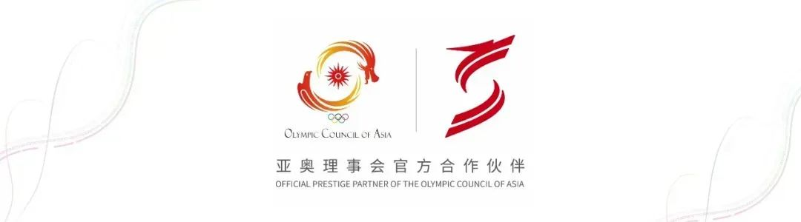

# 【AI风险通告】LLaMA-Factory存在远程代码执行漏洞（CVE-2025-53002）

<!-- vulwiki-editorial-rebuild:system-misc -->
## 条目范围与校订

- 本文对象：LLaMA-Factory WebUI checkpoint/value-head加载
- 文献类型：AI安全厂商通告
- 版本、权限及部署边界：文称<=0.9.3→0.9.4；低权限、可控vhead_file/checkpoint；torch<2.6默认weights_onlyFalse
- 核验状态：仅重建文本校订；未执行文中代码、PoC 或扫描，未把截图或转载声明记为本站复现

### 具体结论与待核项

以下为原归档的逐项勘误与证据缺口；可由文本确定的问题已在下文订正，仍缺来源的事实保持待核。

1. weights_onlyTrue保护缺失与参数路径应清楚拆句；需恶意文件能被服务访问并触发加载，不是仅字符串路径必RCE
2. PyTorch版本是底层行为条件而非所有torch受同CVE，2.6默认变化也不代替项目修复核验
3. 8.3与列AVN/ACL/PRL/UIN/SU/CH/IL/AH基本自洽，保持厂商2级独立量表；已发现PoC与未发现EXP是当时作者状态，不代表本站有代码
4. GHSA原始源明确，修复链接是main README而非固定release/commit；长HTML表恢复结构、无复现正文不补造

### 操作风险

原文技术操作的实际副作用未复现核验；按其请求/代码评估状态变更、凭据暴露和业务影响

技术请求、代码与实验方法按原文保留；其中的破坏性动作仅限授权、可恢复的隔离环境。缺失代码、参数或版本事实不猜补。

### 来源追溯

- 原文参考链接（未重新核验）：<https://github.com/hiyouga/LLaMA-Factory/blob/main/README_zh.md#%E5%AE%89%E8%A3%85-llama-factory>
- 原文参考链接（未重新核验）：<https://github.com/hiyouga/LLaMA-Factory/security/advisories/GHSA-xj56-p8mm-qmxj>
- 原始披露 URL 未确认；既有归档来源标签保留，不能替代原始公告

### 归档技术正文

安恒研究院  安恒信息CERT   2025-06-27 10:00  
  
  
  
<table><tbody><tr style="-webkit-tap-highlight-color:transparent;"><td colspan="4" data-colwidth="100.0000%" width="100.0000%" style="-webkit-tap-highlight-color:transparent;word-break:break-all;hyphens:auto;border-color:#4577da;background-color:#4577da;"><section style="-webkit-tap-highlight-color:transparent;margin:5px 0px;"><section style="-webkit-tap-highlight-color:transparent;margin-top:0px;margin-right:0px;margin-bottom:unset;margin-left:0px;padding:0px 5px;font-size:14px;color:rgb(255, 255, 255);box-sizing:border-box;">
<strong style="-webkit-tap-highlight-color:transparent;">漏洞概述</strong>
</section></section></td></tr><tr style="-webkit-tap-highlight-color:transparent;"><td data-colwidth="25.0000%" width="25.0000%" style="-webkit-tap-highlight-color:transparent;word-break:break-all;hyphens:auto;border-color:#4577da;"><section style="-webkit-tap-highlight-color:transparent;margin:5px 0px;"><section style="-webkit-tap-highlight-color:transparent;margin-top:0px;margin-right:0px;margin-bottom:unset;margin-left:0px;padding:0px 5px;font-size:14px;box-sizing:border-box;">
<strong style="-webkit-tap-highlight-color:transparent;">漏洞名称</strong>
</section></section></td><td colspan="3" data-colwidth="75.0000%" width="75.0000%" style="-webkit-tap-highlight-color:transparent;word-break:break-all;hyphens:auto;border-color:#4577da;"><section style="-webkit-tap-highlight-color:transparent;margin:5px 0px;"><section style="-webkit-tap-highlight-color:transparent;margin-top:0px;margin-right:0px;margin-bottom:unset;margin-left:0px;padding:0px 5px;font-size:14px;box-sizing:border-box;">
LLaMA-Factory存在远程代码执行漏洞（CVE-2025-53002）
</section></section></td></tr><tr style="-webkit-tap-highlight-color:transparent;"><td data-colwidth="25.0000%" width="25.0000%" style="-webkit-tap-highlight-color:transparent;word-break:break-all;hyphens:auto;border-color:#4577da;"><section style="-webkit-tap-highlight-color:transparent;margin:5px 0px;"><section style="-webkit-tap-highlight-color:transparent;margin-top:0px;margin-right:0px;margin-bottom:unset;margin-left:0px;padding:0px 5px;font-size:14px;box-sizing:border-box;">
<strong style="-webkit-tap-highlight-color:transparent;">安恒CERT评级</strong>
</section></section></td><td data-colwidth="25.0000%" width="25.0000%" style="-webkit-tap-highlight-color:transparent;word-break:break-all;hyphens:auto;border-color:#4577da;"><section style="-webkit-tap-highlight-color:transparent;margin:5px 0px;"><section style="-webkit-tap-highlight-color:transparent;margin-top:0px;margin-right:0px;margin-bottom:unset;margin-left:0px;padding:0px 5px;font-size:14px;box-sizing:border-box;">
2级
</section></section></td><td data-colwidth="25.0000%" width="25.0000%" style="-webkit-tap-highlight-color:transparent;word-break:break-all;hyphens:auto;border-color:#4577da;"><section style="-webkit-tap-highlight-color:transparent;margin:5px 0px;"><section style="-webkit-tap-highlight-color:transparent;margin-top:0px;margin-right:0px;margin-bottom:unset;margin-left:0px;padding:0px 5px;font-size:14px;box-sizing:border-box;">
<strong style="-webkit-tap-highlight-color:transparent;">CVSS3.1评分</strong>
</section></section></td><td data-colwidth="25.0000%" width="25.0000%" style="-webkit-tap-highlight-color:transparent;word-break:break-all;hyphens:auto;border-color:#4577da;"><section style="-webkit-tap-highlight-color:transparent;margin:5px 0px;"><section style="-webkit-tap-highlight-color:transparent;margin-top:0px;margin-right:0px;margin-bottom:unset;margin-left:0px;padding:0px 5px;font-size:14px;box-sizing:border-box;">
8.3
</section></section></td></tr><tr style="-webkit-tap-highlight-color:transparent;"><td data-colwidth="25.0000%" width="25.0000%" style="-webkit-tap-highlight-color:transparent;word-break:break-all;hyphens:auto;border-color:#4577da;"><section style="-webkit-tap-highlight-color:transparent;margin:5px 0px;"><section style="-webkit-tap-highlight-color:transparent;margin-top:0px;margin-right:0px;margin-bottom:unset;margin-left:0px;padding:0px 5px;font-size:14px;box-sizing:border-box;">
<strong style="-webkit-tap-highlight-color:transparent;">CVE编号</strong>
</section></section></td><td data-colwidth="25.0000%" width="25.0000%" style="-webkit-tap-highlight-color:transparent;word-break:break-all;hyphens:auto;border-color:#4577da;"><section style="-webkit-tap-highlight-color:transparent;margin:5px 0px;">
CVE-2025-53002
<section style="-webkit-tap-highlight-color:transparent;margin-top:0px;margin-right:0px;margin-bottom:unset;margin-left:0px;padding:0px 5px;font-size:14px;overflow:hidden;line-height:0;box-sizing:border-box;"> </section></section></td><td data-colwidth="25.0000%" width="25.0000%" style="-webkit-tap-highlight-color:transparent;word-break:break-all;hyphens:auto;border-color:#4577da;"><section style="-webkit-tap-highlight-color:transparent;margin:5px 0px;"><section style="-webkit-tap-highlight-color:transparent;margin-top:0px;margin-right:0px;margin-bottom:unset;margin-left:0px;padding:0px 5px;font-size:14px;box-sizing:border-box;">
<strong style="-webkit-tap-highlight-color:transparent;">CNVD编号</strong>
</section></section></td><td data-colwidth="25.0000%" width="25.0000%" style="-webkit-tap-highlight-color:transparent;word-break:break-all;hyphens:auto;border-color:#4577da;"><section style="-webkit-tap-highlight-color:transparent;margin:5px 0px;"><section style="-webkit-tap-highlight-color:transparent;margin-top:0px;margin-right:0px;margin-bottom:unset;margin-left:0px;padding:0px 5px;font-size:14px;box-sizing:border-box;">
未分配
</section></section></td></tr><tr style="-webkit-tap-highlight-color:transparent;"><td data-colwidth="25.0000%" width="25.0000%" style="-webkit-tap-highlight-color:transparent;word-break:break-all;hyphens:auto;border-color:#4577da;"><section style="-webkit-tap-highlight-color:transparent;margin:5px 0px;"><section style="-webkit-tap-highlight-color:transparent;margin-top:0px;margin-right:0px;margin-bottom:unset;margin-left:0px;padding:0px 5px;font-size:14px;box-sizing:border-box;">
<strong style="-webkit-tap-highlight-color:transparent;">CNNVD编号</strong>
</section></section></td><td data-colwidth="25.0000%" width="25.0000%" style="-webkit-tap-highlight-color:transparent;word-break:break-all;hyphens:auto;border-color:#4577da;"><section style="-webkit-tap-highlight-color:transparent;margin:5px 0px;"><section style="-webkit-tap-highlight-color:transparent;margin-top:0px;margin-right:0px;margin-bottom:unset;margin-left:0px;padding:0px 5px;font-size:14px;box-sizing:border-box;">
未分配
</section></section></td><td data-colwidth="25.0000%" width="25.0000%" style="-webkit-tap-highlight-color:transparent;word-break:break-all;hyphens:auto;border-color:#4577da;"><section style="-webkit-tap-highlight-color:transparent;margin:5px 0px;"><section style="-webkit-tap-highlight-color:transparent;margin-top:0px;margin-right:0px;margin-bottom:unset;margin-left:0px;padding:0px 5px;font-size:14px;box-sizing:border-box;">
<strong style="-webkit-tap-highlight-color:transparent;">安恒CERT编号</strong>
</section></section></td><td data-colwidth="25.0000%" width="25.0000%" style="-webkit-tap-highlight-color:transparent;word-break:break-all;hyphens:auto;border-color:#4577da;"><section style="-webkit-tap-highlight-color:transparent;margin:5px 0px;"><section style="-webkit-tap-highlight-color:transparent;margin-top:0px;margin-right:0px;margin-bottom:unset;margin-left:0px;padding:0px 5px;font-size:14px;box-sizing:border-box;">
DM-202506-002008
</section></section></td></tr><tr style="-webkit-tap-highlight-color:transparent;"><td data-colwidth="25.0000%" width="25.0000%" style="-webkit-tap-highlight-color:transparent;word-break:break-all;hyphens:auto;border-color:#4577da;"><section style="-webkit-tap-highlight-color:transparent;margin:5px 0px;"><section style="-webkit-tap-highlight-color:transparent;margin-top:0px;margin-right:0px;margin-bottom:unset;margin-left:0px;padding:0px 5px;font-size:14px;box-sizing:border-box;">
<strong style="-webkit-tap-highlight-color:transparent;">POC情况</strong>
</section></section></td><td data-colwidth="25.0000%" width="25.0000%" style="-webkit-tap-highlight-color:transparent;word-break:break-all;hyphens:auto;border-color:#4577da;"><section style="-webkit-tap-highlight-color:transparent;margin:5px 0px;"><section style="-webkit-tap-highlight-color:transparent;margin-top:0px;margin-right:0px;margin-bottom:unset;margin-left:0px;padding:0px 5px;font-size:14px;box-sizing:border-box;">
已发现
</section></section></td><td data-colwidth="25.0000%" width="25.0000%" style="-webkit-tap-highlight-color:transparent;word-break:break-all;hyphens:auto;border-color:#4577da;"><section style="-webkit-tap-highlight-color:transparent;margin:5px 0px;"><section style="-webkit-tap-highlight-color:transparent;margin-top:0px;margin-right:0px;margin-bottom:unset;margin-left:0px;padding:0px 5px;font-size:14px;box-sizing:border-box;">
<strong style="-webkit-tap-highlight-color:transparent;">EXP情况</strong>
</section></section></td><td data-colwidth="25.0000%" width="25.0000%" style="-webkit-tap-highlight-color:transparent;word-break:break-all;hyphens:auto;border-color:#4577da;"><section style="-webkit-tap-highlight-color:transparent;margin:5px 0px;"><section style="-webkit-tap-highlight-color:transparent;margin-top:0px;margin-right:0px;margin-bottom:unset;margin-left:0px;padding:0px 5px;font-size:14px;box-sizing:border-box;">
未发现
</section></section></td></tr><tr style="-webkit-tap-highlight-color:transparent;"><td data-colwidth="25.0000%" width="25.0000%" style="-webkit-tap-highlight-color:transparent;word-break:break-all;hyphens:auto;border-color:#4577da;"><section style="-webkit-tap-highlight-color:transparent;margin:5px 0px;"><section style="-webkit-tap-highlight-color:transparent;margin-top:0px;margin-right:0px;margin-bottom:unset;margin-left:0px;padding:0px 5px;font-size:14px;box-sizing:border-box;">
<strong style="-webkit-tap-highlight-color:transparent;">在野利用</strong>
</section></section></td><td data-colwidth="25.0000%" width="25.0000%" style="-webkit-tap-highlight-color:transparent;word-break:break-all;hyphens:auto;border-color:#4577da;"><section style="-webkit-tap-highlight-color:transparent;margin:5px 0px;"><section style="-webkit-tap-highlight-color:transparent;margin-top:0px;margin-right:0px;margin-bottom:unset;margin-left:0px;padding:0px 5px;font-size:14px;box-sizing:border-box;">
未发现
</section></section></td><td data-colwidth="25.0000%" width="25.0000%" style="-webkit-tap-highlight-color:transparent;word-break:break-all;hyphens:auto;border-color:#4577da;"><section style="-webkit-tap-highlight-color:transparent;margin:5px 0px;"><section style="-webkit-tap-highlight-color:transparent;margin-top:0px;margin-right:0px;margin-bottom:unset;margin-left:0px;padding:0px 5px;font-size:14px;box-sizing:border-box;">
<strong style="-webkit-tap-highlight-color:transparent;">研究情况</strong>
</section></section></td><td data-colwidth="25.0000%" width="25.0000%" style="-webkit-tap-highlight-color:transparent;word-break:break-all;hyphens:auto;border-color:#4577da;"><section style="-webkit-tap-highlight-color:transparent;margin:5px 0px;"><section style="-webkit-tap-highlight-color:transparent;margin-top:0px;margin-right:0px;margin-bottom:unset;margin-left:0px;padding:0px 5px;font-size:14px;box-sizing:border-box;">
分析中
</section></section></td></tr><tr style="-webkit-tap-highlight-color:transparent;"><td data-colwidth="25.0000%" width="25.0000%" style="-webkit-tap-highlight-color:transparent;word-break:break-all;hyphens:auto;border-color:#4577da;"><section style="-webkit-tap-highlight-color:transparent;margin:5px 0px;"><section style="-webkit-tap-highlight-color:transparent;margin-top:0px;margin-right:0px;margin-bottom:unset;margin-left:0px;padding:0px 5px;font-size:14px;box-sizing:border-box;">
<strong style="-webkit-tap-highlight-color:transparent;">危害描述</strong>
</section></section></td><td colspan="3" data-colwidth="75.0000%" width="75.0000%" style="-webkit-tap-highlight-color:transparent;word-break:break-all;hyphens:auto;border-color:#4577da;"><section style="-webkit-tap-highlight-color:transparent;margin:5px 0px;"><section style="-webkit-tap-highlight-color:transparent;margin-top:0px;margin-right:0px;margin-bottom:unset;margin-left:0px;padding:0px 5px;font-size:14px;overflow:hidden;line-height:0;box-sizing:border-box;"> </section>
由于加载的参数没有使用安全参数（Checkpoint path WebUI vhead_file weights_only=True），攻击者可以通过接口传递恶意参数vhead_file从而在服务器上执行任意恶意代码。在torch版本&lt;2.6中，默认设置是weights_only=False，而 Llama Factory setup.py只需要torch&gt;=2.0.0。
<section style="-webkit-tap-highlight-color:transparent;margin-top:0px;margin-right:0px;margin-bottom:unset;margin-left:0px;padding:0px 5px;font-size:14px;overflow:hidden;line-height:0;box-sizing:border-box;"> </section></section></td></tr></tbody></table>  
  
该产  
品主要使用客户行业分布广泛，漏洞危害性高，  
建议客户尽快做好自查及防护。  
  
  
  
**漏洞信息**  
  
  
  
  
LLaMA Factory是一款开源低代码大模型微调框架，集成了业界广泛使用的微调技术，支持通过Web UI界面零代码微调大模型。  
  
  
**漏洞描述**  
  
**漏洞危害等级：**  
高危  
  
**漏洞类型：**  
远程代码执行  
  
  
**影响范围**  
  
**影响版本：**  
  
LLaMA-Factory <= 0.9.3  
  
**安全版本：**  
  
LLaMA-Factory >= 0.9.4  
  
  
**CVSS向量**  
  
访问途径（AV）：网络  
  
攻击复杂度（AC）：低  
  
所需权限（PR）：低  
  
用户交互（UI）：无  
  
影响范围 （S）：不变  
  
机密性影响 （C）：高  
  
完整性影响 （l）：低  
  
可用性影响 （A）：高  
  
  
  
**修复方案**  
  
  
  
  
**官方修复方案：**  
  
官方已发布修复方案，受影响的用户建议及时更新至安全版本0.9.4。  
  
https://github.com/hiyouga/LLaMA-Factory/blob/main/README_zh.md#%E5%AE%89%E8%A3%85-llama-factory  
  
  
**参考资料**  
  
  
  
  
  
https://github.com/hiyouga/LLaMA-Factory/security/advisories/GHSA-xj56-p8mm-qmxj  
  
  
  
**技术支持**  
  
  
  
  
如有漏洞相关需求支持请联系400-6059-110获取相关能力支撑。  
  
  

---

> 来源：gelusus/wxvl（微信公众号漏洞文章自动归档，原始披露 URL 尚未确认，现有链接按来源追溯区分别标注）
