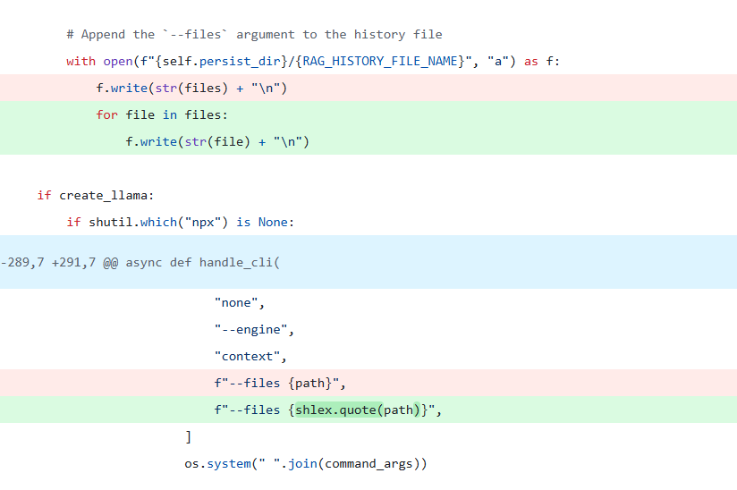

# 【AI高危漏洞预警】LLama-Index CLI命令执行漏洞(CVE-2025-1753)

<!-- vulwiki-editorial-rebuild:system-misc -->
## 条目范围与校订

- 本文对象：LlamaIndex CLI（包名待明确）
- 文献类型：CLI命令注入简讯
- 版本、权限及部署边界：控制--files进入os.system；Web远程仅当应用把不可信文件名传CLI；正文0.12.20 vs<=0.12.37
- 核验状态：仅重建文本校订；未执行文中代码、PoC 或扫描，未把截图或转载声明记为本站复现

### 具体结论与待核项

以下为原归档的逐项勘误与证据缺口；可由文本确定的问题已在下文订正，仍缺来源的事实保持待核。

1. CLI参数可控与远程服务受影响已做条件化应保留，不能按AI标题一律未认证远程RCE
2. 两个版本范围未提供来源，缺首修版本；LlamaIndex元包/CLI子包版本需区别，llama_index --version是否真实命令需核
3. 同形字符导致包名/API搜索和命令复制异常；缺公告/commit/代码与复现，升级最新泛化

### 操作风险

原文技术操作的实际副作用未复现核验；按其请求/代码评估状态变更、凭据暴露和业务影响

技术请求、代码与实验方法按原文保留；其中的破坏性动作仅限授权、可恢复的隔离环境。缺失代码、参数或版本事实不猜补。

### 来源追溯

- 原始披露 URL 未确认；既有归档来源标签保留，不能替代原始公告

### 归档技术正文

cexlife  飓风网络安全   2025-05-28 14:34  
  
  
  
漏洞描述:  
  
LLаmа-Indех CLI版本v0.12.20包含一个OS命令注入漏洞,该漏洞源于对--filеѕ参数的不当处理,该参数直接传递给оѕ.ѕуѕtеm如果攻击者控制了此参数的内容,可以注入并执行任意ѕhеll命令,如果攻击者控制了CLI参数,此漏洞可以在本地被利用,如果Wеb应用程序使用用户控制的文件名调用LLаmа-Indех CLI,此漏洞也可以远程被利用,此问题可能导致在受影响系统上执行任意代码。  
  
  
  
攻击场景:  
  
攻击者可能通过控制CLI参数,特别是--files参数,来注入并执行任意shell命令  
  
影响产品:  
  
0.12.37及之前版本   
  
检测方法:  
  
可以通过检查版本号来确定是否受影响,使用命令llama_index --version查看当前版本  
  
修复建议:  
  
安装补丁:  
  
请更新到llаmа_indех的最新版本,同时审查和限制用户输入的处理方式,以减少命令注入的风险。  
  
  

---

> 来源：gelusus/wxvl（微信公众号漏洞文章自动归档，原始披露 URL 尚未确认，现有链接按来源追溯区分别标注）
