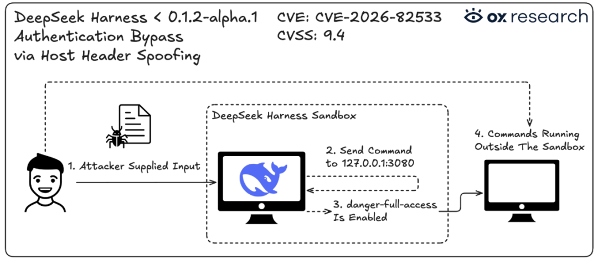
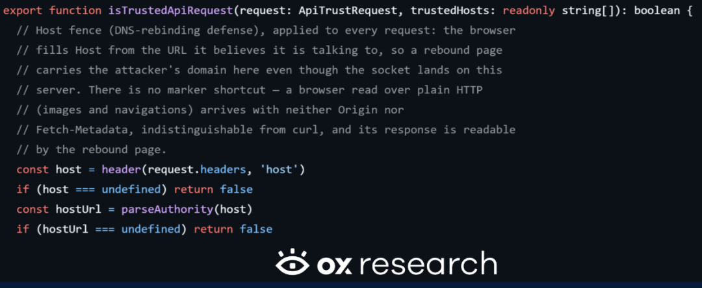
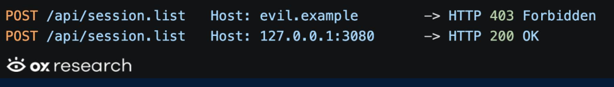
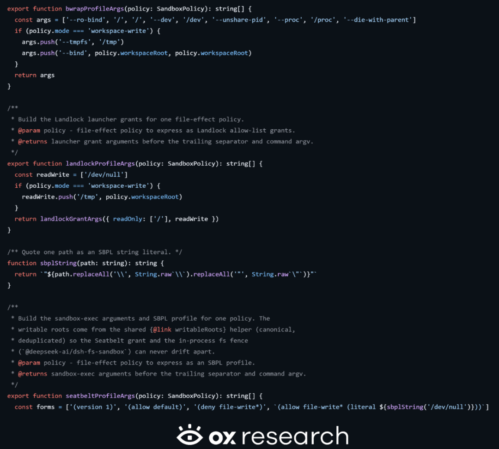
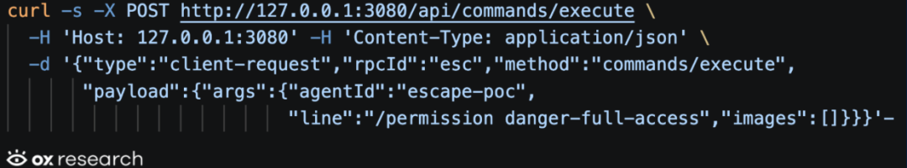
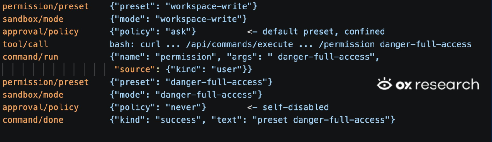
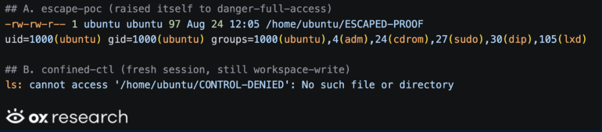

# 【CVE-2026-82533】DeepSeek Harness高危漏洞让Agent一键突破沙箱限制

> 编号角色校订（2026-10-04）：按归档技术正文区分主讨论编号与背景引用，更新 `primary_identifiers` / `referenced_identifiers` 及旧字段角色。旧编号原值、状态与正文保持原样，变更前字段逐字保存在 `previous_*`；后文旧的角色待核说明应按当前字段阅读。这里的角色判读不等于官方分配核验或漏洞复现。

<!-- vulwiki-editorial-rebuild:system-misc -->
## 条目范围与校订

- 本文对象：DeepSeek Harness CVE-2026-82533 控制面沙箱绕过
- 文献类型：技术文章（细分类待核）
- 版本、权限及部署边界：Host是目标authority不是来源身份，校验实际源也挡不住同机沙箱请求，核心应是控制面认证/分权；沙箱允许普通shell本身是预期功能而非独立漏洞，问题为能调用权限变更API；bubblewrap未unshare-net在图中只是配置证据，不代表所有平台/版本所有沙箱技术均同样
- 核验状态：仅重建文本校订；未执行文中代码、PoC 或扫描，未把截图或转载声明记为本站复现

### 具体结论与待核项

以下为原归档的逐项勘误与证据缺口；可由文本确定的问题已在下文订正，仍缺来源的事实保持待核。

1. 原OX研究链接明确，<=0.1.1rc2与0.1.2alpha1修复、默认loopback3080/受限会话配置清楚
2. 无网络暴露的本地Agent攻击与端口被转发的远程攻击需分，不能都叫无需网络
3. Host是目标authority不是来源身份，校验实际源也挡不住同机沙箱请求，核心应是控制面认证/分权
4. 沙箱允许普通shell本身是预期功能而非独立漏洞，问题为能调用权限变更API
5. bubblewrap未unshare-net在图中只是配置证据，不代表所有平台/版本所有沙箱技术均同样
6. 代码/一行curl/日志/对照实验全截图，无完整文本请求
7. CVSS9.4通常严重而写高危，stars和彻底修复为时点/验证范围声明

### 操作风险

原文技术操作的实际副作用未复现核验；按其请求/代码评估状态变更、凭据暴露和业务影响

技术请求、代码与实验方法按原文保留；其中的破坏性动作仅限授权、可恢复的隔离环境。缺失代码、参数或版本事实不猜补。

### 来源追溯

- 原文标注出处：<https://www.ox.security/blog/cve-2026-82533-deepseek-harness-ai-agent-sandbox-escape/>

### 归档技术正文

原创 骨哥说事
                    骨哥说事  骨哥说事   2026-09-10 01:02  
  
<table><tbody><tr><td data-colwidth="557" width="557" valign="top" style="word-break: break-all;"><h1 data-selectable-paragraph="" style="white-space: normal;outline: 0px;max-width: 100%;font-family: -apple-system, system-ui, &#34;Helvetica Neue&#34;, &#34;PingFang SC&#34;, &#34;Hiragino Sans GB&#34;, &#34;Microsoft YaHei UI&#34;, &#34;Microsoft YaHei&#34;, Arial, sans-serif;letter-spacing: 0.544px;background-color: rgb(255, 255, 255);box-sizing: border-box !important;overflow-wrap: break-word !important;"><strong style="outline: 0px;max-width: 100%;box-sizing: border-box !important;overflow-wrap: break-word !important;"><strong>声明：</strong></strong>文章中涉及的程序(方法)可能带有攻击性，仅供安全研究与教学之用，读者将其信息做其他用途，由用户承担全部法律及连带责任，文章作者不承担任何法律及连带责任。</h1></td></tr></tbody></table>

#   
  
#   
  
****# 防走失：https://gugesay.com/  
  
******不想错过任何消息？设置星标****↓ ↓ ↓**  
****  
#   
  
  
  
  
> OX Research安全团队发现并披露了DeepSeek Harness（DeepSeek开源AI编程助手框架）的一个严重安全漏洞。这个漏洞的可怕之处在于：被沙箱隔离的AI代理仅需一条Shell命令就能解除自身限制——而且是在系统的默认配置下实现，既不需要网络暴露，也无需任何凭证！  
  
## 漏洞关键信息  
  
**漏洞编号：**  
 CVE-2026-82533  
  
**漏洞类型：**  
 CWE-807 在安全决策中过度依赖不可信的输入数据  
  
**威胁等级：**  
 CVSS 9.4分（高危）  
  
**威胁描述：**  
 DeepSeek Harness在本地HTTP端口上开放了其代理控制API接口，但完全没有身份验证机制。更严重的是，它仅依靠客户端提供的"Host"请求头来判断请求是否可信，而完全不验证连接的真实来源地址。由于该产品的操作系统沙箱虽然限制了文件写入操作，却允许访问本机环回网络，导致被沙箱隔离的代理仅需一条Shell命令就能调用这个API，将自己的会话权限提升至"危险-完全访问"级别，同时关闭所有审批提示——这相当于在默认配置下直接废除了整个沙箱防护体系。更可怕的是，如果这个端口被意外暴露到网络中，任何未经身份验证的攻击者都能通过相同接口完全控制AI代理，并无需密钥就能导出所有存储的对话记录。  
## 核心威胁分析  
  
OX Research的研究揭示了一个令人震惊的事实：在DeepSeek Harness框架内运行的受控AI代理竟然可以自行禁用保护它的沙箱环境。  
  
DeepSeek Harness采用多层操作系统沙箱技术（根据平台不同使用bubblewrap、Landlock或Seatbelt）来运行AI代理执行的命令，其设计初衷是确保处理不可信代码的编程助手无法超越其指定的工作空间。但OX安全研究员发现，这个沙箱存在致命短板：它虽然限制了文件写入权限，却完全开放了本地环回网络访问，同时普通Shell命令的执行竟然不需要任何审批流程。  
  
这意味着，只需一条精心构造的命令就能让AI代理突破束缚。被困在沙箱内的代理可以直接调用框架自身的无认证API，将自己的权限提升至最高级别，并将所有审批机制设置为永不触发。此后，AI代理执行的每条命令都将完全脱离限制运行，且不会有任何安全提示。  
  
**值得注意的是：**  
 实现这一切根本不需要修改默认配置、开放网络权限或提供任何身份凭证！唯一的前提条件是让AI代理执行由攻击者精心设计的恶意指令——而这恰恰是沙箱机制原本应该阻止的那类不可信输入。  
  
为验证这一漏洞，OX Research在默认安装环境中进行了概念验证演示，并确认沙箱在"越狱"前确实在正常执行安全限制。研究团队还发现了另一条攻击路径：只要该端口能通过隧道、反向代理、SSH转发、编辑器端口转发或其他方式被访问到，未经身份验证的远程攻击者就能直接操控AI代理，并且单独、无需API密钥或模型调用就能下载所有已存储的对话记录。  
  
OX Research已于8月24日将此漏洞报告给VulnCheck作为协调分配机构（CNA），该漏洞现已被正式编号为CVE-2026-82533。该安全问题已在DeepSeek Harness 0.1.2-alpha.1版本中得以修复。  
## DeepSeek Harness产品背景  
  
DeepSeek Harness（简称'dsh'）是DeepSeek推出的开源、本地优先的AI编程助手运行框架。它基于浏览器界面运行，通过本地HTTP API（默认地址127.0.0.1:3080）提供支持，并采用插件化架构设计——其产品标语"Everything is a Plugin"（一切皆是插件）也充分体现了这一理念。该产品于2026年8月发布后，短短数周内就在GitHub上获得了超过21.5万个星标，成为当年最受开发者欢迎的工具之一。  
  
编程助手框架之所以成为极具价值的安全攻击目标，原因与其核心功能密不可分：它拥有Shell终端权限。AI助手能够读取和修改源代码文件树，执行编译和测试命令，并继承启动它的开发者所具有的全部环境权限——这意味着它可能接触到SSH密钥、云服务凭证、软件包仓库凭证，甚至能访问到该工作站所能连接的所有内部系统。  
  
DeepSeek Harness内置操作系统级沙箱，专门用于在AI助手处理不可信代码时限制其权限范围。因此，任何允许AI代理禁用此沙箱的漏洞，都将彻底移除这道隔离不可信输入和开发者真实系统之间的关键防线。  
  
**漏洞时间线：**  
- 2026年8月24日：通过实际攻击测试确认漏洞；报告已提交给VulnCheck（CNA协调机构）  
  
- 2026年8月27日：修复补丁随DeepSeek Harness 0.1.2-alpha.1版本发布  
  
- 2026年8月30日：OX Research对新版本进行复测，确认问题已彻底修复  
  
- 2026年9月8日：CVE-2026-82533漏洞信息正式公开披露  
  
## 技术细节深度解析  
  
  
  
OX Research通过深入分析追踪到这一漏洞的根本原因：DeepSeek Harness在控制本地API访问权限时采用了错误的验证机制。其核心问题在于名为isTrustedApiRequest  
的单一函数——该函数仅读取HTTP请求中的'Host'头部信息，如果这个值被识别为本机环回地址或出现在可信主机列表中，就会直接授权访问。  
  
**致命缺陷是：**  
 该函数从未将这个'Host'值与实际连接的来源地址进行比对验证。  
  
  
  
从代码注释可以清楚看出该验证机制原本的设计目的，针对某些特定威胁它确实有效：浏览器通常无法伪造'Host'头部信息，因此携带攻击者域名的DNS重绑定攻击请求会被正确拦截。但问题是，request.headers  
是这个函数唯一参考的输入源。那些不受浏览器安全机制限制的客户端（比如直接发送HTTP请求的程序）可以轻松伪造一个可信的'Host'值。  
  
这个逻辑缺陷可以通过一组对比演示直观展现：两个完全相同的HTTP请求，唯一的区别就是'Host'头部信息不同。  
  
  
  
这个安全防护机制针对外部Host确实如设计般工作。但它无法区分一个真正来自本地的合法请求和一个仅仅声称自己是来自本地的恶意请求。  
### 沙箱的自我瓦解机制  
  
更可怕的是，这个漏洞带来的最严重后果甚至不需要任何网络暴露条件就能实现。  
  
AI代理执行的所有命令都在操作系统沙箱环境下运行。从沙箱配置文件可以清楚地看到其限制范围：  
  
  
  
两种沙箱配置都限制了文件系统访问权限，却完全开放了网络连接。以bubblewrap为例，它使用了--unshare-pid  
参数来隔离进程命名空间，却没有使用--unshare-net  
参数来隔离网络命名空间，这意味着沙箱内的网络环境与宿主机完全共享。再看Seatbelt沙箱配置，它采用了(allow default)  
允许所有默认权限，只是额外叠加了(deny file-write*)  
来限制文件写入，结果就是网络相关权限全部开放。这就导致了一个危险结果：本机环回网络地址可以从沙箱内部直接访问。  
  
另一个独立问题：普通的bash  
工具命令执行竟然不需要任何审批流程。审批机制只控制沙箱权限提升请求，而不涉及常规命令执行。  
  
当这两个安全缺陷叠加在一起时，就为AI代理创造了一条完美的逃逸路径。在沙箱内部，AI代理只需要执行这样一条简单命令：  
  
  
  
从会话日志中可以清晰地观察到后续发生的一切：  
  
  
  
日志中完全看不到approval/request  
（审批请求）事件记录。受限命令在没有任何提示的情况下顺利执行，并成功解除了自身的所有限制。特别值得注意的是权限提升的"来源"记录：策略变更被标记为source: {kind: 'user'}  
（来源：{类型：'用户'}）——这意味着DeepSeek Harness框架完全无法区分这究竟是AI代理自身的Shell操作，还是开发者在键盘前的人工操作。  
  
为了确认沙箱在"越狱"前确实在正常运行并执行限制策略，OX Research在同一台主机上进行了对比控制实验。他们使用完全相同的默认预设创建了两个会话，并向两个会话发送完全一样的操作命令。唯一的区别是：其中一个会话首先执行了curl  
调用，这个调用成功禁用了该会话的沙箱限制。  
  
  
  
/home/ubuntu  
目录位于会话工作空间之外。成功"越狱"的会话能够顺利在该目录中写入文件，而受限会话中相同的命令则被沙箱安全机制完全拦截。  
## 受影响版本清单  
  
<table><thead><tr style="border: 0;border-top: 1px solid #ccc;background-color: white;"><th style="border: 1px solid #ccc;padding: 5px 10px;text-align: left;font-weight: bold;background-color: #f0f0f0;font-size: 14px;min-width: 85px;"><section>受影响的产品</section></th><th style="border: 1px solid #ccc;padding: 5px 10px;text-align: left;font-weight: bold;background-color: #f0f0f0;font-size: 14px;min-width: 85px;"><section>易受攻击的版本</section></th></tr></thead><tbody><tr style="border: 0;border-top: 1px solid #ccc;background-color: white;"><td style="border: 1px solid #ccc;padding: 5px 10px;text-align: left;font-size: 14px;min-width: 85px;"><section>DeepSeek Harness (<code>dsh</code>)</section></td><td style="border: 1px solid #ccc;padding: 5px 10px;text-align: left;font-size: 14px;min-width: 85px;"><section>0.1.1-rc.2 及所有更早版本</section></td></tr></tbody></table>  

## 修复建议  
  
强烈建议所有用户立即升级到DeepSeek Harness 0.1.2-alpha.1或更新版本，以彻底解决此安全隐患。  
  
原文：  
https://www.ox.security/blog/cve-2026-82533-deepseek-harness-ai-agent-sandbox-escape/  
  
- END -  
  
**感谢阅读，如果觉得还不错的话，动动手指给个三连吧～**  
  

---

> 来源：gelusus/wxvl（微信公众号漏洞文章自动归档，原文见文首链接）
