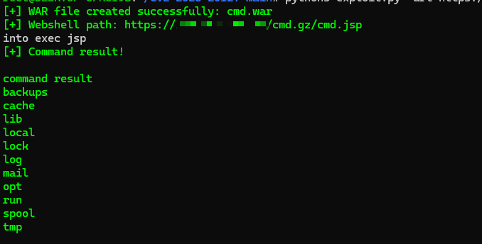

# 【在野利用】Cisco Catalyst SD-WAN Manager 任意文件覆盖漏洞（CVE-2026-20122）

> 编号角色校订（2026-10-04）：按归档技术正文区分主讨论编号与背景引用，更新 `primary_identifiers` / `referenced_identifiers` 及旧字段角色。旧编号原值、状态与正文保持原样，变更前字段逐字保存在 `previous_*`；后文旧的角色待核说明应按当前字段阅读。这里的角色判读不等于官方分配核验或漏洞复现。

<!-- vulwiki-editorial-rebuild:system-misc -->
## 条目范围与校订

- 本文对象：Cisco Catalyst SD-WAN Manager CVE-2026-20122
- 文献类型：技术文章（细分类待核）
- 版本、权限及部署边界：认证后文件覆盖前提明确但所需权限角色/API未给，WebShell落点/执行权限只截图；影响20.15全版本与建议20.15.4.2修复自相矛盾，20.12只列.5/.6缺早补丁状态，20.10/17等未说明；任意写继承服务权限不自动接管全部网络，需配置/部署链
- 核验状态：仅重建文本校订；未执行文中代码、PoC 或扫描，未把截图或转载声明记为本站复现

### 具体结论与待核项

以下为原归档的逐项勘误与证据缺口；可由文本确定的问题已在下文订正，仍缺来源的事实保持待核。

1. 认证后文件覆盖前提明确但所需权限角色/API未给，WebShell落点/执行权限只截图
2. 影响20.15全版本与建议20.15.4.2修复自相矛盾，20.12只列.5/.6缺早补丁状态，20.10/17等未说明
3. 有Cisco具体公告/NVD，需逐分支重建不能按字符串顺序比较
4. 任意写继承服务权限不自动接管全部网络，需配置/部署链
5. PoCEXP公开而技术细节未公开可为不同状态但需解释并链接
6. 在野为官方源待核，勿和认证绕过其他CVE合并

### 操作风险

认证后文件覆盖前提明确但所需权限角色/API未给，WebShell落点/执行权限只截图

技术请求、代码与实验方法按原文保留；其中的破坏性动作仅限授权、可恢复的隔离环境。缺失代码、参数或版本事实不猜补。

### 来源追溯

- 原始披露 URL 未确认；既有归档来源标签保留，不能替代原始公告

### 归档技术正文

原创 360漏洞研究院
                    360漏洞研究院  360漏洞研究院   2026-03-10 08:31  
  
“扫描下方二维码，进入公众号粉丝交流群。更多一手网安资讯、漏洞预警、技术干货和技术交流等您参与！”  
  
  
  
  
  
  
<table><tbody><tr style="box-sizing: border-box;"><td colspan="4" data-colwidth="100.0000%" width="100.0000%" style="border-width: 1px;border-color: rgb(100, 130, 228);border-style: solid;background-color: rgb(100, 130, 228);box-sizing: border-box;padding: 0px;"><section style="text-align: center;color: rgb(255, 255, 255);box-sizing: border-box;">
<strong style="box-sizing: border-box;">漏洞概述</strong>
</section></td></tr><tr style="box-sizing: border-box;"><td data-colwidth="24.0000%" width="24.0000%" style="border-width: 1px;border-color: rgb(100, 130, 228);border-style: solid;box-sizing: border-box;padding: 0px;"><section style="font-size: 12px;color: rgb(0, 0, 0);padding: 0px 8px;box-sizing: border-box;">
<strong style="box-sizing: border-box;">漏洞名称</strong>
</section></td><td colspan="3" data-colwidth="76.0000%" width="76.0000%" style="border-width: 1px;border-color: rgb(100, 130, 228);border-style: solid;box-sizing: border-box;padding: 0px;"><section style="font-size: 12px;padding: 0px 8px;box-sizing: border-box;">
Cisco Catalyst SD-WAN Manager 任意文件覆盖漏洞
</section></td></tr><tr style="box-sizing: border-box;"><td data-colwidth="24.0000%" width="24.0000%" style="border-width: 1px;border-color: rgb(100, 130, 228);border-style: solid;box-sizing: border-box;padding: 0px;"><section style="font-size: 12px;color: rgb(0, 0, 0);padding: 0px 8px;box-sizing: border-box;">
<strong style="box-sizing: border-box;">漏洞编号</strong>
</section></td><td colspan="3" data-colwidth="76.0000%" width="76.0000%" style="border-width: 1px;border-color: rgb(100, 130, 228);border-style: solid;box-sizing: border-box;padding: 0px;"><section style="font-size: 12px;padding: 0px 8px;box-sizing: border-box;">
CVE-2026-20122
</section></td></tr><tr style="box-sizing: border-box;"><td data-colwidth="24.0000%" width="24.0000%" style="border-width: 1px;border-color: rgb(100, 130, 228);border-style: solid;box-sizing: border-box;padding: 0px;"><section style="font-size: 12px;color: rgb(0, 0, 0);padding: 0px 8px;box-sizing: border-box;">
<strong style="box-sizing: border-box;">公开时间</strong>
</section></td><td data-colwidth="28.0000%" width="28.0000%" style="border-width: 1px;border-color: rgb(100, 130, 228);border-style: solid;box-sizing: border-box;padding: 0px;"><section style="font-size: 12px;padding: 0px 8px;box-sizing: border-box;">
2026-02-25
</section></td><td data-colwidth="28.0000%" width="28.0000%" style="border-width: 1px;border-color: rgb(100, 130, 228);border-style: solid;box-sizing: border-box;padding: 0px;"><section style="font-size: 12px;padding: 0px 8px;box-sizing: border-box;">
<strong style="box-sizing: border-box;">POC状态</strong>
</section></td><td data-colwidth="20.0000%" width="20.0000%" style="border-width: 1px;border-color: rgb(100, 130, 228);border-style: solid;box-sizing: border-box;padding: 0px;"><section style="font-size: 12px;padding: 0px 8px;color: rgb(100, 130, 228);box-sizing: border-box;">
<strong style="box-sizing: border-box;">已公开</strong>
</section></td></tr><tr style="box-sizing: border-box;"><td data-colwidth="24.0000%" width="24.0000%" style="border-width: 1px;border-color: rgb(100, 130, 228);border-style: solid;box-sizing: border-box;padding: 0px;"><section style="font-size: 12px;color: rgb(0, 0, 0);padding: 0px 8px;box-sizing: border-box;">
<strong style="box-sizing: border-box;">漏洞类型</strong>
</section></td><td data-colwidth="28.0000%" width="28.0000%" style="border-width: 1px;border-color: rgb(100, 130, 228);border-style: solid;box-sizing: border-box;padding: 0px;"><section style="font-size: 12px;padding: 0px 8px;box-sizing: border-box;">
特权API使用不当
</section></td><td data-colwidth="28.0000%" width="28.0000%" style="border-width: 1px;border-color: rgb(100, 130, 228);border-style: solid;box-sizing: border-box;padding: 0px;"><section style="font-size: 12px;color: rgb(0, 0, 0);padding: 0px 8px;box-sizing: border-box;">
<strong style="box-sizing: border-box;">EXP状态</strong>
</section></td><td data-colwidth="20.0000%" width="20.0000%" style="border-width: 1px;border-color: rgb(100, 130, 228);border-style: solid;box-sizing: border-box;padding: 0px;"><section style="font-size: 12px;padding: 0px 8px;color: rgb(100, 130, 228);box-sizing: border-box;">
<strong style="box-sizing: border-box;">已公开</strong>
</section></td></tr><tr style="box-sizing: border-box;"><td data-colwidth="24.0000%" width="24.0000%" style="border-width: 1px;border-color: rgb(100, 130, 228);border-style: solid;box-sizing: border-box;padding: 0px;"><section style="font-size: 12px;padding: 0px 8px;box-sizing: border-box;">
<strong style="box-sizing: border-box;">利用可能性</strong>
</section></td><td data-colwidth="28.0000%" width="28.0000%" style="border-width: 1px;border-color: rgb(100, 130, 228);border-style: solid;box-sizing: border-box;padding: 0px;"><section style="font-size: 12px;padding: 0px 8px;box-sizing: border-box;">
高
</section></td><td data-colwidth="28.0000%" width="28.0000%" style="border-width: 1px;border-color: rgb(100, 130, 228);border-style: solid;box-sizing: border-box;padding: 0px;"><section style="font-size: 12px;padding: 0px 8px;color: rgb(0, 0, 0);box-sizing: border-box;">
<strong style="box-sizing: border-box;">技术细节状态</strong>
</section></td><td data-colwidth="20.0000%" width="20.0000%" style="border-width: 1px;border-color: rgb(100, 130, 228);border-style: solid;box-sizing: border-box;padding: 0px;"><section style="font-size: 12px;padding: 0px 8px;box-sizing: border-box;">
未公开
</section></td></tr><tr style="box-sizing: border-box;"><td data-colwidth="24.0000%" width="24.0000%" style="border-width: 1px;border-color: rgb(100, 130, 228);border-style: solid;box-sizing: border-box;padding: 0px;"><section style="font-size: 12px;color: rgb(0, 0, 0);padding: 0px 8px;box-sizing: border-box;">
<strong style="box-sizing: border-box;">CVSS 3.1</strong>
</section></td><td data-colwidth="28.0000%" width="28.0000%" style="border-width: 1px;border-color: rgb(100, 130, 228);border-style: solid;box-sizing: border-box;padding: 0px;"><section style="font-size: 12px;padding: 0px 8px;box-sizing: border-box;">
5.4
</section></td><td data-colwidth="28.0000%" width="28.0000%" style="border-width: 1px;border-color: rgb(100, 130, 228);border-style: solid;box-sizing: border-box;padding: 0px;"><section style="font-size: 12px;color: rgb(0, 0, 0);padding: 0px 8px;box-sizing: border-box;">
<strong style="box-sizing: border-box;">在野利用状态</strong>
</section></td><td data-colwidth="20.0000%" width="20.0000%" style="border-width: 1px;border-color: rgb(100, 130, 228);border-style: solid;box-sizing: border-box;padding: 0px;"><section style="font-size: 12px;padding: 0px 8px;color: rgb(100, 130, 228);box-sizing: border-box;">
<strong style="box-sizing: border-box;">已发现</strong>
</section></td></tr></tbody></table>  
  
  
**01**  
  
影响组件  
  
  
  
Cisco Catalyst SD-WAN Manager（原 vManage）是一款高度集成的网络管理系统，旨在为企业软件定义广域网提供集中的配置、监控和故障排除功能。它作为整个 SD-WAN 架构的操作中心，通过直观的图形界面和强大的 API 接口，实现对全球网络边缘设备、路由策略及安全规则的统一编排与自动化部署。  
  
  
**02**  
  
**漏洞描述**  
  
  
  
近日，思科公开披露Cisco Catalyst SD-WAN Manager 任意文件覆盖漏洞（**CVE-2026-20122**  
），影响 Cisco Catalyst SD-WAN Manager（原 vManage）。由于该组件的 REST API 接口在处理文件写入请求时缺乏严谨的权限隔离校验，使得认证后的远程攻击者能够跨越权限边界，在本地文件系统上覆盖或创建任意文件。成功利用此漏洞将允许攻击者篡改关键系统配置或植入恶意脚本，从而实现从普通用户到 vManage 管理员角色的权限提升，并最终接管整个 SD-WAN 网络的管理平台。  
  
已确认该漏洞正处于**在野利用**  
状态。  
  
  
**03**  
  
**漏洞复现******  
  
  
  
360漏洞研究院已复现Cisco Catalyst SD-WAN Manager 任意文件覆盖漏洞（CVE-2026-20122），并验证该漏洞可以上传WebShell并执行。  
  
  
  
CVE-2026-20122   
  
Cisco Catalyst SD-WAN Manager 任意文件覆盖漏洞复现  
  
  
**04**  
  
**漏洞影响范围******  
  
  
  
受影响的软件版本：  
  
Cisco Catalyst SD-WAN Manager 20.9 以前所有版本  
  
Cisco Catalyst SD-WAN Manager 20.11 所有版本  
  
Cisco Catalyst SD-WAN Manager 20.13 所有版本  
  
Cisco Catalyst SD-WAN Manager 20.14 所有版本  
  
Cisco Catalyst SD-WAN Manager 20.15 所有版本  
  
Cisco Catalyst SD-WAN Manager 20.16 所有版本  
  
  
Cisco Catalyst SD-WAN Manager 20.9 系列 < 20.9.8.2  
  
Cisco Catalyst SD-WAN Manager 20.12.5 系列 < 20.12.5.3  
  
Cisco Catalyst SD-WAN Manager 20.12.6 系列 < 20.12.6.1  
  
Cisco Catalyst SD-WAN Manager 20.18 系列 < 20.18.2.1  
  
  
**05**  
  
**修复建议******  
  
  
  
**正式防护方案**  
  
早于 20.9 系列需迁移至 20.9.8.2 或更高修复版本  
  
20.11 系列迁移至 20.12.6.1 或更高修复版本  
  
20.13 系列迁移至 20.15.4.2 或更高修复版本  
  
20.14 系列迁移至 20.15.4.2 或更高修复版本  
  
20.15 系列迁移至 20.15.4.2 或更高修复版本  
  
20.16 系列迁移至 20.18.2.1 或更高修复版本  
  
  
20.9 系列升级至 20.9.8.2 或更高版本  
  
20.12.5 系列升级至 20.12.5.3 或更高版本  
  
20.12.6 系列升级至 20.12.6.1 或更高版本  
  
20.18 系列升级至 20.18.2.1 或更高版本  
  
  
**06**  
  
**产品侧支持情况**  
  
  
  
**360安全智能体：**  
支持该漏洞攻击的智能分析**。**  
  
**360测绘云 Quake**  
：默认支持该产品的指纹识别。  
  
**360高级持续性威胁预警系统**  
：预计 2026年03月11日发布规则更新包，支持该漏洞利用行为的检测。  
  
**360资产与漏洞检测管理系统**  
：预计 2026年03月11日发布规则更新包，支持该漏洞利用行为的检测。  
**本地安全大脑**  
：默认支持该漏洞的PoC检测。  
  
  
**07**  
  
**时间线**  
  
  
  
2026年03月10日，360漏洞研究院发布本安全风险通告。  
  
  
**08**  
  
参考链接  
  
  
  
https://nvd.nist.gov/vuln/detail/CVE-2026-20122  
  
https://sec.cloudapps.cisco.com/security/center/content/CiscoSecurityAdvisory/cisco-sa-sdwan-authbp-qwCX8D4v  
  
  
09  
  
更多漏洞情报  
  
  
  
建议您订阅360数字安全-漏洞情报服务，获取更多漏洞情报详情以及处置建议，让您的企业远离漏洞威胁。  
  
  
邮箱：360VRI@360.cn  
  
网址：https://vi.loudongyun.360.net  
  
  
  
“洞”悉网络威胁，守护数字安全  
  
  
**关于我们**  
  
  
360 漏洞研究院，隶属于360数字安全集团。其成员常年入选谷歌、微软、华为等厂商的安全精英排行榜, 并获得谷歌、微软、苹果史上最高漏洞奖励。研究院是中国首个荣膺Pwnie Awards“史诗级成就奖”，并获得多个Pwnie Awards提名的组织。累计发现并协助修复谷歌、苹果、微软、华为、高通等全球顶级厂商CVE漏洞3000多个，收获诸多官方公开致谢。研究院也屡次受邀在BlackHat，Usenix Security，Defcon等极具影响力的工业安全峰会和顶级学术会议上分享研究成果，并多次斩获信创挑战赛、天府杯等顶级黑客大赛总冠军和单项冠军。研究院将凭借其在漏洞挖掘和安全攻防方面的强大技术实力，帮助各大企业厂商不断完善系统安全，为数字安全保驾护航，筑造数字时代的安全堡垒。  
  

---

> 来源：gelusus/wxvl（微信公众号漏洞文章自动归档，原始披露 URL 尚未确认，现有链接按来源追溯区分别标注）
