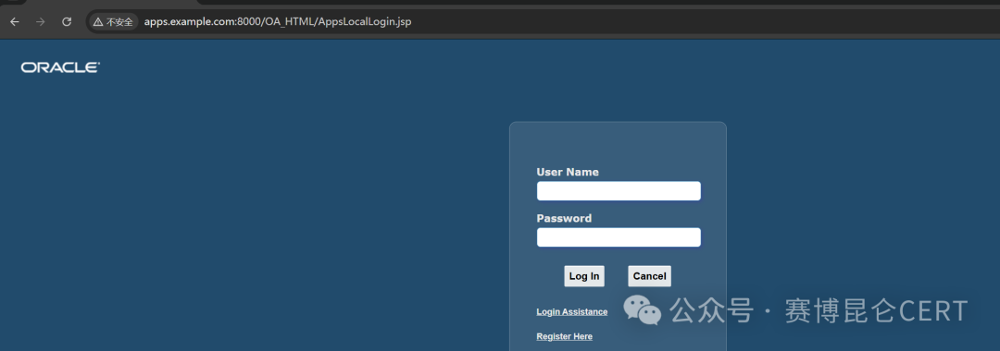
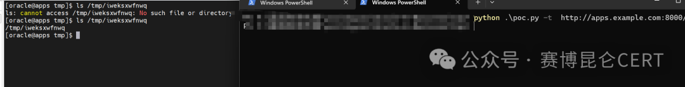

# 【复现】Oracle E-Business Suite远程代码执行漏洞(CVE-2025-30727)风险通告

> 编号角色校订（2026-10-04）：按归档技术正文区分主讨论编号与背景引用，更新 `primary_identifiers` / `referenced_identifiers` 及旧字段角色。旧编号原值、状态与正文保持原样，变更前字段逐字保存在 `previous_*`；后文旧的角色待核说明应按当前字段阅读。这里的角色判读不等于官方分配核验或漏洞复现。

<!-- vulwiki-editorial-rebuild:system-misc -->
## 条目范围与校订

- 本文对象：Oracle E-Business Suite CVE-2025-30727
- 文献类型：技术文章（细分类待核）
- 版本、权限及部署边界：12.2.3–12.2.14范围和未认证影响清晰，但EBS套件大未指定受影响产品子组件/入口与权限；touch临时文件截图只证作者测试，无请求/测试版本/输出文本；修复只Oracle支持门户，无2025-04CPU精确条目/补丁ID或版本状态，难直接处置
- 核验状态：仅重建文本校订；未执行文中代码、PoC 或扫描，未把截图或转载声明记为本站复现

### 具体结论与待核项

以下为原归档的逐项勘误与证据缺口；可由文本确定的问题已在下文订正，仍缺来源的事实保持待核。

1. 12.2.3–12.2.14范围和未认证影响清晰，但EBS套件大未指定受影响产品子组件/入口与权限
2. 9.8标高危可为厂商自定需写评分体系
3. touch临时文件截图只证作者测试，无请求/测试版本/输出文本
4. 公开PoC细节未知与私有已复现可并存，应分公开材料/作者
5. 修复只Oracle支持门户，无2025-04CPU精确条目/补丁ID或版本状态，难直接处置
6. 业务咨询/重复标题图为推广，归企业应用不杂项

### 操作风险

原文技术操作的实际副作用未复现核验；按其请求/代码评估状态变更、凭据暴露和业务影响

技术请求、代码与实验方法按原文保留；其中的破坏性动作仅限授权、可恢复的隔离环境。缺失代码、参数或版本事实不猜补。

### 来源追溯

- 原始披露 URL 未确认；既有归档来源标签保留，不能替代原始公告

### 归档技术正文

 赛博昆仑CERT   2025-04-16 06:18  
  
  
  
  
-  
赛博昆仑漏洞  
安全风险通告  
-  
  
Oracle E-Business Suite远程代码执行漏洞  
(CVE-2025-30727)  
风险通告  
  
  
  
  
  
  
**漏洞描****述**  
  
    Oracle E-Business Suite（简称 EBS），是Oracle 公司开发的一整套企业级应用程序，用于帮助组织管理各种业务流程。它是一个集成的企业资源计划（ERP）、客户关系管理（CRM）和供应链管理（SCM）系统。  
  
    近日，赛博昆仑CERT监测到Oracle E-Business Suite存在远程代码执行漏洞的漏洞情报，未经过身份认证的远程攻击者可通过该漏洞执行任意代码，最终可导致攻击者获取远程服务器上系统权限。  
  
<table><tbody><tr style="-webkit-tap-highlight-color: transparent;outline: 0px;height: 39px;visibility: visible;"><td style="-webkit-tap-highlight-color: transparent;padding: 8px;outline: 0px;word-break: break-all;hyphens: auto;border-color: rgb(222, 224, 227);font-size: 10pt;vertical-align: top;visibility: visible;">
<strong style="-webkit-tap-highlight-color: transparent;outline: 0px;visibility: visible;">漏洞名称</strong>
</td><td colspan="3" style="-webkit-tap-highlight-color: transparent;padding: 8px;outline: 0px;word-break: break-all;hyphens: auto;border-color: rgb(222, 224, 227);font-size: 10pt;vertical-align: top;visibility: visible;">
Oracle E-Business Suite远程代码执行漏洞
</td></tr><tr style="-webkit-tap-highlight-color: transparent;outline: 0px;height: 39px;visibility: visible;"><td style="-webkit-tap-highlight-color: transparent;padding: 8px;outline: 0px;word-break: break-all;hyphens: auto;border-color: rgb(222, 224, 227);font-size: 10pt;vertical-align: top;visibility: visible;">
<strong style="-webkit-tap-highlight-color: transparent;outline: 0px;visibility: visible;">漏洞公开编号</strong>
</td><td colspan="3" style="-webkit-tap-highlight-color: transparent;padding: 8px;outline: 0px;word-break: break-all;hyphens: auto;border-color: rgb(222, 224, 227);font-size: 10pt;vertical-align: top;visibility: visible;">
CVE-2025-30727
</td></tr><tr style="-webkit-tap-highlight-color: transparent;outline: 0px;height: 39px;"><td style="-webkit-tap-highlight-color: transparent;padding: 8px;outline: 0px;word-break: break-all;hyphens: auto;border-color: rgb(222, 224, 227);font-size: 10pt;vertical-align: top;">
<strong style="-webkit-tap-highlight-color: transparent;outline: 0px;">昆仑漏洞库编号</strong>
</td><td colspan="3" style="-webkit-tap-highlight-color: transparent;padding: 8px;outline: 0px;word-break: break-all;hyphens: auto;border-color: rgb(222, 224, 227);font-size: 10pt;vertical-align: top;"><section>CYKL-2025-013528</section></td></tr><tr style="-webkit-tap-highlight-color: transparent;outline: 0px;height: 39px;"><td style="-webkit-tap-highlight-color: transparent;padding: 8px;outline: 0px;word-break: break-all;hyphens: auto;border-color: rgb(222, 224, 227);font-size: 10pt;vertical-align: top;">
<strong style="-webkit-tap-highlight-color: transparent;outline: 0px;">漏洞类型</strong>
</td><td style="-webkit-tap-highlight-color: transparent;padding: 8px;outline: 0px;word-break: break-all;hyphens: auto;border-color: rgb(222, 224, 227);font-size: 10pt;vertical-align: top;">
代码执行
</td><td style="-webkit-tap-highlight-color: transparent;padding: 8px;outline: 0px;word-break: break-all;hyphens: auto;border-color: rgb(222, 224, 227);font-size: 10pt;vertical-align: top;">
<strong style="-webkit-tap-highlight-color: transparent;outline: 0px;">公开时间</strong>
</td><td style="-webkit-tap-highlight-color: transparent;padding: 8px;outline: 0px;word-break: break-all;hyphens: auto;border-color: rgb(222, 224, 227);font-size: 10pt;vertical-align: top;">
2025-04-15
</td></tr><tr style="-webkit-tap-highlight-color: transparent;outline: 0px;height: 39px;"><td style="-webkit-tap-highlight-color: transparent;padding: 8px;outline: 0px;word-break: break-all;hyphens: auto;border-color: rgb(222, 224, 227);font-size: 10pt;vertical-align: top;">
<strong style="-webkit-tap-highlight-color: transparent;outline: 0px;">漏洞等级</strong>
</td><td style="-webkit-tap-highlight-color: transparent;padding: 8px;outline: 0px;word-break: break-all;hyphens: auto;border-color: rgb(222, 224, 227);font-size: 10pt;vertical-align: top;">
高危
</td><td style="-webkit-tap-highlight-color: transparent;padding: 8px;outline: 0px;word-break: break-all;hyphens: auto;border-color: rgb(222, 224, 227);font-size: 10pt;vertical-align: top;">
<strong style="-webkit-tap-highlight-color: transparent;outline: 0px;">评分</strong>
</td><td style="-webkit-tap-highlight-color: transparent;padding: 8px;outline: 0px;word-break: break-all;hyphens: auto;border-color: rgb(222, 224, 227);font-size: 10pt;vertical-align: top;">
9.8
</td></tr><tr style="-webkit-tap-highlight-color: transparent;outline: 0px;height: 39px;"><td style="-webkit-tap-highlight-color: transparent;padding: 8px;outline: 0px;word-break: break-all;hyphens: auto;border-color: rgb(222, 224, 227);font-size: 10pt;vertical-align: top;">
<strong style="-webkit-tap-highlight-color: transparent;outline: 0px;">漏洞所需权限</strong>
</td><td style="-webkit-tap-highlight-color: transparent;padding: 8px;outline: 0px;word-break: break-all;hyphens: auto;border-color: rgb(222, 224, 227);font-size: 10pt;vertical-align: top;">
无
</td><td style="-webkit-tap-highlight-color: transparent;padding: 8px;outline: 0px;word-break: break-all;hyphens: auto;border-color: rgb(222, 224, 227);font-size: 10pt;vertical-align: top;">
<strong style="-webkit-tap-highlight-color: transparent;outline: 0px;">漏洞利用难度</strong>
</td><td style="-webkit-tap-highlight-color: transparent;padding: 8px;outline: 0px;word-break: break-all;hyphens: auto;border-color: rgb(222, 224, 227);font-size: 10pt;vertical-align: top;">
低
</td></tr><tr style="-webkit-tap-highlight-color: transparent;outline: 0px;height: 39px;"><td style="-webkit-tap-highlight-color: transparent;padding: 8px;outline: 0px;word-break: break-all;hyphens: auto;border-color: rgb(222, 224, 227);font-size: 10pt;vertical-align: top;">
<strong style="-webkit-tap-highlight-color: transparent;outline: 0px;">PoC</strong><strong style="-webkit-tap-highlight-color: transparent;outline: 0px;">状态</strong>
</td><td style="-webkit-tap-highlight-color: transparent;padding: 8px;outline: 0px;word-break: break-all;hyphens: auto;border-color: rgb(222, 224, 227);font-size: 10pt;vertical-align: top;">
未知
</td><td style="-webkit-tap-highlight-color: transparent;padding: 8px;outline: 0px;word-break: break-all;hyphens: auto;border-color: rgb(222, 224, 227);font-size: 10pt;vertical-align: top;">
<strong style="-webkit-tap-highlight-color: transparent;outline: 0px;">EXP</strong><strong style="-webkit-tap-highlight-color: transparent;outline: 0px;">状态</strong>
</td><td style="-webkit-tap-highlight-color: transparent;padding: 8px;outline: 0px;word-break: break-all;hyphens: auto;border-color: rgb(222, 224, 227);font-size: 10pt;vertical-align: top;">
未知
</td></tr><tr style="-webkit-tap-highlight-color: transparent;outline: 0px;height: 39px;"><td style="-webkit-tap-highlight-color: transparent;padding: 8px;outline: 0px;word-break: break-all;hyphens: auto;border-color: rgb(222, 224, 227);font-size: 10pt;vertical-align: top;">
<strong style="-webkit-tap-highlight-color: transparent;outline: 0px;">漏洞细节</strong>
</td><td style="-webkit-tap-highlight-color: transparent;padding: 8px;outline: 0px;word-break: break-all;hyphens: auto;border-color: rgb(222, 224, 227);font-size: 10pt;vertical-align: top;">
未知
</td><td style="-webkit-tap-highlight-color: transparent;padding: 8px;outline: 0px;word-break: break-all;hyphens: auto;border-color: rgb(222, 224, 227);font-size: 10pt;vertical-align: top;">
<strong style="-webkit-tap-highlight-color: transparent;outline: 0px;">在野利用</strong>
</td><td style="-webkit-tap-highlight-color: transparent;padding: 8px;outline: 0px;word-break: break-all;hyphens: auto;border-color: rgb(222, 224, 227);font-size: 10pt;vertical-align: top;">
未知
</td></tr></tbody></table>  
  
  
  
**影响范围**  
  
12.2.3<=  
Oracle E-Business Suite<=  
12.2.14  
  
  
**漏洞复现**  
  
  
目前，赛博昆仑CERT已成功复现  
Oracle E-Business Suite远程代码执行漏洞（CVE-2025-30727），执行touch /tmp/iweksxwfnwq作为验证  
  
  
  
  
  
  
  
****  
**防护措施**  
- **修复建议**  
  
    目前，官方已发布安全补丁，建议受影响的用户尽快安装最新版本补丁。  
  
    下载地址：  
  
https://support.oracle.com/  
  
  
- **技术业务咨询**  
  
  
  
赛博昆仑支持对用户提供轻量级的检测规则或热补方式，可提供定制化服务适配多种产品及规则，帮助用户进行漏洞检测和修复。  
  
赛博昆仑CERT已开启年订阅服务，付费客户(可申请试用)将获取更多技术详情，并支持适配客户的需求。  
  
联系邮箱：  
cert@cyberkl.com  
  
公众号：赛博昆仑CERT  
  
  
****  
**时间线**  
  
    2025年4月15日，官方发布补丁  
  
    2025年4月16日，赛博昆仑CERT发布漏洞风险通告  
  
  
  
  
**技术业务咨询**  
  
邮箱：cert@cyberkl.com  
  
  
  
  
  
  
  
  
  
  
  
  
  
  

---

> 来源：gelusus/wxvl（微信公众号漏洞文章自动归档，原始披露 URL 尚未确认，现有链接按来源追溯区分别标注）
