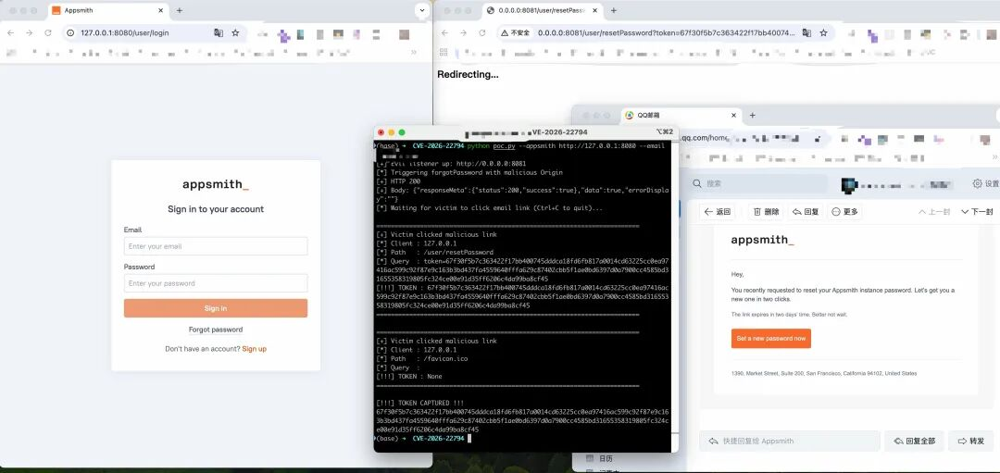

# 【原作者复现通告】Appsmith Origin 校验不当导致账户接管漏洞(CVE-2026-22794)

> 编号角色校订（2026-10-04）：按归档技术正文区分主讨论编号与背景引用，更新 `primary_identifiers` / `referenced_identifiers` 及旧字段角色。旧编号原值、状态与正文保持原样，变更前字段逐字保存在 `previous_*`；后文旧的角色待核说明应按当前字段阅读。这里的角色判读不等于官方分配核验或漏洞复现。

<!-- vulwiki-editorial-rebuild:system-misc -->
## 条目范围与校订

- 本文对象：Appsmith CVE-2026-22794 Origin邮件链接污染
- 文献类型：技术文章（细分类待核）
- 版本、权限及部署边界：<1.93/1.93首修版本应核完整发布号及自托管/云适用，只有NVD无上游GHSA/commit
- 核验状态：仅重建文本校订；未执行文中代码、PoC 或扫描，未把截图或转载声明记为本站复现

### 具体结论与待核项

以下为原归档的逐项勘误与证据缺口；可由文本确定的问题已在下文订正，仍缺来源的事实保持待核。

1. 明确伪造Origin生成攻击域重置/验证邮件且用户点击后漏token，是邮件链接污染非普通CORS绕过
2. <1.93/1.93首修版本应核完整发布号及自托管/云适用，只有NVD无上游GHSA/commit
3. 已复现仅一截图无请求URI/头/令牌使用方式，不能独立复现
4. PoC公开/EXP未公开/未在野为1月历史快照
5. 账户接管需相关邮件流程启用/受害者点击和token仍有效
6. HTML表样式极大，产品支持和品牌宣传宜移附录

### 操作风险

原文技术操作的实际副作用未复现核验；按其请求/代码评估状态变更、凭据暴露和业务影响

技术请求、代码与实验方法按原文保留；其中的破坏性动作仅限授权、可恢复的隔离环境。缺失代码、参数或版本事实不猜补。

### 来源追溯

- 原始披露 URL 未确认；既有归档来源标签保留，不能替代原始公告

### 归档技术正文

原创 360漏洞研究院  360漏洞研究院   2026-01-14 09:23  
  
“扫描下方二维码，进入公众号粉丝交流群。更多一手网安资讯、漏洞预警、技术干货和技术交流等您参与！”  
  
  
  
  
  
  
<table><tbody><tr style="box-sizing: border-box;"><td colspan="4" data-colwidth="100.0000%" width="100.0000%" style="border-width: 1px;border-color: rgb(100, 130, 228);border-style: solid;background-color: rgb(100, 130, 228);box-sizing: border-box;padding: 0px;"><section style="text-align: center;color: rgb(255, 255, 255);box-sizing: border-box;">
<strong style="box-sizing: border-box;">漏洞概述</strong>
</section></td></tr><tr style="box-sizing: border-box;"><td data-colwidth="24.0000%" width="24.0000%" style="border-width: 1px;border-color: rgb(100, 130, 228);border-style: solid;box-sizing: border-box;padding: 0px;"><section style="font-size: 12px;color: rgb(0, 0, 0);padding: 0px 8px;box-sizing: border-box;">
<strong style="box-sizing: border-box;">漏洞名称</strong>
</section></td><td colspan="3" data-colwidth="76.0000%" width="76.0000%" style="border-width: 1px;border-color: rgb(100, 130, 228);border-style: solid;box-sizing: border-box;padding: 0px;"><section style="font-size: 12px;padding: 0px 8px;box-sizing: border-box;">
Appsmith Origin 校验不当导致账户接管漏洞
</section></td></tr><tr style="box-sizing: border-box;"><td data-colwidth="24.0000%" width="24.0000%" style="border-width: 1px;border-color: rgb(100, 130, 228);border-style: solid;box-sizing: border-box;padding: 0px;"><section style="font-size: 12px;color: rgb(0, 0, 0);padding: 0px 8px;box-sizing: border-box;">
<strong style="box-sizing: border-box;">漏洞编号</strong>
</section></td><td colspan="3" data-colwidth="76.0000%" width="76.0000%" style="border-width: 1px;border-color: rgb(100, 130, 228);border-style: solid;box-sizing: border-box;padding: 0px;"><section style="font-size: 12px;padding: 0px 8px;box-sizing: border-box;">
CVE-2026-22794
</section></td></tr><tr style="box-sizing: border-box;"><td data-colwidth="24.0000%" width="24.0000%" style="border-width: 1px;border-color: rgb(100, 130, 228);border-style: solid;box-sizing: border-box;padding: 0px;"><section style="font-size: 12px;color: rgb(0, 0, 0);padding: 0px 8px;box-sizing: border-box;">
<strong style="box-sizing: border-box;">公开时间</strong>
</section></td><td data-colwidth="28.0000%" width="28.0000%" style="border-width: 1px;border-color: rgb(100, 130, 228);border-style: solid;box-sizing: border-box;padding: 0px;"><section style="font-size: 12px;padding: 0px 8px;box-sizing: border-box;">
2026-01-12
</section></td><td data-colwidth="28.0000%" width="28.0000%" style="border-width: 1px;border-color: rgb(100, 130, 228);border-style: solid;box-sizing: border-box;padding: 0px;"><section style="font-size: 12px;padding: 0px 8px;box-sizing: border-box;">
<strong style="box-sizing: border-box;">POC状态</strong>
</section></td><td data-colwidth="20.0000%" width="20.0000%" style="border-width: 1px;border-color: rgb(100, 130, 228);border-style: solid;box-sizing: border-box;padding: 0px;"><section style="font-size: 12px;padding: 0px 8px;color: rgb(100, 130, 228);box-sizing: border-box;">
<strong style="box-sizing: border-box;">已公开</strong>
</section></td></tr><tr style="box-sizing: border-box;"><td data-colwidth="24.0000%" width="24.0000%" style="border-width: 1px;border-color: rgb(100, 130, 228);border-style: solid;box-sizing: border-box;padding: 0px;"><section style="font-size: 12px;color: rgb(0, 0, 0);padding: 0px 8px;box-sizing: border-box;">
<strong style="box-sizing: border-box;">漏洞类型</strong>
</section></td><td data-colwidth="28.0000%" width="28.0000%" style="border-width: 1px;border-color: rgb(100, 130, 228);border-style: solid;box-sizing: border-box;padding: 0px;"><section style="font-size: 12px;padding: 0px 8px;box-sizing: border-box;">
账户接管
</section></td><td data-colwidth="28.0000%" width="28.0000%" style="border-width: 1px;border-color: rgb(100, 130, 228);border-style: solid;box-sizing: border-box;padding: 0px;"><section style="font-size: 12px;color: rgb(0, 0, 0);padding: 0px 8px;box-sizing: border-box;">
<strong style="box-sizing: border-box;">EXP状态</strong>
</section></td><td data-colwidth="20.0000%" width="20.0000%" style="border-width: 1px;border-color: rgb(100, 130, 228);border-style: solid;box-sizing: border-box;padding: 0px;"><section style="font-size: 12px;padding: 0px 8px;box-sizing: border-box;">
未公开
</section></td></tr><tr style="box-sizing: border-box;"><td data-colwidth="24.0000%" width="24.0000%" style="border-width: 1px;border-color: rgb(100, 130, 228);border-style: solid;box-sizing: border-box;padding: 0px;"><section style="font-size: 12px;padding: 0px 8px;box-sizing: border-box;">
<strong style="box-sizing: border-box;">利用可能性</strong>
</section></td><td data-colwidth="28.0000%" width="28.0000%" style="border-width: 1px;border-color: rgb(100, 130, 228);border-style: solid;box-sizing: border-box;padding: 0px;"><section style="font-size: 12px;padding: 0px 8px;box-sizing: border-box;">
高
</section></td><td data-colwidth="28.0000%" width="28.0000%" style="border-width: 1px;border-color: rgb(100, 130, 228);border-style: solid;box-sizing: border-box;padding: 0px;"><section style="font-size: 12px;padding: 0px 8px;color: rgb(0, 0, 0);box-sizing: border-box;">
<strong style="box-sizing: border-box;">技术细节状态</strong>
</section></td><td data-colwidth="20.0000%" width="20.0000%" style="border-width: 1px;border-color: rgb(100, 130, 228);border-style: solid;box-sizing: border-box;padding: 0px;"><section style="font-size: 12px;padding: 0px 8px;color: rgb(100, 130, 228);box-sizing: border-box;">
<strong style="box-sizing: border-box;">已公开</strong>
</section></td></tr><tr style="box-sizing: border-box;"><td data-colwidth="24.0000%" width="24.0000%" style="border-width: 1px;border-color: rgb(100, 130, 228);border-style: solid;box-sizing: border-box;padding: 0px;"><section style="font-size: 12px;color: rgb(0, 0, 0);padding: 0px 8px;box-sizing: border-box;">
<strong style="box-sizing: border-box;">CVSS 3.1</strong>
</section></td><td data-colwidth="28.0000%" width="28.0000%" style="border-width: 1px;border-color: rgb(100, 130, 228);border-style: solid;box-sizing: border-box;padding: 0px;"><section style="font-size: 12px;padding: 0px 8px;box-sizing: border-box;">
9.6
</section></td><td data-colwidth="28.0000%" width="28.0000%" style="border-width: 1px;border-color: rgb(100, 130, 228);border-style: solid;box-sizing: border-box;padding: 0px;"><section style="font-size: 12px;color: rgb(0, 0, 0);padding: 0px 8px;box-sizing: border-box;">
<strong style="box-sizing: border-box;">在野利用状态</strong>
</section></td><td data-colwidth="20.0000%" width="20.0000%" style="border-width: 1px;border-color: rgb(100, 130, 228);border-style: solid;box-sizing: border-box;padding: 0px;"><section style="font-size: 12px;padding: 0px 8px;box-sizing: border-box;">
未发现
</section></td></tr></tbody></table>  
  
  
**01**  
  
影响组件  
  
  
  
Appsmith 是一款开源低代码平台，主要用于构建管理面板、内部工具和业务仪表板。该平台支持通过可视化方式快速开发企业级应用，并可灵活连接多种数据源和外部 API，在企业内部工具开发场景中具有广泛应用。  
  
  
**02**  
  
**漏洞描述**  
  
  
  
近日，官方公开披露了 Appsmith 中存在的一处账户接管漏洞（**CVE-2026-22794**  
）。该漏洞源于服务器在处理密码重置和邮箱验证请求时，**未对请求头中的 Origin 值进行有效校验**  
，直接将其作为邮件链接的基础 URL 使用。攻击者可通过伪造 Origin 请求头，使系统生成指向攻击者控制域名的重置或验证链接。当用户点击邮件中的恶意链接后，**认证令牌将被泄露**  
，攻击者可据此重置密码或完成验证操作，从而实现账户接管。  
  
  
**03**  
  
**漏洞复现******  
  
  
  
360 漏洞研究院已复现 Appsmith Origin 校验不当导致账户接管漏洞（CVE-2026-22794），并成功捕获认证令牌。  
  
  
  
CVE-2026-22794   
  
Appsmith Origin 校验不当导致账户接管漏洞复现  
  
  
**04**  
  
**漏洞影响范围******  
  
  
  
受影响版本：  
  
Appsmith < 1.93  
  
  
**05**  
  
**修复建议******  
  
  
  
**正式防护方案**  
  
将 Appsmith 升级至 **1.93**  
 或更高版本。  
  
  
**06**  
  
**产品侧支持情况**  
  
  
  
**360安全智能体：**  
支持该漏洞攻击的智能分析**。**  
  
**360测绘云 Quake**  
：默认支持该产品的指纹识别。  
  
**360高级持续性威胁预警系统**  
：预计 2026年01月15日发布规则更新包，支持该漏洞利用行为的检测。  
  
**360资产与漏洞检测管理系统**  
：预计 2026年01月15日发布规则更新包，支持该漏洞利用行为的检测。  
**本地安全大脑**  
：默认支持该漏洞的PoC检测。  
  
  
**07**  
  
**时间线**  
  
  
  
2026年1月14日，360漏洞研究院发布本安全风险通告。  
  
  
**08**  
  
参考链接  
  
  
  
https://nvd.nist.gov/vuln/detail/CVE-2026-22794  
  
  
09  
  
更多漏洞情报  
  
  
  
建议您订阅360数字安全-漏洞情报服务，获取更多漏洞情报详情以及处置建议，让您的企业远离漏洞威胁。  
  
  
邮箱：360VRI@360.cn  
  
网址：https://vi.loudongyun.360.net  
  
  
  
“洞”悉网络威胁，守护数字安全  
  
  
**关于我们**  
  
  
360 漏洞研究院，隶属于360数字安全集团。其成员常年入选谷歌、微软、华为等厂商的安全精英排行榜, 并获得谷歌、微软、苹果史上最高漏洞奖励。研究院是中国首个荣膺Pwnie Awards“史诗级成就奖”，并获得多个Pwnie Awards提名的组织。累计发现并协助修复谷歌、苹果、微软、华为、高通等全球顶级厂商CVE漏洞3000多个，收获诸多官方公开致谢。研究院也屡次受邀在BlackHat，Usenix Security，Defcon等极具影响力的工业安全峰会和顶级学术会议上分享研究成果，并多次斩获信创挑战赛、天府杯等顶级黑客大赛总冠军和单项冠军。研究院将凭借其在漏洞挖掘和安全攻防方面的强大技术实力，帮助各大企业厂商不断完善系统安全，为数字安全保驾护航，筑造数字时代的安全堡垒。  
  
  

---

> 来源：gelusus/wxvl（微信公众号漏洞文章自动归档，原始披露 URL 尚未确认，现有链接按来源追溯区分别标注）
