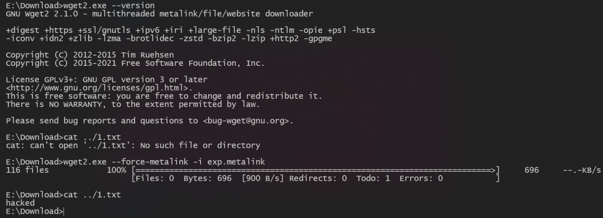

# 【原作者复现通告】GNU Wget2存在目录穿越漏洞（CVE-2025-69194）

> 编号角色校订（2026-10-04）：按归档技术正文区分主讨论编号与背景引用，更新 `primary_identifiers` / `referenced_identifiers` 及旧字段角色。旧编号原值、状态与正文保持原样，变更前字段逐字保存在 `previous_*`；后文旧的角色待核说明应按当前字段阅读。这里的角色判读不等于官方分配核验或漏洞复现。

<!-- vulwiki-editorial-rebuild:system-misc -->
## 条目范围与校订

- 本文对象：GNU Wget2 CVE-2025-69194 Metalink遍历
- 文献类型：技术文章（细分类待核）
- 版本、权限及部署边界：<2.2.1/2.2.1首修、诱骗用户处理Metalink与权限范围任意覆盖边界清楚，不是Wget1.x
- 核验状态：仅重建文本校订；未执行文中代码、PoC 或扫描，未把截图或转载声明记为本站复现

### 具体结论与待核项

以下为原归档的逐项勘误与证据缺口；可由文本确定的问题已在下文订正，仍缺来源的事实保持待核。

1. <2.2.1/2.2.1首修、诱骗用户处理Metalink与权限范围任意覆盖边界清楚，不是Wget1.x
2. AVN/U I需要/8.8向量基本一致，但机密性/代码执行依赖写入后加载链，本文未证明
3. 复现截图无命令行参数/Metalink XML/目标路径/结果文本，补对是否默认启用Metalink的说明
4. 仅Snyk无GNU安全公告/commit/发行版包回移
5. 宣称Wget2向后兼容需限定不影响本洞，广告较少可保留简通告

### 操作风险

<2.2.1/2.2.1首修、诱骗用户处理Metalink与权限范围任意覆盖边界清楚，不是Wget1.x；AVN/U I需要/8.8向量基本一致，但机密性/代码执行依赖写入后加载链，本文未证明

技术请求、代码与实验方法按原文保留；其中的破坏性动作仅限授权、可恢复的隔离环境。缺失代码、参数或版本事实不猜补。

### 来源追溯

- 原始披露 URL 未确认；既有归档来源标签保留，不能替代原始公告

### 归档技术正文

安恒研究院  安恒信息CERT   2026-01-07 10:45  
  
  
  
<table><tbody><tr style="-webkit-tap-highlight-color:transparent;"><td colspan="4" data-colwidth="100.0000%" width="100.0000%" style="-webkit-tap-highlight-color:transparent;word-break:break-all;hyphens:auto;border-color:#4577da;background-color:#4577da;"><section style="-webkit-tap-highlight-color:transparent;margin:5px 0px;"><section style="-webkit-tap-highlight-color:transparent;margin-top:0px;margin-right:0px;margin-bottom:unset;margin-left:0px;padding:0px 5px;font-size:14px;color:rgb(255, 255, 255);box-sizing:border-box;">
<strong style="-webkit-tap-highlight-color:transparent;">漏洞概述</strong>
</section></section></td></tr><tr style="-webkit-tap-highlight-color:transparent;"><td data-colwidth="25.0000%" width="25.0000%" style="-webkit-tap-highlight-color:transparent;word-break:break-all;hyphens:auto;border-color:#4577da;"><section style="-webkit-tap-highlight-color:transparent;margin:5px 0px;"><section style="-webkit-tap-highlight-color:transparent;margin-top:0px;margin-right:0px;margin-bottom:unset;margin-left:0px;padding:0px 5px;font-size:14px;box-sizing:border-box;">
<strong style="-webkit-tap-highlight-color:transparent;">漏洞名称</strong>
</section></section></td><td colspan="3" data-colwidth="75.0000%" width="75.0000%" style="-webkit-tap-highlight-color:transparent;word-break:break-all;hyphens:auto;border-color:#4577da;"><section style="-webkit-tap-highlight-color:transparent;margin:5px 0px;"><section style="-webkit-tap-highlight-color:transparent;margin-top:0px;margin-right:0px;margin-bottom:unset;margin-left:0px;padding:0px 5px;font-size:14px;box-sizing:border-box;">
GNU Wget2存在目录穿越漏洞（CVE-2025-69194）
</section></section></td></tr><tr><td data-colwidth="25.0000%" width="25.0000%" style="-webkit-tap-highlight-color:transparent;word-break:break-all;hyphens:auto;border-color:#4577da;"><section style="-webkit-tap-highlight-color:transparent;margin:5px 0px;"><section style="-webkit-tap-highlight-color:transparent;margin-top:0px;margin-right:0px;margin-bottom:unset;margin-left:0px;padding:0px 5px;font-size:14px;box-sizing:border-box;">
<strong>安恒CERT评级</strong>
</section></section></td><td data-colwidth="25.0000%" width="25.0000%" style="-webkit-tap-highlight-color:transparent;word-break:break-all;hyphens:auto;border-color:#4577da;"><section style="-webkit-tap-highlight-color:transparent;margin:5px 0px;">
2级
<section style="-webkit-tap-highlight-color:transparent;margin-top:0px;margin-right:0px;margin-bottom:unset;margin-left:0px;padding:0px 5px;font-size:14px;overflow:hidden;line-height:0;box-sizing:border-box;"> </section></section></td><td data-colwidth="25.0000%" width="25.0000%" style="-webkit-tap-highlight-color:transparent;word-break:break-all;hyphens:auto;border-color:#4577da;"><section style="-webkit-tap-highlight-color:transparent;margin:5px 0px;"><section style="-webkit-tap-highlight-color:transparent;margin-top:0px;margin-right:0px;margin-bottom:unset;margin-left:0px;padding:0px 5px;font-size:14px;box-sizing:border-box;">
<strong style="-webkit-tap-highlight-color:transparent;">CVSS3.1评分</strong>
</section></section></td><td data-colwidth="25.0000%" width="25.0000%" style="-webkit-tap-highlight-color:transparent;word-break:break-all;hyphens:auto;border-color:#4577da;"><section style="-webkit-tap-highlight-color:transparent;margin:5px 0px;"><section style="-webkit-tap-highlight-color:transparent;margin-top:0px;margin-right:0px;margin-bottom:unset;margin-left:0px;padding:0px 5px;font-size:14px;box-sizing:border-box;">
8.8
</section></section></td></tr><tr style="-webkit-tap-highlight-color:transparent;"><td data-colwidth="25.0000%" width="25.0000%" style="-webkit-tap-highlight-color:transparent;word-break:break-all;hyphens:auto;border-color:#4577da;"><section style="-webkit-tap-highlight-color:transparent;margin:5px 0px;"><section style="-webkit-tap-highlight-color:transparent;margin-top:0px;margin-right:0px;margin-bottom:unset;margin-left:0px;padding:0px 5px;font-size:14px;box-sizing:border-box;">
<strong style="-webkit-tap-highlight-color:transparent;">CVE编号</strong>
</section></section></td><td data-colwidth="25.0000%" width="25.0000%" style="-webkit-tap-highlight-color:transparent;word-break:break-all;hyphens:auto;border-color:#4577da;"><section style="-webkit-tap-highlight-color:transparent;margin:5px 0px;">
CVE-2025-69194
<section style="-webkit-tap-highlight-color:transparent;margin-top:0px;margin-right:0px;margin-bottom:unset;margin-left:0px;padding:0px 5px;font-size:14px;overflow:hidden;line-height:0;box-sizing:border-box;"> </section></section></td><td data-colwidth="25.0000%" width="25.0000%" style="-webkit-tap-highlight-color:transparent;word-break:break-all;hyphens:auto;border-color:#4577da;"><section style="-webkit-tap-highlight-color:transparent;margin:5px 0px;"><section style="-webkit-tap-highlight-color:transparent;margin-top:0px;margin-right:0px;margin-bottom:unset;margin-left:0px;padding:0px 5px;font-size:14px;box-sizing:border-box;">
<strong style="-webkit-tap-highlight-color:transparent;">CNVD编号</strong>
</section></section></td><td data-colwidth="25.0000%" width="25.0000%" style="-webkit-tap-highlight-color:transparent;word-break:break-all;hyphens:auto;border-color:#4577da;"><section style="-webkit-tap-highlight-color:transparent;margin:5px 0px;"><section style="-webkit-tap-highlight-color:transparent;margin-top:0px;margin-right:0px;margin-bottom:unset;margin-left:0px;padding:0px 5px;font-size:14px;box-sizing:border-box;">
未分配
</section></section></td></tr><tr style="-webkit-tap-highlight-color:transparent;"><td data-colwidth="25.0000%" width="25.0000%" style="-webkit-tap-highlight-color:transparent;word-break:break-all;hyphens:auto;border-color:#4577da;"><section style="-webkit-tap-highlight-color:transparent;margin:5px 0px;"><section style="-webkit-tap-highlight-color:transparent;margin-top:0px;margin-right:0px;margin-bottom:unset;margin-left:0px;padding:0px 5px;font-size:14px;box-sizing:border-box;">
<strong style="-webkit-tap-highlight-color:transparent;">CNNVD编号</strong>
</section></section></td><td data-colwidth="25.0000%" width="25.0000%" style="-webkit-tap-highlight-color:transparent;word-break:break-all;hyphens:auto;border-color:#4577da;"><section style="-webkit-tap-highlight-color:transparent;margin:5px 0px;"><section style="-webkit-tap-highlight-color:transparent;margin-top:0px;margin-right:0px;margin-bottom:unset;margin-left:0px;padding:0px 5px;font-size:14px;box-sizing:border-box;">
未分配
</section></section></td><td data-colwidth="25.0000%" width="25.0000%" style="-webkit-tap-highlight-color:transparent;word-break:break-all;hyphens:auto;border-color:#4577da;"><section style="-webkit-tap-highlight-color:transparent;margin:5px 0px;"><section style="-webkit-tap-highlight-color:transparent;margin-top:0px;margin-right:0px;margin-bottom:unset;margin-left:0px;padding:0px 5px;font-size:14px;box-sizing:border-box;">
<strong style="-webkit-tap-highlight-color:transparent;">安恒CERT编号</strong>
</section></section></td><td data-colwidth="25.0000%" width="25.0000%" style="-webkit-tap-highlight-color:transparent;word-break:break-all;hyphens:auto;border-color:#4577da;"><section style="-webkit-tap-highlight-color:transparent;margin:5px 0px;"><section style="-webkit-tap-highlight-color:transparent;margin-top:0px;margin-right:0px;margin-bottom:unset;margin-left:0px;padding:0px 5px;font-size:14px;box-sizing:border-box;">
未分配
</section></section></td></tr><tr style="-webkit-tap-highlight-color:transparent;"><td data-colwidth="25.0000%" width="25.0000%" style="-webkit-tap-highlight-color:transparent;word-break:break-all;hyphens:auto;border-color:#4577da;"><section style="-webkit-tap-highlight-color:transparent;margin:5px 0px;"><section style="-webkit-tap-highlight-color:transparent;margin-top:0px;margin-right:0px;margin-bottom:unset;margin-left:0px;padding:0px 5px;font-size:14px;box-sizing:border-box;">
<strong style="-webkit-tap-highlight-color:transparent;">POC情况</strong>
</section></section></td><td data-colwidth="25.0000%" width="25.0000%" style="-webkit-tap-highlight-color:transparent;word-break:break-all;hyphens:auto;border-color:#4577da;"><section style="-webkit-tap-highlight-color:transparent;margin:5px 0px;"><section style="-webkit-tap-highlight-color:transparent;margin-top:0px;margin-right:0px;margin-bottom:unset;margin-left:0px;padding:0px 5px;font-size:14px;box-sizing:border-box;">
已发现
</section></section></td><td data-colwidth="25.0000%" width="25.0000%" style="-webkit-tap-highlight-color:transparent;word-break:break-all;hyphens:auto;border-color:#4577da;"><section style="-webkit-tap-highlight-color:transparent;margin:5px 0px;"><section style="-webkit-tap-highlight-color:transparent;margin-top:0px;margin-right:0px;margin-bottom:unset;margin-left:0px;padding:0px 5px;font-size:14px;box-sizing:border-box;">
<strong style="-webkit-tap-highlight-color:transparent;">EXP情况</strong>
</section></section></td><td data-colwidth="25.0000%" width="25.0000%" style="-webkit-tap-highlight-color:transparent;word-break:break-all;hyphens:auto;border-color:#4577da;"><section style="-webkit-tap-highlight-color:transparent;margin:5px 0px;"><section style="-webkit-tap-highlight-color:transparent;margin-top:0px;margin-right:0px;margin-bottom:unset;margin-left:0px;padding:0px 5px;font-size:14px;box-sizing:border-box;">
未发现
</section></section></td></tr><tr style="-webkit-tap-highlight-color:transparent;"><td data-colwidth="25.0000%" width="25.0000%" style="-webkit-tap-highlight-color:transparent;word-break:break-all;hyphens:auto;border-color:#4577da;"><section style="-webkit-tap-highlight-color:transparent;margin:5px 0px;"><section style="-webkit-tap-highlight-color:transparent;margin-top:0px;margin-right:0px;margin-bottom:unset;margin-left:0px;padding:0px 5px;font-size:14px;box-sizing:border-box;">
<strong style="-webkit-tap-highlight-color:transparent;">在野利用</strong>
</section></section></td><td data-colwidth="25.0000%" width="25.0000%" style="-webkit-tap-highlight-color:transparent;word-break:break-all;hyphens:auto;border-color:#4577da;"><section style="-webkit-tap-highlight-color:transparent;margin:5px 0px;"><section style="-webkit-tap-highlight-color:transparent;margin-top:0px;margin-right:0px;margin-bottom:unset;margin-left:0px;padding:0px 5px;font-size:14px;box-sizing:border-box;">
未发现
</section></section></td><td data-colwidth="25.0000%" width="25.0000%" style="-webkit-tap-highlight-color:transparent;word-break:break-all;hyphens:auto;border-color:#4577da;"><section style="-webkit-tap-highlight-color:transparent;margin:5px 0px;"><section style="-webkit-tap-highlight-color:transparent;margin-top:0px;margin-right:0px;margin-bottom:unset;margin-left:0px;padding:0px 5px;font-size:14px;box-sizing:border-box;">
<strong style="-webkit-tap-highlight-color:transparent;">研究情况</strong>
</section></section></td><td data-colwidth="25.0000%" width="25.0000%" style="-webkit-tap-highlight-color:transparent;word-break:break-all;hyphens:auto;border-color:#4577da;"><section style="-webkit-tap-highlight-color:transparent;margin:5px 0px;"><section style="-webkit-tap-highlight-color:transparent;margin-top:0px;margin-right:0px;margin-bottom:unset;margin-left:0px;padding:0px 5px;font-size:14px;box-sizing:border-box;">
已复现
</section></section></td></tr><tr style="-webkit-tap-highlight-color:transparent;"><td data-colwidth="25.0000%" width="25.0000%" style="-webkit-tap-highlight-color:transparent;word-break:break-all;hyphens:auto;border-color:#4577da;"><section style="-webkit-tap-highlight-color:transparent;margin:5px 0px;"><section style="-webkit-tap-highlight-color:transparent;margin-top:0px;margin-right:0px;margin-bottom:unset;margin-left:0px;padding:0px 5px;font-size:14px;box-sizing:border-box;">
<strong style="-webkit-tap-highlight-color:transparent;">危害描述</strong>
</section></section></td><td colspan="3" data-colwidth="75.0000%" width="75.0000%" style="-webkit-tap-highlight-color:transparent;word-break:break-all;hyphens:auto;border-color:#4577da;"><section style="-webkit-tap-highlight-color:transparent;margin:5px 0px;"><section style="-webkit-tap-highlight-color:transparent;margin-top:0px;margin-right:0px;margin-bottom:unset;margin-left:0px;padding:0px 5px;font-size:14px;overflow:hidden;line-height:0;box-sizing:border-box;"> </section>
该漏洞源于Metalink元数据中文件路径验证不足。攻击者可以通过诱骗用户处理精心构造的Metalink文件，覆盖用户权限范围内的任意文件，这可能导致数据丢失或本地代码执行。
<section style="-webkit-tap-highlight-color:transparent;margin-top:0px;margin-right:0px;margin-bottom:unset;margin-left:0px;padding:0px 5px;font-size:14px;overflow:hidden;line-height:0;box-sizing:border-box;"> </section></section></td></tr></tbody></table>  
  
**安恒研究院卫兵实验室已复现此漏洞。**  
  
  
  
复现截图  
  
  
  
**漏洞信息**  
  
  
  
  
GNU Wget2是经典命令行下载工具Wget的下一代版本，它在保持向后兼容的同时，默认采用并行连接、支持HTTP/2协议。  
  
  
**漏洞描述**  
  
**漏洞危害等级：**  
高危  
  
**漏洞类型：**  
目录穿越  
  
  
**影响范围**  
  
**影响版本：**  
  
GNU Wget2 < 2.2.1  
  
**安全版本：**  
  
GNU Wget2 2.2.1  
  
**CVSS向量**  
  
访问途径（AV）：网络  
  
攻击复杂度（AC）：低  
  
所需权限（PR）：无  
  
用户交互（UI）：需要  
  
影响范围 （S）：不变  
  
机密性影响 （C）：高  
  
完整性影响 （l）：高  
  
可用性影响 （A）：高  
  
  
  
  
**修复方案**  
  
  
  
  
**官方修复方案：**  
  
官方已发布修复方案，受影响的用户建议更新至安全版本2.2.1。  
  
**参考资料**  
  
  
  
  
  
https://security.snyk.io/vuln/SNYK-UNMANAGED-GNUWGETWGET2-14756160  
  
  
  
  
  
**技术支持**  
  
  
  
  
如有漏洞相关需求支持请联系400-6059-110获取相关能力支撑。  
  
  

---

> 来源：gelusus/wxvl（微信公众号漏洞文章自动归档，原始披露 URL 尚未确认，现有链接按来源追溯区分别标注）
