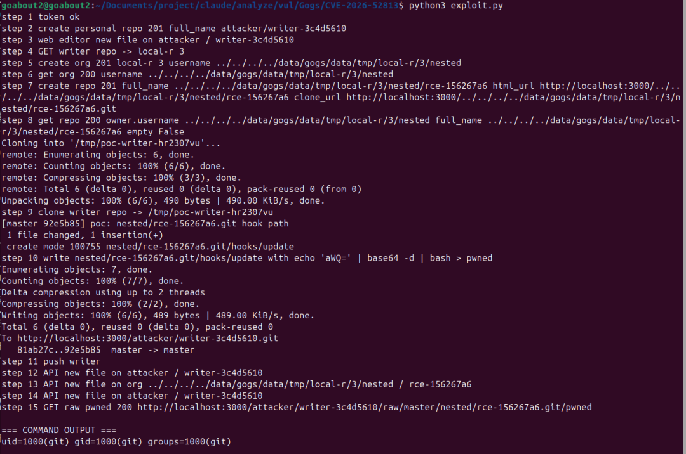
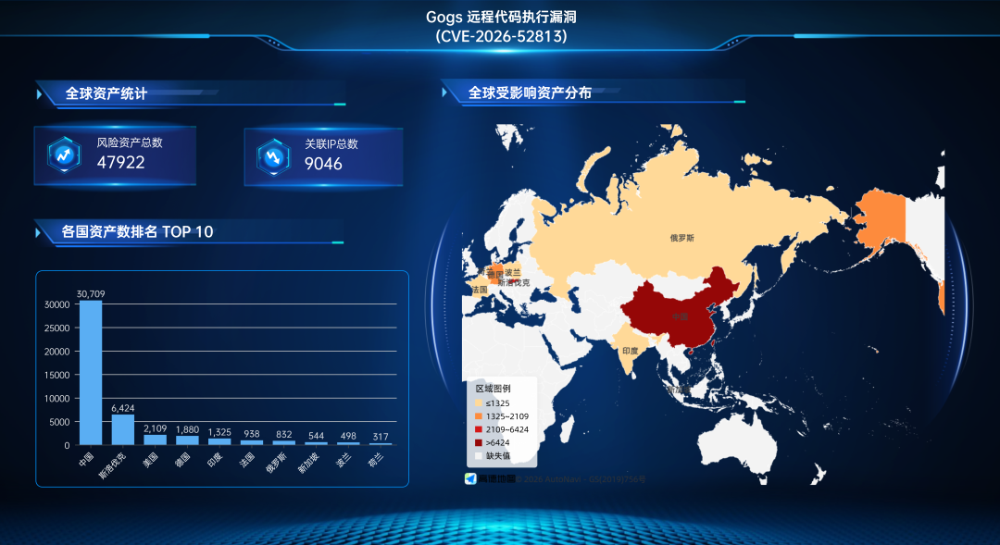

# 【原作者复现通告】Gogs 远程代码执行漏洞(CVE-2026-52813)安全风险通告

> 编号角色校订（2026-10-04）：按归档技术正文区分主讨论编号与背景引用，更新 `primary_identifiers` / `referenced_identifiers` 及旧字段角色。旧编号原值、状态与正文保持原样，变更前字段逐字保存在 `previous_*`；后文旧的角色待核说明应按当前字段阅读。这里的角色判读不等于官方分配核验或漏洞复现。

<!-- vulwiki-editorial-rebuild:system-misc -->
## 条目范围与校订

- 本文对象：Gogs组织名称路径遍历 CVE-2026-52813
- 文献类型：技术文章（细分类待核）
- 版本、权限及部署边界：普通用户及自注册前提明确，但还需组织/仓库创建权限、可写目的地和钩子触发，不是无需认证或任意系统路径必可写；自注册默认开启是配置默认值需锁版本，关闭注册只阻止新账号不阻止已有恶意/被盗普通用户；CVSS10.0未给向量且正文PR:L，需按GHSA解释评级条件
- 核验状态：仅重建文本校订；未执行文中代码、PoC 或扫描，未把截图或转载声明记为本站复现

### 具体结论与待核项

以下为原归档的逐项勘误与证据缺口；可由文本确定的问题已在下文订正，仍缺来源的事实保持待核。

1. 普通用户及自注册前提明确，但还需组织/仓库创建权限、可写目的地和钩子触发，不是无需认证或任意系统路径必可写
2. 自注册默认开启是配置默认值需锁版本，关闭注册只阻止新账号不阻止已有恶意/被盗普通用户
3. CVSS10.0未给向量且正文PR:L，需按GHSA解释评级条件
4. 组织路径→嵌套仓库→hook链与早前符号链接配置篡改64111不同，不应按GogsRCE去重
5. 0.14.3、GHSA和修复提交链接完整，需核验引入下界
6. 47922资产/9046IP为关联测绘非确认受影响实例，复现仅截图不含请求
7. [auth]配置要按版本验证实际生效并提供回退，去广告

### 操作风险

原文技术操作的实际副作用未复现核验；按其请求/代码评估状态变更、凭据暴露和业务影响

技术请求、代码与实验方法按原文保留；其中的破坏性动作仅限授权、可恢复的隔离环境。缺失代码、参数或版本事实不猜补。

### 来源追溯

- 原始披露 URL 未确认；既有归档来源标签保留，不能替代原始公告

### 归档技术正文

 奇安信 CERT   2026-06-25 12:33  
  
●   
点击↑蓝字关注我们，获取更多安全风险通告  
  
  
<table><tbody><tr style="-webkit-tap-highlight-color: transparent;margin: 0px;padding: 0px;outline: 0px;max-width: 100%;box-sizing: border-box !important;overflow-wrap: break-word !important;visibility: visible;"><td colspan="4" data-colwidth="136,157,166,98" valign="middle" align="center" style="-webkit-tap-highlight-color: transparent;margin: 0px;padding: 5px 10px;outline: 0px;overflow-wrap: break-word !important;word-break: break-all;hyphens: auto;border: 1px solid rgb(70, 118, 217);max-width: 100%;box-sizing: border-box !important;background-color: rgb(70, 118, 217);visibility: visible;"><p style="-webkit-tap-highlight-color: transparent;margin: 0px;padding: 0px;outline: 0px;max-width: 100%;box-sizing: border-box !important;overflow-wrap: break-word !important;clear: both;min-height: 1em;line-height: 1.5em;visibility: visible;"><span style="-webkit-tap-highlight-color: transparent;margin: 0px;padding: 0px;outline: 0px;max-width: 100%;box-sizing: border-box !important;overflow-wrap: break-word !important;color: rgb(255, 255, 255);letter-spacing: 0px;visibility: visible;"><strong style="-webkit-tap-highlight-color: transparent;margin: 0px;padding: 0px;outline: 0px;max-width: 100%;box-sizing: border-box !important;overflow-wrap: break-word !important;visibility: visible;"><span style="-webkit-tap-highlight-color: transparent;margin: 0px;padding: 0px;outline: 0px;max-width: 100%;box-sizing: border-box !important;overflow-wrap: break-word !important;font-size: 13px;letter-spacing: 0px;visibility: visible;"><span leaf="" style="-webkit-tap-highlight-color: transparent;margin: 0px;padding: 0px;outline: 0px;max-width: 100%;box-sizing: border-box !important;overflow-wrap: break-word !important;visibility: visible;">漏洞概述</span></span></strong></span></p></td></tr><tr style="-webkit-tap-highlight-color: transparent;margin: 0px;padding: 0px;outline: 0px;max-width: 100%;box-sizing: border-box !important;overflow-wrap: break-word !important;visibility: visible;"><td data-colwidth="136" width="136" valign="middle" align="left" style="-webkit-tap-highlight-color: transparent;margin: 0px;padding: 5px 10px;outline: 0px;overflow-wrap: break-word !important;word-break: break-all;hyphens: auto;border: 1px solid rgb(70, 118, 217);max-width: 100%;box-sizing: border-box !important;visibility: visible;"><p style="-webkit-tap-highlight-color: transparent;margin: 0px;padding: 0px;outline: 0px;max-width: 100%;box-sizing: border-box !important;overflow-wrap: break-word !important;clear: both;min-height: 1em;line-height: 1em;visibility: visible;"><span style="-webkit-tap-highlight-color: transparent;margin: 0px;padding: 0px;outline: 0px;max-width: 100%;box-sizing: border-box !important;overflow-wrap: break-word !important;font-size: 13px;letter-spacing: 0px;visibility: visible;"><strong style="-webkit-tap-highlight-color: transparent;margin: 0px;padding: 0px;outline: 0px;max-width: 100%;box-sizing: border-box !important;overflow-wrap: break-word !important;visibility: visible;"><span style="-webkit-tap-highlight-color: transparent;margin: 0px;padding: 0px;outline: 0px;max-width: 100%;box-sizing: border-box !important;overflow-wrap: break-word !important;letter-spacing: 0px;font-family: 微软雅黑, &#34;Microsoft YaHei&#34;;visibility: visible;"><span leaf="" style="-webkit-tap-highlight-color: transparent;margin: 0px;padding: 0px;outline: 0px;max-width: 100%;box-sizing: border-box !important;overflow-wrap: break-word !important;visibility: visible;">漏洞名称</span></span></strong></span></p></td><td colspan="3" data-colwidth="157,166,98" valign="middle" align="left" style="-webkit-tap-highlight-color: transparent;margin: 0px;padding: 5px 10px;outline: 0px;overflow-wrap: break-word !important;word-break: break-all;hyphens: auto;border: 1px solid rgb(70, 118, 217);max-width: 100%;box-sizing: border-box !important;visibility: visible;"><p style="-webkit-tap-highlight-color: transparent;margin: 0px;padding: 0px;outline: 0px;max-width: 100%;box-sizing: border-box !important;overflow-wrap: break-word !important;clear: both;min-height: 1em;line-height: 1em;visibility: visible;"><span style="-webkit-tap-highlight-color: transparent;margin: 0px;padding: 0px;outline: 0px;max-width: 100%;box-sizing: border-box !important;overflow-wrap: break-word !important;font-size: 13px;caret-color: red;letter-spacing: 0px;visibility: visible;"><span leaf="">Gogs 远程代码执行漏洞</span></span></p></td></tr><tr style="-webkit-tap-highlight-color: transparent;margin: 0px;padding: 0px;outline: 0px;max-width: 100%;box-sizing: border-box !important;overflow-wrap: break-word !important;visibility: visible;"><td data-colwidth="136" width="136" valign="middle" align="left" style="-webkit-tap-highlight-color: transparent;margin: 0px;padding: 5px 10px;outline: 0px;overflow-wrap: break-word !important;word-break: break-all;hyphens: auto;border: 1px solid rgb(70, 118, 217);max-width: 100%;box-sizing: border-box !important;visibility: visible;"><p style="-webkit-tap-highlight-color: transparent;margin: 0px;padding: 0px;outline: 0px;max-width: 100%;box-sizing: border-box !important;overflow-wrap: break-word !important;clear: both;min-height: 1em;line-height: 1em;visibility: visible;"><span style="-webkit-tap-highlight-color: transparent;margin: 0px;padding: 0px;outline: 0px;max-width: 100%;box-sizing: border-box !important;overflow-wrap: break-word !important;font-family: 微软雅黑, &#34;Microsoft YaHei&#34;;visibility: visible;"><span style="-webkit-tap-highlight-color: transparent;margin: 0px;padding: 0px;outline: 0px;max-width: 100%;box-sizing: border-box !important;overflow-wrap: break-word !important;font-size: 13px;visibility: visible;"><strong style="-webkit-tap-highlight-color: transparent;margin: 0px;padding: 0px;outline: 0px;max-width: 100%;box-sizing: border-box !important;overflow-wrap: break-word !important;visibility: visible;"><span leaf="" style="-webkit-tap-highlight-color: transparent;margin: 0px;padding: 0px;outline: 0px;max-width: 100%;box-sizing: border-box !important;overflow-wrap: break-word !important;visibility: visible;">漏洞编号</span></strong></span></span></p></td><td colspan="3" data-colwidth="157,166,98" valign="middle" align="left" style="-webkit-tap-highlight-color: transparent;margin: 0px;padding: 5px 10px;outline: 0px;overflow-wrap: break-word !important;word-break: break-all;hyphens: auto;border: 1px solid rgb(70, 118, 217);max-width: 100%;box-sizing: border-box !important;visibility: visible;"><p style="-webkit-tap-highlight-color: transparent;margin: 0px;padding: 0px;outline: 0px;max-width: 100%;box-sizing: border-box !important;overflow-wrap: break-word !important;clear: both;min-height: 1em;line-height: 1em;visibility: visible;"><span style="-webkit-tap-highlight-color: transparent;margin: 0px;padding: 0px;outline: 0px;max-width: 100%;box-sizing: border-box !important;overflow-wrap: break-word !important;color: rgb(0, 0, 0);font-size: 13px;caret-color: rgb(255, 0, 0);font-family: 微软雅黑, &#34;Microsoft YaHei&#34;;visibility: visible;"><span leaf="">QVD-2026-36203</span><span leaf="" style="-webkit-tap-highlight-color: transparent;margin: 0px;padding: 0px;outline: 0px;max-width: 100%;box-sizing: border-box !important;overflow-wrap: break-word !important;visibility: visible;">，</span><span leaf="">CVE-2026-52813</span></span></p></td></tr><tr style="-webkit-tap-highlight-color: transparent;margin: 0px;padding: 0px;outline: 0px;max-width: 100%;box-sizing: border-box !important;overflow-wrap: break-word !important;visibility: visible;"><td data-colwidth="136" width="136" valign="middle" align="left" style="-webkit-tap-highlight-color: transparent;margin: 0px;padding: 5px 10px;outline: 0px;overflow-wrap: break-word !important;word-break: break-all;hyphens: auto;border: 1px solid rgb(70, 118, 217);max-width: 100%;box-sizing: border-box !important;visibility: visible;"><p style="-webkit-tap-highlight-color: transparent;margin: 0px;padding: 0px;outline: 0px;max-width: 100%;box-sizing: border-box !important;overflow-wrap: break-word !important;clear: both;min-height: 1em;line-height: 1em;visibility: visible;"><strong style="-webkit-tap-highlight-color: transparent;margin: 0px;padding: 0px;outline: 0px;max-width: 100%;box-sizing: border-box !important;overflow-wrap: break-word !important;visibility: visible;"><span style="-webkit-tap-highlight-color: transparent;margin: 0px;padding: 0px;outline: 0px;max-width: 100%;box-sizing: border-box !important;overflow-wrap: break-word !important;font-size: 13px;visibility: visible;"><strong style="-webkit-tap-highlight-color: transparent;margin: 0px;padding: 0px;outline: none 0px !important;box-sizing: border-box !important;overflow-wrap: break-word !important;cursor: text;color: rgb(0, 0, 0);caret-color: rgb(255, 0, 0);font-family: 微软雅黑, &#34;Microsoft YaHei&#34;, sans-serif;visibility: visible;max-width: 100%;max-inline-size: 100%;"><span style="-webkit-tap-highlight-color: transparent;margin: 0px;padding: 0px;outline: none 0px !important;box-sizing: border-box !important;overflow-wrap: break-word !important;cursor: text;font-family: 微软雅黑, &#34;Microsoft YaHei&#34;;visibility: visible;max-width: 100%;max-inline-size: 100%;"><span leaf="" style="-webkit-tap-highlight-color: transparent;margin: 0px;padding: 0px;outline: 0px;max-width: 100%;box-sizing: border-box !important;overflow-wrap: break-word !important;visibility: visible;">公开时间</span></span></strong></span></strong></p></td><td data-colwidth="157" width="157" valign="middle" align="left" style="-webkit-tap-highlight-color: transparent;margin: 0px;padding: 5px 10px;outline: 0px;overflow-wrap: break-word !important;word-break: break-all;hyphens: auto;border: 1px solid rgb(70, 118, 217);max-width: 100%;box-sizing: border-box !important;visibility: visible;"><p style="-webkit-tap-highlight-color: transparent;margin: 0px;padding: 0px;outline: 0px;max-width: 100%;box-sizing: border-box !important;overflow-wrap: break-word !important;clear: both;min-height: 1em;line-height: 1em;visibility: visible;"><span style="-webkit-tap-highlight-color: transparent;margin: 0px;padding: 0px;outline: 0px;max-width: 100%;box-sizing: border-box !important;overflow-wrap: break-word !important;color: rgb(0, 0, 0);font-size: 13px;caret-color: rgb(255, 0, 0);font-family: 微软雅黑, &#34;Microsoft YaHei&#34;;visibility: visible;"><span leaf="" style="-webkit-tap-highlight-color: transparent;margin: 0px;padding: 0px;outline: 0px;max-width: 100%;box-sizing: border-box !important;overflow-wrap: break-word !important;visibility: visible;">2026-06-19</span></span></p></td><td data-colwidth="166" width="166" valign="middle" align="left" style="-webkit-tap-highlight-color: transparent;margin: 0px;padding: 5px 10px;outline: 0px;overflow-wrap: break-word !important;word-break: break-all;hyphens: auto;border: 1px solid rgb(70, 118, 217);max-width: 100%;box-sizing: border-box !important;visibility: visible;"><p style="-webkit-tap-highlight-color: transparent;margin: 0px;padding: 0px;outline: 0px;max-width: 100%;box-sizing: border-box !important;overflow-wrap: break-word !important;clear: both;min-height: 1em;line-height: 1em;visibility: visible;"><strong style="-webkit-tap-highlight-color: transparent;margin: 0px;padding: 0px;outline: 0px;max-width: 100%;box-sizing: border-box !important;overflow-wrap: break-word !important;visibility: visible;"><span style="-webkit-tap-highlight-color: transparent;margin: 0px;padding: 0px;outline: 0px;max-width: 100%;box-sizing: border-box !important;overflow-wrap: break-word !important;font-size: 13px;visibility: visible;"><strong style="-webkit-tap-highlight-color: transparent;margin: 0px;padding: 0px;outline: none 0px !important;box-sizing: border-box !important;overflow-wrap: break-word !important;cursor: text;color: rgb(0, 0, 0);caret-color: rgb(255, 0, 0);font-family: 微软雅黑, &#34;Microsoft YaHei&#34;, sans-serif;visibility: visible;max-width: 100%;max-inline-size: 100%;"><span style="-webkit-tap-highlight-color: transparent;margin: 0px;padding: 0px;outline: none 0px !important;box-sizing: border-box !important;overflow-wrap: break-word !important;cursor: text;font-family: 微软雅黑, &#34;Microsoft YaHei&#34;;visibility: visible;max-width: 100%;max-inline-size: 100%;"><span leaf="" style="-webkit-tap-highlight-color: transparent;margin: 0px;padding: 0px;outline: 0px;max-width: 100%;box-sizing: border-box !important;overflow-wrap: break-word !important;visibility: visible;">影响量级</span></span></strong></span></strong></p></td><td data-colwidth="98" width="98" valign="middle" align="left" style="-webkit-tap-highlight-color: transparent;margin: 0px;padding: 5px 10px;outline: 0px;overflow-wrap: break-word !important;word-break: break-all;hyphens: auto;border: 1px solid rgb(70, 118, 217);max-width: 100%;box-sizing: border-box !important;visibility: visible;"><p style="-webkit-tap-highlight-color: transparent;margin: 0px;padding: 0px;outline: 0px;max-width: 100%;box-sizing: border-box !important;overflow-wrap: break-word !important;clear: both;min-height: 1em;line-height: 1em;visibility: visible;"><span style="-webkit-tap-highlight-color: transparent;margin: 0px;padding: 0px;outline: 0px;max-width: 100%;box-sizing: border-box !important;overflow-wrap: break-word !important;color: rgb(0, 0, 0);font-size: 13px;caret-color: rgb(255, 0, 0);font-family: 微软雅黑, &#34;Microsoft YaHei&#34;;visibility: visible;"><span leaf="" style="-webkit-tap-highlight-color: transparent;margin: 0px;padding: 0px;outline: 0px;max-width: 100%;box-sizing: border-box !important;overflow-wrap: break-word !important;visibility: visible;">万级</span></span></p></td></tr><tr style="-webkit-tap-highlight-color: transparent;margin: 0px;padding: 0px;outline: 0px;max-width: 100%;box-sizing: border-box !important;overflow-wrap: break-word !important;visibility: visible;"><td data-colwidth="136" width="136" valign="middle" align="left" style="-webkit-tap-highlight-color: transparent;margin: 0px;padding: 5px 10px;outline: 0px;overflow-wrap: break-word !important;word-break: break-all;hyphens: auto;border: 1px solid rgb(70, 118, 217);max-width: 100%;box-sizing: border-box !important;visibility: visible;"><p style="-webkit-tap-highlight-color: transparent;margin: 0px;padding: 0px;outline: 0px;max-width: 100%;box-sizing: border-box !important;overflow-wrap: break-word !important;clear: both;min-height: 1em;line-height: 1em;visibility: visible;"><span style="-webkit-tap-highlight-color: transparent;margin: 0px;padding: 0px;outline: 0px;max-width: 100%;box-sizing: border-box !important;overflow-wrap: break-word !important;font-size: 13px;letter-spacing: 0px;visibility: visible;"><strong style="-webkit-tap-highlight-color: transparent;margin: 0px;padding: 0px;outline: none 0px !important;box-sizing: border-box !important;overflow-wrap: break-word !important;cursor: text;color: rgb(0, 0, 0);font-size: 17px;caret-color: rgb(255, 0, 0);font-family: 微软雅黑, &#34;Microsoft YaHei&#34;, sans-serif;visibility: visible;max-width: 100%;max-inline-size: 100%;"><span style="-webkit-tap-highlight-color: transparent;margin: 0px;padding: 0px;outline: none 0px !important;box-sizing: border-box !important;overflow-wrap: break-word !important;cursor: text;font-size: 13px;letter-spacing: 0px;visibility: visible;max-width: 100%;max-inline-size: 100%;"><span leaf="" style="-webkit-tap-highlight-color: transparent;margin: 0px;padding: 0px;outline: 0px;max-width: 100%;box-sizing: border-box !important;overflow-wrap: break-word !important;visibility: visible;">奇安信评级</span></span></strong></span></p></td><td data-colwidth="157" width="157" valign="middle" align="left" style="-webkit-tap-highlight-color: transparent;margin: 0px;padding: 5px 10px;outline: 0px;overflow-wrap: break-word !important;word-break: break-all;hyphens: auto;border: 1px solid rgb(70, 118, 217);max-width: 100%;box-sizing: border-box !important;visibility: visible;"><p style="-webkit-tap-highlight-color: transparent;margin: 0px;padding: 0px;outline: 0px;max-width: 100%;box-sizing: border-box !important;overflow-wrap: break-word !important;clear: both;min-height: 1em;line-height: 1em;visibility: visible;"><span style="-webkit-tap-highlight-color: transparent;margin: 0px;padding: 0px;outline: 0px;max-width: 100%;box-sizing: border-box !important;overflow-wrap: break-word !important;letter-spacing: 0px;visibility: visible;"><strong style="-webkit-tap-highlight-color: transparent;margin: 0px;padding: 0px;outline: none 0px !important;box-sizing: border-box !important;overflow-wrap: break-word !important;cursor: text;color: rgb(255, 0, 0);caret-color: rgb(255, 0, 0);font-family: 微软雅黑, &#34;Microsoft YaHei&#34;, sans-serif;visibility: visible;max-width: 100%;max-inline-size: 100%;"><span style="-webkit-tap-highlight-color: transparent;margin: 0px;padding: 0px;outline: none 0px !important;box-sizing: border-box !important;overflow-wrap: break-word !important;cursor: text;font-size: 13px;letter-spacing: 0px;visibility: visible;max-width: 100%;max-inline-size: 100%;"><span leaf="" style="-webkit-tap-highlight-color: transparent;margin: 0px;padding: 0px;outline: 0px;max-width: 100%;box-sizing: border-box !important;overflow-wrap: break-word !important;visibility: visible;">高危</span></span></strong></span></p></td><td data-colwidth="166" width="166" valign="middle" align="left" style="-webkit-tap-highlight-color: transparent;margin: 0px;padding: 5px 10px;outline: 0px;overflow-wrap: break-word !important;word-break: break-all;hyphens: auto;border: 1px solid rgb(70, 118, 217);max-width: 100%;box-sizing: border-box !important;visibility: visible;"><p style="-webkit-tap-highlight-color: transparent;margin: 0px;padding: 0px;outline: 0px;max-width: 100%;box-sizing: border-box !important;overflow-wrap: break-word !important;clear: both;min-height: 1em;line-height: 1em;visibility: visible;"><strong style="-webkit-tap-highlight-color: transparent;margin: 0px;padding: 0px;outline: 0px;max-width: 100%;box-sizing: border-box !important;overflow-wrap: break-word !important;visibility: visible;"><span style="-webkit-tap-highlight-color: transparent;margin: 0px;padding: 0px;outline: 0px;max-width: 100%;box-sizing: border-box !important;overflow-wrap: break-word !important;font-size: 13px;letter-spacing: 0px;visibility: visible;"><span leaf="" style="-webkit-tap-highlight-color: transparent;margin: 0px;padding: 0px;outline: 0px;max-width: 100%;box-sizing: border-box !important;overflow-wrap: break-word !important;visibility: visible;">CVSS 3.1分数</span></span></strong></p></td><td data-colwidth="98" width="98" valign="middle" align="left" style="-webkit-tap-highlight-color: transparent;margin: 0px;padding: 5px 10px;outline: 0px;overflow-wrap: break-word !important;word-break: break-all;hyphens: auto;border: 1px solid rgb(70, 118, 217);max-width: 100%;box-sizing: border-box !important;visibility: visible;"><p style="-webkit-tap-highlight-color: transparent;margin: 0px;padding: 0px;outline: 0px;max-width: 100%;box-sizing: border-box !important;overflow-wrap: break-word !important;clear: both;min-height: 1em;line-height: 1em;visibility: visible;"><span style="-webkit-tap-highlight-color: transparent;margin: 0px;padding: 0px;outline: 0px;max-width: 100%;box-sizing: border-box !important;overflow-wrap: break-word !important;color: rgb(255, 0, 0);visibility: visible;"><span style="-webkit-tap-highlight-color: transparent;margin: 0px;padding: 0px;outline: 0px;max-width: 100%;box-sizing: border-box !important;overflow-wrap: break-word !important;font-size: 13px;letter-spacing: normal;visibility: visible;"><strong style="-webkit-tap-highlight-color: transparent;margin: 0px;padding: 0px;outline: 0px;max-width: 100%;box-sizing: border-box !important;overflow-wrap: break-word !important;visibility: visible;"><span leaf="" style="-webkit-tap-highlight-color: transparent;margin: 0px;padding: 0px;outline: 0px;max-width: 100%;box-sizing: border-box !important;overflow-wrap: break-word !important;visibility: visible;">10.0</span></strong></span></span></p></td></tr><tr style="-webkit-tap-highlight-color: transparent;margin: 0px;padding: 0px;outline: 0px;max-width: 100%;box-sizing: border-box !important;overflow-wrap: break-word !important;visibility: visible;"><td data-colwidth="136" width="136" valign="middle" align="left" style="-webkit-tap-highlight-color: transparent;margin: 0px;padding: 5px 10px;outline: 0px;overflow-wrap: break-word !important;word-break: break-all;hyphens: auto;border: 1px solid rgb(70, 118, 217);max-width: 100%;box-sizing: border-box !important;visibility: visible;"><p style="-webkit-tap-highlight-color: transparent;margin: 0px;padding: 0px;outline: 0px;max-width: 100%;box-sizing: border-box !important;overflow-wrap: break-word !important;clear: both;min-height: 1em;line-height: 1em;visibility: visible;"><span style="-webkit-tap-highlight-color: transparent;margin: 0px;padding: 0px;outline: 0px;max-width: 100%;box-sizing: border-box !important;overflow-wrap: break-word !important;font-size: 13px;visibility: visible;"><strong style="-webkit-tap-highlight-color: transparent;margin: 0px;padding: 0px;outline: 0px;max-width: 100%;box-sizing: border-box !important;overflow-wrap: break-word !important;visibility: visible;"><span leaf="" style="-webkit-tap-highlight-color: transparent;margin: 0px;padding: 0px;outline: 0px;max-width: 100%;box-sizing: border-box !important;overflow-wrap: break-word !important;visibility: visible;">威胁类型</span></strong></span></p></td><td data-colwidth="157" width="157" valign="middle" align="left" style="-webkit-tap-highlight-color: transparent;margin: 0px;padding: 5px 10px;outline: 0px;overflow-wrap: break-word !important;word-break: break-all;hyphens: auto;border: 1px solid rgb(70, 118, 217);max-width: 100%;box-sizing: border-box !important;visibility: visible;"><p style="-webkit-tap-highlight-color: transparent;margin: 0px;padding: 0px;outline: 0px;max-width: 100%;box-sizing: border-box !important;overflow-wrap: break-word !important;clear: both;min-height: 1em;line-height: 1em;visibility: visible;"><span style="-webkit-tap-highlight-color: transparent;margin: 0px;padding: 0px;outline: 0px;max-width: 100%;box-sizing: border-box !important;overflow-wrap: break-word !important;font-size: 13px;visibility: visible;"><span style="-webkit-tap-highlight-color: transparent;margin: 0px;padding: 0px;outline: 0px;max-width: 100%;box-sizing: border-box !important;overflow-wrap: break-word !important;letter-spacing: normal;caret-color: rgb(255, 0, 0);visibility: visible;"><span leaf="" style="-webkit-tap-highlight-color: transparent;margin: 0px;padding: 0px;outline: 0px;max-width: 100%;box-sizing: border-box !important;overflow-wrap: break-word !important;visibility: visible;">代码执行</span></span></span></p></td><td data-colwidth="166" width="166" valign="middle" align="left" style="-webkit-tap-highlight-color: transparent;margin: 0px;padding: 5px 10px;outline: 0px;overflow-wrap: break-word !important;word-break: break-all;hyphens: auto;border: 1px solid rgb(70, 118, 217);max-width: 100%;box-sizing: border-box !important;visibility: visible;"><p style="-webkit-tap-highlight-color: transparent;margin: 0px;padding: 0px;outline: 0px;max-width: 100%;box-sizing: border-box !important;overflow-wrap: break-word !important;clear: both;min-height: 1em;line-height: 1em;visibility: visible;"><strong style="-webkit-tap-highlight-color: transparent;margin: 0px;padding: 0px;outline: none 0px !important;box-sizing: border-box !important;overflow-wrap: break-word !important;cursor: text;color: rgb(0, 0, 0);caret-color: rgb(255, 0, 0);font-family: 微软雅黑, &#34;Microsoft YaHei&#34;, sans-serif;visibility: visible;max-width: 100%;max-inline-size: 100%;"><span style="-webkit-tap-highlight-color: transparent;margin: 0px;padding: 0px;outline: none 0px !important;box-sizing: border-box !important;overflow-wrap: break-word !important;cursor: text;font-size: 13px;visibility: visible;max-width: 100%;max-inline-size: 100%;"><span leaf="" style="-webkit-tap-highlight-color: transparent;margin: 0px;padding: 0px;outline: 0px;max-width: 100%;box-sizing: border-box !important;overflow-wrap: break-word !important;visibility: visible;">利用可能性</span></span></strong></p></td><td data-colwidth="98" width="98" valign="middle" align="left" style="-webkit-tap-highlight-color: transparent;margin: 0px;padding: 5px 10px;outline: 0px;overflow-wrap: break-word !important;word-break: break-all;hyphens: auto;border: 1px solid rgb(70, 118, 217);max-width: 100%;box-sizing: border-box !important;visibility: visible;"><p style="-webkit-tap-highlight-color: transparent;margin: 0px;padding: 0px;outline: 0px;max-width: 100%;box-sizing: border-box !important;overflow-wrap: break-word !important;clear: both;min-height: 1em;line-height: 1em;visibility: visible;"><strong style="-webkit-tap-highlight-color: transparent;margin: 0px;padding: 0px;outline: none 0px !important;box-sizing: border-box !important;overflow-wrap: break-word !important;cursor: text;caret-color: rgb(255, 0, 0);color: rgb(255, 0, 0);font-family: 微软雅黑, &#34;Microsoft YaHei&#34;, sans-serif;visibility: visible;max-width: 100%;max-inline-size: 100%;"><span style="-webkit-tap-highlight-color: transparent;margin: 0px;padding: 0px;outline: none 0px !important;box-sizing: border-box !important;overflow-wrap: break-word !important;cursor: text;font-size: 13px;visibility: visible;max-width: 100%;max-inline-size: 100%;"><strong style="-webkit-tap-highlight-color: transparent;margin: 0px;padding: 0px;outline: 0px;max-width: 100%;box-sizing: border-box !important;overflow-wrap: break-word !important;font-family: system-ui, -apple-system, BlinkMacSystemFont, &#34;Helvetica Neue&#34;, &#34;PingFang SC&#34;, &#34;Hiragino Sans GB&#34;, &#34;Microsoft YaHei UI&#34;, &#34;Microsoft YaHei&#34;, Arial, sans-serif;letter-spacing: 0.544px;visibility: visible;"><span leaf="" style="-webkit-tap-highlight-color: transparent;margin: 0px;padding: 0px;outline: 0px;max-width: 100%;box-sizing: border-box !important;overflow-wrap: break-word !important;visibility: visible;">高</span></strong></span></strong></p></td></tr><tr style="-webkit-tap-highlight-color: transparent;margin: 0px;padding: 0px;outline: 0px;max-width: 100%;box-sizing: border-box !important;overflow-wrap: break-word !important;visibility: visible;"><td data-colwidth="136" width="136" valign="middle" align="left" style="-webkit-tap-highlight-color: transparent;margin: 0px;padding: 5px 10px;outline: 0px;overflow-wrap: break-word !important;word-break: break-all;hyphens: auto;border: 1px solid rgb(70, 118, 217);max-width: 100%;box-sizing: border-box !important;visibility: visible;"><p style="-webkit-tap-highlight-color: transparent;margin: 0px;padding: 0px;outline: 0px;max-width: 100%;box-sizing: border-box !important;overflow-wrap: break-word !important;clear: both;min-height: 1em;line-height: 1em;visibility: visible;"><span style="-webkit-tap-highlight-color: transparent;margin: 0px;padding: 0px;outline: 0px;max-width: 100%;box-sizing: border-box !important;overflow-wrap: break-word !important;font-size: 13px;visibility: visible;"><strong style="-webkit-tap-highlight-color: transparent;margin: 0px;padding: 0px;outline: 0px;max-width: 100%;box-sizing: border-box !important;overflow-wrap: break-word !important;visibility: visible;"><span style="-webkit-tap-highlight-color: transparent;margin: 0px;padding: 0px;outline: 0px;max-width: 100%;box-sizing: border-box !important;overflow-wrap: break-word !important;font-family: 微软雅黑, &#34;Microsoft YaHei&#34;;visibility: visible;"><span leaf="" style="-webkit-tap-highlight-color: transparent;margin: 0px;padding: 0px;outline: 0px;max-width: 100%;box-sizing: border-box !important;overflow-wrap: break-word !important;visibility: visible;">POC状态</span></span></strong></span></p></td><td data-colwidth="157" width="157" valign="middle" align="left" style="-webkit-tap-highlight-color: transparent;margin: 0px;padding: 5px 10px;outline: 0px;overflow-wrap: break-word !important;word-break: break-all;hyphens: auto;border: 1px solid rgb(70, 118, 217);max-width: 100%;box-sizing: border-box !important;visibility: visible;"><p style="-webkit-tap-highlight-color: transparent;margin: 0px;padding: 0px;outline: 0px;max-width: 100%;box-sizing: border-box !important;overflow-wrap: break-word !important;clear: both;min-height: 1em;line-height: 1em;visibility: visible;"><span style="-webkit-tap-highlight-color: transparent;margin: 0px;padding: 0px;outline: 0px;max-width: 100%;box-sizing: border-box !important;overflow-wrap: break-word !important;font-size: 13px;color: rgb(0, 0, 0);font-family: 微软雅黑, &#34;Microsoft YaHei&#34;;visibility: visible;"><strong style="-webkit-tap-highlight-color: transparent;margin: 0px;padding: 0px;outline: 0px;max-width: 100%;box-sizing: border-box !important;overflow-wrap: break-word !important;letter-spacing: 0.544px;font-family: system-ui, -apple-system, BlinkMacSystemFont, &#34;Helvetica Neue&#34;, &#34;PingFang SC&#34;, &#34;Hiragino Sans GB&#34;, &#34;Microsoft YaHei UI&#34;, &#34;Microsoft YaHei&#34;, Arial, sans-serif;visibility: visible;"><span style="-webkit-tap-highlight-color: transparent;margin: 0px;padding: 0px;outline: 0px;max-width: 100%;box-sizing: border-box !important;overflow-wrap: break-word !important;color: rgb(255, 0, 0);font-family: 微软雅黑, &#34;Microsoft YaHei&#34;;visibility: visible;"><span leaf="" style="-webkit-tap-highlight-color: transparent;margin: 0px;padding: 0px;outline: 0px;max-width: 100%;box-sizing: border-box !important;overflow-wrap: break-word !important;visibility: visible;">已公开</span></span></strong></span></p></td><td data-colwidth="166" width="166" valign="middle" align="left" style="-webkit-tap-highlight-color: transparent;margin: 0px;padding: 5px 10px;outline: 0px;overflow-wrap: break-word !important;word-break: break-all;hyphens: auto;border: 1px solid rgb(70, 118, 217);max-width: 100%;box-sizing: border-box !important;visibility: visible;"><p style="-webkit-tap-highlight-color: transparent;margin: 0px;padding: 0px;outline: 0px;max-width: 100%;box-sizing: border-box !important;overflow-wrap: break-word !important;clear: both;min-height: 1em;line-height: 1em;visibility: visible;"><span style="-webkit-tap-highlight-color: transparent;margin: 0px;padding: 0px;outline: 0px;max-width: 100%;box-sizing: border-box !important;overflow-wrap: break-word !important;font-size: 13px;visibility: visible;"><strong style="-webkit-tap-highlight-color: transparent;margin: 0px;padding: 0px;outline: 0px;max-width: 100%;box-sizing: border-box !important;overflow-wrap: break-word !important;visibility: visible;"><span style="-webkit-tap-highlight-color: transparent;margin: 0px;padding: 0px;outline: 0px;max-width: 100%;box-sizing: border-box !important;overflow-wrap: break-word !important;font-family: 微软雅黑, &#34;Microsoft YaHei&#34;;visibility: visible;"><span leaf="" style="-webkit-tap-highlight-color: transparent;margin: 0px;padding: 0px;outline: 0px;max-width: 100%;box-sizing: border-box !important;overflow-wrap: break-word !important;visibility: visible;">在野利用状态</span></span></strong></span></p></td><td data-colwidth="98" width="98" valign="middle" align="left" style="-webkit-tap-highlight-color: transparent;margin: 0px;padding: 5px 10px;outline: 0px;overflow-wrap: break-word !important;word-break: break-all;hyphens: auto;border: 1px solid rgb(70, 118, 217);max-width: 100%;box-sizing: border-box !important;visibility: visible;"><p style="-webkit-tap-highlight-color: transparent;margin: 0px;padding: 0px;outline: 0px;max-width: 100%;box-sizing: border-box !important;overflow-wrap: break-word !important;clear: both;min-height: 1em;line-height: 1em;visibility: visible;"><span style="-webkit-tap-highlight-color: transparent;margin: 0px;padding: 0px;outline: 0px;max-width: 100%;box-sizing: border-box !important;overflow-wrap: break-word !important;color: rgb(0, 0, 0);font-size: 13px;letter-spacing: 0.544px;visibility: visible;"><span leaf="" style="-webkit-tap-highlight-color: transparent;margin: 0px;padding: 0px;outline: 0px;max-width: 100%;box-sizing: border-box !important;overflow-wrap: break-word !important;visibility: visible;"><span textstyle="" style="color: rgb(0, 0, 0);font-weight: normal;">未发现</span></span></span></p></td></tr><tr style="-webkit-tap-highlight-color: transparent;margin: 0px;padding: 0px;outline: 0px;max-width: 100%;box-sizing: border-box !important;overflow-wrap: break-word !important;visibility: visible;"><td data-colwidth="136" width="136" valign="middle" align="left" style="-webkit-tap-highlight-color: transparent;margin: 0px;padding: 5px 10px;outline: 0px;overflow-wrap: break-word !important;word-break: break-all;hyphens: auto;border: 1px solid rgb(70, 118, 217);max-width: 100%;box-sizing: border-box !important;visibility: visible;"><p style="-webkit-tap-highlight-color: transparent;margin: 0px;padding: 0px;outline: 0px;max-width: 100%;box-sizing: border-box !important;overflow-wrap: break-word !important;clear: both;min-height: 1em;line-height: 1em;visibility: visible;"><span style="-webkit-tap-highlight-color: transparent;margin: 0px;padding: 0px;outline: 0px;max-width: 100%;box-sizing: border-box !important;overflow-wrap: break-word !important;font-size: 13px;visibility: visible;"><strong style="-webkit-tap-highlight-color: transparent;margin: 0px;padding: 0px;outline: 0px;max-width: 100%;box-sizing: border-box !important;overflow-wrap: break-word !important;visibility: visible;"><span style="-webkit-tap-highlight-color: transparent;margin: 0px;padding: 0px;outline: 0px;max-width: 100%;box-sizing: border-box !important;overflow-wrap: break-word !important;font-family: 微软雅黑, &#34;Microsoft YaHei&#34;;visibility: visible;"><span leaf="" style="-webkit-tap-highlight-color: transparent;margin: 0px;padding: 0px;outline: 0px;max-width: 100%;box-sizing: border-box !important;overflow-wrap: break-word !important;visibility: visible;">EXP状态</span></span></strong></span></p></td><td data-colwidth="157" width="157" valign="middle" align="left" style="-webkit-tap-highlight-color: transparent;margin: 0px;padding: 5px 10px;outline: 0px;overflow-wrap: break-word !important;word-break: break-all;hyphens: auto;border: 1px solid rgb(70, 118, 217);max-width: 100%;box-sizing: border-box !important;visibility: visible;"><p style="-webkit-tap-highlight-color: transparent;margin: 0px;padding: 0px;outline: 0px;max-width: 100%;box-sizing: border-box !important;overflow-wrap: break-word !important;clear: both;min-height: 1em;line-height: 1em;visibility: visible;"><span style="-webkit-tap-highlight-color: transparent;margin: 0px;padding: 0px;outline: 0px;max-width: 100%;box-sizing: border-box !important;overflow-wrap: break-word !important;font-size: 13px;font-family: 微软雅黑, &#34;Microsoft YaHei&#34;;visibility: visible;"><strong style="-webkit-tap-highlight-color: transparent;margin: 0px;padding: 0px;outline: 0px;max-width: 100%;box-sizing: border-box !important;overflow-wrap: break-word !important;color: rgb(0, 0, 0);letter-spacing: 0.544px;font-family: system-ui, -apple-system, BlinkMacSystemFont, &#34;Helvetica Neue&#34;, &#34;PingFang SC&#34;, &#34;Hiragino Sans GB&#34;, &#34;Microsoft YaHei UI&#34;, &#34;Microsoft YaHei&#34;, Arial, sans-serif;visibility: visible;"><span style="-webkit-tap-highlight-color: transparent;margin: 0px;padding: 0px;outline: 0px;max-width: 100%;box-sizing: border-box !important;overflow-wrap: break-word !important;color: rgb(255, 0, 0);font-family: 微软雅黑, &#34;Microsoft YaHei&#34;;visibility: visible;"><span leaf="" style="-webkit-tap-highlight-color: transparent;margin: 0px;padding: 0px;outline: 0px;max-width: 100%;box-sizing: border-box !important;overflow-wrap: break-word !important;visibility: visible;">已公开</span></span></strong></span></p></td><td data-colwidth="166" width="166" valign="middle" align="left" style="-webkit-tap-highlight-color: transparent;margin: 0px;padding: 5px 10px;outline: 0px;overflow-wrap: break-word !important;word-break: break-all;hyphens: auto;border: 1px solid rgb(70, 118, 217);max-width: 100%;box-sizing: border-box !important;visibility: visible;"><p style="-webkit-tap-highlight-color: transparent;margin: 0px;padding: 0px;outline: 0px;max-width: 100%;box-sizing: border-box !important;overflow-wrap: break-word !important;clear: both;min-height: 1em;line-height: 1em;visibility: visible;"><span style="-webkit-tap-highlight-color: transparent;margin: 0px;padding: 0px;outline: 0px;max-width: 100%;box-sizing: border-box !important;overflow-wrap: break-word !important;font-size: 13px;visibility: visible;"><strong style="-webkit-tap-highlight-color: transparent;margin: 0px;padding: 0px;outline: 0px;max-width: 100%;box-sizing: border-box !important;overflow-wrap: break-word !important;visibility: visible;"><span style="-webkit-tap-highlight-color: transparent;margin: 0px;padding: 0px;outline: 0px;max-width: 100%;box-sizing: border-box !important;overflow-wrap: break-word !important;font-family: 微软雅黑, &#34;Microsoft YaHei&#34;;visibility: visible;"><span leaf="" style="-webkit-tap-highlight-color: transparent;margin: 0px;padding: 0px;outline: 0px;max-width: 100%;box-sizing: border-box !important;overflow-wrap: break-word !important;visibility: visible;">技术细节状态</span></span></strong></span></p></td><td data-colwidth="98" width="98" valign="middle" align="left" style="-webkit-tap-highlight-color: transparent;margin: 0px;padding: 5px 10px;outline: 0px;overflow-wrap: break-word !important;word-break: break-all;hyphens: auto;border: 1px solid rgb(70, 118, 217);max-width: 100%;box-sizing: border-box !important;visibility: visible;"><p style="-webkit-tap-highlight-color: transparent;margin: 0px;padding: 0px;outline: 0px;max-width: 100%;box-sizing: border-box !important;overflow-wrap: break-word !important;clear: both;min-height: 1em;line-height: 1em;visibility: visible;"><span style="-webkit-tap-highlight-color: transparent;margin: 0px;padding: 0px;outline: 0px;max-width: 100%;box-sizing: border-box !important;overflow-wrap: break-word !important;font-size: 13px;color: rgb(0, 0, 0);font-family: 微软雅黑, &#34;Microsoft YaHei&#34;;visibility: visible;"><strong style="-webkit-tap-highlight-color: transparent;margin: 0px;padding: 0px;outline: 0px;max-width: 100%;box-sizing: border-box !important;overflow-wrap: break-word !important;letter-spacing: 0.544px;font-family: system-ui, -apple-system, BlinkMacSystemFont, &#34;Helvetica Neue&#34;, &#34;PingFang SC&#34;, &#34;Hiragino Sans GB&#34;, &#34;Microsoft YaHei UI&#34;, &#34;Microsoft YaHei&#34;, Arial, sans-serif;visibility: visible;"><span style="-webkit-tap-highlight-color: transparent;margin: 0px;padding: 0px;outline: 0px;max-width: 100%;box-sizing: border-box !important;overflow-wrap: break-word !important;color: rgb(255, 0, 0);font-family: 微软雅黑, &#34;Microsoft YaHei&#34;;visibility: visible;"><span leaf="" style="-webkit-tap-highlight-color: transparent;margin: 0px;padding: 0px;outline: 0px;max-width: 100%;box-sizing: border-box !important;overflow-wrap: break-word !important;visibility: visible;"><span textstyle="" style="color: rgb(255, 0, 0);font-weight: bold;">已公开</span></span></span></strong></span></p></td></tr><tr style="-webkit-tap-highlight-color: transparent;margin: 0px;padding: 0px;outline: 0px;max-width: 100%;box-sizing: border-box !important;overflow-wrap: break-word !important;visibility: visible;"><td colspan="4" data-colwidth="136,157,166,98" valign="middle" align="left" style="-webkit-tap-highlight-color: transparent;margin: 0px;padding: 5px 10px;outline: 0px;overflow-wrap: break-word !important;word-break: break-all;hyphens: auto;border: 1px solid rgb(70, 118, 217);max-width: 100%;box-sizing: border-box !important;visibility: visible;"><p style="-webkit-tap-highlight-color: transparent;margin: 0px;padding: 0px;outline: 0px;max-width: 100%;box-sizing: border-box !important;overflow-wrap: break-word !important;clear: both;min-height: 1em;line-height: 1em;visibility: visible;"><strong style="-webkit-tap-highlight-color: transparent;margin: 0px;padding: 0px;outline: 0px;max-width: 100%;box-sizing: border-box !important;overflow-wrap: break-word !important;visibility: visible;"><span style="-webkit-tap-highlight-color: transparent;margin: 0px;padding: 0px;outline: 0px;max-width: 100%;box-sizing: border-box !important;overflow-wrap: break-word !important;font-size: 13px;visibility: visible;"><span leaf="" style="-webkit-tap-highlight-color: transparent;margin: 0px;padding: 0px;outline: 0px;max-width: 100%;box-sizing: border-box !important;overflow-wrap: break-word !important;visibility: visible;">危害描述：</span></span></strong><span style="-webkit-tap-highlight-color: transparent;margin: 0px;padding: 0px;outline: 0px;max-width: 100%;box-sizing: border-box !important;overflow-wrap: break-word !important;font-size: 13px;letter-spacing: 0.544px;text-align: justify;visibility: visible;"><span leaf="">攻击者可利用该漏洞，将 Git 仓库写入服务器文件系统的任意位置。进一步在钩子脚本中写入恶意命令，最终在触发钩子时实现远程代码执行。</span></span></p></td></tr></tbody></table>  
  
  
**0****1**  
  
**漏洞详情**  
  
**>**  
**>**  
**>**  
**>**  
  
**影响组件**  
  
Gogs 是一款开源的、轻量级、自托管的 Git 服务软件，使用 Go 语言编写，旨在提供一个简单、快速且可扩展的代码托管解决方案。它支持 Git 仓库管理、代码审查、Wiki、问题追踪、组织与团队管理等功能，用户可以在私有服务器上快速部署自己的 Git 服务，无需依赖第三方平台。Gogs 以其低资源占用和易部署性著称，适合个人开发者、小型团队及企业内部使用，提供了与 GitHub 类似的核心功能体验。  
  
**>**  
**>**  
**>**  
**>**  
  
**漏洞描述**  
  
近日，奇安信CERT监测到官方修复  
Gogs 远程代码执行漏洞(CVE-2026-52813)，该漏洞源于创建组织时对组织名称（username 字段）未进行充分的路径遍历字符过滤，直接接受包含 ../ 等序列的字符串。攻击者可利用该漏洞，通过创建包含路径遍历序列的组织名称，将 Git 仓库写入服务器文件系统的任意位置。更进一步，攻击者可通过精心构造嵌套的 Git 仓库结构，覆盖其他仓库的 Git 钩子（hooks）配置文件，在钩子脚本中写入恶意命令，最终在触发钩子时实现远程代码执行。  
目前该漏洞PoC和技术细节已公开。  
鉴于该漏洞影响范围较大，建议客户尽快做好自查及防护。  
  
**>**  
**>**  
**>**  
**>**  
  
**利用条件**  
  
攻击者拥有普通用户权限（自注册默认开启即可）。  
  
  
**02**  
  
**影响范围**  
  
**>**  
**>**  
**>**  
**>**  
  
**影响版本**  
  
Gogs < 0.14.3  
  
**>**  
**>**  
**>**  
**>**  
  
**其他受影响组件**  
  
无  
  
  
**03**  
  
**复现情况**  
  
目前，奇安信威胁情报中心安全研究员已成功复现  
Gogs 远程代码执行漏洞(CVE-2026-52813)  
，截图如下：  
  
  
  
  
  
  
**04**  
  
**受影响资产情况**  
  
奇安信鹰图资产测绘平台数据显示，  
Gogs 远程代码执行漏洞(CVE-2026-52813)  
  
关联的全球风险资产总数为47922个，关联IP总数为9046个。全球风险资产分布情况如下：  
  
  
  
  
  
  
  
**05**  
  
**处置建议**  
  
**>**  
**>**  
**>**  
**>**  
  
**安全更新**  
  
目前官方已发布安全更新，建议用户尽快升级至最新版本：  
Gogs >= 0.14.3  
  
官方补丁下载地址：  
  
https://github.com/gogs/gogs/releases/tag/v0.14.3  
临时缓解措施：  
  
在 Gogs 配置文件 app.ini 中关闭用户注册功能，修改后重启 Gogs 服务：  
```
[auth]
DISABLE_REGISTRATION = true
```  
  
  
  
**06**  
  
**参考资料**  
  
[1]  
https://github.com/gogs/gogs/security/advisories/GHSA-c39w-43gm-34h5  
  
[2]  
https://github.com/gogs/gogs/commit/f6acd467305943aae8403cbac81f0118dd1235d7  
  
  
  
**07**  
  
**时间线**  
  
2026年06月25日，奇安信 CERT发布安全风险通告。  
  
  
  
**08**  
  
**漏洞情报服务**  
  
「  
奇安信漏洞情报平台  
」  
重磅上线，诚邀您来体验：  
  
  
  
  
  
  
  
  
  
**奇安信 CERT**  
  
**致力于**  
第一时间为企业级用户提供**权威**  
漏洞情报和**有效**  
解决方案。  
  
  
  
点击↓**阅读原文**  
，到**ALPHA威胁分析平台**  
订阅更多漏洞信息。  
  


---

> 来源：gelusus/wxvl（微信公众号漏洞文章自动归档，原始披露 URL 尚未确认，现有链接按来源追溯区分别标注）
