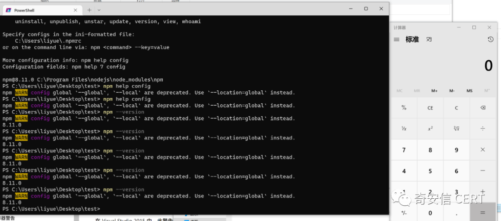

# 【原作者复现通告】Nodejs Dll 劫持漏洞(CVE-2022-32223)安全风险通告

> 编号角色校订（2026-10-04）：按归档技术正文区分主讨论编号与背景引用，更新 `primary_identifiers` / `referenced_identifiers` 及旧字段角色。旧编号原值、状态与正文保持原样，变更前字段逐字保存在 `previous_*`；后文旧的角色待核说明应按当前字段阅读。这里的角色判读不等于官方分配核验或漏洞复现。

<!-- vulwiki-editorial-rebuild:system-misc -->
## 条目范围与校订

- 本文对象：Node.js Windows CVE-2022-32223 DLL劫持
- 文献类型：技术文章（细分类待核）
- 版本、权限及部署边界：需攻击者能在被搜索目录布置目标DLL/满足相应加载功能，API进程权限决定影响，不能只凭版本判所有部署；不受影响>=14.20/>=16.16/>=18.5当OR会把有洞16/18包括进去，应分支表达，17起到18.5的范围也需EOL核；本地PR:N向量与文件可控前提应解释
- 核验状态：仅重建文本校订；未执行文中代码、PoC 或扫描，未把截图或转载声明记为本站复现

### 具体结论与待核项

以下为原归档的逐项勘误与证据缺口；可由文本确定的问题已在下文订正，仍缺来源的事实保持待核。

1. DLL平台仅Windows却正文全Nodejs未限定
2. 需攻击者能在被搜索目录布置目标DLL/满足相应加载功能，API进程权限决定影响，不能只凭版本判所有部署
3. 不受影响>=14.20/>=16.16/>=18.5当OR会把有洞16/18包括进去，应分支表达，17起到18.5的范围也需EOL核
4. PoC只截图缺DLL名/路径/触发参数，公告已复现非审阅验证
5. Aqua研究和Snyk来源明确但缺Node官方安全发布
6. 本地PR:N向量与文件可控前提应解释
7. HTML重复表可规范

### 操作风险

原文技术操作的实际副作用未复现核验；按其请求/代码评估状态变更、凭据暴露和业务影响

技术请求、代码与实验方法按原文保留；其中的破坏性动作仅限授权、可恢复的隔离环境。缺失代码、参数或版本事实不猜补。

### 来源追溯

- 原始披露 URL 未确认；既有归档来源标签保留，不能替代原始公告

### 归档技术正文

原创 QAX CERT  奇安信 CERT   2022-07-14 10:25  
  
  
  
奇安信CERT  
  
**致力于**  
第一时间  
为企业级用户提供安全风险  
**通告**  
和  
**有效**  
解决方案。  
  
  
**安全通告**  
  
  
  
近日，奇安信CERT监测到 Nodejs Dll 劫持漏洞  
(CVE-2022-32223)  
，在nodejs中存在dll劫持漏洞，攻击者可以通过dll劫持向nodejs内注入恶意dll，从而执行代码。**鉴于该漏洞影响范围极大，建议客户尽快做好自查及防护。**  
  
****  
<table><tbody><tr><td style="word-break: break-all;padding: 5px 10px;border-color: rgb(221, 221, 221);" width="99">
<strong>漏洞名称</strong>
</td><td colspan="3" style="word-break: break-all;padding: 5px 10px;border-color: rgb(221, 221, 221);">
<strong>Nodejs Dll 劫持漏洞</strong>
</td></tr><tr><td style="padding: 5px 10px;border-color: rgb(221, 221, 221);" width="120">
<strong>公开时间</strong>
</td><td style="padding: 5px 10px;border-color: rgb(221, 221, 221);" width="154">
2022-07-12
</td><td style="word-break: break-all;padding: 5px 10px;border-color: rgb(221, 221, 221);" width="115">
<strong>更新时间</strong>
</td><td style="padding: 5px 10px;border-color: rgb(221, 221, 221);" width="125">
2022-07-13
</td></tr><tr><td style="padding: 5px 10px;border-color: rgb(221, 221, 221);" width="136">
<strong>CVE编号</strong>
</td><td style="padding: 5px 10px;border-color: rgb(221, 221, 221);" width="164">
CVE-2022-32223
</td><td style="padding: 5px 10px;border-color: rgb(221, 221, 221);" width="126">
<strong>其他编号</strong>
</td><td style="padding: 5px 10px;border-color: rgb(221, 221, 221);" width="133">
QVD-2022-10913
</td></tr><tr><td style="padding: 5px 10px;border-color: rgb(221, 221, 221);" width="141">
<strong>威胁类型</strong>
</td><td style="padding: 5px 10px;border-color: rgb(221, 221, 221);" width="164">
代码执行
</td><td style="padding: 5px 10px;border-color: rgb(221, 221, 221);" width="131">
<strong>技术类型</strong>
</td><td style="padding: 5px 10px;border-color: rgb(221, 221, 221);" width="136">
Dll劫持
</td></tr><tr><td style="padding: 5px 10px;border-color: rgb(221, 221, 221);" width="143">
<strong>厂商</strong>
</td><td style="padding: 5px 10px;border-color: rgb(221, 221, 221);" width="162">
Nodejs
</td><td style="padding: 5px 10px;border-color: rgb(221, 221, 221);" width="134">
<strong>产品</strong>
</td><td style="padding: 5px 10px;border-color: rgb(221, 221, 221);" width="137">
Nodejs
</td></tr><tr><td colspan="4" align="center" valign="middle" style="word-break: break-all;padding: 5px 10px;border-color: rgb(221, 221, 221);">
<strong>风险等级</strong>
</td></tr><tr><td colspan="2" align="center" valign="middle" style="padding: 5px 10px;border-color: rgb(221, 221, 221);">
<strong>奇安信CERT风险评级</strong>
</td><td colspan="2" align="center" valign="middle" style="padding: 5px 10px;border-color: rgb(221, 221, 221);">
<strong>风险等级</strong>
</td></tr><tr><td colspan="2" align="center" valign="middle" style="padding: 5px 10px;border-color: rgb(221, 221, 221);">
<strong>高危</strong>
</td><td colspan="2" align="center" valign="middle" style="padding: 5px 10px;border-color: rgb(221, 221, 221);">
<strong>蓝色（一般事件）</strong>
</td></tr><tr><td colspan="4" align="center" valign="middle" style="padding: 5px 10px;border-color: rgb(221, 221, 221);">
<strong>现时威胁状态</strong>
</td></tr><tr><td align="center" valign="middle" style="word-break: break-all;padding: 5px 10px;border-color: rgb(221, 221, 221);" width="143">
<strong>POC状态</strong>
</td><td align="center" valign="middle" style="padding: 5px 10px;border-color: rgb(221, 221, 221);" width="161">
<strong>EXP状态</strong>
</td><td align="center" valign="middle" style="padding: 5px 10px;border-color: rgb(221, 221, 221);" width="135">
<strong>在野利用状态</strong>
</td><td align="center" valign="middle" style="padding: 5px 10px;border-color: rgb(221, 221, 221);" width="138">
<strong>技术细节状态</strong>
</td></tr><tr><td align="center" valign="middle" style="word-break: break-all;padding: 5px 10px;border-color: rgb(221, 221, 221);" width="143">
<strong>已发现</strong>
</td><td align="center" valign="middle" style="padding: 5px 10px;border-color: rgb(221, 221, 221);" width="160">
未发现
</td><td align="center" valign="middle" style="padding: 5px 10px;border-color: rgb(221, 221, 221);" width="136">
未发现
</td><td align="center" valign="middle" style="word-break: break-all;padding: 5px 10px;border-color: rgb(221, 221, 221);" width="138">
<strong>已公开</strong>
</td></tr><tr><td style="word-break: break-all;padding: 5px 10px;border-color: rgb(221, 221, 221);" width="142">
<strong>漏洞描述</strong>
</td><td colspan="3" style="padding: 5px 10px;border-color: rgb(221, 221, 221);">
在nodejs中存在dll劫持漏洞，攻击者可以通过dll劫持向nodejs内注入恶意dll，从而执行代码
</td></tr><tr><td style="padding: 5px 10px;border-color: rgb(221, 221, 221);" width="142">
<strong>影响版本</strong>
</td><td colspan="3" style="padding: 5px 10px;border-color: rgb(221, 221, 221);">
Nodejs &lt; 14.20.0

16.0.0 &lt;= Nodejs &lt; 16.16.0

17.0.0 &lt;= Nodejs &lt; 18.5.0
</td></tr><tr><td style="padding: 5px 10px;border-color: rgb(221, 221, 221);" width="142">
<strong>不受影响版本</strong>
</td><td colspan="3" style="padding: 5px 10px;border-color: rgb(221, 221, 221);">
Nodejs &gt;= 16.16.0

Nodejs &gt;= 18.5.0

Nodejs &gt;= 14.20.0
</td></tr><tr><td style="padding: 5px 10px;border-color: rgb(221, 221, 221);" width="142">
<strong>其他受影响组件</strong>
</td><td colspan="3" style="padding: 5px 10px;border-color: rgb(221, 221, 221);">
无
</td></tr></tbody></table>  
  
目前，奇安信CERT已成功复现该漏洞，截图如下：  
  
  
  
  
  
威胁评估  
  
<table><tbody><tr><td style="word-break: break-all;padding: 5px 10px;" width="75">
<strong>漏洞名称</strong>
</td><td colspan="4" align="center" valign="middle" style="padding: 5px 10px;" width="460">
Nodejs Dll 劫持漏洞
</td></tr><tr><td style="padding: 5px 10px;" width="75">
<strong>CVE编号</strong>
</td><td align="center" valign="middle" style="padding: 5px 10px;" width="106">
CVE-2022-32223
</td><td colspan="2" style="word-break: break-all;padding: 5px 10px;" width="206">
<strong>其他编号</strong>
</td><td align="center" valign="middle" style="padding: 5px 10px;" width="106">
QVD-2022-10913
</td></tr><tr><td style="padding: 5px 10px;" width="75">
<strong>CVSS 3.1评级</strong>
</td><td align="center" valign="middle" style="padding: 5px 10px;" width="106">
高危
</td><td colspan="2" style="padding: 5px 10px;" width="206">
<strong>CVSS 3.1分数</strong>
</td><td align="center" valign="middle" style="padding: 5px 10px;" width="106">
8.4
</td></tr><tr><td rowspan="8" style="padding: 5px 10px;" width="75">
<strong>CVSS向量</strong>
</td><td colspan="2" align="center" valign="middle" style="word-break: break-all;padding: 5px 10px;" width="322">
<strong>访问途径（AV）</strong>
</td><td colspan="2" align="center" valign="middle" style="padding: 5px 10px;">
<strong>攻击复杂度（AC）</strong>
</td></tr><tr><td colspan="2" align="center" valign="middle" style="padding: 5px 10px;" width="188">
本地
</td><td colspan="2" align="center" valign="middle" style="padding: 5px 10px;" width="109">
低
</td></tr><tr><td colspan="2" align="center" valign="middle" style="word-break: break-all;padding: 5px 10px;" width="256">
<strong>所需权限（PR）</strong>
</td><td colspan="2" align="center" valign="middle" style="padding: 5px 10px;" width="109">
<strong>用户交互（UI）</strong>
</td></tr><tr><td colspan="2" align="center" valign="middle" style="padding: 5px 10px;" width="273">
无
</td><td colspan="2" align="center" valign="middle" style="padding: 5px 10px;" width="109">
不需要
</td></tr><tr><td colspan="2" align="center" valign="middle" style="word-break: break-all;padding: 5px 10px;" width="281">
<strong>影响范围（S）</strong>
</td><td colspan="2" align="center" valign="middle" style="word-break: break-all;padding: 5px 10px;" width="109">
<strong>机密性影响（C）</strong>
</td></tr><tr><td colspan="2" align="center" valign="middle" style="padding: 5px 10px;" width="284">
不改变
</td><td colspan="2" align="center" valign="middle" style="padding: 5px 10px;" width="109">
高
</td></tr><tr><td colspan="2" align="center" valign="middle" style="word-break: break-all;padding: 5px 10px;" width="286">
<strong>完整性影响（I）</strong>
</td><td colspan="2" align="center" valign="middle" style="padding: 5px 10px;" width="109">
<strong>可用性影响（A）</strong>
</td></tr><tr><td colspan="2" align="center" valign="middle" style="padding: 5px 10px;" width="287">
高
</td><td colspan="2" align="center" valign="middle" style="padding: 5px 10px;" width="109">
高
</td></tr><tr><td style="padding: 5px 10px;" width="75">
<strong>危害描述</strong>
</td><td colspan="4" style="padding: 5px 10px;" width="460">
攻击者可以通过dll劫持向nodejs内注入恶意dll，从而在Nodejs内执行代码，危害业务安全。
</td></tr></tbody></table>  
  
  
处置建议  
  
1.升级版本  
  
升级Nodejs到以下版本  
  
Nodejs
>= 16.16.0  
  
Nodejs
>= 18.5.0  
  
Nodejs
>= 14.20.0  
  
  
参考资料  
  
[1]https://blog.aquasec.com/cve-2022-32223-dll-hijacking  
  
[2]https://security.snyk.io/vuln/SNYK-UPSTREAM-NODE-2946727  
  
  
时间线  
  
2022年7月  
14日，  
奇安信 CERT发布安全风险通告。  
  
  
点击**阅读原文**  
到奇安信NOX-安全监测平台查询更多漏洞详情  

---

> 来源：gelusus/wxvl（微信公众号漏洞文章自动归档，原始披露 URL 尚未确认，现有链接按来源追溯区分别标注）
