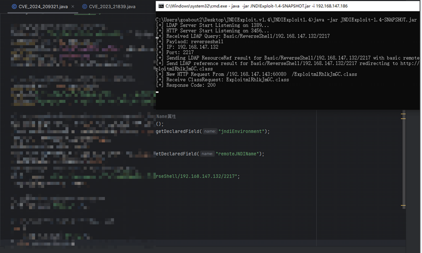
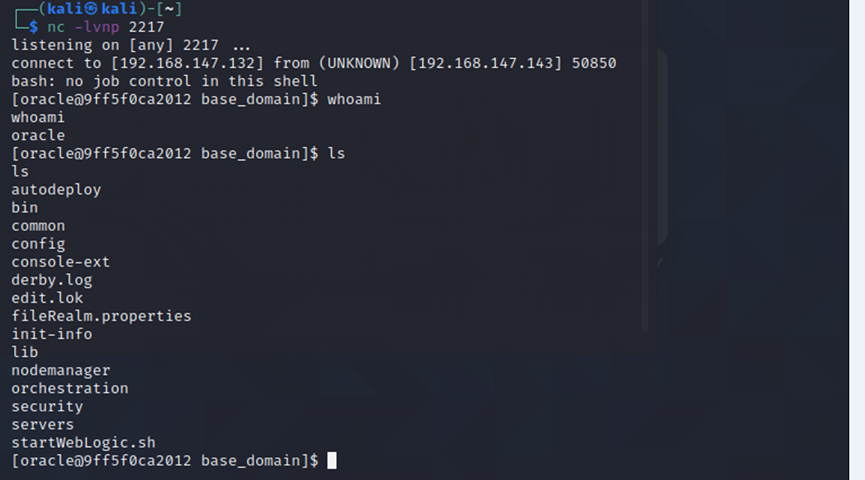
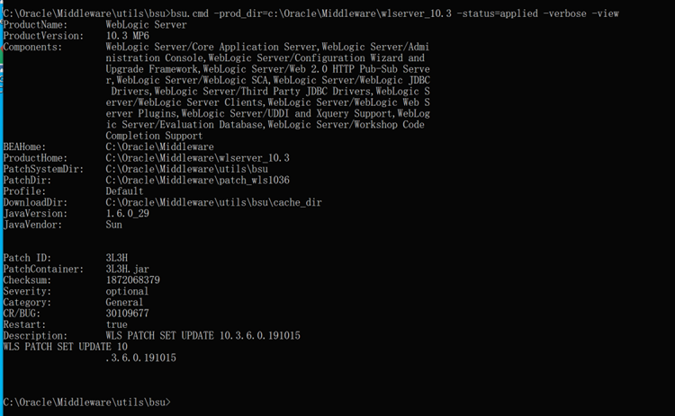
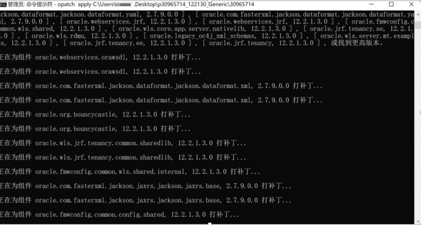
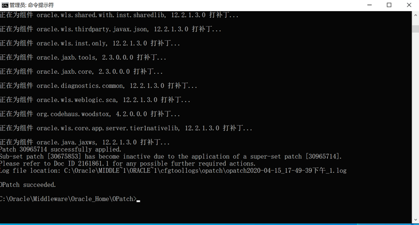
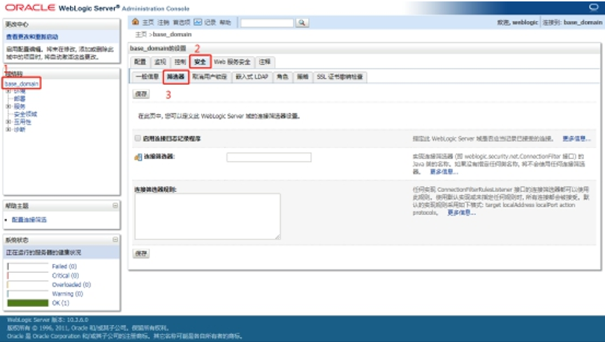
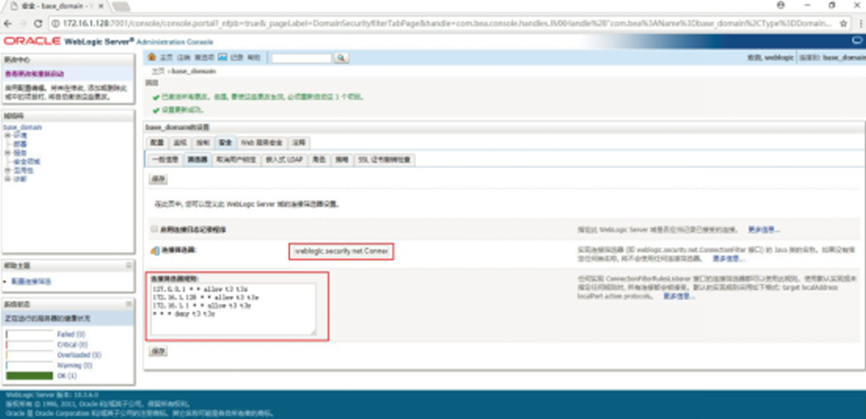
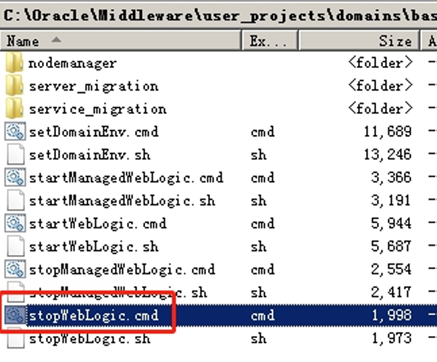
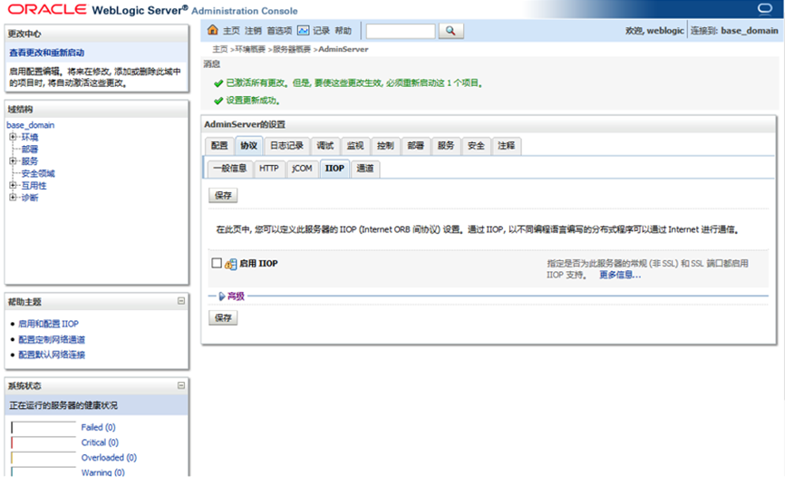

# 【原作者复现通告】Oracle WebLogic Server JNDI注入漏洞(CVE-2024-20931)安全风险通告

> 编号角色校订（2026-10-04）：按归档技术正文区分主讨论编号与背景引用，更新 `primary_identifiers` / `referenced_identifiers` 及旧字段角色。旧编号原值、状态与正文保持原样，变更前字段逐字保存在 `previous_*`；后文旧的角色待核说明应按当前字段阅读。这里的角色判读不等于官方分配核验或漏洞复现。

<!-- vulwiki-editorial-rebuild:system-misc -->
## 条目范围与校订

- 本文对象：WebLogic CVE-2024-20931 JNDI
- 文献类型：技术文章（细分类待核）
- 版本、权限及部署边界：列12.2.1.4/14.1.1受影响却给11g BSU3L3H旧补丁模板，14c无对应指引，可能误打补丁；JNDI查询到RCE需JDK/gadget/出网条件，7.5官方类型与接管描述需区分实验链
- 核验状态：仅重建文本校订；未执行文中代码、PoC 或扫描，未把截图或转载声明记为本站复现

### 具体结论与待核项

以下为原归档的逐项勘误与证据缺口；可由文本确定的问题已在下文订正，仍缺来源的事实保持待核。

1. 前序21839只补丁绕过关联，主20931正确
2. 正文安全更新链接误指cpuapr2023，末参考cpujan2024才当期
3. 列12.2.1.4/14.1.1受影响却给11g BSU3L3H旧补丁模板，14c无对应指引，可能误打补丁
4. ConnectionFilterImpl包名WebLogic大小写错误应核实际类名，允许白名单是限制T3不是完全禁用
5. IIOP只改AdminServer未覆盖ManagedServers其他通道
6. JNDI查询到RCE需JDK/gadget/出网条件，7.5官方类型与接管描述需区分实验链
7. 只截图无PoC文本，万级无证据
8. 提示重启业务中断合理，官方CPU来源可追溯

### 操作风险

IIOP只改AdminServer未覆盖ManagedServers其他通道；提示重启业务中断合理，官方CPU来源可追溯

技术请求、代码与实验方法按原文保留；其中的破坏性动作仅限授权、可恢复的隔离环境。缺失代码、参数或版本事实不猜补。

### 来源追溯

- 原始披露 URL 未确认；既有归档来源标签保留，不能替代原始公告

### 归档技术正文

原创 QAX CERT  奇安信 CERT   2024-02-06 15:37  
  
●   
点击↑蓝字关注我们，获取更多安全风险通告  
  
  
<table><tbody><tr><td valign="middle" align="center" rowspan="1" colspan="4" style="background-color: #4676d9;border-color: #4676d9;">
<strong>漏洞概述</strong> 
</td></tr><tr><td valign="middle" align="left" style="border-color: #4676d9;" width="138">
<strong>漏洞名称</strong>
</td><td valign="middle" align="left" rowspan="1" colspan="3" style="border-color: #4676d9;">
Oracle WebLogic Server JNDI注入漏洞
</td></tr><tr><td valign="middle" align="left" rowspan="1" colspan="1" style="border-color: #4676d9;" width="138">
<strong>漏洞编号</strong>
</td><td valign="middle" align="left" rowspan="1" colspan="3" style="border-color: #4676d9;">
QVD-2024-2987,CVE-2024-20931
</td></tr><tr><td valign="middle" align="left" style="border-color: #4676d9;" width="138">
<strong>公开时间</strong>
</td><td valign="middle" align="left" style="border-color: #4676d9;" width="153">
2024-01-17
</td><td valign="middle" align="left" style="border-color: #4676d9;" width="170">
<strong>影响量级</strong>
</td><td valign="middle" align="left" style="border-color: #4676d9;" width="96">
万级
</td></tr><tr><td valign="middle" align="left" style="border-color: #4676d9;" width="138">
<strong>奇安信评级</strong>
</td><td valign="middle" align="left" style="border-color: #4676d9;" width="153">
<strong style="max-inline-size: 100%;margin: 0px;padding: 0px;box-sizing: border-box !important;overflow-wrap: break-word !important;outline: none 0px !important;cursor: text;color: #000000;font-size: 13px;text-align: -webkit-left;caret-color: #ff0000;text-decoration-thickness: initial;font-family:微软雅黑, &#34;Microsoft YaHei&#34;, sans-serif;">高危</strong>
</td><td valign="middle" align="left" style="border-color: #4676d9;" width="170">
<strong><strong style="max-inline-size: 100%;margin: 0px;padding: 0px;box-sizing: border-box !important;overflow-wrap: break-word !important;outline: none 0px !important;cursor: text;color: #000000;font-size: 13px;text-align: -webkit-left;caret-color: #ff0000;text-decoration-thickness: initial;font-family:微软雅黑, &#34;Microsoft YaHei&#34;, sans-serif;">CVSS 3.1分数</strong></strong>
</td><td valign="middle" align="left" style="border-color: #4676d9;" width="96">
<strong>7.5</strong>
</td></tr><tr><td valign="middle" align="left" style="border-color: #4676d9;" width="138">
<strong>威胁类型</strong><strong></strong>
</td><td valign="middle" align="left" style="border-color: #4676d9;" width="153">
代码执行
</td><td valign="middle" align="left" style="border-color: #4676d9;" width="170">
<strong>利用可能性</strong>
</td><td valign="middle" align="left" style="border-color: #4676d9;" width="96">
<strong>高</strong>
</td></tr><tr><td valign="middle" colspan="1" rowspan="1" align="left" style="border-color: #4676d9;" width="138">
<strong>POC状态</strong>
</td><td valign="middle" colspan="1" rowspan="1" align="left" style="border-color: #4676d9;" width="153">
<strong>已公开</strong>
</td><td valign="middle" colspan="1" rowspan="1" align="left" style="border-color: #4676d9;" width="170">
<strong>在野利用状态</strong>
</td><td valign="middle" colspan="1" rowspan="1" align="left" style="border-color: #4676d9;" width="96">
未发现
</td></tr><tr><td valign="middle" colspan="1" rowspan="1" align="left" style="border-color: #4676d9;" width="138">
<strong>EXP状态</strong>
</td><td valign="middle" colspan="1" rowspan="1" align="left" style="border-color: #4676d9;" width="153">
未公开
</td><td valign="middle" colspan="1" rowspan="1" align="left" style="border-color: #4676d9;" width="170">
<strong>技术细节状态</strong>
</td><td valign="middle" colspan="1" rowspan="1" align="left" style="border-color: #4676d9;" width="96">
<strong>已公开</strong>
</td></tr><tr><td valign="middle" colspan="4" rowspan="1" align="left" style="border-color: #4676d9;">
<strong>危害描述：</strong>成功利用此漏洞可能会导致 Oracle WebLogic Server 被接管。
</td></tr></tbody></table>  
  
  
**（注：奇安信CERT的漏洞深度分析报告包含此漏洞的POC及技术细节，订阅方式见文末。）**  
  
  
**0****1**  
  
**漏洞详情**  
  
**>**  
**>**  
**>**  
**>**  
  
**影响组件**  
  
Oracle WebLogic Server 是一个Java应用服务器，它全面实现了J2EE 1.5规范、最新的Web服务标准和最高级的互操作标准。WebLogic Server内核以可执行、可扩展和可靠的方式提供统一的安全、事务和管理服务。  
  
  
**>**  
**>**  
**>**  
**>**  
  
**漏洞描述**  
  
近日，奇安信CERT监测到**Oracle WebLogic Server JNDI注入漏洞(CVE-2024-20931)**  
，该漏洞是由于 CVE-2023-21839 漏洞未修补完全，未经身份验证的攻击者通过 T3、IIOP 进行网络访问来破坏 Oracle WebLogic Server。成功利用此漏洞可能会导致 Oracle WebLogic Server 被接管。**奇安信威胁情报中心安全研究员已复现此漏洞。**  
**鉴于该产品用量较大，建议客户尽快做好自查及防护。**  
  
  
  
**02**  
  
**影响范围**  
  
**>**  
**>**  
**>**  
**>**  
  
**影响版本**  
  
Oracle Fusion Middleware 12.2.1.4.0   
  
Oracle Fusion Middleware 14.1.1.0.0  
  
  
**>**  
**>**  
**>**  
**>**  
  
**其他受影响组件**  
  
无  
  
  
  
**03**  
  
**复现情况**  
  
目前，奇安信CERT已成功复现**Oracle WebLogic Server JNDI注入漏洞(CVE-2024-20931)**  
，截图如下：  
  
  
  
  
  
  
  
  
**04**  
  
**处置建议**  
  
**>**  
**>**  
**>**  
**>**  
  
**安全更新**  
  
目前官方已有可更新补丁，建议受影响用户及时安装补丁，可参考：  
  
https://www.oracle.com/security-alerts/cpuapr2023.html  
  
  
**Oracle WebLogic Server升级方式**  
  
1.Oracle WebLogic Server 11g：  
  
bsu.cmd -install -patch_download_dir=C:\Oracle\Middleware\utils\bsu\cache_dir -patchlist=3L3H -prod_dir=C:\Oracle\Middleware\wlserver_10.3  
  
  
  
出现以上提示代表补丁安装成功。  
  
  
2.Oracle WebLogic Server 12c：  
  
使用opatch apply 安装补丁  
  
C:\Oracle\Middleware\Oracle_Home\OPatch>opatch apply 本机补丁地址  
  
  
  
  
  
注：补丁编号请自行更改为新补丁编号。  
  
  
**若非必须开启，请禁用T3和IIOP协议。**  
  
禁用T3、IIOP协议具体操作步骤如下：  
  
1.禁用T3:  
  
进入WebLogic控制台，在base_domain的配置页面中，进入“安全”选项卡页面，点击“筛选器”，进入连接筛选器配置。  
   
  
  
在连接筛选器中输入：WebLogic.security.net.ConnectionFilterImpl，参考以下写法，在连接筛选器规则中配置符合企业实际情况的规则：  
  
127.0.0.1 * * allow t3 t3s  
  
本机IP * * allow t3 t3s  
  
允许访问的IP * * allow t3 t3s   
  
* * * deny t3 t3s  
  
  
  
连接筛选器规则格式如下：target localAddress localPort action protocols，其中：  
  
target 指定一个或多个要筛选的服务器。  
  
localAddress 可定义服务器的主机地址。(如果指定为一个星号 (*)，则返回的匹配结果将是所有本地 IP 地址。)  
  
localPort 定义服务器正在监听的端口。(如果指定了星号，则匹配返回的结果将是服务器上所有可用的端口)。  
  
action 指定要执行的操作。(值必须为“allow”或“deny”。)  
  
protocols 是要进行匹配的协议名列表。(必须指定下列其中一个协议：http、https、t3、t3s、giop、giops、dcom 或 ftp。) 如果未定义协议，则所有协议都将与一个规则匹配。  
  
保存后若规则未生效，建议重新启动WebLogic服务（重启WebLogic服务会导致业务中断，建议相关人员评估风险后，再进行操作）。以Windows环境为例，重启服务的步骤如下：  
  
进入域所在目录下的bin目录，在Windows系统中运行stopWebLogic.cmd文件终止WebLogic服务，Linux系统中则运行stopWebLogic.sh文件。  
  
   
  
  
待终止脚本执行完成后，再运行startWebLogic.cmd或startWebLogic.sh文件启动WebLogic，即可完成WebLogic服务重启。  
  
2.禁用IIOP：  
  
用户可通过关闭IIOP协议阻断针对利用IIOP协议漏洞的攻击，操作如下：  
  
在WebLogic控制台中，选择“服务”->”AdminServer”->”协议”，取消“启用IIOP”的勾选。并重启WebLogic项目，使配置生效。  
  
  
  
  
  
**>**  
**>**  
**>**  
**>**  
  
**产品解决方案**  
  
**奇安信网神网络数据传感器系统产品检测方案**  
  
奇安信网神网络数据传感器（NDS5000/7000/9000系列）产品，已具备该漏洞的检测能力。规则ID为：51622，建议用户尽快升级检测规则库至2402061330以上。  
  
  
**奇安信天眼检测方案**  
  
奇安信天眼新一代安全感知系统已经能够有效检测针对该漏洞的攻击，请将规则版本升级到3.0.0204.14195或以上版本。规则ID及规则名称：0x604e，Weblogic T3\IIOP协议的远程命令执行漏洞(CVE-2024-20931)。奇安信天眼流量探针规则升级方法：系统配置->设备升级->规则升级，选择“网络升级”或“本地升级”。  
  
  
**05**  
  
**参考资料**  
  
[1]https://www.oracle.com/security-alerts/cpujan2024verbose.html  
  
  
  
**06**  
  
**时间线**  
  
2024年2月6日，奇安信 CERT发布安全风险通告  
。  
  
  
  
**07**  
  
**漏洞情报服务**  
  
奇安信ALPH  
A威胁分析平台已支持漏洞情报订阅服务：  
  
  
  
  
  
  
  
  
  
  
**奇安信 CERT**  
  
**致力于**  
第一时间为企业级用户提供**权威**漏洞情报和**有效**  
解决方案。  
  
  
点击↓**阅读原文**，到**ALPHA威胁分析平台**  
订阅更多漏洞信息。  
  

---

> 来源：gelusus/wxvl（微信公众号漏洞文章自动归档，原始披露 URL 尚未确认，现有链接按来源追溯区分别标注）
