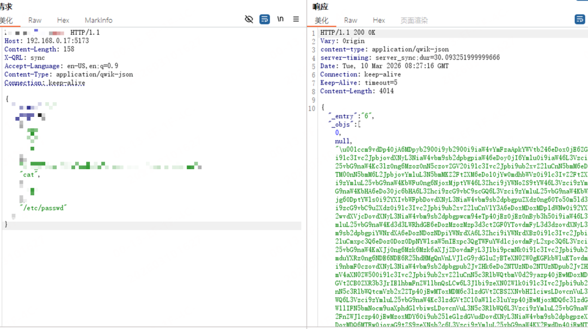

# 【原作者复现通告】Qwik server$ 反序列化未授权远程代码执行漏洞（CVE-2026-27971）

> 编号角色校订（2026-10-04）：按归档技术正文区分主讨论编号与背景引用，更新 `primary_identifiers` / `referenced_identifiers` 及旧字段角色。旧编号原值、状态与正文保持原样，变更前字段逐字保存在 `previous_*`；后文旧的角色待核说明应按当前字段阅读。这里的角色判读不等于官方分配核验或漏洞复现。

<!-- vulwiki-editorial-rebuild:system-misc -->
## 条目范围与校订

- 本文对象：Qwik CVE-2026-27971 QRL反序列化
- 文献类型：技术文章（细分类待核）
- 版本、权限及部署边界：明确server$RPC、全局require可用及本地危险模块条件，优于笼统所有SSR都RCE
- 核验状态：仅重建文本校订；未执行文中代码、PoC 或扫描，未把截图或转载声明记为本站复现

### 具体结论与待核项

以下为原归档的逐项勘误与证据缺口；可由文本确定的问题已在下文订正，仍缺来源的事实保持待核。

1. 明确server$RPC、全局require可用及本地危险模块条件，优于笼统所有SSR都RCE
2. Bun/传统CJS只是例，具体adapter/打包模块路径和可导出函数需核
3. <1.19.1首修和精确QwikGHSA/官方CVE来源充分
4. 复现仅截图无harness/请求体/QRL序列化格式，不能复制验证
5. 未在野/PoC公开但EXP未公开为3月通告状态
6. 反序列化影响包应明确npm包名/子组件，广告可简化

### 操作风险

原文技术操作的实际副作用未复现核验；按其请求/代码评估状态变更、凭据暴露和业务影响

技术请求、代码与实验方法按原文保留；其中的破坏性动作仅限授权、可恢复的隔离环境。缺失代码、参数或版本事实不猜补。

### 来源追溯

- 原始披露 URL 未确认；既有归档来源标签保留，不能替代原始公告

### 归档技术正文

原创 360漏洞研究院
                    360漏洞研究院  360漏洞研究院   2026-03-12 07:19  
  
“扫描下方二维码，进入公众号粉丝交流群。更多一手网安资讯、漏洞预警、技术干货和技术交流等您参与！”  
  
  
  
  
  
  
<table><tbody><tr style="box-sizing: border-box;"><td colspan="4" data-colwidth="100.0000%" width="100.0000%" style="border-width: 1px;border-color: rgb(100, 130, 228);border-style: solid;background-color: rgb(100, 130, 228);box-sizing: border-box;padding: 0px;"><section style="text-align: center;color: rgb(255, 255, 255);box-sizing: border-box;">
<strong style="box-sizing: border-box;">漏洞概述</strong>
</section></td></tr><tr style="box-sizing: border-box;"><td data-colwidth="24.0000%" width="24.0000%" style="border-width: 1px;border-color: rgb(100, 130, 228);border-style: solid;box-sizing: border-box;padding: 0px;"><section style="font-size: 12px;color: rgb(0, 0, 0);padding: 0px 8px;box-sizing: border-box;">
<strong style="box-sizing: border-box;">漏洞名称</strong>
</section></td><td colspan="3" data-colwidth="76.0000%" width="76.0000%" style="border-width: 1px;border-color: rgb(100, 130, 228);border-style: solid;box-sizing: border-box;padding: 0px;"><section style="font-size: 12px;padding: 0px 8px;box-sizing: border-box;">
Qwik server$ 反序列化未授权远程代码执行漏洞
</section></td></tr><tr style="box-sizing: border-box;"><td data-colwidth="24.0000%" width="24.0000%" style="border-width: 1px;border-color: rgb(100, 130, 228);border-style: solid;box-sizing: border-box;padding: 0px;"><section style="font-size: 12px;color: rgb(0, 0, 0);padding: 0px 8px;box-sizing: border-box;">
<strong style="box-sizing: border-box;">漏洞编号</strong>
</section></td><td colspan="3" data-colwidth="76.0000%" width="76.0000%" style="border-width: 1px;border-color: rgb(100, 130, 228);border-style: solid;box-sizing: border-box;padding: 0px;"><section style="font-size: 12px;padding: 0px 8px;box-sizing: border-box;">
CVE-2026-27971
</section></td></tr><tr style="box-sizing: border-box;"><td data-colwidth="24.0000%" width="24.0000%" style="border-width: 1px;border-color: rgb(100, 130, 228);border-style: solid;box-sizing: border-box;padding: 0px;"><section style="font-size: 12px;color: rgb(0, 0, 0);padding: 0px 8px;box-sizing: border-box;">
<strong style="box-sizing: border-box;">公开时间</strong>
</section></td><td data-colwidth="28.0000%" width="28.0000%" style="border-width: 1px;border-color: rgb(100, 130, 228);border-style: solid;box-sizing: border-box;padding: 0px;"><section style="font-size: 12px;padding: 0px 8px;box-sizing: border-box;">
2026-03-03
</section></td><td data-colwidth="28.0000%" width="28.0000%" style="border-width: 1px;border-color: rgb(100, 130, 228);border-style: solid;box-sizing: border-box;padding: 0px;"><section style="font-size: 12px;padding: 0px 8px;box-sizing: border-box;">
<strong style="box-sizing: border-box;">POC状态</strong>
</section></td><td data-colwidth="20.0000%" width="20.0000%" style="border-width: 1px;border-color: rgb(100, 130, 228);border-style: solid;box-sizing: border-box;padding: 0px;"><section style="font-size: 12px;padding: 0px 8px;color: rgb(100, 130, 228);box-sizing: border-box;">
<strong style="box-sizing: border-box;">已公开</strong>
</section></td></tr><tr style="box-sizing: border-box;"><td data-colwidth="24.0000%" width="24.0000%" style="border-width: 1px;border-color: rgb(100, 130, 228);border-style: solid;box-sizing: border-box;padding: 0px;"><section style="font-size: 12px;color: rgb(0, 0, 0);padding: 0px 8px;box-sizing: border-box;">
<strong style="box-sizing: border-box;">漏洞类型</strong>
</section></td><td data-colwidth="28.0000%" width="28.0000%" style="border-width: 1px;border-color: rgb(100, 130, 228);border-style: solid;box-sizing: border-box;padding: 0px;"><section style="font-size: 12px;padding: 0px 8px;box-sizing: border-box;">
反序列化
</section></td><td data-colwidth="28.0000%" width="28.0000%" style="border-width: 1px;border-color: rgb(100, 130, 228);border-style: solid;box-sizing: border-box;padding: 0px;"><section style="font-size: 12px;color: rgb(0, 0, 0);padding: 0px 8px;box-sizing: border-box;">
<strong style="box-sizing: border-box;">EXP状态</strong>
</section></td><td data-colwidth="20.0000%" width="20.0000%" style="border-width: 1px;border-color: rgb(100, 130, 228);border-style: solid;box-sizing: border-box;padding: 0px;"><section style="font-size: 12px;padding: 0px 8px;box-sizing: border-box;">
未公开
</section></td></tr><tr style="box-sizing: border-box;"><td data-colwidth="24.0000%" width="24.0000%" style="border-width: 1px;border-color: rgb(100, 130, 228);border-style: solid;box-sizing: border-box;padding: 0px;"><section style="font-size: 12px;padding: 0px 8px;box-sizing: border-box;">
<strong style="box-sizing: border-box;">利用可能性</strong>
</section></td><td data-colwidth="28.0000%" width="28.0000%" style="border-width: 1px;border-color: rgb(100, 130, 228);border-style: solid;box-sizing: border-box;padding: 0px;"><section style="font-size: 12px;padding: 0px 8px;box-sizing: border-box;">
高
</section></td><td data-colwidth="28.0000%" width="28.0000%" style="border-width: 1px;border-color: rgb(100, 130, 228);border-style: solid;box-sizing: border-box;padding: 0px;"><section style="font-size: 12px;padding: 0px 8px;color: rgb(0, 0, 0);box-sizing: border-box;">
<strong style="box-sizing: border-box;">技术细节状态</strong>
</section></td><td data-colwidth="20.0000%" width="20.0000%" style="border-width: 1px;border-color: rgb(100, 130, 228);border-style: solid;box-sizing: border-box;padding: 0px;"><section style="font-size: 12px;padding: 0px 8px;color: rgb(100, 130, 228);box-sizing: border-box;">
<strong style="box-sizing: border-box;">已公开</strong>
</section></td></tr><tr style="box-sizing: border-box;"><td data-colwidth="24.0000%" width="24.0000%" style="border-width: 1px;border-color: rgb(100, 130, 228);border-style: solid;box-sizing: border-box;padding: 0px;"><section style="font-size: 12px;color: rgb(0, 0, 0);padding: 0px 8px;box-sizing: border-box;">
<strong style="box-sizing: border-box;">CVSS 4.0</strong>
</section></td><td data-colwidth="28.0000%" width="28.0000%" style="border-width: 1px;border-color: rgb(100, 130, 228);border-style: solid;box-sizing: border-box;padding: 0px;"><section style="font-size: 12px;padding: 0px 8px;box-sizing: border-box;">
9.2
</section></td><td data-colwidth="28.0000%" width="28.0000%" style="border-width: 1px;border-color: rgb(100, 130, 228);border-style: solid;box-sizing: border-box;padding: 0px;"><section style="font-size: 12px;color: rgb(0, 0, 0);padding: 0px 8px;box-sizing: border-box;">
<strong style="box-sizing: border-box;">在野利用状态</strong>
</section></td><td data-colwidth="20.0000%" width="20.0000%" style="border-width: 1px;border-color: rgb(100, 130, 228);border-style: solid;box-sizing: border-box;padding: 0px;"><section style="font-size: 12px;padding: 0px 8px;box-sizing: border-box;">
未发现
</section></td></tr></tbody></table>  
  
  
**01**  
  
影响组件  
  
  
  
Qwik 是一款专注于性能的 JavaScript 框架，广泛应用于现代 Web 开发场景。其核心特性是通过服务器端序列化应用状态（包括事件监听器、组件树、响应式信号）到初始 HTML 中，实现“可恢复性”（Resumability）。本次漏洞影响 Qwik 框架的 server$ RPC 机制实现，该机制用于处理服务器端-only 的函数执行。  
  
  
**02**  
  
**漏洞描述**  
  
  
  
近日，安全研究人员披露了 Qwik 框架中存在一个严重的反序列化漏洞，编号为**CVE-2026-27971**  
。**该漏洞允许未授权的远程攻击者通过构造恶意的 HTTP 请求，在目标服务器上触发不安全反序列化，进而实现远程代码执行（RCE）。**  
  
  
经安全专家分析，漏洞存在于 server$ RPC 机制的反序列化过程中。当服务器处理 incoming server$ 请求时，会对请求体中的 JSON 数据进行反序列化。攻击者可以利用 QRL（Qwik URL）序列化处理逻辑，控制模块导入路径和符号名称。在 require() 全局可用的环境（如 Bun 或传统 CJS setup）中，攻击者可通过加载本地存在的危险模块（如 cross-spawn）并调用其导出函数，从而执行任意系统命令。  
  
  
**03**  
  
**漏洞复现******  
  
  
  
360漏洞研究院已复现 Qwik server$ 反序列化未授权远程代码执行漏洞（CVE-2026-27971），并验证该漏洞可以未授权远程代码执行。  
  
  
  
CVE-2026-27971  
  
Qwik server$ 反序列化未授权远程代码执行漏洞  
  
  
**04**  
  
**漏洞影响范围******  
  
  
  
受影响的软件版本：  
  
Qwik < 1.19.1  
  
  
**05**  
  
**修复建议******  
  
  
  
**正式防护方案**  
  
建议用户立即升级至官方发布的最新版本（>=1.19.1），以获取针对该漏洞的安全修复。  
  
  
**06**  
  
**产品侧支持情况**  
  
  
  
**360安全智能体：**  
支持该漏洞攻击的智能分析**。**  
  
**360测绘云 Quake**  
：默认支持该产品的指纹识别。  
  
**360高级持续性威胁预警系统**  
：预计 2026年03月13日发布规则更新包，支持该漏洞利用行为的检测。  
  
**360资产与漏洞检测管理系统**  
：预计 2026年03月13日发布规则更新包，支持该漏洞利用行为的检测。  
**本地安全大脑**  
：默认支持该漏洞的PoC检测。  
  
  
**07**  
  
**时间线**  
  
  
  
2026年03月12日，360漏洞研究院发布本安全风险通告。  
  
  
**08**  
  
参考链接  
  
  
  
https://www.cve.org/CVERecord?id=CVE-2026-27971  
  
https://github.com/QwikDev/qwik/security/advisories/GHSA-p9x5-jp3h-96mm  
  
  
09  
  
更多漏洞情报  
  
  
  
建议您订阅360数字安全-漏洞情报服务，获取更多漏洞情报详情以及处置建议，让您的企业远离漏洞威胁。  
  
  
邮箱：360VRI@360.cn  
  
网址：https://vi.loudongyun.360.net  
  
  
  
“洞”悉网络威胁，守护数字安全  
  
  
**关于我们**  
  
  
360 漏洞研究院，隶属于360数字安全集团。其成员常年入选谷歌、微软、华为等厂商的安全精英排行榜, 并获得谷歌、微软、苹果史上最高漏洞奖励。研究院是中国首个荣膺Pwnie Awards“史诗级成就奖”，并获得多个Pwnie Awards提名的组织。累计发现并协助修复谷歌、苹果、微软、华为、高通等全球顶级厂商CVE漏洞3000多个，收获诸多官方公开致谢。研究院也屡次受邀在BlackHat，Usenix Security，Defcon等极具影响力的工业安全峰会和顶级学术会议上分享研究成果，并多次斩获信创挑战赛、天府杯等顶级黑客大赛总冠军和单项冠军。研究院将凭借其在漏洞挖掘和安全攻防方面的强大技术实力，帮助各大企业厂商不断完善系统安全，为数字安全保驾护航，筑造数字时代的安全堡垒。  
  

---

> 来源：gelusus/wxvl（微信公众号漏洞文章自动归档，原始披露 URL 尚未确认，现有链接按来源追溯区分别标注）
