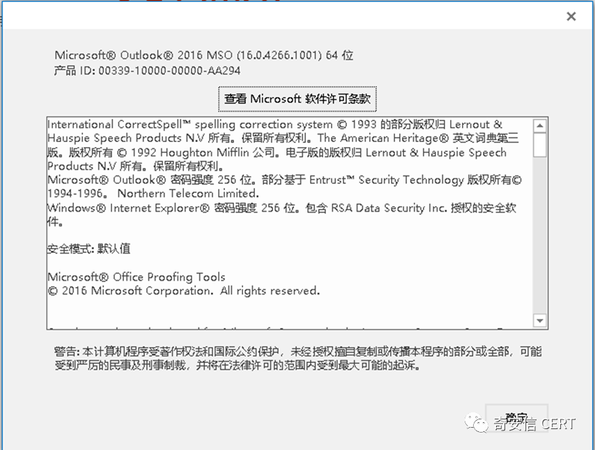
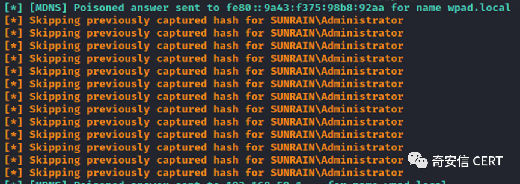
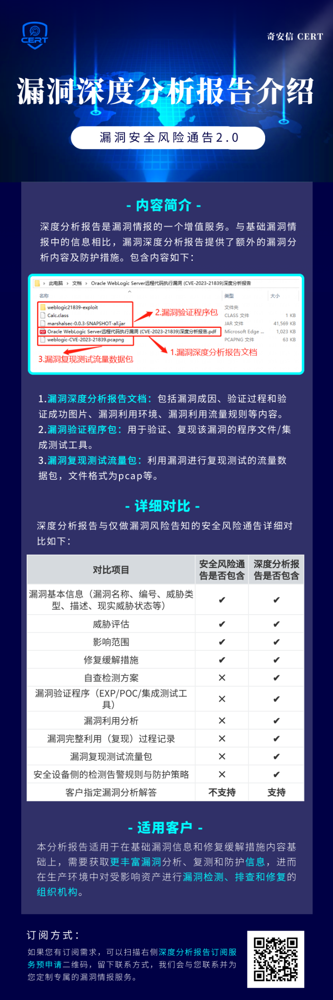

# 【原作者复现通告】Windows MSHTML Platform安全特性绕过漏洞(CVE-2023-29324)安全风险通告

> 编号角色校订（2026-10-04）：按归档技术正文区分主讨论编号与背景引用，更新 `primary_identifiers` / `referenced_identifiers` 及旧字段角色。旧编号原值、状态与正文保持原样，变更前字段逐字保存在 `previous_*`；后文旧的角色待核说明应按当前字段阅读。这里的角色判读不等于官方分配核验或漏洞复现。

<!-- vulwiki-editorial-rebuild:system-misc -->
## 条目范围与校订

- 本文对象：Windows MSHTML CreateUri CVE-2023-29324
- 文献类型：技术文章（细分类待核）
- 版本、权限及部署边界：MSHTML路径转换绕过与直接本地提权/RCE应分开，需Outlook使用该路径、外连SMB/NTLM及后续认证利用条件；系统列表无KB/build映射，仅链接2023五月总补丁页，不能凭系统名称判断补丁后仍受影响
- 核验状态：仅重建文本校订；未执行文中代码、PoC 或扫描，未把截图或转载声明记为本站复现

### 具体结论与待核项

以下为原归档的逐项勘误与证据缺口；可由文本确定的问题已在下文订正，仍缺来源的事实保持待核。

1. 29324为主CVE，23397为被绕过旧补丁/利用链背景，二者不是同一文章重复
2. MSHTML路径转换绕过与直接本地提权/RCE应分开，需Outlook使用该路径、外连SMB/NTLM及后续认证利用条件
3. 系统列表无KB/build映射，仅链接2023五月总补丁页，不能凭系统名称判断补丁后仍受影响
4. 产品方案2023.05.10.1后又写2022.05.10.1为明确年份矛盾
5. 已复现仅作者截图，PoC/细节在订阅文未纳入正文，宜标风险通告
6. CERT高危与CVSS中危属不同评级体系可并存但需标清，广告可移除

### 操作风险

原文技术操作的实际副作用未复现核验；按其请求/代码评估状态变更、凭据暴露和业务影响

技术请求、代码与实验方法按原文保留；其中的破坏性动作仅限授权、可恢复的隔离环境。缺失代码、参数或版本事实不猜补。

### 来源追溯

- 原始披露 URL 未确认；既有归档来源标签保留，不能替代原始公告

### 归档技术正文

原创 QAX CERT  奇安信 CERT   2023-05-11 18:54  
  
  
  
奇安信CERT  
  
**致力于**  
第一时间  
为企业级用户提供  
**权威**  
漏洞情报和  
**有效**  
解决方案。  
  
**（注：奇安信CERT的漏洞深度分析报告包含此漏洞的POC及技术细节，订阅方式见文末。）**  
  
**安全通告**  
  
  
  
MSHTML是微软公司的一个COM组件，该组件封装了HTML语言中的所有元素及其属性，通过其提供的标准接口，可以访问指定网页的所有元素。  
  
  
近日，奇安信CERT监测到**Windows MSHTML Platform 安全特性绕过漏洞(CVE-2023-29324)**，在Windows MSHTML中，由于Windows处理路径函数CreateUri 错误的转换了某些路径，导致攻击者可以构造恶意路径绕过CVE-2023-23397 Microsoft Outlook权限提升漏洞防护措施。**鉴于此漏洞影响范围较大，建议客户尽快做好自查及防护。**  
  
****  
<table><tbody><tr style="height:25px;"><td style="border-color: rgb(221, 221, 221);" height="25" width="80">
<strong>漏洞名称</strong>
</td><td colspan="3" style="border-color: rgb(221, 221, 221);border-left-width: initial;border-left-style: none;" height="25" width="437">
Windows MSHTML Platform 安全特性绕过漏洞
</td></tr><tr style="height:25px;"><td style="border-color: rgb(221, 221, 221);border-top-width: initial;border-top-style: none;" height="25" width="100">
<strong>公开时间</strong>
</td><td style="border-top: none rgb(221, 221, 221);border-left: none rgb(221, 221, 221);border-bottom-color: rgb(221, 221, 221);border-right-color: rgb(221, 221, 221);" height="25" width="145">
2023-05-09
</td><td style="border-top: none rgb(221, 221, 221);border-left: none rgb(221, 221, 221);border-bottom-color: rgb(221, 221, 221);border-right-color: rgb(221, 221, 221);" height="25" width="112">
<strong>更新时间</strong>
</td><td style="border-top: none rgb(221, 221, 221);border-left: none rgb(221, 221, 221);border-bottom-color: rgb(221, 221, 221);border-right-color: rgb(221, 221, 221);" height="25" width="133">
2023-05-11
</td></tr><tr style="height:25px;"><td style="border-color: rgb(221, 221, 221);border-top-width: initial;border-top-style: none;" height="25" width="80">
<strong>CVE</strong><strong>编号</strong>
</td><td style="border-top: none rgb(221, 221, 221);border-left: none rgb(221, 221, 221);border-bottom-color: rgb(221, 221, 221);border-right-color: rgb(221, 221, 221);" height="25" width="131">
CVE-2023-29324
</td><td style="border-top: none rgb(221, 221, 221);border-left: none rgb(221, 221, 221);border-bottom-color: rgb(221, 221, 221);border-right-color: rgb(221, 221, 221);" height="25" width="112">
<strong>其他编号</strong>
</td><td style="border-top: none rgb(221, 221, 221);border-left: none rgb(221, 221, 221);border-bottom-color: rgb(221, 221, 221);border-right-color: rgb(221, 221, 221);" height="25" width="133">
QVD-2023-11040
</td></tr><tr style="height:25px;"><td style="border-color: rgb(221, 221, 221);border-top-width: initial;border-top-style: none;" height="25" width="100">
<strong>威胁类型</strong>
</td><td style="border-top: none rgb(221, 221, 221);border-left: none rgb(221, 221, 221);border-bottom-color: rgb(221, 221, 221);border-right-color: rgb(221, 221, 221);" height="25" width="145">
安全特性绕过
</td><td style="border-top: none rgb(221, 221, 221);border-left: none rgb(221, 221, 221);border-bottom-color: rgb(221, 221, 221);border-right-color: rgb(221, 221, 221);" height="25" width="112">
<strong>技术类型</strong>
</td><td style="border-top: none rgb(221, 221, 221);border-left: none rgb(221, 221, 221);border-bottom-color: rgb(221, 221, 221);border-right-color: rgb(221, 221, 221);" height="25" width="133">
路径混淆
</td></tr><tr style="height:25px;"><td style="border-color: rgb(221, 221, 221);border-top-width: initial;border-top-style: none;" height="25" width="100">
<strong>厂商</strong>
</td><td style="border-top: none rgb(221, 221, 221);border-left: none rgb(221, 221, 221);border-bottom-color: rgb(221, 221, 221);border-right-color: rgb(221, 221, 221);" height="25" width="145">
Microsoft
</td><td style="border-top: none rgb(221, 221, 221);border-left: none rgb(221, 221, 221);border-bottom-color: rgb(221, 221, 221);border-right-color: rgb(221, 221, 221);" height="25" width="112">
<strong>产品</strong>
</td><td style="border-top: none rgb(221, 221, 221);border-left: none rgb(221, 221, 221);border-bottom-color: rgb(221, 221, 221);border-right-color: rgb(221, 221, 221);" height="25" width="133">
Windows
</td></tr><tr style="height:25px;"><td colspan="4" style="border-color: rgb(221, 221, 221);border-top-width: initial;border-top-style: none;" height="25">
<strong>风险等级</strong>
</td></tr><tr style="height:25px;"><td colspan="2" style="border-color: rgb(221, 221, 221);border-top-width: initial;border-top-style: none;" height="25" width="38">
<strong>奇安信</strong><strong>CERT</strong><strong>风险评级</strong>
</td><td colspan="2" style="border-top: none rgb(221, 221, 221);border-left: none rgb(221, 221, 221);border-bottom-color: rgb(221, 221, 221);border-right-color: rgb(221, 221, 221);" height="25" width="266">
<strong>风险等级</strong>
</td></tr><tr style="height:25px;"><td colspan="2" style="border-color: rgb(221, 221, 221);border-top-width: initial;border-top-style: none;" height="25" width="38">
<strong>高危</strong>
</td><td colspan="2" style="border-top: none rgb(221, 221, 221);border-left: none rgb(221, 221, 221);border-bottom-color: rgb(221, 221, 221);border-right-color: rgb(221, 221, 221);" height="25" width="266">
<strong>蓝色（一般事件）</strong>
</td></tr><tr style="height:25px;"><td colspan="4" style="border-color: rgb(221, 221, 221);border-top-width: initial;border-top-style: none;" height="25">
<strong>现时威胁状态</strong>
</td></tr><tr style="height:25px;"><td style="border-color: rgb(221, 221, 221);border-top-width: initial;border-top-style: none;" height="25" width="100">
<strong>POC</strong><strong>状态</strong>
</td><td style="border-top: none rgb(221, 221, 221);border-left: none rgb(221, 221, 221);border-bottom-color: rgb(221, 221, 221);border-right-color: rgb(221, 221, 221);" height="25" width="145">
<strong>EXP</strong><strong>状态</strong>
</td><td style="border-top: none rgb(221, 221, 221);border-left: none rgb(221, 221, 221);border-bottom-color: rgb(221, 221, 221);border-right-color: rgb(221, 221, 221);" height="25" width="112">
<strong>在野利用状态</strong>
</td><td style="border-top: none rgb(221, 221, 221);border-left: none rgb(221, 221, 221);border-bottom-color: rgb(221, 221, 221);border-right-color: rgb(221, 221, 221);" height="25" width="133">
<strong>技术细节状态</strong>
</td></tr><tr style="height:25px;"><td style="border-color: rgb(221, 221, 221);border-top-width: initial;border-top-style: none;" height="25" width="100">
未公开
</td><td style="border-top: none rgb(221, 221, 221);border-left: none rgb(221, 221, 221);border-bottom-color: rgb(221, 221, 221);border-right-color: rgb(221, 221, 221);" height="25" width="145">
未公开
</td><td style="border-top: none rgb(221, 221, 221);border-left: none rgb(221, 221, 221);border-bottom-color: rgb(221, 221, 221);border-right-color: rgb(221, 221, 221);" height="25" width="112">
未发现
</td><td style="border-top: none rgb(221, 221, 221);border-left: none rgb(221, 221, 221);border-bottom-color: rgb(221, 221, 221);border-right-color: rgb(221, 221, 221);" height="25" width="133">
<strong>已公开</strong>
</td></tr><tr style="height:75px;"><td style="border-color: rgb(221, 221, 221);border-top-width: initial;border-top-style: none;" height="75" width="100">
<strong>漏洞描述</strong>
</td><td colspan="3" style="border-top: none rgb(221, 221, 221);border-left: none rgb(221, 221, 221);border-bottom-color: rgb(221, 221, 221);border-right-color: rgb(221, 221, 221);" height="75" width="417">
在Windows MSHTML中，由于Windows处理路径函数CreateUri 错误的转换了某些路径，导致攻击者可以构造恶意路径绕过CVE-2023-23397 Microsoft Outlook权限提升漏洞防护措施。
</td></tr><tr style="height:75px;"><td style="border-color: rgb(221, 221, 221);border-top-width: initial;border-top-style: none;" height="75" width="100">
<strong>影响版本</strong>
</td><td colspan="3" style="border-top: none rgb(221, 221, 221);border-left: none rgb(221, 221, 221);border-bottom-color: rgb(221, 221, 221);border-right-color: rgb(221, 221, 221);word-break: break-all;" height="75" width="417">
Windows Server 2012 R2 (Server Core installation) Windows Server 2012 R2 Windows Server 2012 (Server Core installation) Windows Server 2012 Windows Server 2008 R2 for x64-based Systems Service Pack 1 (Server Core installation) Windows Server 2008 R2 for x64-based Systems Service Pack 1 Windows Server 2008 for x64-based Systems Service Pack 2 (Server Core   installation) Windows Server 2008 for x64-based Systems Service Pack 2 Windows Server 2008 for 32-bit Systems Service Pack 2 (Server Core installation) Windows Server 2008 for 32-bit Systems Service Pack 2 Windows Server 2016 (Server Core installation) Windows Server 2016 Windows 10 Version 1607 for x64-based Systems Windows 10 Version 1607 for 32-bit Systems Windows 10 for x64-based Systems Windows 10 for 32-bit Systems Windows 10 Version 22H2 for 32-bit Systems Windows 10 Version 22H2 for ARM64-based Systems Windows 10 Version 22H2 for x64-based Systems Windows 11 Version 22H2 for x64-based Systems Windows 11 Version 22H2 for ARM64-based Systems Windows 10 Version 21H2 for x64-based Systems Windows 10 Version 21H2 for ARM64-based Systems Windows 10 Version 21H2 for 32-bit Systems Windows 11 version 21H2 for ARM64-based Systems Windows 11 version 21H2 for x64-based Systems Windows 10 Version 20H2 for ARM64-based Systems Windows 10 Version 20H2 for 32-bit Systems Windows 10 Version 20H2 for x64-based Systems Windows Server 2022 (Server Core installation) Windows Server 2022 Windows Server 2019 (Server Core installation) Windows Server 2019 Windows 10 Version 1809 for ARM64-based Systems Windows 10 Version 1809 for x64-based Systems Windows 10 Version 1809 for 32-bit Systems
</td></tr><tr style="height:75px;"><td style="border-color: rgb(221, 221, 221);border-top-width: initial;border-top-style: none;" height="75" width="100">
<strong>其他受影响组件</strong>
</td><td colspan="3" style="border-top: none rgb(221, 221, 221);border-left: none rgb(221, 221, 221);border-bottom-color: rgb(221, 221, 221);border-right-color: rgb(221, 221, 221);" height="75" width="417">
无
</td></tr></tbody></table>  
  
**目前，奇安信CERT已成功复现Windows MSHTML Platform 安全特性绕过漏洞(CVE-2023-29324)，截图如下：**  
  
  
  
  
  
  
  
  
威胁评估  
  
<table><tbody><tr style="height:25px;"><td style="border-color: rgb(221, 221, 221);" height="25" width="65">
<strong>漏洞名称</strong>
</td><td colspan="4" style="border-color: rgb(221, 221, 221);border-left-width: initial;border-left-style: none;" height="25" width="444">
Windows MSHTML Platform 安全特性绕过漏洞
</td></tr><tr style="height:25px;"><td style="border-color: rgb(221, 221, 221);border-top-width: initial;border-top-style: none;" height="25" width="65">
<strong>CVE</strong><strong>编号</strong>
</td><td style="border-top: none rgb(221, 221, 221);border-left: none rgb(221, 221, 221);border-bottom-color: rgb(221, 221, 221);border-right-color: rgb(221, 221, 221);" height="25" width="84">
CVE-2023-29324
</td><td colspan="2" style="border-top: none rgb(221, 221, 221);border-left: none rgb(221, 221, 221);border-bottom-color: rgb(221, 221, 221);border-right-color: rgb(221, 221, 221);" height="25" width="281">
<strong>其他编号</strong>
</td><td style="border-top: none rgb(221, 221, 221);border-left: none rgb(221, 221, 221);border-bottom-color: rgb(221, 221, 221);border-right-color: rgb(221, 221, 221);" height="25" width="107">
QVD-2023-11040
</td></tr><tr style="height:25px;"><td style="border-color: rgb(221, 221, 221);border-top-width: initial;border-top-style: none;" height="25" width="45">
<strong>CVSS 3.1</strong><strong>评级</strong>
</td><td style="border-top: none rgb(221, 221, 221);border-left: none rgb(221, 221, 221);border-bottom-color: rgb(221, 221, 221);border-right-color: rgb(221, 221, 221);" height="25" width="104">
<strong>中危</strong>
</td><td colspan="2" style="border-top: none rgb(221, 221, 221);border-left: none rgb(221, 221, 221);border-bottom-color: rgb(221, 221, 221);border-right-color: rgb(221, 221, 221);" height="25" width="281">
<strong>CVSS 3.1</strong><strong>分数</strong>
</td><td style="border-top: none rgb(221, 221, 221);border-left: none rgb(221, 221, 221);border-bottom-color: rgb(221, 221, 221);border-right-color: rgb(221, 221, 221);" height="25" width="107">
6.5
</td></tr><tr style="height:25px;"><td rowspan="8" style="border-color: rgb(221, 221, 221);border-top-width: initial;border-top-style: none;" height="25" width="65">
<strong>CVSS</strong><strong>向量</strong>
</td><td colspan="2" style="border-top: none rgb(221, 221, 221);border-left: none rgb(221, 221, 221);border-bottom-color: rgb(221, 221, 221);border-right-color: rgb(221, 221, 221);" height="25" width="190">
<strong>访问途径（</strong><strong>AV</strong><strong>）</strong>
</td><td colspan="2" style="border-top: none rgb(221, 221, 221);border-left: none rgb(221, 221, 221);border-bottom-color: rgb(221, 221, 221);border-right-color: rgb(221, 221, 221);" height="25">
<strong>攻击复杂度（</strong><strong>AC</strong><strong>）</strong>
</td></tr><tr style="height:25px;"><td colspan="2" style="border-top: none rgb(221, 221, 221);border-left: none rgb(221, 221, 221);border-bottom-color: rgb(221, 221, 221);border-right-color: rgb(221, 221, 221);" height="25" width="220">
网络
</td><td colspan="2" style="border-top: none rgb(221, 221, 221);border-left: none rgb(221, 221, 221);border-bottom-color: rgb(221, 221, 221);border-right-color: rgb(221, 221, 221);" height="25" width="152">
低
</td></tr><tr style="height:25px;"><td colspan="2" style="border-top: none rgb(221, 221, 221);border-left: none rgb(221, 221, 221);border-bottom-color: rgb(221, 221, 221);border-right-color: rgb(221, 221, 221);" height="25" width="220">
<strong>所需权限（</strong><strong>PR</strong><strong>）</strong>
</td><td colspan="2" style="border-top: none rgb(221, 221, 221);border-left: none rgb(221, 221, 221);border-bottom-color: rgb(221, 221, 221);border-right-color: rgb(221, 221, 221);" height="25" width="152">
<strong>用户交互（</strong><strong>UI</strong><strong>）</strong>
</td></tr><tr style="height:25px;"><td colspan="2" style="border-top: none rgb(221, 221, 221);border-left: none rgb(221, 221, 221);border-bottom-color: rgb(221, 221, 221);border-right-color: rgb(221, 221, 221);" height="25" width="220">
无
</td><td colspan="2" style="border-top: none rgb(221, 221, 221);border-left: none rgb(221, 221, 221);border-bottom-color: rgb(221, 221, 221);border-right-color: rgb(221, 221, 221);" height="25" width="152">
不需要
</td></tr><tr style="height:25px;"><td colspan="2" style="border-top: none rgb(221, 221, 221);border-left: none rgb(221, 221, 221);border-bottom-color: rgb(221, 221, 221);border-right-color: rgb(221, 221, 221);" height="25" width="220">
<strong>影响范围（</strong><strong>S</strong><strong>）</strong>
</td><td colspan="2" style="border-top: none rgb(221, 221, 221);border-left: none rgb(221, 221, 221);border-bottom-color: rgb(221, 221, 221);border-right-color: rgb(221, 221, 221);" height="25" width="152">
<strong>机密性影响（</strong><strong>C</strong><strong>）</strong>
</td></tr><tr style="height:25px;"><td colspan="2" style="border-top: none rgb(221, 221, 221);border-left: none rgb(221, 221, 221);border-bottom-color: rgb(221, 221, 221);border-right-color: rgb(221, 221, 221);" height="25" width="220">
不改变
</td><td colspan="2" style="border-top: none rgb(221, 221, 221);border-left: none rgb(221, 221, 221);border-bottom-color: rgb(221, 221, 221);border-right-color: rgb(221, 221, 221);" height="25" width="152">
无
</td></tr><tr style="height:25px;"><td colspan="2" style="border-top: none rgb(221, 221, 221);border-left: none rgb(221, 221, 221);border-bottom-color: rgb(221, 221, 221);border-right-color: rgb(221, 221, 221);" height="25" width="220">
<strong>完整性影响（</strong><strong>I</strong><strong>）</strong>
</td><td colspan="2" style="border-top: none rgb(221, 221, 221);border-left: none rgb(221, 221, 221);border-bottom-color: rgb(221, 221, 221);border-right-color: rgb(221, 221, 221);" height="25" width="152">
<strong>可用性影响（</strong><strong>A</strong><strong>）</strong>
</td></tr><tr style="height:25px;"><td colspan="2" style="border-top: none rgb(221, 221, 221);border-left: none rgb(221, 221, 221);border-bottom-color: rgb(221, 221, 221);border-right-color: rgb(221, 221, 221);" height="25" width="220">
低
</td><td colspan="2" style="border-top: none rgb(221, 221, 221);border-left: none rgb(221, 221, 221);border-bottom-color: rgb(221, 221, 221);border-right-color: rgb(221, 221, 221);" height="25" width="152">
低
</td></tr><tr style="height:75px;"><td style="border-color: rgb(221, 221, 221);border-top-width: initial;border-top-style: none;" height="75" width="65">
<strong>危害描述</strong>
</td><td colspan="4" style="border-top: none rgb(221, 221, 221);border-left: none rgb(221, 221, 221);border-bottom-color: rgb(221, 221, 221);border-right-color: rgb(221, 221, 221);" height="75" width="424">
未授权的攻击者可以利用此漏洞绕过CVE-2023-23397 Microsoft Outlook权限提升漏洞防护措施，提升权限。
</td></tr></tbody></table>  
  
处置建议  
  
**使用奇安信天擎的客户可以通过奇安信天擎控制台一键更新修补相关漏洞，也可以通过奇安信天擎客户端一键更新修补相关漏洞。**  
  
  
也可以采用以下官方解决方案及缓解方案来防护此漏洞：  
  
**Windows自动更新**  
  
Windows系统默认启用 Microsoft Update，当检测到可用更新时，将会自动下载更新并在下一次启动时安装。还可通过以下步骤快速安装更新：  
  
1、点击“开始菜单”或按Windows快捷键，点击进入“设置”  
  
2、选择“更新和安全”，进入“Windows更新”（Windows Server 2012以及Windows Server 2012 R2可通过控制面板进入“Windows更新”，步骤为“控制面板”-> “系统和安全”->“Windows更新”）  
  
3、选择“检查更新”，等待系统将自动检查并下载可用更新  
  
4、重启计算机，安装更新  
  
系统重新启动后，可通过进入“Windows更新”->“查看更新历史记录”查看是否成功安装了更新。对于没有成功安装的更新，可以点击该更新名称进入微软官方更新描述链接，点击最新的SSU名称并在新链接中点击“Microsoft 更新目录”，然后在新链接中选择适用于目标系统的补丁进行下载并安装。  
  
  
**手动安装补丁**  
  
另外，对于不能自动更新的系统版本，可参考以下链接下载适用于该系统的5月补丁并安装：  
  
https://msrc.microsoft.com/update-guide/releaseNote/2023-May  
  
  
产品解决方案  
  
**奇安信天擎终端安全管理系统解决方案**  
  
奇安信天擎终端安全管理系统并且有漏洞修复相关模块的用户，可以将补丁库版本更新到：  
2023.05.10.1  
及以上版本，对内网终端进行补丁更新。  
  
推荐采用自动化运维方案，如果控制中心可以连接互联网的用户场景，建议设置为自动从奇安信云端更新补丁库至  
2022.05.10.1  
版本。  
  
控制中心补丁库更新方式：每天04:00-06:00自动升级，升级源为从互联网升级。  
  
纯隔离网内控制中心不能访问互联网，不能下载补丁库和补丁文件，需使用离线升级工具定期导入补丁库和文件到控制中心。  
  
  
参考资料  
  
[1]https://msrc.microsoft.com/update-guide/vulnerability/CVE-2023-29324  
  
  
时间线  
  
2023年5月11日，  
奇安信 CERT发布安全风险通告。  
  
  
点击**阅读原文**  
  
到奇安信NOX-安全监测平台查询更多漏洞详情  
  
  
  
  
  
深度分析报告（含PoC和技术细节）已开通订阅  
  
↓ ↓ ↓ 向下滑动图片扫码申请↓ ↓ ↓  
  

---

> 来源：gelusus/wxvl（微信公众号漏洞文章自动归档，原始披露 URL 尚未确认，现有链接按来源追溯区分别标注）
