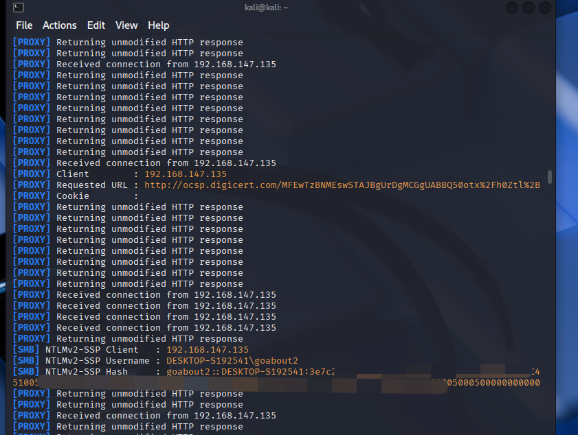

# 【原作者复现通告】Windows 截图工具 NTLM 信息泄露漏洞(CVE-2026-33829)安全风险通告

> 编号角色校订（2026-10-04）：按归档技术正文区分主讨论编号与背景引用，更新 `primary_identifiers` / `referenced_identifiers` 及旧字段角色。旧编号原值、状态与正文保持原样，变更前字段逐字保存在 `previous_*`；后文旧的角色待核说明应按当前字段阅读。这里的角色判读不等于官方分配核验或漏洞复现。

<!-- vulwiki-editorial-rebuild:system-misc -->
## 条目范围与校订

- 本文对象：Windows ms-screensketch / CVE-2026-33829
- 文献类型：技术文章（细分类待核）
- 版本、权限及部署边界：用户交互条件有写，应与协议处理器实际安装/注册、SMB出口和NTLM策略一并前置；泄露的是Net-NTLM挑战响应而非可直接Pass-the-Hash使用的NT密码哈希，后续需破解或可中继目标条件；普通桌面截图工具叙述与包含ServerCore/Server2012的大平台列表需核对MSRC组件映射，OS补丁范围不证明每台均有可触发URI处理器
- 核验状态：仅重建文本校订；未执行文中代码、PoC 或扫描，未把截图或转载声明记为本站复现

### 具体结论与待核项

以下为原归档的逐项勘误与证据缺口；可由文本确定的问题已在下文订正，仍缺来源的事实保持待核。

1. 用户交互条件有写，应与协议处理器实际安装/注册、SMB出口和NTLM策略一并前置
2. 泄露的是Net-NTLM挑战响应而非可直接Pass-the-Hash使用的NT密码哈希，后续需破解或可中继目标条件
3. 普通桌面截图工具叙述与包含ServerCore/Server2012的大平台列表需核对MSRC组件映射，OS补丁范围不证明每台均有可触发URI处理器
4. 具体构建矩阵和MSRC链接有用但Server2025/Win11各分支不可串比较，需官方核验
5. 千万级无测量口径，已复现仅截图未给链接/过程
6. 修补操作泛化WindowsUpdate，若修复涉及Store应用需明确区别，原文未阐明
7. 历史未在野状态不应当当前结论，广告可去

### 操作风险

原文技术操作的实际副作用未复现核验；按其请求/代码评估状态变更、凭据暴露和业务影响

技术请求、代码与实验方法按原文保留；其中的破坏性动作仅限授权、可恢复的隔离环境。缺失代码、参数或版本事实不猜补。

### 来源追溯

- 原始披露 URL 未确认；既有归档来源标签保留，不能替代原始公告

### 归档技术正文

 奇安信 CERT   2026-04-16 08:48  
  
●   
点击↑蓝字关注我们，获取更多安全风险通告  
  
<table><tbody><tr style="-webkit-tap-highlight-color: transparent;margin: 0px;padding: 0px;outline: 0px;max-width: 100%;box-sizing: border-box !important;overflow-wrap: break-word !important;visibility: visible;"><td colspan="4" data-colwidth="136,157,169,95" valign="middle" align="center" style="-webkit-tap-highlight-color: transparent;margin: 0px;padding: 5px 10px;outline: 0px;overflow-wrap: break-word !important;word-break: break-all;hyphens: auto;border: 1px solid rgb(70, 118, 217);max-width: 100%;box-sizing: border-box !important;background-color: rgb(70, 118, 217);visibility: visible;">
<strong style="-webkit-tap-highlight-color: transparent;margin: 0px;padding: 0px;outline: 0px;max-width: 100%;box-sizing: border-box !important;overflow-wrap: break-word !important;visibility: visible;">漏洞概述</strong> 
</td></tr><tr style="-webkit-tap-highlight-color: transparent;margin: 0px;padding: 0px;outline: 0px;max-width: 100%;box-sizing: border-box !important;overflow-wrap: break-word !important;visibility: visible;"><td data-colwidth="136" width="136" valign="middle" align="left" style="-webkit-tap-highlight-color: transparent;margin: 0px;padding: 5px 10px;outline: 0px;overflow-wrap: break-word !important;word-break: break-all;hyphens: auto;border: 1px solid rgb(70, 118, 217);max-width: 100%;box-sizing: border-box !important;visibility: visible;">
<strong style="-webkit-tap-highlight-color: transparent;margin: 0px;padding: 0px;outline: 0px;max-width: 100%;box-sizing: border-box !important;overflow-wrap: break-word !important;visibility: visible;">漏洞名称</strong>
</td><td colspan="3" data-colwidth="157,169,95" valign="middle" align="left" style="-webkit-tap-highlight-color: transparent;margin: 0px;padding: 5px 10px;outline: 0px;overflow-wrap: break-word !important;word-break: break-all;hyphens: auto;border: 1px solid rgb(70, 118, 217);max-width: 100%;box-sizing: border-box !important;visibility: visible;">
Windows 截图工具 NTLM 信息泄露漏洞
</td></tr><tr style="-webkit-tap-highlight-color: transparent;margin: 0px;padding: 0px;outline: 0px;max-width: 100%;box-sizing: border-box !important;overflow-wrap: break-word !important;visibility: visible;"><td data-colwidth="136" width="136" valign="middle" align="left" style="-webkit-tap-highlight-color: transparent;margin: 0px;padding: 5px 10px;outline: 0px;overflow-wrap: break-word !important;word-break: break-all;hyphens: auto;border: 1px solid rgb(70, 118, 217);max-width: 100%;box-sizing: border-box !important;visibility: visible;">
<strong style="-webkit-tap-highlight-color: transparent;margin: 0px;padding: 0px;outline: 0px;max-width: 100%;box-sizing: border-box !important;overflow-wrap: break-word !important;visibility: visible;">漏洞编号</strong>
</td><td colspan="3" data-colwidth="157,169,95" valign="middle" align="left" style="-webkit-tap-highlight-color: transparent;margin: 0px;padding: 5px 10px;outline: 0px;overflow-wrap: break-word !important;word-break: break-all;hyphens: auto;border: 1px solid rgb(70, 118, 217);max-width: 100%;box-sizing: border-box !important;visibility: visible;">
QVD-2026-20364,CVE-2026-33829
</td></tr><tr style="-webkit-tap-highlight-color: transparent;margin: 0px;padding: 0px;outline: 0px;max-width: 100%;box-sizing: border-box !important;overflow-wrap: break-word !important;visibility: visible;"><td data-colwidth="136" width="136" valign="middle" align="left" style="-webkit-tap-highlight-color: transparent;margin: 0px;padding: 5px 10px;outline: 0px;overflow-wrap: break-word !important;word-break: break-all;hyphens: auto;border: 1px solid rgb(70, 118, 217);max-width: 100%;box-sizing: border-box !important;visibility: visible;">
<strong style="-webkit-tap-highlight-color: transparent;margin: 0px;padding: 0px;outline: 0px;max-width: 100%;box-sizing: border-box !important;overflow-wrap: break-word !important;visibility: visible;">公开时间</strong>
</td><td data-colwidth="157" width="157" valign="middle" align="left" style="-webkit-tap-highlight-color: transparent;margin: 0px;padding: 5px 10px;outline: 0px;overflow-wrap: break-word !important;word-break: break-all;hyphens: auto;border: 1px solid rgb(70, 118, 217);max-width: 100%;box-sizing: border-box !important;visibility: visible;">
2026-04-14
</td><td data-colwidth="169" width="169" valign="middle" align="left" style="-webkit-tap-highlight-color: transparent;margin: 0px;padding: 5px 10px;outline: 0px;overflow-wrap: break-word !important;word-break: break-all;hyphens: auto;border: 1px solid rgb(70, 118, 217);max-width: 100%;box-sizing: border-box !important;visibility: visible;">
<strong style="-webkit-tap-highlight-color: transparent;margin: 0px;padding: 0px;outline: 0px;max-width: 100%;box-sizing: border-box !important;overflow-wrap: break-word !important;visibility: visible;">影响量级</strong>
</td><td data-colwidth="95" width="95" valign="middle" align="left" style="-webkit-tap-highlight-color: transparent;margin: 0px;padding: 5px 10px;outline: 0px;overflow-wrap: break-word !important;word-break: break-all;hyphens: auto;border: 1px solid rgb(70, 118, 217);max-width: 100%;box-sizing: border-box !important;line-height: 1em;visibility: visible;letter-spacing: 0.544px;">
千万级
</td></tr><tr style="-webkit-tap-highlight-color: transparent;margin: 0px;padding: 0px;outline: 0px;max-width: 100%;box-sizing: border-box !important;overflow-wrap: break-word !important;visibility: visible;"><td data-colwidth="136" width="136" valign="middle" align="left" style="-webkit-tap-highlight-color: transparent;margin: 0px;padding: 5px 10px;outline: 0px;overflow-wrap: break-word !important;word-break: break-all;hyphens: auto;border: 1px solid rgb(70, 118, 217);max-width: 100%;box-sizing: border-box !important;visibility: visible;">
<strong style="-webkit-tap-highlight-color: transparent;margin: 0px;padding: 0px;outline: 0px;max-width: 100%;box-sizing: border-box !important;overflow-wrap: break-word !important;visibility: visible;">奇安信评级</strong>
</td><td data-colwidth="157" width="157" valign="middle" align="left" style="-webkit-tap-highlight-color: transparent;margin: 0px;padding: 5px 10px;outline: 0px;overflow-wrap: break-word !important;word-break: break-all;hyphens: auto;border: 1px solid rgb(70, 118, 217);max-width: 100%;box-sizing: border-box !important;visibility: visible;">
<strong style="-webkit-tap-highlight-color: transparent;margin: 0px;padding: 0px;outline: none 0px !important;box-sizing: border-box !important;overflow-wrap: break-word !important;cursor: text;color: rgb(0, 0, 0);caret-color: rgb(255, 0, 0);font-family: 微软雅黑, &#34;Microsoft YaHei&#34;, sans-serif;visibility: visible;max-width: 100%;max-inline-size: 100%;">中危</strong>
</td><td data-colwidth="169" width="169" valign="middle" align="left" style="-webkit-tap-highlight-color: transparent;margin: 0px;padding: 5px 10px;outline: 0px;overflow-wrap: break-word !important;word-break: break-all;hyphens: auto;border: 1px solid rgb(70, 118, 217);max-width: 100%;box-sizing: border-box !important;visibility: visible;">
<strong style="-webkit-tap-highlight-color: transparent;margin: 0px;padding: 0px;outline: 0px;max-width: 100%;box-sizing: border-box !important;overflow-wrap: break-word !important;visibility: visible;"><strong style="-webkit-tap-highlight-color: transparent;margin: 0px;padding: 0px;outline: none 0px !important;box-sizing: border-box !important;overflow-wrap: break-word !important;cursor: text;color: rgb(0, 0, 0);caret-color: rgb(255, 0, 0);font-family: 微软雅黑, &#34;Microsoft YaHei&#34;, sans-serif;visibility: visible;max-width: 100%;max-inline-size: 100%;">CVSS 3.1分数</strong></strong>
</td><td data-colwidth="95" width="95" valign="middle" align="left" style="-webkit-tap-highlight-color: transparent;margin: 0px;padding: 5px 10px;outline: 0px;overflow-wrap: break-word !important;word-break: break-all;hyphens: auto;border: 1px solid rgb(70, 118, 217);max-width: 100%;box-sizing: border-box !important;visibility: visible;">
<strong style="-webkit-tap-highlight-color: transparent;margin: 0px;padding: 0px;outline: 0px;max-width: 100%;box-sizing: border-box !important;overflow-wrap: break-word !important;visibility: visible;">4.3</strong>
</td></tr><tr style="-webkit-tap-highlight-color: transparent;margin: 0px;padding: 0px;outline: 0px;max-width: 100%;box-sizing: border-box !important;overflow-wrap: break-word !important;visibility: visible;"><td data-colwidth="136" width="136" valign="middle" align="left" style="-webkit-tap-highlight-color: transparent;margin: 0px;padding: 5px 10px;outline: 0px;overflow-wrap: break-word !important;word-break: break-all;hyphens: auto;border: 1px solid rgb(70, 118, 217);max-width: 100%;box-sizing: border-box !important;visibility: visible;">
<strong style="-webkit-tap-highlight-color: transparent;margin: 0px;padding: 0px;outline: 0px;max-width: 100%;box-sizing: border-box !important;overflow-wrap: break-word !important;visibility: visible;">威胁类型</strong>
</td><td data-colwidth="157" width="157" valign="middle" align="left" style="-webkit-tap-highlight-color: transparent;margin: 0px;padding: 5px 10px;outline: 0px;overflow-wrap: break-word !important;word-break: break-all;hyphens: auto;border: 1px solid rgb(70, 118, 217);max-width: 100%;box-sizing: border-box !important;visibility: visible;">
信息泄露
</td><td data-colwidth="169" width="169" valign="middle" align="left" style="-webkit-tap-highlight-color: transparent;margin: 0px;padding: 5px 10px;outline: 0px;overflow-wrap: break-word !important;word-break: break-all;hyphens: auto;border: 1px solid rgb(70, 118, 217);max-width: 100%;box-sizing: border-box !important;visibility: visible;">
<strong style="-webkit-tap-highlight-color: transparent;margin: 0px;padding: 0px;outline: 0px;max-width: 100%;box-sizing: border-box !important;overflow-wrap: break-word !important;visibility: visible;">利用可能性</strong>
</td><td data-colwidth="95" width="95" valign="middle" align="left" style="-webkit-tap-highlight-color: transparent;margin: 0px;padding: 5px 10px;outline: 0px;overflow-wrap: break-word !important;word-break: break-all;hyphens: auto;border: 1px solid rgb(70, 118, 217);max-width: 100%;box-sizing: border-box !important;visibility: visible;">
<strong style="-webkit-tap-highlight-color: transparent;margin: 0px;padding: 0px;outline: 0px;max-width: 100%;box-sizing: border-box !important;overflow-wrap: break-word !important;visibility: visible;">高</strong>
</td></tr><tr style="-webkit-tap-highlight-color: transparent;margin: 0px;padding: 0px;outline: 0px;max-width: 100%;box-sizing: border-box !important;overflow-wrap: break-word !important;visibility: visible;"><td data-colwidth="136" width="136" valign="middle" align="left" style="-webkit-tap-highlight-color: transparent;margin: 0px;padding: 5px 10px;outline: 0px;overflow-wrap: break-word !important;word-break: break-all;hyphens: auto;border: 1px solid rgb(70, 118, 217);max-width: 100%;box-sizing: border-box !important;visibility: visible;">
<strong style="-webkit-tap-highlight-color: transparent;margin: 0px;padding: 0px;outline: 0px;max-width: 100%;box-sizing: border-box !important;overflow-wrap: break-word !important;visibility: visible;">POC状态</strong>
</td><td data-colwidth="157" width="157" valign="middle" align="left" style="-webkit-tap-highlight-color: transparent;margin: 0px;padding: 5px 10px;outline: 0px;overflow-wrap: break-word !important;word-break: break-all;hyphens: auto;border: 1px solid rgb(70, 118, 217);max-width: 100%;box-sizing: border-box !important;visibility: visible;">
<strong style="-webkit-tap-highlight-color: transparent;margin: 0px;padding: 0px;outline: 0px;max-width: 100%;box-sizing: border-box !important;overflow-wrap: break-word !important;letter-spacing: 0.544px;font-family: system-ui, -apple-system, BlinkMacSystemFont, &#34;Helvetica Neue&#34;, &#34;PingFang SC&#34;, &#34;Hiragino Sans GB&#34;, &#34;Microsoft YaHei UI&#34;, &#34;Microsoft YaHei&#34;, Arial, sans-serif;visibility: visible;">已公开</strong>
</td><td data-colwidth="169" width="169" valign="middle" align="left" style="-webkit-tap-highlight-color: transparent;margin: 0px;padding: 5px 10px;outline: 0px;overflow-wrap: break-word !important;word-break: break-all;hyphens: auto;border: 1px solid rgb(70, 118, 217);max-width: 100%;box-sizing: border-box !important;visibility: visible;">
<strong style="-webkit-tap-highlight-color: transparent;margin: 0px;padding: 0px;outline: 0px;max-width: 100%;box-sizing: border-box !important;overflow-wrap: break-word !important;visibility: visible;">在野利用状态</strong>
</td><td data-colwidth="95" width="95" valign="middle" align="left" style="-webkit-tap-highlight-color: transparent;margin: 0px;padding: 5px 10px;outline: 0px;overflow-wrap: break-word !important;word-break: break-all;hyphens: auto;border: 1px solid rgb(70, 118, 217);max-width: 100%;box-sizing: border-box !important;line-height: 1em;visibility: visible;letter-spacing: 0.544px;font-family: system-ui, -apple-system, BlinkMacSystemFont, &#34;Helvetica Neue&#34;, &#34;PingFang SC&#34;, &#34;Hiragino Sans GB&#34;, &#34;Microsoft YaHei UI&#34;, &#34;Microsoft YaHei&#34;, Arial, sans-serif;background-color: rgb(255, 255, 255);">
<strong style="-webkit-tap-highlight-color: transparent;margin: 0px;padding: 0px;outline: 0px;max-width: 100%;box-sizing: border-box !important;overflow-wrap: break-word !important;font-family: system-ui, -apple-system, BlinkMacSystemFont, &#34;Helvetica Neue&#34;, &#34;PingFang SC&#34;, &#34;Hiragino Sans GB&#34;, &#34;Microsoft YaHei UI&#34;, &#34;Microsoft YaHei&#34;, Arial, sans-serif;letter-spacing: 0.544px;visibility: visible;">未发现</strong>
</td></tr><tr style="-webkit-tap-highlight-color: transparent;margin: 0px;padding: 0px;outline: 0px;max-width: 100%;box-sizing: border-box !important;overflow-wrap: break-word !important;visibility: visible;"><td data-colwidth="136" width="136" valign="middle" align="left" style="-webkit-tap-highlight-color: transparent;margin: 0px;padding: 5px 10px;outline: 0px;overflow-wrap: break-word !important;word-break: break-all;hyphens: auto;border: 1px solid rgb(70, 118, 217);max-width: 100%;box-sizing: border-box !important;visibility: visible;">
<strong style="-webkit-tap-highlight-color: transparent;margin: 0px;padding: 0px;outline: 0px;max-width: 100%;box-sizing: border-box !important;overflow-wrap: break-word !important;visibility: visible;">EXP状态</strong>
</td><td data-colwidth="157" width="157" valign="middle" align="left" style="-webkit-tap-highlight-color: transparent;margin: 0px;padding: 5px 10px;outline: 0px;overflow-wrap: break-word !important;word-break: break-all;hyphens: auto;border: 1px solid rgb(70, 118, 217);max-width: 100%;box-sizing: border-box !important;line-height: 1em;visibility: visible;letter-spacing: 0.544px;">
<strong style="-webkit-tap-highlight-color: transparent;margin: 0px;padding: 0px;outline: 0px;max-width: 100%;box-sizing: border-box !important;overflow-wrap: break-word !important;letter-spacing: 0.544px;font-family: system-ui, -apple-system, BlinkMacSystemFont, &#34;Helvetica Neue&#34;, &#34;PingFang SC&#34;, &#34;Hiragino Sans GB&#34;, &#34;Microsoft YaHei UI&#34;, &#34;Microsoft YaHei&#34;, Arial, sans-serif;visibility: visible;">已公开</strong>
</td><td data-colwidth="169" width="169" valign="middle" align="left" style="-webkit-tap-highlight-color: transparent;margin: 0px;padding: 5px 10px;outline: 0px;overflow-wrap: break-word !important;word-break: break-all;hyphens: auto;border: 1px solid rgb(70, 118, 217);max-width: 100%;box-sizing: border-box !important;visibility: visible;">
<strong style="-webkit-tap-highlight-color: transparent;margin: 0px;padding: 0px;outline: 0px;max-width: 100%;box-sizing: border-box !important;overflow-wrap: break-word !important;visibility: visible;">技术细节状态</strong>
</td><td data-colwidth="95" width="95" valign="middle" align="left" style="-webkit-tap-highlight-color: transparent;margin: 0px;padding: 5px 10px;outline: 0px;overflow-wrap: break-word !important;word-break: break-all;hyphens: auto;border: 1px solid rgb(70, 118, 217);max-width: 100%;box-sizing: border-box !important;visibility: visible;">
<strong style="-webkit-tap-highlight-color: transparent;margin: 0px;padding: 0px;outline: 0px;max-width: 100%;box-sizing: border-box !important;overflow-wrap: break-word !important;font-family: system-ui, -apple-system, BlinkMacSystemFont, &#34;Helvetica Neue&#34;, &#34;PingFang SC&#34;, &#34;Hiragino Sans GB&#34;, &#34;Microsoft YaHei UI&#34;, &#34;Microsoft YaHei&#34;, Arial, sans-serif;letter-spacing: 0.544px;visibility: visible;">已公开</strong>
</td></tr><tr style="-webkit-tap-highlight-color: transparent;margin: 0px;padding: 0px;outline: 0px;max-width: 100%;box-sizing: border-box !important;overflow-wrap: break-word !important;visibility: visible;"><td colspan="4" data-colwidth="136,157,169,95" valign="middle" align="left" style="-webkit-tap-highlight-color: transparent;margin: 0px;padding: 5px 10px;outline: 0px;overflow-wrap: break-word !important;word-break: break-all;hyphens: auto;border: 1px solid rgb(70, 118, 217);max-width: 100%;box-sizing: border-box !important;visibility: visible;">
<strong style="-webkit-tap-highlight-color: transparent;margin: 0px;padding: 0px;outline: 0px;max-width: 100%;box-sizing: border-box !important;overflow-wrap: break-word !important;font-size: 13px;letter-spacing: 0.544px;visibility: visible;">危害描述：</strong>攻击者通过构造恶意链接，触发工具自动连接受控 SMB 服务器，窃取当前用户的 Net-NTLM 认证挑战响应（非 NT 密码哈希），导致用户身份凭据泄露。后续风险取决于离线破解或 NTLM 中继所需条件；捕获挑战响应本身不等于获得可直接 Pass-the-Hash 使用的 NT 密码哈希，也不等于已取得横向访问权限。
</td></tr></tbody></table>  
  
  
**0****1**  
  
**漏洞详情**  
  
**>**  
**>**  
**>**  
**>**  
  
**影响组件**  
  
Windows Snipping Tool 是微软官方内置的轻量级截图编辑工具，广泛预装于 Windows 10、Windows 11 等桌面系统，支持区域截图、窗口截图、延时截图、标注编辑与快速分享，通过 URI 协议实现外部调用与文件关联，是日常办公、文档处理、问题反馈的高频使用工具，几乎覆盖所有 Windows 桌面环境。  
  
**>**  
**>**  
**>**  
**>**  
  
**漏洞描述**  
  
近日，奇安信CERT监测到官方修复  
Windows 截图工具 NTLM 信息泄露漏洞(CVE-2026-33829)，该漏洞源于工具对 ms-screensketch 协议的 filePath 参数缺乏严格输入校验，攻击者可构造恶意 SMB 远程路径，诱使工具发起跨网络身份认证。攻击者通过构造恶意链接，触发工具自动连接受控 SMB 服务器，窃取当前用户的 Net-NTLM 认证挑战响应（非 NT 密码哈希），导致用户身份凭据泄露。后续风险取决于离线破解或 NTLM 中继所需条件；捕获挑战响应本身不等于获得可直接 Pass-the-Hash 使用的 NT 密码哈希，也不等于已取得横向访问权限。  
目前该漏洞PoC和技术细节已公开。  
虽然该漏洞评分仅为4.3，但作为内网渗透的跳板价值极高，建议客户尽快做好自查及防护。  
  
**>**  
**>**  
**>**  
**>**  
  
**利用条件**  
  
需要用户交互。  
  
  
  
**02**  
  
**影响范围**  
  
**>**  
**>**  
**>**  
**>**  
  
**影响版本**  
  
Windows Server 2012 R2 (Server Core installation) < 6.3.9600.23132  
  
Windows Server 2012 R2 < 6.3.9600.23132  
  
Windows Server 2012 (Server Core installation) < 6.2.9200.26026  
  
Windows Server 2012 < 6.2.9200.26026  
  
Windows Server 2016 (Server Core installation) < 10.0.14393.9060  
  
Windows Server 2016 < 10.0.14393.9060  
  
Windows 10 Version 1607 for x64-based Systems < 10.0.14393.9060  
  
Windows 10 Version 22H2 for 32-bit Systems < 10.0.19045.7184  
  
Windows 10 Version 22H2 for ARM64-based Systems < 10.0.19045.7184  
  
Windows 10 Version 22H2 for x64-based Systems < 10.0.19045.7184  
  
Windows 10 Version 21H2 for x64-based Systems < 10.0.19044.7184  
  
Windows 10 Version 21H2 for ARM64-based Systems < 10.0.19044.7184  
  
Windows 10 Version 21H2 for 32-bit Systems < 10.0.19044.7184  
  
Windows Server 2022 (Server Core installation) < 10.0.20348.5020  
  
Windows Server 2022 < 10.0.20348.5020  
  
Windows 10 Version 1607 for 32-bit Systems < 10.0.14393.9060  
  
Windows 11 Version 26H1 for ARM64-based Systems < 10.0.28000.1836  
  
Windows 11 version 26H1 for x64-based Systems < 10.0.28000.1836  
  
Windows Server 2025 < 10.0.26100.32690  
  
Windows 11 Version 24H2 for x64-based Systems < 10.0.26100.8246  
  
Windows 11 Version 24H2 for ARM64-based Systems < 10.0.26100.8246  
  
Windows Server 2022, 23H2 Edition (Server Core installation) < 10.0.25398.2274  
  
Windows 11 Version 23H2 for x64-based Systems < 10.0.22631.6936  
  
Windows 11 Version 23H2 for ARM64-based Systems < 10.0.22631.6936  
  
Windows 11 Version 25H2 for x64-based Systems < 10.0.26200.8246  
  
Windows 11 Version 25H2 for ARM systems < 10.0.26200.8246  
  
Windows Server 2025 (Server Core installation) < 10.0.26100.32690  
  
Windows Server 2019 (Server Core installation) < 10.0.17763.8644  
  
Windows Server 2019 < 10.0.17763.8644  
  
Windows 10 Version 1809 for x64-based Systems < 10.0.17763.8644  
  
Windows 10 Version 1809 for 32-bit Systems < 10.0.17763.8644  
  
**>**  
**>**  
**>**  
**>**  
  
**其他受影响组件**  
  
无  
  
  
**03**  
  
**复现情况**  
  
目前，奇安信威胁情报中心安全研究员已成功复现  
Windows 截图工具 NTLM 信息泄露漏洞(CVE-2026-33829)  
，截图如下：  
  
  
  
  
  
**04**  
  
**处置建议**  
  
**>**  
**>**  
**>**  
**>**  
  
**安全更新**  
  
**使用奇安信天擎的客户可以通过奇安信天擎控制台一键更新修补相关漏洞，也可以通过奇安信天擎客户端一键更新修补相关漏洞。**  
  
  
也可以采用以下官方解决方案及缓解方案来防护此漏洞：  
  
  
**Windows自动更新**  
  
Windows系统默认启用 Microsoft Update，当检测到可用更新时，将会自动下载更新并在下一次启动时安装。还可通过以下步骤快速安装更新：  
  
1、点击“开始菜单”或按Windows快捷键，点击进入“设置”  
  
2、选择“更新和安全”，进入“Windows更新”（Windows Server 2012以及Windows Server 2012 R2可通过控制面板进入“Windows更新”，步骤为“控制面板”-> “系统和安全”->“Windows更新”）  
  
3、选择“检查更新”，等待系统将自动检查并下载可用更新  
  
4、重启计算机，安装更新  
  
  
系统重新启动后，可通过进入“Windows更新”->“查看更新历史记录”查看是否成功安装了更新。对于没有成功安装的更新，可以点击该更新名称进入微软官方更新描述链接，点击最新的SSU名称并在新链接中点击“Microsoft 更新目录”，然后在新链接中选择适用于目标系统的补丁进行下载并安装。  
  
  
**手动安装补丁**  
  
另外，对于不能自动更新的系统版本，可参考以下链接下载适用于该系统的补丁并安装：  
  
https://msrc.microsoft.com/update-guide/vulnerability/CVE-2026-33829  
  
**>**  
**>**  
**>**  
**>**  
  
**产品解决方案**  
  
**奇安信天擎终端安全管理系统解决方案**  
  
奇安信天擎终端安全管理系统并且有漏洞修复相关模块的用户，可以将补丁库版本更新到：  
2026.4.15.1  
及以上版本，对内网终端进行补丁更新。  
  
推荐采用自动化运维方案，如果控制中心可以连接互联网的用户场景，建议设置为自动从奇安信云端更新补丁库至  
2026.4.15.1  
版本。  
  
控制中心补丁库更新方式：每天04:00-06:00自动升级，升级源为从互联网升级。  
  
纯隔离网内控制中心不能访问互联网，不能下载补丁库和补丁文件，需使用离线升级工具定期导入补丁库和文件到控制中心。  
  
  
**05**  
  
**参考资料**  
  
[1]https://msrc.microsoft.com/update-guide/vulnerability/CVE-2026-33829  
  
  
  
**06**  
  
**时间线**  
  
2026年04月16日，奇安信 CERT发布安全风险通告。  
  
  
  
**07**  
  
**漏洞情报服务**  
  
奇安信ALPH  
A  
威胁分析平台已支持漏洞情报订阅服务：  
  
  
  
  
  
  
  
  
  
  
**奇安信 CERT**  
  
**致力于**  
第一时间为企业级用户提供**权威**  
漏洞情报和**有效**  
解决方案。  
  
  
  
点击↓**阅读原文**  
，到**ALPHA威胁分析平台**  
订阅更多漏洞信息。  
  

---

> 来源：gelusus/wxvl（微信公众号漏洞文章自动归档，原始披露 URL 尚未确认，现有链接按来源追溯区分别标注）
