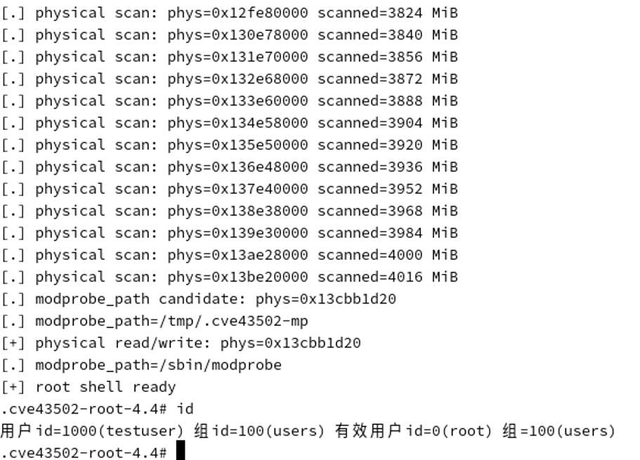

# 【原作者复现通告】从 Zerocopy 到 Root：Linux RDS 本地提权漏洞 ZcopyReaperCVE-2026

> 编号角色校订（2026-10-04）：按归档技术正文区分主讨论编号与背景引用，更新 `primary_identifiers` / `referenced_identifiers` 及旧字段角色。旧编号原值、状态与正文保持原样，变更前字段逐字保存在 `previous_*`；后文旧的角色待核说明应按当前字段阅读。这里的角色判读不等于官方分配核验或漏洞复现。

<!-- vulwiki-editorial-rebuild:system-misc -->
## 条目范围与校订

- 本文对象：Linux RDS CVE-2026-43502 ZcopyReaper
- 文献类型：技术文章（细分类待核）
- 版本、权限及部署边界：本地低权+RDS启用+能AF_RDS/MSG_ZEROCOPY前提明确，页所有权/notifier修复解释与给diff连贯；多稳定支分支范围和引入/修复commit、官方CVE/发行版源充分，是高价值补丁分析
- 核验状态：仅重建文本校订；未执行文中代码、PoC 或扫描，未把截图或转载声明记为本站复现

### 具体结论与待核项

以下为原归档的逐项勘误与证据缺口；可由文本确定的问题已在下文订正，仍缺来源的事实保持待核。

1. 本地低权+RDS启用+能AF_RDS/MSG_ZEROCOPY前提明确，页所有权/notifier修复解释与给diff连贯
2. 多稳定支分支范围和引入/修复commit、官方CVE/发行版源充分，是高价值补丁分析
3. 主线4.17至7.1rc2广泛描述需不覆盖已回移稳定版，应用发行版包状态核
4. openSUSE实测没给release/kernel config/build，modprobe_path/setuid链依赖架构/竞态/模块策略与mount选项，不能任意发行版可复现
5. 源码diff未含后部put_page分支但叙述有说明需补
6. 最终EXP/请求harness只截图，公开状态无PoC直链
7. 清营销保留代码和来源

### 操作风险

主线4.17至7.1rc2广泛描述需不覆盖已回移稳定版，应用发行版包状态核

技术请求、代码与实验方法按原文保留；其中的破坏性动作仅限授权、可恢复的隔离环境。缺失代码、参数或版本事实不猜补。

### 来源追溯

- 原始披露 URL 未确认；既有归档来源标签保留，不能替代原始公告

### 归档技术正文

原创 360漏洞研究院
                    360漏洞研究院  360漏洞研究院   2026-09-10 02:31  
  
Linux 内核 RDS zerocopy 发送路径存在本地权限提升漏洞（CVE-2026-43502）。本地攻击者可利用 RDS 零拷贝发送失败后的消息清理缺陷，导致已固定用户页面的引用及生命周期管理异常，并进一步造成内核内存状态破坏。在满足特定利用条件时，该漏洞可能被用于实现本地权限提升。  
  
  
**利用前置条件：**  
- 攻击者能够在目标系统本地执行低权限代码  
  
- 目标内核启用了受影响的 RDS 网络协议功能  
  
- 攻击者能够创建并使用 AF_RDS 套接字触发 zerocopy 发送路径  
  
目前 **360漏洞挖掘智能体已成功复现该漏洞**  
。本文包含完整影响范围、修复方案、技术原理与复现细节，建议用户立即升级。  
  
  
<table><tbody><tr style="box-sizing: border-box;"><td colspan="4" data-colwidth="100.0000%" width="100.0000%" style="border-width: 1px;border-color: rgb(100, 130, 228);border-style: solid;background-color: rgb(100, 130, 228);box-sizing: border-box;padding: 0px;"><section style="text-align: center;color: rgb(255, 255, 255);box-sizing: border-box;"><p style="margin: 0px;padding: 0px;box-sizing: border-box;"><strong style="box-sizing: border-box;"><span leaf="">漏洞概述</span></strong></p></section></td></tr><tr style="box-sizing: border-box;"><td data-colwidth="24.0000%" width="24.0000%" style="border-width: 1px;border-color: rgb(100, 130, 228);border-style: solid;box-sizing: border-box;padding: 0px;"><section style="font-size: 12px;color: rgb(0, 0, 0);padding: 0px 8px;box-sizing: border-box;"><p style="white-space: normal;margin: 0px;padding: 0px;box-sizing: border-box;"><strong style="box-sizing: border-box;"><span leaf="">漏洞名称</span></strong></p></section></td><td colspan="3" data-colwidth="76.0000%" width="76.0000%" style="border-width: 1px;border-color: rgb(100, 130, 228);border-style: solid;box-sizing: border-box;padding: 0px;"><section style="font-size: 12px;padding: 0px 8px;box-sizing: border-box;"><p style="white-space: normal;margin: 0px;padding: 0px;box-sizing: border-box;"><span leaf="">Linux 内核 RDS zerocopy 本地提权漏洞</span></p></section></td></tr><tr style="box-sizing: border-box;"><td data-colwidth="24.0000%" width="24.0000%" style="border-width: 1px;border-color: rgb(100, 130, 228);border-style: solid;box-sizing: border-box;padding: 0px;"><section style="font-size: 12px;color: rgb(0, 0, 0);padding: 0px 8px;box-sizing: border-box;"><p style="white-space: normal;margin: 0px;padding: 0px;box-sizing: border-box;"><strong style="box-sizing: border-box;"><span leaf="">漏洞编号</span></strong></p></section></td><td colspan="3" data-colwidth="76.0000%" width="76.0000%" style="border-width: 1px;border-color: rgb(100, 130, 228);border-style: solid;box-sizing: border-box;padding: 0px;"><section style="font-size: 12px;padding: 0px 8px;box-sizing: border-box;"><p style="white-space: normal;margin: 0px;padding: 0px;box-sizing: border-box;"><span leaf="">CVE-2026-43502</span></p></section></td></tr><tr style="box-sizing: border-box;"><td data-colwidth="24.0000%" width="24.0000%" style="border-width: 1px;border-color: rgb(100, 130, 228);border-style: solid;box-sizing: border-box;padding: 0px;"><section style="font-size: 12px;color: rgb(0, 0, 0);padding: 0px 8px;box-sizing: border-box;"><p style="white-space: normal;margin: 0px;padding: 0px;box-sizing: border-box;"><strong style="box-sizing: border-box;"><span leaf="">公开时间</span></strong></p></section></td><td data-colwidth="28.0000%" width="28.0000%" style="border-width: 1px;border-color: rgb(100, 130, 228);border-style: solid;box-sizing: border-box;padding: 0px;"><section style="font-size: 12px;padding: 0px 8px;box-sizing: border-box;"><p style="white-space: normal;margin: 0px;padding: 0px;box-sizing: border-box;"><span leaf="">2026-05-21</span></p></section></td><td data-colwidth="28.0000%" width="28.0000%" style="border-width: 1px;border-color: rgb(100, 130, 228);border-style: solid;box-sizing: border-box;padding: 0px;"><section style="font-size: 12px;padding: 0px 8px;box-sizing: border-box;"><p style="white-space: normal;margin: 0px;padding: 0px;box-sizing: border-box;"><strong style="box-sizing: border-box;"><span style="color: rgb(0, 0, 0);box-sizing: border-box;"><span leaf="">POC状态</span></span></strong></p></section></td><td data-colwidth="20.0000%" width="20.0000%" style="border-width: 1px;border-color: rgb(100, 130, 228);border-style: solid;box-sizing: border-box;padding: 0px;"><section style="font-size: 12px;padding: 0px 8px;color: rgb(100, 130, 228);box-sizing: border-box;"><p style="white-space: normal;margin: 0px;padding: 0px;box-sizing: border-box;"><strong style="box-sizing: border-box;"><span leaf="">已公开</span></strong></p></section></td></tr><tr style="box-sizing: border-box;"><td data-colwidth="24.0000%" width="24.0000%" style="border-width: 1px;border-color: rgb(100, 130, 228);border-style: solid;box-sizing: border-box;padding: 0px;"><section style="font-size: 12px;color: rgb(0, 0, 0);padding: 0px 8px;box-sizing: border-box;"><p style="white-space: normal;margin: 0px;padding: 0px;box-sizing: border-box;"><strong style="box-sizing: border-box;"><span leaf="">漏洞类型</span></strong></p></section></td><td data-colwidth="28.0000%" width="28.0000%" style="border-width: 1px;border-color: rgb(100, 130, 228);border-style: solid;box-sizing: border-box;padding: 0px;"><section style="font-size: 12px;padding: 0px 8px;box-sizing: border-box;"><p style="white-space: normal;margin: 0px;padding: 0px;box-sizing: border-box;"><span leaf="">权限提升</span></p></section></td><td data-colwidth="28.0000%" width="28.0000%" style="border-width: 1px;border-color: rgb(100, 130, 228);border-style: solid;box-sizing: border-box;padding: 0px;"><section style="font-size: 12px;color: rgb(0, 0, 0);padding: 0px 8px;box-sizing: border-box;"><p style="white-space: normal;margin: 0px;padding: 0px;box-sizing: border-box;"><strong style="box-sizing: border-box;"><span leaf="">EXP状态</span></strong></p></section></td><td data-colwidth="20.0000%" width="20.0000%" style="border-width: 1px;border-color: rgb(100, 130, 228);border-style: solid;box-sizing: border-box;padding: 0px;"><section style="font-size: 12px;padding: 0px 8px;color: rgb(100, 130, 228);box-sizing: border-box;"><p style="white-space: normal;margin: 0px;padding: 0px;box-sizing: border-box;"><strong style="box-sizing: border-box;"><span leaf="">已公开</span></strong></p></section></td></tr><tr style="box-sizing: border-box;"><td data-colwidth="24.0000%" width="24.0000%" style="border-width: 1px;border-color: rgb(100, 130, 228);border-style: solid;box-sizing: border-box;padding: 0px;"><section style="font-size: 12px;padding: 0px 8px;box-sizing: border-box;"><p style="white-space: normal;margin: 0px;padding: 0px;box-sizing: border-box;"><strong style="box-sizing: border-box;"><span style="color: rgb(0, 0, 0);box-sizing: border-box;"><span leaf="">利用可能性</span></span></strong></p></section></td><td data-colwidth="28.0000%" width="28.0000%" style="border-width: 1px;border-color: rgb(100, 130, 228);border-style: solid;box-sizing: border-box;padding: 0px;"><section style="font-size: 12px;padding: 0px 8px;box-sizing: border-box;"><p style="white-space: normal;margin: 0px;padding: 0px;box-sizing: border-box;"><span leaf="">高</span></p></section></td><td data-colwidth="28.0000%" width="28.0000%" style="border-width: 1px;border-color: rgb(100, 130, 228);border-style: solid;box-sizing: border-box;padding: 0px;"><section style="font-size: 12px;padding: 0px 8px;color: rgb(0, 0, 0);box-sizing: border-box;"><p style="white-space: normal;margin: 0px;padding: 0px;box-sizing: border-box;"><strong style="box-sizing: border-box;"><span leaf="">技术细节状态</span></strong></p></section></td><td data-colwidth="20.0000%" width="20.0000%" style="border-width: 1px;border-color: rgb(100, 130, 228);border-style: solid;box-sizing: border-box;padding: 0px;"><section style="font-size: 12px;padding: 0px 8px;color: rgb(100, 130, 228);box-sizing: border-box;"><p style="white-space: normal;margin: 0px;padding: 0px;box-sizing: border-box;"><strong style="box-sizing: border-box;"><span leaf="">已公开</span></strong></p></section></td></tr><tr style="box-sizing: border-box;"><td data-colwidth="24.0000%" width="24.0000%" style="border-width: 1px;border-color: rgb(100, 130, 228);border-style: solid;box-sizing: border-box;padding: 0px;"><section style="font-size: 12px;color: rgb(0, 0, 0);padding: 0px 8px;box-sizing: border-box;"><p style="white-space: normal;margin: 0px;padding: 0px;box-sizing: border-box;"><strong style="box-sizing: border-box;"><span leaf="">CVSS 3.1</span></strong></p></section></td><td data-colwidth="28.0000%" width="28.0000%" style="border-width: 1px;border-color: rgb(100, 130, 228);border-style: solid;box-sizing: border-box;padding: 0px;"><section style="font-size: 12px;padding: 0px 8px;box-sizing: border-box;"><p style="white-space: normal;margin: 0px;padding: 0px;box-sizing: border-box;"><span leaf="">7.8</span></p></section></td><td data-colwidth="28.0000%" width="28.0000%" style="border-width: 1px;border-color: rgb(100, 130, 228);border-style: solid;box-sizing: border-box;padding: 0px;"><section style="font-size: 12px;color: rgb(0, 0, 0);padding: 0px 8px;box-sizing: border-box;"><p style="white-space: normal;margin: 0px;padding: 0px;box-sizing: border-box;"><strong style="box-sizing: border-box;"><span leaf="">在野利用状态</span></strong></p></section></td><td data-colwidth="20.0000%" width="20.0000%" style="border-width: 1px;border-color: rgb(100, 130, 228);border-style: solid;box-sizing: border-box;padding: 0px;"><section style="font-size: 12px;padding: 0px 8px;box-sizing: border-box;"><p style="white-space: normal;margin: 0px;padding: 0px;box-sizing: border-box;"><span leaf="">未发现</span></p></section></td></tr></tbody></table>  
  
  
**01**  
  
**漏洞影响范围**  
  
  
  
引入该漏洞的代码提交（commit）0cebaccef3acbdfbc2d85880a2efb765d2f4e2e3 首次合入 Linux 主线内核 4.17，此后该问题持续存在于后续内核版本中，修复随后被回移至多个稳定内核分支。已确认的受影响及修复范围如下：  
- 4.17 至 5.9 分支：包含该漏洞，相关分支目前已停止维护；  
  
- 5.10 分支：5.10.0 至 5.10.257 受影响，自 5.10.258 起修复；  
  
- 5.15 分支：5.15.0 至 5.15.208 受影响，自 5.15.209 起修复；  
  
- 6.1 分支：6.1.0 至 6.1.174 受影响，自 6.1.175 起修复；  
  
- 6.6 分支：6.6.0 至 6.6.139 受影响，自 6.6.140 起修复；  
  
- 6.12 分支：6.12.0 至 6.12.87 受影响，自 6.12.88 起修复；  
  
- 6.18 分支：6.18.0 至 6.18.29 受影响，自 6.18.30 起修复；  
  
- 7.0 分支：7.0.0 至 7.0.6 受影响，自 7.0.7 起修复；  
  
- 主线内核：自 Linux 4.17 起受影响，4.17 至 7.1-rc2 之间的主线版本均受到影响, 在 7.1-rc3 中通过提交 44b550d88b267320459d518c0743a241ab2108fa 修复。  
  
漏洞在发行版openSUSE Leap已实测确认。  
  
  
**02**  
  
**修复建议**  
  
  
  
**正式防护方案**  
  
官方修复commit 44b550d88b267320459d518c0743a241ab2108fa 已经发布，详情如下：  
```
diff --git a/net/rds/message.c b/net/rds/message.c
index eaa6f22601a44..25fedcb3cd00e 100644
--- a/net/rds/message.c
+++ b/net/rds/message.c
@@ -131,24 +131,34 @@ static void rds_rm_zerocopy_callback(struct rds_sock *rs,
  */
 static void rds_message_purge(struct rds_message *rm)
 {
+  struct rds_znotifier *znotifier;
   unsigned long i, flags;
-  bool zcopy = false;
+  bool zcopy;

   if (unlikely(test_bit(RDS_MSG_PAGEVEC, &rm->m_flags)))
     return;

   spin_lock_irqsave(&rm->m_rs_lock, flags);
+  znotifier = rm->data.op_mmp_znotifier;
+  rm->data.op_mmp_znotifier = NULL;
+  zcopy = !!znotifier;
+
   if (rm->m_rs) {
     struct rds_sock *rs = rm->m_rs;

-    if (rm->data.op_mmp_znotifier) {
-      zcopy = true;
-      rds_rm_zerocopy_callback(rs, rm->data.op_mmp_znotifier);
+    if (znotifier) {
+      rds_rm_zerocopy_callback(rs, znotifier);
       rds_wake_sk_sleep(rs);
-      rm->data.op_mmp_znotifier = NULL;
     }
     sock_put(rds_rs_to_sk(rs));
     rm->m_rs = NULL;
+  } else if (znotifier) {
+    /*
+     * Zerocopy can fail before the message is queued on the
+     * socket, so there is no rs to carry the notification.
+     */
+    mm_unaccount_pinned_pages(&znotifier->z_mmp);
+    kfree(rds_info_from_znotifier(znotifier));
   }
   spin_unlock_irqrestore(&rm->m_rs_lock, flags);
```  
  
在修复后，zerocopy 的判定由 op_mmp_znotifier 是否存在决定，而不再由消息是否已经挂接到 socket 决定。在 rds_message_purge() 中加锁后，先保存并清空 op_mmp_znotifier，并以 notifier 是否存在设置 zcopy 状态。对于已经挂接 socket 的 zerocopy 消息，继续通过原有的 rds_rm_zerocopy_callback() 完成通知和资源清理；对于尚未入队的 zerocopy 消息，则直接执行 mm_unaccount_pinned_pages() 并释放 notifier。随后根据 zcopy 状态释放 payload 页，zerocopy 页面通过 put_page() 释放引用，避免将用户固定页面错误地按普通 payload 页调用 __free_page() 释放。  
  
  
**03**  
  
**漏洞描述**  
  
  
  
漏洞位于Linux 内核 net/rds/message.c，RDS zerocopy 发送失败后的消息清理路径。当用户页已经被 pin，但消息尚未挂接到发送 socket 时，旧代码通过 rm->m_rs 推断 zerocopy 状态；未入队消息没有 socket 关联，因此可能按普通 payload 页执行清理。该路径会错误处理 pinned-page 记账、notifier 和 payload 页生命周期，造成页引用计数/内存管理状态破坏。官方修复中明确指出，zerocopy 所有权应由 op_mmp_znotifier 是否存在决定，而不能由消息是否已入队决定。  
  
  
漏洞由本地 AF_RDS SOCK_SEQPACKET socket 上的 MSG_ZEROCOPY 发送触发，在竞争成功后进一步建立可写 PTE 别名，扫描物理内存并修改 modprobe_path，最终创建 setuid root shell，可造成本地权限提升。  
  
  
**04**  
  
**漏洞复现**  
  
  
  
360漏洞研究院已成功复现 Linux 内核 RDS zerocopy 本地提权漏洞（CVE-2026-43502），实现本地权限提升。  
  
  
  
CVE-2026-43502  
  
Linux 内核 RDS zerocopy 本地提权漏洞复现  
  
  
**05**  
  
**时间线**  
  
  
  
2026年9月10日，360漏洞研究院发布本安全风险通告。  
  
  
**06**  
  
参考链接  
  
  
  
https://cve.org/CVERecord/?id=CVE-2026-43502  
  
https://kernel.googlesource.com/pub/scm/linux/kernel/git/lee/vulns/+/8beb79ceb379a1ab9382e7a5df407d169737416a/cve/published/2026/CVE-2026-43502.mbox  
  
https://git.kernel.org/pub/scm/linux/kernel/git/torvalds/linux.git/commit/?id=0cebaccef3acbdfbc2d85880a2efb765d2f4e2e3  
  
https://git.kernel.org/pub/scm/linux/kernel/git/torvalds/linux.git/commit/?id=44b550d88b267320459d518c0743a241ab2108fa  
  
https://git.kernel.org/stable/c/21d70744e6d3bbf9293aa1ee6fba7c53ad75275e  
  
https://git.kernel.org/stable/c/3abc8983b2bae3f487f77d9da5527d7d6b210d46  
  
https://git.kernel.org/stable/c/14ef6fd18db2494098b21e0471bf27a1d8e9993e  
  
https://git.kernel.org/stable/c/0f5c185fc79a59ee9991234dd6d2a3e5afa6e75b  
  
https://ubuntu.com/security/CVE-2026-43502  
  
https://security-tracker.debian.org/tracker/CVE-2026-43502  
  
https://www.suse.com/security/cve/CVE-2026-43502.html  
  
https://bugzilla.redhat.com/show_bug.cgi?id=2480456  
  
  
07  
  
更多漏洞情报  
  
  
  
“扫描下方二维码，进入公众号粉丝交流群。更多一手网安资讯、漏洞预警、技术干货和技术交流等您参与！”  
  
  
  
  
  
建议您订阅360数字安全-漏洞情报服务，获取更多漏洞情报详情以及处置建议，让您的企业远离漏洞威胁。  
  
  
邮箱：360VRI@360.cn  
  
网址：https://vi.loudongyun.360.net  
  
  
  
“洞”悉网络威胁，守护数字安全  
  
  
**关于我们**  
  
  
360 漏洞研究院，隶属于360数字安全集团。其成员常年入选谷歌、微软、华为等厂商的安全精英排行榜, 并获得谷歌、微软、苹果史上最高漏洞奖励。研究院是中国首个荣膺Pwnie Awards“史诗级成就奖”，并获得多个Pwnie Awards提名的组织。累计发现并协助修复谷歌、苹果、微软、华为、高通等全球顶级厂商CVE漏洞3000多个，收获诸多官方公开致谢。研究院也屡次受邀在BlackHat，Usenix Security，Defcon等极具影响力的工业安全峰会和顶级学术会议上分享研究成果，并多次斩获信创挑战赛、天府杯等顶级黑客大赛总冠军和单项冠军。研究院将凭借其在漏洞挖掘和安全攻防方面的强大技术实力，帮助各大企业厂商不断完善系统安全，为数字安全保驾护航，筑造数字时代的安全堡垒。  
  
  


---

> 来源：gelusus/wxvl（微信公众号漏洞文章自动归档，原始披露 URL 尚未确认，现有链接按来源追溯区分别标注）
