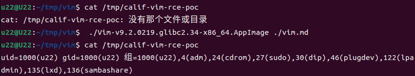

# 【原作者复现通告】漏洞通告  Vim 代码执行漏洞(CVE-2026-34714)

> 编号角色校订（2026-10-04）：按归档技术正文区分主讨论编号与背景引用，更新 `primary_identifiers` / `referenced_identifiers` 及旧字段角色。旧编号原值、状态与正文保持原样，变更前字段逐字保存在 `previous_*`；后文旧的角色待核说明应按当前字段阅读。这里的角色判读不等于官方分配核验或漏洞复现。

<!-- vulwiki-editorial-rebuild:system-misc -->
## 条目范围与校订

- 本文对象：Vim CVE-2026-34714 tabpanel/modeline沙箱
- 文献类型：技术文章（细分类待核）
- 版本、权限及部署边界：特制文件植modeline需受害者打开/加载且modeline/tab相关功能条件，正文两次说无需用户任何操作过度；<9.2.0272/首修和官方GHSA/精确tag明确，但需核引入范围/发行版回移；RCE为Vim用户权限不能一概完全控制OS
- 核验状态：仅重建文本校订；未执行文中代码、PoC 或扫描，未把截图或转载声明记为本站复现

### 具体结论与待核项

以下为原归档的逐项勘误与证据缺口；可由文本确定的问题已在下文订正，仍缺来源的事实保持待核。

1. 特制文件植modeline需受害者打开/加载且modeline/tab相关功能条件，正文两次说无需用户任何操作过度
2. P_MLE缺失/autocmd_add未校验链只一句，无代码/默认modelineexpr和实际触发步骤
3. <9.2.0272/首修和官方GHSA/精确tag明确，但需核引入范围/发行版回移
4. RCE为Vim用户权限不能一概完全控制OS
5. 复现只有截图，PoC已公开可补公告内直接引用
6. 与148 path/find另一CVE是独立漏洞勿合并，营销占大部分篇幅

### 操作风险

原文技术操作的实际副作用未复现核验；按其请求/代码评估状态变更、凭据暴露和业务影响

技术请求、代码与实验方法按原文保留；其中的破坏性动作仅限授权、可恢复的隔离环境。缺失代码、参数或版本事实不猜补。

### 来源追溯

- 原始披露 URL 未确认；既有归档来源标签保留，不能替代原始公告

### 归档技术正文

安全实验室
                    安全实验室  中成信息   2026-03-31 09:52  
  
  
  
**1**  
  
  
**漏洞描述**  
  
Vim 代码执行漏洞（CVE-2026-34714）是一个高危漏洞，存在于 Vim < 9.2.0272 版本中。漏洞源于tabpanel选项缺失P_MLE安全标志，攻击者可在特制文件中植入恶意配置，利用 autocmd_add() 未校验的缺陷绕过沙箱，实现无需用户交互的任意代码执行，从而可能获取系统控制权或导致敏感数据泄露。官方已发布修复补丁，强烈建议立即升级。  
  
2  
  
  
**影响范围**  
  
Vim < 9.2.0272  
  
   
  
3  
  
  
**漏洞详情**  
<table><tbody><tr><td colspan="4" data-colwidth="143,144,143,143"><section style="text-align: center;">漏洞详情</section></td></tr><tr><td data-colwidth="143"><section style="text-align: center;">漏洞名称</section></td><td colspan="3" data-colwidth="144,143,143"><section style="text-align: center;">Vim 代码执行漏洞</section></td></tr><tr><td data-colwidth="143"><section style="text-align: center;">漏洞编号</section></td><td colspan="3" data-colwidth="144,143,143"><section style="text-align: center;">CVE-2026-34714</section></td></tr><tr><td data-colwidth="143"><section style="text-align: center;">评级</section></td><td data-colwidth="144"><section style="text-align: center;">高危</section></td><td data-colwidth="143"><section style="text-align: center;">CVSS 3.1分数</section></td><td data-colwidth="143"><section style="text-align: center;">8.2</section></td></tr><tr><td data-colwidth="143"><section style="text-align: center;">威胁类型</section></td><td data-colwidth="144"><section style="text-align: center;">代码执行</section></td><td data-colwidth="143"><section style="text-align: center;">利用情况</section></td><td data-colwidth="143"><section style="text-align: center;">更可能被利用</section></td></tr><tr><td data-colwidth="143"><section style="text-align: center;">公开状态</section></td><td data-colwidth="144"><section style="text-align: center;">POC已公开</section></td><td data-colwidth="143"><section style="text-align: center;">在野利用</section></td><td data-colwidth="143"><section style="text-align: center;">未发现</section></td></tr><tr><td colspan="4" data-colwidth="143,144,143,143"><section>危害描述：攻击者无需用户操作即可执行任意代码，从而完全控制受影响系统并窃取敏感数据。</section></td></tr><tr><td colspan="4" data-colwidth="143,144,143,143"><section>参考链接: https://github.com/vim/vim/security/advisories/GHSA-2gmj-rpqf-pxvh</section></td></tr></tbody></table>  
  
4  
  
  
**漏洞复现**  
  
中成信息安全实验室已复现Vim 代码执行漏  
洞，验证如下。  
  
  
  
5  
  
  
**修复建议**  
  
官方已有可更新版本，建议受影响用户升级至Vim >= 9.2.0272版本  
  
下载地址：  
  
https://github.com/vim/vim/releases/tag/v9.2.0272  
  
  
  
  
  
  
  
  
  
关于我们  
  
  
漳州中成信息科技有限公司是一家专注于网络安全实战防护的创新型服务提供商。我们深刻理解网络安全的核心在于攻防对抗的持续较量，并以此独特视角为基石，致力于为客户构建动态、主动、智能化的纵深防御体系。区别于传统的被动防御，我们坚信“未知攻，焉知防”。公司汇聚了顶尖的渗透测试专家（红队）、应急处置精英（蓝队）及经验丰富的安全服务工程师，形成了一支具备完整攻防对抗能力的专业团队。我们的渗透测试团队模拟真实攻击者的思维与手段，深入挖掘系统、应用及网络中的深层次漏洞与风险点；应急处置团队则能在安全事件发生时快速响应、精准定位、有效遏制损失并溯源根因；安服工程师团队则致力于将攻防对抗中获得的宝贵经验转化为常态化的安全策略、加固措施与运营流程。  
  
  
  
  
  
  
**点击名片**  
  
  
  
**关注我们**  
  
  
  
**扫描官网二维码**  
  
  
**了解更多**  
  
  
  
  
  
  
  
  
  
  
  

---

> 来源：gelusus/wxvl（微信公众号漏洞文章自动归档，原始披露 URL 尚未确认，现有链接按来源追溯区分别标注）
