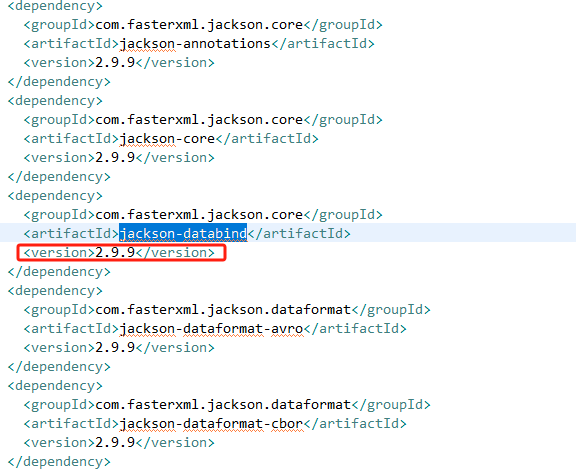
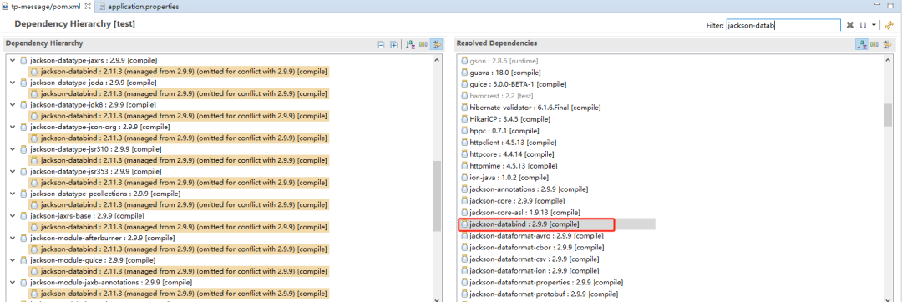
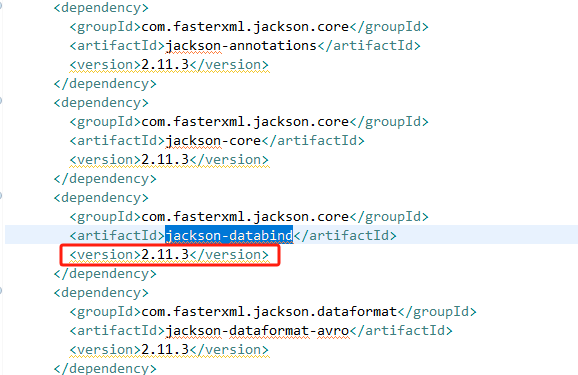
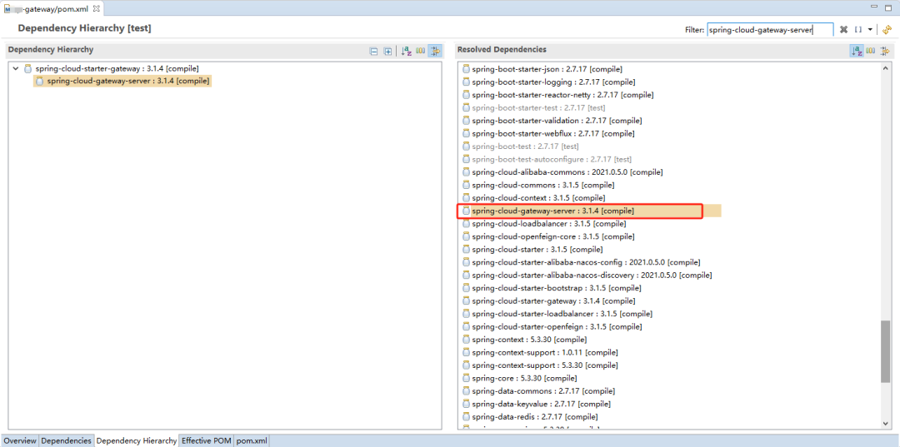

# 【漏洞处置SOP】FasterXML jackson-databind 信息泄露漏洞（CVE-2019-14439）

> 编号角色校订（2026-10-04）：按归档技术正文区分主讨论编号与背景引用，更新 `primary_identifiers` / `referenced_identifiers` 及旧字段角色。旧编号原值、状态与正文保持原样，变更前字段逐字保存在 `previous_*`；后文旧的角色待核说明应按当前字段阅读。这里的角色判读不等于官方分配核验或漏洞复现。

<!-- vulwiki-editorial-rebuild:system-misc -->
## 条目范围与校订

- 本文对象：FasterXML jackson-databind CVE-2019-14439
- 文献类型：技术文章（细分类待核）
- 版本、权限及部署边界：缺启用多态类型处理与可用gadget依赖前提，不是所有Jackson服务器可直接RCE
- 核验状态：仅重建文本校订；未执行文中代码、PoC 或扫描，未把截图或转载声明记为本站复现

### 具体结论与待核项

以下为原归档的逐项勘误与证据缺口；可由文本确定的问题已在下文订正，仍缺来源的事实保持待核。

1. 标题信息泄露而正文反序列化RCE，未给真实gadget/利用机制以支持类型
2. 缺启用多态类型处理与可用gadget依赖前提，不是所有Jackson服务器可直接RCE
3. 多维护分支用多个小于区间并列会互相覆盖，应分支建模
4. 称绕过12384防护需原公告核
5. 升级例2.11.3为历史示范不能当2025通用安全最新版
6. 只测正常功能不充分确认漏洞修复，应核依赖树/部署包及安全回归
7. 只有tags总页无精确公告/commit

### 操作风险

多维护分支用多个小于区间并列会互相覆盖，应分支建模

技术请求、代码与实验方法按原文保留；其中的破坏性动作仅限授权、可恢复的隔离环境。缺失代码、参数或版本事实不猜补。

### 来源追溯

- 原始披露 URL 未确认；既有归档来源标签保留，不能替代原始公告

### 归档技术正文

原创 Eason  方桥安全漏洞防治中心   2025-04-16 10:01  
  
  
# 01 SOP基本信息  
- **SOP名称：**  
CVE-2019-14439｜FasterXML jackson-databind 信息泄露漏洞处置标准作业程序（SOP）  
  
- **版本：**  
1.0  
  
- **发布日期：**  
2024-08-22  
  
- **作者：Jungle**  
  
- **审核人：**  
T小组  
  
- **修订记录：**  
  
- **初始版本：**  
创建SOP  
  
# 02 SOP的用途  
  
本SOP旨在指导系统管理员安全、高效地处置CVE-2019-14439漏洞，确保在规定时间内完成漏洞修复并提交给安全部门验证，保障系统安全。  
  
# 03 SOP的目标用户技能要求  
- 具备Java应用程序开发的相关知识。  
  
- 了解 FasterXML jackson-databind功能。  
  
- 能够阅读和理解技术文档，如软件更新日志、安全公告等。  
  
# 04 漏洞详细信息  
- 漏洞名称：  
CVE-2019-14439  
  
- 漏洞类型：  
远程代码执行（RCE）  
  
- 风险等级：  
高危  
  
- CVSS评分：  
7.5  
  
- 漏洞描述：  
CVE-2019-14439是Jackson-databind组件中的一个反序列化远程命令执行漏洞。攻击者可以通过精心构造的JSON数据，利用Jackson的数据绑定功能，在受影响的Jackson服务器上执行任意代码。该漏洞可以绕过先前已知的CVE-2019-12384漏洞防护，对系统安全构成严重威胁。  
  
- 影响范围：  
  
- Jackson-databind < 2.9.9.2  
  
- Jackson-databind < 2.10.0  
  
- Jackson-databind < 2.7.9.6  
  
- Jackson-databind < 2.8.11.4  
  
- 其他未提及但版本低于上述安全版本的Jackson-databind组件  
  
# 05 漏洞处置方案  
1. 升级到以下安全版本：  
  
1. jackson-databind >=   
2.9.9.2  
  
1. jackson-databind >=   
2.10.0  
  
1. jackson-databind >=   
2.7.9.6  
  
1. jackson-databind >=   
2.8.11.4  
    
  
1. 目前厂商已发布升级补丁以修复漏洞，补丁获取链接：  
https://github.com/FasterXML/jackson-databind/tags  
  
# 【注意事项】  
- 在应用补丁或升级版本之前，请确保进行充分的备份。  
  
- 遵循官方提供的安装和配置指南进行操作。  
  
- 在生产环境中升级前，最好在测试环境中先进行测试。  
  
- 修复漏洞前进行充分测试，以确保系统稳定性和安全性。  
  
- 不同版本系列尽量升级到本系列版本无漏洞的版本，尽量不要版本跨度太大，避免出现一些不兼容情况。  
  
# 06 漏洞修补详细步骤  
  
以下是针对（CVE-2019-14439）FasterXML jackson-databind 信息泄露漏洞的具体可操作的详细修复步骤参考：  
  
**1. 使用开发工具打开受影响的工程**  
  
本文以eclipse为例  
  
**2. 确定当前 jackson-databind版本**  
  
打开pom.xml文件查看相关依赖，本文以受影响的jackson-databind-2.9.9版本为例  
  
  
  
  
  
****  
**3. 修改****pom****文件升级jackson-databind版本(如有别的jackson相关组件，建议版本一起升级，避免不兼容)**  
- 创建新分支用于漏洞修复  
  
- 修改pom文件中jackson-databind版本，本文以升级到jackson-databind-2.11.3为例  
  
  
  
  
  
**4. 重新编译打包工程**  
  
编译打包命令   
```
mvn clean install
```  
  
**5. 启动对应工程服务**  
  
启动命令  
```
 java -jar  xxx.jar
```  
  
**6. 验证修复效果**  
：  
  
访问系统相关功能进行测试，确保漏洞已被成功修复。  
  
**7. 记录处置过程**  
：  
  
撰写漏洞处置报告，详细记录修补步骤、日期和结果。****  
  
**8. 提交报告**  
：  
  
将漏洞处置报告提交给安全部门，等待验证和确认。  
  
  
  
- End -  
  
  
  
  
欢迎投稿或扫码添加运营助手获取附件  
  
▽  
  
  
  
  
欢迎关注公众号  
  
▽  
  
  
  


---

> 来源：gelusus/wxvl（微信公众号漏洞文章自动归档，原始披露 URL 尚未确认，现有链接按来源追溯区分别标注）
