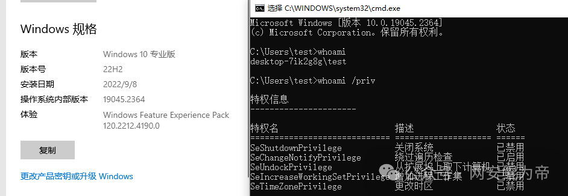
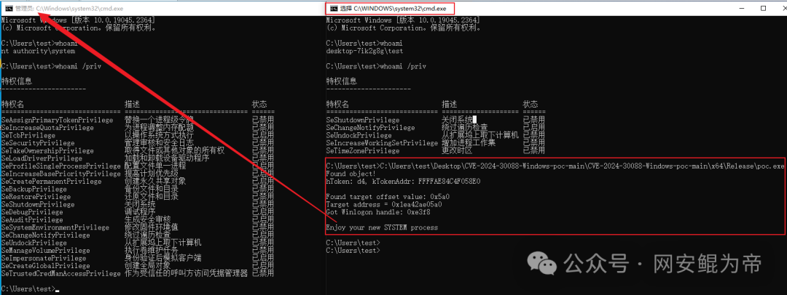
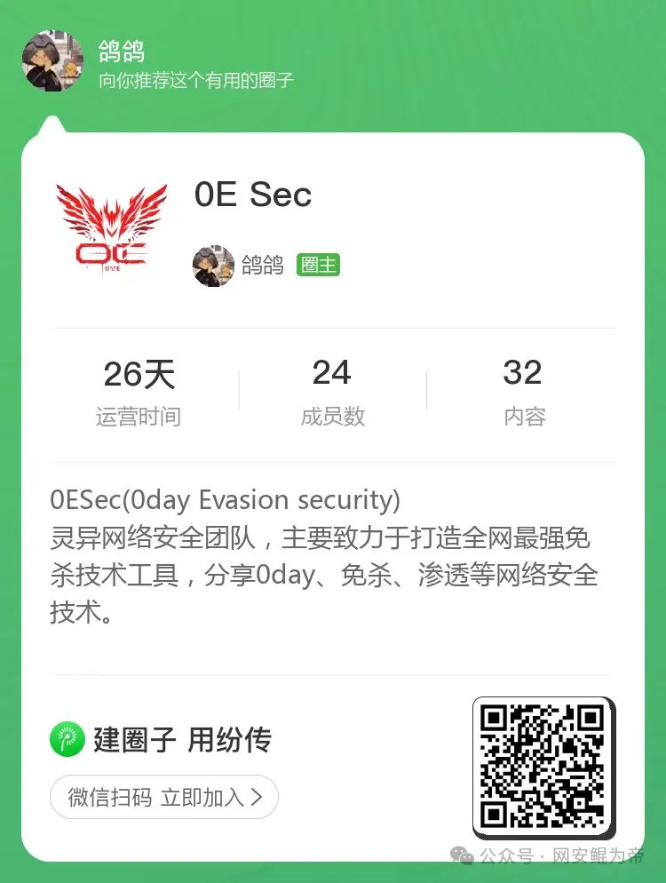

# 【漏洞复现】CVE-2024-30088 Windows内核提权漏洞  附poc

> 编号角色校订（2026-10-04）：按归档技术正文区分主讨论编号与背景引用，更新 `primary_identifiers` / `referenced_identifiers` 及旧字段角色。旧编号原值、状态与正文保持原样，变更前字段逐字保存在 `previous_*`；后文旧的角色待核说明应按当前字段阅读。这里的角色判读不等于官方分配核验或漏洞复现。

<!-- vulwiki-editorial-rebuild:system-misc -->
## 条目范围与校订

- 本文对象：Windows内核30088
- 文献类型：技术文章（细分类待核）
- 版本、权限及部署边界：范围只Win系列无构建补丁，不足排查
- 核验状态：仅重建文本校订；未执行文中代码、PoC 或扫描，未把截图或转载声明记为本站复现

### 具体结论与待核项

以下为原归档的逐项勘误与证据缺口；可由文本确定的问题已在下文订正，仍缺来源的事实保持待核。

1. 范围只Win系列无构建补丁，不足排查
2. 利用需本地普通用户且竞态可能崩溃，应说明重试/失败边界
3. PoC仓库第三方未固定commit、源码正文缺失
4. 管理员窗口与SYSTEM身份须分，图示需文字化
5. 已有MSRC精确链接保留
6. 单字换行免责声明/装饰svg/营销大量噪声

### 操作风险

利用需本地普通用户且竞态可能崩溃，应说明重试/失败边界

技术请求、代码与实验方法按原文保留；其中的破坏性动作仅限授权、可恢复的隔离环境。缺失代码、参数或版本事实不猜补。

### 来源追溯

- 原始披露 URL 未确认；既有归档来源标签保留，不能替代原始公告

### 归档技术正文

原创 loser  网安鲲为帝   2024-07-06 17:13  
  
**0x00****免责声明**  
  
!  
  
  
  
  
  
本  
文  
仅  
用  
于  
技  
术  
讨  
论  
与  
学  
习  
，  
利  
用  
此  
文  
所  
提  
供  
的  
信  
息  
而  
造  
成  
的  
任  
何  
直  
接  
或  
者  
间  
接  
的  
后  
果  
及  
损  
失  
，  
均  
由  
使  
用  
者  
本  
人  
负  
责  
，  
文  
章  
作  
者  
及  
本  
公  
众  
号  
团  
队  
不  
为  
此  
承  
担  
任  
何  
责  
任  
。  
  
  
**0x01 漏洞描述**  
  
!  
  
  
  
  
  
该漏洞存在于 NtQueryInformationToken 函数中，特别是在处理AuthzBasepCopyoutInternalSecurityAttributes 函数时，该漏洞源于内核在操作对象时对锁定机制的不当管理，这一失误可能导致恶意实体意外提升权限。  
  
  
**0x02 漏洞影响范围**  
  
!  
  
  
  
  
  
Windows Server 2016、  
W  
ind  
ows Server 2022、  
W  
ind  
ows Server 2019  
  
Windows 10、Windows 11  
  
  
**0x03 漏洞复现**  
  
!  
  
  
  
  
  
创建一个test用户，普通权限，如下：  
  
  
  
  
使用poc，利用条件竞争提权，故需要等一会。成功提权后，会弹出一个管理员运行的命令行窗口，如下图，查询权限已是system权限  
  
  
  
  
  
**0x04 修复意见**  
  
!  
  
  
  
  
  
关注官方补丁：  
```
https://msrc.microsoft.com/update-guide/zh-cn/vulnerability/CVE-2024-30088
```  
  
  
**0x05 验证工具获取**  
  
!  
  
  
  
  
  
github地址：  
  
```
https://github.com/Zombie-Kaiser/CVE-2024-30088-Windows-poc?tab=readme-ov-file
```  
  
  
  
  
**0x06 欢迎进群交流**  
  
!  
  
  
  
  
  
添加微信进群：  
  
  
  
  
      
  


---

> 来源：gelusus/wxvl（微信公众号漏洞文章自动归档，原始披露 URL 尚未确认，现有链接按来源追溯区分别标注）
