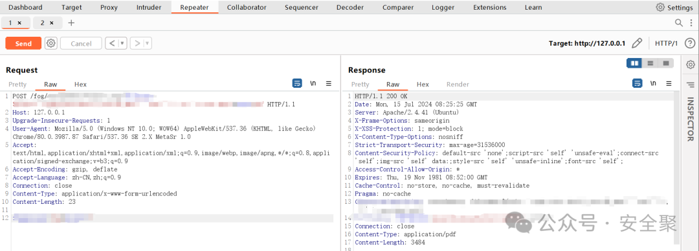
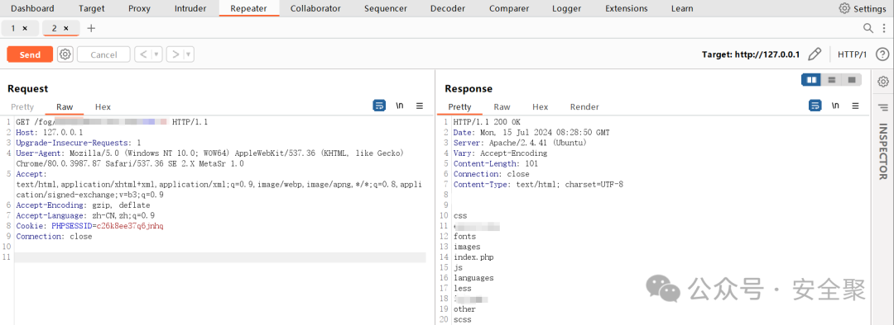

# 【漏洞预警-已复现】FOGPROJECT 文件名命令注入漏洞（CVE-2024-39914）

> 编号角色校订（2026-10-04）：按归档技术正文区分主讨论编号与背景引用，更新 `primary_identifiers` / `referenced_identifiers` 及旧字段角色。旧编号原值、状态与正文保持原样，变更前字段逐字保存在 `previous_*`；后文旧的角色待核说明应按当前字段阅读。这里的角色判读不等于官方分配核验或漏洞复现。

<!-- vulwiki-editorial-rebuild:system-misc -->
## 条目范围与校订

- 本文对象：FOG Project
- 文献类型：技术文章（细分类待核）
- 版本、权限及部署边界：缺filename具体请求和认证条件；<1.5.10.34修复版本需官方GHSA/commit支持
- 核验状态：仅重建文本校订；未执行文中代码、PoC 或扫描，未把截图或转载声明记为本站复现

### 具体结论与待核项

以下为原归档的逐项勘误与证据缺口；可由文本确定的问题已在下文订正，仍缺来源的事实保持待核。

1. 已复现为作者声明及截图而非公开完整PoC
2. 缺filename具体请求和认证条件
3. <1.5.10.34修复版本需官方GHSA/commit支持
4. 仅CVE旧站入口无厂商修复链接
5. 精简重复产品介绍与推广

### 操作风险

原文技术操作的实际副作用未复现核验；按其请求/代码评估状态变更、凭据暴露和业务影响

技术请求、代码与实验方法按原文保留；其中的破坏性动作仅限授权、可恢复的隔离环境。缺失代码、参数或版本事实不猜补。

### 来源追溯

- 原始披露 URL 未确认；既有归档来源标签保留，不能替代原始公告

### 归档技术正文

原创 聚焦网络安全情报  安全聚   2024-07-15 20:01  
  
预警公告 **严重**  
  
近日，安全聚实验室监测到 FOGPROJECT中存在命令注入漏洞 ，编号为：CVE-2024-39914，CVSS:9.8   在FOG中的packages/web/lib/fog/reportmaker.class.php文件受到命令注入漏洞的影响。  
  
  
**01**  
  
**漏洞描述**  
  
FOG是一个开源的计算机镜像解决方案，旨在帮助管理员轻松地部署、维护和克隆大量计算机。FOG Project 提供了一套功能强大的工具，使用户能够快速部署操作系统、软件和配置设置到多台计算机上，从而节省时间和精力。该项目支持基于网络的 PXE 启动、镜像创建和还原、硬件和软件清单管理、远程控制和监视等功能，为 IT 管理员和系统管理员提供了一个全面的工具集。该漏洞在FOGPROJECT  
中的packages/web/lib/fog/reportmaker.class.php文件受到命令注入漏洞的影响，该漏洞存在于/fog/management/export.php的filename参数  
  
**02**  
  
**影响范围**  
  
  
FOGPROJECT < 1.5.10.34  
  
**03**  
  
**漏洞复现**  
  
目前，安全聚实验室已成功复现FOGPROJECT 文件名命令注入漏洞（CVE-2024-39914）  
  
  
  
  
  
  
**04**  
  
**安全措施**  
  
  
建议用户更新至 FOGPROJECT 的安全版本：  
>= 1.5.10.34  
  
**05**  
  
**参考链接**  
  
  
1.https://cve.mitre.org/cgi-bin/cvename.cgi?name=CVE-2024-39914  
  
**06**  
  
**技术支持**  
  
  
长按识别二维码，关注“**安全聚**”公众号，联系我们的团队技术支持。  
  
  
  
  
  
  
  

---

> 来源：gelusus/wxvl（微信公众号漏洞文章自动归档，原始披露 URL 尚未确认，现有链接按来源追溯区分别标注）
