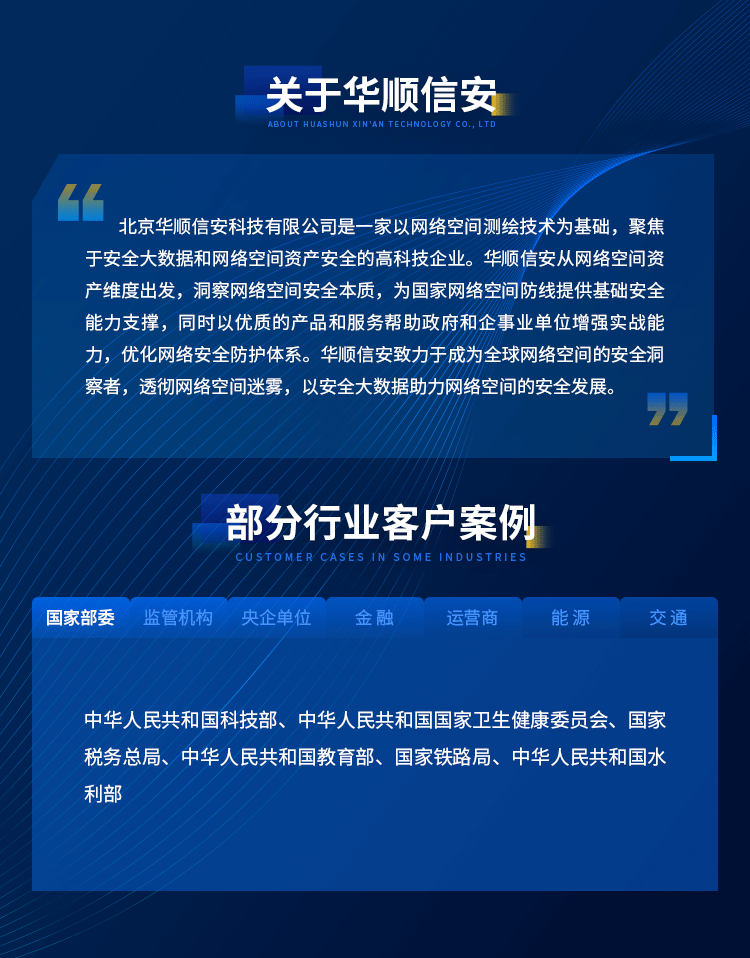
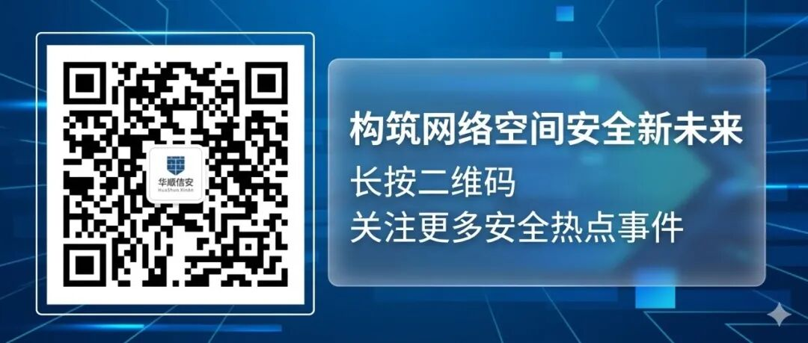

#  【热点安全风险】9月12日 | rclone双高危认证绕过同日修补，S3服务与远程控制接口可被无认证接管（CVE-2026-88018/CVE-2026-88044）  

> 编号角色校订（2026-10-04）：按归档技术正文区分主讨论编号与背景引用，更新 `primary_identifiers` / `referenced_identifiers` 及旧字段角色。旧编号原值、状态与正文保持原样，变更前字段逐字保存在 `previous_*`；后文旧的角色待核说明应按当前字段阅读。这里的角色判读不等于官方分配核验或漏洞复现。

<!-- vulwiki-editorial-rebuild:system-misc -->
## 条目范围与校订

- 本文对象：rclone/Traefik/mistral.rs/Argos/OmniRoute六项风险汇总
- 文献类型：技术文章（细分类待核）
- 版本、权限及部署边界：rclone serveS3 auth-proxy和经RC创建FTP/S3服务器的per-server/global缺陷应分，不能推所有RC控制接口本身无认证；OmniRoute自定义Agent本有执行用途需精确认证角色边界，未给；各有具体GHSA及版本，适合作公告索引而非PoC，状态限定9月日期
- 核验状态：仅重建文本校订；未执行文中代码、PoC 或扫描，未把截图或转载声明记为本站复现

### 具体结论与待核项

以下为原归档的逐项勘误与证据缺口；可由文本确定的问题已在下文订正，仍缺来源的事实保持待核。

1. 元数据仅88018，主段另88044/88007/59960/88062及两个mistralGHSA，不能整文归rclone
2. rclone serveS3 auth-proxy和经RC创建FTP/S3服务器的per-server/global缺陷应分，不能推所有RC控制接口本身无认证
3. 只给一个rcloneGHSA需补另一
4. Argos反复写Argo会误入ArgoCD产品，分支/ref到PR标题/仓库名控制也需数据流证明
5. mistral开本地文件到返回内容要看媒体解析/回显，不等于任意字节直接泄露
6. DoS限num_frames不够还需字节/像素等界限
7. OmniRoute自定义Agent本有执行用途需精确认证角色边界，未给
8. 各有具体GHSA及版本，适合作公告索引而非PoC，状态限定9月日期

### 操作风险

原文技术操作的实际副作用未复现核验；按其请求/代码评估状态变更、凭据暴露和业务影响

技术请求、代码与实验方法按原文保留；其中的破坏性动作仅限授权、可恢复的隔离环境。缺失代码、参数或版本事实不猜补。

### 来源追溯

- 原始披露 URL 未确认；既有归档来源标签保留，不能替代原始公告

### 归档技术正文

 华顺信安威胁情报中心   2026-09-11 23:30  
  
**PART.****0****1**  
  
  
风险汇总  
‍  
‍  
‍  
  
## 风险一：rclone 两个致命认证绕过同日曝光，S3 服务与远程控制接口可被未认证接管（CVE-2026-88018/CVE-2026-88044）  
  
极受欢迎的云存储与同步工具 rclone 在同一批安全更新中修复两个致命认证绕过漏洞。CVE-2026-88018（CVSS 9.8，严重）：当 rclone serve s3 开启 --auth-proxy 时，处理链最外层会把传入请求自带的 Authorization 头里的 accessKeyID 直接解析出来当作认证依据，配合后方的 SigV4 校验缺口，攻击者可完全不携带有效凭据访问 S3 服务，实现"认证所有人"。CVE-2026-88044（CVSS 9.1，严重）：服务启动时把协议选项放进 per-server 的 proxyOpt 对象，但 FTP 与 S3 的 RC 适配器在判断是否启用代理认证时读的是进程全局 proxy.Opt.AuthProxy，与实际生效的 per-server 配置不一致，从而绕过认证。受影响的 rclone 版本均需升级至 1.75.1 及以上。rclone 广泛用于企业备份、云迁移与增量同步，一旦自建的 serve s3 或远程控制（RC）接口暴露，即可被未认证者遍历、读写甚至抹除数据。  
### 建议排查  
1. 盘点启用 rclone serve s3 或 RC 服务的实例，确认版本是否低于 1.75.1。  
  
1. 检查相关服务是否公网可达、是否配置了 --auth-proxy 或 RC 认证。  
  
1. 审计近期是否有对 S3 桶与 RC 接口的未认证访问与异常读写记录。  
  
### 加固建议  
1. 立即升级 rclone 至 1.75.1 及以上。  
  
1. 收敛 serve s3 与 RC 接口的暴露面，仅允许受信内网或经反向代理鉴权后访问。  
  
1. 复核 --auth-proxy 配置合规性，确认认证缺失场景下无暴露桶数据。  
  
参考来源：  
  
https://github.com/advisories/GHSA-xwwr-4h3p-r22c   
  
## 风险二：Traefik HTTP/3 后端连接复用泄漏身份认证，反向代理网关被曝严重漏洞（CVE-2026-88007）  
  
主流反向代理与入口网关 Traefik 披露一个严重漏洞（CVE-2026-88007）：其 HTTP/3 请求路径没有初始化连接作用域的后端传输持有器——这条隔离单连接 NTLM 与 Negotiate（Kerberos）认证的逻辑在 HTTP/1.1 与 HTTP/2 上本已正确实现，但 HTTP/3 入口复用了 HTTPS 处理链，却绕过了这一关键隔离，导致后端身份认证可能跨连接被错误复用，攻击者可借此在受信任的后端会话上下文中提权或冒充。受影响版本 Traefik v3 <3.7.13、v2 <2.11.57，需升级修复。Traefik 广泛用于 Kubernetes 入口与微服务网关，身份认证上下文错误复用直接关系后端应用的安全边界。  
### 建议排查  
1. 盘点 Traefik 部署版本，确认是否低于 3.7.13（v2 分支低于 2.11.57）。  
  
1. 检查是否启用了 HTTP/3 监听与 NTLM/Negotiate 后端认证。  
  
1. 审计网关日志中的异常连接复用与后端认证异常。  
  
### 加固建议  
1. 升级 Traefik 至 3.7.13 或 2.11.57 及以上。  
  
1. 对依赖 NTLM/Kerberos 后端认证的入口暂时评估 HTTP/3 禁用或加隔离。  
  
1. 为网关建立认证上下文与连接生命周期监测，发现异常复用及时告警。  
  
参考来源：  
  
https://github.com/advisories/GHSA-qqjf-53cj-pwvv  
  
## 风险三：AI 推理引擎 mistral.rs 曝未认证 SSRF 与任意文件读取，本地模型服务可被外网探入内网  
  
开源 AI 推理引擎 mistral.rs 的 Media Loader 披露两个高危漏洞：其一（CVSS 7.2，高危）——mistral.rs 会对请求提供的图片/音频 URL 直接发起抓取，且不做主机或 IP 校验，还能打开任意本地文件（file:// URL 或任一存在的相对/绝对路径）。任何未认证的远程客户端，只要面对的是启用了视觉/音频能力的部署（如 /v1/chat/completions 多媒体接口），就能让服务器向内网任意主机发起请求（SSRF），并读取服务器本地的任意文件。对把自建模型服务暴露给多方使用、或接入多模态能力的企业，这是同时打通"内网探测"与"本地文件泄露"两个口的典型 AI 服务攻防问题。受影响版本 ≤0.8.17，修复于 0.8.18。  
### 建议排查  
1. 盘点部署 mistral.rs 及其多媒体/视觉接口的实例版本。  
  
1. 检查 /v1/chat/completions 等接口是否公网可达、是否对图片/音频 URL 做白名单与内网地址校验。  
  
1. 审计 AI 服务近期发出的可疑内网请求与文件读取行为。  
  
### 加固建议  
1. 升级 mistral.rs 至 0.8.18 及以上。  
  
1. 对媒体 URL 抓取实施协议、主机与内网地址白名单，必要时加入 SSRF 防护。  
  
1. 收敛 AI 推理服务的暴露面，未授权的多媒体接口不做内网可达，并限制其文件系统访问权限。  
  
参考来源：   
  
https://github.com/advisories/GHSA-wfgq-w7cq-qj7j  
  
## 风险四：AI 推理引擎再曝远程媒体抓取可致服务瘫痪，视频帧无限展开成拒绝服务面  
  
紧随其后的另一个高危（CVSS 7.5）问题暴露了 mistral.rs 的资源耗尽短板：其 POST /v1/chat/completions 端点会把攻击者提供的媒体 URL（图片、音频、视频）不限字节地抓进服务器内存，并在指定帧数 num_frames 为 None 时把视频的每一帧都解出来。这意味着一个远程未认证客户端只需提交一个超大视频或海量媒体 URL，就能撑爆服务器内存与计算资源，造成拒绝服务。对把多模态 AI 服务暴露到公网或对多方开放的企业，这是无需认证即可触发的单点放大攻击面。  
### 建议排查  
1. 确认 mistral.rs 部署是否已升级至修复版本，多媒体接口是否对单次载荷大小有限制。  
  
1. 检查视频帧提取参数 num_frames 是否强制约束，媒体 URL 是否限长、限流量。  
  
1. 监控模型服务的内存与 CPU，识别异常高消耗请求。  
  
### 加固建议  
1. 升级 mistral.rs 至 0.8.18 及以上。  
  
1. 对媒体 URL 抓取与视频帧提取设置字节上限与帧数上限，强制 num_frames 非 None。  
  
1. 为多模态 AI 接口配置限流、配额与资源隔离，防范单请求放大攻击。  
  
参考来源：  
  
https://github.com/advisories/GHSA-m3wp-48jr-vr4g  
  
## 风险五：CI 截图工具 @argos-ci/core 分支名拼入命令注入，开发流水线可被仓库名触发 RCE（CVE-2026-59960）  
  
前端视觉回归测试与 CI 工具 @argos-ci/core 披露一个命令注入漏洞（CVE-2026-59960，CVSS 7.5，高危）：@argos-ci/core@6.2.0 把攻击者可控的 CI 分支/引用字符串直接拼进 execSync() 的模板字符串（packages/core/src/ci-environment/git.ts:89）。当 CI 项目设置 hasRemoteContentAccess: false 时，Argo 会把这个未净化的分支名作为参数执行系统命令，攻击者只需把仓库分支名或 PR 标题构造为恶意命令，就能在 CI 运行环境里触发任意命令执行（RCE）。这对使用 Argo、且允许外部提交分支/PR 的开源仓库与团队是直接的供应链/CI 投毒向量。受影响版本 ≤6.2.0，修复于 6.2.1。  
### 建议排查  
1. 盘点 CI 流水线中集成的 @argos-ci/core 版本，确认是否低于 6.2.1。  
  
1. 检查 Argo CI 是否对外部提交的分支名/PR 标题做了字符过滤。  
  
1. 审计 CI 运行环境是否具备隔离与最小权限，核查异常命令执行日志。  
  
### 加固建议  
1. 升级 @argos-ci/core 至 6.2.1 及以上。  
  
1. 对分支名、PR 标题等进入命令拼接的输入做严格白名单过滤。  
  
1. 以最小权限隔离 CI 运行环境，防范仓库名驱动的命令执行扩散。  
  
参考来源：  
  
https://github.com/advisories/GHSA-4x45-gxvp-6283  
  
## 风险六：OmniRoute 开源项目 ACP 自定义 Agent 端点上执行任意命令，暂无官方修复补丁（CVE-2026-88062）  
  
开源项目 OmniRoute 的 ACP（Agent Control Plane）自定义 Agent 接口被披露存在远程代码执行漏洞（CVE-2026-88062，严重，受影响版本 ≤3.8.50，  
官方尚未发布修复补丁  
）：其 POST /api/acp/agents 端点注册自定义 ACP Agent 时接受用户可控的 binary 与 versionCommand 参数，保存后同一请求即触发 refreshAgentCache() 进行版本检测，最终把用户提供的命令当作版本探测命令执行。攻击者可借此在服务器上以服务进程权限执行任意命令。由于当前没有官方修复版本，存在此组件的部署需先行采取缓解措施，重点收敛该端点的访问。  
### 建议排查  
1. 盘点部署 OmniRoute 并暴露 ACP /api/acp/agents 自定义 Agent 功能的实例。  
  
1. 检查该接口是否公网可达、是否在校验访问者身份前即可注册自定义 Agent。  
  
1. 审计服务器上是否存在异常的命令执行与进程启动记录。  
  
### 加固建议  
1. 官方补丁发布前，对 ACP 自定义 Agent 接口实施强访问控制，仅允许受信来源。  
  
1. 对 binary 与 versionCommand 等参数做白名单与命令拼接校验，禁止任意命令。  
  
1. 将该组件的暴露面纳入重点监控，一旦补丁可用立即升级。  
  
参考来源：  
  
https://github.com/advisories/GHSA-hf57-cqmx-p4gr  
  
  
**PART.****02**  
  
  
总体处置建议  
‍  
‍  
‍  
  
## 总结  
  
今日风险主线集中在开源基础设施与 AI 工具链的供应链安全：云同步/备份工具 rclone 同批修复两个致命认证绕过（serve s3 与 RC 接口可被未认证接管），反向代理网关 Traefik 的 HTTP/3 认证上下文泄漏直指后端身份边界；AI 推理引擎 mistral.rs 连曝未认证 SSRF/任意文件读取与远程媒体抓取资源耗尽，把自建模型服务的"内网探测 + 本地文件泄露 + 拒绝服务"三条口子同时打开；此外 CI 工具 @argos-ci/core 的命令注入、OmniRoute 开源 ACP 自定义 Agent 的未修复 RCE，继续在开发流水线与管理面上埋雷。企业应优先收敛 rclone、Traefik 等公网暴露组件的访问面并及时升级，对自建 AI 服务严控媒体抓取与接口暴露。  
  
## 整体风险处置建议  
1. 升级 rclone 至 1.75.1，收敛 serve s3 与 RC 接口的暴露面与认证配置。  
  
1. 升级 Traefik 至 3.7.13/2.11.57，核查 HTTP/3 与后端身份认证场景。  
  
1. 升级 mistral.rs 至 0.8.18，对媒体 URL 与视频帧提取设白名单、字节与帧数上限，收敛多模态接口暴露。  
  
1. 升级 @argos-ci/core 至 6.2.1，对分支名等命令拼接输入做白名单过滤，隔离 CI 环境。  
  
1. 对 OmniRoute ACP 自定义 Agent 接口实施强访问控制，补丁发布前优先缓解并持续跟踪。  
  
1. 建立开源组件与 AI 服务的清单化漏洞管理，优先处置带公开利用证据与公网可达的对象。  
  
## 合规说明  
  
以上内容基于公开信息整理，仅用于网络安全防护与管理决策参考，具体影响范围与修复方式请以厂商官方公告为准。  
  
  
  
  
  
  
  
  

---

> 来源：gelusus/wxvl（微信公众号漏洞文章自动归档，原始披露 URL 尚未确认，现有链接按来源追溯区分别标注）
