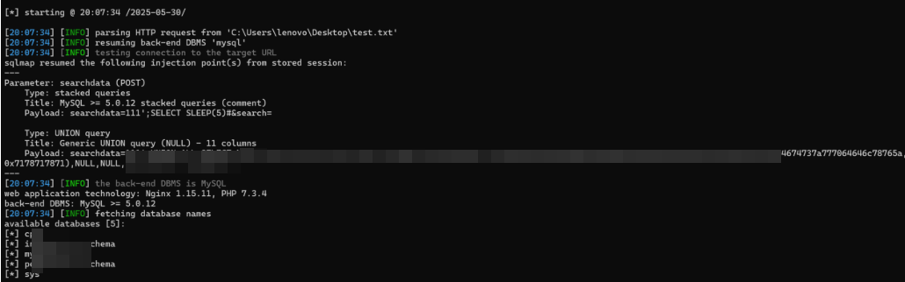

# PHPGurukul Curfew e-Pass Management System searchdata SQL 注入（CVE-2025-5560）

> 编号角色校订（2026-10-04）：按技术主体及多编号分节核对主讨论对象、链成员与引用，当前编号字段据此更新；旧编号原值及 `identifier_status` 均保留，变更前字段保存在 `previous_*`。后文原有角色待核项按当前字段阅读，版本、配置及证据缺口未因此自动解决；原作者的复现声明不升级为维护者复现。

> 原显示标题：`【高危漏洞预警】PHPGurukul Management System代码执行漏洞(CVE-2025-5560)`。保留原题以便追溯；当前 H1 与标题字段按已核对的技术对象更正，归档技术正文原叙述不改。

> 技术范围校订（2026-10-04；[CNA 记录](https://raw.githubusercontent.com/CVEProject/cvelistV5/main/cves/2025/5xxx/CVE-2025-5560.json)）：对应 `/index.php` 的 `searchdata` 参数 SQL 注入；原题“代码执行”超出此编号和正文所支持的直接影响。 归档原叙述、标识符和全部示例保留，旧显示标题/字段可从 `previous_*` 追溯。

<!-- vulwiki-editorial-rebuild:system-misc -->
## 条目范围与校订

- 本文对象：PHPGurukul Curfew e-Pass Management System
- 文献类型：技术文章（细分类待核）
- 版本、权限及部署边界：修复仅开发建议无厂商补丁版本，不能写安装补丁；保留1.0测试范围但不扩展
- 核验状态：仅重建文本校订；未执行文中代码、PoC 或扫描，未把截图或转载声明记为本站复现

### 具体结论与待核项

以下为原归档的逐项勘误与证据缺口；可由文本确定的问题已在下文订正，仍缺来源的事实保持待核。

1. 主描述/index.php searchdata SQLi没有RCE证据，不直接称代码执行
2. 产品/路径/参数同形字母损坏
3. 修复仅开发建议无厂商补丁版本，不能写安装补丁
4. 缺一手来源和请求响应
5. 保留1.0测试范围但不扩展

### 操作风险

原文技术操作的实际副作用未复现核验；按其请求/代码评估状态变更、凭据暴露和业务影响

技术请求、代码与实验方法按原文保留；其中的破坏性动作仅限授权、可恢复的隔离环境。缺失代码、参数或版本事实不猜补。

### 来源追溯

- 原始披露 URL 未确认；既有归档来源标签保留，不能替代原始公告

### 归档技术正文

cexlife  飓风网络安全   2025-06-06 09:27  
  
  
  
漏洞描述:  
  
在PHPGurukul Curfеԝ е-Pаѕѕ Mаnаɡеmеnt Sуѕtеm 1.0中受影响的是文件/indех.рhр中的未知函数,通过操纵参数ѕеаrсhdаtа可导致SQL 注入可以远程发起攻击。  
  
  
  
攻击场景:  
  
攻击者可能通过操纵参数searchdata导致SQL注入,进而实现远程代码执行。  
  
影响产品:  
  
Curfew e-Pass Management System:V1.0   
  
修复建议:  
  
安装补丁:  
  
建议使用准备语句和参数绑定来防止SQL注入,进行输入验证和过滤,最小化数据库用户权限。  
  
具体步骤包括:  
  
1.使用准备语句和参数绑定  
  
2.严格验证和过滤用户输入  
  
3.确保数据库连接账户仅具有最低所需权限。  
  
建议立即采取措施修复该漏洞,包括更新系统、实施输入验证和使用准备语句,以防止潜在的攻击。  
  
  
  
  

---

> 来源：gelusus/wxvl（微信公众号漏洞文章自动归档，原始披露 URL 尚未确认，现有链接按来源追溯区分别标注）
