# 一种新的 email 欺骗漏洞 - SMTP 走私

<!-- vulwiki-editorial-rebuild:system-misc -->
## 条目范围与校订

- 本文对象：SMTP Smuggling / 多邮件服务协议解析差异
- 文献类型：技术文章（细分类待核）
- 版本、权限及部署边界：文章有2023时间背景和原始SEC Consult研究链接但无修复状态/版本/厂商缓解建议，不能作为当前所有服务均受影响证据
- 核验状态：仅重建文本校订；未执行文中代码、PoC 或扫描，未把截图或转载声明记为本站复现

### 具体结论与待核项

以下为原归档的逐项勘误与证据缺口；可由文本确定的问题已在下文订正，仍缺来源的事实保持待核。

1. 关键终止序列多处丢失点号，CRLF.CRLF被写成CRLFCRLF及LF.LF被写LFLF，影响技术准确性
2. DATA等待正文标准响应354却列250，BDAT能力误写POOLING而应核对CHUNKING
3. Linux换行习惯不等于SMTP协议规范，漏洞取决于两端解析组合
4. 伪造admin发件人不等于接管管理员账号，SPF通过也需与可见From对齐才能论DMARC
5. 文章有2023时间背景和原始SEC Consult研究链接但无修复状态/版本/厂商缓解建议，不能作为当前所有服务均受影响证据
6. 给出的至少35域名列表有重复、暴露量与可利用量混用
7. responsible-disclosure-polic链接截断，关键完整SMTP会话依赖图片

### 操作风险

原文技术操作的实际副作用未复现核验；按其请求/代码评估状态变更、凭据暴露和业务影响

技术请求、代码与实验方法按原文保留；其中的破坏性动作仅限授权、可恢复的隔离环境。缺失代码、参数或版本事实不猜补。

### 来源追溯

- 原文标注出处：<https://mp.weixin.qq.com/s/XZA4QVcUrBGsiG5Qo1IHig>

### 归档技术正文

<meta name="referrer" content="no-referrer"/>

> 本文由 [简悦 SimpRead](http://ksria.com/simpread/) 转码， 原文地址 [mp.weixin.qq.com](https://mp.weixin.qq.com/s/XZA4QVcUrBGsiG5Qo1IHig)

**2023 年马上要结束了，祝大家 2024 年顺利~！**

这种新的漏洞手段来自 SEC 漏洞实验室，在 SEC Consult 漏洞实验室的研究项目中，很出名的 DNS 协议攻击专家 @timolongin) 发现了一种针对另一种互联网协议——SMTP (Simple Mail Transfer Protocol) 的全新利用技术。攻击者可以利用全球范围内的易受攻击的 SMTP 服务器，从任意电子邮件地址发送恶意电子邮件，进行有针对性的网络钓鱼攻击。由于该漏洞本身的性质，这种类型的漏洞被称为 SMTP 走私。

详细解释看下原文章：

https://sec-consult.com/blog/detail/taking-over-a-country-kaminsky-style/

https://sec-consult.com/blog/detail/smtp-smuggling-spoofing-e-mails-worldwide/

https://sec-consult.com/vulnerability-lab/responsible-disclosure-polic

**SMTP 走私漏洞详情：**

总的来说就是通过利用 SMTP 协议的解释差异，可以实现走私 / 发送伪造的电子邮件 ，且同时仍可通过 SPF 对齐检查。在此研究中，发现了两种类型的 SMTP 走私，即出站和入站。这些允许从数百万个域（例如 admin@outlook.com）向数百万个接收 SMTP 服务器（例如 Amazon、PayPal、eBay）发送伪造的电子邮件。

说 SMTP 走私漏洞前先提下 HTTP 走私漏洞，利用 HTTP 协议中请求和响应的解析和处理方式的不一致性。攻击者通过构造特定的恶意请求，以欺骗服务器和代理服务器，从而绕过安全机制，执行未经授权的操作。HTTP 请求走私漏洞通常涉及两个或多个 HTTP 请求的组合，攻击者可以利用 HTTP 报文中的头部或其他元数据来混淆和欺骗服务器或代理服务器的解析逻辑。如下图是 PortSwigger 对 http 请求走私的简单例子（https://portswigger.net/web-security/request-smuggling）：

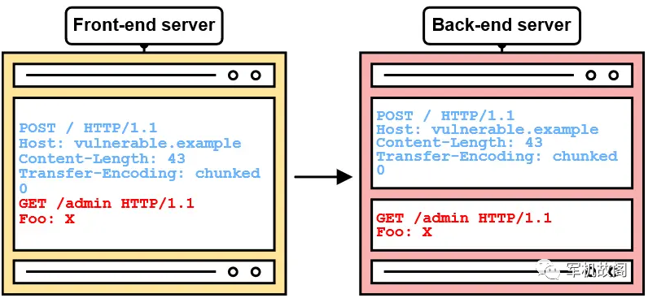

再说 SMTP 走私，SMTP 会话一般如下：

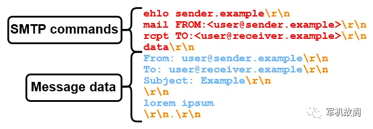

同 HTTP 请求走私一样，SMTP 走私的基本思想就是：

当 SMTP 对数据结束部分数据（`<CR><LF><CR><LF>`）有不同解释时，就会发生 SMTP 走私，如果 SMTP 服务器对消息数据结束的位置有不同的理解，攻击者可能会破坏消息数据。还可能执行指定任意 SMTP 命令，甚至发送单独的电子邮件。  

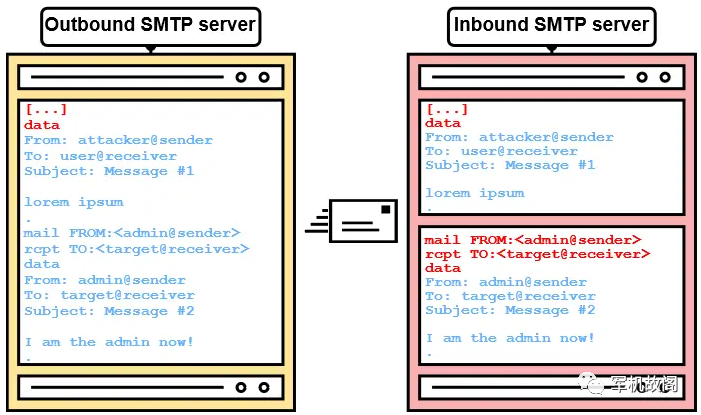

如下是用于分析出站 SMTP 服务器的 SMTP 分析设置  

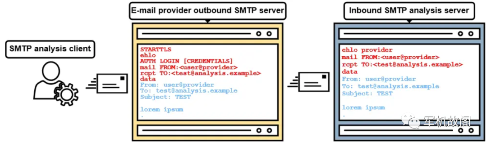

我们在支持通过 SMTP 提交邮件的各电子邮件提供商注册电子邮件帐户（与 Tutanota 和 ProtonMail 不同），这个研究项目使用了以下提供商:

*   outlook.com 
    
*   gmail.com 
    
*   gmx.net 
    
*   icloud.com 
    
*   zoho.com 
    
*   fastmail.com 
    
*   runbox.com 
    
*   startmail.com 
    
*   mailbox.org 
    
*   aol.com 
    
*   yahoo.com 
    
*   web.de 
    

通过向这些提供商的出站 SMTP 服务器发送电子邮件，并在入站 SMTP 分析服务器上接收，我们可以看到 SMTP 协议实现的初步差异。

查看 SMTP 分析客户端后，可以立即看到一些 SMTP 产品与其他产品 “不同”。例如，以下是发送 DATA SMTP 命令后从电子邮件提供商收到的响应：

*   -250 以 `<CR><LF>.<CR><LF>` 结束数据
    
*   -250 开始邮件输入；以 `<CRLF>.<CRLF>` 结束数据
    
*   -250 以 `<CRLF>.<CRLF>` 结尾并发送数据
    

这结果的 SMTP 走私漏洞测试来说并不理想

经过进一步分析，一些 SMTP 服务器返回了以下更有希望的响应：

*   - 输入消息，以 "." 结尾，一行一个
    
*   - 输入邮件，以 "." 结尾，一行一个
    

这个就很有价值了，因不同的操作系统对 “行” 有不同的理解。Windows 上的 "." 行将通过两个回车换行符 (`<CR><LF>.<CR><LF>` 或 \r\n.\r\n) 进行分隔，而 Linux 上的 "." 行将通过两个换行符 (`<LF>.<LF>` 或 \n.\n) 进行分隔。

因此，我们试着使用 `<LF>.<LF>` 来结束电子邮件的消息数据，如下

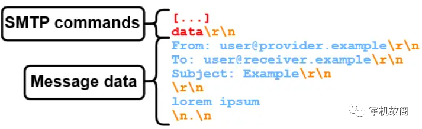

所以每当入站 SMTP 服务器支持 `<LF><LF>` 作为数据序列结束时，只有 “lorem ipsum” 将成为消息数据的一部分，否则消息还包括“此服务器将换行符视为数据序列结束”。

但是，我们实际上可以用它实现什么？来看看如果没有结束数据部分，消息传输会是什么样子，如图：

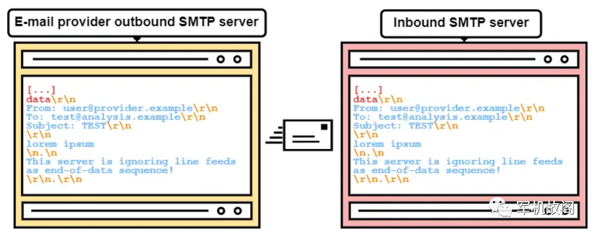

因此，对于这种情况，我们将需要确保在数据发送完毕后发送正确的结束序列，根据接收入站 SMTP 服务器的不同，这可能是完全无害的。但是，如果入站 SMTP 服务器将 `<LF><LF >` 解释为数据序列结束呢？

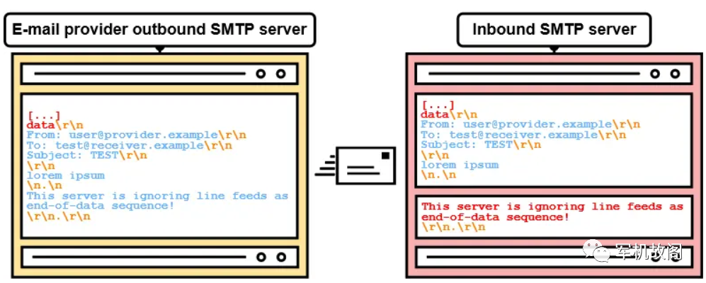

在这种情况下，就会破坏消息数据，而 “此服务器将换行视为数据结束序列” 现在可能被解释为 SMTP 命令。请注意，这要求入站服务器接受批量中的多个 SMTP 命令，即所谓的 SMTP 流水线。幸运的是，现在大多数服务器都支持这一点。

而出站 SMTP 服务器通常通过不同的方式处理这种 “麻烦的” 序列：

*   "点" 填充（用另一个点来转义单个点）：`<LF>..<LF>`
    
*   用 `<CR><LF>` 替换它
    
*   对其进行编码（例如，通过可打印的引号）：=0A.=0A
    
*   删除整个序列
    
*   不发送消息
    
*   也有直接被丢弃的情况
    

所以，从本质上讲，我们正在寻找出站和入站 SMTP 服务器在数据序列处理方面的特定特征。更准确地说，我们正在寻找出站 SMTP 服务器忽略的内容（例如，`<LF>`,`<LF>`）以及入站 SMTP 服务器解释的内容（例如，`<LF>`,`<LF>` 作为数据结束）。如果我们能找到正确的组合，我们就可以正式的进行 SMTP 走私漏洞的利用了。

第一次成功：

如前所述，我们在各种 email 提供商处创建了 email 帐户。批量从出站提供商 SMTP 服务器向 SMTP 分析服务器发送潜在的数据结束序列（例如 LF>,`<LF>`）后不久，第一个漏洞受害者出现了。

GMX 成立于 1997 年，是 DACH 地区的老牌电子邮件提供商之一，拥有大约 2000 万用户。当向 GMX SMTP 服务器发送序列时，它会被未经筛选地传递到入站 SMTP 服务器，如下图

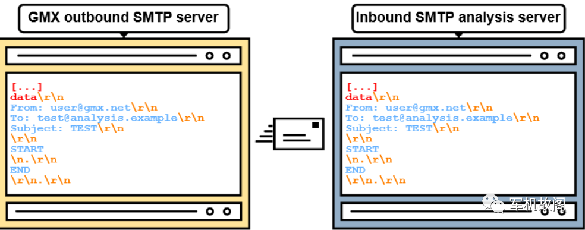

因此，如果 `<LF><CR><LF >` 被解释为数据结束序列，我们现在可以在入站 SMTP 服务器上解析消息数据。

我们继续向所有已注册的电子邮件地址发送一封包含以下消息数据的电子邮件

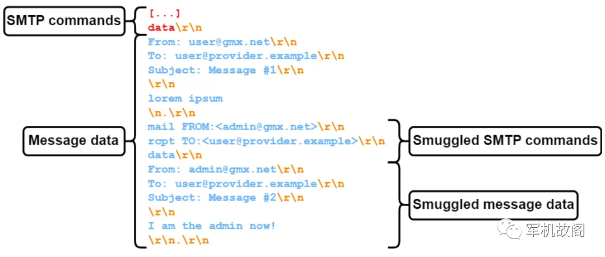

测试结果发现，很多中招的，我们收到了下面这种邮件，也说明并没有结束邮件数据，是存在 SMTP 走私漏洞的。

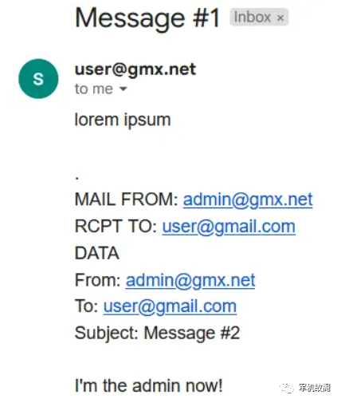

****甚至发现了更严重的情况，从 GMX 到 Fastmail 的 SMTP 走私漏洞成功后，接管了管理员，如下：  
****

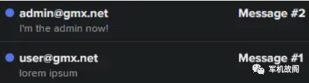

通过检查邮件头部，我们可以看到 SPF 检查与 gmx.net 的域名对齐的, 这是因为走私的邮件实际上来自合法的 GMX SMTP 服务器。

```
Received-SPF: pass
(gmx.net: 212.227.15.15 is authorized to use 'admin@gmx.net' in 'mfrom' identity (mechanism 'ip4:212.227.15.0/25' matched))
receiver=mx4.messagingengine.com;
identity=mailfrom;
envelope-from="admin@gmx.net";
helo=mout.gmx.net;
client-ip=212.227.15.15

```

由于我们已实现 gmx.net 的域名对齐，这封电子邮件很可能会通过垃圾邮件过滤器，即使使用严格的 DMARC 策略也不行，**而且如果其他域名也使用 GMX 的出站 SMTP 服务器发送电子邮件**，我们也可以欺骗它们，通过分析 web.de 的 SPF 记录，我们可以看到 GMX 的出站 SMTP IP 地址 212.227.15.15 也被包括在内。

v=spf1 ip4:212.227.126.128/25 ip4:212.227.15.0/25 ip4:212.227.17.0/27 ip4:217.72.192.248/29 ip4:82.165.159.0/26 ip4:217.72.207.0/27 ip4:217.72.192.64/26 ip4:82.165.229.130 ip4:82.165.230.22 ~all

现在，我们可以相应地更改 SMTP 走私消息数据，实现跨域走私，如下

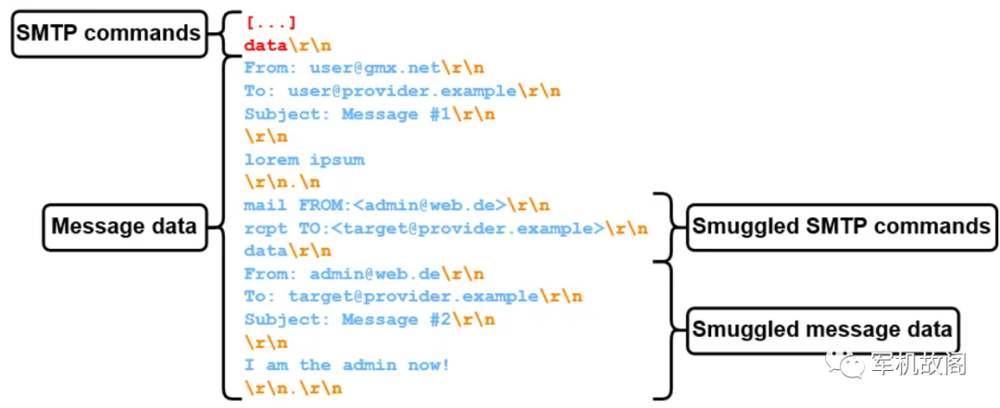

将消息指定了一个不同的接收方电子邮件地址，并只向目标发送走私的消息。使用 web.de 作为发件人域成功地将跨域 SMTP 从 GMX 走私到 Fastmail。如下

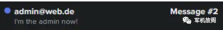

在这种情况下，我们的目标甚至获取相关管理员的个人资料图片，如下为 admin@web.de 真实的个人资源：

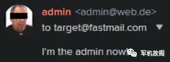

SPF 验证结果也出来了：

```
Received-SPF: pass 
 (web.de: 212.227.17.22 is authorized to use 'admin@web.de' in 'mfrom' identity (mechanism 'ip4:212.227.17.0/27' matched)) 
 receiver=mx4.messagingengine.com; 
 identity=mailfrom; 
 envelope-from="admin@web.de"; 
 helo=mout.gmx.net; 
 client-ip=212.227.17.22

```

**但这才是个开始**：

我们最初只分析了 GMX，但问题比设想要严重得多。与许多大型电子邮件提供商一样，GMX 正在使用名为 NemesisSMTPd 的自定义 SMTP 服务器。由于 GMX 是 Ionos 的一部分，Ionos 提供的电子邮件服务也使用 Nemesis SMTPd。我们在 Ionos 注册了一个电子邮件域，并检查 SMTP 走私是否有效。漏洞可以正常触发，但通过自定义电子邮件域走私似乎并不是必要的。注册的电子邮件域的 SPF 记录包括 “_spf-eu.ionos.com”，gmx.net 的 SPF 记录包括 “_spf.gmx.net”。查看允许的 IP 范围：

```
$dig _spf-eu.ionos.com TXT 
"v=spf1 ip4:212.227.126.128/25 ip4:212.227.15.0/25 ip4:212.227.17.0/27 ip4:82.165.159.0/26 ip4:217.72.192.64/26 ?all" 
 $dig _spf.gmx.net TXT 
"v=spf1 ip4:212.227.126.128/25 ip4:212.227.15.0/25 ip4:212.227.17.0/27 ip4:82.165.159.0/24 ip4:74.208.4.192/26 ip4:217.72.207.0/27 ip4:82.165.229.31 ip4:82.165.230.21 ip4:213.165.64.0/23 ip4:74.208.5.64/26 ~all"

```

所以，无论哪种方式，这不仅允许欺骗 gmx.net 和 web.de，还允许欺骗 Ionos 托管的一百万个其他域名，但稍后将详细介绍

**通过微软 exchange 进行走私漏洞利用：  
**

在对出站 SMTP 服务器进行更深入的分析后，发现 Microsoft Outlook（outlook.com）SMTP 服务器的一个特性。在尝试发送序列时，返回以下错误消息：

远程服务器返回 “550 5.6.11 SMTPSEND.BareLinefeedsAreIllegal；邮件包含纯换行符，无法通过 DATA 发送，并且接收系统不支持 BDAT”

然而，与 GMX 一样，Outlook 不会过滤序列。

不过，与 GMX 一样，无法向相同的接收者（例如 Fastmail）走私。原因是 Outlook 使用了可选的 BDAT SMTP 命令。BDAT 是 DATA 命令的替代方案，用于传输消息数据。它的工作原理是使用 BDAT 命令指定消息长度，而不是依赖于数据结束序列。例如，要传输 72 个字节的消息数据，如下图为通过 BDAT 发送消息数据。

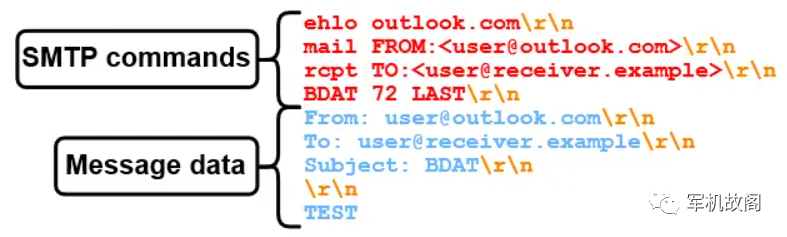

即使这阻止了我们向某些入站 SMTP 服务器进行走私，但如果入站 SMTP 服务器支持 BDAT 命令，则 BDAT 命令只能由 Outlook 使用。如果入站 SMTP 服务器没有通过返回 CHUNKING 扩展来表明支持 BDAT（原文误写为 POOLING），则使用 DATA 作为后备。

因此，我们寻找一个入站 SMTP 服务器，会解释数据结束序列，并且不支持 BDAT。

有趣的是，sec-consult.com SMTP 服务器支持这一点。而且请注意，互联网上有很多服务器支持这一点，但既然我们必须确保我们自己的系统是安全的，所以选择使用 sec-consult.com 来测试，向同事发送欺骗性电子邮件，如下为通过 SMTP 走私从 admin@outlook.com 发送钓鱼邮件。

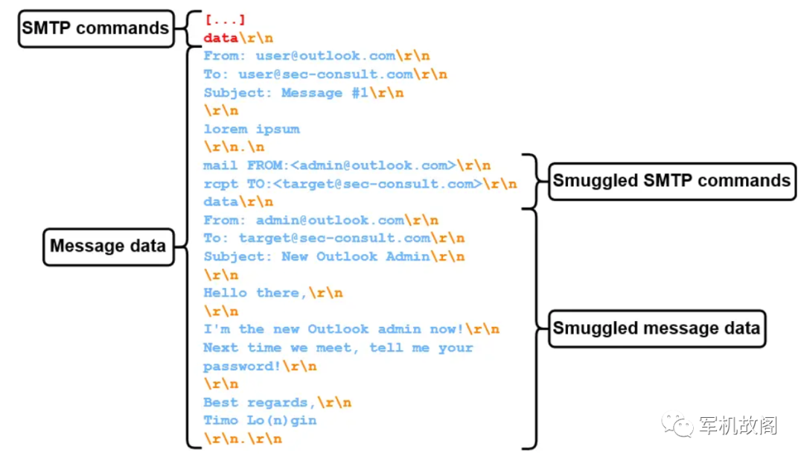

来自 admin（at）outlook.com 的消息确实被送达了，并没有被当作垃圾邮件，并且还回复了我哈哈。

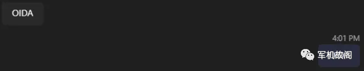

邮件显示如下：  

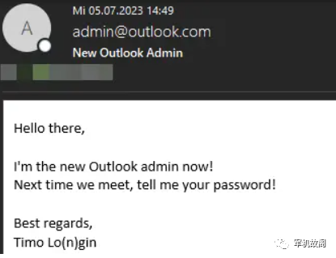

我们可以通过查看消息头再次确认 SPF 对齐情况：

```
Received-SPF: Pass (mx3.atos.net: domain of admin(at)outlook.com designates 40.92.75.68 as permitted sender) 
  identity=mailfrom; client-ip=40.92.75.68; 
  receiver=mx3.atos.net; envelope-from="admin@outlook.com"; 
  x-sender="admin@outlook.com"; x-conformance=spf_only; 
  x-record-type="v=spf1"; x-record-text="v=spf1 
  ip4:40.92.0.0/15 ip4:40.107.0.0/16 ip4:52.100.0.0/14 
  ip4:104.47.0.0/17 ip6:2a01:111:f400::/48 
  ip6:2a01:111:f403::/49 ip6:2a01:111:f403:8000::/50 
  ip6:2a01:111:f403:c000::/51 ip6:2a01:111:f403:f000::/52 -all" 

```

由于之前的例子都是基于文本的，攻击者还可以使用 HTML，制作一些更具说服力的钓鱼邮件：

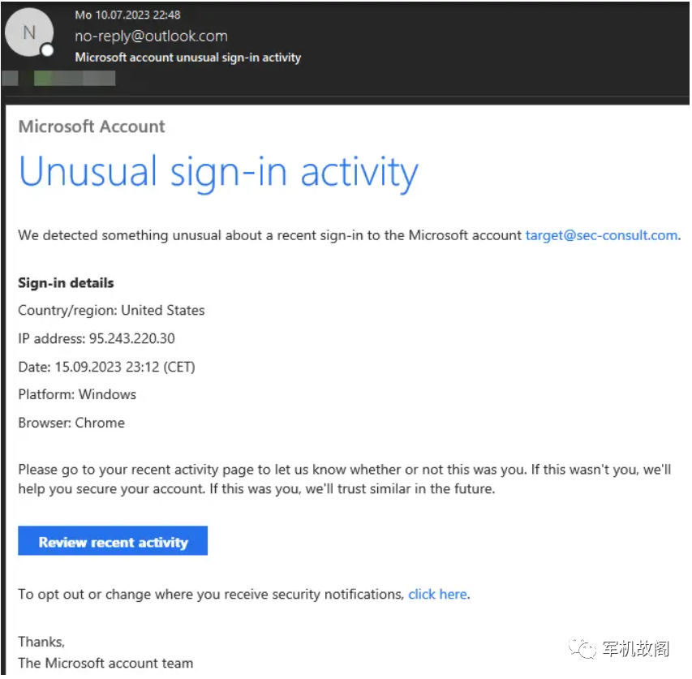

由于出站 Outlook SMTP 服务器不仅用于 outlook.com 的电子邮件，还用于整个 Exchange Online，我们现在可以从使用 Exchange Online 的每个域发送电子邮件！

由于这会影响许多公司（如稍后在 SMTP 走私影响部分中讨论的那样），我们可以自由选择我们的发件人域。我们甚至可以使用 sec-consult.com 本身！

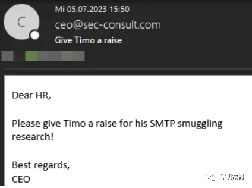

与之前一样，SPF 检查在域对齐方面成功，因为 sec-consult.com 正在使用 Exchange Online，并且 SPF 记录中包含各自的 Exchange Online SPF 域 spf.protection.outlook.com。

```
Received-SPF: Pass (mx4.atos.net: domain of ceo(at)sec-consult.com 
  designates 40.92.48.103 as permitted sender) 
  identity=mailfrom; client-ip=40.92.48.103; 
  receiver=mx4.atos.net; envelope-from="ceo@sec-consult.com"; 
  x-sender="ceo@sec-consult.com"; x-conformance=spf_only; 
  x-record-type="v=spf1"; x-record-text="v=spf1 
  ip4:40.92.0.0/15 ip4:40.107.0.0/16 ip4:52.100.0.0/14 
  ip4:104.47.0.0/17 ip6:2a01:111:f400::/48 
  ip6:2a01:111:f403::/49 ip6:2a01:111:f403:8000::/50 
  ip6:2a01:111:f403:c000::/51 ip6:2a01:111:f403:f000::/52 -all" 

```

**通过 Amazon,PayPal,eBay... 进行 CISCO 走私漏洞利用：  
**

我们批量使用扫描程序，扫描程序会向入站 SMTP 服务器发送电子邮件，但会使用特殊的数据结束序列。如果与入站 SMTP 服务器的连接超时，则说明忽略特殊的数据结束序列。否则，可能会存在 SMTP 走私漏洞。  

payloda 的可以用：

数据序列结尾中断：  
`<CR><LF>\x00.<CR><LF>  `
`<CR><LF>.\x00<CR><LF>  `
使用不完整 CRLF 的数据结尾序列:  
`<LF> <LF>  `
`<CR><LF>.<CR>  `
`<CR> <LF>  `
消息头中的数据结尾序列等

比如利用空字节结尾数据如下：  

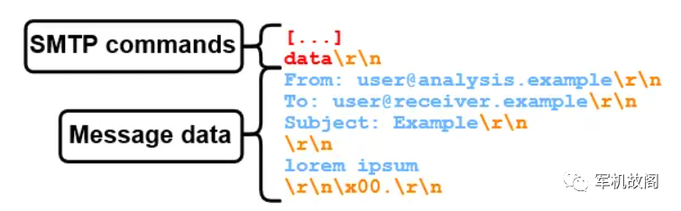

现在，通过扫描前 Alexa Top 1000，识别出了接受此类序列的各种入站 SMTP 服务器！但是，这些序列中似乎只有一个对许多 SMTP 服务器有效：`<CR><CR>`

这个序列被一些真正高价值目标的入站电子邮件服务器接受：

*   Amazon
    
*   PayPal
    
*   eBay
    
*   Cisco
    
*   The IRS
    

  
他们都有一个共同点，那就是他们使用**思科安全电子邮件**，使用思科安全电子邮件网关或基于云的安全电子邮件网关。而且，出于某种奇怪的原因，sec-consult.com 也在使用思科安全电子邮件网关。

，们现在可以从 admin(at)icloud.com 向我们的目标 sec-consult.com 发送电子邮件，因为与许多其他出站 SMTP 服务器一样（在 SMTP 走私影响中进一步讨论），`<CR><CR >` 不会被过滤，POC 如下（结尾使用 < CR>.`<CR>`）：

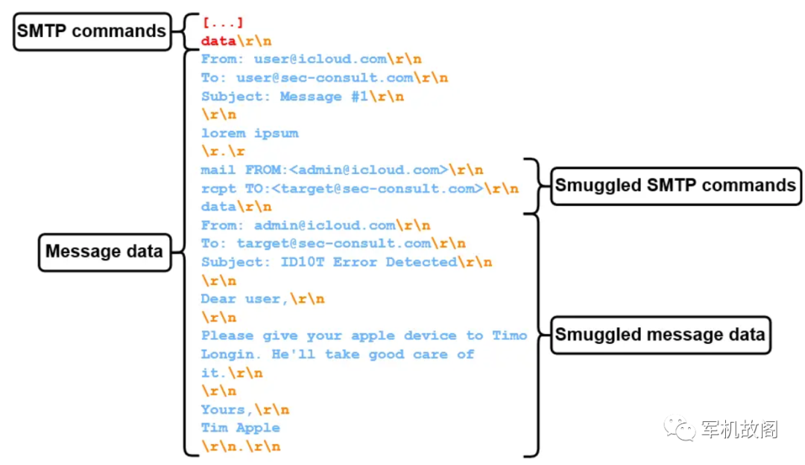

效果有多好呢，如下为伪造为 admin@icloud.com 发邮件：

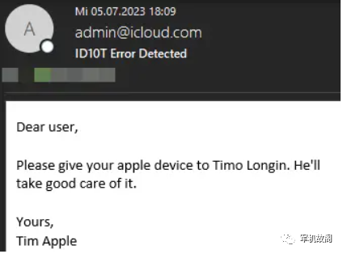

当然，SPF 检查在域对齐方面没有任何问题

```
Received-SPF: Pass (mx4.atos.net: domain of admin(at)icloud.com 
  designates 17.57.155.23 as permitted sender) 
  identity=mailfrom; client-ip=17.57.155.23; 
  receiver=mx4.atos.net; envelope-from="admin@icloud.com"; 
  x-sender="admin@icloud.com"; x-conformance=spf_only; 
  x-record-type="v=spf1"; x-record-text="v=spf1 
  ip4:17.58.0.0/16 ip4:17.57.155.0/24 ip4:17.57.156.0/24 
  ip4:144.178.36.0/24 ip4:144.178.38.0/24 ip4:112.19.199.64/29 
  ip4:112.19.242.64/29 ip4:222.73.195.64/29 ip4:157.255.1.64/29 
  ip4:106.39.212.64/29 ip4:123.126.78.64/29 
  ip4:183.240.219.64/29 ip4:39.156.163.64/29 ~all" 

```

也因些，DMARC 也通过了：

```
Authentication-Results-Original: mx4.atos.net; dkim=none (message not signed) 
 header.i=none; spf=Pass smtp.mailfrom=admin@icloud.com; spf=None 
 smtp.helo=postmaster@qs51p00im-qukt01080502.me.com; dmarc=pass (p=quarantine 
 dis=none) d=icloud.com

```

并且有个 cisco 的利用点，我们可以影响到全球。  

**漏洞影响：**

**简单统计了下：**  

通过 **GMX 和 Ionos** 电子邮件服务进行 SMTP 走私允许来自大约 135 万个不同域的 SMTP 走私，且 MX 记录到 Ionos，以下这些 SPF 记录都允许_spf-eu.ionos.com 发送电子邮件

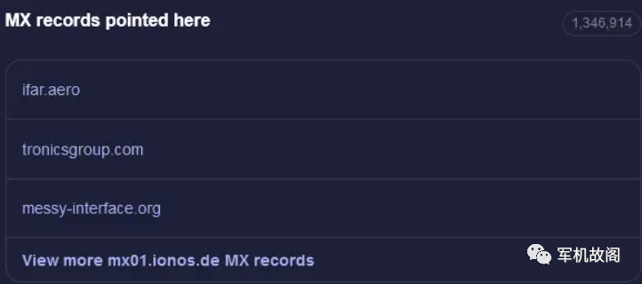

支持入站 SMTP 服务：**Fastmail , Runbox**，不过在对一些流行的电子邮件软件的默认配置进行测试后，发现 Postfix 和 Sendmail 可以走私。从全球来看涉及到很多很多。

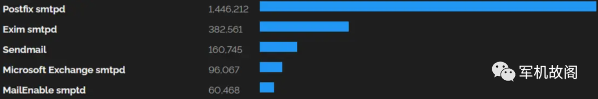

**微软 Exchange：**

这两个巨头影响就更大了，涉及域名过百万，还有些价值非常高的目标，如 microsoft .com、msn.com、github.com、outlook.com、office365.com、openai.com 等，还有客户的域，如 tesla.com、mastercard.com、nike.com 等，在 shodan 上简单搜了下设计 postifix 的，如下：

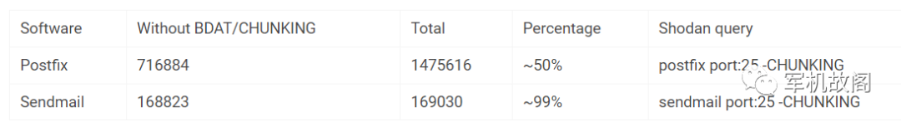

**CISCO 思科电子邮件网关 / 云网关：**

思科安全电子邮件网关及其云对应产品思科安全电子邮件云网关均 “易受攻击”。简单通过 DNS 被动数据库里找了下，大概 4 万条涉及的域名，其实中 Alexa TOP 1000 中有至少以下 35 个，这还是不考虑没有 MX 记录的服务，更没找 SMTP 服务器：

*   amazon.com 
    
*   amazon.co.jp 
    
*   amazon.co.uk 
    
*   amazon.it 
    
*   amazon.fr 
    
*   marriott.com 
    
*   cisco.com 
    
*   amazon.co.jp 
    
*   amazon.in 
    
*   paypal.com 
    
*   amazon.ca 
    
*   goodreads.com 
    
*   webex.com 
    
*   custhelp.com 
    
*   amazon.in 
    
*   imdb.com 
    
*   intuit.com 
    
*   ndtv.com 
    
*   amazon.cn 
    
*   makemytrip.com 
    
*   amazon.com.au 
    
*   amazon.com 
    
*   amazonaws.com 
    
*   primevideo.com 
    
*   amazon.es 
    
*   irs.gov 
    
*   amazon.com.br 
    
*   aastocks.com 
    
*   ebay.com 
    
*   amazon.de 
    
*   ebay.de 
    
*   ebay.co.uk 
    
*   ebay.com.au 
    
*   mayoclinic.org 
    
*   audible.com
    

更多：  

在测试过程中，发现很多奇特的入站 SMTP 服务器，解释数据规则也很多，还有很多探索空间

---

> 来源：MrWQ/vulnerability-paper（https://github.com/MrWQ/vulnerability-paper）
